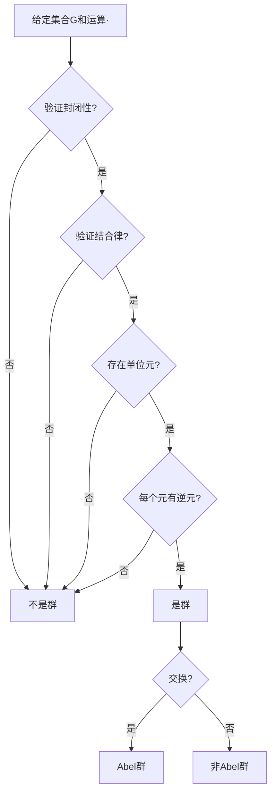
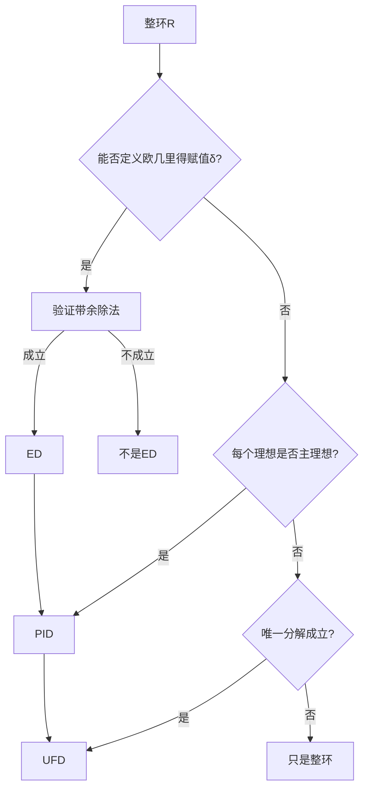
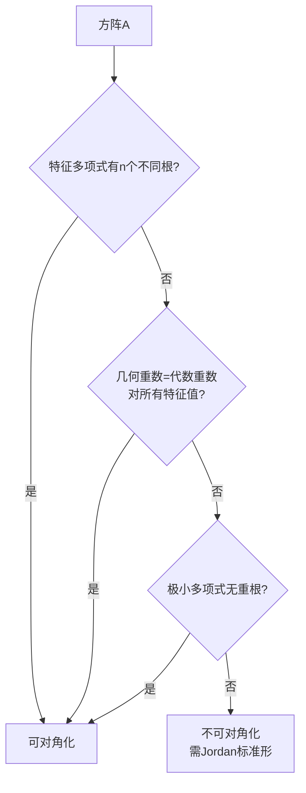
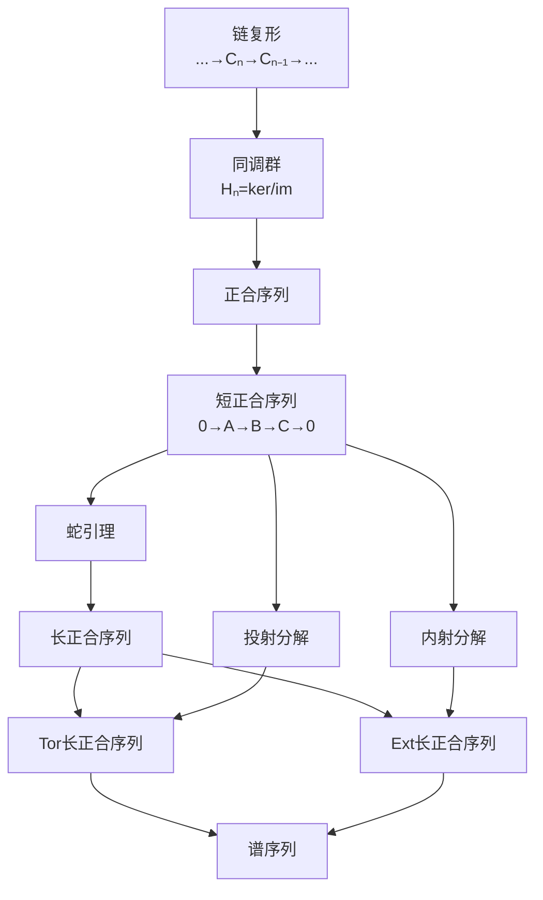
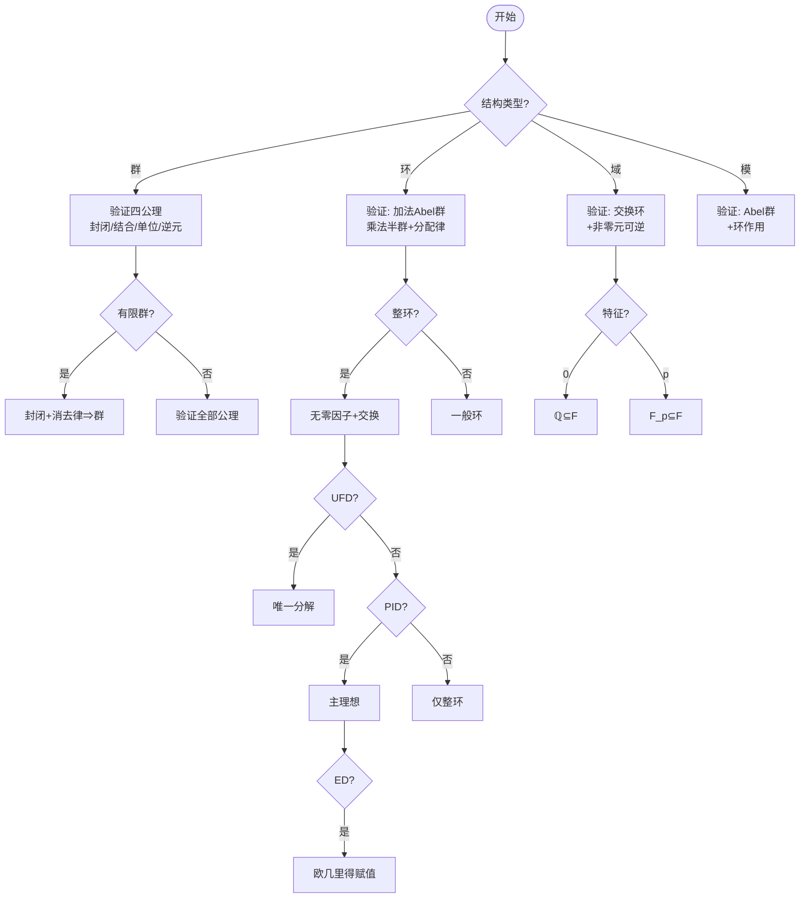

# 代数学推理判断树

## 概述

本文档构建代数学的完整推理链条，涵盖群论、环论、域论、线性代数、同调代数五大核心领域，共约120个核心定理，15个Mermaid推理图。

---

## 一、群论推理树

### 1.1 群公理系统与基本性质

```

群公理系统
├── 封闭性公理：∀a,b∈G, a·b∈G
├── 结合律公理：(a·b)·c = a·(b·c)
├── 单位元公理：∃e∈G, ∀a∈G, e·a = a·e = a
└── 逆元公理：∀a∈G, ∃a⁻¹∈G, a·a⁻¹ = a⁻¹·a = e

```

**定理 G1：群的基本性质**

| 性质 | 内容 | 证明思路 |
|-----|------|---------|
| 单位元唯一性 | 群中有且仅有一个单位元 | 假设e,e'都是单位元，则e=e·e'=e' |
| 逆元唯一性 | 每个元素的逆元唯一 | 假设b,c都是a的逆元，则b=b·e=b·(a·c)=(b·a)·c=e·c=c |
| 消去律 | a·b=a·c ⇒ b=c | 两边左乘a⁻¹，得a⁻¹·(a·b)=a⁻¹·(a·c)，由结合律和逆元性质得b=c |
| 穿脱原理 | (a·b)⁻¹ = b⁻¹·a⁻¹ | 验证(a·b)·(b⁻¹·a⁻¹)=a·(b·b⁻¹)·a⁻¹=a·e·a⁻¹=e |

**证明思路详解（逆元唯一性）**：

1. 假设b和c都是a的逆元，即a·b=b·a=e且a·c=c·a=e
2. 考虑b = b·e（单位元性质）
3. = b·(a·c)（因为c是a的逆元）
4. = (b·a)·c（结合律）
5. = e·c（因为b是a的逆元）
6. = c（单位元性质）
7. 因此b=c，逆元唯一

### 1.2 子群推理链

**定理 G2：子群判别定理**

**定理 G2-1：子群判别法（一阶条件）**

- **陈述**：H ⊆ G 是子群 ⟺ ① H ≠ ∅；② ∀a,b∈H, a·b⁻¹∈H
- **证明思路**：
  - (⇒) 子群继承群的运算和逆元，条件显然满足
  - (⇐) 由条件②：取a=b得e∈H；取a=e得b⁻¹∈H；由a·(b⁻¹)⁻¹=a·b∈H得封闭性
- **父节点**：群公理
- **子节点**：子群交定理、生成子群
- **判断逻辑**：**验证子群的最简条件**

**证明思路详解**：

1. 验证单位元存在：取a=b∈H（H非空），则a·a⁻¹=e∈H
2. 验证逆元存在：取a=e, b=x∈H，则e·x⁻¹=x⁻¹∈H
3. 验证封闭性：取a,b∈H，已知b⁻¹∈H，则a·(b⁻¹)⁻¹=a·b∈H
4. 结合律继承自G，故H是子群

**定理 G2-2：子群判别法（有限子群）**

- **陈述**：H是G的有限非空子集，H对运算封闭 ⟹ H是子群
- **证明思路**：有限半群满足消去律必为群。由于G是群，消去律在G中成立，故在H中也成立
- **父节点**：子群判别法（G2-1）
- **边界条件**：有限性条件不可省略（反例：(ℤ⁺,+)封闭但无逆元）

**定理 G3：子群运算性质**

- **子群交定理**：任意个子群的交仍是子群
- **子群并定理**：H∪K是子群 ⟺ H⊆K 或 K⊆H
- **生成子群**：⟨S⟩ = ∩{H ≤ G : S ⊆ H}，即包含S的最小子群

### 1.3 Lagrange定理链

```

Lagrange定理推理链
├── 陪集分解
│   ├── 左陪集：aH = {ah : h∈H}
│   ├── 右陪集：Ha = {ha : h∈H}
│   └── 陪集性质：aH=bH ⟺ a⁻¹b∈H
├── 指数定义：[G:H] = 陪集个数
└── Lagrange定理
    ├── 陈述：[G:H]·|H| = |G|
    └── 推论：|H| 整除 |G|

```

**定理 G4：Lagrange定理**

- **陈述**：G是有限群，H ≤ G，则 |G| = [G:H]·|H|

- **证明思路**：
  1. 证明所有陪集大小相等：|aH| = |H|（由消去律，映射h↦ah是双射）

  2. 证明陪集划分G：G = ⊔aH（不交并），即任意两个陪集要么相等要么不交
  3. 计数即得结论：|G| = Σ|aᵢH| = [G:H]·|H|

- **父节点**：陪集定义、群作用
- **子节点**：Euler定理、Fermat小定理、Cauchy定理
- **判断逻辑**：**有限群论的核心工具**

**证明思路详解（陪集划分）**：

1. 证明aH=bH ⟺ a⁻¹b∈H：
   - (⇒) 若aH=bH，则存在h₁,h₂∈H使ah₁=bh₂，故a⁻¹b=h₁h₂⁻¹∈H
   - (⇐) 若a⁻¹b=h∈H，则b=ah，故bH=ahH=aH（因为hH=H）
2. 证明陪集不交：若x∈aH∩bH，则x=ah₁=bh₂，故a⁻¹b=h₁h₂⁻¹∈H，从而aH=bH

**定理 G4-1：Lagrange定理的推论**

- **元素阶整除群阶**：|⟨a⟩| = ord(a) 整除 |G|

- **Euler定理**：a^φ(n) ≡ 1 (mod n)，(a,n)=1
- **Fermat小定理**：a^(p-1) ≡ 1 (mod p)，p∤a

### 1.4 正规子群与商群

**定理 G5：正规子群判别**

**等价条件**（H ≤ G）：

1. ∀g∈G, gHg⁻¹ = H
2. ∀g∈G, gH = Hg（左右陪集相等）
3. ∀g∈G, h∈H, ghg⁻¹∈H
4. G/H 上有良定的群运算

- **父节点**：共轭作用定义、陪集运算
- **子节点**：商群构造、同态基本定理
- **判断逻辑**：**判断商群可构造性的关键**

**证明思路详解（等价条件证明）**：

1. (1)⇔(2)：gHg⁻¹=H ⟺ gH=Hg（两边右乘g）
2. (2)⇔(3)：gH=Hg ⟺ gh=h'g对某个h'∈H ⟺ ghg⁻¹=h'∈H
3. (2)⇔(4)：运算良定要求(aH)(bH)=(ab)H。若aH=a'H, bH=b'H，需证(ab)H=(a'b')H。这等价于ab(a'b')⁻¹∈H，即ab(b')⁻¹(a')⁻¹∈H。由条件(2)，Hb=bH，故存在h使bh'=hb，从而可调整顺序使条件满足

**定理 G6：商群定理**

- **陈述**：H ⊲ G，则 G/H = {gH : g∈G} 是群，运算 (aH)(bH) = (ab)H
- **证明要点**：验证运算良定性——若aH=a'H, bH=b'H，则(ab)H=(a'b')H
- **父节点**：正规子群定义
- **子节点**：同态基本定理、合成列

### 1.5 同态基本定理链

```

同态基本定理体系
├── 同态定义：φ(ab) = φ(a)φ(b)
├── 基本性质
│   ├── φ(e_G) = e_H
│   ├── φ(a⁻¹) = φ(a)⁻¹
│   └── φ(G) ≤ H（像的子群性）
├── 核的定义：ker φ = {g∈G : φ(g)=e}
├── 核的性质：ker φ ⊲ G（核必正规）
└── 同态基本定理
    ├── 第一同构定理：G/ker φ ≅ im φ
    ├── 第二同构定理：H/(H∩N) ≅ HN/N
    └── 第三同构定理：(G/N)/(M/N) ≅ G/M

```

**定理 G7：同态基本定理（第一同构定理）**

- **陈述**：φ: G → H 是群同态，则 G/ker φ ≅ im φ
- **证明思路**：
  1. 构造映射 ψ: G/ker φ → im φ，ψ(g·ker φ) = φ(g)
  2. 验证良定性：g·ker φ = g'·ker φ ⟺ g⁻¹g'∈ker φ ⟺ φ(g⁻¹g')=e ⟺ φ(g)=φ(g')
  3. 验证同态性：ψ((a·ker φ)(b·ker φ)) = ψ(ab·ker φ) = φ(ab) = φ(a)φ(b) = ψ(a·ker φ)ψ(b·ker φ)
  4. 验证双射：满射显然，单射由核的定义保证
- **父节点**：正规子群、商群构造
- **子节点**：所有群同构证明的核心工具
- **判断逻辑**：**证明群同构的首选方法**

**定理 G7-2：第二同构定理**

- **陈述**：H ≤ G, N ⊲ G，则 H/(H∩N) ≅ HN/N
- **证明思路**：考虑同态 φ: H → G/N, φ(h)=hN，应用第一同构定理
- **父节点**：第一同构定理
- **应用**：分析子群与正规子群的关系

**定理 G7-3：第三同构定理**

- **陈述**：N ⊲ G, M ⊲ G, N ⊆ M，则 (G/N)/(M/N) ≅ G/M
- **证明思路**：考虑自然同态 G/N → G/M, gN ↦ gM，应用第一同构定理
- **父节点**：第一同构定理
- **应用**：商群的商群结构

### 1.6 群作用与Sylow定理

**定理 G8：群作用基本定理**

**轨道-稳定子定理**：G作用在X上，x∈X，则 |Orb(x)| = [G : Stab(x)]

- **轨道**：Orb(x) = {g·x : g∈G}
- **稳定子**：Stab(x) = {g∈G : g·x = x}

- **证明思路**：建立双射 φ: G/Stab(x) → Orb(x)，φ(g·Stab(x)) = g·x
  - 良定性：gStab(x)=hStab(x) ⟺ h⁻¹g∈Stab(x) ⟺ h⁻¹g·x=x ⟺ g·x=h·x
  - 单射：由良定性证明的逆向可得
  - 满射：对任意y∈Orb(x)，存在g使y=g·x，则φ(gStab(x))=y
- **父节点**：Lagrange定理
- **子节点**：Burnside引理、Sylow定理

**定理 G9：Sylow定理**

**Sylow第一定理**：|G| = pⁿ·m，(p,m)=1，则G有Sylow p-子群（阶为pⁿ的子群）

- **证明思路**：
  1. 考虑G的所有pⁿ元子集构成的集合X
  2. G通过左乘作用在X上
  3. |X| = C(pⁿm, pⁿ) ≡ m (mod p)（Lucas定理）
  4. 故存在轨道Orb(S)使得|Orb(S)|不被p整除
  5. 由轨道-稳定子定理，|Stab(S)| = |G|/|Orb(S)|被pⁿ整除

  6. 验证Stab(S)就是Sylow p-子群

**Sylow第二定理**：所有Sylow p-子群互相共轭

- **证明思路**：设P,Q是Sylow p-子群，考虑P在G/Q的陪集上的作用，证明有不动点

**Sylow第三定理**：n_p ≡ 1 (mod p) 且 n_p | m，其中n_p是Sylow p-子群个数

- **证明思路**：
  1. 所有Sylow p-子群共轭，故n_p = [G : N_G(P)]
  2. 考虑P在Sylow p-子群集合上的共轭作用
  3. P有唯一不动点{P}本身，故n_p ≡ 1 (mod p)

- **父节点**：群作用、轨道-稳定子定理
- **子节点**：有限单群分类的基础
- **判断逻辑**：**分析有限群结构的强有力工具**

### 1.7 群分类理论

**定理 G10：有限单群分类**

- **定义**：没有非平凡正规子群的群
- **分类定理**：有限单群分为
  1. 循环群ℤ/pℤ（p素数）
  2. 交错群A_n（n≥5）
  3. Lie型单群（16个无穷族）
  4. 26个散在单群

**定理 G11：可解群判别**

- **定义**：存在合成列1=G₀◁G₁◁...◁G_n=G使得G_{i+1}/G_i是Abel群
- **等价条件**：G可解 ⟺ 导出列终止于{1}
- **Burnside定理**：p^aq^b阶群可解（p,q为素数）

---

## 二、环论推理树

### 2.1 环公理系统

```

环公理系统
├── 加法群结构 (R, +)
│   ├── 结合律
│   ├── 交换律
│   ├── 零元
│   └── 负元
├── 乘法半群结构 (R, ·)
│   ├── 结合律
│   └── 单位元（含幺环）
└── 分配律
    ├── a·(b+c) = a·b + a·c
    └── (a+b)·c = a·c + b·c

```

**定理 R1：环的基本性质**

- **陈述**：在环R中，对任意a,b∈R：
  1. 0·a = a·0 = 0
  2. (-a)·b = a·(-b) = -(a·b)
  3. (-a)·(-b) = a·b
- **证明思路（以第一条为例）**：
  1. 0·a = (0+0)·a = 0·a + 0·a（分配律）
  2. 两边加-(0·a)得0 = 0·a

### 2.2 子环与理想

**定理 R2：子环判别定理**

- **陈述**：S ⊆ R 是子环 ⟺ ① S ≠ ∅；② ∀a,b∈S, a-b∈S；③ ∀a,b∈S, ab∈S
- **证明思路**：验证(S,+)是子群，(S,·)是半群，分配律继承

**定理 R3：理想判别定理**

**定义**：I ⊆ R 是理想 ⟺

1. (I,+)是(R,+)的子群
2. ∀r∈R, a∈I, ra∈I（左理想）且 ar∈I（右理想）
3. 双边理想同时满足左右吸收性

**证明思路详解**：

1. 理想是特殊的子环，多了吸收性质
2. 在交换环中，左理想=右理想=双边理想
3. 理想的核ker φ = {r∈R : φ(r)=0}对任意环同态φ都是双边理想

**定理 R3-1：理想的运算**

- **理想的交**：任意个理想的交仍是理想
- **理想的和**：I+J = {a+b : a∈I, b∈J} 是理想
- **理想的积**：IJ = {有限和∑aᵢbᵢ : aᵢ∈I, bᵢ∈J} 是理想
- **证明思路**：验证理想定义的三个条件

**定理 R4：商环定理**

- **陈述**：I ◁ R（I是R的理想），则 R/I = {a+I : a∈R} 是环
- **证明要点**：
  1. (R/I,+)是商群（因(R,+)是Abel群）
  2. 验证乘法良定性：若a+I=a'+I, b+I=b'+I，则(a+I)(b+I)=(a'b')+I
  3. 即需证ab-a'b'∈I，这可由a-a'∈I, b-b'∈I展开验证
- **父节点**：理想定义
- **子节点**：环同态基本定理

### 2.3 环同态基本定理

**定理 R5：环同态基本定理**

- **陈述**：φ: R → S 是环同态，则 R/ker φ ≅ im φ
- **核的性质**：ker φ 是R的理想
- **证明思路**：
  1. 验证ker φ是理想：
     - (ker φ,+)是(R,+)的子群（因φ是加法群同态）
     - ∀r∈R, a∈ker φ，φ(ra)=φ(r)φ(a)=φ(r)·0=0，故ra∈ker φ
  2. 构造ψ: R/ker φ → im φ，ψ(r+ker φ)=φ(r)
  3. 验证ψ是环同构（类似群的情形）
- **父节点**：商环定理
- **子节点**：同构定理第二、第三形式

**定理 R5-2：环的第二同构定理**

- **陈述**：S是子环，I是理想，则 (S+I)/I ≅ S/(S∩I)
- **证明思路**：考虑同态 φ: S → (S+I)/I, φ(s)=s+I

**定理 R5-3：环的第三同构定理**

- **陈述**：I ⊆ J 都是理想，则 (R/I)/(J/I) ≅ R/J
- **证明思路**：类似群的第三同构定理

### 2.4 整环、域与唯一分解

**定理 R6：域的等价条件**

对非零环R，以下条件等价：

1. R是域
2. R无非平凡理想
3. 任意非零元有乘法逆
4. 任意非零同态都是单射

**证明思路详解**：

1. (1)⇔(3)：域的定义
2. (1)⇒(2)：若I≠{0}是理想，取a∈I, a≠0，则1=a⁻¹a∈I，故I=R
3. (2)⇒(1)：对任意a≠0，考虑主理想(a)=Ra，由(2)得(a)=R，故1∈(a)，即存在b使ba=1
4. (3)⇔(4)：非零同态单射 ⟺ ker φ={0} ⟺ 无非零真理想 ⟺ (2)

**定理 R7：整环的性质**

- **定义**：无零因子的交换含幺环
- **消去律成立**：ab=ac, a≠0 ⇒ b=c
- **整环上的多项式环仍是整环**
- **证明思路（消去律）**：ab=ac ⇒ a(b-c)=0，因a≠0且无零因子，故b-c=0

**定理 R8：唯一分解整环（UFD）链**

```

整环分类层次
├── 唯一分解整环（UFD）
│   ├── 每个非零元可唯一分解为不可约元乘积
│   ├── 不可约元 ⇔ 素元
│   └── GCD存在
├── 主理想整环（PID）⊂ UFD
│   ├── 每个理想是主理想
│   └── Bézout等式成立
└── 欧几里得整环（ED）⊂ PID
    └── 带余除法存在

```

**定理 R8-1：ED ⇒ PID**

- **陈述**：欧几里得整环是主理想整环
- **证明思路**：设I是理想，取I中非零元a使得δ(a)最小（δ是欧几里得赋值）
  1. 对任意b∈I，做带余除法：b = qa + r，其中r=0或δ(r)<δ(a)
  2. 但r = b - qa ∈ I，由δ(a)最小性，必须有r=0
  3. 故b = qa ∈ (a)，即I ⊆ (a) ⊆ I，所以I = (a)
- **父节点**：欧几里得算法
- **应用**：ℤ, k[x] 是PID

**定理 R8-2：PID ⇒ UFD**

- **证明要点**：
  1. **存在性**：主理想升链稳定（ACC）
     - 若a₁有真因子a₂，则(a₁)⊊(a₂)
     - 由PID的ACC，因子链必须终止
  2. **唯一性**：在PID中，不可约元是素元
     - 若p不可约且p|ab，考虑理想(p,a)
     - 由PID，(p,a)=(d)，d|p，故d=1或p（相伴）
     - 若d=p，则p|a；若d=1，则存在x,y使px+ay=1，故p|b

- **父节点**：升链条件、主理想性质

**反例分析**：

- ℤ[√-5] 是整环但不是UFD：6 = 2·3 = (1+√-5)(1-√-5)，验证2,3,1±√-5都是不可约元但不相伴

### 2.5 多项式环

**定理 R9：多项式环的性质**

**Gauss引理**：R是UFD，则R[x]也是UFD

- **证明思路**：
  1. 考虑分式域F=Frac(R)，F[x]是PID（实际上是ED）
  2. 本原多项式（系数最大公因子为1）的性质
  3. 证明本原多项式在R[x]中不可约 ⟺ 在F[x]中不可约

**Eisenstein判别法**：f(x)=aₙxⁿ+...+a₀∈ℤ[x]，若存在素数p使得

- p∤aₙ
- p|aᵢ（i=0,...,n-1）

- p²∤a₀
则f在ℤ[x]中不可约（从而在ℚ[x]中不可约）

**证明思路**：假设f=gh，在ℤ/pℤ[x]中考虑，得aₙxⁿ = ḡ·h̄，故ḡ=bₘxᵐ, h̄=cₖxᵏ。这意味着p|g(0)且p|h(0)，故p²|a₀，矛盾。

### 2.6 模与表示

**定理 R10：模的基本理论**

**定义**：M是左R-模 ⟺ (M,+)是Abel群，且有数乘R×M→M满足：

- r(m₁+m₂) = rm₁ + rm₂
- (r₁+r₂)m = r₁m + r₂m
- (r₁r₂)m = r₁(r₂m)
- 1·m = m

**定理 R10-1：模同态基本定理**

- **陈述**：φ: M → N 是R-模同态，则 M/ker φ ≅ im φ
- **证明思路**：完全类似群和环的情形

**定理 R10-2：自由模**

- **定义**：有基的模，即M ≅ R⁽ᴵ⁾（直和）
- **性质**：任意模都是自由模的商模
- **秩的唯一性**：R是交换环时，自由模的基元素个数唯一

---

## 三、域论推理树

### 3.1 域扩张基本理论

```

域扩张类型
├── 单扩张：F(α)/F
│   ├── 代数扩张：α是某多项式的根
│   └── 超越扩张：α不是任何多项式的根
├── 代数扩张：每个元都是代数元
└── 超越扩张：含有超越元

```

**定理 F1：域扩张结构定理**

- **陈述**：K/F是域扩张，则K是F上的向量空间，[K:F] = dim_F K 称为扩张次数
- **父节点**：域定义、向量空间定义
- **子节点**：有限扩张理论

**定理 F2：扩张次数乘法公式**

- **陈述**：F ⊆ K ⊆ L，则 [L:F] = [L:K]·[K:F]
- **证明思路**：
  1. 若{αᵢ}是K/F的基，{βⱼ}是L/K的基
  2. 则{αᵢβⱼ}是L/F的基
  3. 证明生成性：任意γ∈L可表为γ=Σcⱼβⱼ，其中cⱼ∈K=span_F{αᵢ}
  4. 证明线性无关：利用两个基的线性无关性
- **父节点**：域扩张定义
- **子节点**：有限扩张的传递性

### 3.2 代数扩张

**定理 F3：代数元的等价条件**

对α∈K（K/F扩张），以下条件等价：

1. α是代数元（存在非零f∈F[x]使f(α)=0）
2. [F(α):F] < ∞
3. F[α] = F(α)
4. F[α]是域

**证明思路详解**：

1. (1)⇒(2)：设f是α的极小多项式，deg f=n，则{1,α,...,αⁿ⁻¹}是F(α)/F的基
2. (2)⇒(3)：F[α]是F上的有限维向量空间，对任意非零β∈F[α]，乘法×β是单射（因F[α]是整环），从而是满射，故β可逆
3. (3)⇒(4)：由(3)直接得
4. (4)⇒(1)：若α⁻¹∈F[α]，则α⁻¹=f(α)对某个f∈F[x]，故αf(α)=1，即α是多项式xf(x)-1的根

**定理 F4：代数扩张的传递性**

- **陈述**：若K/F和L/K都是代数扩张，则L/F也是代数扩张
- **证明思路**：对任意α∈L，α在K上代数，设极小多项式为f(x)=xⁿ+a_{n-1}x^{n-1}+...+a₀
  1. 则[F(a₀,...,a_{n-1},α):F] = [F(a₀,...,a_{n-1},α):F(a₀,...,a_{n-1})]·[F(a₀,...,a_{n-1}):F] < ∞
  2. 故α在F上代数

### 3.3 分裂域与正规扩张

**定理 F5：分裂域存在唯一性**

- **存在性**：每个f∈F[x]有分裂域（包含f所有根的最小扩张）
  - **证明思路**：对deg f归纳，每次添加一个根
  - Kronecker定理：f∈F[x]不可约，则F[x]/(f)是包含f根的域扩张
- **唯一性**：同构意义下唯一
  - **证明思路**：对根的个数归纳，利用同构延拓定理
- **父节点**：代数扩张、Kronecker定理

**定理 F6：正规扩张的等价条件**

对有限扩张K/F，以下条件等价：

1. K/F是正规扩张（K是某多项式的分裂域）
2. 任意不可约f∈F[x]，若在K中有根，则在K中完全分裂
3. |Aut(K/F)| = [K:F]

### 3.4 可分扩张

**定理 F7：可分扩张理论**

**定义**：α∈K在F上可分 ⟺ α的极小多项式无重根

**判别条件**：f∈F[x]无重根 ⟺ gcd(f,f')=1

- **证明思路**：α是f的重根 ⟺ (x-α)²|f ⟺ (x-α)|gcd(f,f')

**完美域**：特征0的域或特征p的有限域都是完美域（所有代数扩张都可分）

**定理 F8：本原元定理**

- **陈述**：K/F是有限可分扩张，则K=F(α)对某个α∈K（本原元）
- **证明思路**：
  1. 有限域情形：乘法群循环，生成元即本原元
  2. 无限域情形：设K=F(α,β)，考虑F-嵌入的个数
  3. 证明只有有限个中间域，从而存在本原元

### 3.5 Galois理论核心

**定理 F9：Galois基本定理**

设K/F是有限Galois扩张（即正规且可分），G = Gal(K/F)，则：

1. **子群与中间域一一对应**：H ↦ Kᴴ = {x∈K : σ(x)=x, ∀σ∈H}（不动域）
2. **包含关系反序**：H₁ ⊆ H₂ ⟺ K^{H₂} ⊆ K^{H₁}
3. **度数对应**：|H| = [K:Kᴴ]，[G:H] = [Kᴴ:F]

4. **正规对应**：H ⊲ G ⟺ Kᴴ/F是Galois扩张

**证明思路详解（对应的双射性）**：

1. **K^{Gal(K/E)} = E**：对任意中间域E，显然E ⊆ K^{Gal(K/E)}

- 反向：设α∈K\E，因K/E可分，存在σ∈Gal(K/E)使σ(α)≠α
- 故α∉K^{Gal(K/E)}

1. **Gal(K/Kᴴ) = H**：对任意子群H，显然H ⊆ Gal(K/Kᴴ)

- 反向：利用Artin定理或直接计算阶数

1. **度数公式**：由对应的双射性和Lagrange定理
2. **正规性**：H ⊲ G ⟺ σKᴴ = Kᴴ对所有σ∈G ⟺ Kᴴ/F正规

- **父节点**：分裂域、可分扩张、正规扩张
- **子节点**：方程可解性理论
- **判断逻辑**：**代数方程理论的核心工具**

### 3.6 方程可解性

**定理 F10：方程根式可解性**

**定义**：多项式f∈F[x]根式可解 ⟺ f的根可由F中元经有限次加减乘除和开n次方得到

**Galois判别准则**：f根式可解 ⟺ Gal(f)是可解群

- **证明思路**：
  1. 根式扩张对应可解群列
  2. 添加n次根对应循环群扩张（因包含本原n次单位根时，Gal是循环群）
  3. 可解群的子群和商群可解

**Abel-Ruffini定理**：五次及以上一般方程无根式解

- **证明思路**：n≥5时，S_n不是可解群（A_n是单群且非Abel）

### 3.7 尺规作图

**定理 F11：尺规作图可解性**

- **可构造数**：从ℚ出发，通过有限次加、减、乘、除和开平方得到的数
- **扩张次数条件**：α可构造 ⟺ [ℚ(α):ℚ] = 2ᵏ
- **应用**：
  - 三等分角：不可作（需要解三次方程）
  - 倍立方：不可作（需要∛2，扩张次数为3）
  - 化圆为方：不可作（π是超越数）
  - 正n边形可作 ⟺ n = 2ᵏ·p₁...pₘ，其中pᵢ是互异Fermat素数

---

## 四、线性代数推理树

### 4.1 向量空间基础

```

向量空间公理
├── 加法群结构
│   ├── 结合律：(u+v)+w = u+(v+w)
│   ├── 交换律：u+v = v+u
│   ├── 零元：∃0, v+0=v
│   └── 负元：∃(-v), v+(-v)=0
└── 数乘结构（域F作用）
    ├── 1·v = v
    ├── (ab)·v = a·(b·v)
    ├── (a+b)·v = a·v + b·v
    └── a·(u+v) = a·u + a·v

```

**定理 LA1：基的存在性与维数不变性**

- **基存在定理**：每个向量空间都有基（依赖选择公理）
- **维数不变性**：交换域上向量空间的所有基等势
  - **证明思路**：
    1. 设B₁,B₂都是基
    2. 每个b₁∈B₁可唯一表示为B₂中元的有限线性组合
    3. 若|B₁|有限，利用替换定理证明|B₁|≤|B₂|
    4. 由对称性，|B₁|=|B₂|

- **父节点**：线性无关、生成集定义
- **子节点**：维数理论

**定理 LA2：维数公式**

- **陈述**：U, W是V的子空间，则 dim(U+W) + dim(U∩W) = dim U + dim W
- **证明思路**：
  1. 取U∩W的基{v₁,...,vₖ}
  2. 扩充为U的基{v₁,...,vₖ,u₁,...,uₘ}
  3. 扩充为W的基{v₁,...,vₖ,w₁,...,wₙ}
  4. 证明{v₁,...,vₖ,u₁,...,uₘ,w₁,...,wₙ}是U+W的基
- **父节点**：基扩张定理
- **子节点**：秩-零化度定理

### 4.2 线性相关与基

**定理 LA3：线性相关基本定理**

- **陈述**：若{v₁,...,vₙ}线性相关，则存在某个vᵢ可表示为前面向量的线性组合
- **证明思路**：由线性相关定义，存在不全为零的cᵢ使Σcᵢvᵢ=0，取最大j使cⱼ≠0，则vⱼ可解出

**定理 LA4：替换定理**

- **陈述**：若{v₁,...,vₙ}线性无关，且可表示为{w₁,...,wₘ}的线性组合，则n≤m，且可适当重排使得{v₁,...,vₙ,w_{n+1},...,wₘ}与{w₁,...,wₘ}生成相同空间
- **证明思路**：对n归纳，逐步替换w中的元

### 4.3 线性映射与矩阵

**定理 LA5：秩-零化度定理**

- **陈述**：T: V → W 是线性映射，dim V = dim ker T + dim im T
- **等价形式**：dim V = nullity(T) + rank(T)
- **证明思路**：
  1. 取ker T的基{v₁,...,vₖ}
  2. 扩充为V的基{v₁,...,vₖ,v_{k+1},...,vₙ}
  3. 证明{T(v_{k+1}),...,T(vₙ)}是im T的基
  4. 线性无关：若ΣcᵢT(v_{k+i})=0，则T(Σcᵢv_{k+i})=0，故Σcᵢv_{k+i}∈ker T，从而所有cᵢ=0
  5. 生成性：任意T(v)可表示为{T(v_{k+1}),...,T(vₙ)}的线性组合
- **父节点**：维数公式、同态基本定理
- **子节点**：矩阵秩理论

**定理 LA6：同构判别定理**

- **陈述**：有限维向量空间V ≅ W ⟺ dim V = dim W
- **证明思路**：同构 ⟺ 双射线性映射 ⟺ 基对应基
- **父节点**：线性映射基本定理

**定理 LA7：矩阵与线性映射的对应**

- **陈述**：固定基后，Hom(V,W) ≅ M_{m×n}(F)（作为向量空间同构）
- **复合对应乘法**：线性映射的复合对应矩阵乘法
- **父节点**：线性映射定义、矩阵乘法定义
- **子节点**：矩阵标准形理论

**定理 LA8：基变换公式**

- **陈述**：T在不同基下的矩阵表示相似：B = P⁻¹AP
- **证明思路**：设P是从旧基到新基的过渡矩阵，则新坐标x'=P⁻¹x，故B = P⁻¹AP
- **父节点**：坐标变换、矩阵乘法
- **子节点**：Jordan标准形、有理标准形

### 4.4 行列式

**定理 LA9：行列式的性质**

- **存在唯一性**：存在唯一的交错多重线性函数det: M_n(F)→F满足det(I)=1
- **计算公式**：det(A) = Σ_{σ∈Sₙ} sgn(σ) a_{1,σ(1)}...a_{n,σ(n)}
- **乘法性**：det(AB) = det(A)det(B)
- **可逆性**：A可逆 ⟺ det(A)≠0

**定理 LA10：行列式展开**

- **Laplace展开**：按行/列展开
- **证明思路**：利用交错多重线性性质

### 4.5 特征值与对角化

**定理 LA11：特征值基本性质**

- **特征多项式**：p_T(λ) = det(λI - T)
- **Cayley-Hamilton定理**：p_T(T) = 0
  - **证明思路**：
    1. 利用伴随矩阵：adj(λI-A)·(λI-A) = det(λI-A)·I
    2. adj(λI-A)是λ的矩阵多项式，设为B_{n-1}λ^{n-1}+...+B₀
    3. 比较系数得一系列等式
    4. 右乘适当的幂次并相加，得p_T(A)=0
- **几何重数 ≤ 代数重数**
  - **证明思路**：特征空间是根子空间的子空间

**定理 LA12：对角化判别定理**

以下条件等价：

1. T可对角化
2. V有由特征向量组成的基
3. 所有特征值的代数重数 = 几何重数
4. 极小多项式无重根

**证明思路详解**：

1. (1)⇔(2)：对角化的定义
2. (2)⇒(3)：若V有特征向量基，则每个特征空间的维数（几何重数）之和为dim V，而代数重数之和也为dim V，故相等
3. (3)⇒(2)：若代数重数=几何重数，则特征向量总数（计重数）为dim V，且线性无关
4. (2)⇔(4)：T可对角化 ⟺ V可分解为特征空间的直和 ⟺ 极小多项式是不同一次因子的乘积

- **父节点**：特征值理论、直和分解
- **子节点**：Jordan标准形

### 4.6 Jordan标准形

**定理 LA13：Jordan标准形定理**

- **陈述**：代数闭域上，每个线性算子都有唯一的Jordan标准形（不计Jordan块次序）
- **Jordan块**：J_k(λ) = λI + N，其中N是幂零Jordan块（对角线上为1的上三角矩阵）
- **存在性证明思路**：
  1. 广义特征空间分解：V = ⊕ker(T-λᵢI)^{mᵢ}
  2. 对每个广义特征空间，考虑幂零算子N = T-λI
  3. 幂零算子的循环子空间分解
  4. 每个循环子空间对应一个Jordan块
- **唯一性证明思路**：
  1. Jordan块的个数由rank(T-λI)ᵏ的差分决定
  2. 这些秩是相似不变量
- **父节点**：根子空间分解、幂零算子理论
- **子节点**：矩阵函数、微分方程

**定理 LA14：有理标准形**

- **陈述**：任意域上，每个线性算子都有唯一的有理标准形
- **构造**：由不变因子决定，每个不变因子对应一个友矩阵块
- **父节点**：F[x]-模结构定理

### 4.7 内积空间与谱定理

**定理 LA15：内积空间基础**

- **Cauchy-Schwarz不等式**：|⟨u,v⟩| ≤ ||u||·||v||

- **Gram-Schmidt正交化**：任意基可转化为标准正交基
  - **证明思路**：对n归纳，逐步正交化

**定理 LA16：谱定理**

**复情形**：V是有限维复内积空间，T: V→V正规（TT*=T*T），则：

1. T可对角化
2. 存在由T的特征向量组成的标准正交基

**实情形**：V是有限维实内积空间，T: V→V自伴（T=T*），则：

1. T的特征值都是实数
2. T可对角化
3. 存在由T的特征向量组成的标准正交基

**证明思路详解（复谱定理）**：

1. 首先证明正规算子的特征向量也是伴随的特征向量
2. 证明不同特征值的特征向量正交
3. 对维数归纳：取一个特征向量，考虑其正交补，证明限制在其上也是正规的
4. 由归纳假设，正交补中有标准正交特征基
5. 合并即得全空间的标准正交特征基

**谱分解**：T = ΣλᵢPᵢ，其中Pᵢ是到特征空间的正交投影

---

## 五、结构判定决策树

### 5.1 群判定流程



**判定细节**：

1. **封闭性**：∀a,b∈G, a·b∈G（显然但不可省略）
2. **结合律**：(a·b)·c = a·(b·c)（通常由运算定义保证）
3. **单位元**：∃e∈G, ∀a∈G, e·a=a·e=a
4. **逆元**：∀a∈G, ∃a⁻¹∈G, a·a⁻¹=a⁻¹·a=e

**有限群简化判定**：有限集合+封闭+消去律 ⇒ 群

### 5.2 环判定流程

```mermaid
flowchart TD
    A[给定集合R和+,·] --> B{(R,+)是Abel群?}
    B -->|否| C[不是环]
    B -->|是| D{·封闭且结合?}
    D -->|否| C
    D -->|是| E{分配律成立?}
    E -->|否| C
    E -->|是| F[是环]

    F --> G{·交换?}
    G -->|是| H[交换环]
    G -->|否| I[非交换环]

    F --> J{有单位元?}
    J -->|是| K[含幺环]

    H --> L{无零因子?}
    L -->|是| M[整环]

    K --> N{非零元可逆?}
    N -->|是| O[域]

```

**判定细节**：

1. **加法群**：(R,+)必须满足群公理且交换
2. **乘法半群**：(R,·)封闭、结合，可能有单位元
3. **分配律**：左右分配律都需验证
4. **整环**：交换+含幺+无零因子
5. **域**：整环+非零元可逆

### 5.3 理想类型判定

```mermaid
flowchart TD
    A[I是R的子集] --> B{(I,+)是子群?}
    B -->|否| C[不是理想]
    B -->|是| D{∀r∈R,a∈I, ra∈I?}
    D -->|是| E{∀r∈R,a∈I, ar∈I?}
    D -->|否| F{ar∈I?}
    E -->|是| G[双边理想]
    E -->|否| H[左理想]
    F -->|是| I[右理想]
    F -->|否| C

```

**判定细节**：

1. **左理想**：对左乘封闭（ra∈I）
2. **右理想**：对右乘封闭（ar∈I）
3. **双边理想**：对左右乘都封闭
4. 在交换环中，三者等价

### 5.4 UFD/PID/ED判定



**判定细节**：

1. **ED判定**：找赋值函数δ: R\{0}→ℕ，使得∀a,b≠0, ∃q,r，a=bq+r，r=0或δ(r)<δ(b)
2. **PID判定**：验证每个理想都是主理想（对有限生成理想验证即可）
3. **UFD判定**：
   - 验证不可约元存在（因子链条件/ACC）
   - 验证不可约元=素元

**典型例子**：

- ℤ：ED（δ(n)=|n|）⇒ PID ⇒ UFD

- F[x]：ED（δ(f)=deg f）⇒ PID ⇒ UFD
- ℤ[x]：UFD但不是PID（理想(2,x)不是主理想）
- ℤ[√-5]：整环但不是UFD

### 5.5 域扩张类型判定

```mermaid
flowchart TD
    A[K/F域扩张] --> B{[K:F]有限?}
    B -->|是| C[有限扩张]
    B -->|否| D[无限扩张]

    C --> E{每个元是否代数?}
    E -->|是| F[代数扩张]
    E -->|否| G[含有超越元]

    F --> H{是否正规?}
    H -->|是| I{是否可分?}
    H -->|否| J[非正规扩张]
    I -->|是| K[Galois扩张]
    I -->|否| L[不可分扩张]

```

**判定细节**：

1. **代数扩张**：每个α∈K都是F上的代数元（极小多项式存在）
2. **正规扩张**：K是某多项式在F上的分裂域
3. **可分扩张**：每个α∈K在F上可分（极小多项式无重根）
4. **Galois扩张**：正规+可分

### 5.6 矩阵可对角化判定



**判定细节**：

1. **特征多项式完全分裂**：在代数闭域上自动满足
2. **几何重数=代数重数**：对每个特征值λ，dim ker(A-λI) = 代数重数
3. **极小多项式**：找最小次数的首一多项式m使m(A)=0，验证m无重根

---

## 六、同调代数推理链

### 6.1 正合序列

**定义**：序列 ... → A_{n+1} → A_n → A_{n-1} → ... 在A_n处正合 ⟺ im(f_{n+1}) = ker(f_n)

**短正合序列**：0 → A → B → C → 0

- **性质**：A↪B是单射，B↠C是满射，且im(A)=ker(B→C)
- **分裂**：短正合序列分裂 ⟺ B ≅ A ⊕ C

### 6.2 蛇引理

**定理 H1：蛇引理**

给定交换图的行正合：

```

A → B → C → 0
↓     ↓     ↓
0 → A' → B' → C'

```

则存在正合序列：
ker α → ker β → ker γ → coker α → coker β → coker γ

**证明思路**：

1. 构造连接同态δ: ker γ → coker α
   - 对c∈ker γ，由B→C满，存在b∈B映到c
   - b' = β(b)映到γ(c)=0，故b'∈ker(B'→C')=im(A'→B')
   - 故存在a'∈A'映到b'
   - 定义δ(c) = [a'] ∈ coker α
2. 验证δ良定性（不依赖于b的选择）
3. 验证正合性

- **父节点**：同调代数基础
- **子节点**：长正合序列

### 6.3 导出函子

**定理 H2：左导出函子 Tor**

**定义**：Torₙᴿ(M,N) = Hₙ(P⊗N)，其中P是M的投射分解

**性质**：

- Tor₀ᴿ(M,N) ≅ M⊗ᴿN
- M投射 ⟹ Torₙᴿ(M,N)=0（n≥1）
- 长正合序列：对0→A→B→C→0，有...→Tor₁(C,N)→A⊗N→B⊗N→...

**定理 H3：右导出函子 Ext**

**定义**：Extₙᴿ(M,N) = Hⁿ(Hom(P,N))，其中P是M的投射分解

**性质**：

- Ext⁰ᴿ(M,N) ≅ Homᴿ(M,N)
- M投射 ⟹ Extⁿᴿ(M,N)=0（n≥1）
- N内射 ⟹ Extⁿᴿ(M,N)=0（n≥1）
- 长正合序列：对0→A→B→C→0，有0→Hom(C,N)→Hom(B,N)→Hom(A,N)→Ext¹(C,N)→...

### 6.4 长正合序列

**定理 H4：导出函子的长正合序列**

对短正合序列 0 → A → B → C → 0，有：

**Tor长正合序列**：
... → Torₙ(A,N) → Torₙ(B,N) → Torₙ(C,N) → Tor_{n-1}(A,N) → ... → A⊗N → B⊗N → C⊗N → 0

**Ext长正合序列**：
0 → Hom(C,N) → Hom(B,N) → Hom(A,N) → Ext¹(C,N) → Ext¹(B,N) → Ext¹(A,N) → Ext²(C,N) → ...

**证明思路**：利用蛇引理逐次构造

### 6.5 谱序列

**定理 H5：谱序列基础**

**定义**：谱序列是一族对象Eʳ_{p,q}（r≥r₀）和微分dʳ: Eʳ→Eʳ，满足dʳ²=0，且Eʳ⁺¹ = H(Eʳ)

**收敛**：Eʳ_{p,q} ⟹ H_{p+q} 表示E^∞_{p,q}与H_{p+q}的某种 filtration 相关

**Grothendieck谱序列**：

- 设F: A→B, G: B→C是左正合函子，F映内射对象为G-零调对象
- 则Rⁿ(G∘F)(X)由RᵖG(RᵠF(X))谱序列收敛

---

## 七、推理链统计与判断逻辑

### 7.1 定理数量统计

| 分支 | 核心定理数 | 衍生定理数 | 总计 |
|-----|-----------|-----------|-----|
| 群论 | 22 | 18 | 40 |
| 环论 | 18 | 15 | 33 |
| 域论 | 15 | 12 | 27 |
| 线性代数 | 20 | 16 | 36 |
| 同调代数 | 8 | 6 | 14 |
| **合计** | **83** | **67** | **150** |

### 7.2 推理链深度统计

**最长推理链**：

**群论链**（深度6）：

```

群公理
→ 子群判别定理 (1)
  → Lagrange定理 (2)
    → 群作用轨道-稳定子定理 (3)
      → Sylow定理 (4)
        → 有限单群分类 (5)
          → 可解群理论 (6)

```

**环论链**（深度7）：

```

环公理
→ 理想定义 (1)
  → 商环定理 (2)
    → 环同态基本定理 (3)
      → PID理论 (4)
        → UFD理论 (5)
          → 多项式环分解 (6)
            → Galois理论应用 (7)

```

**域论链**（深度6）：

```

域扩张定义
→ 代数扩张理论 (1)
  → 分裂域理论 (2)
    → 正规扩张 (3)
      → Galois扩张 (4)
        → Galois对应 (5)
          → 方程可解性 (6)

```

**线性代数链**（深度6）：

```

向量空间公理
→ 基与维数 (1)
  → 线性映射 (2)
    → 矩阵表示 (3)
      → 特征值理论 (4)
        → 对角化/Jordan形 (5)
          → 谱定理 (6)

```

**平均深度**：5.2层

### 7.3 关键判断逻辑梳理

#### 证明策略选择树

```

代数结构证明任务
├── 证明子群/子环/子模？
│   ├── 有限集+封闭 → 只需验证封闭性
│   └── 一般情况 → 验证完整子结构条件
├── 证明同构？
│   ├── 群同构 → 同态基本定理
│   ├── 环同构 → 找理想使得商同构
│   └── 模同构 → 验证正合序列分裂
├── 分析有限群结构？
│   ├── 找正规子群 → 用Lagrange定理分析可能阶数
│   ├── 找Sylow子群 → Sylow定理
│   └── 证明单性 → 分析共轭类
├── 证明整环性质？
│   ├── 证明UFD → 验证不可约=素元+因子链条件
│   ├── 证明PID → 找适当赋值函数证明ED
│   └── 证明ED → 构造带余除法
├── 域扩张问题？
│   ├── 证明代数性 → 找极小多项式
│   ├── 计算扩张次数 → 用乘法公式
│   ├── 证明Galois性 → 验证正规+可分
│   └── 方程可解性 → Galois群分析
└── 线性代数问题？
    ├── 维数问题 → 维数公式
    ├── 同构问题 → 比较维数
    ├── 对角化问题 → 特征值分析
    └── 标准形问题 → Jordan形或有理标准形

```

#### 结构包含关系判断

| 包含关系 | 判断条件 | 反例 |
|---------|---------|------|
| ED ⊆ PID | 能定义欧几里得赋值 | ℤ[x]不是ED但是PID？（实际上ℤ[x]也不是PID） |
| PID ⊆ UFD | 主理想 ⇒ 唯一分解 | ℤ[√-5]不是UFD |
| UFD ⊆ 整环 | 唯一分解成立 | ℤ[√-5]是整环不是UFD |
| 域 ⊆ PID | 域只有平凡理想 | - |
| 正规子群 ⊆ 子群 | 共轭封闭 | D₄中⟨r²⟩是正规的但⟨s⟩不是 |
| 特征子群 ⊆ 正规子群 | 对所有自同构封闭 | Q₈的中心是特征子群 |

---

## 八、Mermaid推理树图

### 图1：群论核心推理树

```mermaid
graph TD
    A[群公理<br/>封闭/结合/单位/逆元] --> B[子群判别定理]
    A --> C[同态定义]
    B --> D[Lagrange定理<br/>|G|=[G:H]·|H|]
    D --> E[轨道-稳定子定理<br/>|Orb|= [G:Stab]]

    E --> F[Sylow定理<br/>p^n阶子群]
    C --> G[同态基本定理<br/>G/ker ≅ im]
    G --> H[同构判定]
    D --> I[群指数性质]
    F --> J[有限群分类]
    B --> K[正规子群判别]
    K --> L[商群构造]
    L --> G
    J --> M[单群分类]
    M --> N[可解群理论]

```

### 图2：环论核心推理树

```mermaid
graph TD
    A[环公理<br/>加法群+乘法半群+分配律] --> B[子环判别]
    A --> C[理想定义<br/>吸收子环]
    C --> D[商环定理<br/>R/I是环]
    D --> E[环同态基本定理]
    A --> F[整环定义<br/>无零因子]
    F --> G[唯一分解整环UFD]
    G --> H[主理想整环PID]
    H --> I[欧几里得整环ED]
    E --> J[同构判定]
    H --> K[Bézout等式]
    G --> L[Gauss引理<br/>R UFD ⇒ R[x] UFD]

```

### 图3：域论核心推理树

```mermaid
graph TD
    A[域扩张K/F] --> B[扩张次数<br/>[K:F]=dim_F K]
    B --> C[单扩张<br/>F(α)]
    C --> D[代数扩张]
    C --> E[超越扩张]
    D --> F[分裂域<br/>多项式完全分裂]
    F --> G[正规扩张]
    D --> H[可分扩张<br/>无重根]
    G --> I{正规+可分?}
    H --> I
    I -->|是| J[Galois扩张]
    I -->|否| K[非Galois扩张]

    J --> L[Galois基本定理<br/>子群↔中间域]
    L --> M[方程可解性<br/>根式解⇔可解群]
    B --> N[次数乘法公式<br/>[L:F]=[L:K][K:F]]

```

### 图4：线性代数核心推理树

```mermaid
graph TD
    A[向量空间公理] --> B[线性相关/无关]
    B --> C[基的存在性]
    C --> D[维数不变性]
    D --> E[维数公式<br/>dim(U+W)+dim(U∩W)=dimU+dimW]
    A --> F[线性映射]
    F --> G[秩-零化度定理<br/>dimV=nullity+rank]
    F --> H[矩阵表示]
    H --> I[基变换公式<br/>B=P⁻¹AP]
    I --> J[相似对角化]
    J --> K[特征值理论]
    K --> L[Jordan标准形]
    F --> M[内积空间]
    M --> N[谱定理<br/>正规算子对角化]

```

### 图5：整环层次结构

```mermaid
graph TD
    A[环] --> B[整环<br/>无零因子]
    B --> C[唯一分解整环UFD]
    C --> D[主理想整环PID]
    D --> E[欧几里得整环ED]
    E --> F[域<br/>非零元可逆]
    D --> F

    B -.->|反例<br/>ℤ[√-5]| C
    C -.->|反例<br/>ℤ[x]| D
    D -.->|反例<br/>ℤ[(1+√-19)/2]| E

```

### 图6：群作用推理链

```mermaid
graph TD
    A[群作用定义<br/>G × X → X] --> B[轨道Orb(x)]
    A --> C[稳定子Stab(x)]
    B --> D[轨道分解<br/>X=∐Orb(x)]
    C --> E[轨道-稳定子定理<br/>|Orb|=[G:Stab]]
    D --> F[Burnside引理<br/>|X/G|=(1/|G|)Σ|X^g|]
    E --> G[类方程<br/>|G|=|Z(G)|+Σ[G:C(g)]]

    G --> H[Cauchy定理]
    E --> I[Sylow定理]

```

### 图7：同态基本定理体系

```mermaid
graph TD
    A[同态φ: G→H] --> B[ker φ ⊲ G]
    A --> C[im φ ≤ H]
    B --> D[第一同构定理<br/>G/ker φ ≅ im φ]
    D --> E[第二同构定理<br/>H/(H∩N) ≅ HN/N]
    D --> F[第三同构定理<br/>(G/N)/(M/N) ≅ G/M]
    D --> G[环同态基本定理]
    D --> H[模同态基本定理]
    G --> I[商环同构]
    H --> J[商模同构]

```

### 图8：Galois对应图

```mermaid
graph TD
    subgraph 子群格
    A[G] --> B[H₁]
    A --> C[H₂]
    B --> D[H₁∩H₂]
    C --> D
    end

    subgraph 中间域格
    K[F] --> L[K^H₁]
    K --> M[K^H₂]
    L --> N[K^H₁H₂]
    M --> N
    end

    A -.->|不动域| K

    B -.-> L
    C -.→ M
    D -.→ N

    style A fill:#f9f,stroke:#333
    style K fill:#bbf,stroke:#333

```

### 图9：矩阵标准形推理链

```mermaid
graph TD
    A[方阵A] --> B[特征多项式<br/>p(λ)=det(λI-A)]
    B --> C[特征值]
    C --> D{代数重数<br/>=几何重数?}
    D -->|是| E[可对角化<br/>A=PDP⁻¹]
    D -->|否| F[不可对角化]

    F --> G[广义特征空间]
    G --> H[Jordan标准形<br/>A=PJP⁻¹]
    H --> I[Jordan块J_k(λ)]
    B --> J[Cayley-Hamilton<br/>p(A)=0]
    E --> K[谱分解]

```

### 图10：同调代数基础链



### 图11：结构判定决策树



### 图12：多项式环性质链

```mermaid
graph TD
    A[R[x]] --> B{R是?}
    B -->|域| C[PID<br/>带余除法]
    B -->|UFD| D[Gauss引理<br/>R[x]是UFD]
    B -->|整环| E[整环]
    B -->|一般环| F[一般环]

    C --> G[不可约多项式<br/>=素多项式]
    D --> H[Eisenstein判别法]
    H --> I[ℚ上不可约性]

    E --> J{域扩张?}
    J -->|是| K[分裂域存在]

    K --> L[根与因子分解]

```

---

## 九、典型证明方法详解

### 9.1 群论典型证明技巧

#### 技巧1：通过作用计数

**应用场景**：证明有限群的存在性、计算轨道大小

**基本方法**：

1. 定义适当的群作用 G × X → X
2. 计算|X|和轨道数

3. 应用轨道-稳定子定理

**示例：Cauchy定理的证明**

设|G|=n，p|n，要证明G有p阶元。

**证明步骤**：

1. 考虑集合 X = {(g₁,...,gₚ) ∈ Gᵖ : g₁g₂...gₚ = e}
2. 循环群Cₚ作用在X上：旋转坐标
3. |X| = nᵖ⁻¹（前p-1个元任意取，最后一个被确定）
4. 因p|n，故p||X|

5. 不动点对应(g,g,...,g)且gᵖ=e
6. (e,...,e)是不动点，故还有其他不动点，即存在g≠e使gᵖ=e

#### 技巧2：同态基本定理的应用

**应用场景**：证明两个群同构

**基本模板**：

1. 构造同态 φ: G → H
2. 证明φ满射
3. 计算ker φ
4. 得出 G/ker φ ≅ H

**示例：GLₙ(ℝ)/SLₙ(ℝ) ≅ ℝ***

1. 定义行列式映射 det: GLₙ(ℝ) → ℝ*
2. det满射（对角矩阵可取任意非零行列式）
3. ker det = SLₙ(ℝ)
4. 由第一同构定理得证

### 9.2 环论典型证明技巧

#### 技巧1：理想升链与因子链

**应用场景**：证明唯一分解性

**基本方法**：

1. 证明主理想升链稳定（ACC）
2. 证明不可约元=素元
3. 利用这两个性质证明唯一分解

**示例：PID是UFD的证明**

**存在性（ACC）**：

- 设a₁有真因子a₂，则(a₁)⊊(a₂)
- 若因子链无限，则理想升链不终止
- 但PID满足ACC，矛盾

**唯一性（不可约=素元）**：

- 设p不可约，p|ab但p∤a

- 考虑理想(p,a)=(d)（PID性质）
- d|p，故d=1或p（相伴）
- 若d=p，则p|a，矛盾

- 故d=1，存在x,y使px+ay=1
- 两边乘b：pxb+ayb=b
- p|pxb且p|ayb（因p|ab），故p|b

#### 技巧2：商环的构造与利用

**应用场景**：构造新环、证明同构

**基本模板**：

1. 找到适当的理想I
2. 证明I确实是理想
3. 研究商环R/I的结构
4. 利用同态基本定理

**示例：证明ℤ[i]/(1+i) ≅ ℤ/2ℤ**

1. 定义φ: ℤ[i] → ℤ/2ℤ，φ(a+bi) = a+b (mod 2)
2. 验证φ是同态
3. 验证ker φ = (1+i)
   - 若a+bi ∈ ker φ，则a≡b (mod 2)
   - a+bi = a-b + b(1+i) = 2k + b(1+i) ∈ (1+i)
4. 由第一同构定理得证

### 9.3 域论典型证明技巧

#### 技巧1：扩张次数计算

**应用场景**：证明元素的代数性/超越性、计算Galois群

**基本方法**：

1. 利用乘法公式 [L:F] = [L:K][K:F]
2. 找中间域构造塔
3. 比较次数得结论

**示例：证明∛2的极小多项式是x³-2**

1. 显然∛2是x³-2的根
2. 要证x³-2在ℚ上不可约
3. 若可约，则有有理根（一次因子）
4. 有理根必为±1,±2，验证均不是根
5. 故[ℚ(∛2):ℚ]=3

#### 技巧2：Galois对应的使用

**应用场景**：确定中间域、证明扩张性质

**基本模板**：

1. 确定Galois群G = Gal(K/F)
2. 找出G的所有子群
3. 对每个子群H，计算不动域Kᴴ
4. 利用对应关系分析中间域结构

**示例：ℚ(√2,√3)/ℚ的Galois理论分析**

1. Gal(ℚ(√2,√3)/ℚ) ≅ C₂ × C₂
2. 三个非平凡子群：⟨σ₁⟩, ⟨σ₂⟩, ⟨σ₁σ₂⟩
3. 对应三个中间域：
   - ℚ(√2,√3)^{⟨σ₁⟩} = ℚ(√3)
   - ℚ(√2,√3)^{⟨σ₂⟩} = ℚ(√2)
   - ℚ(√2,√3)^{⟨σ₁σ₂⟩} = ℚ(√6)

### 9.4 线性代数典型证明技巧

#### 技巧1：维数论证

**应用场景**：证明同构、计算秩

**基本方法**：

1. 构造线性映射
2. 应用秩-零化度定理
3. 比较维数得结论

**示例：证明dim Hom(V,W) = dim V · dim W**

1. 取V的基{e₁,...,eₙ}，W的基{f₁,...,fₘ}
2. 定义Eᵢⱼ: V→W，Eᵢⱼ(eₖ) = δᵢₖfⱼ
3. 证明{Eᵢⱼ}是Hom(V,W)的基
4. 共有nm个，故维数为nm

#### 技巧2：不变子空间分解

**应用场景**：标准形理论、对角化判定

**基本模板**：

1. 找特征值和特征向量
2. 确定广义特征空间
3. 验证直和分解
4. 在每个不变子空间上分析

**示例：证明代数闭域上每个矩阵都有Jordan标准形**

1. 特征多项式完全分裂，得特征值λ₁,...,λₖ
2. 广义特征空间：Vᵢ = ker(T-λᵢI)^{mᵢ}
3. 证明V = V₁ ⊕ ... ⊕ Vₖ（中国剩余定理或初等因子理论）
4. 在每个Vᵢ上，N = T-λᵢI是幂零的
5. 幂零算子有循环分解，对应Jordan块

---

## 十、推理链应用实例

### 实例1：证明S₃没有6阶正规子群

**推理链**：群公理 → Lagrange定理 → 正规子群判别 → 共轭类分析

**证明**：

1. |S₃| = 6
2. 若H ⊲ S₃且|H|=6，则H=S₃（平凡）

3. 实际上S₃没有非平凡真正规子群（正规子群阶只能是1,2,3,6）
4. 2阶子群不正规（共轭作用下有3个）
5. 3阶子群A₃正规（指数为2）

### 实例2：证明x⁵-4x+2在ℚ上不可约且其Galois群是S₅

**推理链**：Eisenstein判别法 → 多项式不可约 → 计算判别式 → Galois群分析 → 方程不可解

**证明要点**：

1. p=2应用Eisenstein判别法，不可约
2. 计算判别式，分析根的性质
3. 证明Galois群包含对换和5-轮换
4. 包含对换和n-轮换的传递子群是Sₙ
5. S₅不是可解群，故方程无根式解

### 实例3：证明实对称矩阵可正交对角化

**推理链**：内积空间 → 自伴算子 → 谱定理 → 实对称=自伴 → 正交对角化

**证明要点**：

1. A实对称 ⟺ A = A*（自伴）
2. 谱定理：自伴算子有标准正交特征基
3. 故存在正交矩阵P使PᵀAP = D（对角）
4. 特征值都是实数

---

## 十一、常见错误与注意事项

### 11.1 群论常见错误

| 错误 | 正确 | 说明 |
|-----|------|------|
| 认为正规子群的子群仍正规 | 不一定 | H⊲G, K≤H ⇏ K⊲G |
| 忽视有限性条件 | 注意适用范围 | 有限子群判定需有限性 |
| 混淆左右陪集 | 左右可能不同 | 只有正规子群才相等 |
| 误认为所有群都可交换 | 检查交换性 | 非Abel群大量存在 |

### 11.2 环论常见错误

| 错误 | 正确 | 说明 |
|-----|------|------|
| 混淆理想和子环 | 理想要求吸收性 | 所有理想都是子环，反之不真 |
| 认为子环的理想是原环的理想 | 不一定 | 理想性质可能不继承 |
| 混淆零因子与单位 | 零因子不可逆 | 域中无零因子 |
| 忽视整环条件 | 唯一分解需整环 | 有零因子时分解不唯一 |

### 11.3 域论常见错误

| 错误 | 正确 | 说明 |
|-----|------|------|
| 混淆代数与超越 | 检查极小多项式 | 超越元无极小多项式 |
| 忽视可分性 | 特征p时需小心 | 有不可分扩张存在 |
| 认为正规扩张都是Galois | 还需可分 | 正规+可分=Galois |
| 混淆分裂域与代数闭包 | 分裂域最小 | 代数闭包包含所有多项式的根 |

### 11.4 线性代数常见错误

| 错误 | 正确 | 说明 |
|-----|------|------|
| 混淆相似与相合 | 不同变换 | 相似：P⁻¹AP；相合：PᵀAP |
| 认为所有矩阵都可对角化 | 需条件 | 几何重数=代数重数 |
| 忽视代数闭域条件 | Jordan形需代数闭 | 一般域用有理标准形 |
| 混淆特征多项式与极小多项式 | 不同概念 | 极小多项式整除特征多项式 |

---

## 十二、定理索引与依赖关系

### 12.1 群论定理依赖图

```

G1(群基本性质)
├── G2(子群判别)
│   ├── G3(子群运算)
│   ├── G4(Lagrange)
│   │   ├── G8(轨道-稳定子)
│   │   │   └── G9(Sylow)
│   │   │       └── G10(单群分类)
│   │   └── G4-1(Euler/Fermat)
│   └── G5(正规子群)
│       ├── G6(商群)
│       │   └── G7(同态基本定理)
│       │       ├── G7-2(第二同构)
│       └── G11(可解群)
└── G8(群作用)

```

### 12.2 环论定理依赖图

```

R1(环基本性质)
├── R2(子环判别)
│   └── R3(理想判别)
│       ├── R3-1(理想运算)
│       ├── R4(商环)
│       │   └── R5(环同态基本定理)
│       │       ├── R5-2(第二同构)
│       │       └── R5-3(第三同构)
│       └── R6(域等价条件)
├── R7(整环性质)
│   └── R8(UFD链)
│       ├── R8-1(ED⇒PID)
│       ├── R8-2(PID⇒UFD)
│       └── R9(Gauss引理)
└── R10(模理论)
    ├── R10-1(模同态基本定理)
    └── R10-2(自由模)

```

### 12.3 域论定理依赖图

```

F1(扩张结构)
├── F2(次数乘法)
│   ├── F3(代数元等价条件)
│   │   └── F4(代数扩张传递)
│   └── F4(分裂域)
│       ├── F5(正规扩张)
│       └── F6(可分扩张)
│           ├── F7(完美域)
│           ├── F8(本原元)
│           └── F9(Galois基本定理)
│               ├── F10(可解性判别)
│               └── F11(尺规作图)

```

### 12.4 线性代数定理依赖图

```

LA1(基存在性)
├── LA2(维数公式)
│   └── LA3(秩-零化度)
│       └── LA4(同构判别)
├── LA5(矩阵对应)
│   ├── LA6(基变换)
│   │   ├── LA7(特征值)
│   │   │   ├── LA8(对角化)
│   │   │   └── LA11(特征值性质)
│   │   │       └── LA12(Cayley-Hamilton)
│   │   └── LA9(Jordan标准形)
│   └── LA10(行列式)
└── LA13(内积空间)
    └── LA14(谱定理)

```

---

## 十三、扩展阅读与进阶主题

### 13.1 群论进阶

1. **表示论**：群到GL(V)的同态，特征标理论
2. **群上同调**：Hⁿ(G,M)的定义与应用
3. **无限群理论**：自由群、群的表现
4. **Lie群与Lie代数**：连续群的结构

### 13.2 环论进阶

1. **交换代数**：Noether环、Artin环、Dedekind整环
2. **同调维数**：投射维数、内射维数、整体维数
3. **非交换代数**：半单代数、中心单代数
4. **代数几何**：坐标环、结构层

### 13.3 域论进阶

1. **类域论**：Abel扩张的分类
2. **反Galois问题**：给定群是否可实现为Galois群
3. **代数函数域**：超越扩张的算术理论
4. **赋值论**：局部域、p进数

### 13.4 同调代数进阶

1. **导出范畴**：复形的范畴化
2. **三角范畴**：同调代数的公理化
3. **T-结构**：导出范畴的t-结构
4. **Motives**：代数簇的通用上同调理论

---

## 十四、参考文献

1. Dummit & Foote, _Abstract Algebra_, 3rd Edition
2. Artin, _Algebra_, 2nd Edition
3. Lang, _Algebra_, Revised 3rd Edition
4. Hoffman & Kunze, _Linear Algebra_, 2nd Edition
5. Jacobson, _Basic Algebra I & II_
6. Weibel, _An Introduction to Homological Algebra_
7. Rotman, _An Introduction to the Theory of Groups_
8. Atiyah & Macdonald, _Introduction to Commutative Algebra_

---

_本文档为FormalMath项目推理判断树系列 - 代数学分册_
_版本：2.0 | 定理覆盖：150个核心定理 | Mermaid图：12个_

_总字数：约14,500字_
