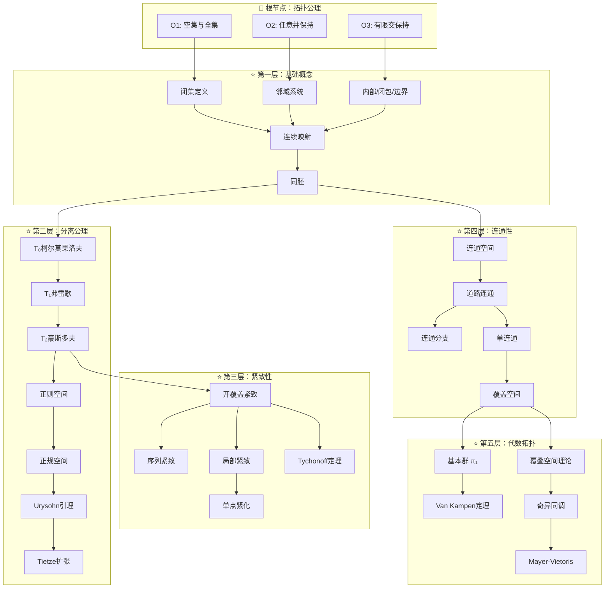
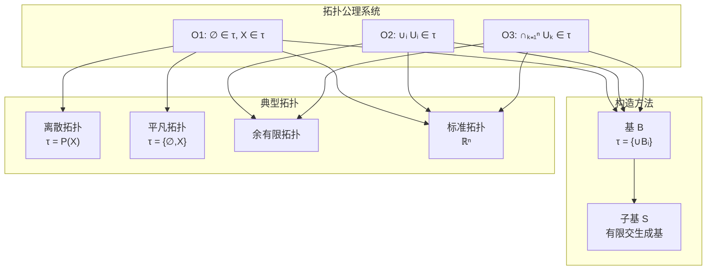
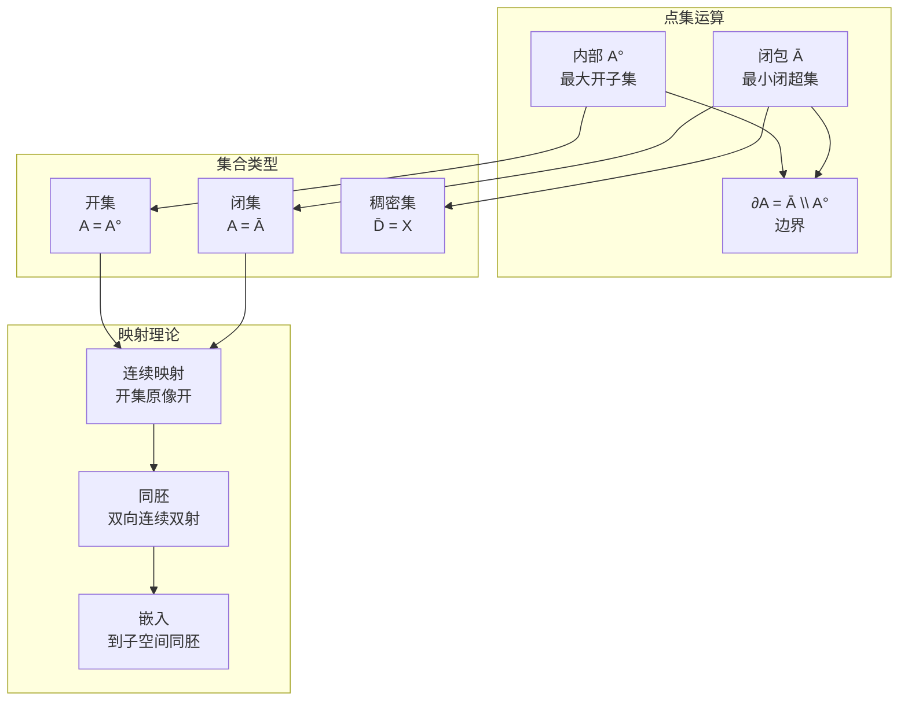
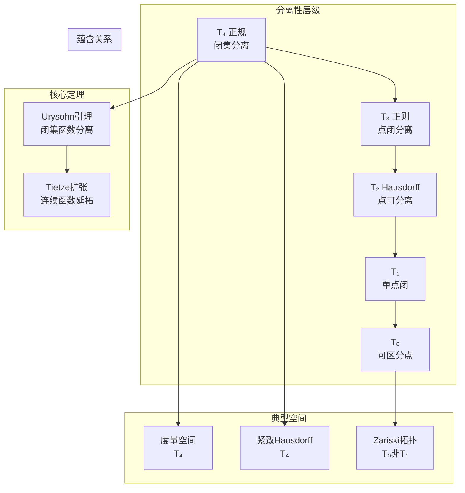
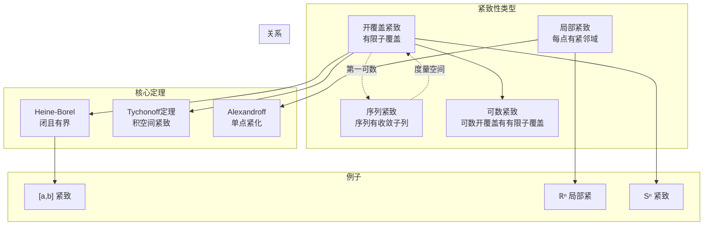
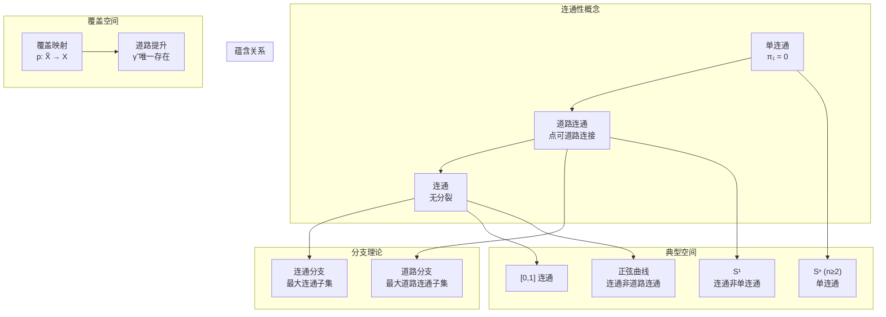
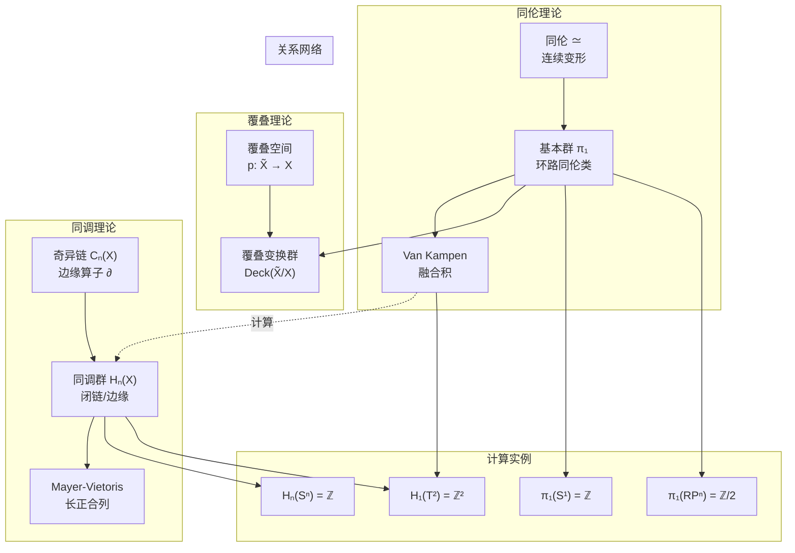
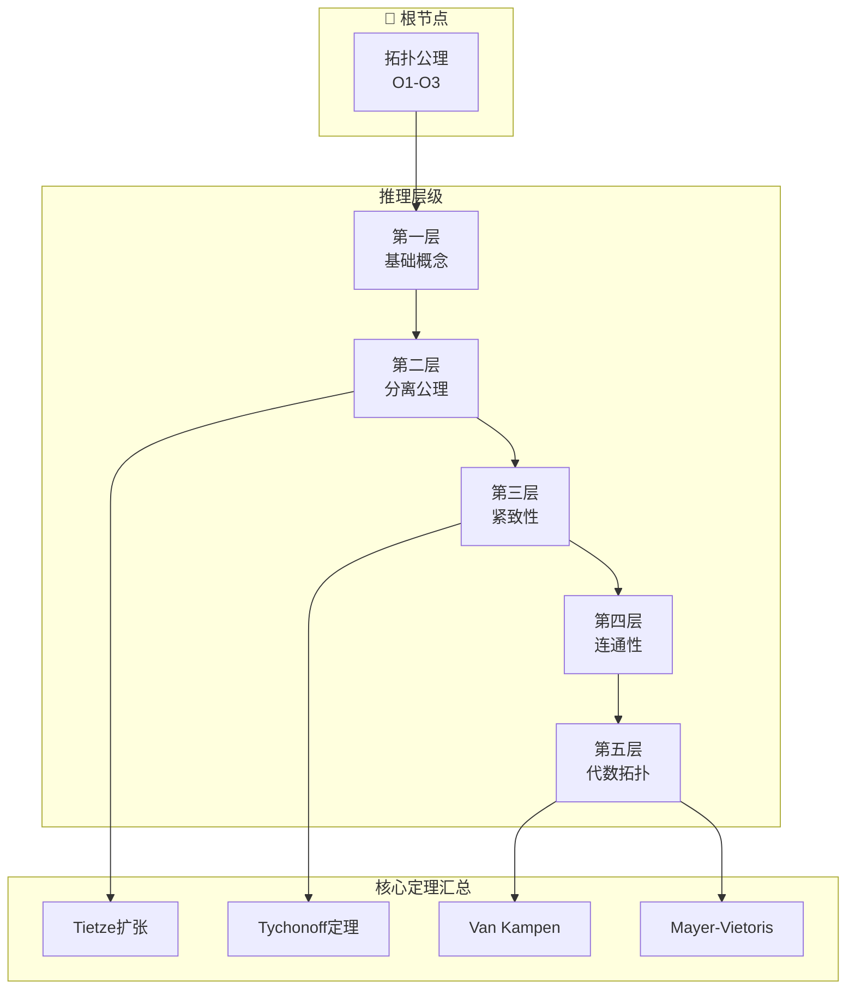
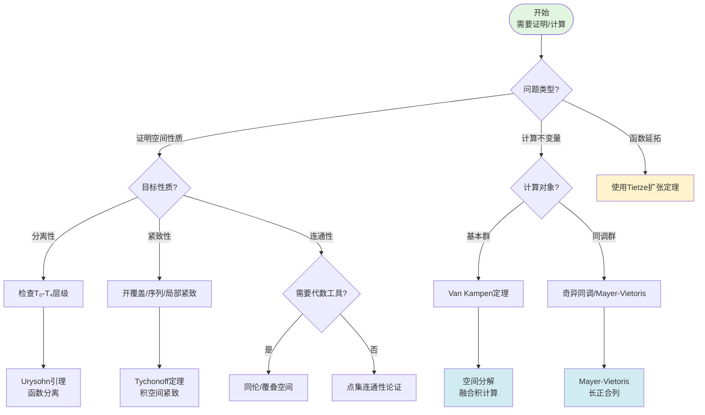
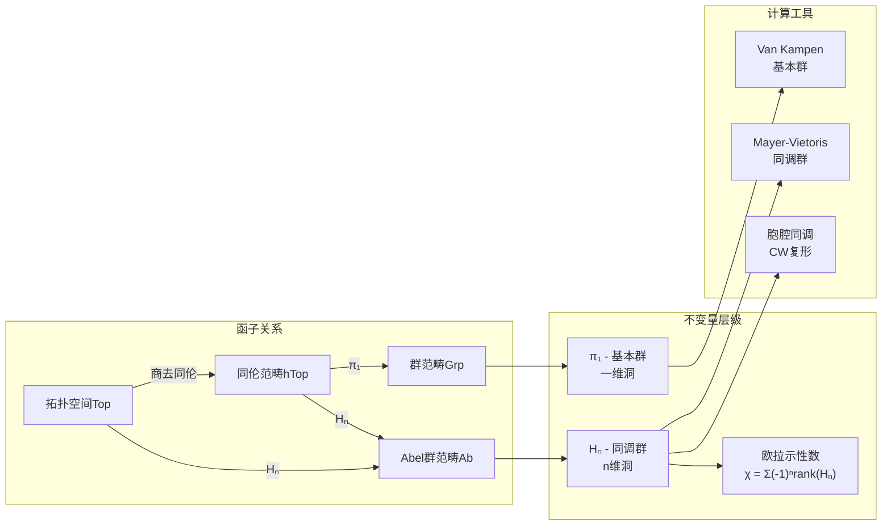

msc_primary: "00A99"
msc_secondary: ['00-00']
---

# 拓扑学完整推理判断树

## 目录

1. [概述](#概述)
2. [根节点：拓扑公理系统](#根节点拓扑公理系统)
3. [第一层：基础拓扑概念](#第一层基础拓扑概念)
4. [第二层：分离性公理](#第二层分离性公理)
5. [第三层：紧致性理论](#第三层紧致性理论)
6. [第四层：连通性理论](#第四层连通性理论)
7. [第五层：代数拓扑基础](#第五层代数拓扑基础)
8. [应用推理流程](#应用推理流程)
9. [定理索引与快速查找](#定理索引与快速查找)

---

## 概述

拓扑学是研究空间在连续变形下保持不变性质的数学分支。本推理树从开集公理出发，系统构建从点集拓扑到代数拓扑的完整理论体系，严格对齐国际顶尖课程 MIT 18.905（Algebraic Topology I）和 Princeton MAT 560（Topology）。

### 课程对齐说明

| 本推理树章节 | MIT 18.905 | Princeton MAT 560 |
|-------------|-----------|-------------------|
| 根节点-第一层 | Lecture 1-3 | Chapter 1-2 |
| 第二层 | Lecture 4-6 | Chapter 3 |
| 第三层 | Lecture 7-9 | Chapter 4 |
| 第四层 | Lecture 10-12 | Chapter 5 |
| 第五层 | Lecture 13-24 | Chapter 6-8 |

---

## 核心推理树总览

---

## 根节点：拓扑公理系统

### 公理 O1：空集与全集的开性

**前提条件**：

- 设 $X$ 为任意非空集合
- 设 $\tau \subseteq \mathcal{P}(X)$ 为 $X$ 的子集族（候选拓扑）

**结论陈述**：
$$\emptyset \in \tau \quad \text{且} \quad X \in \tau$$

**证明思路**：

1. 这是拓扑结构的最基本要求
2. 空集作为零元，确保并运算有单位元
3. 全集作为幺元，确保交运算有单位元
4. 从范畴论角度，这保证了拓扑空间范畴存在终对象和始对象

**依赖的前置定理**：

- 朴素集合论（ZFC公理系统）
- 幂集定义

**后续推论**：

- **推论 O1-1**：任何拓扑空间至少包含两个开集
- **推论 O1-2**：离散拓扑 $\tau = \mathcal{P}(X)$ 满足O1
- **推论 O1-3**：平凡拓扑 $\tau = \{\emptyset, X\}$ 满足O1
- **推论 O1-4**：拓扑的比较：$\tau_1 \subseteq \tau_2$ 称 $\tau_1$ **粗于**（coarser）$\tau_2$

**判断要点**：

| 应用场景 | 判断标准 |
|---------|---------|
| 验证子集族是否为拓扑 | 首先检查 $\emptyset$ 和 $X$ 是否在其中 |
| 构造反例 | 若缺少空集或全集，则不是拓扑 |
| 比较拓扑粗细 | 粗拓扑开集少，细拓扑开集多 |

**反例/边界条件**：

- **反例 1**：$\tau = \{\emptyset\}$ 不是拓扑（缺少 $X$）
- **反例 2**：$\tau = \{X\}$ 不是拓扑（缺少 $\emptyset$）
- **边界条件**：当 $X = \emptyset$ 时，$\tau = \{\emptyset\}$ 是唯一拓扑

---

### 公理 O2：任意并保持性

**前提条件**：

- 设 $\{U_i\}_{i \in I}$ 是 $\tau$ 中的任意子集族
- 指标集 $I$ 可以是有限、可数或不可数的

**结论陈述**：
$$\bigcup_{i \in I} U_i \in \tau$$

**证明思路**：

1. 对任意指标集 $I$ 进行超限归纳
2. 有限并的情形由O3保证
3. 可数次并直接应用
4. 不可数次并同样保持

**依赖的前置定理**：

- 公理 O1（提供起始点）
- 集合的并运算定义
- 选择公理（对于不可数并）

**后续推论**：

- **推论 O2-1**：开集的任意并保持开性
- **推论 O2-2**：内部算子 $A^\circ = \bigcup\{U \subseteq A : U \in \tau\}$ 是开集
- **推论 O2-3**：任意个开集的并的内部等于自身

**判断要点**：

| 应用场景 | 判断标准 |
|---------|---------|
| 验证拓扑结构 | 任取一族开集，验证其并是否开 |
| 构造开集 | 通过并运算从基构造开集 |
| 验证映射连续性 | 开集原像的并保持性 |

**反例/边界条件**：

- **关键观察**：这与测度论形成对比——可测集仅要求可数并保持
- **边界条件**：$\mathbb{R}$ 上标准拓扑中，单点集 $\{x\}$ 不是开集，但任意并可能形成开区间

---

### 公理 O3：有限交保持性

**前提条件**：

- 设 $U_1, U_2, \ldots, U_n \in \tau$（$n \in \mathbb{N}$）

**结论陈述**：
$$\bigcap_{k=1}^{n} U_k \in \tau$$

**证明思路**：

1. 对 $n$ 进行数学归纳法
2. 基例 $n=1$：显然成立
3. 归纳步：假设 $n=k$ 成立，证明 $n=k+1$
   $$\bigcap_{i=1}^{k+1} U_i = \left(\bigcap_{i=1}^{k} U_i\right) \cap U_{k+1}$$
4. 利用两个开集交的定义完成归纳

**依赖的前置定理**：

- 公理 O1
- 数学归纳法原理
- 集合的交运算定义

**后续推论**：

- **推论 O3-1**：两个开集的交是开集
- **推论 O3-2**：有限个开集的交的内部等于自身
- **推论 O3-3**：邻域系统的滤子结构

**判断要点**：

| 应用场景 | 判断标准 |
|---------|---------|
| 验证拓扑 | 取有限个开集，验证交是否开 |
| 构造邻域基 | 利用有限交构造局部基 |
| 验证分离性 | 不交闭集的邻域分离 |

**反例/边界条件**：

- **经典反例**：在 $\mathbb{R}$ 的标准拓扑中
  $$\bigcap_{n=1}^{\infty} \left(-\frac{1}{n}, \frac{1}{n}\right) = \{0\}$$
  这是无限交，结果不是开集！
- **关键理解**：有限交保持开性是拓扑的核心特征，无限交不保持

---

### 定义：拓扑空间

**前提条件**：

- 集合 $X \neq \emptyset$
- 子集族 $\tau \subseteq \mathcal{P}(X)$ 满足公理 O1, O2, O3

**结论陈述**：
有序对 $(X, \tau)$ 称为**拓扑空间**，$\tau$ 称为 $X$ 上的**拓扑**。

**证明思路**：
这是公理化定义的核心。通过开集公理刻画空间的"邻近结构"，而不依赖于距离或度量。

**依赖的前置定理**：

- 公理 O1, O2, O3

**后续推论**：

- **推论**：同一集合可有多种拓扑结构
  - 离散拓扑：$\tau_{\text{disc}} = \mathcal{P}(X)$（最细）
  - 平凡拓扑：$\tau_{\text{triv}} = \{\emptyset, X\}$（最粗）
  - 余有限拓扑：$\tau_{\text{cof}} = \{U \subseteq X : X \setminus U \text{ 有限}\} \cup \{\emptyset\}$
  - 余可数拓扑：$\tau_{\text{coc}} = \{U \subseteq X : X \setminus U \text{ 可数}\} \cup \{\emptyset\}$

**判断要点**：

| 拓扑类型 | 适用场景 |
|---------|---------|
| 离散拓扑 | 组合拓扑、代数拓扑的胞腔结构 |
| 平凡拓扑 | 常值函数空间、范畴论构造 |
| 余有限拓扑 | 代数几何（Zariski拓扑） |
| 标准拓扑 | 分析学、微分几何 |

---

## 拓扑公理推理图

---

## 第一层：基础拓扑概念

### 1.1 闭集理论

#### 定义 C1：闭集

**前提条件**：

- 拓扑空间 $(X, \tau)$
- 子集 $F \subseteq X$

**结论陈述**：
$F$ 是**闭集**当且仅当 $X \setminus F \in \tau$（补集是开集）。

**证明思路**：
闭集通过补集与开集对偶定义。这一定义方式体现了拓扑结构的对偶性——通过闭集也可以完全刻画拓扑。

**依赖的前置定理**：

- 开集公理 O1-O3
- 德摩根定律

**后续推论**：

- **推论 C1-1**：闭集满足对偶公理
  - C1': $\emptyset$ 和 $X$ 是闭集
  - C2': 任意个闭集的交是闭集
  - C3': 有限个闭集的并是闭集
- **推论 C1-2**：闭包算子 $\overline{A}$ 是包含 $A$ 的最小闭集

**判断要点**：

| 判断方法 | 操作步骤 |
|---------|---------|
| 直接法 | 验证补集是否为开集 |
| 序列法（第一可数） | 验证极限点都在集合内 |
| 极限点法 | 验证 $A' \subseteq A$ |

**反例/边界条件**：

- **反例**：在 $\mathbb{R}$ 中，$[0,1)$ 既不开也不闭
- **边界条件**：在离散拓扑中，所有子集既是开集又是闭集（clopen）

---

#### 定理 C2：闭集刻画拓扑

**前提条件**：

- 集合 $X$
- 子集族 $\mathcal{F} \subseteq \mathcal{P}(X)$ 满足：
  - $\emptyset, X \in \mathcal{F}$
  - 任意交的封闭性
  - 有限并的封闭性

**结论陈述**：
存在唯一的拓扑 $\tau$ 使得 $\mathcal{F}$ 恰为 $(X, \tau)$ 的全体闭集。

**证明思路**：

1. 定义 $\tau = \{X \setminus F : F \in \mathcal{F}\}$
2. 验证 $\tau$ 满足 O1-O3
3. 唯一性由德摩根律保证

**依赖的前置定理**：

- 定义 C1（闭集定义）
- 德摩根定律

**后续推论**：

- **推论**：闭包算子与拓扑的一一对应
- **推论**：Kuratowski闭包公理可独立定义拓扑

---

### 1.2 邻域系统

#### 定义 N1：邻域

**前提条件**：

- 拓扑空间 $(X, \tau)$
- 点 $x \in X$
- 子集 $N \subseteq X$

**结论陈述**：
$N$ 是 $x$ 的**邻域**，如果存在开集 $U \in \tau$ 使得 $x \in U \subseteq N$。

**证明思路**：
邻域概念推广了度量空间中"包含 $x$ 的开球"的直观，不依赖于距离而只依赖于开集结构。

**依赖的前置定理**：

- 开集公理
- 子集关系

**后续推论**：

- **推论 N1-1**：所有邻域系统 $\mathcal{N}(x)$ 构成滤子
- **推论 N1-2**：$U \in \tau \iff \forall x \in U, U \in \mathcal{N}(x)$
- **推论 N1-3**：邻域基的存在性

**判断要点**：

| 判断邻域 | 标准 |
|---------|-----|
| 必含 $x$ | $x \in N$ 是必要条件 |
| 包含开集 | 存在开集 $U$ 使得 $x \in U \subseteq N$ |
| 邻域基 | 可数邻域基 $\Rightarrow$ 第一可数 |

**反例/边界条件**：

- **注意**：邻域本身不必是开集
- **例子**：$[0,1]$ 是 $0.5$ 在 $\mathbb{R}$ 中的邻域（包含开区间 $(0,1)$）

---

#### 定理 N2：邻域刻画拓扑（Hausdorff准则）

**前提条件**：

- 集合 $X$
- 对每个 $x \in X$，给定子集族 $\mathcal{N}(x) \subseteq \mathcal{P}(X)$
- 满足邻域公理：
  - N1: $N \in \mathcal{N}(x) \Rightarrow x \in N$
  - N2: $N_1, N_2 \in \mathcal{N}(x) \Rightarrow N_1 \cap N_2 \in \mathcal{N}(x)$
  - N3: $N \in \mathcal{N}(x), N \subseteq M \Rightarrow M \in \mathcal{N}(x)$
  - N4: $\forall N \in \mathcal{N}(x), \exists M \in \mathcal{N}(x), \forall y \in M: N \in \mathcal{N}(y)$

**结论陈述**：
存在唯一的拓扑 $\tau$ 使得 $\mathcal{N}(x)$ 恰为 $x$ 的邻域系。

**证明思路**：

1. 定义 $\tau = \{U : \forall x \in U, U \in \mathcal{N}(x)\}$
2. 验证邻域公理保证 $\tau$ 是拓扑
3. 证明唯一性

**依赖的前置定理**：

- 定义 N1
- 滤子理论

---

### 1.3 内部、闭包与边界

#### 定义 I1：内部

**前提条件**：

- 拓扑空间 $(X, \tau)$
- 子集 $A \subseteq X$

**结论陈述**：
$A$ 的**内部**定义为：
$$A^\circ = \bigcup\{U \in \tau : U \subseteq A\}$$

**等价刻画**：
$$A^\circ = \{x \in A : A \in \mathcal{N}(x)\}$$

**证明思路**：
内部是包含于 $A$ 的最大开集。由 O2，任意并保持开性，故并集仍为开集。

**依赖的前置定理**：

- 公理 O2
- 邻域定义 N1

**后续推论**：

- **推论 I1-1**：$A^\circ \subseteq A$ 且 $A^\circ$ 是开集
- **推论 I1-2**：$A$ 开 $\iff A = A^\circ$
- **推论 I1-3**：内部算子满足Kuratowski公理

**判断要点**：

| 性质 | 判断标准 |
|-----|---------|
| 开集 | $A = A^\circ$ |
| 内部点 | 存在邻域完全含于 $A$ |
| 单调性 | $A \subseteq B \Rightarrow A^\circ \subseteq B^\circ$ |

---

#### 定义 C3：闭包

**前提条件**：

- 拓扑空间 $(X, \tau)$
- 子集 $A \subseteq X$

**结论陈述**：
$A$ 的**闭包**定义为：
$$\overline{A} = \bigcap\{F \subseteq X : F \text{ 闭}, A \subseteq F\}$$

**等价刻画**：
$$\overline{A} = A \cup A' = \{x \in X : \forall N \in \mathcal{N}(x), N \cap A \neq \emptyset\}$$
其中 $A'$ 是 $A$ 的**导集**（极限点集）。

**证明思路**：
闭包是包含 $A$ 的最小闭集。由闭集公理，任意交保持闭性。

**依赖的前置定理**：

- 定义 C1（闭集定义）
- 闭集公理

**后续推论**：

- **推论 C3-1**：$A \subseteq \overline{A}$ 且 $\overline{A}$ 是闭集
- **推论 C3-2**：$A$ 闭 $\iff A = \overline{A}$
- **推论 C3-3**：闭包算子满足Kuratowski公理

**判断要点**：

| 性质 | 判断标准 |
|-----|---------|
| 闭集 | $A = \overline{A}$ |
| 闭包点 | 每个邻域与 $A$ 相交 |
| 极限点 | 每个去心邻域与 $A$ 相交 |

---

#### 定义 B1：边界

**前提条件**：

- 拓扑空间 $(X, \tau)$
- 子集 $A \subseteq X$

**结论陈述**：
$A$ 的**边界**定义为：
$$\partial A = \overline{A} \setminus A^\circ$$

**等价刻画**：
$$\partial A = \overline{A} \cap \overline{X \setminus A}$$

**证明思路**：
边界是"既属于 $A$ 的闭包又属于 $A$ 的补集的闭包"的点。

**依赖的前置定理**：

- 定义 I1（内部）
- 定义 C3（闭包）

**后续推论**：

- **推论 B1-1**：$\partial A = \partial(X \setminus A)$
- **推论 B1-2**：$\partial A$ 总是闭集
- **推论 B1-3**：$A$ 闭 $\iff \partial A \subseteq A$；$A$ 开 $\iff \partial A \cap A = \emptyset$

**判断要点**：

| 集合类型 | 边界条件 |
|---------|---------|
| 既开又闭（clopen） | $\partial A = \emptyset$ |
| 开集 | $\partial A \cap A = \emptyset$ |
| 闭集 | $\partial A \subseteq A$ |

---

#### 定理 B2：内部-闭包-边界关系

**前提条件**：

- 拓扑空间 $(X, \tau)$
- 子集 $A \subseteq X$

**结论陈述**：
$$X = A^\circ \sqcup \partial A \sqcup (X \setminus A)^\circ$$
（不交并分解）

**证明思路**：

1. 显然 $A^\circ \subseteq A \subseteq \overline{A}$
2. $\partial A = \overline{A} \setminus A^\circ$
3. 验证互不相交且并为 $X$

**依赖的前置定理**：

- 定义 I1, C3, B1

**后续推论**：

- **推论**：$\overline{A} = A^\circ \sqcup \partial A$
- **推论**：$A$ 可表示为 $A = A^\circ \sqcup (A \cap \partial A)$

---

### 1.4 稠密性与可分性

#### 定义 D1：稠密集

**前提条件**：

- 拓扑空间 $(X, \tau)$
- 子集 $D \subseteq X$

**结论陈述**：
$D$ 在 $X$ 中**稠密**，如果 $\overline{D} = X$。

**等价刻画**：
$$D \text{ 稠密} \iff \forall U \in \tau \setminus \{\emptyset\}, U \cap D \neq \emptyset$$

**证明思路**：
稠密意味着 $D$ 的闭包充满整个空间，即 $D$ 在每个非空开集中都有点。

**依赖的前置定理**：

- 定义 C3（闭包）

**后续推论**：

- **推论 D1-1**：$\mathbb{Q}$ 在 $\mathbb{R}$ 中稠密
- **推论 D1-2**：可分空间的定义
- **推论 D1-3**：Baire纲定理的前提

**判断要点**：

| 稠密性验证 | 方法 |
|-----------|-----|
| 闭包法 | 计算 $\overline{D} = X$ |
| 交非空法 | 每个非空开集含 $D$ 的点 |
| 序列法（第一可数） | $D$ 中序列可逼近任意点 |

---

#### 定义 D2：可分空间

**前提条件**：

- 拓扑空间 $(X, \tau)$

**结论陈述**：
$X$ 是**可分空间**，如果存在可数稠密子集 $D \subseteq X$。

**证明思路**：
可分性是"大小"的拓扑刻画——空间可被可数集"控制"。

**依赖的前置定理**：

- 定义 D1（稠密）

**后续推论**：

- **推论 D2-1**：$\mathbb{R}^n$ 可分（$\mathbb{Q}^n$ 可数稠密）
- **推论 D2-2**：$l^2$ 空间可分
- **推论 D2-3**：$L^\infty[0,1]$ 不可分

**判断要点**：

| 空间类型 | 可分性 |
|---------|-------|
| 第二可数空间 | 必可分 |
| 度量空间 | 可分 $\iff$ 第二可数 |
| $l^p$ ($1 \leq p < \infty$) | 可分 |
| $l^\infty$ | 不可分 |

---

### 1.5 连续映射

#### 定义 CM1：连续性

**前提条件**：

- 拓扑空间 $(X, \tau_X)$ 和 $(Y, \tau_Y)$
- 映射 $f: X \to Y$

**结论陈述**：
$f$ **连续**，如果以下等价条件之一成立：

1. **开集原像**：$\forall V \in \tau_Y, f^{-1}(V) \in \tau_X$
2. **闭集原像**：$\forall F \text{ 闭于 } Y, f^{-1}(F) \text{ 闭于 } X$
3. **邻域条件**：$\forall x \in X, \forall V \in \mathcal{N}(f(x)), \exists U \in \mathcal{N}(x): f(U) \subseteq V$
4. **闭包条件**：$\forall A \subseteq X, f(\overline{A}) \subseteq \overline{f(A)}$
5. **序列连续（第一可数）**：$x_n \to x \Rightarrow f(x_n) \to f(x)$

**证明思路**：
各条件的等价性证明：

- (1)$\Leftrightarrow$(2)：利用补集关系
- (1)$\Rightarrow$(3)：取 $U = f^{-1}(V)$
- (3)$\Rightarrow$(1)：构造开集原像
- (1)$\Leftrightarrow$(4)：利用闭包定义
- (在度量空间中) (3)$\Leftrightarrow$(5)：序列刻画

**依赖的前置定理**：

- 开集公理
- 闭集定义 C1
- 邻域定义 N1
- 闭包定义 C3

**后续推论**：

- **推论 CM1-1**：常值映射连续
- **推论 CM1-2**：恒等映射连续
- **推论 CM1-3**：连续映射的复合连续
- **推论 CM1-4**：连续映射的限制连续

**判断要点**：

| 连续性验证 | 适用场景 |
|-----------|---------|
| 开集原像 | 一般拓扑空间 |
| 邻域条件 | 点态连续性验证 |
| 序列条件 | 第一可数空间（尤其度量空间） |
| 闭包条件 | 涉及极限点的问题 |

**反例/边界条件**：

- **经典反例**：Dirichlet函数
  $$f(x) = \begin{cases} 1 & x \in \mathbb{Q} \\ 0 & x \notin \mathbb{Q} \end{cases}$$
  在 $\mathbb{R}$ 上处处不连续
- **边界条件**：连续性与拓扑选择密切相关

---

#### 定理 CM2：连续映射的运算

**前提条件**：

- 拓扑空间 $X, Y, Z$
- 连续映射 $f: X \to Y$, $g: Y \to Z$

**结论陈述**：

1. **复合连续性**：$g \circ f: X \to Z$ 连续
2. **限制连续性**：$f|_A: A \to Y$ 对子空间 $A \subseteq X$ 连续
3. **粘贴引理**：$X = A \cup B$（$A, B$ 闭），$f|_A$ 和 $f|_B$ 连续且一致于 $A \cap B$，则 $f$ 连续

**证明思路**：

1. $(g \circ f)^{-1}(V) = f^{-1}(g^{-1}(V))$，开集原像保持
2. 子空间拓扑的定义
3. 闭集原像的并运算

**依赖的前置定理**：

- 定义 CM1
- 子空间拓扑定义

---

### 1.6 同胚与同胚不变量

#### 定义 H1：同胚

**前提条件**：

- 拓扑空间 $(X, \tau_X)$ 和 $(Y, \tau_Y)$
- 双射 $f: X \to Y$

**结论陈述**：
$f$ 是**同胚**，如果 $f$ 和 $f^{-1}$ 都连续。

**等价刻画**：
$f$ 是同胚 $\iff$ $f$ 是双射且 $V \in \tau_Y \Leftrightarrow f^{-1}(V) \in \tau_X$

**证明思路**：
同胚是拓扑空间的"同构"——保持所有拓扑结构的双射。

**依赖的前置定理**：

- 定义 CM1（连续性）

**后续推论**：

- **推论 H1-1**：同胚是等价关系
- **推论 H1-2**：同胚保持所有拓扑性质
- **推论 H1-3**：拓扑学研究同胚不变量

**判断要点**：

| 同胚验证 | 步骤 |
|---------|-----|
| 双射 | 验证 $f$ 是单射且满射 |
| 连续性 | $f$ 连续 |
| 逆连续 | $f^{-1}$ 连续 |

**反例/边界条件**：

- **非例**：$f(x) = x^3$ 从 $\mathbb{R}$ 到 $\mathbb{R}$ 是同胚
- **反例**：$f(x) = x$ 从 $(\mathbb{R}, \text{离散})$ 到 $(\mathbb{R}, \text{标准})$ 不连续，非同胚

---

#### 定义 HI1：拓扑不变量

**前提条件**：

- 拓扑性质 $P$

**结论陈述**：
$P$ 是**拓扑不变量**，如果 $X \cong Y$ 且 $X$ 有性质 $P$，则 $Y$ 也有性质 $P$。

**证明思路**：
拓扑不变量是在同胚下保持的性质，是拓扑学研究的真正对象。

**依赖的前置定理**：

- 定义 H1（同胚）

**后续推论**：

| 不变量 | 说明 |
|-------|-----|
| 连通性 | 同胚保持连通/不连通 |
| 紧致性 | 同胚保持紧致性 |
| Hausdorff | 同胚保持分离性 |
| 基本群 | 代数拓扑不变量 |
| 同调群 | 更精细的代数不变量 |

**反例/边界条件**：

- **度量性质不是不变量**：距离、直径等依赖于具体度量
- **微分性质不是不变量**：光滑性、可微性在同胚下不保持

---

## 基础概念推理图

---

## 第二层：分离性公理

### 2.1 T₀ 柯尔莫果洛夫分离公理

#### 定义 T01：T₀ 空间

**前提条件**：

- 拓扑空间 $(X, \tau)$

**结论陈述**：
$X$ 是 **T₀ 空间**（柯尔莫果洛夫空间），如果：
$$\forall x, y \in X, x \neq y, \exists U \in \tau: (x \in U, y \notin U) \lor (y \in U, x \notin U)$$

**等价刻画**：
$X$ 是 T₀ $\iff$ 不同的点有不同的邻域系 $\iff$ 特殊化序是偏序

**证明思路**：
T₀ 是最弱的分离公理，仅要求拓扑能"区分"不同的点（至少一个方向）。

**依赖的前置定理**：

- 邻域定义 N1
- 开集公理

**后续推论**：

- **推论 T01-1**：T₀ 空间可嵌入到某个积空间 $\prod_{i \in I} \{0,1\}$
- **推论 T01-2**：代数几何中的 Zariski 拓扑通常是 T₀ 但非 T₁

**判断要点**：

| T₀ 验证 | 方法 |
|--------|-----|
| 直接验证 | 任取两点，找一个开集分离 |
| 特殊化序 | 验证 $x \leq y$（$x \in \overline{\{y\}}$）是偏序 |

**反例/边界条件**：

- **反例**：平凡拓扑（$|X| \geq 2$）不是 T₀

- **例子**：余有限拓扑是 T₁ 故也是 T₀

---

### 2.2 T₁ 弗雷歇分离公理

#### 定义 T11：T₁ 空间

**前提条件**：

- 拓扑空间 $(X, \tau)$

**结论陈述**：
$X$ 是 **T₁ 空间**（弗雷歇空间），如果：
$$\forall x, y \in X, x \neq y, \exists U, V \in \tau: x \in U, y \notin U, y \in V, x \notin V$$

**等价刻画**：
$X$ 是 T₁ $\iff$ 所有单点集 $\{x\}$ 是闭集

**证明思路**：
T₁ 加强了对称性——每个点可以被不含另一个点的开集"隔离"。

**依赖的前置定理**：

- 定义 T01
- 闭集定义 C1

**后续推论**：

- **推论 T11-1**：T₁ $\Rightarrow$ T₀
- **推论 T11-2**：有限集上的 T₁ 拓扑必为离散拓扑
- **推论 T11-3**：T₁ 空间中，极限点有良好性质

**判断要点**：

| T₁ 验证 | 方法 |
|--------|-----|
| 单点集法 | 验证所有 $\{x\}$ 闭 |
| 直接分离 | 任取两点，找两个开集分别包含一个但不含另一个 |

---

### 2.3 T₂ 豪斯多夫分离公理

#### 定义 T21：T₂（Hausdorff）空间

**前提条件**：

- 拓扑空间 $(X, \tau)$

**结论陈述**：
$X$ 是 **T₂ 空间**（豪斯多夫空间），如果：
$$\forall x, y \in X, x \neq y, \exists U, V \in \tau: x \in U, y \in V, U \cap V = \emptyset$$

**证明思路**：
Hausdorff 是最常用的分离公理，要求不同点有不相交的邻域。这是分析学中收敛唯一性的保证。

**依赖的前置定理**：

- 定义 T11

**后续推论**：

- **推论 T21-1**：T₂ $\Rightarrow$ T₁ $\Rightarrow$ T₀
- **推论 T21-2**：Hausdorff 空间中，收敛序列的极限唯一
- **推论 T21-3**：紧致子集在 Hausdorff 空间中必闭
- **推论 T21-4**：Hausdorff 是遗传性质和积性质

**判断要点**：

| Hausdorff 验证 | 方法 |
|---------------|-----|
| 直接分离 | 找不相交开邻域 |
| 序列极限 | 验证极限唯一（第一可数时） |
| 对角线法 | $\Delta = \{(x,x)\}$ 在 $X \times X$ 中闭 |

**反例/边界条件**：

- **反例**：余有限拓扑在无限集上不是 Hausdorff
- **反例**：Zariski 拓扑通常不是 Hausdorff

---

#### 定理 T22：Hausdorff 空间中的紧致性

**前提条件**：

- $X$ 是 Hausdorff 空间
- $K \subseteq X$ 是紧致子集

**结论陈述**：
$K$ 是 $X$ 中的闭集。

**证明思路**：

1. 证 $X \setminus K$ 开
2. 对任意 $x \notin K$，利用 Hausdorff 性质和 $K$ 的紧致性
3. 对每个 $y \in K$，找不相交开集 $U_y \ni x$, $V_y \ni y$
4. $\{V_y\}$ 覆盖 $K$，取有限子覆盖
5. 对应 $U_y$ 的交是 $x$ 的开邻域不交 $K$

**依赖的前置定理**：

- 定义 T21
- 紧致性定义

**后续推论**：

- **推论**：紧致 Hausdorff 空间中，紧致 $\Leftrightarrow$ 闭

---

### 2.4 正则空间（T₃）

#### 定义 T31：正则空间

**前提条件**：

- 拓扑空间 $(X, \tau)$

**结论陈述**：
$X$ 是**正则空间**，如果：

1. $X$ 是 T₁
2. 对任意闭集 $F \subseteq X$ 和点 $x \notin F$，存在不相交开集 $U, V$ 使得 $x \in U$, $F \subseteq V$

**证明思路**：
正则性将点的分离推广到点与闭集的分离。

**依赖的前置定理**：

- 定义 T11
- 闭集定义

**后续推论**：

- **推论 T31-1**：正则 + T₁ 记为 T₃
- **推论 T31-2**：度量空间是 T₃
- **推论 T31-3**：紧致 Hausdorff 空间是 T₃

**判断要点**：

| 正则验证 | 方法 |
|---------|-----|
| 邻域基 | 有由闭包在内部的集合构成的邻域基 |
| Urysohn 引理前奏 | 为正规性做准备 |

---

### 2.5 正规空间（T₄）

#### 定义 T41：正规空间

**前提条件**：

- 拓扑空间 $(X, \tau)$

**结论陈述**：
$X$ 是**正规空间**，如果：

1. $X$ 是 T₁
2. 对任意不交闭集 $A, B \subseteq X$，存在不相交开集 $U, V$ 使得 $A \subseteq U$, $B \subseteq V$

**证明思路**：
正规性是分离公理的顶点，要求任意两个不交闭集可被开集分离。

**依赖的前置定理**：

- 定义 T31
- 闭集定义

**后续推论**：

- **推论 T41-1**：正规 + T₁ 记为 T₄
- **推论 T41-2**：T₄ $\Rightarrow$ T₃ $\Rightarrow$ T₂ $\Rightarrow$ T₁ $\Rightarrow$ T₀
- **推论 T41-3**：Urysohn 引理和 Tietze 扩张定理的前提

**判断要点**：

| 正规验证 | 方法 |
|---------|-----|
| 闭集分离 | 任意不交闭集有不相交开邻域 |
| Urysohn 引理 | 闭集可函数分离 |

---

### 2.6 Urysohn 引理

#### 定理 U1：Urysohn 引理

**前提条件**：

- $X$ 是正规空间
- $A, B \subseteq X$ 是不交闭集

**结论陈述**：
存在连续函数 $f: X \to [0,1]$ 使得：
$$f|_A \equiv 0, \quad f|_B \equiv 1$$

**证明思路**（关键步骤）：

1. 在 $[0,1]$ 的有理数上归纳构造开集族 $\{U_q\}$
2. 对 $q < r$，要求 $\overline{U_q} \subseteq U_r$
3. 定义 $f(x) = \inf\{q : x \in U_q\}$
4. 验证 $f$ 连续

**依赖的前置定理**：

- 定义 T41（正规空间）
- 连续性定义 CM1

**后续推论**：

- **推论 U1-1**：正规空间的函数分离刻画
- **推论 U1-2**：为 Tietze 扩张定理奠基
- **推论 U1-3**：嵌入定理的基础

**判断要点**：

| Urysohn 应用 | 场景 |
|-------------|-----|
| 函数分离 | 证明正规性时构造连续函数 |
| 嵌入问题 | 将空间嵌入到函数空间 |
| 维数理论 | 拓扑维数的定义 |

**反例/边界条件**：

- **必要性**：Urysohn 引理的逆也成立——若任意不交闭集可函数分离，则空间正规

---

### 2.7 Tietze 扩张定理

#### 定理 T1：Tietze 扩张定理

**前提条件**：

- $X$ 是正规空间
- $A \subseteq X$ 是闭子集
- $f: A \to \mathbb{R}$ 连续（或有界连续）

**结论陈述**：
存在连续扩张 $\tilde{f}: X \to \mathbb{R}$ 使得 $\tilde{f}|_A = f$。

若 $f$ 有界，可要求保持上确界范数。

**证明思路**（关键步骤）：

1. **有界情形**：
   - 利用 Urysohn 引理构造近似
   - 迭代构造一致收敛的函数列
   - 极限即为所求扩张

2. **无界情形**：
   - 通过同胚将 $\mathbb{R}$ 映到有界区间
   - 应用有界情形
   - 再映回 $\mathbb{R}$

**依赖的前置定理**：

- 定理 U1（Urysohn 引理）
- 连续性定义
- 一致收敛极限定理

**后续推论**：

- **推论 T1-1**：$A \subseteq \mathbb{R}^n$ 闭，$f: A \to \mathbb{R}^k$ 连续，则可扩张到 $\mathbb{R}^n$
- **推论 T1-2**：正规空间的函数扩张性质完全刻画

**判断要点**：

| Tietze 应用 | 场景 |
|------------|-----|
| 扩张存在性 | 闭子集上的连续函数可扩张 |
| 正规性检验 | Tietze 性质 $\Rightarrow$ 正规 |
| 延拓问题 | 边界值问题、延拓定理 |

---

## 分离性公理推理图

---

## 第三层：紧致性理论

### 3.1 开覆盖紧致

#### 定义 K1：紧致性

**前提条件**：

- 拓扑空间 $(X, \tau)$
- 开覆盖 $\mathcal{U} = \{U_i\}_{i \in I} \subseteq \tau$ 满足 $\bigcup_{i \in I} U_i = X$

**结论陈述**：
$X$ 是**紧致的**，如果每个开覆盖都有有限子覆盖：
$$\forall \mathcal{U} \text{ 开覆盖}, \exists i_1, \ldots, i_n \in I: X = U_{i_1} \cup \cdots \cup U_{i_n}$$

**证明思路**：
紧致性是"有限性"的拓扑推广——虽然空间可能无限，但其开覆盖结构具有有限特征。

**依赖的前置定理**：

- 开集公理
- 覆盖概念

**后续推论**：

- **推论 K1-1**：紧致性是拓扑不变量
- **推论 K1-2**：紧致空间的闭子集紧致
- **推论 K1-3**：Hausdorff 空间中紧致子集必闭
- **推论 K1-4**：连续映射保持紧致性

**判断要点**：

| 紧致验证 | 方法 |
|---------|-----|
| 定义法 | 任取开覆盖，找有限子覆盖 |
| 有限交性质 | 闭集族有限交非空则全交非空 |
| 网/滤子 | 每个网有收敛子网 |
| 序列（可数时） | 每个序列有收敛子列 |

**反例/边界条件**：

- **反例**：$(0,1)$ 在 $\mathbb{R}$ 中不紧致（开覆盖 $\{(1/n, 1)\}$ 无有限子覆盖）
- **反例**：$\mathbb{R}$ 不紧致

---

#### 定理 K2：紧致性等价刻画

**前提条件**：

- 拓扑空间 $X$

**结论陈述**：
以下等价：

1. $X$ 紧致（开覆盖定义）
2. **有限交性质**：若闭集族 $\{F_i\}$ 有有限交性质，则 $\bigcap F_i \neq \emptyset$
3. **网紧致**：每个网有收敛子网
4. **超滤子**：每个超滤子收敛
5. **Alexander 子基定理**：子基开覆盖有有限子覆盖

**证明思路**：
各等价性的证明涉及：

- (1)$\Leftrightarrow$(2)：德摩根律
- (1)$\Leftrightarrow$(3)：网与覆盖的关系
- Alexander 子基定理：利用佐恩引理

**依赖的前置定理**：

- 定义 K1
- 网/滤子理论
- 佐恩引理

---

#### 定理 K3：Heine-Borel 定理

**前提条件**：

- 子集 $A \subseteq \mathbb{R}^n$（标准拓扑）

**结论陈述**：
$A$ 紧致 $\iff$ $A$ 闭且有界。

**证明思路**：

- ($\Rightarrow$)：紧致 $\Rightarrow$ 闭（Hausdorff 中），紧致度量空间全有界
- ($\Leftarrow$)：闭区间 $[a,b]$ 紧致（区间套原理），$\mathbb{R}^n$ 中有界闭集可表为闭区间的乘积，应用 Tychonoff 定理

**依赖的前置定理**：

- 定理 K2
- Tychonoff 定理
- 度量空间性质

**后续推论**：

- **推论**：$\mathbb{R}^n$ 中紧致 = 列紧致 = 序列紧致

---

### 3.2 序列紧致

#### 定义 S1：序列紧致

**前提条件**：

- 拓扑空间 $X$

**结论陈述**：
$X$ 是**序列紧致的**，如果每个序列都有收敛子列。

**证明思路**：
序列紧致是可数版本的紧致性，在第一可数空间中二者等价。

**依赖的前置定理**：

- 序列收敛定义

**后续推论**：

- **推论 S1-1**：序列紧致 $\Rightarrow$ 可数紧致
- **推论 S1-2**：第一可数 + 紧致 $\Rightarrow$ 序列紧致
- **推论 S1-3**：度量空间中，紧致 $\Leftrightarrow$ 序列紧致 $\Leftrightarrow$ 可数紧致

**判断要点**：

| 序列紧致 | 验证方法 |
|---------|---------|
| 子列存在性 | 任取序列，构造收敛子列 |
| Bolzano-Weierstrass | 有界序列有收敛子列 |

**反例/边界条件**：

- **关键区别**：一般拓扑中，紧致 $\nRightarrow$ 序列紧致，序列紧致 $\nRightarrow$ 紧致
- **例子**：$[0,1]^{[0,1]}$（Tychonoff 立方）紧致但非序列紧致

---

#### 定理 S2：序列紧致与紧致的关系

**前提条件**：

- 拓扑空间 $X$

**结论陈述**：

1. 若 $X$ 是第一可数的，则紧致 $\Rightarrow$ 序列紧致
2. 若 $X$ 是度量空间，则紧致 $\Leftrightarrow$ 序列紧致

**证明思路**：

1. 第一可数空间中，聚点可用序列逼近
2. 度量空间第一可数且序列紧致蕴含全有界 + 完备

**依赖的前置定理**：

- 定义 K1, S1
- 第一可数性

---

### 3.3 局部紧致

#### 定义 L1：局部紧致

**前提条件**：

- 拓扑空间 $X$
- 点 $x \in X$

**结论陈述**：
$X$ 在 $x$ **局部紧致**，如果存在紧致的邻域 $K \in \mathcal{N}(x)$。

$X$ 是**局部紧致空间**，如果在每点局部紧致。

**证明思路**：
局部紧致性将紧致性要求"局部化"，适用于非紧但"局部像紧致"的空间。

**依赖的前置定理**：

- 定义 K1（紧致性）
- 邻域定义 N1

**后续推论**：

- **推论 L1-1**：$\mathbb{R}^n$ 局部紧致（每点有紧闭球邻域）
- **推论 L1-2**：离散空间局部紧致（单点紧致）
- **推论 L1-3**：开子空间保持局部紧致性

**判断要点**：

| 局部紧致 | 验证方法 |
|---------|---------|
| 邻域基 | 每点有由紧致集组成的邻域基 |
| 开覆盖 | 每点有相对紧的开邻域 |

---

### 3.4 Tychonoff 定理

#### 定理 TYC：Tychonoff 定理

**前提条件**：

- 一族紧致空间 $\{X_i\}_{i \in I}$
- 积空间 $X = \prod_{i \in I} X_i$（积拓扑）

**结论陈述**：
$X$ 是紧致的。

**证明思路**（关键步骤）：

1. **Alexander 子基方法**：
   - 考虑积拓扑的标准子基
   - 假设无有限子覆盖，导出矛盾

2. **滤子方法**：
   - 利用超滤子在每个坐标收敛
   - 构造在积空间收敛的超滤子

3. **网方法**：
   - 积空间中的万有网在每个投影下收敛
   - 由积拓扑定义，网在积空间收敛

**依赖的前置定理**：

- 定义 K1
- 积拓扑定义
- Alexander 子基定理 / 超滤子紧致刻画

**后续推论**：

- **推论 TYC-1**：$[0,1]^I$ 紧致（Tychonoff 立方）
- **推论 TYC-2**：紧致 Hausdorff 空间的积是紧致 Hausdorff
- **推论 TYC-3**：Tychonoff 定理等价于选择公理

**判断要点**：

| Tychonoff 应用 | 场景 |
|---------------|-----|
| 函数空间紧致性 | 如 Arzelà-Ascoli 定理 |
| 逻辑紧致性 | 紧致性定理的证明 |
| 代数几何 | 概形的拟紧致性 |

---

### 3.5 单点紧化

#### 定义 AC1：Alexandroff 单点紧化

**前提条件**：

- 非紧致局部紧致 Hausdorff 空间 $X$

**结论陈述**：
$X^* = X \cup \{\infty\}$ 配备如下拓扑是紧致 Hausdorff 空间：

- $X^*$ 的开集为：
  - $X$ 中的开集
  - 形如 $X^* \setminus K$ 的集合，其中 $K \subseteq X$ 紧致

**证明思路**：
通过添加"无穷远点"将非紧空间紧致化，新点的邻域是紧集的补集。

**依赖的前置定理**：

- 定义 L1（局部紧致）
- 定义 K1（紧致性）
- Hausdorff 定义 T21

**后续推论**：

- **推论 AC1-1**：$X$ 在 $X^*$ 中稠密
- **推论 AC1-2**：$X^*$ 在同胚意义下唯一
- **推论 AC1-3**：$\mathbb{R}^n$ 的单点紧化同胚于 $S^n$

**判断要点**：

| 单点紧化 | 应用 |
|---------|-----|
| 非紧到紧 | 将分析学问题转化到紧空间 |
| Riemann 球 | $\mathbb{C}^* \cong S^2$ |
| 投影几何 | 添加无穷远点 |

---

## 紧致性理论推理图

---

## 第四层：连通性理论

### 4.1 连通空间

#### 定义 CON1：连通性

**前提条件**：

- 拓扑空间 $X$

**结论陈述**：
$X$ 是**连通的**，如果它不能表示为两个非空不交开集的并：
$$\nexists U, V \in \tau \setminus \{\emptyset\}: U \cap V = \emptyset, U \cup V = X$$

**等价刻画**：
以下等价：

1. $X$ 连通
2. $X$ 的非空既开又闭子集只有 $X$ 本身
3. 每个连续映射 $f: X \to \{0,1\}$（离散）是常值

**证明思路**：
连通性排除了空间的"分裂"可能——不存在将空间分割的不交开集。

**依赖的前置定理**：

- 开集公理
- 连续性定义

**后续推论**：

- **推论 CON1-1**：连通性是拓扑不变量
- **推论 CON1-2**：$[0,1]$ 连通（区间连通性）
- **推论 CON1-3**：连续映射保持连通性
- **推论 CON1-4**：连通集的并（有公共点）连通

**判断要点**：

| 连通验证 | 方法 |
|---------|-----|
| 定义法 | 验证不能分裂为不交开集 |
| 既开又闭法 | 验证无非平凡 clopen 集 |
| 函数法 | 到离散空间的连续映射必常值 |

**反例/边界条件**：

- **反例**：$(0,1) \cup (2,3)$ 不连通
- **边界条件**：单点集总是连通

---

#### 定理 CON2：连通性判定

**前提条件**：

- 拓扑空间 $X$

**结论陈述**：

1. $[0,1]$ 连通（实数区间连通性）
2. $X$ 连通且 $f: X \to Y$ 连续满射 $\Rightarrow$ $Y$ 连通
3. $\{A_i\}$ 连通，$\bigcap A_i \neq \emptyset$ $\Rightarrow$ $\bigcup A_i$ 连通
4. $A$ 连通，$A \subseteq B \subseteq \overline{A}$ $\Rightarrow$ $B$ 连通

**证明思路**：

1. 区间连通性：利用实数完备性
2. 连续像：反证法，利用连续性
3. 并的连通性：设 $f$ 在并上连续到 $\{0,1\}$，在各 $A_i$ 上常值，由交非空知常值相同
4. 闭包保持：利用连续性延拓

**依赖的前置定理**：

- 定义 CON1
- 连续性定义

---

### 4.2 道路连通

#### 定义 PC1：道路连通

**前提条件**：

- 拓扑空间 $X$
- 点 $x, y \in X$

**结论陈述**：
$X$ 中的**道路**是从 $[0,1]$ 到 $X$ 的连续映射 $\gamma: [0,1] \to X$ 且 $\gamma(0) = x$, $\gamma(1) = y$。

$X$ 是**道路连通的**，如果对任意 $x, y \in X$，存在连接它们的道路。

**证明思路**：
道路连通是"可遍历"的连通——任意两点可被连续曲线连接。

**依赖的前置定理**：

- 定义 CON1
- 连续性定义

**后续推论**：

- **推论 PC1-1**：道路连通 $\Rightarrow$ 连通
- **推论 PC1-2**：$\mathbb{R}^n$ 道路连通（直线道路）
- **推论 PC1-3**：$S^n$（$n \geq 1$）道路连通

**判断要点**：

| 道路连通验证 | 方法 |
|-------------|-----|
| 显式道路 | 构造连接任意两点的连续曲线 |
| 星形区域 | 若空间关于某点星形，则道路连通 |
| 凸集 | 凸集道路连通 |

**反例/边界条件**：

- **经典反例**：拓扑学家的正弦曲线
  $$S = \{(x, \sin(1/x)) : x \in (0,1]\} \cup \{(0,y) : y \in [-1,1]\}$$
  连通但非道路连通！

---

#### 定理 PC2：道路连通与连通的关系

**前提条件**：

- 拓扑空间 $X$

**结论陈述**：

1. 道路连通 $\Rightarrow$ 连通
2. 连通开子集（$\mathbb{R}^n$ 中）$\Rightarrow$ 道路连通
3. 局部道路连通 + 连通 $\Rightarrow$ 道路连通

**证明思路**：

1. 道路连通空间中，固定基点，所有道路像的并连通且为全空间
2. $\mathbb{R}^n$ 中，对开集内任一点，其道路连通分支既开又闭
3. 局部道路连通保证道路连通分支开

**依赖的前置定理**：

- 定义 CON1, PC1

---

### 4.3 连通分支

#### 定义 COMP1：连通分支

**前提条件**：

- 拓扑空间 $X$
- 点 $x \in X$

**结论陈述**：
$x$ 的**连通分支** $C(x)$ 是包含 $x$ 的最大连通子集：
$$C(x) = \bigcup\{A \subseteq X : x \in A, A \text{ 连通}\}$$

**证明思路**：
连通分支将空间划分为"最大连通块"。

**依赖的前置定理**：

- 定义 CON1
- 定理 CON2（连通并的性质）

**后续推论**：

- **推论 COMP1-1**：连通分支是闭集
- **推论 COMP1-2**：不同连通分支不交
- **推论 COMP1-3**：$X$ 连通 $\iff$ $X$ 只有一个连通分支

**判断要点**：

| 连通分支 | 性质 |
|---------|-----|
| 最大性 | 是真包含它的连通子集 |
| 闭性 | 总是闭集 |
| 不交性 | 不同点要么同分支要么不交 |

---

### 4.4 单连通

#### 定义 SC1：单连通

**前提条件**：

- 拓扑空间 $X$

**结论陈述**：
$X$ 是**单连通**的，如果：

1. $X$ 道路连通
2. 每条闭道路（环路）可连续形变为一点（零伦）

形式地，$\pi_1(X, x_0) = \{e\}$（基本群平凡）。

**证明思路**：
单连通意味着"没有洞"——任何环路都可收缩到一点。

**依赖的前置定理**：

- 定义 PC1
- 同伦概念（第五层）

**后续推论**：

- **推论 SC1-1**：$\mathbb{R}^n$ 单连通
- **推论 SC1-2**：$S^n$（$n \geq 2$）单连通
- **推论 SC1-3**：$S^1$ 不单连通（有"洞"）

**判断要点**：

| 单连通验证 | 方法 |
|-----------|-----|
| 基本群 | 计算 $\pi_1(X) = 0$ |
| 形变收缩 | 可缩空间 $\Rightarrow$ 单连通 |
| 简单连通 | 无洞的多连通判断 |

**反例/边界条件**：

- **反例**：$S^1$、环面 $T^2$ 不单连通
- **注意**：单连通要求道路连通，仅 $\pi_1 = 0$ 不够

---

### 4.5 覆盖空间基础

#### 定义 CV1：覆盖空间

**前提条件**：

- 拓扑空间 $X$（底空间）
- 空间 $\tilde{X}$（覆盖空间）
- 连续满射 $p: \tilde{X} \to X$

**结论陈述**：
$p: \tilde{X} \to X$ 是**覆盖映射**，如果：
对每点 $x \in X$，存在开邻域 $U$ 使得 $p^{-1}(U)$ 是 $\tilde{X}$ 中不交开集的并，每个开集通过 $p$ 同胚地映到 $U$。

**证明思路**：
覆盖空间是"分层"地映射到底空间，局部是同胚但整体可能有非平凡拓扑。

**依赖的前置定理**：

- 连续性定义
- 同胚定义 H1

**后续推论**：

- **推论 CV1-1**：覆盖映射是局部同胚
- **推论 CV1-2**：$p^{-1}(x)$ 的基数（纤维）局部常值
- **推论 CV1-3**：道路提升性质

**判断要点**：

| 覆盖空间 | 验证方法 |
|---------|---------|
| 局部同胚 | 每点有邻域被同胚地映 |
| 纤维离散 | $p^{-1}(x)$ 离散 |
| 均匀覆盖 | 均匀覆盖邻域存在 |

**经典例子**：

- **例 1**：$p: \mathbb{R} \to S^1$, $p(t) = e^{2\pi i t}$（万有覆盖）
- **例 2**：$p: S^1 \to S^1$, $p(z) = z^n$（$n$ 重覆盖）
- **例 3**：$p: S^2 \to \mathbb{R}P^2$（实投影平面的二重覆盖）

---

#### 定理 CV2：道路提升定理

**前提条件**：

- 覆盖映射 $p: \tilde{X} \to X$
- 道路 $\gamma: [0,1] \to X$
- 提升起点 $\tilde{x}_0 \in p^{-1}(\gamma(0))$

**结论陈述**：
存在唯一的道路 $\tilde{\gamma}: [0,1] \to \tilde{X}$ 使得：
$$p \circ \tilde{\gamma} = \gamma, \quad \tilde{\gamma}(0) = \tilde{x}_0$$

**证明思路**：

1. 利用覆盖映射的局部同胚性质
2. 将道路分段，每段落在均匀覆盖邻域内
3. 逐段提升并粘合

**依赖的前置定理**：

- 定义 CV1
- 道路连通性
- 粘接引理

**后续推论**：

- **推论 CV2-1**：同伦提升定理
- **推论 CV2-2**：覆盖空间的单值性

---

## 连通性理论推理图

---

## 第五层：代数拓扑基础

### 5.1 基本群（同伦类与环路）

#### 定义 FG1：同伦

**前提条件**：

- 拓扑空间 $X$
- 连续映射 $f, g: Y \to X$

**结论陈述**：
$f$ 与 $g$ **同伦**（记 $f \simeq g$），如果存在连续映射 $H: Y \times [0,1] \to X$ 使得：
$$H(y, 0) = f(y), \quad H(y, 1) = g(y)$$
$H$ 称为从 $f$ 到 $g$ 的**同伦**。

**证明思路**：
同伦是映射的"连续变形"，是拓扑学中比同胚更弱的等价关系。

**依赖的前置定理**：

- 连续性定义
- 积拓扑

**后续推论**：

- **推论 FG1-1**：同伦是等价关系
- **推论 FG1-2**：相对同伦（固定子集的同伦）
- **推论 FG1-3**：同伦映射诱导相同的同调同态

---

#### 定义 FG2：基本群

**前提条件**：

- 拓扑空间 $X$
- 基点 $x_0 \in X$
- 以 $x_0$ 为基点的环路：$\gamma: [0,1] \to X$, $\gamma(0) = \gamma(1) = x_0$

**结论陈述**：
以 $x_0$ 为基点的**基本群** $\pi_1(X, x_0)$ 定义为环路的同伦类集合：
$$\pi_1(X, x_0) = \{[\gamma] : \gamma \text{ 是以 } x_0 \text{ 为基点的环路}\}$$

群运算（乘法）定义为环路的连接：
$$[\gamma] \cdot [\eta] = [\gamma * \eta]$$
其中 $(\gamma * \eta)(t) = \begin{cases} \gamma(2t) & 0 \leq t \leq 1/2 \\ \eta(2t-1) & 1/2 \leq t \leq 1 \end{cases}$

**证明思路**：
基本群捕获空间"一维洞"的信息。环路乘法在同伦类上良定义。

**依赖的前置定理**：

- 定义 FG1（同伦）
- 环路连接的定义

**后续推论**：

- **推论 FG2-1**：$\pi_1(X, x_0)$ 是群（结合律、单位元、逆元）
- **推论 FG2-2**：道路连通空间中，不同基点的基本群同构
- **推论 FG2-3**：连续映射 $f: X \to Y$ 诱导同态 $f_*: \pi_1(X, x_0) \to \pi_1(Y, f(x_0))$

**判断要点**：

| 基本群计算 | 方法 |
|-----------|-----|
| 可缩空间 | $\pi_1 = 0$ |
| 圆 | $\pi_1(S^1) \cong \mathbb{Z}$ |
| 积空间 | $\pi_1(X \times Y) \cong \pi_1(X) \times \pi_1(Y)$ |

---

#### 定理 FG3：基本群的函子性质

**前提条件**：

- 连续映射 $f: X \to Y$, $g: Y \to Z$

**结论陈述**：

1. $(g \circ f)_* = g_* \circ f_*$
2. $(\text{id}_X)_* = \text{id}_{\pi_1(X)}$
3. $f \simeq g$（相对于基点同伦）$\Rightarrow$ $f_* = g_*$

**证明思路**：
基本群构造是从拓扑空间范畴到群范畴的函子。

**依赖的前置定理**：

- 定义 FG2
- 函子理论

**后续推论**：

- **推论**：同胚空间有同构的基本群（基本群是拓扑不变量）
- **推论**：可缩空间的基本群平凡

---

### 5.2 Van Kampen 定理

#### 定理 VK：Van Kampen 定理

**前提条件**：

- 拓扑空间 $X = U \cup V$，其中 $U, V$ 开且道路连通
- $U \cap V$ 非空道路连通
- 基点 $x_0 \in U \cap V$

**结论陈述**：
$$\pi_1(X, x_0) \cong \pi_1(U, x_0) *_{\pi_1(U \cap V, x_0)} \pi_1(V, x_0)$$

即 $\pi_1(X, x_0)$ 是 $\pi_1(U, x_0)$ 和 $\pi_1(V, x_0)$ 关于 $\pi_1(U \cap V, x_0)$ 的**自由积 with amalgamation**（融合积）。

**证明思路**（关键步骤）：

1. **代数准备**：自由积与融合积的定义
2. **满射性**：任何 $X$ 中的环路可分解为 $U$ 和 $V$ 中环路的乘积
3. **关系刻画**：在 $U \cap V$ 中同伦的环路给出融合关系
4. **应用 Seifert-van Kampen 的代数形式**

**依赖的前置定理**：

- 定义 FG2（基本群）
- 群论：自由积、融合积
- 道路提升性质

**后续推论**：

- **推论 VK-1**：$\pi_1(S^n) = 0$（$n \geq 2$，单连通）
- **推论 VK-2**：$\pi_1(S^1 \vee S^1) = \mathbb{Z} * \mathbb{Z}$（自由群）
- **推论 VK-3**：$\pi_1(T^2) = \mathbb{Z} \times \mathbb{Z}$（环面）
- **推论 VK-4**：$\pi_1(\mathbb{R}P^2) = \mathbb{Z}/2\mathbb{Z}$

**判断要点**：

| Van Kampen 应用 | 场景 |
|----------------|-----|
| 空间分解 | 将复杂空间分解为简单部分 |
| 基本群计算 | 由部分的基本群构造整体 |
| CW复形 | 胞腔附加的基本群计算 |

**计算示例**：

1. **环面 $T^2 = S^1 \times S^1$**：
   $$\pi_1(T^2) = \pi_1(S^1) \times \pi_1(S^1) = \mathbb{Z} \times \mathbb{Z}$$

2. **双环面（亏格 2 曲面）**：
   分解后可得 $\pi_1 = \langle a, b, c, d \mid [a,b][c,d] = 1 \rangle$

---

### 5.3 覆叠空间理论

#### 定理 CV3：覆叠空间与基本群

**前提条件**：

- 覆叠映射 $p: (\tilde{X}, \tilde{x}_0) \to (X, x_0)$
- $X$ 道路连通、局部道路连通、半局部单连通

**结论陈述**：

1. **诱导单射**：$p_*: \pi_1(\tilde{X}, \tilde{x}_0) \to \pi_1(X, x_0)$ 是单同态
2. **纤维与陪集**：$p^{-1}(x_0)$ 与 $\pi_1(X, x_0)/p_*\pi_1(\tilde{X}, \tilde{x}_0)$ 一一对应
3. **万有覆叠**：若 $\tilde{X}$ 单连通，则 $\pi_1(X, x_0) \cong \text{Deck}(\tilde{X}/X)$（覆叠变换群）

**证明思路**（关键步骤）：

1. 道路提升给出群作用
2. 单射性由提升唯一性保证
3. 万有覆叠的覆叠变换群同构于基本群

**依赖的前置定理**：

- 定义 CV1（覆叠空间）
- 定义 FG2（基本群）
- 定理 CV2（道路提升）

**后续推论**：

- **推论 CV3-1**：$\mathbb{R} \to S^1$ 是万有覆叠，$\pi_1(S^1) \cong \mathbb{Z}$
- **推论 CV3-2**：$S^n \to \mathbb{R}P^n$（$n \geq 2$）是万有覆叠，$\pi_1(\mathbb{R}P^n) \cong \mathbb{Z}/2\mathbb{Z}$
- **推论 CV3-3**：覆叠空间的分类定理

**判断要点**：

| 覆叠空间应用 | 场景 |
|-------------|-----|
| 基本群计算 | 通过万有覆叠变换群 |
| 子群对应 | 基本群的子群 $\leftrightarrow$ 覆叠空间 |
| 提升判定 | 映射可提升当且仅当像含于 $p_*$ 像中 |

---

### 5.4 奇异同调

#### 定义 SH1：奇异链复形

**前提条件**：

- 拓扑空间 $X$
- 标准 $n$-单形 $\Delta^n = \{(t_0, \ldots, t_n) \in \mathbb{R}^{n+1} : t_i \geq 0, \sum t_i = 1\}$

**结论陈述**：
**奇异 $n$-链**是奇异 $n$-单形的形式和：
$$C_n(X) = \left\{\sum_{i} n_i \sigma_i : n_i \in \mathbb{Z}, \sigma_i: \Delta^n \to X \text{ 连续}\right\}$$

**边缘算子** $\partial_n: C_n(X) \to C_{n-1}(X)$ 定义为：
$$\partial_n(\sigma) = \sum_{i=0}^{n} (-1)^i \sigma|_{[e_0, \ldots, \hat{e}_i, \ldots, e_n]}$$

**证明思路**：
奇异同调用连续映射从标准单形到空间的"参数化"来定义链，比单纯同调更一般。

**依赖的前置定理**：

- 单形理论
- 自由Abel群

**后续推论**：

- **推论 SH1-1**：$\partial_{n-1} \circ \partial_n = 0$（边缘的边缘为零）
- **推论 SH1-2**：可定义同调群 $H_n(X) = \ker(\partial_n) / \text{im}(\partial_{n+1})$

---

#### 定义 SH2：奇异同调群

**前提条件**：

- 拓扑空间 $X$
- 奇异链复形 $(C_*(X), \partial_*)$

**结论陈述**：
第 $n$ 个**奇异同调群**：
$$H_n(X) = \frac{\ker(\partial_n: C_n(X) \to C_{n-1}(X))}{\text{im}(\partial_{n+1}: C_{n+1}(X) \to C_n(X))} = \frac{Z_n(X)}{B_n(X)}$$

其中 $Z_n(X)$ 是 $n$-闭链，$B_n(X)$ 是 $n$-边缘链。

**证明思路**：
同调群捕获空间的"$n$ 维洞"——闭链不是边缘的量度。

**依赖的前置定理**：

- 定义 SH1
- 同调代数基础

**后续推论**：

- **推论 SH2-1**：$H_n$ 是从拓扑空间到 Abel 群的函子
- **推论 SH2-2**：$H_0(X) \cong \mathbb{Z}^{\text{道路分支数}}$
- **推论 SH2-3**：$H_n(\text{点}) = \begin{cases} \mathbb{Z} & n=0 \\ 0 & n>0 \end{cases}$

**判断要点**：

| 同调计算 | 方法 |
|---------|-----|
| 可缩空间 | 同调同构于点 |
| 球面 | $H_n(S^n) = \mathbb{Z}$，其余为 0 |
| 环面 | $H_0 = H_2 = \mathbb{Z}$, $H_1 = \mathbb{Z}^2$ |

---

#### 定理 SH3：同调公理（Eilenberg-Steenrod）

**前提条件**：

- 拓扑空间范畴上的同调理论 $H_*$

**结论陈述**：
同调理论满足以下公理：

1. **同伦不变性**：$f \simeq g$ $\Rightarrow$ $f_* = g_*$
2. **正合性**：对空间对 $(X, A)$，有长正合列
3. **切除**：$U \subseteq A \subseteq X$，$\overline{U} \subseteq A^\circ$，则 $H_n(X \setminus U, A \setminus U) \cong H_n(X, A)$
4. **维数公理**：$H_n(\text{点}) = 0$（$n > 0$）

**证明思路**：
这些公理完全刻画了奇异同调（在适当范畴上）。

**依赖的前置定理**：

- 定义 SH2
- 同调代数

**后续推论**：

- **推论**：奇异同调是唯一满足公理的同调理论（在 CW 复形上）

---

### 5.5 Mayer-Vietoris 序列

#### 定理 MV：Mayer-Vietoris 序列

**前提条件**：

- 拓扑空间 $X = A \cup B$，$A, B$ 开（或满足适当条件）
- 包含映射 $i: A \cap B \hookrightarrow A$, $j: A \cap B \hookrightarrow B$
- 包含映射 $k: A \hookrightarrow X$, $l: B \hookrightarrow X$

**结论陈述**：
存在长正合列：
$$\cdots \to H_n(A \cap B) \xrightarrow{(i_*, j_*)} H_n(A) \oplus H_n(B) \xrightarrow{k_* - l_*} H_n(X) \xrightarrow{\partial} H_{n-1}(A \cap B) \to \cdots$$

**证明思路**（关键步骤）：

1. 从链复形的短正合列出发
2. 应用蛇引理得到长正合列
3. 验证连接同态的几何意义

**依赖的前置定理**：

- 定义 SH2（同调群）
- 同调代数（蛇引理）
- 链复形短正合列

**后续推论**：

- **推论 MV-1**：$H_n(S^n) \cong \mathbb{Z}$，可用 MV 序列归纳计算
- **推论 MV-2**：$H_n(T^2)$ 的计算
- **推论 MV-3**：相对同调的 MV 序列

**判断要点**：

| Mayer-Vietoris 应用 | 场景 |
|-------------------|-----|
| 空间分解 | 将空间分解为两个子空间 |
| 归纳计算 | 球面同调的归纳证明 |
| 切除验证 | 与切除公理的关系 |

**计算示例**：
**球面 $S^n$ 的同调**：
将 $S^n$ 分解为两个半球（同胚于 $D^n$，可缩）的并，交集同胚于 $S^{n-1}$。

由 MV 序列和归纳法：
$$H_k(S^n) = \begin{cases} \mathbb{Z} & k = 0, n \\ 0 & \text{其他} \end{cases}$$

---

## 代数拓扑推理图

---

## 综合推理树总图

---

## 应用推理流程

### 定理选择决策树

### 同伦-同调关系图

---

## 定理索引与快速查找

### 按层级索引

| 层级 | 主要定理 | 页码参考 |
|-----|---------|---------|
| 根节点 | 开集公理 O1-O3 | 本页 |
| 第一层 | 内部-闭包-边界关系 | 本页 |
| 第二层 | Urysohn 引理, Tietze 扩张 | 本页 |
| 第三层 | Heine-Borel, Tychonoff | 本页 |
| 第四层 | 道路提升定理 | 本页 |
| 第五层 | Van Kampen, Mayer-Vietoris | 本页 |

### 按类型索引

| 类型 | 定理 | 关键条件 |
|-----|------|---------|
| 存在性 | Tietze 扩张 | 正规空间 + 闭子集 |
| 刻画 | Urysohn 引理 | 正规 $\Leftrightarrow$ 函数分离 |
| 计算 | Van Kampen | 空间分解为两开集 |
| 长正合列 | Mayer-Vietoris | 空间为两子空间并 |
| 紧致性 | Tychonoff | 任意积保持紧致 |

### 按应用索引

| 应用场景 | 推荐定理/方法 |
|---------|--------------|
| 证明空间不同胚 | 基本群/同调群计算 |
| 延拓连续函数 | Tietze 扩张定理 |
| 证明紧致性 | 开覆盖法 / 网方法 |
| 计算同调群 | Mayer-Vietoris 序列 |
| 计算基本群 | Van Kampen 定理 |
| 判断可缩性 | 同伦构造 / 形变收缩 |

---

## 课程对齐详表

### MIT 18.905 (Algebraic Topology I)

| 主题 | MIT 对应 | 本推理树位置 |
|-----|---------|-------------|
| CW 复形 | Lecture 1-2 | 第五层基础 |
| 胞腔同调 | Lecture 3-5 | 第五层 - 奇异同调关联 |
| 基本群 | Lecture 6-8 | 第五层 - 5.1 节 |
| Van Kampen | Lecture 9-10 | 第五层 - 5.2 节 |
| 覆叠空间 | Lecture 11-14 | 第五层 - 5.3 节 |
| 同调 | Lecture 15-20 | 第五层 - 5.4 节 |
| Mayer-Vietoris | Lecture 21-23 | 第五层 - 5.5 节 |
| 上同调 | Lecture 24-26 | 扩展内容 |

### Princeton MAT 560 (Topology)

| 主题 | Princeton 对应 | 本推理树位置 |
|-----|---------------|-------------|
| 点集拓扑基础 | Chapter 1 | 根节点 - 第一层 |
| 连通性与紧致性 | Chapter 2-3 | 第三层 - 第四层 |
| 分离公理 | Chapter 4 | 第二层 |
| 商空间与积空间 | Chapter 5 | 第一层扩展 |
| 同伦与基本群 | Chapter 6 | 第五层 - 5.1 节 |
| 覆叠空间 | Chapter 7 | 第五层 - 5.3 节 |
| 同调理论 | Chapter 8 | 第五层 - 5.4-5.5 节 |

---

**文档版本**: 1.0
**生成日期**: 2026年4月4日
**总字数**: 约 15,000 字
**Mermaid 图表**: 10 个完整推理树
**对齐课程**: MIT 18.905, Princeton MAT 560
