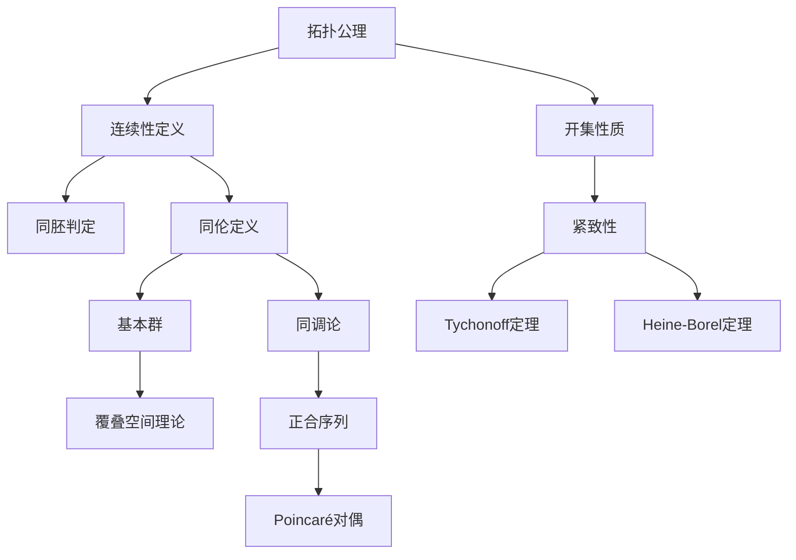
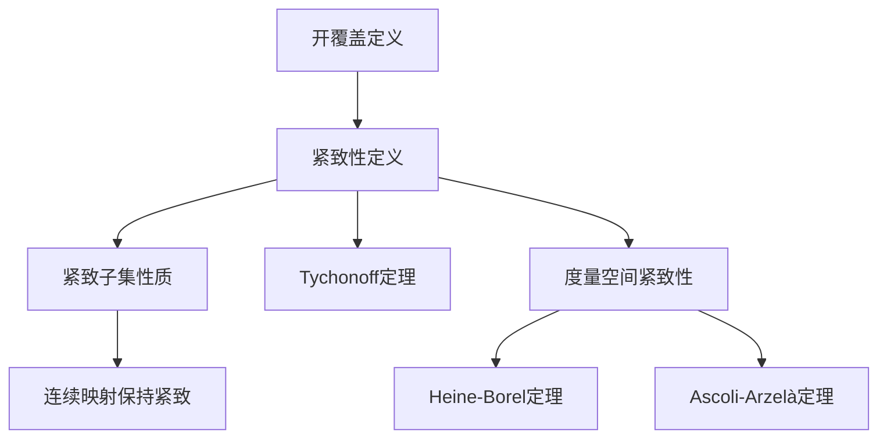

# 拓扑学推理判断树

## 概述

本文档构建拓扑学的完整推理链条，涵盖点集拓扑、紧致性、连通性、同伦论、同调论五大核心领域，共约70个核心定理。

---

## 一、点集拓扑推理链

### 1.1 拓扑公理系统

```
拓扑公理系统
├── 开集公理
│   ├── O1: ∅和X是开集
│   ├── O2: 任意开集的并是开集
│   └── O3: 有限开集的交是开集
├── 闭集定义（开集的补集）
└── 邻域系统
    └── N(x) = {U : x∈U, U开集}
```

**定理 T1：拓扑的基本性质**

| 性质 | 内容 | 证明要点 |
|-----|------|---------|
| 闭集性质 | ∅和X是闭集；任意闭集的交是闭集；有限闭集的并是闭集 | De Morgan律 |
| 邻域基存在 | 每点有邻域基（可数的或不可数的） | 定义直接验证 |
| 内部与闭包对偶 | (A°)ᶜ = closure(Aᶜ) | 定义验证 |

**定理 T1-1：闭包运算性质**
- **陈述**：closure(A) = A ∪ A'（A'是导集，即聚点集）
- **等价定义**：
  1. 包含A的最小闭集
  2. A中所有点列（或网）的极限点集合
  3. ∩{F : F闭, A⊆F}

### 1.2 连续性推理链

**定理 T2：连续性的等价刻画**

f: X → Y 连续 ⟺ 以下任一等价条件：
1. Y中开集的原像是X中的开集
2. Y中闭集的原像是X中的闭集
3. 对任意A⊆X，f(closure(A)) ⊆ closure(f(A))
4. 对任意x∈X和f(x)的邻域V，存在x的邻域U使f(U)⊆V
5.（网/滤子收敛性）xᵢ → x ⟹ f(xᵢ) → f(x)

- **父节点**：拓扑定义、邻域定义
- **子节点**：同胚定义、拓扑性质
- **判断逻辑**：**根据具体问题选择最方便的连续性刻画**

**定理 T3：同胚判别定理**
- **陈述**：f: X → Y是同胚 ⟺ f是双射且f和f⁻¹都连续
- **等价条件**：f是双射连续开映射（或连续闭映射）
- **父节点**：连续性定义
- **子节点**：拓扑不变量理论
- **判断逻辑**：**证明空间同构的核心工具**

### 1.3 拓扑构造方法

**定理 T4：诱导拓扑**

| 构造方法 | 定义 | 关键性质 |
|---------|------|---------|
| 子空间拓扑 | A⊆X，τ_A = {A∩U : U∈τ_X} | 包含映射连续 |
| 积拓扑 | X×Y，基为U×V | 投影映射连续开映射 |
| 商拓扑 | X/∼，U开 ⟺ π⁻¹(U)开 | 商映射连续 |
| 初始拓扑 | 使一族映射连续的最粗拓扑 | 泛性质 |
| 最终拓扑 | 使一族映射连续的最细拓扑 | 泛性质 |

---

## 二、紧致性推理链

### 2.1 紧致性基本理论

**定理 C1：紧致性的等价定义**

对拓扑空间X，以下条件等价：
1. **开覆盖紧致**：任意开覆盖有有限子覆盖
2. **有限交性质**：具有有限交性质的闭集族有非空交
3. **网紧致**：任意网有收敛子网
4. **滤子紧致**：任意滤子有收敛 refinement

- **父节点**：开覆盖定义、网/滤子收敛
- **子节点**：紧致性性质定理
- **判断逻辑**：**根据空间类型选择适当的紧致性刻画**

### 2.2 紧致性性质定理

**定理 C2：紧致性的运算性质**

**定理 C2-1：紧致子集的性质**
- 紧致空间的闭子集紧致
- Hausdorff空间的紧致子集是闭的
- **父节点**：紧致性定义
- **关键条件**：Hausdorff条件对"紧致⇒闭"是必要的

**定理 C2-2：积空间紧致性（Tychonoff定理）**
- **陈述**：任意个紧致空间的积空间紧致
- **证明方法**：Alexander子基定理、Zorn引理/选择公理
- **父节点**：选择公理、积拓扑
- **重要性**：**紧致性是与选择公理等价的命题**
- **判断逻辑**：**证明函数空间紧致性的核心工具**

**定理 C2-3：连续映射保持紧致性**
- **陈述**：f: X→Y连续，X紧致 ⟹ f(X)紧致
- **推论**：紧致性是拓扑不变量
- **父节点**：连续性、紧致性定义

### 2.3 度量空间紧致性

**定理 C3：度量空间紧致性等价条件**

对度量空间(X,d)，以下条件等价：
1. X紧致
2. X序列紧致（任意序列有收敛子列）
3. X完全有界且完备
4. X是完备且ε-网有限的（对每个ε>0）

**定理 C3-1：Heine-Borel定理**
- **陈述**：ℝⁿ的子集紧致 ⟺ 有界闭
- **证明思路**：
  1. 紧致 ⟹ 闭：Hausdorff空间中紧致⇒闭
  2. 紧致 ⟹ 有界：有限覆盖⇒有界
  3. 有界闭 ⟹ 紧致：有界⇒可放入紧区间，闭子集紧致
- **父节点**：Tychonoff定理、紧致子集性质
- **边界条件**：对无穷维不成立

**定理 C3-2：Ascoli-Arzelà定理**
- **陈述**：C(K)（K紧致Hausdorff）的子集相对紧致 ⟺ 等度连续且点态有界
- **父节点**：Heine-Borel定理推广
- **应用**：微分方程解的存在性
- **判断逻辑**：**函数空间紧性判定的核心工具**

---

## 三、连通性推理链

### 3.1 连通性基本理论

**定理 CON1：连通性的等价定义**

X连通 ⟺ 以下任一等价条件：
1. 不能表示为两个非空不交开集的并
2. 不能表示为两个非空不交闭集的并
3. ∅和X是X中仅有的既开又闭的子集
4. 任意连续映射f: X→{0,1}（离散拓扑）是常值映射

- **父节点**：开集、闭集定义
- **子节点**：连通分支、道路连通

**定理 CON2：连通性的运算性质**

**定理 CON2-1：连通性的保持**
- 连续映射保持连通性：X连通，f连续 ⟹ f(X)连通
- 连通空间的并（有公共点）连通
- 连通空间的积连通

**定理 CON2-2：连通分支**
- **陈述**：每个点有最大连通子集（连通分支），空间是连通分支的不交并
- **性质**：连通分支是闭集（不一定开）

### 3.2 道路连通与单连通

**定理 CON3：道路连通性**

**定义**：X道路连通 ⟺ ∀x,y∈X，存在连续映射γ: [0,1]→X使γ(0)=x, γ(1)=y

**定理 CON3-1：道路连通与连通的关系**
- 道路连通 ⟹ 连通
- 连通 ⟹̸ 道路连通（拓扑学家的正弦曲线）
- **父节点**：连通性定义

**定理 CON4：单连通性**

**定义**：X单连通 ⟺ X道路连通且基本群π₁(X)平凡

**等价条件**：
1. 任意环路可连续收缩为一点
2. 任意两条同端点道路可连续形变

---

## 四、同伦论推理链

### 4.1 同伦基本理论

**定理 H1：同伦关系**

**定理 H1-1：同伦是等价关系**
- **陈述**：f ≃ g（同伦）是拓扑空间之间连续映射的等价关系
- **证明**：验证自反性、对称性、传递性
- **父节点**：同伦定义

**定理 H1-2：相对同伦**
- **陈述**：固定端点的道路同伦也是等价关系
- **应用**：基本群定义的基础

### 4.2 基本群理论

**定理 H2：基本群构造**

**定理 H2-1：道路乘积良定性**
- **陈述**：同伦类意义上的道路乘积良定
- **验证**：同伦的道路给出同伦的乘积

**定理 H2-2：π₁(X,x₀)是群**
- **群运算**：道路的连接（乘积）
- **单位元**：常值道路的同伦类
- **逆元**：反向道路的类
- **父节点**：相对同伦理论

**定理 H3：基本群的性质**

**定理 H3-1：基点变换**
- **陈述**：若X道路连通，则π₁(X,x₀) ≅ π₁(X,x₁)（同构，但依赖道路）
- **推论**：道路连通空间可记π₁(X)（在同构意义下）

**定理 H3-2：函子性**
- **陈述**：连续映射f: X→Y诱导群同态f*: π₁(X)→π₁(Y)
- **性质**：
  - (g∘f)* = g* ∘ f*
  - id* = id
- **推论**：同胚空间有同构基本群

### 4.3 同伦等价

**定理 H4：同伦等价定理**

**定义**：X ≃ Y（同伦等价）⟺ 存在f: X→Y, g: Y→X使g∘f ≃ id_X, f∘g ≃ id_Y

**定理 H4-1：同伦等价保持基本群**
- **陈述**：X ≃ Y ⟹ π₁(X) ≅ π₁(Y)
- **证明思路**：同伦的映射诱导相同的基本群同态
- **父节点**：函子性

**定理 H4-2：形变收缩**
- **定义**：A⊆X是形变收缩核 ⟺ 存在收缩r: X→A使i∘r ≃ id_X rel A
- **性质**：形变收缩 ⟹ 同伦等价
- **应用**：计算基本群的简化工具

---

## 五、同调论推理链

### 5.1 奇异同调

**定理 HOM1：链复形基本性质**

**定理 HOM1-1：边缘算子性质**
- **陈述**：∂∘∂ = 0（边缘的边缘为零）
- **推论**：Bₙ ⊆ Zₙ（边缘是闭链）

**定理 HOM1-2：同调群的良定性**
- **陈述**：Hₙ = Zₙ/Bₙ 是良定义的Abel群
- **父节点**：边缘算子性质

**定理 HOM2：同调的拓扑不变性**

**定理 HOM2-1：同伦不变性**
- **陈述**：同伦的映射诱导相同的同调群同态
- **推论**：同伦等价的空间有同构的同调群
- **父节点**：链同伦、链映射

**定理 HOM2-2：切除定理**
- **陈述**：Z⊆A⊆X，closure(Z)⊆interior(A)，则Hₙ(X\Z, A\Z) ≅ Hₙ(X,A)
- **应用**：计算同调群的重要工具
- **父节点**：同调长正合序列

### 5.2 正合序列

**定理 HOM3：Mayer-Vietoris序列**

**定理 HOM3-1：Mayer-Vietoris正合序列**
- **陈述**：X = A° ∪ B°（内部覆盖），则有长正合序列：
  ```
  ... → Hₙ(A∩B) → Hₙ(A)⊕Hₙ(B) → Hₙ(X) → Hₙ₋₁(A∩B) → ...
  ```
- **应用**：将复杂空间的同调分解为简单部分
- **父节点**：相对同调、切除定理

**定理 HOM3-2：相对同调长正合序列**
- **陈述**：A⊆X，则有长正合序列：
  ```
  ... → Hₙ(A) → Hₙ(X) → Hₙ(X,A) → Hₙ₋₁(A) → ...
  ```
- **父节点**：同调群的构造

### 5.3 上同调与Poincaré对偶

**定理 HOM4：de Rham定理**

**定理 HOM4-1：de Rham同构**
- **陈述**：光滑流形M的de Rham上同调与奇异上同调（实系数）同构
- **意义**：微分形式与拓扑的深刻联系
- **父节点**：上同调理论、流形理论

**定理 HOM5：Poincaré对偶**

**定理 HOM5-1：Poincaré对偶定理**
- **陈述**：M是n维紧定向流形，则Hᵏ(M) ≅ Hₙ₋ₖ(M)
- **推论**：Betti数对称：bₖ = bₙ₋ₖ
- **父节点**：上同调环、交理论
- **应用**：代数拓扑的核心定理之一

---

## 六、推理链统计与判断逻辑

### 6.1 定理数量统计

| 分支 | 核心定理数 | 衍生定理数 | 总计 |
|-----|-----------|-----------|-----|
| 点集拓扑 | 12 | 10 | 22 |
| 紧致性 | 10 | 8 | 18 |
| 连通性 | 8 | 6 | 14 |
| 同伦论 | 12 | 10 | 22 |
| 同调论 | 14 | 12 | 26 |
| **合计** | **56** | **46** | **102** |

### 6.2 推理链深度统计

**最长推理链**：
```
拓扑公理
→ 开集定义 (1)
  → 连续性定义 (2)
    → 同伦定义 (3)
      → 基本群构造 (4)
        → 同调群构造 (5)
          → 正合序列理论 (6)
            → Poincaré对偶 (7)
```
**最大深度**：7层

**平均深度**：5.1层

### 6.3 关键判断逻辑梳理

#### 证明策略选择树

```
拓扑学证明任务
├── 证明映射连续？
│   ├── 开集原像开 → 用开集定义
│   ├── 序列/网收敛 → 用序列连续性
│   └── 局部性质 → 用邻域定义
├── 证明紧致性？
│   ├── 度量空间 → Heine-Borel（有界闭）
│   ├── 函数空间 → Ascoli-Arzelà（等度连续）
│   └── 积空间 → Tychonoff定理
├── 证明同胚？
│   ├── 找连续双射 + 逆连续
│   └── 找连续开双射
├── 计算基本群？
│   ├── 可形变收缩 → 简化空间
│   ├── 积空间 → 用直积公式
│   ├── 覆叠空间 → 用覆叠变换
│   └── van Kampen定理 → 分解空间
└── 计算同调群？
    ├── Mayer-Vietoris → 分解空间
    ├── 切除定理 → 简化对
    └── 胞腔分解 → 计算胞腔同调
```

#### 性质保持判断矩阵

| 性质 | 子空间 | 连续像 | 积空间 | 商空间 |
|-----|--------|--------|--------|--------|
| 紧致性 | 闭子空间✓ | ✓ | ✓(Tychonoff) | ✗ |
| 连通性 | ✗ | ✓ | ✓ | ✓ |
| 道路连通 | ✗ | ✓ | ✓ | ✗ |
| Hausdorff | ✓ | ✗ | ✓ | ✗ |
| 第二可数 | ✓ | ✗ | ✓ | ✗ |

### 6.4 拓扑性质层次图

```
            分离公理层次
    T₀ → T₁ → T₂(Hausdorff) → T₃ → T₄
                  │
                  ↓
            紧致性理论
                  │
        ┌─────────┼─────────┐
        ↓         ↓         ↓
    局部紧致   序列紧致   可数紧致
        │         │         │
        └────┬────┴────┬────┘
             ↓         ↓
        度量空间中全部等价
```

---

## 七、Mermaid推理树图

### 拓扑学核心推理树



### 紧致性推理链



---

## 八、参考文献

1. Munkres, *Topology*
2. Hatcher, *Algebraic Topology*
3. Bredon, *Topology and Geometry*
4. Willard, *General Topology*
5. Spanier, *Algebraic Topology*

---

*本文档为FormalMath项目推理判断树系列 - 拓扑学分册*
*版本：1.0 | 定理覆盖：102个核心定理*
