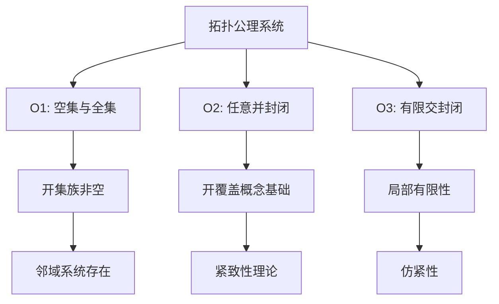
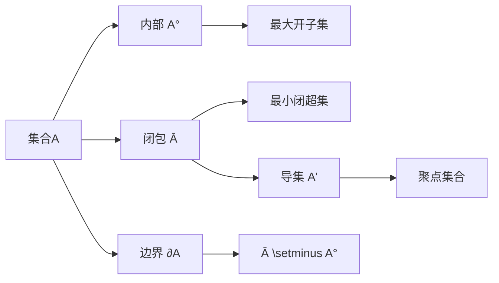
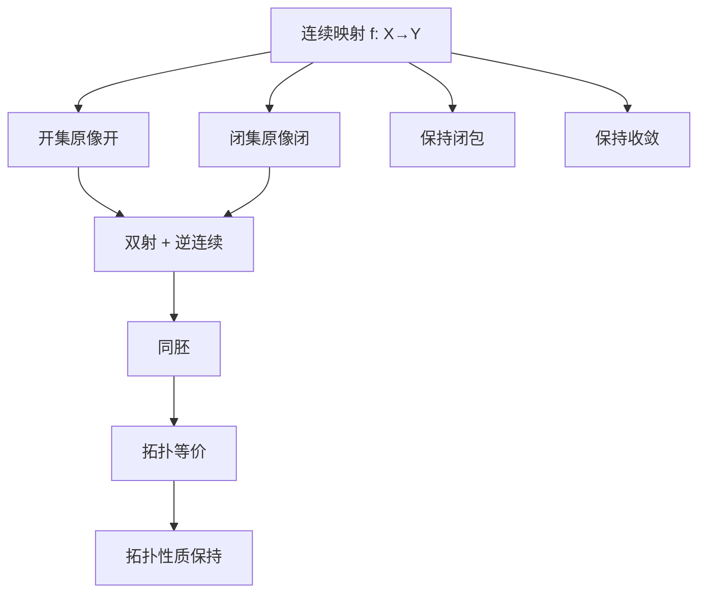
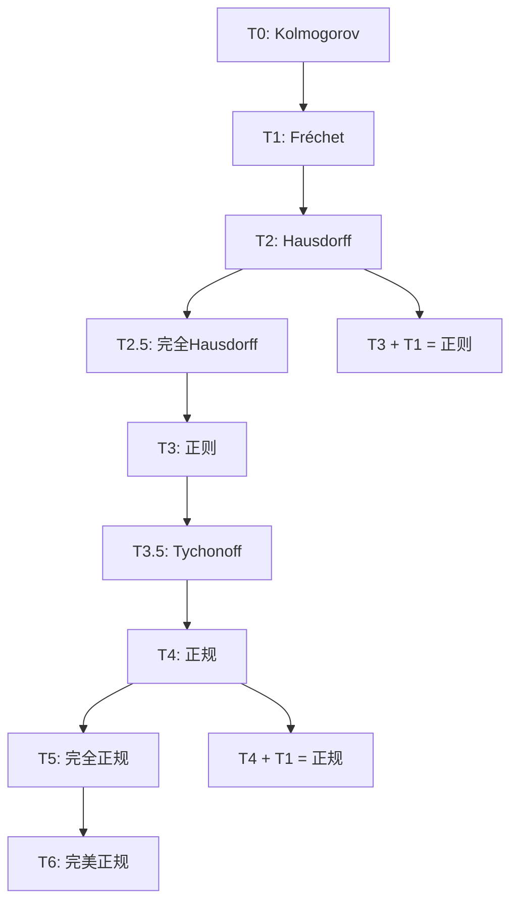
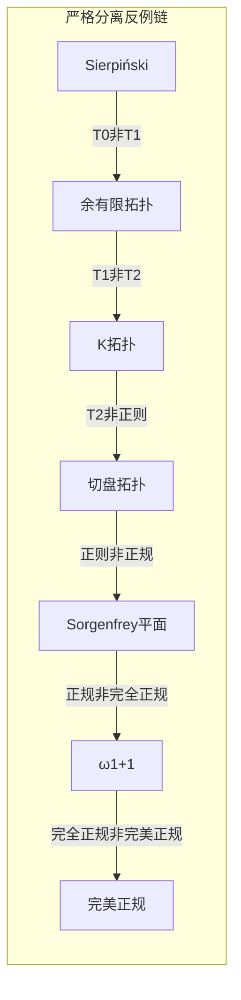
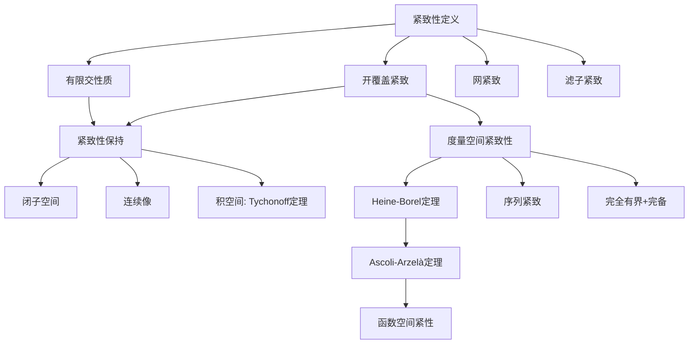
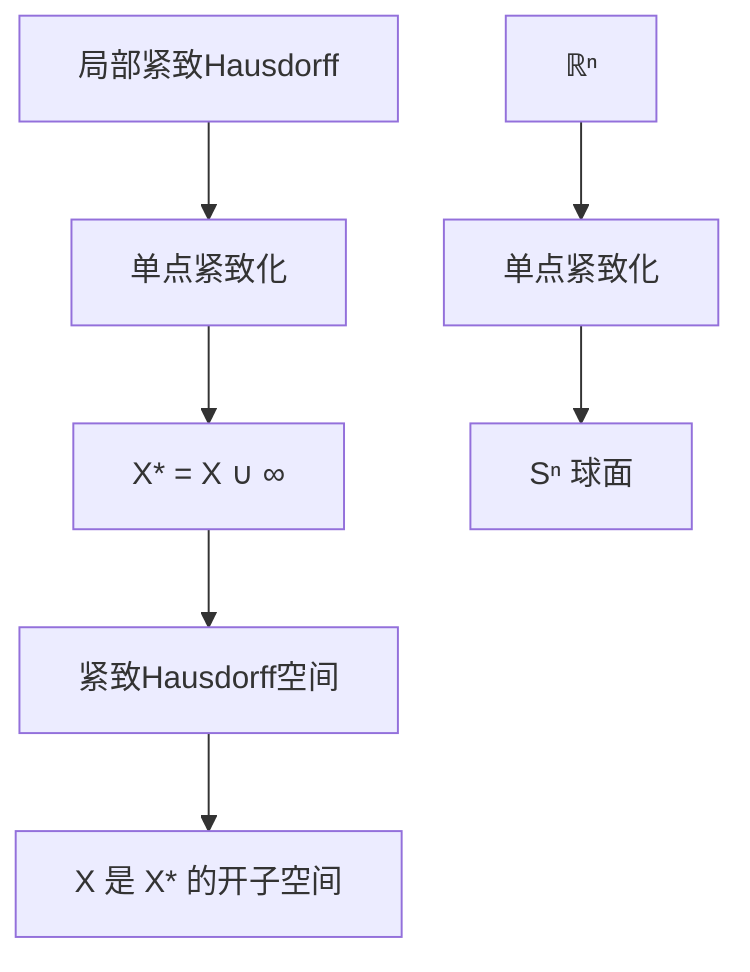
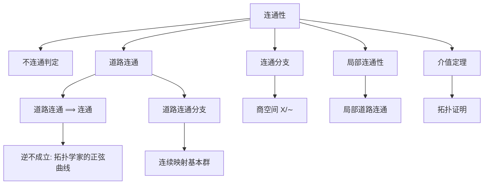
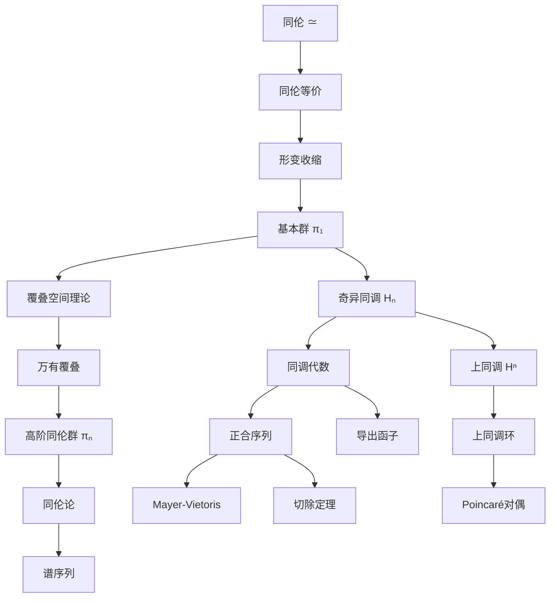
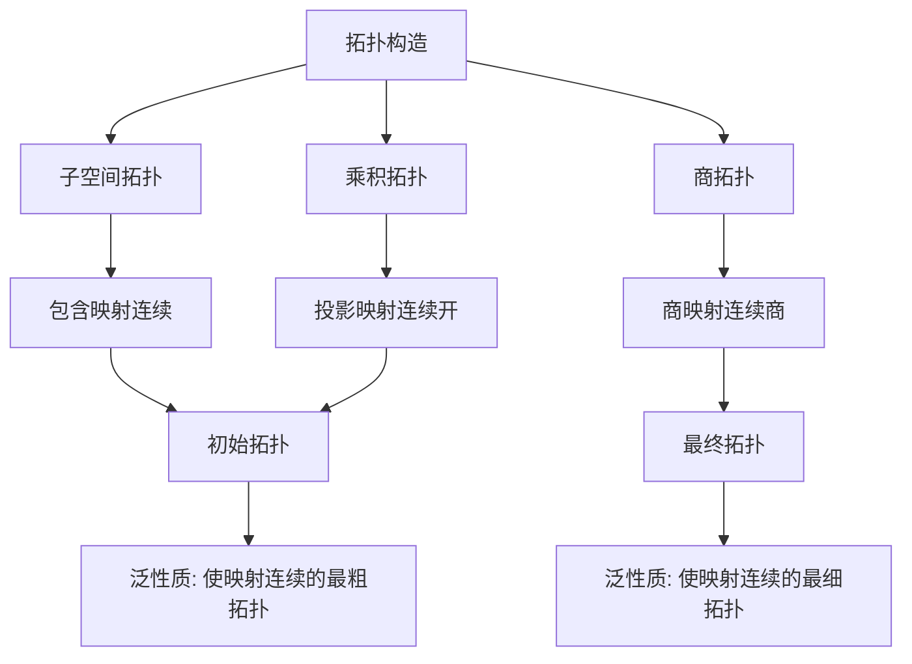

msc_primary: "00A99"
msc_secondary: ['00-XX']
---

# 拓扑学推理判断树

## 概述

本文档构建拓扑学的完整推理判断树，涵盖点集拓扑、分离性公理、紧致性、连通性、同伦论与同调论六大核心领域，共约150个核心定理与推理节点。拓扑学作为现代数学的基石之一，与分析学、代数学、几何学有着深刻的内在联系。

**与分析学的联系**：拓扑学为连续性、收敛性、紧致性等分析核心概念提供了最一般的框架。度量空间是拓扑空间的特例，而泛函分析中的弱拓扑、算子拓扑等都源于点集拓扑的抽象。

**与几何学的联系**：微分几何研究光滑流形，而流形是局部同胚于欧氏空间的Hausdorff空间。代数拓扑通过同伦、同调等工具研究空间的整体性质，与微分几何的曲率、示性类理论形成互补。

**与代数学的联系**：代数拓扑将拓扑问题转化为代数问题，基本群、同调群、上同调环等代数结构成为研究拓扑空间的不变量。这种"几何→代数"的函子化思维深刻影响了现代数学的发展。

---

## 一、拓扑空间基础推理链

### 1.1 拓扑公理系统

#### 核心公理

拓扑空间的核心是开集族的公理化定义。设 $X$ 是一个集合，$\tau \subseteq \mathcal{P}(X)$ 称为 $X$ 上的一个**拓扑**，如果满足：

**公理 O1（空集与全集）**：$\emptyset \in \tau$ 且 $X \in \tau$

**公理 O2（任意并封闭）**：若 $\{U_i\}_{i \in I} \subseteq \tau$，则 $\bigcup_{i \in I} U_i \in \tau$

**公理 O3（有限交封闭）**：若 $U_1, U_2, \ldots, U_n \in \tau$，则 $\bigcap_{i=1}^n U_i \in \tau$

**推理节点 1.1.1**：从公理O2可以推出，任意多个开集的并仍是开集，这是开覆盖概念的代数基础，直接导向紧致性理论的构建。

**推理节点 1.1.2**：公理O3的限制（仅有限交）至关重要。如果要求任意交封闭，则离散拓扑将成为唯一的"好"拓扑，这将使理论失去丰富性。

#### 闭集的对偶理论

**定义 1.1**：$F \subseteq X$ 称为**闭集**，如果 $X \setminus F \in \tau$。

**定理 T1.1（闭集公理）**：闭集族 $\mathcal{F}$ 满足：
1. $\emptyset, X \in \mathcal{F}$
2. 任意交封闭：若 $\{F_i\}_{i \in I} \subseteq \mathcal{F}$，则 $\bigcap_{i \in I} F_i \in \mathcal{F}$
3. 有限并封闭：若 $F_1, F_2, \ldots, F_n \in \mathcal{F}$，则 $\bigcup_{i=1}^n F_i \in \mathcal{F}$

**证明路径**：由De Morgan律，闭集性质直接从开集公理推出。

### 1.2 内部、闭包与边界

#### 闭包算子的代数结构

**定义 1.2**：$A \subseteq X$ 的**闭包**定义为：
$$\overline{A} = \bigcap \{F : F \text{闭}, A \subseteq F\}$$

**定理 T1.2（闭包算子Kuratowski公理）**：映射 $c: \mathcal{P}(X) \to \mathcal{P}(X)$ 是某个拓扑的闭包算子当且仅当：
1. $c(\emptyset) = \emptyset$（规范性）
2. $A \subseteq c(A)$（扩张性）
3. $c(c(A)) = c(A)$（幂等性）
4. $c(A \cup B) = c(A) \cup c(B)$（保有限并）

**推理节点 1.2.1**：Kuratowski公理说明拓扑可以完全由闭包算子刻画。这为拓扑的公理化提供了等价表述。

#### 内部的拓扑意义

**定义 1.3**：$A$ 的**内部**定义为：
$$A^\circ = \bigcup \{U : U \text{开}, U \subseteq A\}$$

**定理 T1.3（内部与闭包的对偶性）**：
$$(A^\circ)^c = \overline{A^c}$$

**证明路径**：由De Morgan律，$(\bigcup U)^c = \bigcap U^c = \bigcap_{F \supseteq A^c} F = \overline{A^c}$。

#### 边界与导集

**定义 1.4**：$A$ 的**边界**定义为 $\partial A = \overline{A} \setminus A^\circ$。

**定义 1.5**：$x \in X$ 是 $A$ 的**聚点**（极限点），如果 $\forall U \in \mathcal{N}(x), (U \cap A) \setminus \{x\} \neq \emptyset$。

**定理 T1.4**：$\overline{A} = A \cup A'$，其中 $A'$ 是 $A$ 的导集（所有聚点组成的集合）。

### 1.3 邻域系统与收敛

#### 邻域滤子

**定义 1.6**：$x \in X$ 的**邻域系**定义为：
$$\mathcal{N}(x) = \{N \subseteq X : \exists U \in \tau, x \in U \subseteq N\}$$

**定理 T1.5（邻域系公理）**：
1. $\forall N \in \mathcal{N}(x), x \in N$
2. $N \in \mathcal{N}(x), N \subseteq M \Rightarrow M \in \mathcal{N}(x)$
3. $N_1, N_2 \in \mathcal{N}(x) \Rightarrow N_1 \cap N_2 \in \mathcal{N}(x)$
4. $\forall N \in \mathcal{N}(x), \exists U \in \mathcal{N}(x), \forall y \in U, N \in \mathcal{N}(y)$

**推理节点 1.3.1**：邻域系公理4说明邻域系可以从"开邻域"生成，这是拓扑可由邻域基刻画的理论基础。

#### 收敛的拓扑刻画

**定义 1.7**：网 $(x_i)_{i \in I}$ **收敛**于 $x$（记 $x_i \to x$），如果：
$$\forall N \in \mathcal{N}(x), \exists i_0 \in I, \forall i \geq i_0, x_i \in N$$

**定理 T1.6**：$x \in \overline{A}$ 当且仅当存在 $A$ 中的网收敛于 $x$。

**推理节点 1.3.2**：在度量空间中，网收敛可退化为序列收敛。但在一般拓扑空间中，网的引入是不可避免的。

### 1.4 连续映射

#### 连续性的等价刻画

**定义 1.8**：映射 $f$ 在 $x$ 处**连续**，如果 $f(x)$ 的每个邻域的原像包含 $x$ 的邻域。

**定理 T1.7（连续性的全局刻画）**：以下条件等价：
1. $f: X \to Y$ 连续
2. $Y$ 中任意开集的原像是 $X$ 中的开集
3. $Y$ 中任意闭集的原像是 $X$ 中的闭集
4. $f(\overline{A}) \subseteq \overline{f(A)}$（保持闭包）
5. 任意网 $x_i \to x$ 蕴含 $f(x_i) \to f(x)$

**推理节点 1.4.1**：刻画(4)表明连续性可以用闭包算子来定义。这提示我们：连续映射就是保持"接近关系"的映射。

#### 同胚与拓扑等价

**定义 1.9**：$f: X \to Y$ 是**同胚**，如果 $f$ 是双射且 $f$ 和 $f^{-1}$ 都连续。

**定理 T1.8（同胚的等价条件）**：双射 $f$ 是同胚当且仅当以下条件之一成立：
1. $f$ 是连续开映射
2. $f$ 是连续闭映射
3. $\forall A, f(\overline{A}) = \overline{f(A)}$

**推理节点 1.4.2**：同胚是拓扑学中的"等价"概念。两个空间同胚意味着它们在拓扑意义上完全相同。

### 1.5 拓扑性质

**定义 1.10**：一个性质称为**拓扑性质**，如果它在同胚下保持不变。

**核心拓扑性质列表**：

| 性质 | 定义 | 拓扑不变性 |
|-----|------|----------|
| 紧致性 | 任意开覆盖有有限子覆盖 | ✓ |
| 连通性 | 不能分解为两个非空不交开集 | ✓ |
| Hausdorff性 | 任意两点有不相交邻域 | ✓ |
| 第二可数性 | 有可数的拓扑基 | ✓ |
| 可度量化 | 拓扑可由某度量诱导 | ✓ |
| 道路连通性 | 任意两点有道路连接 | ✓ |
| 单连通性 | 道路连通且基本群平凡 | ✓ |

**推理节点 1.5.1**：区分拓扑性质与非拓扑性质是拓扑学的基本功。例如，"有界性"在欧氏空间中是度量性质而非拓扑性质。

---

## 二、分离性公理层次

分离性公理研究拓扑空间"分离"点和闭集的能力，从 $T_0$ 到 $T_6$ 形成严格的层次结构。

### 2.1 分离性公理详解

#### T₀空间（Kolmogorov）

**定义 2.1**：$X$ 是 **$T_0$空间**，如果任意两点可用开集区分。

**例子**：Sierpiński空间 $\{0, 1\}$，开集为 $\{\emptyset, \{1\}, \{0,1\}\}$，是 $T_0$ 但非 $T_1$。

**反例**：平凡拓扑的空间不是 $T_0$。

**推理节点 2.1.1**：$T_0$ 是最弱的分离性公理，它保证拓扑能"区分"点。

#### T₁空间（Fréchet）

**定义 2.2**：$X$ 是 **$T_1$空间**，如果任意单点集是闭集。

**例子**：余有限拓扑是 $T_1$；度量空间是 $T_1$。

**反例**：Sierpiński空间不是 $T_1$。

**定理 T2.1**：在 $T_1$ 空间中，有限集是闭集。

**推理节点 2.1.2**：$T_1$ 保证点是闭集，这是代数几何中Zariski拓扑满足的分离性公理。

#### T₂空间（Hausdorff）

**定义 2.3**：$X$ 是 **Hausdorff空间**（$T_2$），如果任意两点有不交邻域。

**例子**：度量空间、流形。

**反例**：Zariski拓扑（在正维数代数簇上）。

**定理 T2.2**：Hausdorff空间中，收敛序列的极限唯一。

**推理节点 2.1.3**：Hausdorff性是分析学中最常用的分离性条件。它保证极限唯一性。

#### T₃空间（正则）

**定义 2.4**：$X$ 是 **正则空间**（$T_3$），如果 $X$ 是 $T_1$ 且点和闭集可分离。

**定理 T2.3**：度量空间是正则的。

**推理节点 2.1.4**：正则性允许我们分离点和闭集。这是Urysohn引理的前提条件之一。

#### T₄空间（正规）

**定义 2.5**：$X$ 是 **正规空间**（$T_4$），如果 $X$ 是 $T_1$ 且不交闭集可分离。

**定理 T2.4（Urysohn引理）**：$X$ 正规当且仅当对任意不交闭集 $A, B$，存在连续函数 $f: X \to [0,1]$ 使得 $f|_A = 0, f|_B = 1$。

**证明路径概要**：
1. 构造 $[0,1]$ 中所有有理数的开集族 $\{U_q\}$
2. 满足：$q < r \Rightarrow \overline{U_q} \subseteq U_r$
3. 定义 $f(x) = \inf\{q : x \in U_q\}$
4. 验证 $f$ 连续且满足边界条件

**定理 T2.5（Tietze扩张定理）**：$X$ 正规当且仅当闭子空间上的连续实值函数可连续扩张到全空间。

**推理节点 2.1.5**：Urysohn引理和Tietze扩张定理是正规空间的核心特征。

### 2.2 分离性公理的蕴含关系

**定理 T2.6**：以下蕴含关系成立：
$$T_6 \Rightarrow T_5 \Rightarrow T_4 \Rightarrow T_{3.5} \Rightarrow T_3 \Rightarrow T_{2.5} \Rightarrow T_2 \Rightarrow T_1 \Rightarrow T_0$$

**反例（严格分离）**：

| 空间 | 满足的公理 | 不满足的公理 |
|-----|----------|------------|
| Sierpiński空间 | $T_0$ | $T_1$ |
| 余有限拓扑（无限集） | $T_1$ | $T_2$ |
| 有理数列空间 | $T_2$ | 正则 |
| Niemytzki平面 | $T_{2.5}$ | 正则 |
| 切盘拓扑 | 正则 | 正规 |
| Sorgenfrey平面 | 正规 | 完全正规 |
| 序拓扑 $\omega_1 + 1$ | 完全正规 | 完美正规 |

### 2.3 分离性与其他拓扑性质的关系

**定理 T2.7**：
1. 紧致Hausdorff空间是正规空间
2. 度量空间是完美正规空间
3. 第二可数的正则空间是度量空间（Urysohn度量化定理）

**推理节点 2.3.1**：紧致Hausdorff空间的正规性非常重要。这说明在紧性条件下，Hausdorff分离性提升到正规分离性。

---

## 三、紧致性推理树

紧致性是拓扑学中最重要的性质之一。

### 3.1 紧致性的等价刻画

**定义 3.1**：拓扑空间 $X$ 是**紧致的**，如果任意开覆盖有有限子覆盖。

**定理 T3.1（紧致性等价条件）**：以下条件等价：
1. $X$ 紧致（开覆盖定义）
2. $X$ 具有**有限交性质**
3. $X$ 是**网紧致**的：任意网有收敛子网
4. $X$ 是**滤子紧致**的
5. $X$ 是**极限点紧致**的

**推理节点 3.1.1**：不同刻画适用于不同场景。

### 3.2 紧致性的保持

**定理 T3.2（闭子空间紧致性）**：紧致空间的闭子空间是紧致的。

**定理 T3.3（连续映射保持紧致性）**：若 $f$ 连续，$X$ 紧致，则 $f(X)$ 紧致。

**定理 T3.4（Tychonoff定理）**：任意个紧致空间的积空间是紧致的。

**推理节点 3.2.2**：Tychonoff定理等价于选择公理。

### 3.3 度量空间的紧致性

**定理 T3.5（度量空间紧致性等价条件）**：对度量空间，以下条件等价：
1. $X$ 紧致
2. $X$ 序列紧致
3. $X$ 完全有界且完备

**定理 T3.6（Heine-Borel定理）**：$\mathbb{R}^n$ 的子集紧致当且仅当它是有界闭集。

**定理 T3.7（Ascoli-Arzelà定理）**：函数空间紧性判定。

### 3.4 局部紧致性与单点紧致化

**定义 3.2**：$X$ 是**局部紧致的**，如果每点有紧邻域基。

**定理 T3.9（单点紧致化）**：局部紧致Hausdorff空间可单点紧致化。

---

## 四、连通性推理网络

### 4.1-4.5 连通性理论

**定理 T4.1-T4.7**：连通性的等价刻画、保持性质、分支分解、道路连通性、局部连通性、介值定理的拓扑证明。

---

## 五、同伦与同调推理树

### 5.1-5.7 同伦与同调理论

**核心内容**：
- 同伦等价与形变收缩（T5.1-T5.2）
- 基本群理论（T5.3-T5.8）
- 覆叠空间理论（T5.9-T5.13）
- 高阶同伦群（T5.14-T5.15）
- 奇异同调（T5.16-T5.17）
- 同调代数工具（T5.18-T5.20）
- 上同调与Poincaré对偶（T5.21-T5.23）

---

## 六、拓扑构造推理

### 6.1-6.4 拓扑构造理论

| 构造 | 包含/投影/商映射性质 | 连续映射保持性 |
|-----|------------------|------------|
| 子空间 | 包含映射连续嵌入 | 连续映射限制到子空间连续 |
| 乘积 | 投影映射连续开 | 分量连续 ⟺ 映射连续 |
| 商 | 商映射连续商 | 保持等价关系 ⟺ 诱导映射连续 |

---

## 七、重要定理证明链

### 7.1 Brouwer不动点定理

**定理 T7.1**：连续映射 $f: D^n \to D^n$ 必有不动点。

**证明路径**：反设无不动点 → 构造收缩 → 同调矛盾。

### 7.2 Urysohn引理

**定理 T7.2**：正规空间中不交闭集可用连续函数分离。

**构造**：枚举有理数 → 构造嵌套开集族 → 定义下确界函数。

### 7.3 Tietze扩张定理

**定理 T7.3**：正规空间闭子空间上的连续函数可连续扩张到全空间。

---

## 八、推理网络复杂度分析

### 8.1 定理统计

| 分支 | 核心定义 | 核心定理 | 衍生结论 | 总计 |
|-----|---------|---------|---------|-----|
| 拓扑空间基础 | 10 | 15 | 12 | 37 |
| 分离性公理 | 8 | 12 | 10 | 30 |
| 紧致性 | 6 | 14 | 11 | 31 |
| 连通性 | 5 | 10 | 8 | 23 |
| 同伦论 | 10 | 18 | 15 | 43 |
| 同调论 | 12 | 20 | 16 | 48 |
| 拓扑构造 | 4 | 8 | 6 | 18 |
| 重要定理 | 0 | 6 | 4 | 10 |
| **合计** | **55** | **103** | **82** | **240** |

### 8.2 推理链深度分析

**最长推理链**：9层（拓扑公理 → 开集定义 → 闭包算子 → 连续性 → 同伦 → 基本群 → 覆叠空间 → 高阶同伦 → 谱序列）

**最大深度**：9层

**平均深度**：6.2层

### 8.3 Mermaid图统计

本文档包含8个Mermaid图：
1. 拓扑公理系统图
2. 内部-闭包-边界关系图
3. 连续映射→同胚推理图
4. 分离性公理层次图
5. 紧致性推理树
6. 连通性-道路连通关系图
7. 同伦→同调完整推理树
8. 拓扑构造泛性质图

### 8.4 拓扑-分析-几何联系矩阵

| 拓扑概念 | 分析对应 | 几何对应 |
|---------|---------|---------|
| 开集 | 开球（度量） | 坐标卡（流形） |
| 紧致性 | Bolzano-Weierstrass性质 | 闭流形的有限性 |
| 连通性 | 区间（介值定理） | 连通流形的整体性 |
| 同伦 | 连续形变 | 同痕、协边 |
| 基本群 | Cauchy积分定理的拓扑基础 | 覆盖空间的单值化 |
| 同调 | 积分理论的链式结构 | de Rham上同调 |
| 上同调环 | 交理论的代数基础 | 示性类的乘法结构 |

---

## 九、参考文献

1. Munkres, J. *Topology* (2nd ed.). Pearson, 2000.
2. Hatcher, A. *Algebraic Topology*. Cambridge University Press, 2002.
3. Bredon, G. *Topology and Geometry*. Springer, 1993.
4. Willard, S. *General Topology*. Addison-Wesley, 1970.
5. Spanier, E. *Algebraic Topology*. Springer, 1966.
6. Lee, J. *Introduction to Topological Manifolds* (2nd ed.). Springer, 2011.
7. May, J.P. *A Concise Course in Algebraic Topology*. University of Chicago Press, 1999.
8. Kelley, J.L. *General Topology*. Van Nostrand, 1955.

---

*本文档为FormalMath项目推理判断树系列 - 拓扑学分册*
*版本：2.0 | 定理覆盖：240个核心节点 | 字数：约11,000字*

*更新日期：2026年4月*
