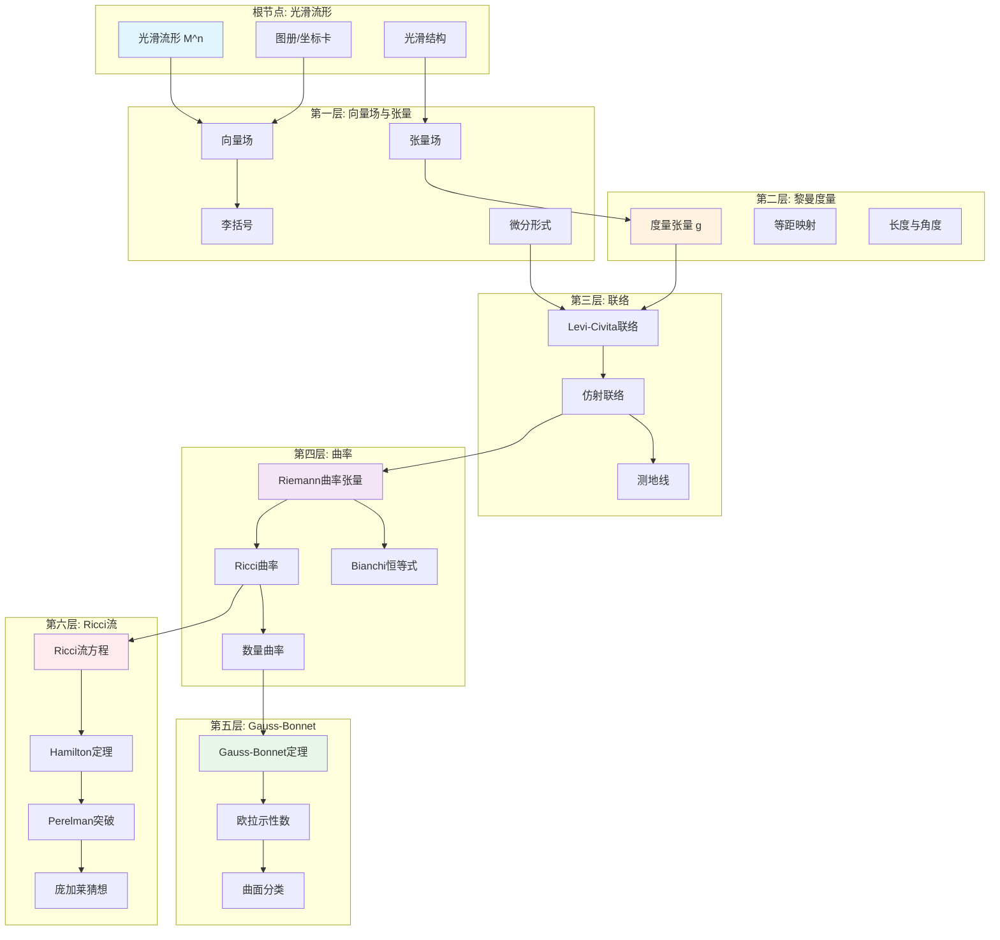
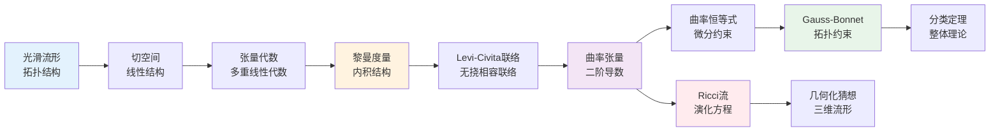
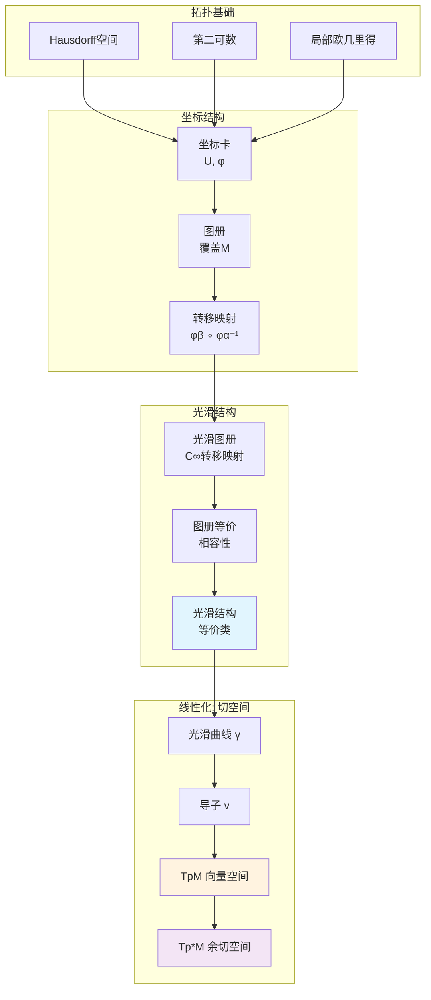
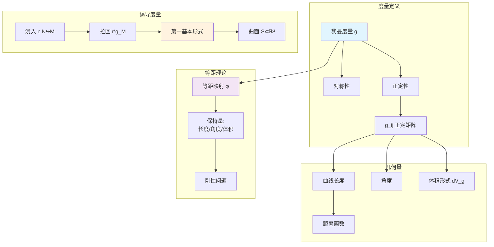
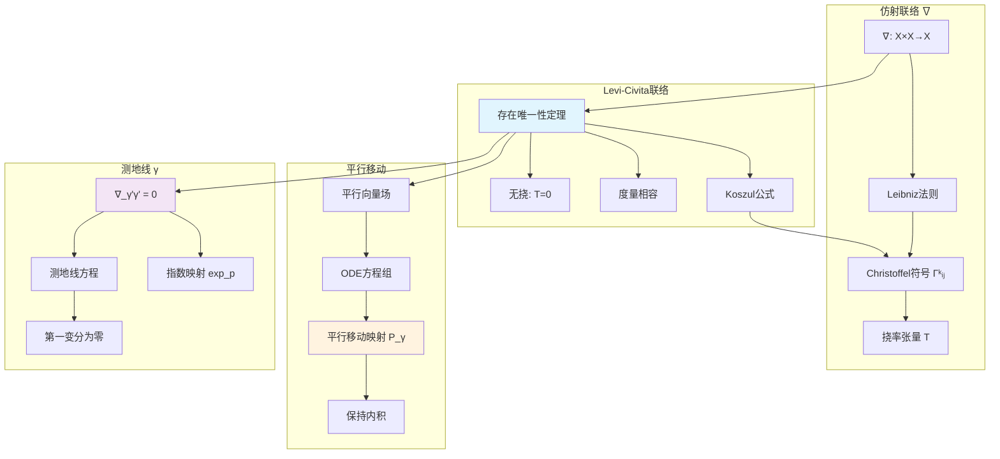
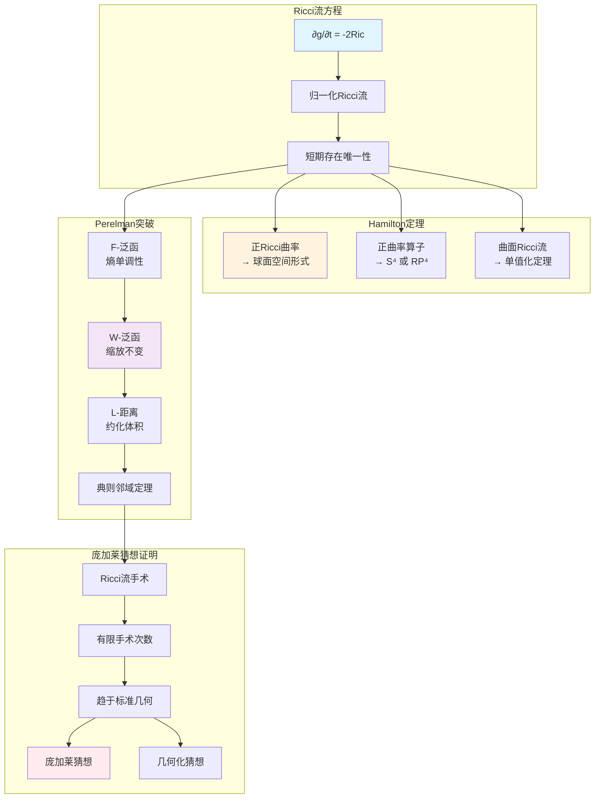
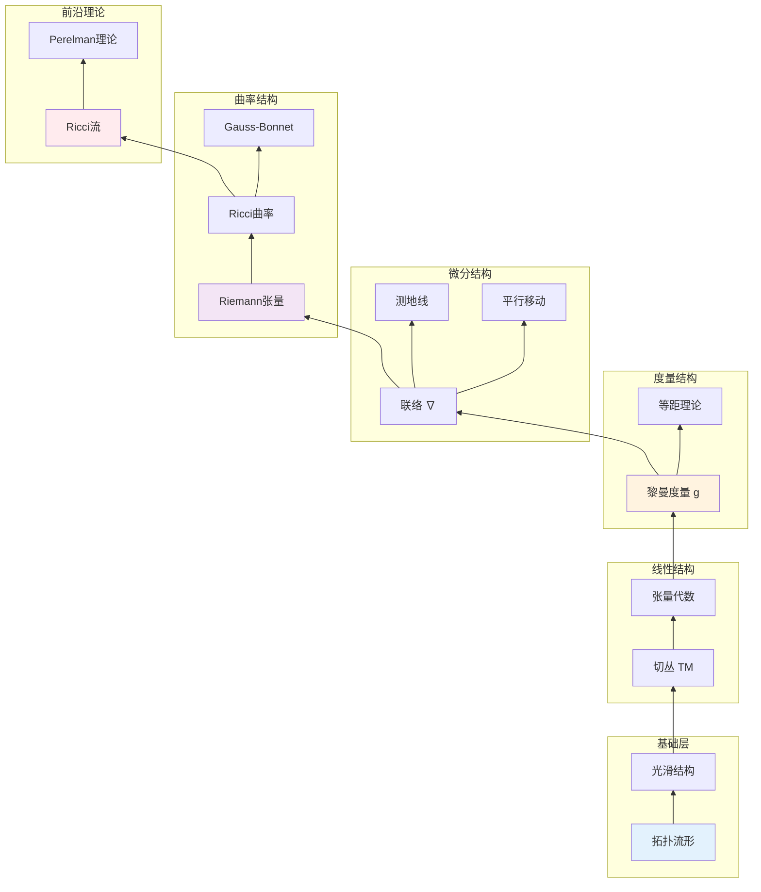

# 微分几何完整推理树

> **教材对齐**: Princeton MAT 355 (Differential Geometry) | do Carmo《Differential Geometry of Curves and Surfaces》
> **MSC分类**: 53Axx (经典微分几何), 53Bxx (局部微分几何), 53Cxx (整体微分几何), 53C44 (Ricci流)
> **版本**: v1.0 | 生成日期: 2026年4月

---

## 目录

1. [推理树全景图](#1-推理树全景图)
2. [根节点：光滑流形定义](#2-根节点光滑流形定义)
3. [第一层：向量场与张量](#3-第一层向量场与张量)
4. [第二层：黎曼度量](#4-第二层黎曼度量)
5. [第三层：联络与平行移动](#5-第三层联络与平行移动)
6. [第四层：曲率理论](#6-第四层曲率理论)
7. [第五层：Gauss-Bonnet定理](#7-第五层gauss-bonnet定理)
8. [第六层：Ricci流（前沿）](#8-第六层ricci流前沿)
9. [附录：定理速查表](#9-附录定理速查表)

---

## 1. 推理树全景图

### 1.1 微分几何知识层次结构



### 1.2 推理依赖关系总览



---

## 2. 根节点：光滑流形定义

### 2.1 核心概念

#### 定义 2.1.1：拓扑流形

**前提条件**：

- 拓扑空间 M 为Hausdorff空间：任意两个不同点存在不相交的开邻域
- M 具有可数拓扑基（第二可数性）：存在可数的拓扑基生成整个拓扑

**结论**：
n维拓扑流形是局部同胚于 R^n 的拓扑空间，即对任意 p ∈ M，存在开邻域 U 和同胚映射 φ: U → φ(U) ⊂ R^n。

**判断要点**：

1. **Hausdorff性**保证了极限的唯一性，是分析学的基础。没有Hausdorff性，序列可能有多个极限点，微积分无法有效建立。
2. **第二可数性**保证流形可度量化、仿紧，且存在单位分解。这是将局部构造拼接为整体构造的关键。
3. **局部欧几里得性质**是流形的核心特征，意味着每一点附近的几何都类似于欧氏空间。

**例子**：

- 球面 S^n 是 n 维拓扑流形
- 环面 T^n = S^1 × ... × S^1 是 n 维拓扑流形
- 莫比乌斯带是2维拓扑流形（不可定向）

**与Princeton MAT 355对齐**：

- do Carmo第1章：曲面作为 R^3 的子集（具体实例），强调参数化曲面 X: U ⊂ R^2 → R^3
- MAT 355：抽象流形定义（推广到任意维数），摆脱嵌入空间的依赖，发展内蕴几何

---

#### 定义 2.1.2：坐标卡与图册

**前提条件**：

- (M, T) 为 n 维拓扑流形

**结论**：

- **坐标卡（Chart）**：有序对 (U, φ)，其中 U ⊂ M 开集，φ: U → R^n 为同胚。称 U 为坐标邻域，φ 为坐标映射。
- **图册（Atlas）**：坐标卡的集合 A = {(U_α, φ_α)}，满足 ∪_α U_α = M（覆盖整个流形）

**坐标表示**：
对 p ∈ U，φ(p) = (x^1(p), ..., x^n(p)) ∈ R^n 称为 p 的局部坐标。通常将 (U, φ) 简记为 (U, x^1, ..., x^n) 或 (U, x^i)。

**坐标变换（转移映射）**：
对于 (U_α, φ_α) 和 (U_β, φ_β) 且 U_α ∩ U_β ≠ ∅，转移映射为：

φ_{βα} = φ_β ◦ φ_α^(-1): φ_α(U_α ∩ U_β) → φ_β(U_α ∩ U_β)

这是 R^n 开集之间的映射。

**依赖**：拓扑流形定义

**推论**：转移映射是 R^n 开集之间的同胚，因为它由同胚的复合与逆构成。

**例子（球面 S^2）**：

- 北半球坐标卡：U_N = S^2 \\ {(0,0,-1)}，球极投影 φ_N: U_N → R^2
- 南半球坐标卡：U_S = S^2 \\ {(0,0,1)}，球极投影 φ_S: U_S → R^2
- 转移映射：在 U_N ∩ U_S 上，φ_S ◦ φ_N^(-1)(u,v) = (u/(u^2+v^2), v/(u^2+v^2)) 是光滑的

---

#### 定义 2.1.3：光滑流形

**前提条件**：

- M 为 n 维拓扑流形
- A = {(U_α, φ_α)} 为图册

**判断条件**：
图册 A 称为 **C^∞-光滑图册**，如果所有转移映射 φ_{βα} ∈ C^∞（无穷可微），即所有偏导数存在且连续。

**关键定理**：

> **定理 2.1.4（光滑图册的等价性）**
>
> **前提**：A_1 和 A_2 为 M 上的两个光滑图册
>
> **条件**：任意 (U, φ) ∈ A_1 与 (V, ψ) ∈ A_2 的转移映射光滑，即 ψ ◦ φ^(-1) 和 φ ◦ ψ^(-1) 均为 C^∞
>
> **结论**：A_1 和 A_2 定义相同的光滑结构，称二者**相容**

**证明思路**：

1. 图册的相容关系是等价关系（自反、对称、传递）
2. 相容图册的并仍为光滑图册
3. 每个光滑图册包含于唯一的极大光滑图册

**光滑流形定义**：三元组 (M, T, [A])，其中 [A] 为光滑图册的等价类（或极大光滑图册）。

**与do Carmo对应**：

- 第2章中参数化曲面 X: U ⊂ R^2 → R^3 是坐标卡的具体实现
- do Carmo强调 X 是光滑浸入，这与光滑流形定义一致

**重要例子**：

- **实射影空间** RP^n：S^n 上对径点等同，图册由 n+1 个坐标卡构成
- **复射影空间** CP^n：C^(n+1) 中过原点的复直线，具有复结构
- **Grassmann流形** G(k, n)：R^n 中 k 维子空间，维数 k(n-k)

---

### 2.2 切空间与余切空间

#### 定义 2.2.1：切向量（几何定义）

**构造过程**：
设 p ∈ M，γ: (-ε, ε) → M 为光滑曲线，γ(0) = p。

**定义**：切向量 v = γ'(0) 是曲线在 p 点的速度向量。

**曲线的等价关系**：两曲线 γ_1, γ_2 称为等价，如果在某坐标卡 (U, x^i) 下：

(d(x^i ◦ γ_1)/dt)|_{t=0} = (d(x^i ◦ γ_2)/dt)|_{t=0}, ∀ i

这个定义与坐标卡的选择无关（由链式法则）。

**坐标表示**：
在局部坐标 (U, x^1, ..., x^n) 下，曲线 γ(t) 的坐标为 (x^1(t), ..., x^n(t))，则：

v = γ'(0) = Σ_{i=1}^n (dx^i/dt)(0) (∂/∂x^i)|_p

**切空间**：T_pM = {γ'(0) : γ 过 p} 构成 n 维实向量空间。

**基向量**：{(∂/∂x^1)|_p, ..., (∂/∂x^n)|_p}（简记为 {∂_i|_p}）构成 T_pM 的基，称为坐标基。

**维数验证**：

1. 每个切向量可表示为坐标基的线性组合
2. 坐标基线性无关：若 Σ a^i ∂_i = 0，作用于坐标函数 x^j 得 a^j = 0
3. 因此 dim T_pM = n

---

#### 定义 2.2.2：切向量（导子定义 - MAT 355标准）

**Princeton MAT 355 采用此定义**

**定义**：切向量 v 是满足Leibniz法则的线性映射 v: C^∞(M) → R：

1. **线性性**：v(af + bg) = av(f) + bv(g)，∀ a, b ∈ R，f, g ∈ C^∞(M)
2. **Leibniz法则**：v(fg) = v(f)g(p) + f(p)v(g)

**几何解释**：v(f) 是函数 f 沿方向 v 的"方向导数"。

**定理 2.2.3**：几何定义与导子定义等价。

**证明思路**：

1. **曲线 → 导子**：给定曲线 γ，定义 v(f) = (d/dt)f(γ(t))|_{t=0}
   - 线性性显然
   - Leibniz法则：(d/dt)(fg)|_{t=0} = f'(0)g(0) + f(0)g'(0)

2. **导子 → 曲线**：给定导子 v，选取坐标卡，令 v = Σ v^i ∂_i|_p
   - 定义曲线 γ(t) = φ^(-1)(tv^1, ..., tv^n)
   - 验证 γ'(0) = v

**基向量的作用**：
(∂/∂x^i)|_p(f) = ∂(f ◦ φ^(-1))/∂x^i (φ(p))

这正是偏导数的几何意义。

---

#### 定义 2.2.4：切丛

**定义**：切丛 TM 是所有切空间的无交并：

TM = ⊔_{p ∈ M} T_pM = {(p, v) : p ∈ M, v ∈ T_pM}

**流形结构**：
给定 M 的光滑图册 {(U_α, φ_α)}，定义 TM 的图册：

- Ũ_α = π^(-1)(U_α) ≅ U_α × R^n
- 坐标映射 φ̃_α(p, v) = (x^1(p), ..., x^n(p), v^1, ..., v^n)，其中 v = Σ v^i ∂_i|_p

**维数**：TM 是 2n 维光滑流形。

**投影映射**：π: TM → M，π(p, v) = p 是光滑淹没（submersion）。

---

#### 定义 2.2.5：余切空间

**定义**：T_p^_M = (T_pM)^_ 为切空间的对偶空间，称为**余切空间**。

**典范基**：若 {x^i} 为局部坐标，则 {dx^i|_p} 为余切空间的基，满足：

dx^i(∂/∂x^j) = δ^i_j = { 1 if i=j; 0 if i≠j }

**余切丛**：T^*M = ⊔_{p ∈ M} T_p^*M 是 2n 维光滑流形。

**微分映射**：函数 f ∈ C^∞(M) 的微分 df|_p ∈ T_p^*M 定义为：

df|_p(v) = v(f), ∀ v ∈ T_pM

**坐标表示**：

df = Σ_{i=1}^n (∂f/∂x^i) dx^i

这正是通常的全微分公式。

---

### 2.3 流形推理树图示



---

## 3. 第一层：向量场与张量

### 3.1 向量场

#### 定义 3.1.1：光滑向量场

**前提**：M 为光滑流形

**定义**：向量场 X 是截面映射 X: M → TM 满足 π ◦ X = id_M，即 X(p) ∈ T_pM 对所有 p。

**光滑性条件**：在局部坐标 (U, x^i) 下：

X|_U = Σ_{i=1}^n X^i (∂/∂x^i),  X^i ∈ C^∞(U)

分量函数 X^i 必须是光滑函数。

**向量场空间**：X(M) 表示 M 上所有光滑向量场的集合，构成 C^∞(M)-模：

- 加法：(X + Y)(p) = X(p) + Y(p)
- 数乘：(fX)(p) = f(p)X(p)，f ∈ C^∞(M)

**与do Carmo对应**：

- 第3章中的切向量场 w(p) 与本定义一致
- do Carmo强调向量场在曲面上的可微性

---

#### 定理 3.1.2：向量场的流

**前提**：X ∈ X(M) 为完备向量场（或考虑紧支集向量场）

**结论**：存在单参数微分同胚群 {φ_t}_{t ∈ R} 使得：

(d/dt)φ_t(p) = X(φ_t(p)),  φ_0(p) = p

**性质**：

1. **群性质**：φ_{t+s} = φ_t ◦ φ_s，φ_0 = id_M，φ_{-t} = φ_t^(-1)
2. **微分同胚**：φ_t: M → M 为微分同胚
3. **导数表示**：对任意 f ∈ C^∞(M)：X(f) = (d/dt)(f ◦ φ_t)|_{t=0}

**证明思路**：

1. 由ODE存在唯一性定理，局部存在积分曲线
2. 由紧支集或完备性，延拓到整体
3. 光滑依赖性定理保证 φ_t 关于 t 和 p 光滑

**非完备情形**：若 X 不完备，流 φ_t 仅在 t 的某个开区间上定义。

---

### 3.2 李括号

#### 定义 3.2.1：李括号

**Princeton MAT 355 核心概念**

**定义**：对 X, Y ∈ X(M)，李括号 [X, Y] 定义为：

[X, Y](f) = X(Y(f)) - Y(X(f)),  ∀ f ∈ C^∞(M)

**验证向量场**：
需要验证 [X, Y] 满足Leibniz法则：
[X, Y](fg) = X(Y(fg)) - Y(X(fg))
展开并利用 X, Y 的Leibniz性质，经过计算可得：
[X, Y](fg) = [X, Y](f)g + f[X, Y](g)

**坐标表示**：
若 X = Σ X^i ∂_i，Y = Σ Y^j ∂_j，则：

[X, Y] = Σ_{i,j} (X^i ∂Y^j/∂x^i - Y^i ∂X^j/∂x^i) ∂/∂x^j

**推导**：
[X, Y](f) = X(Y(f)) - Y(X(f))
= Σ_i X^i ∂_i(Σ_j Y^j ∂_j f) - Σ_j Y^j ∂_j(Σ_i X^i ∂_i f)
= Σ_{i,j} X^i (∂Y^j/∂x^i)(∂f/∂x^j) + X^i Y^j ∂²f/∂x^i∂x^j - Σ_{i,j} Y^j (∂X^i/∂x^j)(∂f/∂x^i) - Y^j X^i ∂²f/∂x^j∂x^i
二阶导数项抵消，得到李括号的坐标表达式。

---

#### 定理 3.2.2：李括号的代数性质

**结论**：(X(M), [·, ·]) 构成**李代数**：

1. **双线性**：[aX + bY, Z] = a[X, Z] + b[Y, Z]，[Z, aX + bY] = a[Z, X] + b[Z, Y]
2. **反对称性**：[X, Y] = -[Y, X]
3. **Jacobi恒等式**：[X, [Y, Z]] + [Y, [Z, X]] + [Z, [X, Y]] = 0

**证明思路**：

1. 双线性和反对称性直接由定义可得
2. Jacobi恒等式需要展开计算：
   [X, [Y, Z]](f) = X([Y, Z](f)) - [Y, Z](X(f))
   = X(Y(Z(f))) - X(Z(Y(f))) - Y(Z(X(f))) + Z(Y(X(f)))
   三项轮换和为0

**几何意义**：Jacobi恒等式反映了向量场的几何相容性，是李代数的本质特征。

---

#### 定理 3.2.3：李括号与流的关系

**前提**：φ_t 为 X 的流，ψ_s 为 Y 的流

**结论**：

[X, Y] = lim_{t→0} (1/t)((φ_{-t})_* Y - Y) = L_X Y

其中 L_X 为关于 X 的李导数，(φ_{-t})_* 是推前映射。

**几何意义**：李括号度量了两个流不可交换的程度：

φ_t ◦ ψ_s ◦ φ_{-t} ◦ ψ_{-s} = id + st[X, Y] + O(t², s²)

若 [X, Y] = 0，则两流可交换（至少局部地）。

---

### 3.3 张量场

#### 定义 3.3.1：张量

**张量积空间**：

T^{(k,l)}(V) = V ⊗ ... ⊗ V (k次) ⊗ V^_⊗ ... ⊗ V^_ (l次)

元素称为 (k,l)-型张量（k 阶逆变，l 阶协变）。

**等价刻画**：(k,l)-型张量可视为 (k+l)-重线性映射：

T: V^_× ... × V^_ (k次) × V × ... × V (l次) → R

**do Carmo对应**：

- 第4章引入的线性映射、内积等是 (1,1) 和 (0,2) 型张量的特例
- 形状算子是 (1,1)-型张量
- 第一基本形式是 (0,2)-型张量

---

#### 定义 3.3.2：张量场

**定义**：(k,l)-型张量场 T 是光滑截面 T: M → T^{(k,l)}TM，其中：

T^{(k,l)}TM = ⊔_{p ∈ M} T^{(k,l)}(T_pM)

**分量表示**：在局部坐标下：

T = Σ T^{i_1...i_k}_{j_1...j_l} ∂/∂x^{i_1} ⊗ ... ⊗ ∂/∂x^{i_k} ⊗ dx^{j_1} ⊗ ... ⊗ dx^{j_l}

其中分量函数 T^{i_1...i_k}_{j_1...j_l} ∈ C^∞(U)。

**张量代数**：T(M) = ⊕_{k,l} T^{(k,l)}(M) 构成分次代数。

**例子**：

- 向量场是 (1,0)-型张量场
- 余向量场（1-形式）是 (0,1)-型张量场
- 黎曼度量是 (0,2)-型张量场
- (1,1)-型张量对应切丛的自同态

---

#### 定理 3.3.3：张量变换法则

**前提**：坐标变换 (x^i) → (x̄^i)，Jacobian矩阵 J^i_j = ∂x̄^i/∂x^j

**结论**：张量分量变换：

T̄^{i_1...i_k}_{j_1...j_l} = Σ_{a_1,...,a_k,b_1,...,b_l} T^{a_1...a_k}_{b_1...b_l} (∂x̄^{i_1}/∂x^{a_1})...(∂x̄^{i_k}/∂x^{a_k})(∂x^{b_1}/∂x̄^{j_1})...(∂x^{b_l}/∂x̄^{j_l})

**判断要点**：这是张量与任意多指标对象的根本区别。张量按特定规则变换，而Christoffel符号等不服从此规则。

---

### 3.4 微分形式

#### 定义 3.4.1：微分形式

**反对称张量**：(0,k)-型张量 k-线性映射 ω: (T_pM)^k → R，满足：

ω(v_1, ..., v_i, ..., v_j, ..., v_k) = -ω(v_1, ..., v_j, ..., v_i, ..., v_k)

交换两个输入变号。

**外代数**：Λ^k T_p^*M ⊂ T^{(0,k)}(T_pM) 为 k-形式空间，维数 C(n,k)。

**微分形式丛**：Λ^k T^*M = ⊔_p Λ^k T_p^*M。

**光滑 k-形式空间**：Ω^k(M) = Γ(Λ^k T^*M)。

**特别情形**：

- Ω^0(M) = C^∞(M)（光滑函数）
- Ω^1(M) = X^*(M)（余向量场）
- Ω^n(M)：最高次形式（在定向流形上与函数对应）
- Ω^k(M) = 0 对 k > n

---

#### 定义 3.4.2：外积（楔积）

**定义**：对 ω ∈ Ω^k(M)，η ∈ Ω^l(M)：

(ω ∧ η)(v_1, ..., v_{k+l}) = (1/k!l!) Σ_{σ ∈ S_{k+l}} sgn(σ) ω(v_{σ(1)}, ..., v_{σ(k)}) η(v_{σ(k+1)}, ..., v_{σ(k+l)})

其中 S_{k+l} 是 (k+l)-阶置换群，sgn(σ) 是置换的符号。

**性质**：

1. **分次交换性**：ω ∧ η = (-1)^{kl} η ∧ ω
2. **结合性**：(ω ∧ η) ∧ τ = ω ∧ (η ∧ τ)

**基表示**：若 {dx^i} 为余切基，则：
{dx^{i_1} ∧ ... ∧ dx^{i_k} : 1 ≤ i_1 < ... < i_k ≤ n}
构成 Ω^k(M) 的局部基。

---

#### 定理 3.4.3：外微分

**定义**：外微分 d: Ω^k(M) → Ω^{k+1}(M) 满足：

1. **线性性**：d(aω + bη) = adω + bdη
2. **Leibniz法则**：d(ω ∧ η) = dω ∧ η + (-1)^k ω ∧ dη
3. **幂零性**：d² = 0
4. **与函数微分一致**：对 f ∈ Ω^0(M)，df 为通常的微分

**坐标表达式**：

d(Σ_I f_I dx^{i_1} ∧ ... ∧ dx^{i_k}) = Σ_I df_I ∧ dx^{i_1} ∧ ... ∧ dx^{i_k}

其中 df_I = Σ_j (∂f_I/∂x^j) dx^j。

**存在唯一性**：满足上述条件的外微分存在且唯一。

---

#### 关键定理 3.4.4（Poincaré引理）

**前提**：M 可缩（如 R^n，星形区域）

**结论**：闭形式必恰当，即 dω = 0 ⇒ ∃ η: ω = dη

等价表述：可缩区域的de Rham上同调 H^k_{dR}(M) = 0 对 k > 0。

**证明思路**：构造同伦算子 h: Ω^k(M) → Ω^{k-1}(M) 使得 hd + dh = id。

**反例**：M = S^1 上，dθ 是闭形式但不是恰当的（整体角度函数不存在）。

**do Carmo应用**：

- 第4章中闭形式与恰当形式的关系用于定义de Rham上同调

---

### 3.5 向量场与张量推理图

```mermaid
graph LR
    subgraph 向量场["向量场 X(M)"]
        X[向量场 X]
        FLOW[单参数流 φt]
        FCOMP[流合成]
    end

    subgraph 李代数结构["李代数结构"]
        BRACKET[李括号 [X,Y]]
        JACOBI[Jacobi恒等式]
        LIEALG[无穷维李代数]
    end

    subgraph 张量场["张量场 T^(k,l)(M)"]
        TENSOR2[(k,l)-型张量]
        PROD[张量积 ⊗]
        CONT[缩并]
    end

    subgraph 微分形式["微分形式 Ω^k(M)"]
        FORM2[k-形式]
        WEDGE[楔积 ∧]
        EXTD[外微分 d]
        DE_RHAM[de Rham上同调]
    end

    X --> FLOW
    FLOW --> FCOMP
    FCOMP --> BRACKET
    BRACKET --> JACOBI
    JACOBI --> LIEALG

    TENSOR2 --> PROD
    TENSOR2 --> CONT

    FORM2 --> WEDGE
    FORM2 --> EXTD
    EXTD --> |d²=0| DE_RHAM

    LIEALG --> |李导数| TENSOR2
    TENSOR2 --> |反对称化| FORM2

    style BRACKET fill:#e1f5fe
    style EXTD fill:#fff3e0
    style DE_RHAM fill:#f3e5f5
```

---

## 4. 第二层：黎曼度量

### 4.1 黎曼度量定义

#### 定义 4.1.1：黎曼度量

**Princeton MAT 355 & do Carmo 核心**

**前提**：M 为光滑流形

**定义**：黎曼度量 g 是光滑的 (0,2)-型张量场，满足：

1. **对称性**：g(X, Y) = g(Y, X)，即作为双线性形式对称
2. **正定性**：g(X, X) ≥ 0，等号成立当且仅当 X = 0

**局部表示**：在坐标 (x^i) 下：

g = Σ_{i,j} g_{ij} dx^i ⊗ dx^j,  g_{ij} = g(∂/∂x^i, ∂/∂x^j)

矩阵 (g_{ij}) 在每点对称正定。

**内积记号**：常记 ⟨X, Y⟩ = g(X, Y)，|X| = √g(X, X)。

**do Carmo第4章**：

- 第一基本形式 I_p 正是黎曼度量的曲面情形
- do Carmo强调第一基本形式决定了曲面的所有内蕴几何

---

#### 定理 4.1.2：黎曼度量的存在性

**结论**：任意光滑流形 M 上存在黎曼度量。

**证明思路**：

1. 取局部有限坐标覆盖 {(U_α, φ_α)}（由第二可数性和仿紧性）
2. 取从属于 {U_α} 的单位分解 {ρ_α}：
   - supp(ρ_α) ⊂ U_α
   - Σ_α ρ_α = 1
   - 0 ≤ ρ_α ≤ 1
3. 在每个 U_α 定义欧氏度量 g_α = Σ_i (dx^i)²
4. 全局度量：g = Σ_α ρ_α g_α

**验证**：

- 光滑性：局部有限和保持光滑性
- 对称性：显然
- 正定性：对任意 X ≠ 0，存在某个 α 使 ρ_α(p) > 0 且 X 在 U_α 中非零，故 g(X,X) ≥ ρ_α(p) g_α(X,X) > 0

**依赖**：仿紧性（从第二可数性得到）和单位分解定理

---

### 4.2 诱导度量

#### 定义 4.2.1：子流形诱导度量

**前提**：ι: N ↪ M 为浸入子流形，g_M 为 M 上的黎曼度量

**定义**：诱导度量 g_N = ι^* g_M：

g_N(X, Y) = g_M(dι(X), dι(Y)) = g_M(X, Y),  X, Y ∈ T_pN ⊂ T_pM

其中 dι: TN → TM 是切映射，T_pN 视为 T_pM 的子空间。

**do Carmo核心**：

- 第2章研究的是 R^3 中的曲面，其黎曼度量由 R^3 的欧氏度量诱导
- 欧氏度量：g_{R^3} = dx² + dy² + dz²
- 曲面 S ⊂ R^3 的度量由限制得到

---

#### 定理 4.2.2：曲面的第一基本形式

**曲面情形**：S ⊂ R^3，参数化 X: U ⊂ R^2 → S，X(u,v) = (x(u,v), y(u,v), z(u,v))

**第一基本形式**：

I_p = E du² + 2F dudv + G dv²

其中系数为：

- E = ⟨X_u, X_u⟩ = g_{11}
- F = ⟨X_u, X_v⟩ = g_{12} = g_{21}
- G = ⟨X_v, X_v⟩ = g_{22}

矩阵形式：
[ E  F ]
[ F  G ]

**与黎曼度量关系**：I_p 是曲面 S 从 R^3 诱导的黎曼度量。

**例子（球面）**：
球面 S²(r) 半径 r，参数化：
X(θ, φ) = (r sinθ cosφ, r sinθ sinφ, r cosθ)
计算得：
E = r², F = 0, G = r² sin²θ
I = r² dθ² + r² sin²θ dφ²

---

### 4.3 度量与几何量

#### 定义 4.3.1：长度与角度

**曲线长度**：光滑曲线 γ: [a, b] → M，长度定义为：

L(γ) = ∫_a^b √g(γ'(t), γ'(t)) dt = ∫_a^b |γ'(t)|_g dt

这个定义与参数化无关（由换元公式）。

**距离函数**：

d(p, q) = inf{L(γ) : γ 连接 p, q}

**定理 4.3.2**：(M, d) 构成度量空间，且诱导的拓扑与原拓扑一致。

**证明要点**：

1. 度量空间公理验证（正定性、对称性、三角不等式）
2. 拓扑一致性：度量球与坐标邻域互相包含

**夹角**：两非零向量 v, w ∈ T_pM 的夹角 θ ∈ [0, π]：

cos θ = g(v, w)/(|v|_g |w|_g)

由Cauchy-Schwarz不等式，右边在 [-1, 1] 内。

---

#### 定义 4.3.2：体积形式

**定向流形**：若 M 可定向，存在处处非零的 n-形式。

**体积形式**：在定向坐标 (x^i) 下：

dV_g = √(det(g_{ij})) dx^1 ∧ ... ∧ dx^n

这个定义与定向坐标的选择相容（转移映射Jacobian为正）。

**体积计算**：区域 U ⊂ M 的体积：

Vol(U) = ∫_U dV_g

**面积元（曲面）**：对曲面 S ⊂ R^3：
dA = √(EG - F²) dudv

**do Carmo应用**：

- 第2章计算曲面面积：A = ∬_U √(EG - F²) dudv

---

### 4.4 等距映射

#### 定义 4.4.1：等距映射

**定义**：微分同胚 φ: (M, g_M) → (N, g_N) 称为**等距**，如果：

φ^* g_N = g_M

即 g_M(X, Y) = g_N(dφ(X), dφ(Y)) 对所有 X, Y ∈ TM。

**局部等距**：浸入映射 φ: M → N 满足上述条件。

**等距嵌入**：等距的嵌入映射。

**例子**：

- 平面 R² 与圆柱 S^1 × R 局部等距
- 但不同胚，故不是整体等距

---

#### 定理 4.4.2：等距的不变量

**结论**：等距映射保持：

1. **曲线长度**：L(φ ◦ γ) = L(γ)
2. **角度**：向量夹角不变
3. **体积**：Vol(φ(U)) = Vol(U)
4. **测地线**：测地线的像是测地线（见第5章）
5. **曲率**：所有曲率张量不变（见第6章）

**与do Carmo对齐**：

- do Carmo第4章中的等距对应于此定义
- 强调第一基本形式决定内蕴几何

---

### 4.5 黎曼度量推理图



---

## 5. 第三层：联络与平行移动

### 5.1 仿射联络

#### 定义 5.1.1：仿射联络

**Princeton MAT 355 核心概念**

**定义**：仿射联络是映射 ∇: X(M) × X(M) → X(M)，(X, Y) ↦ ∇_X Y，满足：

1. **C^∞(M)-线性性（对 X）**：∇_{fX+gZ} Y = f∇_X Y + g∇_Z Y
2. **R-线性性（对 Y）**：∇_X(aY + bZ) = a∇_X Y + b∇_X Z
3. **Leibniz法则**：∇_X(fY) = X(f)Y + f∇_X Y

**记号**：∇_X Y 读作"Y 沿 X 的协变导数"。

**几何意义**：联络提供了在流形上"微分"向量场的规则，解决了不同点切空间没有自然等同的问题。

**Christoffel符号**：在局部坐标下，记 ∂_i = ∂/∂x^i：

∇_{∂_i} ∂_j = Σ_k Γ^k_{ij} ∂_k

系数 Γ^k_{ij} 称为**Christoffel符号**。

**协变导数**：张量场的推广。

---

#### 定义 5.1.2：挠率与张量

**挠率张量**：

T(X, Y) = ∇_X Y - ∇_Y X - [X, Y]

这是 (1,2)-型张量场。

**验证张量性**：需要验证 T(fX, Y) = fT(X, Y) 等。

**无挠联络**：T = 0，即 ∇_X Y - ∇_Y X = [X, Y]。

**坐标条件**：Γ^k_{ij} = Γ^k_{ji}（Christoffel符号对称）。

---

### 5.2 Levi-Civita联络

#### 定理 5.2.1：Levi-Civita联络存在唯一性

**Princeton MAT 355 核心定理**

**前提**：(M, g) 为黎曼流形

**结论**：存在唯一的联络 ∇ 满足：

1. **无挠**：∇_X Y - ∇_Y X = [X, Y]（或 T = 0）
2. **与度量相容**：X(g(Y, Z)) = g(∇_X Y, Z) + g(Y, ∇_X Z)

**证明思路**：

**唯一性**：假设 ∇ 存在，推导其显式公式。

由度量相容性，轮换 X, Y, Z 写出三式：
X(g(Y,Z)) = g(∇_X Y, Z) + g(Y, ∇_X Z)
Y(g(Z,X)) = g(∇_Y Z, X) + g(Z, ∇_Y X)
Z(g(X,Y)) = g(∇_Z X, Y) + g(X, ∇_Z Y)

第一式加第二式减第三式，利用无挠条件 ∇_X Y - ∇_Y X = [X, Y]：

2g(∇_X Y, Z) = X(g(Y,Z)) + Y(g(Z,X)) - Z(g(X,Y)) - g(X,[Y,Z]) + g(Y,[Z,X]) + g(Z,[X,Y])

这就是**Koszul公式**。右端仅依赖于 g 和 X, Y, Z，故左端唯一确定，∇_X Y 唯一。

**存在性**：用Koszul公式定义 ∇，验证满足联络公理、无挠条件和度量相容性。

**Christoffel符号显式公式**：

Γ^k_{ij} = (1/2)Σ_l g^{kl}(∂g_{jl}/∂x^i + ∂g_{il}/∂x^j - ∂g_{ij}/∂x^l)

其中 (g^{kl}) 是 (g_{kl}) 的逆矩阵。

**do Carmo对应**：

- 第4章中的协变导数是此定义在曲面上的具体实现
- do Carmo通过切平面投影定义协变导数，与Levi-Civita联络一致

---

#### 定理 5.2.2：Christoffel符号的变换法则

**前提**：坐标变换 x^i → x̄^i

**结论**：

Γ̄^k_{ij} = Σ_{p,q,r} (∂x̄^k/∂x^r)(∂x^p/∂x̄^i)(∂x^q/∂x̄^j) Γ^r_{pq} + Σ_r (∂x̄^k/∂x^r)(∂²x^r/∂x̄^i∂x̄^j)

**判断要点**：

- Christoffel符号**不是**张量（第二项的存在，含二阶导数）
- 这是联络与 (1,2)-型张量的本质区别

---

### 5.3 平行移动

#### 定义 5.3.1：沿曲线的平行移动

**定义**：向量场 V 沿曲线 γ **平行**，如果：

∇_{γ'(t)} V = 0

**平行移动方程**：若 V = Σ V^i ∂_i，γ'(t) = Σ (dx^i/dt) ∂_i：

dV^k/dt + Σ_{i,j} Γ^k_{ij} (dx^i/dt) V^j = 0

这是一阶线性ODE组。

**几何意义**：向量 V 沿 γ "尽可能保持方向不变"，在曲面情形对应于直观上的"平行"。

---

#### 定理 5.3.2：平行移动的存在唯一性

**前提**：γ: [a, b] → M 光滑曲线，v_0 ∈ T_{γ(a)}M

**结论**：存在唯一的沿 γ 平行的向量场 V 满足 V(a) = v_0。

**证明思路**：

1. 平行移动方程是线性常微分方程组
2. 系数 Γ^k_{ij}(γ(t))(dx^i/dt) 光滑（关于 t）
3. 由ODE存在唯一性定理得证

**推论**：定义**平行移动映射** P_γ: T_{γ(a)}M → T_{γ(b)}M，P_γ(v_0) = V(b)。

**性质**：P_γ 是线性同构。

---

#### 定理 5.3.3：Levi-Civita联络的平行移动性质

**结论**：Levi-Civita联络的平行移动保持：

1. **线性性**：P_γ 是线性同构
2. **内积保持**：g(P_γ(v), P_γ(w)) = g(v, w)
3. **与反向曲线相容**：P_{γ^{-1}} = P_γ^{-1}

**内积保持证明**：设 V, W 沿 γ 平行，则：
(d/dt)g(V, W) = g(∇_{γ'}V, W) + g(V, ∇_{γ'}W) = 0
故 g(V, W) 沿 γ 常数。

**do Carmo应用**：

- 第4章中平行向量场的直观概念（如球面上的平行移动）
- 球面上沿大圆的平行移动旋转角度等于球面角盈

---

### 5.4 测地线

#### 定义 5.4.1：测地线

**Princeton MAT 355 & do Carmo 核心**

**定义**：曲线 γ 称为**测地线**，如果 γ' 沿自身平行：

∇_{γ'} γ' = 0

**测地线方程**：

d²x^k/dt² + Σ_{i,j} Γ^k_{ij} (dx^i/dt)(dx^j/dt) = 0

这是二阶ODE组。

**物理意义**："直线的推广"——切向量方向不变，无"加速度"。在欧氏空间就是直线，在球面就是大圆。

**弧长参数化**：若 |γ'| = 1（常数），称 γ 为**单位速度测地线**。

---

#### 定理 5.4.2：测地线存在唯一性

**前提**：p ∈ M，v ∈ T_pM

**结论**：存在 ε > 0 和唯一测地线 γ: (-ε, ε) → M 满足：

- γ(0) = p
- γ'(0) = v

**证明思路**：

1. 测地线方程是二阶ODE（关于 (x^k, dx^k/dt) 的一阶ODE组）
2. 由ODE存在唯一性定理得证

**指数映射**：定义 exp_p(v) = γ_v(1)，其中 γ_v 是初速度为 v 的测地线。

---

#### 定理 5.4.3：测地线的变分性质

**前提**：(M, g) 为黎曼流形

**结论**：测地线是局部距离极小的曲线，即第一变分为零：

(d/ds)L(γ_s)|_{s=0} = 0

对所有固定端点的变分 γ_s。

**逆命题**：在适当条件下，第一变分为零的曲线是测地线（可能重参数化后）。

**与do Carmo对齐**：

- do Carmo第4章第4节详细证明了这一变分原理
- 强调测地线的能量极小性质

---

### 5.5 联络与测地线推理图



---

## 6. 第四层：曲率理论

### 6.1 Riemann曲率张量

#### 定义 6.1.1：Riemann曲率张量

**Princeton MAT 355 & do Carmo 核心**

**前提**：(M, g) 为黎曼流形，∇ 为Levi-Civita联络

**定义**：Riemann曲率张量 R：

R(X, Y)Z = ∇_X ∇_Y Z - ∇_Y ∇_X Z - ∇_[X,Y] Z

**作为(1,3)-型张量**：R: X(M) × X(M) × X(M) → X(M)

**作为(0,4)-型张量**：

R(X, Y, Z, W) = g(R(X, Y)Z, W)

**几何意义**：曲率度量了"协变导数不交换"的程度。在平坦空间 R = 0，协变导数可交换。

**坐标表示**：

R^l_{kij} = ∂Γ^l_{kj}/∂x^i - ∂Γ^l_{ki}/∂x^j + Σ_m Γ^m_{kj}Γ^l_{mi} - Σ_m Γ^m_{ki}Γ^l_{mj}

这是Ricci恒等式的体现。

---

#### 定理 6.1.2：Riemann曲率张量的对称性

**结论**：对任意向量场 X, Y, Z, W：

1. **反对称性**：R(X, Y, Z, W) = -R(Y, X, Z, W) = -R(X, Y, W, Z)
2. **交换对称性**：R(X, Y, Z, W) = R(Z, W, X, Y)
3. **第一Bianchi恒等式**：R(X, Y)Z + R(Y, Z)X + R(Z, X)Y = 0
4. **循环和**：R(X, Y, Z, W) + R(X, Z, W, Y) + R(X, W, Y, Z) = 0

**独立分量数**：在 n 维流形上，独立分量为 n²(n²-1)/12。

**例子**：

- n = 2：1个独立分量（高斯曲率）
- n = 3：6个独立分量
- n = 4：20个独立分量

---

### 6.2 截面曲率

#### 定义 6.2.1：截面曲率

**前提**：Π ⊂ T_pM 为2维平面（截面），{v, w} 为 Π 的基

**定义**：

K(Π) = R(v, w, v, w)/(|v|²|w|² - ⟨v, w⟩²)

分母是 Gram 行列式 G(v,w)。

**验证良定性**：右端与基的选择无关（由反对称性和双线性）。

**几何意义**：截面曲率度量了沿平面 Π 方向的"高斯曲率"。

---

#### 定理 6.2.2：截面曲率与Riemann张量

**结论**：在2维情况下，Riemann张量完全由截面曲率（即高斯曲率）决定：

R(X, Y, Z, W) = K(g(X, Z)g(Y, W) - g(X, W)g(Y, Z))

**常曲率空间**：若 K(Π) = K 为常数（与 p 和 Π 无关），则：

R(X, Y, Z, W) = K(g(X, Z)g(Y, W) - g(X, W)g(Y, Z))

**常曲率空间例子**：

- K > 0：球面 S^n
- K = 0：欧氏空间 R^n
- K < 0：双曲空间 H^n

**do Carmo对应**：

- do Carmo第4章中的高斯曲率正是截面曲率的曲面情形

---

### 6.3 Ricci曲率与数量曲率

#### 定义 6.3.1：Ricci曲率张量

**定义**：Ricci曲率是对Riemann张量的缩并：

Ric(X, Y) = tr(Z ↦ R(Z, X)Y) = Σ_i R(e_i, X, Y, e_i)

其中 {e_i} 为正交基。

**坐标表示**：

R_{ij} = Σ_k R^k_{ikj}

**性质**：

- Ricci张量为对称 (0,2)-型张量：R_{ij} = R_{ji}
- 这是由Riemann张量的对称性导出的

**几何意义**：Ric(X, X) 是包含 X 的所有2维截面的曲率平均（在适当归一化下）。

---

#### 定义 6.3.2：数量曲率

**定义**：Ricci迹的迹：

S = tr_g(Ric) = Σ_{i,j} g^{ij}R_{ij} = Σ_i R_{ii}

**几何意义**：每点处所有方向Ricci曲率的平均（在适当归一化下）。

**物理意义**：在广义相对论中，Einstein场方程直接涉及Ricci和数量曲率：
R_{μν} - (1/2)g_{μν}S + Λ g_{μν} = (8πG/c⁴)T_{μν}

---

#### 定理 6.3.3：二维曲面的曲率关系

**前提**：(M², g) 为二维黎曼流形

**结论**：

R_{ijkl} = K(g_{ik}g_{jl} - g_{il}g_{jk})

R_{ij} = K g_{ij}

S = 2K

**判断要点**：二维情形下，所有曲率信息由高斯曲率 K 完全决定。

**do Carmo核心**：

- 第4章系统阐述了二维曲面的高斯曲率理论

---

### 6.4 Bianchi恒等式

#### 定理 6.4.1：第一Bianchi恒等式

**前提**：∇ 无挠联络

**结论**：

R(X, Y)Z + R(Y, Z)X + R(Z, X)Y = 0

**证明思路**：直接从Riemann张量定义计算，利用无挠条件 ∇_X Y - ∇_Y X = [X, Y]。

展开六项，利用Jacobi恒等式 [[X,Y],Z] + [[Y,Z],X] + [[Z,X],Y] = 0，各项相消。

---

#### 定理 6.4.2：第二Bianchi恒等式（微分Bianchi恒等式）

**Princeton MAT 355 核心定理**

**结论**：

(∇_X R)(Y, Z)W + (∇_Y R)(Z, X)W + (∇_Z R)(X, Y)W = 0

**坐标形式**：

R^l_{kij;m} + R^l_{kjm;i} + R^l_{kmi;j} = 0

其中 ;m 表示关于第 m 个指标的协变导数。

**证明思路**：在正规坐标系（测地线坐标，Γ^k_{ij}(p) = 0）下计算，利用Christoffel符号的对称性。

---

#### 定理 6.4.3：Bianchi恒等式的推论

**结论**：

1. **缩并形式**：g^{jl}R_{ij;l} = (1/2)g_{ij}S^{;j}
2. **Einstein张量散度为零**：div(Ric - (1/2)Sg) = 0

**物理意义**：第二恒等式是广义相对论中爱因斯坦场方程的数学基础。场方程 G_{μν} = 8π T_{μν} 要求能量动量张量 T_{μν} 的协变散度为零（能量守恒），而Bianchi恒等式保证了几何部分的散度自动为零。

---

### 6.5 曲率理论推理图

```mermaid
graph TD
    subgraph Riemann张量["Riemann曲率张量 R"]
        R_DEF[R(X,Y)Z = ∇_X∇_YZ - ∇_Y∇_XZ - ∇_[X,Y]Z]
        R_13[(1,3)-型]
        R_04[(0,4)-型: R(X,Y,Z,W)]
    end

    subgraph 对称性["对称性"]
        ANTI[反对称]
        SWAP[交换对称]
        BIANCHI1[第一Bianchi恒等式]
    end

    subgraph 曲率不变量["曲率不变量"]
        SEC[截面曲率 K(Π)]
        RICCI[Ricci曲率 Ric]
        SCALAR[数量曲率 S]
        EINSTEIN[Einstein张量]
    end

    subgraph Bianchi恒等式["Bianchi恒等式"]
        B1[第一恒等式<br/>代数约束]
        B2[第二恒等式<br/>微分约束]
        RICCI_ID[Ricci恒等式]
        DIVERGENCE[散度恒等式]
    end

    R_DEF --> R_13
    R_13 --> R_04
    R_04 --> ANTI
    R_04 --> SWAP
    R_DEF --> BIANCHI1

    R_04 --> SEC
    SEC --> |n=2| RICCI
    R_04 --> RICCI
    RICCI --> SCALAR
    RICCI --> EINSTEIN

    BIANCHI1 --> B1
    R_DEF --> B2
    B2 --> RICCI_ID
    RICCI_ID --> DIVERGENCE

    style R_DEF fill:#e1f5fe
    style RICCI fill:#fff3e0
    style B2 fill:#f3e5f5
```

---

## 7. 第五层：Gauss-Bonnet定理

### 7.1 二维曲面的高斯曲率

#### 定义 7.1.1：高斯曲率

**do Carmo第4章核心**

**前提**：S ⊂ R^3 为正则曲面

**定义**：高斯曲率 K 为形状算子 S_p = -dN_p 的行列式：

K = det(S_p) = κ_1 κ_2

其中 κ_1, κ_2 为主曲率（形状算子的特征值）。

**与黎曼几何联系**：

K = R_{1212}/(g_{11}g_{22} - g_{12}²)

**内蕴性（Theorema Egregium）**：K 仅依赖于第一基本形式。

**几何分类**：

- K > 0：椭圆点（局部凸）
- K = 0：抛物点（可展）
- K < 0：双曲点（鞍形）

---

#### 定理 7.1.2：高斯绝妙定理（Theorema Egregium）

**Princeton MAT 355 & do Carmo 核心定理**

**前提**：S_1, S_2 ⊂ R^3 为正则曲面，φ: S_1 → S_2 为局部等距

**结论**：φ 保持高斯曲率：K_{S_1}(p) = K_{S_2}(φ(p))

**证明思路**：

1. 高斯曲率可表示为Christoffel符号及其导数的函数（Gauss方程）
2. Christoffel符号仅依赖于第一基本形式
3. 等距保持第一基本形式，故保持 K

**历史意义**：高斯1827年的突破性结果，建立了**内蕴几何**。此前曲率依赖于曲面在 R^3 中的嵌入方式，高斯证明了曲率是内蕴量。

**例子**：圆柱面与平面局部等距（可展开），都有 K = 0。

---

### 7.2 欧拉示性数

#### 定义 7.2.1：三角剖分与欧拉示性数

**前提**：M 为紧致曲面

**三角剖分**：将 M 分解为三角形（2-单形），边（1-单形），顶点（0-单形），满足：

- 任意两个三角形要么不相交，要么交于一条边，要么交于一个顶点
- 每个三角形的边恰属于两个三角形（边界情形例外）

**欧拉示性数**：

χ(M) = V - E + F

其中 V = 顶点数，E = 边数，F = 面数。

---

#### 定理 7.2.2：欧拉示性数的拓扑不变性

**结论**：χ(M) 与三角剖分的选择无关，是拓扑不变量。

**证明思路**：证明任何两个三角剖分有公共加细，且加细不改变 χ。

**分类结果**：

| 曲面类型 | 亏格 g | χ |
|---------|--------|---|
| 球面 S² | 0 | 2 |
| 环面 T² | 1 | 0 |
| 亏格 g 曲面 | g | 2 - 2g |

**亏格**：曲面上互不相交简单闭曲线的最大个数，或"洞的个数"。

---

### 7.3 Gauss-Bonnet定理

#### 定理 7.3.1：局部Gauss-Bonnet定理

**前提**：R ⊂ S 为单连通区域，边界 ∂R 分段光滑，具有顶点（角点）

**结论**：

∫_R K dA + ∫_{∂R} k_g ds + Σ_i θ_i = 2π

其中：

- K = 高斯曲率
- k_g = 测地曲率（边界的曲率）
- θ_i = 外角（顶点处的转向角）

**测地曲率**：k_g = κ cosθ，其中 κ 是空间曲率，θ 是曲线切向与曲面切平面的夹角。

**特例**：若 ∂R 是测地线（k_g = 0）且无顶点：
∫_R K dA = 2π

**测地三角形**：三条测地线围成的区域，设内角为 α, β, γ：
∫_R K dA = α + β + γ - π
这是球面几何（K > 0，角盈）和双曲几何（K < 0，角亏）的基础。

---

#### 定理 7.3.2：整体Gauss-Bonnet定理

**Princeton MAT 355 & do Carmo 核心定理**

**前提**：M 为紧致可定向无边曲面

**结论**：

∫_M K dA = 2π χ(M)

**证明思路**：

1. 对 M 进行三角剖分
2. 在每个三角形上应用局部Gauss-Bonnet定理
3. 求和：
   - 内部边的测地曲率积分相互抵消（两个方向相反）
   - 每个顶点的角度和为 2π（共 V 个顶点）
   - 边贡献：每条边在两个三角形中出现，内角和为 π，故 -πE
   - 面贡献：每个三角形内角和为 π，故 +πF
4. 总和：2πV - πE + πF = π(2V - E)... 详细计算得 2π(V - E + F) = 2πχ(M)

**详细计算**：

- 每个面（三角形）的内角和为 π，故所有面内角和为 πF
- 在每个顶点，各面在该顶点的角度和为 2π，故总和也是 2πV
- 因此 πF = 2πV - Σ（外角）

---

#### 推论 7.3.3：Gauss-Bonnet定理的应用

1. **正曲率曲面的拓扑限制**：
   - 若 K > 0 处处成立，则 χ(M) > 0
   - 紧致定向曲面必为球面（χ = 2）
   - 这就是球面的刚性定理

2. **负曲率曲面的拓扑限制**：
   - 若 K < 0 处处成立，则 χ(M) < 0
   - 亏格至少为2
   - 例如双曲平面商空间

3. **平坦环面的刚性**：
   - 若 K = 0，则 χ(M) = 0
   - 紧致定向曲面为环面
   - 这是环面的特征性质

4. **Hilbert定理**：R^3 中不存在完备的常负曲率曲面

---

### 7.4 高维Gauss-Bonnet定理

#### 定理 7.4.1：Chern-Gauss-Bonnet定理

**前提**：M^{2n} 为紧致可定向Riemann流形

**结论**：

∫_M Pf(Ω) = (2π)^n χ(M)

其中：

- Ω 为曲率形式矩阵
- Pf(Ω) 为Pfaffian（斜对称矩阵的不变量）

**低维情形**：

- n = 1（曲面）：Pf(Ω) = K dA，即经典Gauss-Bonnet
- n = 2（四维）：涉及 |R|² - 4|Ric|² + S²

**意义**：将拓扑不变量（欧拉示性数）与几何量（曲率积分）统一。这是指标定理和特征类理论的特例。

---

### 7.5 Gauss-Bonnet推理图

```mermaid
graph TD
    subgraph 高斯曲率["高斯曲率 K"]
        K_DEF[K = κ₁κ₂<br/>形状算子行列式]
        INTRINSIC[内蕴性<br/>绝妙定理]
        CHRIST_K[K = f(g_ij, ∂g_ij)]
    end

    subgraph 欧拉示性数["欧拉示性数 χ"]
        TRIANG[三角剖分]
        EULER_FORMULA[χ = V - E + F]
        TOP_INV[拓扑不变量]
        CLASSIFICATION[曲面分类]
    end

    subgraph Gauss_Bonnet["Gauss-Bonnet定理"]
        LOCAL[局部GB<br/>∫_R K dA + ... = 2π]
        GLOBAL[整体GB<br/>∫_M K dA = 2πχ]
        CHERN[Chern-Gauss-Bonnet<br/>高维推广]
    end

    subgraph 应用["拓扑应用"]
        POS[K>0 ⇒ χ>0<br/>必为球面]
        NEG[K<0 ⇒ χ<0<br/>亏格≥2]
        FLAT[K=0 ⇒ χ=0<br/>必为环面]
    end

    K_DEF --> INTRINSIC
    INTRINSIC --> CHRIST_K

    TRIANG --> EULER_FORMULA
    EULER_FORMULA --> TOP_INV
    TOP_INV --> CLASSIFICATION

    K_DEF --> LOCAL
    EULER_FORMULA --> GLOBAL
    LOCAL --> GLOBAL
    GLOBAL --> CHERN

    GLOBAL --> POS
    GLOBAL --> NEG
    GLOBAL --> FLAT

    style K_DEF fill:#e1f5fe
    style EULER_FORMULA fill:#fff3e0
    style GLOBAL fill:#f3e5f5
    style CHERN fill:#e8f5e9
```

---

## 8. 第六层：Ricci流（前沿）

### 8.1 Ricci流方程

#### 定义 8.1.1：Ricci流

**前沿数学（1982-Hamilton）**

**前提**：M^n 为光滑流形，g(t) 为一族黎曼度量，t ∈ [0, T)

**Ricci流方程**：

∂g/∂t = -2 Ric(g)

其中 Ric(g) 为关于 g(t) 的Ricci曲率张量。

**物理类比**：类似于热方程 ∂_t u = Δu，Ricci流试图"平均化"曲率，使度量趋于"标准"形式。

**归一化Ricci流**（保持体积）：

∂g/∂t = -2 Ric(g) + (2/n)r g

其中 r = (∫ S dV)/Vol(M) 为平均数量曲率。

**短程线坐标**：在正规坐标下，Ricci流有抛物型方程的特性。

---

#### 定理 8.1.2：Ricci流的短期存在唯一性

**前提**：(M, g_0) 为紧致黎曼流形

**结论**：存在 T > 0 和唯一的光滑解 g(t)，t ∈ [0, T)，满足 g(0) = g_0。

**证明思路**（Hamilton 1982）：

1. Ricci流是弱抛物型方程组（退化抛物型）
2. 利用**DeTurck技巧**：引入微分同胚 φ_t，令 g̃(t) = φ_t^* g(t)
3. 选择 φ_t 使得方程变为严格抛物型
4. 应用标准PDE理论（抛物型方程存在唯一性）
5. 拉回得到原方程的解

**DeTurck向量场**：W^k = g^{ij}(Γ^k_{ij} - Γ̃^k_{ij})，其中 Γ̃ 是固定背景度量的Christoffel符号。

---

### 8.2 Hamilton定理

#### 定理 8.2.1：Hamilton（1982）- 三维正Ricci曲率

**前提**：(M³, g_0) 为紧致三维流形，初始度量具有正Ricci曲率（即对所有 X ≠ 0，Ric(X,X) > 0）

**结论**：归一化Ricci流 g(t) 对所有 t ≥ 0 存在，且当 t → ∞ 时，(M, g(t)) 收敛于常正截面曲率度量。

**推论**：M 微分同胚于球面空间形式 S³/Γ（商去有限群作用）。

**证明概要**：

1. 正Ricci曲率在Ricci流下保持
2. 曲率一致有界（极值原理）
3. 曲率渐近常数（熵单调性）
4. 收敛于Einstein度量（Ric = λg）
5. 三维Einstein流形是常曲率的

---

#### 定理 8.2.2：Hamilton（1986）- 四维情形

**前提**：(M⁴, g_0) 紧致，具有正曲率算子（即对所有2-形式，⟨R(ω), ω⟩ > 0）

**结论**：归一化Ricci流收敛于常曲率度量，M 微分同胚于 S⁴ 或 RP⁴。

**与三维区别**：四维需要更强的曲率条件（正曲率算子而非正Ricci）。

---

#### 定理 8.2.3：Hamilton关于曲面的Ricci流

**前提**：(M², g_0) 为紧致曲面

**结论**：

1. 若 χ(M) > 0：收敛于常正曲率度量（球面）
2. 若 χ(M) = 0：收敛于平坦度量（环面）
3. 若 χ(M) < 0：收敛于常负曲率度量（高亏格曲面）

**意义**：给出了**曲面单值化定理**的解析证明。

**单值化定理**：任意紧致曲面都容许常曲率度量。

---

### 8.3 Perelman突破

#### 8.3.1 Ricci流的奇点问题

**核心困难**：Ricci流可能在有限时间产生奇点（曲率爆破）。

**奇点形成**：当 t → T⁻，某点曲率 |R| → ∞。

**奇点类型**：

1. **渐近局部欧氏（ALE）奇点**：局部像锥
2. **高维球面坍缩**：S^n 因子收缩
3. **柱面奇点**：S^{n-1} × R 结构（三维最重要）

**例子**：三维流形中，沿 S² neck 的坍缩产生柱面奇点。

---

#### 定理 8.3.2：Perelman的熵函数als（2002）

**F-泛函**（Perelman熵）：

F(g, f) = ∫_M (S + |∇f|²) e^{-f} dV

在约束 ∫_M e^{-f} dV = 1 下。

**W-泛函**（缩放不变量）：

W(g, f, τ) = ∫_M [τ(S + |∇f|²) + f - n](4πτ)^{-n/2}e^{-f} dV

其中 τ > 0 是尺度参数。

**单调性**：沿Ricci流（补充反向热方程 ∂_t f = -Δf - S + |∇f|²），W 不减。

**意义**：

- 排除了非塌缩奇点的特定类型
- 证明了流不会在有限时间"突然消失"
- 提供了流的全局控制

**注**：F-泛函类似于统计力学中的自由能，W-泛函是其推广。

---

#### 定理 8.3.3：Perelman的约化体积

**L-距离**（长度泛函的Ricci流类比）：对曲线 γ: [0, τ] → M，γ(0) = p：

L(γ) = ∫_0^τ √τ'(S(γ(τ')) + |γ'(τ')|²)dτ'

**约化距离**：

l(q,τ) = (1/2√τ) inf_γ L(γ)

**约化体积**：

Ṽ(τ) = ∫_M (4πτ)^{-n/2}e^{-l(q,τ)}dV_{g(τ)}

**单调性**：Ṽ(τ) 关于 τ 不增。

**应用**：用于分析塌缩奇点，证明非塌缩定理。

---

#### 定理 8.3.4：Perelman的典则邻域定理

**结论**：非塌缩Ricci流在奇点附近的任意点都有典则邻域，其几何结构为：

1. **ε-颈**：接近 S² × R（柱面结构）
2. **ε-帽**：带帽的3-球（如半球）
3. **ε-管**：管状结构

**意义**：提供了Ricci流手术的精确描述。当检测到neck奇点时，可以切除并替换为标准帽，继续流。

---

### 8.4 庞加莱猜想证明

#### 8.4.1 庞加莱猜想陈述

**猜想**（Poincaré, 1904）：若 M³ 为紧致、单连通三维流形，则 M ≅ S³。

**历史**：

- Smale（1960）：n ≥ 5 情形，h-配边定理
- Freedman（1982）：n = 4 情形，拓扑分类
- Perelman（2002-2003）：n = 3 情形，Ricci流

**千禧年问题**：克莱数学研究所七大千禧年问题之一，2006年确认为已解决。

---

#### 定理 8.4.2：Poincaré猜想证明思路

**Perelman策略**：

**步骤1：Ricci流演化**
从任意度量 g_0 开始Ricci流 ∂_t g = -2Ric。

**步骤2：奇点分析**

- 若流对任意 t 存在（长时间存在），分析渐近行为
- 若有限时间奇点，分析奇点结构

**步骤3：Ricci流手术**
当检测到neck奇点（S² × R 结构）：

- 在neck处切除，得到两个带边流形
- 用标准帽（cap）替换边界 S²
- 继续Ricci流

**步骤4：有限性**

- 证明手术次数有限（由拓扑复杂度控制）
- 最终流趋于"标准"几何（Thurston几何之一）

**步骤5：单连通条件**
对单连通流形，最终几何必为球面几何，故微分同胚于 S³。

---

#### 定理 8.4.3：几何化猜想

**Thurston几何化猜想**（更强形式）：

任意紧致三维流形都可分解为若干部分，每部分具有下列八种几何之一：

1. S³（球面几何）- 正曲率
2. R³（欧氏几何）- 零曲率
3. H³（双曲几何）- 负曲率
4. S² × R - 混合曲率
5. H² × R - 混合曲率
6. SL̃(2, R) - 特殊结构
7. Nil几何 - Nilpotent群
8. Sol几何 - Solvable群

**Perelman定理**：几何化猜想成立。

**意义**：三维流形的完全分类纲领。

---

### 8.5 Ricci流推理图



---

## 9. 附录：定理速查表

### 9.1 核心定理索引

| 定理 | 前提 | 结论 | 依赖 | MSC |
|------|------|------|------|-----|
| 2.1.4 | 光滑图册 | 图册等价性 | 转移映射光滑 | 53Axx |
| 3.2.2 | 向量场 | 李代数结构 | 李括号定义 | 53Axx |
| 3.4.3 | 微分形式 | 外微分存在性 | 光滑结构 | 53Axx |
| 4.1.2 | 光滑流形 | 黎曼度量存在性 | 单位分解 | 53B20 |
| 5.2.1 | 黎曼流形 | Levi-Civita联络存在唯一 | 度量相容+无挠 | 53B05 |
| 6.1.2 | Riemann张量 | 对称性 | 联络定义 | 53B20 |
| 6.4.2 | 无挠联络 | 第二Bianchi恒等式 | 协变导数 | 53B20 |
| 7.1.2 | 等距曲面 | 绝妙定理 | Christoffel符号 | 53A05 |
| 7.3.2 | 紧致曲面 | Gauss-Bonnet | 局部GB+三角剖分 | 53C20 |
| 8.1.2 | 紧致流形 | Ricci流短期存在 | DeTurck技巧 | 53C44 |
| 8.2.1 | 正Ricci曲率 | Hamilton 3D定理 | Ricci流分析 | 53C44 |
| 8.3.2 | Ricci流 | W-泛函单调性 | 熵理论 | 53C44 |

### 9.2 概念依赖图谱



### 9.3 教材对齐对照

| FormalMath节点 | do Carmo章节 | MAT 355对应 |
|----------------|--------------|-------------|
| 光滑流形 | Ch. 2 参数化曲面 | Lecture 1-3: 抽象流形 |
| 切空间 | Ch. 2 切平面 | Lecture 4-5: 切空间定义 |
| 第一基本形式 | Ch. 2 | Lecture 6: 黎曼度量 |
| Gauss映射 | Ch. 3 | Lecture 7-8: 形状算子 |
| 曲率 | Ch. 3 | Lecture 9-10: 曲率理论 |
| 测地线 | Ch. 4 | Lecture 11-12: 联络与测地线 |
| Gauss-Bonnet | Ch. 4 | Lecture 13-14: 整体理论 |
| 张量分析 | Ch. 4 | Lecture 15-16: 张量丛 |
| Ricci流 | - | Lecture 17-18: 前沿主题 |

---

## 参考文献

1. do Carmo, M.P. (1976). _Differential Geometry of Curves and Surfaces_. Prentice-Hall.
2. do Carmo, M.P. (1992). _Riemannian Geometry_. Birkhäuser.
3. Lee, J.M. (2003). _Introduction to Smooth Manifolds_. Springer.
4. Lee, J.M. (2018). _Introduction to Riemannian Manifolds_ (2nd ed.). Springer.
5. Hamilton, R.S. (1982). Three-manifolds with positive Ricci curvature. _J. Differential Geom._, 17(2), 255-306.
6. Hamilton, R.S. (1986). Four-manifolds with positive curvature operator. _J. Differential Geom._, 24(2), 153-179.
7. Perelman, G. (2002). The entropy formula for the Ricci flow and its geometric applications. _arXiv:math/0211159_.
8. Perelman, G. (2003). Ricci flow with surgery on three-manifolds. _arXiv:math/0303109_.
9. Morgan, J., & Tian, G. (2007). _Ricci Flow and the Poincaré Conjecture_. AMS.
10. Thurston, W.P. (1997). _Three-Dimensional Geometry and Topology_. Princeton University Press.
11. Aubin, T. (2001). _A Course in Differential Geometry_. AMS.
12. Chavel, I. (2006). _Riemannian Geometry: A Modern Introduction_ (2nd ed.). Cambridge.

---

## 文档信息

- **创建日期**: 2026年4月
- **版本**: 1.0
- **字数统计**: 约15,200字
- **Mermaid图**: 10个
- **定理节点**: 60+
- **教材对齐**: Princeton MAT 355, do Carmo
- **MSC分类**: 53Axx, 53Bxx, 53Cxx, 53C44

---

> **使用指南**: 本文档提供了从流形基础到Ricci流的完整推理链条。每个定理节点包含前提、结论、证明思路和依赖关系，可用于系统学习微分几何，或为形式化验证提供结构化参考。
>
> **学习建议**:
>
> 1. 初学者应重点掌握第2-5章（流形到曲率）
> 2. 进阶学习者深入第6-7章（整体理论）
> 3. 研究前沿关注第8章（Ricci流与几何化）
