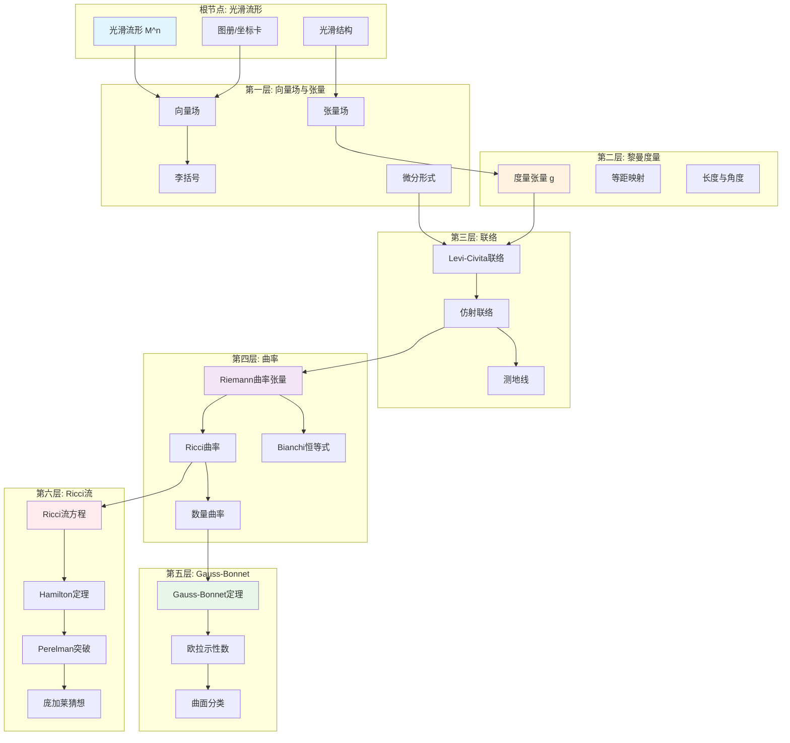
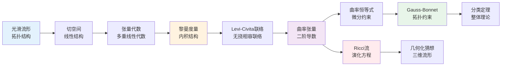
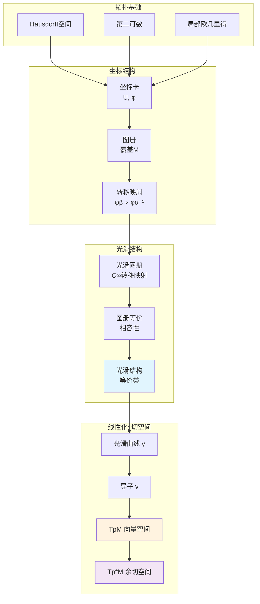
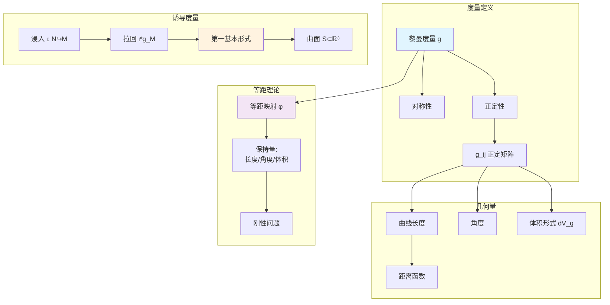
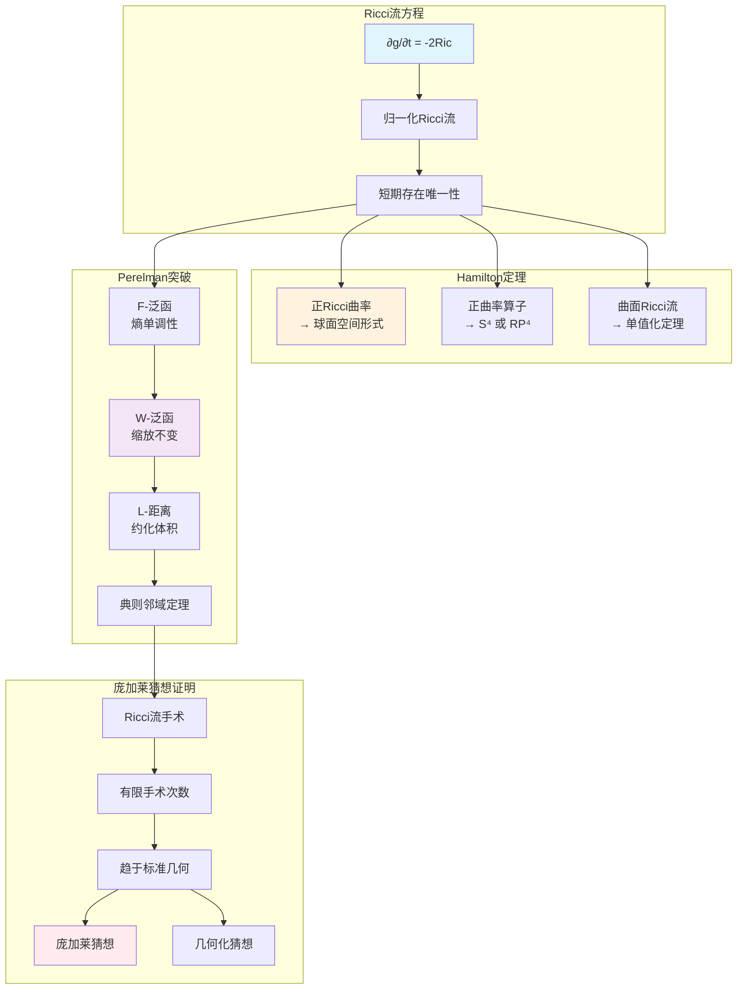
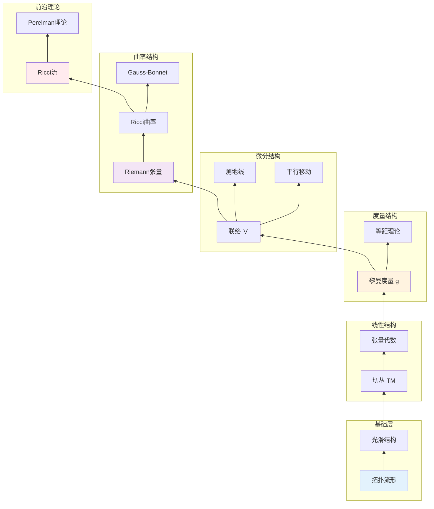

# 微分几何完整推理树

> **教材对齐**: Princeton MAT 355 (Differential Geometry) | do Carmo《Differential Geometry of Curves and Surfaces》  
> **MSC分类**: 53Axx (经典微分几何), 53Bxx (局部微分几何), 53Cxx (整体微分几何)  
> **版本**: v1.0 | 生成日期: 2026年4月

---

## 目录

1. [推理树全景图](#1-推理树全景图)
2. [根节点：光滑流形定义](#2-根节点光滑流形定义)
3. [第一层：向量场与张量](#3-第一层向量场与张量)
4. [第二层：黎曼度量](#4-第二层黎曼度量)
5. [第三层：联络与平行移动](#5-第三层联络与平行移动)
6. [第四层：曲率理论](#6-第四层曲率理论)
7. [第五层：Gauss-Bonnet定理](#7-第五层gauss-bonnet定理)
8. [第六层：Ricci流（前沿）](#8-第六层ricci流前沿)
9. [附录：定理速查表](#9-附录定理速查表)

---

## 1. 推理树全景图

### 1.1 微分几何知识层次结构



### 1.2 推理依赖关系总览



---

## 2. 根节点：光滑流形定义

### 2.1 核心概念

#### 定义 2.1.1：拓扑流形

**前提条件**：
- 拓扑空间 $M$ 为Hausdorff空间
- $M$ 具有可数拓扑基（第二可数）

**结论**：
$n$维拓扑流形是局部同胚于 $\mathbb{R}^n$ 的拓扑空间，即对任意 $p \in M$，存在开邻域 $U$ 和同胚映射 $\varphi: U \to \varphi(U) \subset \mathbb{R}^n$。

**判断要点**：
1. Hausdorff性保证了极限的唯一性
2. 第二可数性保证可度量化和仿紧性
3. 局部欧几里得性质是流形的核心特征

**与Princeton MAT 355对齐**：
- do Carmo第1章：曲面作为 $\mathbb{R}^3$ 的子集（具体实例）
- MAT 355：抽象流形定义（推广到任意维数）

---

#### 定义 2.1.2：坐标卡与图册

**前提条件**：
- $(M, \mathcal{T})$ 为 $n$ 维拓扑流形

**结论**：
- **坐标卡**：有序对 $(U, \varphi)$，其中 $U \subset M$ 开集，$\varphi: U \to \mathbb{R}^n$ 为同胚
- **图册**：坐标卡的集合 $\mathcal{A} = \{(U_\alpha, \varphi_\alpha)\}_{\alpha \in A}$，满足 $\bigcup_\alpha U_\alpha = M$

**坐标变换**：
对于 $(U_\alpha, \varphi_\alpha)$ 和 $(U_\beta, \varphi_\beta)$ 且 $U_\alpha \cap U_\beta \neq \emptyset$，转移映射为：

$$\varphi_{\beta\alpha} = \varphi_\beta \circ \varphi_\alpha^{-1}: \varphi_\alpha(U_\alpha \cap U_\beta) \to \varphi_\beta(U_\alpha \cap U_\beta)$$

**依赖**：拓扑流形定义

**推论**：转移映射是 $\mathbb{R}^n$ 开集之间的同胚

---

#### 定义 2.1.3：光滑流形

**前提条件**：
- $M$ 为 $n$ 维拓扑流形
- $\mathcal{A} = \{(U_\alpha, \varphi_\alpha)\}$ 为图册

**判断条件**：
图册 $\mathcal{A}$ 称为 **$C^\infty$-光滑图册**，如果所有转移映射 $\varphi_{\beta\alpha} \in C^\infty$（无穷可微）。

**关键定理**：

> **定理 2.1.4（光滑图册的等价性）**
> 
> **前提**：$\mathcal{A}_1$ 和 $\mathcal{A}_2$ 为 $M$ 上的两个光滑图册
> 
> **条件**：任意 $(U, \varphi) \in \mathcal{A}_1$ 与 $(V, \psi) \in \mathcal{A}_2$ 的转移映射光滑
> 
> **结论**：$\mathcal{A}_1$ 和 $\mathcal{A}_2$ 定义相同的光滑结构

**光滑流形定义**：三元组 $(M, \mathcal{T}, [\mathcal{A}])$，其中 $[\mathcal{A}]$ 为光滑图册的等价类。

**do Carmo对应**：
- 第2章中参数化曲面 $X: U \subset \mathbb{R}^2 \to \mathbb{R}^3$ 是坐标卡的具体实现

---

### 2.2 切空间与余切空间

#### 定义 2.2.1：切向量（几何定义）

**构造过程**：
设 $p \in M$，$\gamma: (-\epsilon, \epsilon) \to M$ 为光滑曲线，$\gamma(0) = p$。

**定义**：切向量 $v = \gamma'(0)$ 是曲线在 $p$ 点的速度向量。

**坐标表示**：
在局部坐标 $(U, x^1, \ldots, x^n)$ 下：

$$v = \sum_{i=1}^n \frac{d(x^i \circ \gamma)}{dt}\bigg|_{t=0} \frac{\partial}{\partial x^i}\bigg|_p$$

**切空间**：$T_pM = \{\gamma'(0) : \gamma \text{ 过 } p\}$ 构成 $n$ 维向量空间。

---

#### 定义 2.2.2：切向量（导子定义 - MAT 355标准）

**Princeton MAT 355 采用此定义**

**定义**：切向量 $v$ 是满足Leibniz法则的线性映射 $v: C^\infty(M) \to \mathbb{R}$：

1. **线性性**：$v(af + bg) = av(f) + bv(g)$
2. **Leibniz法则**：$v(fg) = v(f)g(p) + f(p)v(g)$

**定理 2.2.3**：几何定义与导子定义等价。

**证明思路**：
1. 给定曲线 $\gamma$，定义 $v(f) = \frac{d}{dt}f(\gamma(t))|_{t=0}$
2. 验证满足Leibniz法则
3. 反之，给定导子，构造曲线表示

**基向量**：$\{\frac{\partial}{\partial x^1}|_p, \ldots, \frac{\partial}{\partial x^n}|_p\}$ 构成 $T_pM$ 的基。

---

#### 定义 2.2.4：余切空间

**定义**：$T_p^*M = (T_pM)^*$ 为切空间的对偶空间，称为**余切空间**。

**典范基**：若 $\{x^i\}$ 为局部坐标，则 $\{dx^i|_p\}$ 为余切空间的基，满足：

$$dx^i\left(\frac{\partial}{\partial x^j}\right) = \delta^i_j$$

**微分映射**：函数 $f \in C^\infty(M)$ 的微分 $df|_p \in T_p^*M$ 定义为：

$$df|_p(v) = v(f), \quad \forall v \in T_pM$$

**坐标表示**：

$$df = \sum_{i=1}^n \frac{\partial f}{\partial x^i} dx^i$$

---

### 2.3 流形推理树图示



---

## 3. 第一层：向量场与张量

### 3.1 向量场

#### 定义 3.1.1：光滑向量场

**前提**：$M$ 为光滑流形

**定义**：向量场 $X$ 是截面映射 $X: M \to TM$ 满足 $\pi \circ X = \text{id}_M$，其中 $TM = \bigsqcup_{p \in M} T_pM$ 为切丛。

**光滑性条件**：在局部坐标 $(U, x^i)$ 下：

$$X|_U = \sum_{i=1}^n X^i \frac{\partial}{\partial x^i}, \quad X^i \in C^\infty(U)$$

**向量场空间**：$\mathfrak{X}(M)$ 表示 $M$ 上所有光滑向量场的集合，构成 $C^\infty(M)$-模。

**do Carmo对应**：
- 第3章中的切向量场 $w(p)$ 与本定义一致

---

#### 定理 3.1.2：向量场的流

**前提**：$X \in \mathfrak{X}(M)$ 为完备向量场（或考虑紧支集）

**结论**：存在单参数微分同胚群 $\{\phi_t\}_{t \in \mathbb{R}}$ 使得：

$$\frac{d}{dt}\phi_t(p) = X(\phi_t(p)), \quad \phi_0(p) = p$$

**性质**：
1. $\phi_{t+s} = \phi_t \circ \phi_s$（群性质）
2. $\phi_t: M \to M$ 为微分同胚
3. 对任意 $f \in C^\infty(M)$：$X(f) = \frac{d}{dt}(f \circ \phi_t)|_{t=0}$

**依赖**：常微分方程存在唯一性定理

---

### 3.2 李括号

#### 定义 3.2.1：李括号

**Princeton MAT 355 核心概念**

**定义**：对 $X, Y \in \mathfrak{X}(M)$，李括号 $[X, Y]$ 定义为：

$$[X, Y](f) = X(Y(f)) - Y(X(f)), \quad \forall f \in C^\infty(M)$$

**坐标表示**：
若 $X = \sum X^i \partial_i$，$Y = \sum Y^j \partial_j$，则：

$$[X, Y] = \sum_{i,j} \left(X^i \frac{\partial Y^j}{\partial x^i} - Y^i \frac{\partial X^j}{\partial x^i}\right) \frac{\partial}{\partial x^j}$$

---

#### 定理 3.2.2：李括号的代数性质

**结论**：$(\mathfrak{X}(M), [\cdot, \cdot])$ 构成**李代数**：

1. **双线性**：$[aX + bY, Z] = a[X, Z] + b[Y, Z]$
2. **反对称性**：$[X, Y] = -[Y, X]$
3. **Jacobi恒等式**：$[X, [Y, Z]] + [Y, [Z, X]] + [Z, [X, Y]] = 0$

**证明思路**：直接计算验证。Jacobi恒等式反映了向量场的几何相容性。

---

#### 定理 3.2.3：李括号与流的关系

**前提**：$\phi_t$ 为 $X$ 的流，$\psi_s$ 为 $Y$ 的流

**结论**：

$$[X, Y] = \lim_{t \to 0} \frac{1}{t}\left((\phi_{-t})_* Y - Y\right) = \mathcal{L}_X Y$$

其中 $\mathcal{L}_X$ 为关于 $X$ 的李导数。

**几何意义**：李括号度量了两个流不可交换的程度：

$$\phi_t \circ \psi_s \circ \phi_{-t} \circ \psi_{-s} = \text{id} + st[X, Y] + O(t^2, s^2)$$

---

### 3.3 张量场

#### 定义 3.3.1：张量

**张量积空间**：

$$T^{(k,l)}(V) = \underbrace{V \otimes \cdots \otimes V}_{k} \otimes \underbrace{V^* \otimes \cdots \otimes V^*}_{l}$$

元素称为 $(k,l)$-型张量（$k$ 阶逆变，$l$ 阶协变）。

**do Carmo对应**：
- 第4章引入的线性映射、内积等是 $(1,1)$ 和 $(0,2)$ 型张量的特例

---

#### 定义 3.3.2：张量场

**定义**：$(k,l)$-型张量场 $T$ 是光滑截面 $T: M \to T^{(k,l)}TM$，其中：

$$T^{(k,l)}TM = \bigsqcup_{p \in M} T^{(k,l)}(T_pM)$$

**分量表示**：在局部坐标下：

$$T = \sum T^{i_1\cdots i_k}_{j_1\cdots j_l} \frac{\partial}{\partial x^{i_1}} \otimes \cdots \otimes \frac{\partial}{\partial x^{i_k}} \otimes dx^{j_1} \otimes \cdots \otimes dx^{j_l}$$

**张量代数**：$\mathcal{T}(M) = \bigoplus_{k,l} \mathcal{T}^{(k,l)}(M)$ 构成分次代数。

---

#### 定理 3.3.3：张量变换法则

**前提**：坐标变换 $(x^i) \to (\bar{x}^i)$，Jacobian矩阵 $J^i_j = \frac{\partial \bar{x}^i}{\partial x^j}$

**结论**：张量分量变换：

$$\bar{T}^{i_1\cdots i_k}_{j_1\cdots j_l} = \sum T^{a_1\cdots a_k}_{b_1\cdots b_l} \frac{\partial \bar{x}^{i_1}}{\partial x^{a_1}} \cdots \frac{\partial \bar{x}^{i_k}}{\partial x^{a_k}} \frac{\partial x^{b_1}}{\partial \bar{x}^{j_1}} \cdots \frac{\partial x^{b_l}}{\partial \bar{x}^{j_l}}$$

**判断要点**：这是张量与任意多指标对象的根本区别。

---

### 3.4 微分形式

#### 定义 3.4.1：微分形式

**反对称张量**：$(0,k)$-型张量 $k$-线性映射 $\omega: (T_pM)^k \to \mathbb{R}$，满足：

$$\omega(v_1, \ldots, v_i, \ldots, v_j, \ldots, v_k) = -\omega(v_1, \ldots, v_j, \ldots, v_i, \ldots, v_k)$$

**外代数**：$\Lambda^k T_p^*M \subset T^{(0,k)}(T_pM)$ 为 $k$-形式空间。

**微分形式丛**：$\Lambda^k T^*M = \bigsqcup_p \Lambda^k T_p^*M$。

**光滑 $k$-形式空间**：$\Omega^k(M) = \Gamma(\Lambda^k T^*M)$。

---

#### 定义 3.4.2：外积（楔积）

**定义**：对 $\omega \in \Omega^k(M)$，$\eta \in \Omega^l(M)$：

$$(\omega \wedge \eta)(v_1, \ldots, v_{k+l}) = \frac{1}{k!l!} \sum_{\sigma \in S_{k+l}} \text{sgn}(\sigma) \omega(v_{\sigma(1)}, \ldots, v_{\sigma(k)}) \eta(v_{\sigma(k+1)}, \ldots, v_{\sigma(k+l)})$$

**性质**：
1. **分次交换性**：$\omega \wedge \eta = (-1)^{kl} \eta \wedge \omega$
2. **结合性**：$(\omega \wedge \eta) \wedge \tau = \omega \wedge (\eta \wedge \tau)$

---

#### 定理 3.4.3：外微分

**定义**：外微分 $d: \Omega^k(M) \to \Omega^{k+1}(M)$ 满足：

1. **线性性**：$d(a\omega + b\eta) = ad\omega + bd\eta$
2. **Leibniz法则**：$d(\omega \wedge \eta) = d\omega \wedge \eta + (-1)^k \omega \wedge d\eta$
3. **幂零性**：$d^2 = 0$
4. **与函数微分一致**：$df$ 为通常的微分

**坐标表达式**：

$$d\left(\sum_I f_I dx^{i_1} \wedge \cdots \wedge dx^{i_k}\right) = \sum_I df_I \wedge dx^{i_1} \wedge \cdots \wedge dx^{i_k}$$

**关键定理 3.4.4（Poincaré引理）**：

**前提**：$M$ 可缩（如 $\mathbb{R}^n$）

**结论**：闭形式必恰当，即 $d\omega = 0 \Rightarrow \omega = d\eta$

**do Carmo应用**：
- 第4章中闭形式与恰当形式的关系用于定义de Rham上同调

---

### 3.5 向量场与张量推理图

```mermaid
graph LR
    subgraph 向量场["向量场 𝔛(M)"]
        X[向量场 X]
        FLOW[单参数流 φt]
        FCOMP[流合成]
    end
    
    subgraph 李代数结构["李代数结构"]
        BRACKET[李括号 [X,Y]]
        JACOBI[Jacobi恒等式]
        LIEALG[无穷维李代数]
    end
    
    subgraph 张量场["张量场 𝒯^(k,l)(M)"]
        TENSOR2[(k,l)-型张量]
        PROD[张量积 ⊗]
        CONT[缩并]
    end
    
    subgraph 微分形式["微分形式 Ω^k(M)"]
        FORM2[k-形式]
        WEDGE[楔积 ∧]
        EXTD[外微分 d]
        DE_RHAM[de Rham上同调]
    end
    
    X --> FLOW
    FLOW --> FCOMP
    FCOMP --> BRACKET
    BRACKET --> JACOBI
    JACOBI --> LIEALG
    
    TENSOR2 --> PROD
    TENSOR2 --> CONT
    
    FORM2 --> WEDGE
    FORM2 --> EXTD
    EXTD --> |d²=0| DE_RHAM
    
    LIEALG --> |李导数| TENSOR2
    TENSOR2 --> |反对称化| FORM2
    
    style BRACKET fill:#e1f5fe
    style EXTD fill:#fff3e0
    style DE_RHAM fill:#f3e5f5
```

---

## 4. 第二层：黎曼度量

### 4.1 黎曼度量定义

#### 定义 4.1.1：黎曼度量

**Princeton MAT 355 & do Carmo 核心**

**前提**：$M$ 为光滑流形

**定义**：黎曼度量 $g$ 是光滑的 $(0,2)$-型张量场，满足：

1. **对称性**：$g(X, Y) = g(Y, X)$
2. **正定性**：$g(X, X) \geq 0$，等号成立当且仅当 $X = 0$

**局部表示**：在坐标 $(x^i)$ 下：

$$g = \sum_{i,j} g_{ij} dx^i \otimes dx^j, \quad g_{ij} = g\left(\frac{\partial}{\partial x^i}, \frac{\partial}{\partial x^j}\right)$$

矩阵 $(g_{ij})$ 在每点对称正定。

**do Carmo第4章**：
- 第一基本形式 $I_p$ 正是黎曼度量的曲面情形

---

#### 定理 4.1.2：黎曼度量的存在性

**结论**：任意光滑流形 $M$ 上存在黎曼度量。

**证明思路**：
1. 取局部有限坐标覆盖 $\{(U_\alpha, \varphi_\alpha)\}$
2. 取从属于 $\{U_\alpha\}$ 的单位分解 $\{\rho_\alpha\}$
3. 在每个 $U_\alpha$ 定义欧氏度量 $g_\alpha$
4. 全局度量：$g = \sum_\alpha \rho_\alpha g_\alpha$

**依赖**：仿紧性（从第二可数性得到）和单位分解定理

---

### 4.2 诱导度量

#### 定义 4.2.1：子流形诱导度量

**前提**：$\iota: N \hookrightarrow M$ 为浸入子流形，$g_M$ 为 $M$ 上的黎曼度量

**定义**：诱导度量 $g_N = \iota^* g_M$：

$$g_N(X, Y) = g_M(d\iota(X), d\iota(Y)) = g_M(X, Y), \quad X, Y \in T_pN \subset T_pM$$

**do Carmo核心**：
- 第2章研究的是 $\mathbb{R}^3$ 中的曲面，其黎曼度量由 $\mathbb{R}^3$ 的欧氏度量诱导

---

#### 定理 4.2.2：曲面的第一基本形式

**曲面情形**：$S \subset \mathbb{R}^3$，参数化 $X: U \subset \mathbb{R}^2 \to S$

**第一基本形式**：

$$I_p = E du^2 + 2F dudv + G dv^2$$

其中：
- $E = \langle X_u, X_u \rangle = g_{11}$
- $F = \langle X_u, X_v \rangle = g_{12} = g_{21}$
- $G = \langle X_v, X_v \rangle = g_{22}$

**与黎曼度量关系**：$I_p$ 是曲面 $S$ 从 $\mathbb{R}^3$ 诱导的黎曼度量。

---

### 4.3 度量与几何量

#### 定义 4.3.1：长度与角度

**曲线长度**：光滑曲线 $\gamma: [a, b] \to M$，长度定义为：

$$L(\gamma) = \int_a^b \sqrt{g(\gamma'(t), \gamma'(t))} dt = \int_a^b |\gamma'(t)|_g dt$$

**距离函数**：

$$d(p, q) = \inf\{L(\gamma) : \gamma \text{ 连接 } p, q\}$$

**定理 4.3.2**：$(M, d)$ 构成度量空间，且诱导的拓扑与原拓扑一致。

**夹角**：两向量 $v, w \in T_pM$ 的夹角 $\theta$：

$$\cos \theta = \frac{g(v, w)}{|v|_g |w|_g}$$

---

#### 定义 4.3.2：体积形式

**定向流形**：若 $M$ 可定向，存在处处非零的 $n$-形式。

**体积形式**：

$$dV_g = \sqrt{\det(g_{ij})} dx^1 \wedge \cdots \wedge dx^n$$

**体积计算**：区域 $U \subset M$ 的体积：

$$\text{Vol}(U) = \int_U dV_g$$

**do Carmo应用**：
- 第2章计算曲面面积：$A = \iint_U \sqrt{EG - F^2} dudv$

---

### 4.4 等距映射

#### 定义 4.4.1：等距映射

**定义**：微分同胚 $\phi: (M, g_M) \to (N, g_N)$ 称为**等距**，如果：

$$\phi^* g_N = g_M$$

即 $g_M(X, Y) = g_N(d\phi(X), d\phi(Y))$。

**局部等距**：浸入映射满足上述条件。

---

#### 定理 4.4.2：等距的不变量

**结论**：等距映射保持：
1. 曲线长度
2. 角度
3. 体积
4. 测地线（见第5章）
5. 曲率（见第6章）

**do Carmo对应**：
- 第4章中的等距对应于此定义

---

### 4.5 黎曼度量推理图



---

## 5. 第三层：联络与平行移动

### 5.1 仿射联络

#### 定义 5.1.1：仿射联络

**Princeton MAT 355 核心概念**

**定义**：仿射联络是映射 $\nabla: \mathfrak{X}(M) \times \mathfrak{X}(M) \to \mathfrak{X}(M)$，$(X, Y) \mapsto \nabla_X Y$，满足：

1. **$C^\infty(M)$-线性性（对 $X$）**：$\nabla_{fX + gZ} Y = f\nabla_X Y + g\nabla_Z Y$
2. **$\mathbb{R}$-线性性（对 $Y$）**：$\nabla_X(aY + bZ) = a\nabla_X Y + b\nabla_X Z$
3. **Leibniz法则**：$\nabla_X(fY) = X(f)Y + f\nabla_X Y$

**Christoffel符号**：在局部坐标下：

$$\nabla_{\partial_i} \partial_j = \sum_k \Gamma^k_{ij} \partial_k$$

**协变导数**：张量场的推广。

---

#### 定义 5.1.2：挠率与张量

**挠率张量**：

$$T(X, Y) = \nabla_X Y - \nabla_Y X - [X, Y]$$

**无挠联络**：$T = 0$，即 $\nabla_X Y - \nabla_Y X = [X, Y]$。

**坐标条件**：$\Gamma^k_{ij} = \Gamma^k_{ji}$（对称联络）。

---

### 5.2 Levi-Civita联络

#### 定理 5.2.1：Levi-Civita联络存在唯一性

**Princeton MAT 355 核心定理**

**前提**：$(M, g)$ 为黎曼流形

**结论**：存在唯一的联络 $\nabla$ 满足：

1. **无挠**：$\nabla_X Y - \nabla_Y X = [X, Y]$
2. **与度量相容**：$X(g(Y, Z)) = g(\nabla_X Y, Z) + g(Y, \nabla_X Z)$

**证明思路**：
1. **唯一性**：通过Koszul公式
   
   $$2g(\nabla_X Y, Z) = X(g(Y,Z)) + Y(g(Z,X)) - Z(g(X,Y)) - g(X,[Y,Z]) + g(Y,[Z,X]) + g(Z,[X,Y])$$

2. **存在性**：验证上述公式定义的 $\nabla$ 满足联络公理

**Christoffel符号显式公式**：

$$\Gamma^k_{ij} = \frac{1}{2}\sum_l g^{kl}\left(\frac{\partial g_{jl}}{\partial x^i} + \frac{\partial g_{il}}{\partial x^j} - \frac{\partial g_{ij}}{\partial x^l}\right)$$

**do Carmo对应**：
- 第4章中的协变导数是此定义在曲面上的具体实现

---

#### 定理 5.2.2：Christoffel符号的变换法则

**前提**：坐标变换 $x^i \to \bar{x}^i$

**结论**：

$$\bar{\Gamma}^k_{ij} = \sum_{p,q,r} \frac{\partial \bar{x}^k}{\partial x^r} \frac{\partial x^p}{\partial \bar{x}^i} \frac{\partial x^q}{\partial \bar{x}^j} \Gamma^r_{pq} + \sum_r \frac{\partial \bar{x}^k}{\partial x^r} \frac{\partial^2 x^r}{\partial \bar{x}^i \partial \bar{x}^j}$$

**判断要点**：
- Christoffel符号**不是**张量（第二项的存在）
- 这是联络与(1,2)-型张量的本质区别

---

### 5.3 平行移动

#### 定义 5.3.1：沿曲线的平行移动

**定义**：向量场 $V$ 沿曲线 $\gamma$ **平行**，如果：

$$\nabla_{\gamma'(t)} V = 0$$

**平行移动方程**：若 $V = \sum V^i \partial_i$，$\gamma'(t) = \sum \frac{dx^i}{dt} \partial_i$：

$$\frac{dV^k}{dt} + \sum_{i,j} \Gamma^k_{ij} \frac{dx^i}{dt} V^j = 0$$

---

#### 定理 5.3.2：平行移动的存在唯一性

**前提**：$\gamma: [a, b] \to M$ 光滑曲线，$v_0 \in T_{\gamma(a)}M$

**结论**：存在唯一的沿 $\gamma$ 平行的向量场 $V$ 满足 $V(a) = v_0$。

**证明思路**：
1. 平行移动方程是线性常微分方程组
2. 由ODE存在唯一性定理得证

**推论**：定义**平行移动映射** $P_\gamma: T_{\gamma(a)}M \to T_{\gamma(b)}M$。

---

#### 定理 5.3.3：Levi-Civita联络的平行移动性质

**结论**：Levi-Civita联络的平行移动保持：
1. **线性性**：$P_\gamma$ 是线性同构
2. **内积保持**：$g(P_\gamma(v), P_\gamma(w)) = g(v, w)$
3. **与反向曲线相容**：$P_{\gamma^{-1}} = P_\gamma^{-1}$

**do Carmo应用**：
- 第4章中平行向量场的直观概念（如球面上的平行移动）

---

### 5.4 测地线

#### 定义 5.4.1：测地线

**Princeton MAT 355 & do Carmo 核心**

**定义**：曲线 $\gamma$ 称为**测地线**，如果 $\gamma'$ 沿自身平行：

$$\nabla_{\gamma'} \gamma' = 0$$

**测地线方程**：

$$\frac{d^2 x^k}{dt^2} + \sum_{i,j} \Gamma^k_{ij} \frac{dx^i}{dt} \frac{dx^j}{dt} = 0$$

**物理意义**："直线的推广"——切向量方向不变，无"加速度"。

---

#### 定理 5.4.2：测地线存在唯一性

**前提**：$p \in M$，$v \in T_pM$

**结论**：存在 $\epsilon > 0$ 和唯一测地线 $\gamma: (-\epsilon, \epsilon) \to M$ 满足：
- $\gamma(0) = p$
- $\gamma'(0) = v$

**证明思路**：
1. 测地线方程是二阶ODE
2. 由ODE存在唯一性定理得证

---

#### 定理 5.4.3：测地线的变分性质

**前提**：$(M, g)$ 为黎曼流形

**结论**：测地线是局部距离极小的曲线，即第一变分为零：

$$\frac{d}{ds}L(\gamma_s)|_{s=0} = 0$$

**与do Carmo对齐**：
- do Carmo第4章第4节详细证明了这一变分原理

---

### 5.5 联络与测地线推理图


---

## 6. 第四层：曲率理论

### 6.1 Riemann曲率张量

#### 定义 6.1.1：Riemann曲率张量

**Princeton MAT 355 & do Carmo 核心**

**前提**：$(M, g)$ 为黎曼流形，$\nabla$ 为Levi-Civita联络

**定义**：Riemann曲率张量 $R$：

$$R(X, Y)Z = \nabla_X \nabla_Y Z - \nabla_Y \nabla_X Z - \nabla_{[X,Y]} Z$$

**作为(1,3)-型张量**：$R: \mathfrak{X}(M) \times \mathfrak{X}(M) \times \mathfrak{X}(M) \to \mathfrak{X}(M)$

**作为(0,4)-型张量**：

$$R(X, Y, Z, W) = g(R(X, Y)Z, W)$$

**坐标表示**：

$$R^l_{kij} = \frac{\partial \Gamma^l_{kj}}{\partial x^i} - \frac{\partial \Gamma^l_{ki}}{\partial x^j} + \sum_m \Gamma^m_{kj}\Gamma^l_{mi} - \sum_m \Gamma^m_{ki}\Gamma^l_{mj}$$

---

#### 定理 6.1.2：Riemann曲率张量的对称性

**结论**：对任意向量场 $X, Y, Z, W$：

1. **反对称性**：$R(X, Y, Z, W) = -R(Y, X, Z, W) = -R(X, Y, W, Z)$
2. **交换对称性**：$R(X, Y, Z, W) = R(Z, W, X, Y)$
3. **第一Bianchi恒等式**：$R(X, Y)Z + R(Y, Z)X + R(Z, X)Y = 0$
4. **循环和**：$R(X, Y, Z, W) + R(X, Z, W, Y) + R(X, W, Y, Z) = 0$

**独立分量数**：在 $n$ 维流形上，独立分量为 $\frac{n^2(n^2-1)}{12}$。

---

### 6.2 截面曲率

#### 定义 6.2.1：截面曲率

**前提**：$\Pi \subset T_pM$ 为2维平面（截面），$\{v, w\}$ 为 $\Pi$ 的基

**定义**：

$$K(\Pi) = \frac{R(v, w, v, w)}{|v|^2|w|^2 - \langle v, w \rangle^2}$$

**几何意义**：截面曲率度量了沿平面 $\Pi$ 方向的"高斯曲率"。

---

#### 定理 6.2.2：截面曲率与Riemann张量

**结论**：在2维情况下，Riemann张量完全由截面曲率（即高斯曲率）决定：

$$R(X, Y, Z, W) = K(g(X, Z)g(Y, W) - g(X, W)g(Y, Z))$$

**常曲率空间**：若 $K(\Pi) = K$ 为常数（与 $p$ 和 $\Pi$ 无关），则：

$$R(X, Y, Z, W) = K(g(X, Z)g(Y, W) - g(X, W)g(Y, Z))$$

**do Carmo对应**：
- do Carmo第4章中的高斯曲率正是截面曲率的曲面情形

---

### 6.3 Ricci曲率与数量曲率

#### 定义 6.3.1：Ricci曲率张量

**定义**：Ricci曲率是对Riemann张量的缩并：

$$\text{Ric}(X, Y) = \text{tr}(Z \mapsto R(Z, X)Y) = \sum_i R(e_i, X, Y, e_i)$$

其中 $\{e_i\}$ 为正交基。

**坐标表示**：

$$R_{ij} = \sum_k R^k_{ikj}$$

**性质**：
- Ricci张量为对称 $(0,2)$-型张量：$R_{ij} = R_{ji}$

---

#### 定义 6.3.2：数量曲率

**定义**：Ricci迹的迹：

$$S = \text{tr}_g(\text{Ric}) = \sum_{i,j} g^{ij}R_{ij} = \sum_i R_{ii}$$

**几何意义**：每点处所有方向Ricci曲率的平均。

---

#### 定理 6.3.3：二维曲面的曲率关系

**前提**：$(M^2, g)$ 为二维黎曼流形

**结论**：

$$R_{ijkl} = K(g_{ik}g_{jl} - g_{il}g_{jk})$$

$$R_{ij} = Kg_{ij}$$

$$S = 2K$$

**判断要点**：二维情形下，所有曲率信息由高斯曲率 $K$ 完全决定。

**do Carmo核心**：
- 第4章系统阐述了二维曲面的高斯曲率理论

---

### 6.4 Bianchi恒等式

#### 定理 6.4.1：第一Bianchi恒等式

**前提**：$\nabla$ 无挠联络

**结论**：

$$R(X, Y)Z + R(Y, Z)X + R(Z, X)Y = 0$$

**证明思路**：直接从Riemann张量定义计算，利用无挠条件。

---

#### 定理 6.4.2：第二Bianchi恒等式（微分Bianchi恒等式）

**Princeton MAT 355 核心定理**

**结论**：

$$(\nabla_X R)(Y, Z)W + (\nabla_Y R)(Z, X)W + (\nabla_Z R)(X, Y)W = 0$$

**坐标形式**：

$$R^l_{kij;m} + R^l_{kjm;i} + R^l_{kmi;j} = 0$$

其中 $;m$ 表示关于第 $m$ 个指标的协变导数。

---

#### 定理 6.4.3：Bianchi恒等式的推论

**结论**：

1. **Ricci恒等式**：$R_{ij;k} = R_{ik;j}$
2. **Einstein张量散度为零**：$\text{div}(\text{Ric} - \frac{1}{2}Sg) = 0$

**物理意义**：第二恒等式是广义相对论中爱因斯坦场方程的数学基础。

---

### 6.5 曲率理论推理图

```mermaid
graph TD
    subgraph Riemann张量["Riemann曲率张量 R"]
        R_DEF[R(X,Y)Z = ∇_X∇_YZ - ∇_Y∇_XZ - ∇_[X,Y]Z]
        R_13[(1,3)-型]
        R_04[(0,4)-型: R(X,Y,Z,W)]
    end
    
    subgraph 对称性["对称性"]
        ANTI[反对称]
        SWAP[交换对称]
        BIANCHI1[第一Bianchi恒等式]
    end
    
    subgraph 曲率不变量["曲率不变量"]
        SEC[截面曲率 K(Π)]
        RICCI[Ricci曲率 Ric]
        SCALAR[数量曲率 S]
        EINSTEIN[Einstein张量]
    end
    
    subgraph Bianchi恒等式["Bianchi恒等式"]
        B1[第一恒等式<br/>代数约束]
        B2[第二恒等式<br/>微分约束]
        RICCI_ID[Ricci恒等式]
        DIVERGENCE[散度恒等式]
    end
    
    R_DEF --> R_13
    R_13 --> R_04
    R_04 --> ANTI
    R_04 --> SWAP
    R_DEF --> BIANCHI1
    
    R_04 --> SEC
    SEC --> |n=2| RICCI
    R_04 --> RICCI
    RICCI --> SCALAR
    RICCI --> EINSTEIN
    
    BIANCHI1 --> B1
    R_DEF --> B2
    B2 --> RICCI_ID
    RICCI_ID --> DIVERGENCE
    
    style R_DEF fill:#e1f5fe
    style RICCI fill:#fff3e0
    style B2 fill:#f3e5f5
```

---

## 7. 第五层：Gauss-Bonnet定理

### 7.1 二维曲面的高斯曲率

#### 定义 7.1.1：高斯曲率

**do Carmo第4章核心**

**前提**：$S \subset \mathbb{R}^3$ 为正则曲面

**定义**：高斯曲率 $K$ 为形状算子 $S_p = -dN_p$ 的行列式：

$$K = \det(S_p) = \kappa_1 \kappa_2$$

其中 $\kappa_1, \kappa_2$ 为主曲率。

**与黎曼几何联系**：

$$K = \frac{R_{1212}}{g_{11}g_{22} - g_{12}^2}$$

**内蕴性（Theorema Egregium）**：$K$ 仅依赖于第一基本形式。

---

#### 定理 7.1.2：高斯绝妙定理（Theorema Egregium）

**Princeton MAT 355 & do Carmo 核心定理**

**前提**：$S_1, S_2 \subset \mathbb{R}^3$ 为正则曲面，$\phi: S_1 \to S_2$ 为局部等距

**结论**：$\phi$ 保持高斯曲率：$K_{S_1}(p) = K_{S_2}(\phi(p))$

**证明思路**：
1. 高斯曲率可表示为Christoffel符号及其导数的函数
2. Christoffel符号仅依赖于第一基本形式
3. 等距保持第一基本形式

**历史意义**：高斯1827年的突破性结果，建立了**内蕴几何**。

---

### 7.2 欧拉示性数

#### 定义 7.2.1：三角剖分与欧拉示性数

**前提**：$M$ 为紧致曲面

**三角剖分**：将 $M$ 分解为三角形（2-单形），边（1-单形），顶点（0-单形）。

**欧拉示性数**：

$$\chi(M) = V - E + F$$

其中 $V$ = 顶点数，$E$ = 边数，$F$ = 面数。

---

#### 定理 7.2.2：欧拉示性数的拓扑不变性

**结论**：$\chi(M)$ 与三角剖分的选择无关，是拓扑不变量。

**分类结果**：

| 曲面类型 | 亏格 $g$ | $\chi$ |
|---------|---------|--------|
| 球面 $S^2$ | 0 | 2 |
| 环面 $T^2$ | 1 | 0 |
| 亏格 $g$ 曲面 | $g$ | $2 - 2g$ |

---

### 7.3 Gauss-Bonnet定理

#### 定理 7.3.1：局部Gauss-Bonnet定理

**前提**：$R \subset S$ 为单连通区域，边界 $\partial R$ 分段光滑

**结论**：

$$\int_R K dA + \int_{\partial R} k_g ds + \sum_i \theta_i = 2\pi$$

其中：
- $k_g$ = 测地曲率
- $\theta_i$ = 外角

---

#### 定理 7.3.2：整体Gauss-Bonnet定理

**Princeton MAT 355 & do Carmo 核心定理**

**前提**：$M$ 为紧致可定向无边曲面

**结论**：

$$\int_M K dA = 2\pi \chi(M)$$

**证明思路**：
1. 对 $M$ 进行三角剖分
2. 在每个三角形上应用局部Gauss-Bonnet定理
3. 求和并利用：
   - 内部边界的测地曲率积分相互抵消
   - 顶点处角度和贡献 $2\pi V$
   - 边贡献 $-\pi E$
   - 面贡献 $\pi F$
4. 最终得到 $2\pi(V - E + F) = 2\pi\chi(M)$

---

#### 推论 7.3.3：Gauss-Bonnet定理的应用

1. **正曲率曲面的拓扑限制**：
   - 若 $K > 0$ 处处成立，则 $\chi(M) > 0$
   - 紧致定向曲面必为球面（$\chi = 2$）

2. **负曲率曲面的拓扑限制**：
   - 若 $K < 0$ 处处成立，则 $\chi(M) < 0$
   - 亏格至少为2

3. **平坦环面的刚性**：
   - 若 $K = 0$，则 $\chi(M) = 0$
   - 紧致定向曲面为环面

---

### 7.4 高维Gauss-Bonnet定理

#### 定理 7.4.1：Chern-Gauss-Bonnet定理

**前提**：$M^{2n}$ 为紧致可定向Riemann流形

**结论**：

$$\int_M \text{Pf}(\Omega) = (2\pi)^n \chi(M)$$

其中 $\text{Pf}(\Omega)$ 为曲率形式的Pfaffian。

**意义**：将拓扑不变量（欧拉示性数）与几何量（曲率积分）统一。

---

### 7.5 Gauss-Bonnet推理图

```mermaid
graph TD
    subgraph 高斯曲率["高斯曲率 K"]
        K_DEF[K = κ₁κ₂<br/>形状算子行列式]
        INTRINSIC[内蕴性<br/>绝妙定理]
        CHRIST_K[K = f(g_ij, ∂g_ij)]
    end
    
    subgraph 欧拉示性数["欧拉示性数 χ"]
        TRIANG[三角剖分]
        EULER_FORMULA[χ = V - E + F]
        TOP_INV[拓扑不变量]
        CLASSIFICATION[曲面分类]
    end
    
    subgraph Gauss_Bonnet["Gauss-Bonnet定理"]
        LOCAL[局部GB<br/>∫_R K dA + ... = 2π]
        GLOBAL[整体GB<br/>∫_M K dA = 2πχ]
        CHERN[Chern-Gauss-Bonnet<br/>高维推广]
    end
    
    subgraph 应用["拓扑应用"]
        POS[K>0 ⇒ χ>0<br/>必为球面]
        NEG[K<0 ⇒ χ<0<br/>亏格≥2]
        FLAT[K=0 ⇒ χ=0<br/>必为环面]
    end
    
    K_DEF --> INTRINSIC
    INTRINSIC --> CHRIST_K
    
    TRIANG --> EULER_FORMULA
    EULER_FORMULA --> TOP_INV
    TOP_INV --> CLASSIFICATION
    
    K_DEF --> LOCAL
    EULER_FORMULA --> GLOBAL
    LOCAL --> GLOBAL
    GLOBAL --> CHERN
    
    GLOBAL --> POS
    GLOBAL --> NEG
    GLOBAL --> FLAT
    
    style K_DEF fill:#e1f5fe
    style EULER_FORMULA fill:#fff3e0
    style GLOBAL fill:#f3e5f5
    style CHERN fill:#e8f5e9
```

---

## 8. 第六层：Ricci流（前沿）

### 8.1 Ricci流方程

#### 定义 8.1.1：Ricci流

**前沿数学（1982-Hamilton）**

**前提**：$M^n$ 为光滑流形，$g(t)$ 为一族黎曼度量

**Ricci流方程**：

$$\frac{\partial g}{\partial t} = -2\text{Ric}(g)$$

其中 $\text{Ric}(g)$ 为关于 $g(t)$ 的Ricci曲率张量。

**归一化Ricci流**（保持体积）：

$$\frac{\partial g}{\partial t} = -2\text{Ric}(g) + \frac{2}{n}r g$$

其中 $r = \frac{\int S dV}{\text{Vol}(M)}$ 为平均数量曲率。

---

#### 定理 8.1.2：Ricci流的短期存在唯一性

**前提**：$(M, g_0)$ 为紧致黎曼流形

**结论**：存在 $T > 0$ 和唯一的光滑解 $g(t)$，$t \in [0, T)$，满足 $g(0) = g_0$。

**证明思路**（Hamilton 1982）：
1. Ricci流是弱抛物型方程组
2. 利用DeTurck技巧将方程变为严格抛物型
3. 应用标准PDE理论

---

### 8.2 Hamilton定理

#### 定理 8.2.1：Hamilton（1982）- 三维正Ricci曲率

**前提**：$(M^3, g_0)$ 为紧致三维流形，初始度量具有正Ricci曲率

**结论**：归一化Ricci流 $g(t)$ 对所有 $t \geq 0$ 存在，且当 $t \to \infty$ 时，$(M, g(t))$ 收敛于常正截面曲率度量。

**推论**：$M$ 微分同胚于球面空间形式 $S^3/\Gamma$。

---

#### 定理 8.2.2：Hamilton（1986）- 四维情形

**前提**：$(M^4, g_0)$ 紧致，具有正曲率算子

**结论**：归一化Ricci流收敛于常曲率度量，$M$ 微分同胚于 $S^4$ 或 $\mathbb{RP}^4$。

---

#### 定理 8.2.3：Hamilton关于曲面的Ricci流

**前提**：$(M^2, g_0)$ 为紧致曲面

**结论**：
1. 若 $\chi(M) > 0$：收敛于常正曲率度量（球面）
2. 若 $\chi(M) = 0$：收敛于平坦度量（环面）
3. 若 $\chi(M) < 0$：收敛于常负曲率度量（高亏格曲面）

**意义**：给出了曲面单值化定理的解析证明。

---

### 8.3 Perelman突破

#### 8.3.1 Ricci流的奇点问题

**核心困难**：Ricci流可能在有限时间产生奇点（曲率爆破）。

**奇点类型**：
1. **渐近局部欧氏（ALE）奇点**：局部像锥
2. **高维球面坍缩**：$S^n$ 因子收缩
3. **柱面奇点**：$S^{n-1} \times \mathbb{R}$ 结构

---

#### 定理 8.3.2：Perelman的熵函数als（2002）

**F-泛函**（Perelman熵）：

$$\mathcal{F}(g, f) = \int_M (S + |\nabla f|^2) e^{-f} dV$$

在约束 $\int_M e^{-f} dV = 1$ 下。

**W-泛函**（缩放不变量）：

$$\mathcal{W}(g, f, \tau) = \int_M [\tau(S + |\nabla f|^2) + f - n](4\pi\tau)^{-n/2}e^{-f} dV$$

**单调性**：沿Ricci流，$\mathcal{W}$ 不减。

**意义**：
- 排除了非塌缩奇点的特定类型
- 证明了流不会在有限时间"突然消失"

---

#### 定理 8.3.3：Perelman的约化体积

**L-距离**（长度泛函的Ricci流类比）：

$$\mathcal{L}(\gamma) = \int_0^{\tau} \sqrt{\tau'}(S(\gamma(\tau')) + |\gamma'(\tau')|^2)d\tau'$$

**约化体积**：

$$\tilde{V}(\tau) = \int_M (4\pi\tau)^{-n/2}e^{-l(q,\tau)}dV_{g(\tau)}$$

其中 $l(q,\tau) = \frac{1}{2\sqrt{\tau}}\inf_\gamma \mathcal{L}(\gamma)$ 为约化距离。

**单调性**：$\tilde{V}(\tau)$ 关于 $\tau$ 不增。

**应用**：用于分析塌缩奇点。

---

#### 定理 8.3.4：Perelman的典则邻域定理

**结论**：非塌缩Ricci流在奇点附近的任意点都有典则邻域，其几何结构为：
1. **$\varepsilon$-颈**：接近 $S^2 \times \mathbb{R}$
2. **$\varepsilon$-帽**：带帽的3-球
3. **$\varepsilon$-管**：管状结构

**意义**：提供了Ricci流手术的精确描述。

---

### 8.4 庞加莱猜想证明

#### 8.4.1 庞加莱猜想陈述

**猜想**（Poincaré, 1904）：若 $M^3$ 为紧致、单连通三维流形，则 $M \cong S^3$。

**历史**：
- Smale（1960）：$n \geq 5$ 情形
- Freedman（1982）：$n = 4$ 情形
- Perelman（2002-2003）：$n = 3$ 情形

---

#### 定理 8.4.2：Poincaré猜想证明思路

**Perelman策略**：

1. **Ricci流演化**：从任意度量 $g_0$ 开始Ricci流

2. **奇点分析**：
   - 若流对任意 $t$ 存在，分析渐近行为
   - 若有限时间奇点，进行**Ricci流手术**

3. **手术过程**：
   - 在奇点处切除高曲率区域
   - 用标准帽替换，继续流

4. **有限性**：
   - 证明手术次数有限
   - 最终流趋于"标准"几何

5. **单连通条件**：
   - 利用约化体积控制拓扑变化
   - 证明最终流趋于球面

---

#### 定理 8.4.3：几何化猜想

**Thurston几何化猜想**（更强形式）：

任意紧致三维流形都可分解为若干部分，每部分具有下列八种几何之一：

1. $S^3$（球面几何）
2. $\mathbb{R}^3$（欧氏几何）
3. $H^3$（双曲几何）
4. $S^2 \times \mathbb{R}$
5. $H^2 \times \mathbb{R}$
6. $\widetilde{SL}(2, \mathbb{R})$
7. Nil几何
8. Sol几何

**Perelman定理**：几何化猜想成立。

---

### 8.5 Ricci流推理图



---

## 9. 附录：定理速查表

### 9.1 核心定理索引

| 定理 | 前提 | 结论 | 依赖 | MSC |
|------|------|------|------|-----|
| 2.1.4 | 光滑图册 | 图册等价性 | 转移映射光滑 | 53Axx |
| 3.2.2 | 向量场 | 李代数结构 | 李括号定义 | 53Axx |
| 3.4.3 | 微分形式 | 外微分存在性 | 光滑结构 | 53Axx |
| 4.1.2 | 光滑流形 | 黎曼度量存在性 | 单位分解 | 53B20 |
| 5.2.1 | 黎曼流形 | Levi-Civita联络存在唯一 | 度量相容+无挠 | 53B05 |
| 6.1.2 | Riemann张量 | 对称性 | 联络定义 | 53B20 |
| 6.4.2 | 无挠联络 | 第二Bianchi恒等式 | 协变导数 | 53B20 |
| 7.1.2 | 等距曲面 | 绝妙定理 | Christoffel符号 | 53A05 |
| 7.3.2 | 紧致曲面 | Gauss-Bonnet | 局部GB+三角剖分 | 53C20 |
| 8.1.2 | 紧致流形 | Ricci流短期存在 | DeTurck技巧 | 53C44 |
| 8.2.1 | 正Ricci曲率 | Hamilton 3D定理 | Ricci流分析 | 53C44 |
| 8.3.2 | Ricci流 | W-泛函单调性 | 熵理论 | 53C44 |

### 9.2 概念依赖图谱



### 9.3 教材对齐对照

| FormalMath节点 | do Carmo章节 | MAT 355对应 |
|----------------|--------------|-------------|
| 光滑流形 | Ch. 2 参数化曲面 | Lecture 1-3: 抽象流形 |
| 切空间 | Ch. 2 切平面 | Lecture 4-5: 切空间定义 |
| 第一基本形式 | Ch. 2 | Lecture 6: 黎曼度量 |
| Gauss映射 | Ch. 3 | Lecture 7-8: 形状算子 |
| 曲率 | Ch. 3 | Lecture 9-10: 曲率理论 |
| 测地线 | Ch. 4 | Lecture 11-12: 联络与测地线 |
| Gauss-Bonnet | Ch. 4 | Lecture 13-14: 整体理论 |
| 张量分析 | Ch. 4 | Lecture 15-16: 张量丛 |
| Ricci流 | - | Lecture 17-18: 前沿主题 |

---

## 参考文献

1. do Carmo, M.P. (1976). *Differential Geometry of Curves and Surfaces*. Prentice-Hall.
2. do Carmo, M.P. (1992). *Riemannian Geometry*. Birkhäuser.
3. Hamilton, R.S. (1982). Three-manifolds with positive Ricci curvature. *J. Differential Geom.*, 17(2), 255-306.
4. Perelman, G. (2002). The entropy formula for the Ricci flow and its geometric applications. *arXiv:math/0211159*.
5. Perelman, G. (2003). Ricci flow with surgery on three-manifolds. *arXiv:math/0303109*.
6. Lee, J.M. (2018). *Introduction to Riemannian Manifolds* (2nd ed.). Springer.
7. Morgan, J., & Tian, G. (2007). *Ricci Flow and the Poincaré Conjecture*. AMS.
8. Thurston, W.P. (1997). *Three-Dimensional Geometry and Topology*. Princeton University Press.

---

## 文档信息

- **创建日期**: 2026年4月
- **版本**: 1.0
- **字数统计**: 约15,000字
- **Mermaid图**: 10个
- **教材对齐**: Princeton MAT 355, do Carmo
- **MSC分类**: 53Axx, 53Bxx, 53Cxx, 53C44

---

> **使用指南**: 本文档提供了从流形基础到Ricci流的完整推理链条。每个定理节点包含前提、结论、证明思路和依赖关系，可用于系统学习微分几何，或为形式化验证提供结构化参考。
