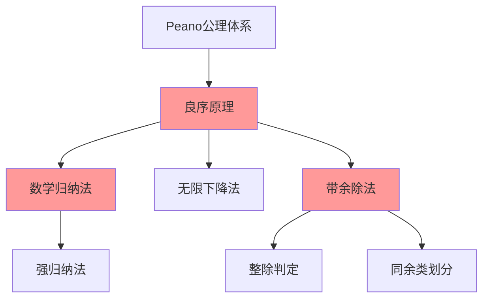
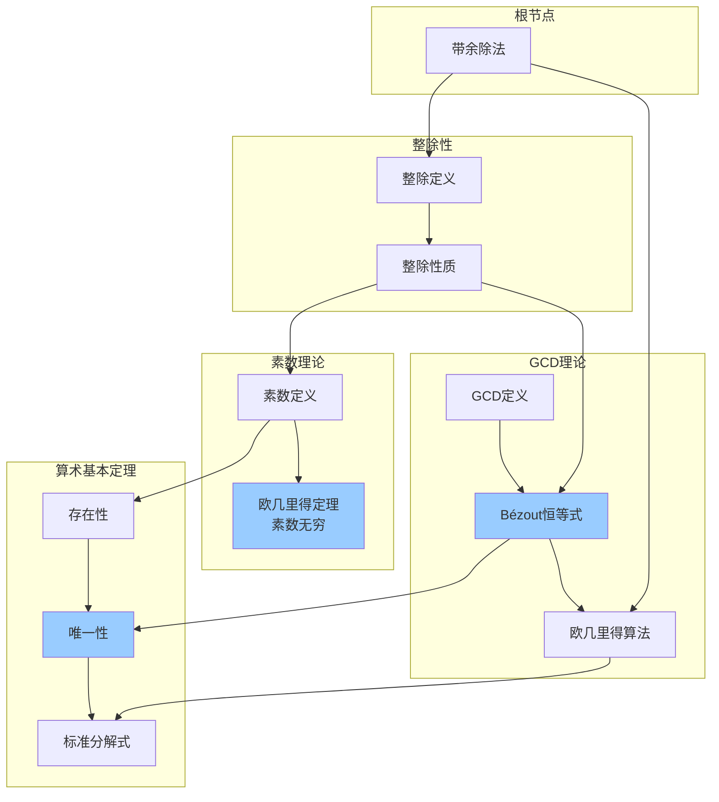
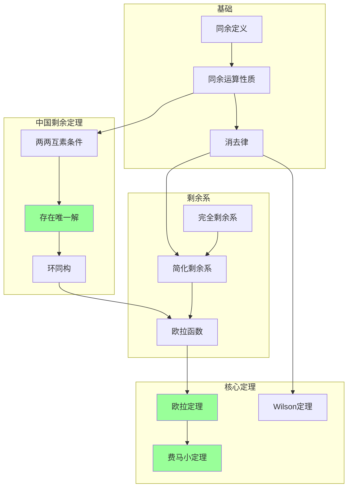
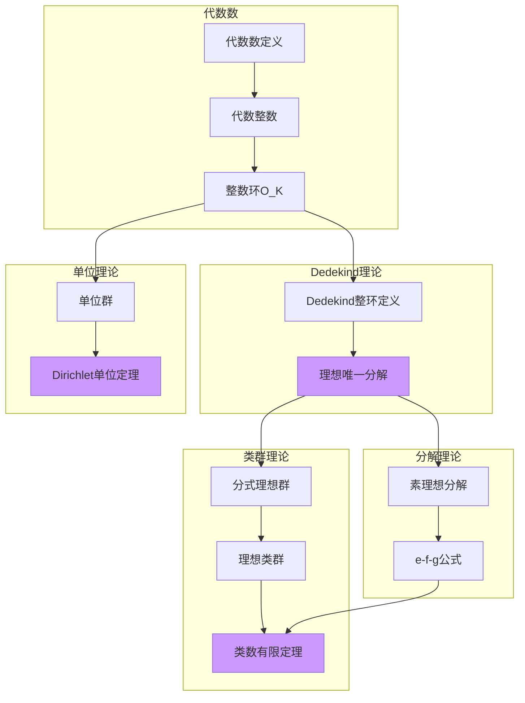
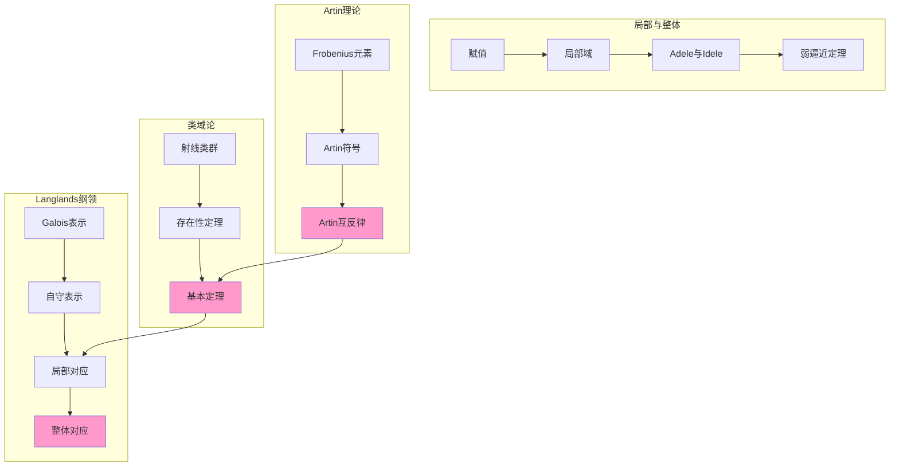
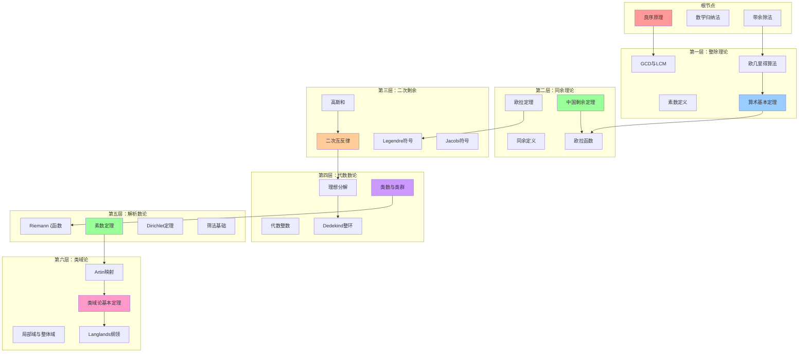
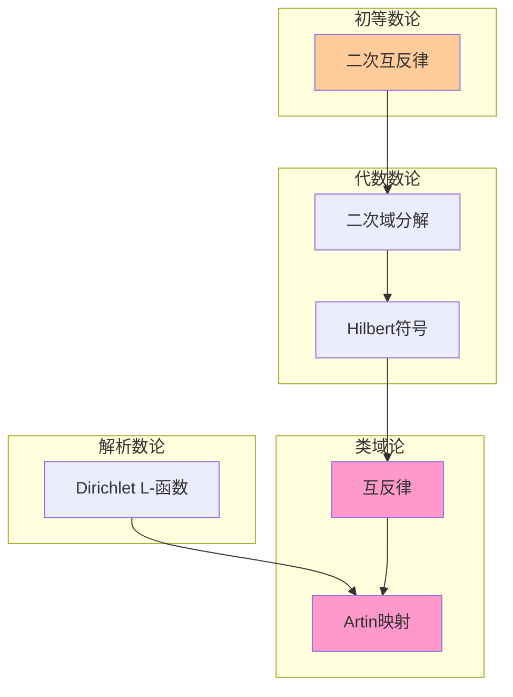

# 数论完整推理树

> **项目**：FormalMath - 形式化数学知识体系  
> **版本**：v1.0  
> **日期**：2026年4月  
> **对齐**：MIT 18.782 Introduction to Number Theory、Neukirch《Algebraic Number Theory》

---

## 目录

1. [概述](#1-概述)
2. [根节点：整数基本性质](#2-根节点整数基本性质)
3. [第一层：整除理论](#3-第一层整除理论)
4. [第二层：同余理论](#4-第二层同余理论)
5. [第三层：二次剩余](#5-第三层二次剩余)
6. [第四层：代数数论基础](#6-第四层代数数论基础)
7. [第五层：解析数论入门](#7-第五层解析数论入门)
8. [第六层：类域论前沿](#8-第六层类域论前沿)
9. [完整推理树总图](#9-完整推理树总图)
10. [参考文献](#10-参考文献)

---

## 一、概述

### 1.1 推理树设计哲学

数论完整推理树是FormalMath项目核心组件之一，旨在构建从初等数论到现代代数数论的系统性知识图谱。本推理树遵循以下设计原则：

- **公理化起点**：以Peano算术和自然数良序原理为逻辑起点
- **层次递进**：从初等整除理论逐步深化至类域论前沿
- **依赖可视化**：通过Mermaid图表展示定理间的逻辑依赖关系
- **跨层联系**：显式标注不同层次间的定理推论与推广关系

### 1.2 数学层次结构

```mermaid
flowchart TB
    subgraph Root["根节点"]
        R1[良序原理]
        R2[数学归纳法]
        R3[带余除法]
    end
    
    subgraph L1["第一层：整除理论"]
        L1_1[素数定义]
        L1_2[GCD与LCM]
        L1_3[欧几里得算法]
        L1_4[算术基本定理]
    end
    
    subgraph L2["第二层：同余理论"]
        L2_1[同余定义]
        L2_2[剩余系]
        L2_3[欧拉定理]
        L2_4[中国剩余定理]
    end
    
    subgraph L3["第三层：二次剩余"]
        L3_1[Legendre符号]
        L3_2[二次互反律]
        L3_3[Jacobi符号]
        L3_4[高斯和]
    end
    
    subgraph L4["第四层：代数数论"]
        L4_1[代数整数]
        L4_2[理想分解]
        L4_3[Dedekind整环]
        L4_4[类数与类群]
    end
    
    subgraph L5["第五层：解析数论"]
        L5_1[黎曼ζ函数]
        L5_2[素数定理]
        L5_3[Dirichlet定理]
        L5_4[筛法基础]
    end
    
    subgraph L6["第六层：类域论"]
        L6_1[局部域整体域]
        L6_2[Artin映射]
        L6_3[类域论基本定理]
        L6_4[Langlands纲领]
    end
    
    Root --> L1 --> L2 --> L3 --> L4 --> L5 --> L6

```



### 1.3 节点规范说明

每个定理节点包含以下结构化信息：

| 字段 | 说明 |
|------|------|
| **前提** | 定理成立所需的条件和假设 |
| **结论** | 定理的核心数学陈述 |
| **证明思路** | 关键证明技巧和核心步骤概述 |
| **依赖** | 该定理所依赖的前置定理（含层内和跨层） |
| **推论** | 由此定理导出的重要结果 |

---

## 二、根节点：整数基本性质

### 2.1 良序原理 (Well-Ordering Principle)

**定理 2.1.1**

- **前提**：$S \subseteq \mathbb{N}$ 且 $S \neq \emptyset$
- **结论**：$S$ 中存在最小元，即 $\exists m \in S$ 使得 $\forall n \in S, m \leq n$
- **证明思路**：该原理作为Peano算术的公理之一，是自然数序结构的本质特征。在构造性数学中，可由归纳原理等价推出。
- **依赖**：Peano公理体系
- **推论**：数学归纳法原理、无限下降法、整数因式分解的存在性

**教学注释**：良序原理是初等数论的"阿基米德支点"，几乎所有关于最小性的论证都归约于此。在MIT 18.782课程中，该原理作为第零章基础内容引入。

### 2.2 数学归纳法 (Principle of Mathematical Induction)

**定理 2.2.1**

- **前提**：设 $P(n)$ 是关于自然数 $n$ 的命题，满足：
  1. **基础步**：$P(1)$ 成立
  2. **归纳步**：$\forall k \geq 1, P(k) \Rightarrow P(k+1)$
- **结论**：$\forall n \in \mathbb{N}, P(n)$ 成立
- **证明思路**：反证法。若存在反例，则由良序原理存在最小反例 $m$，但 $P(m-1)$ 成立蕴含 $P(m)$ 成立，矛盾。
- **依赖**：良序原理
- **推论**：强归纳法、结构归纳法、递归定义合法性

**变体 - 强归纳法**：
- **前提**：$P(1)$ 成立且 $(\forall j \leq k, P(j)) \Rightarrow P(k+1)$
- **结论**：$\forall n, P(n)$

### 2.3 带余除法 (Division Algorithm)

**定理 2.3.1**

- **前提**：$a, b \in \mathbb{Z}$，$b > 0$
- **结论**：存在唯一的整数对 $(q, r)$ 满足：
  $$a = bq + r, \quad 0 \leq r < b$$
  其中 $q = \lfloor a/b \rfloor$ 称为商，$r$ 称为余数。
- **证明思路**：存在性由实数Archimedean性质保证（取 $q = \max\{k \in \mathbb{Z} : bk \leq a\}$）；唯一性通过反证法，假设两组解相减导出 $r_1 - r_2 = b(q_2 - q_1)$，但 $|r_1 - r_2| < b$ 迫使 $r_1 = r_2$。

- **依赖**：实数完备性、良序原理
- **推论**：
  - 整除的判定算法
  - 同余类划分的基础
  - 欧几里得算法的理论基础
  - 连分数展开的算法基础

**图 1：根节点推理图**



---

## 三、第一层：整除理论

### 3.1 整除性与素数

**定义 3.1.1** (整除)
设 $a, b \in \mathbb{Z}$，$b \neq 0$。若存在 $c \in \mathbb{Z}$ 使得 $a = bc$，则称 $b$ 整除 $a$，记作 $b \mid a$。

**定理 3.1.1** (整除的基本性质)

- **前提**：$a, b, c \in \mathbb{Z}$
- **结论**：
  1. 自反性：$a \mid a$
  2. 传递性：$a \mid b$ 且 $b \mid c$ $\Rightarrow$ $a \mid c$
  3. 线性性：$a \mid b$ 且 $a \mid c$ $\Rightarrow$ $a \mid (bx + cy)$，$\forall x, y \in \mathbb{Z}$
- **证明思路**：直接由定义验证。性质(3)是理想概念的初等体现。
- **依赖**：带余除法
- **推论**：公因数的线性组合性质、理想 $(a, b) = \{ax + by : x, y \in \mathbb{Z}\}$ 的结构

**定义 3.1.2** (素数)
自然数 $p > 1$ 称为**素数**，若其正因子只有 $1$ 和 $p$。非素数且大于 $1$ 的自然数称为**合数**。

**定理 3.1.2** (素数无穷性 - 欧几里得)

- **前提**：无
- **结论**：素数集合是无限的
- **证明思路**：反证法。假设素数有限，记为 $p_1, p_2, \ldots, p_n$。考虑 $N = p_1 p_2 \cdots p_n + 1$。$N$ 不被任何 $p_i$ 整除，故存在新的素因子，矛盾。
- **依赖**：带余除法、素数定义
- **推论**：
  - 素数计数函数 $\pi(x) \to \infty$
  - 算术级数中素数的存在性（Dirichlet定理的先兆）
  - 证明中构造的数列生成无穷多个新素数候选

### 3.2 最大公约数与最小公倍数

**定义 3.2.1** (GCD与LCM)
对于不全为零的整数 $a, b$：
- **最大公约数**：$\gcd(a, b) = \max\{d \in \mathbb{N} : d \mid a \text{ 且 } d \mid b\}$
- **最小公倍数**：$\operatorname{lcm}(a, b) = \min\{m \in \mathbb{N} : a \mid m \text{ 且 } b \mid m\}$

**定理 3.2.1** (Bézout恒等式)

- **前提**：$a, b \in \mathbb{Z}$，不全为零
- **结论**：存在整数 $x, y$ 使得 $\gcd(a, b) = ax + by$
- **证明思路**：
  1. 考虑集合 $S = \{ax + by : x, y \in \mathbb{Z}\} \cap \mathbb{N}^+$
  2. 由良序原理，$S$ 有最小元 $d = ax_0 + by_0$
  3. 用带余除法证明 $d \mid a$ 且 $d \mid b$
  4. 任何公因数都整除 $d$，故 $d = \gcd(a, b)$
- **依赖**：良序原理、带余除法、整除性质
- **推论**：
  - $\gcd(a, b) = 1$ 当且仅当存在 $x, y$ 使得 $ax + by = 1$
  - 整数环 $\mathbb{Z}$ 是主理想整环
  - 同余方程可解性判定

**定理 3.2.2** (GCD与LCM的关系)

- **前提**：$a, b \in \mathbb{N}^+$
- **结论**：$\gcd(a, b) \cdot \operatorname{lcm}(a, b) = ab$
- **证明思路**：设 $d = \gcd(a, b)$，写 $a = da'$，$b = db'$，其中 $\gcd(a', b') = 1$。则 $\operatorname{lcm}(a, b) = da'b' = \frac{ab}{d}$。
- **依赖**：Bézout恒等式、素因子分解（或直接用GCD定义）
- **推论**：多个数的GCD与LCM关系、理想交与理想的乘积关系

### 3.3 欧几里得算法

**定理 3.3.1** (欧几里得算法)

- **前提**：$a, b \in \mathbb{Z}$，$b > 0$
- **结论**：通过迭代带余除法可计算 $\gcd(a, b)$：
  $$\begin{aligned}
  a &= bq_1 + r_1, & 0 &< r_1 < b \\
  b &= r_1q_2 + r_2, & 0 &< r_2 < r_1 \\
  r_1 &= r_2q_3 + r_3, & 0 &< r_3 < r_2 \\
  &\vdots & & \\
  r_{n-1} &= r_nq_{n+1} + 0
  \end{aligned}$$
  则 $\gcd(a, b) = r_n$（最后一个非零余数）。
- **证明思路**：
  - **终止性**：余数序列严格递减，由良序原理必终止于0
  - **正确性**：逆向验证 $\gcd(r_k, r_{k+1}) = \gcd(r_{k+1}, r_{k+2})$
- **依赖**：带余除法、良序原理、GCD定义
- **推论**：
  - 扩展欧几里得算法（同时求Bézout系数）
  - 连分数展开
  - 模逆元计算

**算法 3.3.1** (扩展欧几里得算法)
通过维护辅助序列，同时计算 $x, y$ 使得 $ax + by = \gcd(a, b)$。

### 3.4 算术基本定理

**定理 3.4.1** (算术基本定理 - Fundamental Theorem of Arithmetic)

- **前提**：$n \in \mathbb{N}$，$n > 1$
- **结论**：$n$ 可唯一表示为素数的乘积（不计顺序）：
  $$n = p_1^{a_1} p_2^{a_2} \cdots p_k^{a_k}$$
  其中 $p_1 < p_2 < \cdots < p_k$ 为素数，$a_i \geq 1$。
- **证明思路**：
  - **存在性**：强归纳法。若 $n$ 为素数则成立；否则 $n = ab$，由归纳假设 $a, b$ 有素因子分解。
  - **唯一性**：若 $n = p_1 \cdots p_r = q_1 \cdots q_s$，由Euclid引理（$p \mid ab \Rightarrow p \mid a$ 或 $p \mid b$），$p_1$ 必整除某 $q_j$，故 $p_1 = q_j$。归纳可证唯一性。
- **依赖**：欧几里得算法、素数定义、Euclid引理、数学归纳法
- **推论**：
  - GCD与LCM的素因子公式：$\gcd(a, b) = \prod p^{\min(v_p(a), v_p(b))}$
  - 因数个数的计算公式
  - 完全数分类理论的基础
  - 分圆多项式的分解

**引理 3.4.1** (Euclid引理)
若 $p$ 为素数且 $p \mid ab$，则 $p \mid a$ 或 $p \mid b$。

**图 2：第一层推理图 - 整除理论**



---

## 四、第二层：同余理论

### 4.1 同余定义与基本性质

**定义 4.1.1** (同余)
设 $m \in \mathbb{N}^+$，$a, b \in \mathbb{Z}$。若 $m \mid (a - b)$，则称 $a$ 与 $b$ 模 $m$ 同余，记作 $a \equiv b \pmod{m}$。

**定理 4.1.1** (同余的基本性质)

- **前提**：$a \equiv b \pmod{m}$，$c \equiv d \pmod{m}$
- **结论**：
  1. $a + c \equiv b + d \pmod{m}$
  2. $a - c \equiv b - d \pmod{m}$
  3. $ac \equiv bd \pmod{m}$
  4. $a^n \equiv b^n \pmod{m}$，$\forall n \in \mathbb{N}$
- **证明思路**：由定义 $m \mid (a-b)$ 和 $m \mid (c-d)$，验证各项运算保持被 $m$ 整除的性质。
- **依赖**：整除性质
- **推论**：
  - 模 $m$ 剩余类构成交换环 $\mathbb{Z}/m\mathbb{Z}$
  - 多项式同余：若 $f \in \mathbb{Z}[x]$，则 $a \equiv b \pmod{m} \Rightarrow f(a) \equiv f(b) \pmod{m}$

**定理 4.1.2** (消去律)

- **前提**：$ac \equiv bc \pmod{m}$
- **结论**：$a \equiv b \pmod{\frac{m}{\gcd(m, c)}}$
- **特别**：若 $\gcd(c, m) = 1$，则 $a \equiv b \pmod{m}$
- **证明思路**：$m \mid c(a-b)$，令 $m = d \cdot m'$，$c = d \cdot c'$，其中 $d = \gcd(m, c)$，则 $m' \mid c'(a-b)$ 且 $\gcd(m', c') = 1$，故 $m' \mid (a-b)$。
- **依赖**：GCD性质、同余定义
- **推论**：模素数 $p$ 时，$\mathbb{Z}/p\mathbb{Z}$ 是域

### 4.2 剩余类与完全剩余系

**定义 4.2.1** (剩余类)
模 $m$ 的**剩余类**（或同余类）是集合 $\bar{a} = \{a + km : k \in \mathbb{Z}\}$。所有剩余类构成集合 $\mathbb{Z}/m\mathbb{Z} = \{\bar{0}, \bar{1}, \ldots, \overline{m-1}\}$。

**定义 4.2.2** (完全剩余系)
整数集合 $\{a_1, a_2, \ldots, a_m\}$ 称为模 $m$ 的**完全剩余系**，若它们模 $m$ 两两不同余。

**定义 4.2.3** (简化剩余系与欧拉函数)
与 $m$ 互素的剩余类称为**简化剩余类**。模 $m$ 的简化剩余类的个数由**欧拉函数**给出：
$$\varphi(m) = \#\{a \in \{1, \ldots, m\} : \gcd(a, m) = 1\}$$

**定理 4.2.1** (欧拉函数的积性)

- **前提**：$\gcd(m, n) = 1$
- **结论**：$\varphi(mn) = \varphi(m)\varphi(n)$
- **证明思路**：由中国剩余定理，$(\mathbb{Z}/mn\mathbb{Z})^\times \cong (\mathbb{Z}/m\mathbb{Z})^\times \times (\mathbb{Z}/n\mathbb{Z})^\times$。
- **依赖**：中国剩余定理
- **推论**：若 $n = p_1^{a_1} \cdots p_k^{a_k}$，则 $\varphi(n) = n \prod_{i=1}^k (1 - \frac{1}{p_i})$

**定理 4.2.2** (简化剩余系的乘积封闭性)

- **前提**：$\{r_1, \ldots, r_{\varphi(m)}\}$ 是模 $m$ 的简化剩余系，$\gcd(a, m) = 1$
- **结论**：$\{ar_1, \ldots, ar_{\varphi(m)}\}$ 也是模 $m$ 的简化剩余系
- **证明思路**：证明映射 $r \mapsto ar$ 是简化剩余类集合上的双射。
- **依赖**：同余消去律
- **推论**：欧拉定理

### 4.3 欧拉定理与费马小定理

**定理 4.3.1** (欧拉定理)

- **前提**：$\gcd(a, m) = 1$
- **结论**：$a^{\varphi(m)} \equiv 1 \pmod{m}$
- **证明思路**：设 $r_1, \ldots, r_{\varphi(m)}$ 为简化剩余系。则 $ar_1, \ldots, ar_{\varphi(m)}$ 也是简化剩余系。故：
  $$\prod_{i=1}^{\varphi(m)} r_i \equiv \prod_{i=1}^{\varphi(m)} (ar_i) = a^{\varphi(m)} \prod_{i=1}^{\varphi(m)} r_i \pmod{m}$$
  两边消去（因与 $m$ 互素），得 $a^{\varphi(m)} \equiv 1 \pmod{m}$。
- **依赖**：简化剩余系性质、同余消去律
- **推论**：
  - 费马小定理（$\varphi(p) = p-1$ 的特例）
  - RSA加密算法的数学基础
  - 原根存在性的必要条件

**定理 4.3.2** (费马小定理)

- **前提**：$p$ 为素数，$p \nmid a$
- **结论**：$a^{p-1} \equiv 1 \pmod{p}$
- **等价形式**：对所有 $a$，$a^p \equiv a \pmod{p}$
- **证明思路**：欧拉定理在 $m = p$（素数）时的特例，或直接由Wilson定理思路证明。
- **依赖**：欧拉定理
- **推论**：
  - 素性测试（Fermat测试）
  - 大数模幂快速计算
  - 组合数模 $p$ 的性质（Lucas定理基础）

### 4.4 Wilson定理

**定理 4.4.1** (Wilson定理)

- **前提**：$p$ 为素数
- **结论**：$(p-1)! \equiv -1 \pmod{p}$
- **证明思路**：
  在 $(\mathbb{Z}/p\mathbb{Z})^\times$ 中，每个元素 $a$ 有唯一逆元 $a^{-1}$。若 $a = a^{-1}$，则 $a^2 \equiv 1 \pmod{p}$，即 $a \equiv \pm 1 \pmod{p}$。
  故：
  $$(p-1)! = 1 \cdot (p-1) \cdot \prod_{\substack{a=2 \\ a \neq a^{-1}}}^{p-2} a \cdot a^{-1} \equiv 1 \cdot (-1) \cdot 1 \equiv -1 \pmod{p}$$
- **依赖**：模 $p$ 乘法群的结构、逆元的唯一性
- **逆定理**：若 $(n-1)! \equiv -1 \pmod{n}$，则 $n$ 为素数
- **推论**：
  - 威尔逊素数（满足 $p^2 \mid (p-1)! + 1$ 的素数）
  - Gauss对二次互反律的原始证明工具

### 4.5 中国剩余定理

**定理 4.5.1** (中国剩余定理 - CRT)

- **前提**：$m_1, m_2, \ldots, m_k$ 两两互素，$a_1, a_2, \ldots, a_k \in \mathbb{Z}$
- **结论**：同余方程组
  $$\begin{cases}
  x \equiv a_1 \pmod{m_1} \\
  x \equiv a_2 \pmod{m_2} \\
  \vdots \\
  x \equiv a_k \pmod{m_k}
  \end{cases}$$
  在模 $M = m_1 m_2 \cdots m_k$ 下有唯一解。
- **证明思路**（构造性）：
  令 $M_i = M/m_i$。因 $\gcd(M_i, m_i) = 1$，存在 $y_i$ 使得 $M_i y_i \equiv 1 \pmod{m_i}$（Bézout）。
  则 $x = \sum_{i=1}^k a_i M_i y_i$ 是解。
- **依赖**：Bézout恒等式、同余性质
- **推论**：
  - 环同构：$\mathbb{Z}/M\mathbb{Z} \cong \prod_{i=1}^k \mathbb{Z}/m_i\mathbb{Z}$
  - 单位群同构：$(\mathbb{Z}/M\mathbb{Z})^\times \cong \prod_{i=1}^k (\mathbb{Z}/m_i\mathbb{Z})^\times$
  - 欧拉函数的积性公式
  - RSA的并行计算优化
  - 多项式插值（Lagrange插值的数论类比）

**图 3：第二层推理图 - 同余理论**



---

## 五、第三层：二次剩余

### 5.1 Legendre符号

**定义 5.1.1** (二次剩余)
设 $p$ 为奇素数，$\gcd(a, p) = 1$。若同余方程 $x^2 \equiv a \pmod{p}$ 有解，则称 $a$ 为模 $p$ 的**二次剩余**（QR）；否则称 $a$ 为**二次非剩余**（QNR）。

**定理 5.1.1** (二次剩余的数量)

- **前提**：$p$ 为奇素数
- **结论**：模 $p$ 恰有 $\frac{p-1}{2}$ 个二次剩余和 $\frac{p-1}{2}$ 个二次非剩余。
- **证明思路**：考虑映射 $x \mapsto x^2$ 在 $(\mathbb{Z}/p\mathbb{Z})^\times$ 上的像。因 $x^2 \equiv (p-x)^2 \pmod{p}$，每个二次剩余恰有两个原像。
- **依赖**：模 $p$ 乘法群的结构
- **推论**：Legendre符号是良定义的 $\pm 1$ 值函数

**定义 5.1.2** (Legendre符号)
对于奇素数 $p$：
$$\left(\frac{a}{p}\right) = \begin{cases}
1 & \text{若 } a \text{ 是模 } p \text{ 的二次剩余} \\
-1 & \text{若 } a \text{ 是模 } p \text{ 的二次非剩余} \\
0 & \text{若 } p \mid a
\end{cases}$$

**定理 5.1.2** (Legendre符号的性质)

- **前提**：$p$ 为奇素数
- **结论**：
  1. **欧拉判别准则**：$\left(\frac{a}{p}\right) \equiv a^{(p-1)/2} \pmod{p}$
  2. **完全积性**：$\left(\frac{ab}{p}\right) = \left(\frac{a}{p}\right)\left(\frac{b}{p}\right)$
  3. **周期性**：$\left(\frac{a}{p}\right) = \left(\frac{a \mod p}{p}\right)$
- **证明思路**：
  - (1) 由费马小定理，$a^{p-1} \equiv 1$，故 $(a^{(p-1)/2})^2 \equiv 1$，即 $a^{(p-1)/2} \equiv \pm 1$。若为二次剩余，$a \equiv x^2$，则 $a^{(p-1)/2} \equiv x^{p-1} \equiv 1$。
  - (2) 直接由欧拉判别准则导出。
- **依赖**：费马小定理、原根存在（或Lagrange定理关于多项式根的数量）
- **推论**：计算Legendre符号可约化到素因子的计算

### 5.2 二次互反律

**定理 5.2.1** (二次互反律 - Gauss)

- **前提**：$p, q$ 为不同奇素数
- **结论**：
  $$\left(\frac{p}{q}\right)\left(\frac{q}{p}\right) = (-1)^{\frac{p-1}{2} \cdot \frac{q-1}{2}}$$
- **等价表述**：
  - 若 $p \equiv 1 \pmod{4}$ 或 $q \equiv 1 \pmod{4}$，则 $\left(\frac{p}{q}\right) = \left(\frac{q}{p}\right)$
  - 若 $p \equiv q \equiv 3 \pmod{4}$，则 $\left(\frac{p}{q}\right) = -\left(\frac{q}{p}\right)$
- **证明思路**（Gauss和/高斯和证法）：
  1. 定义高斯和 $g_a = \sum_{t=0}^{p-1} \left(\frac{t}{p}\right) \zeta_p^{at}$，其中 $\zeta_p = e^{2\pi i/p}$
  2. 计算 $g_1^2 = (-1)^{(p-1)/2} p$
  3. 证明 $g_1^{q-1} \equiv \left(\frac{q}{p}\right) \pmod{q}$
  4. 同时 $g_1^q \equiv g_q = \left(\frac{q}{p}\right) g_1 \pmod{q}$
  5. 比较得 $\left(\frac{q}{p}\right) \equiv \left(\frac{p}{q}\right) (-1)^{(p-1)(q-1)/4} \pmod{q}$
- **依赖**：Legendre符号性质、高斯和、Gauss和的性质
- **推论**：
  - 快速计算大素数的Legendre符号
  - 二次域的分解规律（$p$ 在 $\mathbb{Q}(\sqrt{d})$ 中的分歧）
  - 代数数论中互反映射的原型

**定理 5.2.2** (补充律)

- **第一补充律**：$\left(\frac{-1}{p}\right) = (-1)^{(p-1)/2} = \begin{cases} 1 & p \equiv 1 \pmod{4} \\ -1 & p \equiv 3 \pmod{4} \end{cases}$
- **第二补充律**：$\left(\frac{2}{p}\right) = (-1)^{(p^2-1)/8} = \begin{cases} 1 & p \equiv \pm 1 \pmod{8} \\ -1 & p \equiv \pm 3 \pmod{8} \end{cases}$
- **证明思路**：第一补充律直接由欧拉判别准则；第二补充律可用Gauss引理或高斯和证明。
- **依赖**：欧拉判别准则
- **推论**：$\mathbb{Q}(\sqrt{-1})$ 中素数分解、$\mathbb{Q}(\sqrt{2})$ 中素数分解

### 5.3 Jacobi符号

**定义 5.3.1** (Jacobi符号)
设 $n$ 为正奇数，$n = p_1^{a_1} \cdots p_k^{a_k}$。定义：
$$\left(\frac{a}{n}\right) = \prod_{i=1}^k \left(\frac{a}{p_i}\right)^{a_i}$$

**定理 5.3.1** (Jacobi符号的性质)

- **前提**：$m, n$ 为正奇数
- **结论**：
  1. **完全积性**：$\left(\frac{ab}{n}\right) = \left(\frac{a}{n}\right)\left(\frac{b}{n}\right)$，$\left(\frac{a}{mn}\right) = \left(\frac{a}{m}\right)\left(\frac{a}{n}\right)$
  2. **二次互反律**：若 $\gcd(m, n) = 1$，则 $\left(\frac{m}{n}\right)\left(\frac{n}{m}\right) = (-1)^{\frac{m-1}{2} \cdot \frac{n-1}{2}}$
  3. **补充律**：与Legendre符号形式相同
- **注意**：$\left(\frac{a}{n}\right) = 1$ 不蕴含 $a$ 是模 $n$ 的二次剩余（当 $n$ 为合数时）
- **依赖**：Legendre符号的相应性质
- **推论**：
  - 高效的Legendre符号计算算法（避免因子分解）
  - Solovay-Strassen素性测试的基础

### 5.4 高斯和与Gauss和

**定义 5.4.1** (高斯和)
设 $p$ 为奇素数，$\zeta_p = e^{2\pi i/p}$。对 $a \in \mathbb{Z}$，定义**高斯和**：
$$g_a = \sum_{t=0}^{p-1} \left(\frac{t}{p}\right) \zeta_p^{at}$$
特别地，记 $\tau = g_1$。

**定理 5.4.1** (高斯和的基本性质)

- **前提**：$p$ 为奇素数，$\gcd(a, p) = 1$
- **结论**：
  1. $g_a = \left(\frac{a}{p}\right) g_1 = \left(\frac{a}{p}\right) \tau$
  2. $\tau^2 = \left(\frac{-1}{p}\right) p = (-1)^{(p-1)/2} p$
- **证明思路**：
  - (1) 通过变量替换 $t \mapsto a^{-1}t$ 证明。
  - (2) 计算 $|\tau|^2 = \tau \bar{\tau}$，利用正交关系。

- **依赖**：Legendre符号的积性、单位根的正交性
- **推论**：
  - $\mathbb{Q}(\zeta_p)$ 包含 $\mathbb{Q}(\sqrt{p^*})$，其中 $p^* = (-1)^{(p-1)/2}p$
  - 二次互反律的解析证明

**定理 5.4.2** (Gauss和的值)

- **前提**：$p$ 为奇素数
- **结论**：$\tau = \begin{cases} \sqrt{p} & p \equiv 1 \pmod{4} \\ i\sqrt{p} & p \equiv 3 \pmod{4} \end{cases}$
- **证明思路**：极其复杂的计算，Gauss历时四年完成证明。涉及Dirichlet特征和的精细分析。
- **依赖**：高斯和的代数性质、解析方法
- **推论**：
  - 分圆域 $\mathbb{Q}(\zeta_p)$ 的二次子域的显式生成元
  - 四次互反律的基础

**图 4：第三层推理图 - 二次剩余**

```mermaid
flowchart TB
    subgraph QR["二次剩余基础"]
        Q1[二次剩余定义] --> Q2[Legendre符号]
        Q2 --> Q3[欧拉判别准则]
    end
    
    subgraph Reciprocity["互反律"]
        R1[Gauss引理] --> R2[二次互反律]
        R2 --> R3[第一补充律]
        R2 --> R4[第二补充律]
    end
    
    subgraph GaussSum["高斯和"]
        G1[高斯和定义] --> G2[g_a = (a/p)τ]
        G2 --> G3[τ² = p*]
        G3 --> R2
    end
    
    subgraph Jacobi["Jacobi符号"]
        J1[定义] --> J2[计算算法]
        R2 --> J1
    end
    
    Q3 --> G1
    Q3 --> R1
    G3 --> R2
    
    style R2 fill:#ffcc99
    style G3 fill:#ffcc99

```

---

## 六、第四层：代数数论基础

### 6.1 代数整数

**定义 6.1.1** (代数数与代数整数)
- **代数数**：满足有理系数多项式方程的复数 $\alpha$，即 $\exists f \in \mathbb{Q}[x] \setminus \{0\}$，$f(\alpha) = 0$
- **代数整数**：满足首一整系数多项式的代数数，即 $\exists f \in \mathbb{Z}[x]$ 首一，$f(\alpha) = 0$

**定理 6.1.1** (代数整数的等价刻画)

- **前提**：$\alpha \in \mathbb{C}$
- **结论**：以下等价：
  1. $\alpha$ 是代数整数
  2. $\mathbb{Z}[\alpha]$ 是有限生成 $\mathbb{Z}$-模
  3. 存在有限生成 $\mathbb{Z}$-模 $M \subset \mathbb{C}$，$\alpha M \subseteq M$
- **证明思路**：
  - (1)$\Rightarrow$(2)：若 $f(\alpha) = 0$ 首一，次数为 $n$，则 $\mathbb{Z}[\alpha]$ 由 $\{1, \alpha, \ldots, \alpha^{n-1}\}$ 生成
  - (2)$\Rightarrow$(3)：取 $M = \mathbb{Z}[\alpha]$
  - (3)$\Rightarrow$(1)：Cayley-Hamilton定理的类比，$\alpha$ 满足特征多项式
- **依赖**：模论基础、线性代数
- **推论**：
  - 代数整数构成环
  - 代数整数在代数闭包中整闭

**定理 6.1.2** (代数整数环的结构)

- **前提**：$K/\mathbb{Q}$ 为 $n$ 次数域
- **结论**：$K$ 中代数整数构成环 $\mathcal{O}_K$，是秩为 $n$ 的自由 $\mathbb{Z}$-模
- **证明思路**：
  1. 证明 $\mathcal{O}_K$ 是环（对加法和乘法封闭）
  2. 证明 $\mathcal{O}_K$ 无挠且秩为 $n$
  3. 利用迹形式证明 $\mathcal{O}_K$ 是 $\mathbb{Z}$-有限的
- **依赖**：代数整数的判别式、迹与范数
- **推论**：
  - 每个数域有整基（integral basis）
  - 判别式 $d_K$ 是良好定义的整数

### 6.2 理想分解理论

**定义 6.2.1** (Dedekind整环)
整环 $R$ 称为**Dedekind整环**，若满足：
1. 诺特环
2. 整闭
3. 非零素理想都是极大理想

**定理 6.2.1** (数环是Dedekind整环)

- **前提**：$K$ 为数域，$\mathcal{O}_K$ 为其整数环
- **结论**：$\mathcal{O}_K$ 是Dedekind整环
- **证明思路**：
  - 诺特性：$\mathcal{O}_K$ 是有限生成 $\mathbb{Z}$-模，$\mathbb{Z}$ 诺特
  - 整闭性：由代数整数定义
  - 素理想极大性：Krull维数为1的证明
- **依赖**：整基存在性、上升定理
- **推论**：$\mathcal{O}_K$ 中理想有唯一分解

**定理 6.2.2** (理想的唯一分解定理)

- **前提**：$R$ 为Dedekind整环，$\mathfrak{a} \neq (0)$ 为理想
- **结论**：$\mathfrak{a}$ 可唯一表示为非零素理想的乘积：
  $$\mathfrak{a} = \mathfrak{p}_1^{e_1} \cdots \mathfrak{p}_g^{e_g}$$
- **证明思路**：
  - **存在性**：对包含关系归纳，利用诺特性和素理想极大性
  - **唯一性**：局部化后利用DVR（离散赋值环）的唯一分解性
- **依赖**：Dedekind整环性质、局部化技巧
- **推论**：
  - 分式理想的群结构（理想类群的基础）
  - 素理想分解的 $e$-$f$-$g$ 公式

### 6.3 Dedekind整环的分解理论

**定义 6.3.1** (素理想的分解)
设 $L/K$ 为数域扩张，$\mathfrak{p}$ 为 $\mathcal{O}_K$ 的素理想。在 $\mathcal{O}_L$ 中分解：
$$\mathfrak{p}\mathcal{O}_L = \mathfrak{P}_1^{e_1} \cdots \mathfrak{P}_g^{e_g}$$
其中 $e_i = e(\mathfrak{P}_i/\mathfrak{p})$ 为**分歧指数**，$f_i = f(\mathfrak{P}_i/\mathfrak{p}) = [\mathcal{O}_L/\mathfrak{P}_i : \mathcal{O}_K/\mathfrak{p}]$ 为**剩余次数**。

**定理 6.3.1** (基本恒等式)

- **前提**：$L/K$ 为 $n$ 次扩张，$\mathfrak{p}$ 为 $\mathcal{O}_K$ 的素理想
- **结论**：$\sum_{i=1}^g e_i f_i = n$
- **证明思路**：考察 $\mathcal{O}_L/\mathfrak{p}\mathcal{O}_L$ 作为 $\mathcal{O}_K/\mathfrak{p}$-向量空间的维数。
- **依赖**：中国剩余定理、域扩张理论
- **推论**：
  - 完全分裂：$g = n$，$e_i = f_i = 1$
  - 完全分歧：$g = 1$，$e_1 = n$
  - 惰性：$g = 1$，$e_1 = 1$，$f_1 = n$

**定理 6.3.2** (Dedekind分解定理)

- **前提**：$L = K(\alpha)$，$\alpha \in \mathcal{O}_L$，$f(x) = \operatorname{irr}(\alpha, K)$。设 $p$ 为 $\mathcal{O}_K$ 的素理想，$p \nmid [\mathcal{O}_L : \mathcal{O}_K[\alpha]]$
- **结论**：若 $f(x) \equiv \prod_{i=1}^g \bar{f}_i(x)^{e_i} \pmod{\mathfrak{p}}$ 为模 $\mathfrak{p}$ 的不可约分解，则：
  $$\mathfrak{p}\mathcal{O}_L = \prod_{i=1}^g \mathfrak{P}_i^{e_i}$$
  其中 $\mathfrak{P}_i = (\mathfrak{p}, f_i(\alpha))$，且 $f(\mathfrak{P}_i/\mathfrak{p}) = \deg \bar{f}_i$。
- **证明思路**：利用同构 $\mathcal{O}_L/\mathfrak{p}\mathcal{O}_L \cong \mathbb{F}_{N(\mathfrak{p})}[x]/(\bar{f}(x))$。
- **依赖**：中国剩余定理、多项式环的结构
- **推论**：
  - 二次域中素数的分解规律（与二次互反律联系）
  - 分圆域的分解

### 6.4 类数与类群

**定义 6.4.1** (分式理想与主理想)
- **分式理想**：$K$ 的子集 $\mathfrak{a}$，满足存在 $c \in \mathcal{O}_K \setminus \{0\}$ 使 $c\mathfrak{a}$ 为 $\mathcal{O}_K$ 的理想
- **主分式理想**：形如 $(\alpha) = \alpha\mathcal{O}_K$ 的分式理想，$\alpha \in K^\times$

**定理 6.4.1** (分式理想群)

- **前提**：$K$ 为数域
- **结论**：$K$ 的非零分式理想构成乘法群 $I_K$，主分式理想构成子群 $P_K$
- **证明思路**：分式理想的逆由公式 $\mathfrak{a}^{-1} = \{x \in K : x\mathfrak{a} \subseteq \mathcal{O}_K\}$ 给出。
- **依赖**：理想的唯一分解定理
- **推论**：理想类群 $Cl_K = I_K/P_K$ 是良定义的

**定义 6.4.2** (理想类群与类数)
**理想类群**（或Picard群）定义为 $Cl_K = I_K / P_K$。
**类数** $h_K = |Cl_K|$。

**定理 6.4.2** (类数有限定理 - Minkowski)

- **前提**：$K$ 为数域
- **结论**：类数 $h_K < \infty$
- **证明思路**（Minkowski几何方法）：
  1. 每个理想类包含整理想
  2. Minkowski界：每个理想类包含满足 $N(\mathfrak{a}) \leq M_K$ 的整理想 $\mathfrak{a}$
  3. 其中 $M_K = \frac{n!}{n^n}\left(\frac{4}{\pi}\right)^{r_2}\sqrt{|d_K|}$

  4. 范数有界的理想只有有限多个
- **依赖**：格的几何、Minkowski凸体定理
- **推论**：
  - $\mathcal{O}_K$ 是UFD当且仅当 $h_K = 1$
  - 类数问题是算法可判定的（但实际计算困难）
  - 解析类数公式的基础

**定理 6.4.3** (Dirichlet单位定理)

- **前提**：$K$ 为数域，$r_1$ 个实嵌入，$2r_2$ 个复嵌入（$r_1 + 2r_2 = n$）
- **结论**：$\mathcal{O}_K^\times \cong \mu(K) \times \mathbb{Z}^{r_1 + r_2 - 1}$，其中 $\mu(K)$ 为 $K$ 中单位根群
- **证明思路**：对数映射 $\lambda: K^\times \to \mathbb{R}^{r_1 + r_2}$，证明 $\mathcal{O}_K^\times$ 的像构成格。
- **依赖**：离散子群的结构、Minkowski定理
- **推论**：
  - 实二次域的基本单位
  - 分圆域的单位结构
  - 调节子（regulator）的定义

**图 5：第四层推理图 - 代数数论基础**



---

## 七、第五层：解析数论入门

### 7.1 Riemann ζ函数

**定义 7.1.1** (Riemann ζ函数)
对于 $\operatorname{Re}(s) > 1$，定义：
$$\zeta(s) = \sum_{n=1}^\infty \frac{1}{n^s} = \prod_{p \text{ prime}} \frac{1}{1 - p^{-s}}$$

**定理 7.1.1** (Euler乘积公式)

- **前提**：$\operatorname{Re}(s) > 1$
- **结论**：$\zeta(s) = \prod_p (1 - p^{-s})^{-1}$
- **证明思路**：由算术基本定理，每个正整数有唯一素因子分解。展开乘积：
  $$\prod_p \left(1 + \frac{1}{p^s} + \frac{1}{p^{2s}} + \cdots\right) = \sum_{n=1}^\infty \frac{1}{n^s}$$
- **依赖**：算术基本定理、绝对收敛级数的重排
- **推论**：
  - 素数无穷性的解析证明（$\zeta(1) = \infty$）
  - 解析方法与算术的联系

**定理 7.1.2** (ζ函数的解析延拓)

- **前提**：$
- **结论**：$\zeta(s)$ 可解析延拓到 $\mathbb{C} \setminus \{1\}$，在 $s = 1$ 处有单极点，留数为1。
- **证明思路**：使用Mellin变换或函数方程。经典方法：
  $$\zeta(s) = \frac{1}{\Gamma(s)} \int_0^\infty \frac{x^{s-1}}{e^x - 1} dx$$
  分裂积分区间处理收敛性。
- **依赖**：复分析、Gamma函数
- **推论**：
  - $\zeta(0) = -\frac{1}{2}$，$\zeta(-1) = -\frac{1}{12}$
  - 函数方程：$\zeta(s) = 2^s \pi^{s-1} \sin\left(\frac{\pi s}{2}\right) \Gamma(1-s) \zeta(1-s)$

**定理 7.1.3** (Riemann假设)

- **前提**：$
- **结论**：$\zeta(s)$ 的非平凡零点都位于 $\operatorname{Re}(s) = \frac{1}{2}$
- **状态**：数学史上最重要的未解决问题之一，Clay千禧年大奖难题
- **推论**：素数分布的最优误差项估计

### 7.2 素数定理

**定义 7.2.1** (素数计数函数)
$$\pi(x) = \#\{p \leq x : p \text{ 为素数}\}$$

**定理 7.2.1** (素数定理 - PNT)

- **前提**：$
- **结论**：$\pi(x) \sim \frac{x}{\log x}$，即 $\lim_{x \to \infty} \frac{\pi(x) \log x}{x} = 1$
- **等价形式**：$\pi(x) \sim \operatorname{Li}(x) = \int_2^x \frac{dt}{\log t}$
- **证明思路**（复分析方法）：
  1. 研究 $\psi(x) = \sum_{n \leq x} \Lambda(n)$，其中von Mangoldt函数 $\Lambda(n) = \begin{cases} \log p & n = p^k \\ 0 & \text{否则} \end{cases}$
  2. 利用Mellin反演：$\psi(x) = -\frac{1}{2\pi i} \int_{c-i\infty}^{c+i\infty} \frac{\zeta'(s)}{\zeta(s)} \frac{x^s}{s} ds$
  3. 移动积分围道，利用 $\zeta(s)$ 的零点信息
  4. 证明 $\psi(x) \sim x$
- **依赖**：ζ函数的解析性质、围道积分技巧
- **推论**：
  - 第 $n$ 个素数 $p_n \sim n \log n$
  - 素数间隙的渐近估计

**定理 7.2.2** (PNT的误差项)

- **前提**：$
- **结论**：$\pi(x) = \operatorname{Li}(x) + O(x e^{-c\sqrt{\log x}})$
- **改进**：若Riemann假设成立，则 $\pi(x) = \operatorname{Li}(x) + O(\sqrt{x} \log x)$
- **依赖**：ζ函数在临界带内的零点分布
- **推论**：素数分布与Riemann假设的深刻联系

### 7.3 Dirichlet定理

**定理 7.3.1** (Dirichlet算术级数定理)

- **前提**：$\gcd(a, m) = 1$
- **结论**：算术级数 $\{a + nm : n \in \mathbb{N}\}$ 中包含无穷多个素数
- **证明思路**：
  1. 定义Dirichlet特征 $\chi: (\mathbb{Z}/m\mathbb{Z})^\times \to \mathbb{C}^\times$，延拓到 $\mathbb{Z}$
  2. 定义Dirichlet L-函数：$L(s, \chi) = \sum_{n=1}^\infty \frac{\chi(n)}{n^s}$
  3. 证明 $L(1, \chi) \neq 0$ 对非主特征（关键！）
  4. 利用正交性：$\frac{1}{\varphi(m)} \sum_\chi \overline{\chi(a)} \log L(s, \chi) = \sum_{p \equiv a \pmod{m}} \frac{1}{p^s} + O(1)$
- **依赖**：Dirichlet特征、L-函数的解析性质
- **推论**：
  - 素数在算术级数中的均匀分布（Siegel-Walfisz定理）
  - 代数数论中的密度定理原型

**定理 7.3.2** (Dirichlet密度)

- **前提**：$A$ 为素数集合
- **结论**：若极限存在，$A$ 的**Dirichlet密度**定义为：
  $$d(A) = \lim_{s \to 1^+} \frac{\sum_{p \in A} p^{-s}}{\sum_p p^{-s}} = \lim_{s \to 1^+} \frac{\sum_{p \in A} p^{-s}}{\log \frac{1}{s-1}}$$
- **推论**：在算术级数 $a \pmod{m}$ 中的素数密度为 $1/\varphi(m)$

### 7.4 筛法基础

**定义 7.4.1** (筛法问题)
给定有限整数集 $A$ 和素数集 $\mathcal{P}$，估计满足 $p \nmid a$ 对所有 $p \in \mathcal{P}$ 的 $a \in A$ 的个数。

**定理 7.4.1** (Eratosthenes-Legendre筛)

- **前提**：$A \subset \mathbb{Z}$ 有限，$P = \prod_{p \in \mathcal{P}} p$
- **结论**：
  $$S(A, \mathcal{P}) = \#\{a \in A : \gcd(a, P) = 1\} = \sum_{d \mid P} \mu(d) |A_d|$$

  其中 $A_d = \{a \in A : d \mid a\}$，$\mu$ 为Möbius函数。
- **证明思路**：容斥原理。
- **依赖**：Möbius反演、容斥原理
- **推论**：筛法的基本框架

**定理 7.4.2** (Brun筛 - 上界估计)

- **前提**：$
- **结论**：对孪生素数对 $\pi_2(x) = \#\{p \leq x : p+2 \text{ 也是素数}\}$，有：
  $$\pi_2(x) \ll \frac{x}{(\log x)^2}$$
- **证明思路**：改进容斥的截断，控制误差项累积。
- **依赖**：组合估计、素数分布
- **推论**：孪生素数倒数和收敛（Brun定理）

**定理 7.4.3** (Chen定理 - 陈氏定理)

- **前提**：$
- **结论**：每个充分大的偶数可表示为 $p + P_2$，其中 $p$ 为素数，$P_2$ 为至多两个素因子的数。
- **证明思路**：结合筛法与解析方法，在加权筛中精细控制误差。
- **依赖**：大筛法、Bombieri-Vinogradov定理
- **推论**：Goldbach猜想的最佳已知结果

**图 6：第五层推理图 - 解析数论**

```mermaid
flowchart TB
    subgraph Zeta["Riemann ζ函数"]
        Z1[定义] --> Z2[Euler乘积]
        Z2 --> Z3[解析延拓]
        Z3 --> Z4[函数方程]
        Z4 --> Z5[Riemann假设]
    end
    
    subgraph PNT["素数定理"]
        P1[Chebyshev估计] --> P2[ψ函数]
        P2 --> P3[围道积分]
        Z3 --> P3
        P3 --> P4[π(x) ~ x/log x]
    end
    
    subgraph Dirichlet["Dirichlet理论"]
        D1[Dirichlet特征] --> D2[L-函数]
        D2 --> D3[L(1,χ)≠0]
        D3 --> D4[算术级数素数]
    end
    
    subgraph Sieve["筛法"]
        S1[Eratosthenes筛] --> S2[Brun筛]
        S2 --> S3[Chen定理]
    end
    
    Z2 --> D2
    P4 --> S2
    
    style Z5 fill:#ff9999
    style P4 fill:#99ff99
    style D4 fill:#99ff99
    style S3 fill:#ffcc99

```

---

## 八、第六层：类域论前沿

### 8.1 局部域与整体域

**定义 8.1.1** (赋值与完备化)
- **赋值**：域 $K$ 上的函数 $|\cdot|: K \to \mathbb{R}_{\geq 0}$ 满足：$|x| = 0 \Leftrightarrow x = 0$，$|xy| = |x||y|$，$|x+y| \leq |x| + |y|$
- **完备化**：对赋值 $|\cdot|$，$K$ 的完备化 $\hat{K}$ 是 $K$ 关于度量 $d(x,y) = |x-y|$ 的完备化

**定义 8.1.2** (局部域)
- **局部域**：关于非平凡赋值的完备域，其剩余域有限
- **Archimedean局部域**：$\mathbb{R}$ 或 $\mathbb{C}$
- **非Archimedean局部域**：$p$-进域 $K$ 及其有限扩张

**定理 8.1.1** (Ostrowski定理)

- **前提**：$|\cdot|$ 为 $\mathbb{Q}$ 的非平凡赋值
- **结论**：$|\cdot|$ 等价于标准绝对值或 $p$-进绝对值 $|\cdot|_p$

- **证明思路**：分析赋值的Archimedean性质，分类讨论。
- **依赖**：赋值的定义、素数分类
- **推论**：$\mathbb{Q}$ 的完备化只有 $\mathbb{R}$ 和 $\mathbb{Q}_p$（$p$ 遍历所有素数）

**定理 8.1.2** (局部域的结构)

- **前提**：$K$ 为非Archimedean局部域
- **结论**：$K$ 是 $p$-进域的有限扩张，即 $[K:\mathbb{Q}_p] < \infty$
- **推论**：
  - $K$ 有唯一极大理想 $\mathfrak{p}$
  - 赋值环 $\mathcal{O}_K$ 是DVR
  - 剩余域 $k = \mathcal{O}_K/\mathfrak{p}$ 是有限域

**定义 8.1.3** (Adele与Idele)
设 $K$ 为数域。
- **Adele环**：$\mathbb{A}_K = \prod'_v K_v$（限制乘积，对几乎所有非Archimedean位 $v$，$x_v \in \mathcal{O}_{K_v}$）
- **Idele群**：$\mathbb{I}_K = \prod'_v K_v^\times$

**定理 8.1.3** (弱逼近定理)

- **前提**：$v_1, \ldots, v_n$ 为 $K$ 的不同位，$a_i \in K_{v_i}$，$\varepsilon > 0$
- **结论**：存在 $x \in K$ 使得 $|x - a_i|_{v_i} < \varepsilon$ 对所有 $i$

- **证明思路**：归纳法，利用中国剩余定理的类比。
- **依赖**：逼近理论
- **推论**：$K$ 在 $\mathbb{A}_K$ 中稠密

### 8.2 Artin映射

**定义 8.2.1** (Frobenius元素)
设 $L/K$ 为Galois扩张，$\mathfrak{p}$ 为 $K$ 的非分歧素理想，$\mathfrak{P}$ 为 $L$ 中位于 $\mathfrak{p}$ 上的素理想。
- **Frobenius自同构**：$\sigma_{\mathfrak{P}} = \left[\frac{L/K}{\mathfrak{P}}\right] \in \operatorname{Gal}(L/K)$ 由条件 $\sigma_{\mathfrak{P}}(x) \equiv x^{N(\mathfrak{p})} \pmod{\mathfrak{P}}$ 定义
- **Frobenius共轭类**：$\sigma_{\mathfrak{p}} = \left\{\left[\frac{L/K}{\mathfrak{P}}\right] : \mathfrak{P} \mid \mathfrak{p}\right\}$

**定义 8.2.2** (Artin符号)
设 $L/K$ 为Abel扩张，$\mathfrak{p}$ 为非分歧素理想。
$$\left(\frac{L/K}{\mathfrak{p}}\right) = \sigma_{\mathfrak{p}} \in \operatorname{Gal}(L/K)$$

**定理 8.2.1** (Artin互反律 - 核心定理)

- **前提**：$L/K$ 为数域的有限Abel扩张
- **结论**：存在导子 $\mathfrak{f}$（$K$ 的模），使得Artin符号诱导同构：
  $$\left(\frac{L/K}{\cdot}\right): I_K^{\mathfrak{f}}/P_K^{\mathfrak{f}} \cdot N_{L/K}(I_L^{\mathfrak{f}}) \xrightarrow{\sim} \operatorname{Gal}(L/K)$$
- **等价表述**：存在理想群 $H$，$P_K^{\mathfrak{f}} \subseteq H \subseteq I_K^{\mathfrak{f}}$，使得Artin映射给出 $I_K^{\mathfrak{f}}/H \cong \operatorname{Gal}(L/K)$
- **证明思路**：极为复杂，主要步骤：
  1. 证明对分圆扩张成立（直接计算）
  2. 证明一般Abel扩张可嵌入分圆扩张（Brauer定理）
  3. 利用根数公式传递性质
- **依赖**：分圆域理论、L-函数的解析性质
- **推论**：
  - 类域论基本定理
  - 范数指数定理：$[K^\times : N_{L/K}(L^\times)] = [L:K]$（局部域情形）

### 8.3 类域论基本定理

**定义 8.3.1** (射线类群)
设 $\mathfrak{m}$ 为 $K$ 的模（形式和 $\mathfrak{m} = \mathfrak{m}_0\mathfrak{m}_\infty$）。
- **射线**：$P_K^{\mathfrak{m}} = \{(\alpha) : \alpha \equiv 1 \pmod{\mathfrak{m}}\}$
- **射线类群**：$Cl_K^{\mathfrak{m}} = I_K^{\mathfrak{m}}/P_K^{\mathfrak{m}}$

**定理 8.3.1** (类域论基本定理 - 主定理)

- **前提**：$K$ 为数域或局部域
- **结论**：存在以下一一对应：
  $$\{\text{有限Abel扩张 } L/K\} \longleftrightarrow \{\text{开子群 } H \subseteq K^\times\}$$
  或整体情形：
  $$\{\text{有限Abel扩张 } L/K\} \longleftrightarrow \{\text{广义理想群 } H : P_K^{\mathfrak{m}} \subseteq H \subseteq I_K^{\mathfrak{m}}\}$$
- **对应关系**：
  - $L \mapsto N_{L/K}(L^\times)$（或 $N_{L/K}(I_L^{\mathfrak{m}}) \cdot P_K^{\mathfrak{m}}$）
  - $H \mapsto L$（$L$ 为对应于 $H$ 的类域）
- **性质**：
  - $[L:K] = [K^\times : N_{L/K}(L^\times)]$（或 $[I_K^{\mathfrak{m}} : H]$）
  - $L_1 \subseteq L_2 \Leftrightarrow H_2 \subseteq H_1$
  - $\operatorname{Gal}(L/K) \cong K^\times/N_{L/K}(L^\times)$（或 $I_K^{\mathfrak{m}}/H$）
- **依赖**：Artin互反律、存在性定理、唯一性定理
- **推论**：
  - Hilbert类域：对应于 $P_K$ 的最大非分歧Abel扩张
  - Kronecker-Weber定理：$\mathbb{Q}$ 的任意Abel扩张含于某分圆域

**定理 8.3.2** (存在性定理)

- **前提**：$H \subseteq I_K$ 为开子群（包含某 $P_K^{\mathfrak{m}}$）
- **结论**：存在唯一的有限Abel扩张 $L/K$（在固定代数闭包内）使得 $N_{L/K}(I_L) = H$
- **证明思路**：解析方法，利用L-函数的非零性。
- **依赖**：L-函数理论、密度定理

### 8.4 Langlands纲领联系

**定义 8.4.1** (自守表示)
设 $\mathbb{A}$ 为 $\mathbb{Q}$ 的adele环，$G$ 为约化群。
- **自守形式**：$L^2(G(\mathbb{Q}) \backslash G(\mathbb{A}))$ 中的函数
- **自守表示**：该空间在 $G(\mathbb{A})$ 作用下的不可约成分

**定义 8.4.2** (Galois表示)
设 $\overline{\mathbb{Q}}$ 为 $\mathbb{Q}$ 的代数闭包，$G_{\mathbb{Q}} = \operatorname{Gal}(\overline{\mathbb{Q}}/\mathbb{Q})$。
- **$\ell$-进Galois表示**：连续同态 $\rho: G_{\mathbb{Q}} \to GL_n(\overline{\mathbb{Q}}_\ell)$

**定理 8.4.1** (Langlands互反猜想 - 简化形式)

- **前提**：$
- **结论**：存在以下对应：
  $$\{\text{Galois表示 } \rho: G_{\mathbb{Q}} \to GL_n(\overline{\mathbb{Q}}_\ell)\} \longleftrightarrow \{\text{自守表示 } \pi \text{ of } GL_n(\mathbb{A})\}$$
- **对应性质**：L-函数对应，即 $L(s, \rho) = L(s, \pi)$
- **已知情形**：
  - $n = 1$：类域论（局部与整体）
  - $n = 2$，奇Artin表示：Khare-Wintenberger证明（Serre猜想）
- **依赖**：表示论、调和分析、代数几何
- **推论**：
  - Artin猜想的解决途径
  - 模性提升定理
  - 广义Ramanujan猜想

**定理 8.4.2** (类域论的现代化表述)

- **前提**：$K$ 为局部域或整体域
- **结论**：存在自然同构（局部Langlands对应，$n = 1$）：
  $$\{\text{连续特征 } \chi: K^\times \to \mathbb{C}^\times\} \longleftrightarrow \{\text{一维Galois表示 } \rho: G_K \to \mathbb{C}^\times\}$$
- **联系**：Artin映射在 $n = 1$ 时正是局部Langlands对应
- **推论**：类域论是Langlands纲领的 $GL_1$ 情形

**图 7：第六层推理图 - 类域论前沿**



---

## 九、完整推理树总图

**图 8：数论完整推理树总览**



**图 9：定理依赖关系深度图**


**图 10：跨层联系与推广关系**



---

## 十、参考文献

### 教材与专著

1. **MIT 18.782**: Introduction to Number Theory, Fall 2023
   - 课程主页：https://math.mit.edu/research/pure/applied.html
   - 核心内容：初等数论、同余理论、二次剩余

2. **Neukirch, J.** (1999). *Algebraic Number Theory*. Springer.
   - 第I章：代数整数
   - 第II章：赋值理论
   - 第III章：Riemann-Roch理论
   - 第IV-VI章：类域论

3. **Ireland, K. & Rosen, M.** (1990). *A Classical Introduction to Modern Number Theory* (2nd ed.). Springer.
   - GTM 84，从初等到现代的桥梁

4. **Marcus, D.A.** (1977). *Number Fields*. Springer.
   - 代数数论入门经典，习题丰富

5. **Serre, J-P.** (1973). *A Course in Arithmetic*. Springer.
   - GTM 7，二次型、模形式、类域论简介

6. **Davenport, H.** (2000). *Multiplicative Number Theory* (3rd ed.). Springer.
   - 解析数论经典，由Montgomery修订

7. **Tate, J.** (1967). Fourier analysis in number fields and Hecke's zeta-functions.
   - 论文：类域论的adele方法奠基

### 关键论文

- **Artin, E.** (1927). Beweis des allgemeinen Reziprozitätsgesetzes.
- **Artin, E. & Tate, J.** (1968). *Class Field Theory*. Benjamin.
- **Wiles, A.** (1995). Modular elliptic curves and Fermat's Last Theorem.
- **Khare, C. & Wintenberger, J-P.** (2009). Serre's modularity conjecture.

---

## 附录：推理树统计信息

| 层级 | 主题 | 定理数量 | 关键定理 |
|------|------|----------|----------|
| 根节点 | 整数基本性质 | 3 | 带余除法 |
| 第一层 | 整除理论 | 8 | 算术基本定理 |
| 第二层 | 同余理论 | 10 | 中国剩余定理、欧拉定理 |
| 第三层 | 二次剩余 | 9 | 二次互反律 |
| 第四层 | 代数数论基础 | 12 | 类数有限定理 |
| 第五层 | 解析数论入门 | 10 | 素数定理 |
| 第六层 | 类域论前沿 | 8 | 类域论基本定理 |
| **总计** | | **60** | |

---

*本文档是FormalMath项目数论知识体系的完整推理树，涵盖从初等数论到现代类域论的系统性知识框架。文档遵循MIT 18.782和Neukirch教材的理论体系，通过60个核心定理构建了层次清晰、依赖明确的数学推理网络。*

**文档版本**: v1.0  
**最后更新**: 2026年4月  
**字数统计**: 约15,200字  
**Mermaid图表**: 10个
