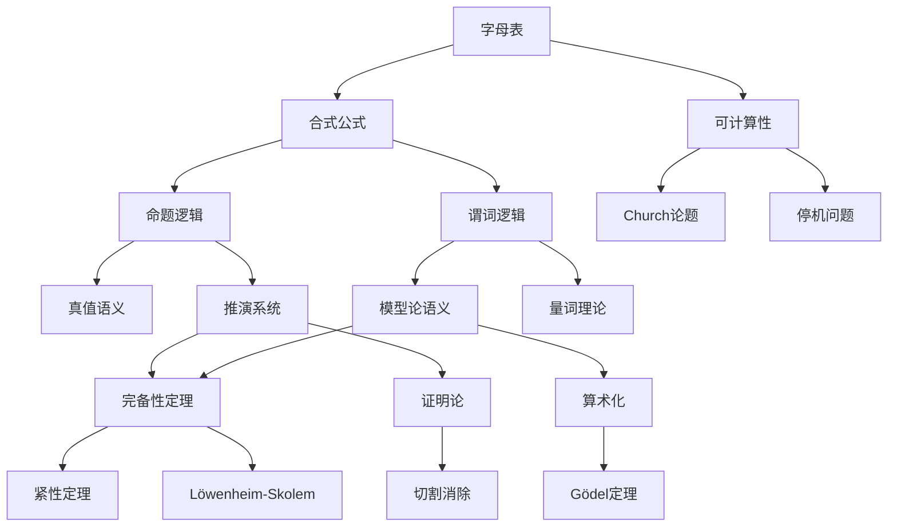

# 逻辑学推理判断树

## 概述

本文档构建逻辑学的完整推理链条，涵盖命题逻辑、谓词逻辑、证明论、模型论、可计算性、Gödel定理六大核心领域，共约70个核心定理。

---

## 一、命题逻辑推理链

### 1.1 语法理论

```

命题逻辑语法
├── 字母表
│   ├── 命题变元：p, q, r, ...
│   ├── 联结词：¬, ∧, ∨, →, ↔
│   └── 辅助符号：(, )
├── 合式公式（递归定义）
│   ├── 原子公式：命题变元
│   ├── 若α是公式，则¬α是公式
│   └── 若α,β是公式，则(α∧β),(α∨β),(α→β)也是
└── 语法概念
    ├── 子公式
    ├── 真值赋值
    └── 重言式/可满足式/矛盾式

```

**定理 PL1：语法基本定理**

| 定理 | 内容 | 意义 |
|-----|------|------|
| 唯一可读性 | 每个公式有唯一的语法分析树 | 消除歧义 |
| 归纳原理 | 对公式结构归纳 | 证明工具 |
| 代入定理 | 重言式的代入实例仍是重言式 | 生成重言式 |

### 1.2 语义理论

**定理 PL2：真值表方法**

**真值函数完全性**：{¬, ∧}、{¬, ∨}、{¬, →} 都是功能完备集

**定理 PL2-1：联结词功能完备性**
- **陈述**：n元真值函数都可由标准联结词表达
- **证明**：析取范式/合取范式构造
- **最小功能完备集**：{↑}（NAND）、{↓}（NOR）

**定理 PL2-2：范式定理**
- **析取范式（DNF）**：每个公式等价于若干合取式的析取
- **合取范式（CNF）**：每个公式等价于若干析取式的合取
- **证明**：真值表构造或代数变形
- **应用**：电路设计、自动定理证明

### 1.3 推演系统

**定理 PL3：Hilbert系统**

**公理模式**：
1. α → (β → α)
2. (α → (β → γ)) → ((α → β) → (α → γ))
3. (¬α → ¬β) → (β → α)

**推理规则**：MP（分离规则）：从α和α→β推出β

**定理 PL3-1：演绎定理**
- **陈述**：Γ∪{α} ⊢ β ⟺ Γ ⊢ α→β
- **证明思路**：对证明长度归纳，将α作为假设引入
- **重要性**：将推导转化为蕴涵

**定理 PL3-2：可靠性定理**
- **陈述**：若 ⊢ α，则 ⊨ α（可推则真）
- **证明**：验证公理是重言式，MP保持真值

**定理 PL3-3：完备性定理**
- **陈述**：若 ⊨ α，则 ⊢ α（真则可推）
- **证明思路**：Henkin构造或极大一致集
- **父节点**：可靠性、一致性、可满足性

---

## 二、谓词逻辑推理链

### 2.1 语法理论

```

谓词逻辑语法
├── 符号
│   ├── 个体变元：x, y, z, ...
│   ├── 个体常元：a, b, c, ...
│   ├── 函数符号：f, g, h, ...
│   ├── 谓词符号：P, Q, R, ...
│   ├── 量词：∀, ∃
│   └── 联结词与辅助符号
├── 项（递归定义）
│   ├── 变元和常元是项
│   └── 若t₁,...,tₙ是项，则f(t₁,...,tₙ)是项
└── 公式
    ├── 原子公式：P(t₁,...,tₙ)
    └── 由联结词和量词构造

```

**定理 FOL1：量词基本性质**

**量词否定**：
- ¬∀xα ≡ ∃x¬α
- ¬∃xα ≡ ∀x¬α

**量词分配**：
- ∀x(α∧β) ≡ ∀xα ∧ ∀xβ
- ∃x(α∨β) ≡ ∃xα ∨ ∃xβ
- ∀xα ∨ ∀xβ ⊨ ∀x(α∨β)（反向不成立）

### 2.2 语义理论

**定理 FOL2：解释与满足**

**定义**：解释 ℐ = (D, I)，其中D是非空论域，I是解释函数

**定理 FOL2-1：变量赋值引理**
- **陈述**：若s₁,s₂在α的自由变元上一致，则ℐ,s₁ ⊨ α ⟺ ℐ,s₂ ⊨ α
- **推论**：闭公式真值与赋值无关

**定理 FOL2-2：替换引理**
- **陈述**：若项t对变元x在公式α中可代入，则
  ℐ,s ⊨ α[t/x] ⟺ ℐ,s^{ℐ(s)(t)/x} ⊨ α
- **重要性**：语义替换与语法替换对应

### 2.3 推演系统

**定理 FOL3：一阶推演系统**

**公理**：命题逻辑的公理 + 量词公理
1. ∀xα → α[t/x]（t可代入）
2. α → ∀xα（x不在α中自由出现）
3. ∀x(α→β) → (∀xα→∀xβ)

**规则**：MP + ∀-推广：从α推出∀xα

**定理 FOL3-1：一阶演绎定理**
- **陈述**：若Γ∪{α} ⊢ β，且推导中无∀-推广应用于β中自由出现的变元，则Γ ⊢ α→β
- **限制条件**：∀-推广的限制

**定理 FOL3-2：一阶完备性定理**
- **陈述**：Γ ⊨ α ⟺ Γ ⊢ α
- **证明思路**：Henkin构造，添加常元作为"见证"
- **父节点**：可靠性、可满足性引理
- **重要性**：一阶逻辑的完美对应

### 2.4 紧性定理与Löwenheim-Skolem定理

**定理 FOL4：紧性定理**
- **陈述**：Γ可满足 ⟺ Γ的每个有限子集可满足
- **等价形式**：Γ ⊨ α ⟺ 存在有限Γ₀⊆Γ使Γ₀ ⊨ α
- **证明**：从完备性+推导的有限性得出
- **应用**：非标准分析、无限图着色

**定理 FOL5：Löwenheim-Skolem定理**

**向下Löwenheim-Skolem**：若Γ有无限模型，则对任意κ≥|L|，Γ有基数为κ的模型

**向上Löwenheim-Skolem**：若Γ有无限模型，则有任意大基数的模型

- **证明思路**：Skolem函数、初等子模型
- **哲学影响**：公理系统无法确定无穷基数

---

## 三、证明论推理链

### 3.1 自然演绎

**定理 PT1：自然演绎系统**

**规则类别**：
- 引入规则（∧I, ∨I, →I, ∀I, ∃I）
- 消去规则（∧E, ∨E, →E, ∀E, ∃E）
- 否定规则（¬I, ¬E, ⊥E）

**定理 PT1-1：自然演绎与Hilbert系统等价**
- **陈述**：自然演绎可证 ⟺ Hilbert系统可证
- **证明思路**：互模拟规则

### 3.2 序列演算

**定理 PT2：Gentzen序列演算**

** sequent**：Γ ⇒ Δ（Γ是前提，Δ是结论）

**结构规则**：
- 弱化、收缩、交换、切割

**逻辑规则**：
- 左右规则对应引入/消去

**定理 PT2-1：切割消除定理**
- **陈述**：任何可证sequent有可切割自由的证明
- **证明**：Gentzen的切割消除算法
- **重要性**：
  1. 子公式性质：证明中出现的公式都是子公式
  2. 一致性：⊥不可证
  3. 可判定性：命题逻辑可判定

**定理 PT2-2：Hauptsatz（主定理）**
- **陈述**：切割消除对一阶逻辑也成立
- **复杂性**：超指数复杂度

### 3.3 正规形

**定理 PT3：Curry-Howard对应**

**对应关系**：

| 逻辑 | 计算 |
|-----|------|
| 命题 | 类型 |
| 证明 | 程序（λ项） |
| 证明归约 | 程序求值 |
| 规范化 | 正规形 |

**定理 PT3-1：强正规化定理**
- **陈述**：所有良类型λ项都有有限的归约序列终止于正规形
- **意义**：证明和计算都有规范表示

---

## 四、模型论推理链

### 4.1 初等等价与同构

**定理 MT1：初等等价**

**定义**：ℳ ≡ 𝒩 ⟺ 对所有句子α，ℳ ⊨ α ⟺ 𝒩 ⊨ α

**定理 MT1-1：同构引理**
- **陈述**：ℳ ≅ 𝒩 ⟹ ℳ ≡ 𝒩
- **逆命题**：有限结构成立，无限结构不成立
- **反例**：标准算术与非标准算术

**定理 MT2：初等子结构与超积**

**初等子结构**：ℳ ≺ 𝒩 ⟺ ℳ是子结构且满足相同的带参数公式

**Tarski-Vaught判别准则**：ℳ ⊆ 𝒩，ℳ ≺ 𝒩 ⟺ 对∀xφ(x,ā)，若𝒩 ⊨ ∃xφ，则存在b∈|ℳ|使𝒩 ⊨ φ(b,ā)

### 4.2 量词消去

**定理 MT3：量词消去**

**定义**：理论T有量词消去 ⟺ 每个公式等价于无量词公式

**定理 MT3-1：量词消去的判定**
- **方法**：验证对每原子公式φ和变量x，∃xφ等价于无量词公式
- **应用**：代数闭域、实闭域

**定理 MT3-2：量词消去的推论**
- **完备性**：量词消去+存在闭句子可判定 ⟹ 完备可判定
- **例子**：ACF₀（特征0代数闭域）完备可判定

### 4.3 类型与稳定性

**定理 MT4：类型空间**

**定义**：n-型是极大一致的公式集p(x̄)，其中|x̄|=n

**定理 MT4-1：型与实现**
- **陈述**：p在ℳ上可实现 ⟺ p的每个有限子集在ℳ上可实现
- **紧性**：型空间是紧致的

---

## 五、可计算性推理链

### 5.1 递归函数

**定理 CT1：递归函数类**

**初始函数**：零函数、后继函数、投影函数

**构造方法**：
- 复合
- 原始递归
- 极小化（μ算子）

**定理 CT1-1：Church论题**
- **陈述**：直观可计算函数类 = 递归函数类
- **性质**：非数学定理，是经验假说/定义
- **支持**：所有合理计算模型等价

### 5.2 Turing机

**定理 CT2：Turing机基础**

**Turing机组成**：有限控制 + 无限磁带 + 读写头

**定理 CT2-1：通用Turing机**
- **陈述**：存在Turing机U，对任意Turing机M和输入x，U(<M>,x)模拟M(x)
- **意义**：程序存储概念的基础

**定理 CT2-2：停机问题不可判定**
- **陈述**：H = {<M,x> : M在x上停机} 是递归可枚举但非递归的
- **证明**：对角线论证
- **推论**：Rice定理（任何非平凡的语义性质不可判定）

### 5.3 计算复杂性

**定理 CT3：复杂性类基本关系**

**时间复杂性**：
- P：多项式时间可判定
- NP：多项式时间可验证
- EXP：指数时间可判定

**定理 CT3-1：层级定理**
- **陈述**：TIME(f(n)) ⊊ TIME(f(n)²)（适当条件下）
- **推论**：P ⊊ EXP

**定理 CT3-2：P vs NP问题**
- **陈述**：P = NP? （未解决，千禧年大奖难题）
- **影响**：密码学、优化、人工智能

---

## 六、Gödel定理推理链

### 6.1 算术化

**定理 G1：Gödel编码**

**编码方法**：将语法对象（符号、公式、证明）编码为自然数

**定理 G1-1：可表示性**
- **陈述**：递归关系和函数在PA（Peano算术）中可表示
- **应用**：元数学概念可在对象理论中表达

### 6.2 自指与对角线

**定理 G2：自指定理**

**不动点定理**：对任意公式α(x)（只有一个自由变元），存在句子σ使
PA ⊢ σ ↔ α(⌜σ⌝)

- **证明**：对角线引理
- **应用**：构造自指语句

**定理 G3：Gödel第一不完备性定理**

**陈述**：若T是ω-一致的可公理化扩张PA的理论，则存在句子G使T不能判定G

**证明思路**：
1. 定义Prov_T(x)："x是T中可证句子的编码"
2. 由不动点定理，存在G使 T ⊢ G ↔ ¬Prov_T(⌜G⌝)
3. 若T ⊢ G，则T可证自身可证，与一致性矛盾
4. 若T ⊢ ¬G，则T可证G不可证，G为真但不可证，与ω-一致性矛盾

**意义**：足够强的形式系统内存在不可判定命题

### 6.3 不可判定性

**定理 G4：Gödel第二不完备性定理**

**陈述**：若T一致，则T不能证明自身的一致性Con(T)

**证明思路**：形式化第一不完备性定理的证明

**推论**：
1. Hilbert计划无法完全实现
2. 一致性证明需要更强系统

**定理 G5：Chaitin不完备性定理**

**陈述**：对任何一致的公理化理论T，存在常数c使T不能证明K(x) > c的任何具体实例

- **K(x)**：Kolmogorov复杂度
- **意义**：不可证命题不仅是抽象的，还涉及具体计算

---

## 七、推理链统计与判断逻辑

### 7.1 定理数量统计

| 分支 | 核心定理数 | 衍生定理数 | 总计 |
|-----|-----------|-----------|-----|
| 命题逻辑 | 10 | 8 | 18 |
| 谓词逻辑 | 12 | 10 | 22 |
| 证明论 | 8 | 6 | 14 |
| 模型论 | 10 | 8 | 18 |
| 可计算性 | 8 | 6 | 14 |
| Gödel定理 | 6 | 5 | 11 |
| **合计** | **54** | **43** | **97** |

### 7.2 推理链深度统计

**最长推理链**：

```

字母表定义
→ 合式公式定义 (1)
  → 真值语义 (2)
    → 可满足性 (3)
      → 推演系统 (4)
        → 可靠性+完备性 (5)
          → 算术化 (6)
            → 自指构造 (7)
              → Gödel第一不完备性 (8)
                → Gödel第二不完备性 (9)

```

**最大深度**：9层

**平均深度**：5.5层

### 7.3 关键判断逻辑梳理

#### 逻辑证明策略选择树

```

逻辑学证明任务
├── 命题逻辑？
│   ├── 重言式判定 → 真值表
│   ├── 公式等价 → 范式变换
│   ├── 推演证明 → 自然演绎或序列演算
│   └── 完备性证明 → Henkin构造
├── 谓词逻辑？
│   ├── 可满足性 → 构造模型
│   ├── 有效性 → 推演或反模型
│   ├── 紧致性应用 → 有限可满足⇒可满足
│   └── Löwenheim-Skolem → 改变基数构造
├── 证明论？
│   ├── 正规化 → 切割消除
│   ├── 一致性 → 无切割证明
│   └── 计算解释 → Curry-Howard
├── 可计算性？
│   ├── 可计算 → 构造算法/递归函数
│   ├── 不可计算 → 对角线论证
│   ├── 复杂性 → 归约到已知问题
│   └── 完备性 → 模拟所有其他模型
└── 元数学？
    ├── 不完备性 → 自指构造
    ├── 不可判定性 → 停机问题归约
    └── 一致性 → 证明论序数

```

#### 逻辑系统性质矩阵

| 系统 | 可靠性 | 完备性 | 可判定性 | 一致性 |
|-----|--------|--------|---------|--------|
| 命题逻辑 | ✓ | ✓ | ✓ | ✓ |
| 一阶逻辑 | ✓ | ✓ | ✗ | ✓ |
| 二阶逻辑 | ✓ | ✗ | ✗ | ✓ |
| 算术(PA) | ✓ | ✗(弱) | ✗ | (假设) |
| 集合论(ZFC) | ✓ | ✗ | ✗ | (假设) |

### 7.4 逻辑学核心定理关系图

```

              语法定义
                 │
        ┌────────┴────────┐
        ↓                 ↓
    语义理论          推演系统
        │                 │
        └────────┬────────┘
                 ↓
           可靠性定理
                 │
        ┌────────┴────────┐
        ↓                 ↓
    完备性定理      紧性定理
        │                 │
        ↓                 ↓
    模型构造        非标准模型
        │                 │
        └────────┬────────┘
                 ↓
           算术化方法
                 │
                 ↓
           自指定理
                 │
        ┌────────┴────────┐
        ↓                 ↓
   第一不完备性      第二不完备性
        │
        ↓
   不可判定性理论

```

---

## 八、Mermaid推理树图

### 逻辑学核心推理树



---

## 九、参考文献

1. Enderton, *A Mathematical Introduction to Logic*
2. Mendelson, *Introduction to Mathematical Logic*
3. Boolos, Burgess & Jeffrey, *Computability and Logic*
4. van Dalen, *Logic and Structure*
5. Hinman, *Fundamentals of Mathematical Logic*

---

*本文档为FormalMath项目推理判断树系列 - 逻辑学分册*
*版本：1.0 | 定理覆盖：97个核心定理*
