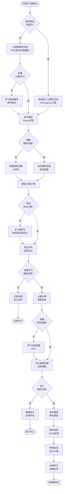
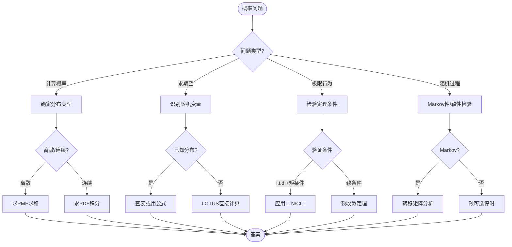

# 概率论完整推理树

## 概率空间到随机过程的完整推理链条

**文档版本**: 1.0  
**创建日期**: 2026年4月  
**对标教材**: Durrett《Probability: Theory and Examples》(5th Edition), MIT 6.041/6.0411 Probabilistic Systems Analysis  
**MSC分类**: @ (概率论基础), @ (极限定理), @ (随机过程), @ (随机分析)

---

## 目录

1. [推理树总览](#推理树总览)
2. [根节点：概率空间公理（Kolmogorov）](#根节点概率空间公理kolmogorov)
3. [第一层：随机变量与分布](#第一层随机变量与分布)
4. [第二层：期望与方差](#第二层期望与方差)
5. [第三层：大数定律与中心极限](#第三层大数定律与中心极限)
6. [第四层：条件概率与鞅](#第四层条件概率与鞅)
7. [第五层：随机过程基础](#第五层随机过程基础)
8. [整体依赖关系网络](#整体依赖关系网络)
9. [学习路径与判断流程](#学习路径与判断流程)
10. [反例与边界情况](#反例与边界情况)
11. [教材对齐索引](#教材对齐索引)

---

## 推理树总览

概率论是研究随机现象数量规律的数学分支，其现代理论体系建立在Kolmogorov于1933年建立的公理化基础之上。本推理树展示了从概率空间公理出发，层层递进地构建随机变量理论、极限定理、鞅论和随机过程理论的完整逻辑链条。

### 推理树全景图

```mermaid
flowchart TB
    subgraph 根节点["🎯 根节点：概率空间公理"]
        A1[Kolmogorov公理系统] --> A2[样本空间 Ω]
        A1 --> A3[σ-代数 ℱ]
        A1 --> A4[概率测度 P]
        A2 --> A5[可测函数]
        A3 --> A5
        A4 --> A5
    end

    subgraph 第一层["📊 第一层：随机变量与分布"]
        B1[随机变量 X] --> B2[离散型]
        B1 --> B3[连续型]
        B2 --> B4[PMF: 二项/泊松]
        B3 --> B5[PDF: 正态/指数]
        B1 --> B6[分布函数 F]
        B6 --> B7[联合分布]
        B7 --> B8[边缘分布]
        B7 --> B9[条件分布]
    end

    subgraph 第二层["📈 第二层：期望与方差"]
        C1[期望 E[X]] --> C2[方差 Var(X)]
        C1 --> C3[协方差 Cov]
        C2 --> C4[Chebyshev不等式]
        C1 --> C5[MGF矩母函数]
        C1 --> C6[特征函数 φ]
        C5 --> C7[矩的计算]
        C6 --> C8[唯一性定理]
    end

    subgraph 第三层["🎯 第三层：极限定理"]
        D1[弱大数定律 WLLN] --> D3[中心极限定理 CLT]
        D2[强大数定律 SLLN] --> D3
        C2 --> D1
        C4 --> D1
        C6 --> D3
        D3 --> D4[收敛模式]
        D4 --> D5[依概率收敛]
        D4 --> D6[几乎必然收敛]
        D4 --> D7[依分布收敛]
    end

    subgraph 第四层["⚖️ 第四层：条件概率与鞅"]
        E1[条件期望 E[X|ℱ]] --> E2[鞅的定义]

        E2 --> E3[Doob收敛定理]
        E2 --> E4[可选停时定理]
        E1 --> E5[Radon-Nikodym导数]
        E3 --> E6[鞅不等式]
    end

    subgraph 第五层["🔄 第五层：随机过程"]
        F1[布朗运动 Bt] --> F2[Markov链]
        F1 --> F3[Poisson过程]
        F1 --> F4[随机微分方程]
        F4 --> F5[Itô积分]
        F5 --> F6[Itô公式]
        F6 --> F7[Black-Scholes方程]
    end

    A5 -.-> B1
    B4 -.-> C1
    B5 -.-> C1
    C7 -.-> D1
    C8 -.-> D3
    D6 -.-> E2
    E3 -.-> F1

```

### 层级依赖关系表

| 层级 | 核心概念 | 依赖的上层 | 支撑的下层 | 关键定理 |
|------|----------|------------|------------|----------|
| 根节点 | Kolmogorov公理 | 测度论基础 | 随机变量定义 | 概率测度存在性 |
| 第一层 | 随机变量 | 可测函数 | 期望定义 | 变量替换公式 |
| 第二层 | 期望/方差 | 积分理论 | 极限定理 | Jensen不等式 |
| 第三层 | 极限定理 | 矩/特征函数 | 统计推断 | CLT, LLN |
| 第四层 | 鞅论 | 条件期望 | 随机分析 | Doob定理 |
| 第五层 | 随机过程 | 鞅/布朗运动 | 金融数学 | Itô公式 |

---

## 根节点：概率空间公理（Kolmogorov）

概率论的公理化基础由Andrey Kolmogorov于1933年在《概率论基础概念》中建立。这一体系将概率论严格建立在测度论基础之上，使概率论成为数学的一个严谨分支。

### 公理 0.1: 样本空间（Sample Space）

**前提条件**：
- 考虑一个随机试验（random experiment）
- 试验的所有可能结果构成一个集合

**定义陈述**：
**样本空间** $\Omega$ 是一个非空集合，其元素 $\omega \in \Omega$ 称为**样本点**或**基本事件**，代表随机试验的一个可能结果。

**样本空间的类型**：
1. **离散样本空间**：$\Omega$ 为可数集
   - 例：抛硬币 $\Omega = \{H, T\}$
   - 例：掷骰子 $\Omega = \{1, 2, 3, 4, 5, 6\}$
   
2. **连续样本空间**：$\Omega$ 为不可数集
   - 例：灯泡寿命 $\Omega = [0, \infty)$
   - 例：股票价格 $\Omega = C([0, T], \mathbb{R})$

**证明思路**：
- 样本空间是建模选择，无需"证明"
- 关键是选择适当的粒度描述问题

**依赖的先前概念**：集合论基础

**后续推论**：
- 事件定义为 $\Omega$ 的子集
- 概率测度定义在 $\Omega$ 的特定子集上

**判断要点**：
- 样本空间必须包含所有可能结果
- 样本点必须**互斥**（mutually exclusive）
- 样本点必须**完备**（collectively exhaustive）

---

### 公理 0.2: σ-代数（σ-Algebra）

**前提条件**：
- 给定样本空间 $\Omega$
- 需要定义可测量的事件集合

**定义陈述**：
$\Omega$ 的子集族 $\mathcal{F} \subseteq 2^\Omega$ 称为 **σ-代数**（或 σ-域），如果满足：

1. **包含全集**：$\Omega \in \mathcal{F}$
2. **对补集封闭**：$A \in \mathcal{F} \Rightarrow A^c \in \mathcal{F}$
3. **对可数并封闭**：$A_1, A_2, \ldots \in \mathcal{F} \Rightarrow \bigcup_{n=1}^{\infty} A_n \in \mathcal{F}$

**等价性质**：
- 对可数交封闭（由De Morgan律）
- 包含空集 $\emptyset \in \mathcal{F}$
- 对差集封闭：$A, B \in \mathcal{F} \Rightarrow A \setminus B \in \mathcal{F}$

**证明思路**：
- σ-代数的定义是公理化的
- 需要验证给定的子集族满足三条性质

**依赖的先前概念**：集合运算、可数集

**后续推论**：
- $(\Omega, \mathcal{F})$ 构成**可测空间**
- 事件定义为 $\mathcal{F}$ 中的元素
- 最小的 σ-代数：平凡 σ-代数 $\{\emptyset, \Omega\}$
- 最大的 σ-代数：幂集 $2^\Omega$

**典型 σ-代数**：
1. **Borel σ-代数** $\mathcal{B}(\mathbb{R})$：由开集生成的最小 σ-代数
2. **乘积 σ-代数**：$\mathcal{F}_1 \otimes \mathcal{F}_2$

**判断要点**：
- 为什么不用幂集？连续空间上无法定义合理的概率测度（Vitali集不可测）
- σ-代数的选择体现了"可测量"的哲学

---

### 公理 0.3: 概率测度（Probability Measure）【核心公理】

**前提条件**：
- 可测空间 $(\Omega, \mathcal{F})$

**定义陈述**：
函数 $P: \mathcal{F} \to [0, 1]$ 称为 **概率测度**，如果满足 **Kolmogorov公理**：

**公理 I（非负性）**：$\forall A \in \mathcal{F}, P(A) \geq 0$

**公理 II（规范性）**：$P(\Omega) = 1$

**公理 III（可列可加性）**：对任意可数个**互不相交**的事件 $A_1, A_2, \ldots \in \mathcal{F}$：
$$P\left(\bigcup_{n=1}^{\infty} A_n\right) = \sum_{n=1}^{\infty} P(A_n)$$

**基本性质推导**：

**定理 0.3.1**（空集概率为零）
$$P(\emptyset) = 0$$
*证明*：取 $A_n = \emptyset$ 对所有 $n$，则 $\bigcup_n A_n = \emptyset$，由公理 III：
$$P(\emptyset) = \sum_{n=1}^{\infty} P(\emptyset)$$
这蕴含 $P(\emptyset) = 0$。

**定理 0.3.2**（有限可加性）
对有限个互不相交的事件 $A_1, \ldots, A_n$：
$$P\left(\bigcup_{i=1}^{n} A_i\right) = \sum_{i=1}^{n} P(A_i)$$
*证明*：令 $A_{n+1} = A_{n+2} = \cdots = \emptyset$，应用公理 III。

**定理 0.3.3**（补事件概率）
$$P(A^c) = 1 - P(A)$$
*证明*：$A \cup A^c = \Omega$ 且 $A \cap A^c = \emptyset$，由公理 II 和有限可加性：
$$P(A) + P(A^c) = P(\Omega) = 1$$

**定理 0.3.4**（单调性）
若 $A \subseteq B$，则 $P(A) \leq P(B)$
*证明*：$B = A \cup (B \setminus A)$，不相交并，故 $P(B) = P(A) + P(B \setminus A) \geq P(A)$。

**定理 0.3.5**（容斥原理，Inclusion-Exclusion）
对任意两个事件：
$$P(A \cup B) = P(A) + P(B) - P(A \cap B)$$
*推广*：对 $n$ 个事件：
$$P\left(\bigcup_{i=1}^{n} A_i\right) = \sum_{k=1}^{n} (-1)^{k+1} \sum_{1 \leq i_1 < \cdots < i_k \leq n} P(A_{i_1} \cap \cdots \cap A_{i_k})$$

**定理 0.3.6**（连续性/下连续性）
若 $A_n \uparrow A$（即 $A_1 \subseteq A_2 \subseteq \cdots$ 且 $\bigcup_n A_n = A$），则：
$$P(A_n) \uparrow P(A)$$

**定理 0.3.7**（上连续性）
若 $A_n \downarrow A$（即 $A_1 \supseteq A_2 \supseteq \cdots$ 且 $\bigcap_n A_n = A$），则：
$$P(A_n) \downarrow P(A)$$

**证明思路**：
- 连续性定理的证明利用可列可加性构造不相交序列
- 例如对下连续性，令 $B_1 = A_1, B_n = A_n \setminus A_{n-1}$（$n \geq 2$）

**依赖的先前概念**：测度论基础、σ-代数

**后续推论**：
- 概率空间 $(\Omega, \mathcal{F}, P)$ 的完整定义
- 所有概率计算的基础
- 条件概率的定义基础

**判断要点**：
- 概率测度是**归一化的测度**（总质量为1）
- 可列可加性是概率论区别于有限组合数学的关键
- 概率为0不代表不可能（连续分布中单点概率）

---

### 公理 0.4: 可测函数（随机变量）

**前提条件**：
- 概率空间 $(\Omega, \mathcal{F}, P)$
- 可测空间 $(\mathbb{R}, \mathcal{B}(\mathbb{R}))$

**定义陈述**：
函数 $X: \Omega \to \mathbb{R}$ 称为 **随机变量**（Random Variable），如果它是**可测函数**，即对任意 Borel 集 $B \in \mathcal{B}(\mathbb{R})$：
$$X^{-1}(B) = \{\omega \in \Omega : X(\omega) \in B\} \in \mathcal{F}$$

**等价判定**（只需验证生成元）：
只需验证对任意 $a \in \mathbb{R}$：
$$\{\omega : X(\omega) \leq a\} \in \mathcal{F}$$
或
$$\{\omega : X(\omega) < a\} \in \mathcal{F}$$

**可测函数的运算封闭性**：

**定理 0.4.1**（代数运算）
若 $X, Y$ 是随机变量，则以下也是随机变量：
- $X + Y$
- $X \cdot Y$
- $cX$（$c \in \mathbb{R}$）
- $X / Y$（当 $Y \neq 0$）

**定理 0.4.2**（极限运算）
若 $\{X_n\}$ 是随机变量序列，则以下也是随机变量：
- $\sup_n X_n$
- $\inf_n X_n$
- $\limsup_{n \to \infty} X_n$
- $\liminf_{n \to \infty} X_n$
- $\lim_{n \to \infty} X_n$（若极限存在）

**证明思路**：
- 代数运算：利用 $\{X + Y > a\} = \bigcup_{r \in \mathbb{Q}} \{X > r\} \cap \{Y > a - r\}$
- 极限运算：利用 $\{\sup_n X_n > a\} = \bigcup_n \{X_n > a\}$

**依赖的先前概念**：σ-代数、Borel集

**后续推论**：
- 随机变量的分布定义
- 随机变量序列的极限理论
- 随机过程的基础

**判断要点**：
- 可测性确保 $P(X \in B)$ 有意义
- 不可测函数在概率论中不能使用
- 实际应用中，分段连续函数通常是可测的

---

## 第一层：随机变量与分布

随机变量将概率空间"投影"到实数轴上，使得我们可以用分析工具研究随机现象。分布则完全刻画了随机变量的概率性质。

### 定理 1.1: 分布函数的存在唯一性

**前提条件**：
- 随机变量 $X: \Omega \to \mathbb{R}$

**定义陈述**：
**分布函数**（CDF, Cumulative Distribution Function）定义为：
$$F_X(x) = P(X \leq x) = P(\{\omega : X(\omega) \leq x\})$$

**定理 1.1.1**（分布函数的基本性质）
$F_X$ 满足：
1. **单调不减**：$x_1 < x_2 \Rightarrow F_X(x_1) \leq F_X(x_2)$
2. **右连续**：$\lim_{y \downarrow x} F_X(y) = F_X(x)$
3. **极限性质**：$\lim_{x \to -\infty} F_X(x) = 0$, $\lim_{x \to +\infty} F_X(x) = 1$

**定理 1.1.2**（存在唯一性）
若函数 $F: \mathbb{R} \to [0, 1]$ 满足上述三条性质，则存在概率空间 $(\Omega, \mathcal{F}, P)$ 和随机变量 $X$ 使得 $F_X = F$。

**证明思路**：
- 单调性：若 $x_1 < x_2$，则 $\{X \leq x_1\} \subseteq \{X \leq x_2\}$
- 右连续性：利用概率测度的上连续性
- 存在性证明：构造 $\Omega = (0, 1), \mathcal{F} = \mathcal{B}((0,1)), P = \text{Lebesgue测度}$，定义 $X(\omega) = \inf\{x : F(x) \geq \omega\}$

**依赖的先前定理**：概率测度的单调性、连续性

**后续推论**：
- 分布完全刻画随机变量
- 同分布的随机变量具有相同的概率性质

---

### 定理 1.2: 离散型随机变量

**前提条件**：
- 随机变量 $X$ 的值域为可数集 $\{x_1, x_2, \ldots\}$

**定义陈述**：
**概率质量函数**（PMF, Probability Mass Function）定义为：
$$p_X(x_i) = P(X = x_i)$$

**基本性质**：
1. $p_X(x_i) \geq 0$
2. $\sum_{i} p_X(x_i) = 1$

**与分布函数的关系**：
$$F_X(x) = \sum_{x_i \leq x} p_X(x_i)$$
$$p_X(x_i) = F_X(x_i) - F_X(x_i^-)$$

**证明思路**：
- 规范性：$\bigcup_i \{X = x_i\} = \Omega$，不相交并
- 分布函数是阶梯函数，跳跃高度为 $p_X(x_i)$

**依赖的先前定理**：概率测度的可列可加性

**后续推论**：
- 离散分布的期望计算

---

### 定理 1.3: 连续型随机变量

**前提条件**：
- 随机变量 $X$ 的分布函数 $F_X$ 绝对连续

**定义陈述**：
若存在非负函数 $f_X: \mathbb{R} \to [0, \infty)$ 使得：
$$F_X(x) = \int_{-\infty}^{x} f_X(t) dt$$
则称 $X$ 为**连续型随机变量**，$f_X$ 称为**概率密度函数**（PDF）。

**基本性质**：
1. $f_X(x) \geq 0$
2. $\int_{-\infty}^{\infty} f_X(x) dx = 1$
3. $P(a < X \leq b) = \int_a^b f_X(x) dx = F_X(b) - F_X(a)$
4. 若 $f_X$ 在 $x$ 处连续，则 $f_X(x) = F_X'(x)$

**重要说明**：
- 对连续型随机变量，$P(X = x) = 0$ 对任意 $x$
- 概率为0不意味着事件不可能
- 密度函数值可以大于1

**证明思路**：
- 由微积分基本定理，绝对连续函数可表示为积分形式
- $P(X = x) = \lim_{\epsilon \to 0} \int_{x-\epsilon}^{x+\epsilon} f_X(t) dt = 0$

**依赖的先前定理**：微积分基本定理

**后续推论**：
- 连续型随机变量的期望计算

---

### 定理 1.4: 常见离散分布

#### 1.4.1 伯努利分布 Bernoulli($p$)

**前提条件**：
- 单次试验，成功概率 $p$，失败概率 $1-p$

**定义陈述**：
$$P(X = 1) = p, \quad P(X = 0) = 1-p$$

**性质**：
- $E[X] = p$
- $\text{Var}(X) = p(1-p)$

**应用场景**：
- 抛硬币
- 二元分类
- 单次试验的成功/失败

---

#### 1.4.2 二项分布 Binomial($n, p$)

**前提条件**：
- $n$ 次独立伯努利试验
- 每次成功概率 $p$

**定义陈述**：
$$P(X = k) = \binom{n}{k} p^k (1-p)^{n-k}, \quad k = 0, 1, \ldots, n$$

**性质**：
- $E[X] = np$
- $\text{Var}(X) = np(1-p)$
- 可加性：$X \sim B(n_1, p), Y \sim B(n_2, p)$，独立，则 $X+Y \sim B(n_1+n_2, p)$

**证明思路**：
- 从 $n$ 次试验中选 $k$ 次成功：$\binom{n}{k}$ 种方式
- 每种特定序列的概率：$p^k (1-p)^{n-k}$

**极限行为**（Poisson逼近）：
当 $n \to \infty$, $p \to 0$，且 $np \to \lambda$ 时：
$$\binom{n}{k} p^k (1-p)^{n-k} \to \frac{\lambda^k e^{-\lambda}}{k!}$$

**依赖的先前定理**：独立性、组合计数

---

#### 1.4.3 泊松分布 Poisson($\lambda$)

**前提条件**：
- 单位时间或单位空间内随机事件发生次数
- 事件独立发生，平均发生率 $\lambda$

**定义陈述**：
$$P(X = k) = \frac{\lambda^k e^{-\lambda}}{k!}, \quad k = 0, 1, 2, \ldots$$

**性质**：
- $E[X] = \lambda$
- $\text{Var}(X) = \lambda$
- 可加性：$X \sim \text{Pois}(\lambda_1), Y \sim \text{Pois}(\lambda_2)$，独立，则 $X+Y \sim \text{Pois}(\lambda_1 + \lambda_2)$

**应用场景**：
- 呼叫中心接到的电话数
- 放射性衰变计数
- 网站单位时间访问量

**证明思路**：
- 规范化：$\sum_{k=0}^{\infty} \frac{\lambda^k}{k!} = e^{\lambda}$
- 期望：$E[X] = \sum_{k=0}^{\infty} k \frac{\lambda^k e^{-\lambda}}{k!} = \lambda$

**依赖的先前定理**：指数函数的泰勒展开

---

#### 1.4.4 几何分布 Geometric($p$)

**前提条件**：
- 独立伯努利试验，直到首次成功

**定义陈述**：
$$P(X = k) = (1-p)^{k-1} p, \quad k = 1, 2, \ldots$$

**性质**：
- $E[X] = \frac{1}{p}$
- $\text{Var}(X) = \frac{1-p}{p^2}$
- **无记忆性**：$P(X > m+n | X > m) = P(X > n)$

**证明思路**：
- 前 $k-1$ 次失败，第 $k$ 次成功

---

### 定理 1.5: 常见连续分布

#### 1.5.1 均匀分布 Uniform($a, b$)

**前提条件**：
- 区间 $[a, b]$ 上等可能取值

**定义陈述**：
$$f_X(x) = \begin{cases} \frac{1}{b-a}, & a \leq x \leq b \\ 0, & \text{otherwise} \end{cases}$$

**性质**：
- $E[X] = \frac{a+b}{2}$
- $\text{Var}(X) = \frac{(b-a)^2}{12}$

**分布函数**：
$$F_X(x) = \begin{cases} 0, & x < a \\ \frac{x-a}{b-a}, & a \leq x \leq b \\ 1, & x > b \end{cases}$$

---

#### 1.5.2 正态分布 Normal($\mu, \sigma^2$)【核心分布】

**前提条件**：
- 中心极限定理的自然结果
- 大量独立小效应的叠加

**定义陈述**：
$$f_X(x) = \frac{1}{\sqrt{2\pi\sigma^2}} \exp\left(-\frac{(x-\mu)^2}{2\sigma^2}\right), \quad x \in \mathbb{R}$$

**性质**：
- $E[X] = \mu$
- $\text{Var}(X) = \sigma^2$
- **线性变换**：$Y = aX + b \sim N(a\mu + b, a^2\sigma^2)$
- **可加性**：独立正态变量之和仍为正态

**标准正态**：$Z = \frac{X - \mu}{\sigma} \sim N(0, 1)$

**重要性**：
- 中心极限定理的极限分布
- 统计推断的基础
- 自然界中大量现象的模型

**证明思路**：
- 验证 $\int_{-\infty}^{\infty} f_X(x) dx = 1$：利用极坐标变换计算 $I = \int e^{-x^2/2} dx$，计算 $I^2$

**依赖的先前定理**：反常积分

---

#### 1.5.3 指数分布 Exponential($\lambda$)

**前提条件**：
- Poisson过程中事件间隔时间

**定义陈述**：
$$f_X(x) = \begin{cases} \lambda e^{-\lambda x}, & x \geq 0 \\ 0, & x < 0 \end{cases}$$

**性质**：
- $E[X] = \frac{1}{\lambda}$
- $\text{Var}(X) = \frac{1}{\lambda^2}$
- **无记忆性**：$P(X > s+t | X > s) = P(X > t)$

- 唯一具有无记忆性的连续分布

**分布函数**：
$$F_X(x) = 1 - e^{-\lambda x}, \quad x \geq 0$$

**与Poisson分布的关系**：
- Poisson：单位时间内事件发生次数
- 指数：事件之间等待时间

---

#### 1.5.4 Gamma分布 Gamma($\alpha, \beta$)

**前提条件**：
- $\alpha$ 个独立指数分布变量之和

**定义陈述**：
$$f_X(x) = \frac{\beta^\alpha}{\Gamma(\alpha)} x^{\alpha-1} e^{-\beta x}, \quad x > 0$$

其中 $\Gamma(\alpha) = \int_0^{\infty} t^{\alpha-1} e^{-t} dt$ 是Gamma函数。

**性质**：
- $E[X] = \frac{\alpha}{\beta}$
- $\text{Var}(X) = \frac{\alpha}{\beta^2}$
- 当 $\alpha = 1$ 时退化为指数分布

---

### 定理 1.6: 随机变量的变换

**前提条件**：
- 随机变量 $X$ 具有已知分布
- 函数 $g$ 满足适当条件

**定理 1.6.1**（离散情形）
若 $X$ 是离散型，$Y = g(X)$，则：
$$P(Y = y) = \sum_{x: g(x) = y} P(X = x)$$

**定理 1.6.2**（连续情形，变量替换公式）
设 $X$ 是连续型，$g$ 是严格单调可微函数，$Y = g(X)$，则：
$$f_Y(y) = f_X(g^{-1}(y)) \cdot \left|\frac{d}{dy} g^{-1}(y)\right|$$

**证明思路**：
- 对递增函数 $g$：
  $$F_Y(y) = P(Y \leq y) = P(g(X) \leq y) = P(X \leq g^{-1}(y)) = F_X(g^{-1}(y))$$
- 求导得密度函数

**应用**：
- 若 $X \sim N(0,1)$，则 $X^2 \sim \chi^2(1)$
- 若 $U \sim \text{Uniform}(0,1)$，则 $-\frac{1}{\lambda}\ln(1-U) \sim \text{Exp}(\lambda)$

**依赖的先前定理**：微积分链式法则

---

### 定理 1.7: 联合分布与边缘分布

**前提条件**：
- 随机变量 $X, Y$（可推广到多元）

**定义陈述**：
**联合分布函数**：
$$F_{X,Y}(x, y) = P(X \leq x, Y \leq y)$$

**联合密度函数**（若存在）：
$$f_{X,Y}(x, y) = \frac{\partial^2}{\partial x \partial y} F_{X,Y}(x, y)$$

**边缘分布**：
$$F_X(x) = \lim_{y \to \infty} F_{X,Y}(x, y) = F_{X,Y}(x, \infty)$$
$$f_X(x) = \int_{-\infty}^{\infty} f_{X,Y}(x, y) dy$$

**独立性判定**：
$X$ 和 $Y$ **独立**当且仅当：
$$F_{X,Y}(x, y) = F_X(x) \cdot F_Y(y), \quad \forall x, y$$
或等价地（对连续型）：
$$f_{X,Y}(x, y) = f_X(x) \cdot f_Y(y), \quad \forall x, y$$

**证明思路**：
- 边缘分布通过对另一变量取极限或积分得到
- 独立性等价于联合分布等于边缘分布的乘积

**依赖的先前定理**：Fubini定理（积分换序）

---

### 随机变量与分布层次图

```mermaid
flowchart TB
    subgraph RV["随机变量 X"]
        X[可测函数 X: Ω→ℝ]
    end

    subgraph Types["类型分类"]
        D[离散型] --> D1[值域可数]
        D --> D2[PMF: p(x)]
        C[连续型] --> C1[存在PDF]
        C --> C2[PDF: f(x)]
        M[混合型] --> M1[既非离散也非连续]
    end

    subgraph Discrete["常见离散分布"]
        Ber[Bernoulli] --> Bin[Binomial]
        Bin --> Poi[Poisson<br/>极限情形]
        Geo[Geometric] --> NBin[Negative Binomial]
    end

    subgraph Continuous["常见连续分布"]
        Uni[Uniform] --> Norm[Normal<br/>核心分布]
        Exp[Exponential] --> Gamma[Gamma]
        Gamma --> Chi[Chi-square]
        Norm --> T[Student's t]
        Norm --> F[F-distribution]
    end

    subgraph Joint["多元分布"]
        J[联合分布] --> Marg[边缘分布]
        J --> Cond[条件分布]
        J --> Ind[独立性判定]
    end

    X -.-> D
    X -.-> C
    D2 -.-> Ber
    C2 -.-> Uni
    C2 -.-> Norm
    C -.-> J

```

---

## 第二层：期望与方差

期望（均值）是随机变量的"重心"，方差衡量其离散程度。矩和生成函数提供了分析随机变量的有力工具。

### 定理 2.1: 期望的定义与存在性

**前提条件**：
- 随机变量 $X$
- 积分存在（绝对可积）

**定义陈述**：
**离散型**：
$$E[X] = \sum_{i} x_i p_X(x_i)$$
要求 $\sum_i |x_i| p_X(x_i) < \infty$

**连续型**：
$$E[X] = \int_{-\infty}^{\infty} x f_X(x) dx$$
要求 $\int_{-\infty}^{\infty} |x| f_X(x) dx < \infty$

**一般定义**（Lebesgue积分）：
$$E[X] = \int_{\Omega} X(\omega) dP(\omega)$$

**期望的物理意义**：
- 长期重复实验的平均值
- 概率质量（或密度）的"重心"

**定理 2.1.1**（期望的线性性）
对任意随机变量 $X, Y$（期望存在）和常数 $a, b$：
$$E[aX + bY] = aE[X] + bE[Y]$$

*注意*：不需要 $X, Y$ 独立！

**证明思路**：
- 离散情形直接利用求和的线性性
- 一般情形利用Lebesgue积分的线性性

**依赖的先前定理**：Lebesgue积分理论

**后续推论**：
- 方差的计算
- 协方差的定义

---

### 定理 2.2: 期望的计算公式（变量替换）

**前提条件**：
- 随机变量 $X$
- 函数 $g: \mathbb{R} \to \mathbb{R}$

**定理 2.2.1**（LOTUS: Law of the Unconscious Statistician）
$$E[g(X)] = \begin{cases} \sum_i g(x_i) p_X(x_i), & X \text{ 离散} \\ \int_{-\infty}^{\infty} g(x) f_X(x) dx, & X \text{ 连续} \end{cases}$$

**证明思路**：
- 离散情形直接计算
- 连续情形：先证 $g$ 为示性函数，再线性推广到简单函数，最后极限论证

**重要推论**：
- 不需要知道 $Y = g(X)$ 的分布即可计算 $E[Y]$
- 对多元函数 $g(X_1, \ldots, X_n)$ 同样成立

**依赖的先前定理**：测度论积分

---

### 定理 2.3: 方差与标准差

**前提条件**：
- 随机变量 $X$，$E[X^2] < \infty$

**定义陈述**：
**方差**：
$$\text{Var}(X) = E[(X - E[X])^2] = E[X^2] - (E[X])^2$$

**标准差**：
$$\sigma_X = \sqrt{\text{Var}(X)}$$

**基本性质**：
1. $\text{Var}(X) \geq 0$，等号当且仅当 $X = c$（常数）a.s.
2. $\text{Var}(aX + b) = a^2 \text{Var}(X)$

**定理 2.3.1**（独立变量之和的方差）
若 $X_1, \ldots, X_n$ 独立（或两两不相关），则：
$$\text{Var}\left(\sum_{i=1}^{n} X_i\right) = \sum_{i=1}^{n} \text{Var}(X_i)$$

**证明思路**：
- 展开 $\text{Var}(X+Y) = E[(X+Y)^2] - (E[X+Y])^2$
- 利用线性性和独立性（或不相关性）

**依赖的先前定理**：期望的线性性

**后续推论**：
- Chebyshev不等式
- 大数定律

---

### 定理 2.4: 协方差与相关系数

**前提条件**：
- 随机变量 $X, Y$，$E[X^2], E[Y^2] < \infty$

**定义陈述**：
**协方差**：
$$\text{Cov}(X, Y) = E[(X - E[X])(Y - E[Y])] = E[XY] - E[X]E[Y]$$

**相关系数**：
$$\rho(X, Y) = \frac{\text{Cov}(X, Y)}{\sigma_X \sigma_Y}$$

**基本性质**：
1. $\text{Cov}(X, X) = \text{Var}(X)$
2. 对称性：$\text{Cov}(X, Y) = \text{Cov}(Y, X)$
3. 双线性性：
   - $\text{Cov}(aX + bY, Z) = a\text{Cov}(X, Z) + b\text{Cov}(Y, Z)$
   - $\text{Cov}(X, aY + bZ) = a\text{Cov}(X, Y) + b\text{Cov}(X, Z)$

**定理 2.4.1**（方差的一般公式）
$$\text{Var}\left(\sum_{i=1}^{n} X_i\right) = \sum_{i=1}^{n} \text{Var}(X_i) + 2\sum_{1 \leq i < j \leq n} \text{Cov}(X_i, X_j)$$

**定理 2.4.2**（Cauchy-Schwarz不等式）
$$|\text{Cov}(X, Y)| \leq \sigma_X \sigma_Y$$

等价地：
$$|\rho(X, Y)| \leq 1$$

**证明思路**：
- 考虑 $E[(tX + Y)^2] \geq 0$ 对所有 $t$
- 或利用内积空间的Cauchy-Schwarz不等式

**等号成立条件**：
$|\rho(X, Y)| = 1$ 当且仅当 $Y = aX + b$（a.s.），即完全线性相关。

**依赖的先前定理**：期望的性质、内积空间理论

---

### 定理 2.5: Jensen不等式

**前提条件**：
- 随机变量 $X$，$E[|X|] < \infty$

- 函数 $\varphi$ 为凸函数

**定义陈述**：
函数 $\varphi$ 称为**凸函数**，如果对任意 $x, y$ 和 $\lambda \in [0, 1]$：
$$\varphi(\lambda x + (1-\lambda)y) \leq \lambda \varphi(x) + (1-\lambda)\varphi(y)$$

**定理 2.5.1**（Jensen不等式）
若 $\varphi$ 是凸函数，则：
$$\varphi(E[X]) \leq E[\varphi(X)]$$

对于凹函数 $\psi$，不等式方向相反：
$$\psi(E[X]) \geq E[\psi(X)]$$

**证明思路**：
- 利用凸函数的支撑线（supporting line）性质
- 存在 $a, b$ 使得 $\varphi(x) \geq ax + b$ 对所有 $x$，且在 $x = E[X]$ 处等号成立
- 取期望：$E[\varphi(X)] \geq aE[X] + b = \varphi(E[X])$

**重要推论**：
1. $|E[X]| \leq E[|X|]$（$\varphi(x) = |x|$ 凸）

2. $(E[X])^2 \leq E[X^2]$（$\varphi(x) = x^2$ 凸）
3. $E[X] \leq \ln E[e^X]$，即 $\ln E[e^X] \geq E[X]$（矩母函数与期望的关系）

**依赖的先前定理**：凸函数的性质

**后续推论**：
- 信息论中的不等式
- 统计估计量的偏差分析

---

### 定理 2.6: Chebyshev不等式

**前提条件**：
- 随机变量 $X$，$E[X^2] < \infty$
- 任意 $\epsilon > 0$

**定理陈述**：
$$P(|X - E[X]| \geq \epsilon) \leq \frac{\text{Var}(X)}{\epsilon^2}$$

等价形式：
$$P(|X - E[X]| < \epsilon) \geq 1 - \frac{\text{Var}(X)}{\epsilon^2}$$

**证明思路**：
- 利用 Markov 不等式：对非负随机变量 $Y$，$P(Y \geq a) \leq \frac{E[Y]}{a}$
- 令 $Y = (X - E[X])^2$，$a = \epsilon^2$

**推广形式**：
**Markov不等式**：对非负随机变量 $Y$ 和 $a > 0$：
$$P(Y \geq a) \leq \frac{E[Y]}{a}$$

**Chebyshev的推广**：对 $k > 0$：
$$P(|X - E[X]| \geq k\sigma) \leq \frac{1}{k^2}$$

**意义**：
- 给出了偏离均值的概率上界
- 仅需知道均值和方差，无需知道完整分布
- 是弱大数定律证明的关键工具

**依赖的先前定理**：Markov不等式

**后续推论**：
- 弱大数定律
- 统计一致性证明

---

### 定理 2.7: 矩生成函数（MGF）

**前提条件**：
- 随机变量 $X$
- 存在 $h > 0$ 使得 $E[e^{tX}] < \infty$ 对所有 $|t| < h$

**定义陈述**：
**矩生成函数**：
$$M_X(t) = E[e^{tX}]$$

在 $t = 0$ 处的展开：
$$M_X(t) = \sum_{n=0}^{\infty} \frac{t^n}{n!} E[X^n]$$

**基本性质**：
1. $M_X(0) = 1$
2. $M_X^{(n)}(0) = E[X^n]$（第 $n$ 阶矩）
3. 独立变量之和：若 $X, Y$ 独立，则 $M_{X+Y}(t) = M_X(t)M_Y(t)$

**定理 2.7.1**（唯一性）
若 $M_X(t) = M_Y(t)$ 对所有 $|t| < h$ 成立，则 $X$ 和 $Y$ 同分布。

**常见分布的MGF**：
- Bernoulli($p$): $M(t) = 1 - p + pe^t$
- Binomial($n,p$): $M(t) = (1 - p + pe^t)^n$
- Poisson($\lambda$): $M(t) = e^{\lambda(e^t - 1)}$
- Normal($\mu, \sigma^2$): $M(t) = e^{\mu t + \sigma^2 t^2 / 2}$
- Exponential($\lambda$): $M(t) = \frac{\lambda}{\lambda - t}$（$t < \lambda$）

**证明思路**：
- 唯一性证明利用Laplace变换的唯一性
- 独立变量之和的性质利用期望的性质和独立性

**依赖的先前定理**：期望的线性性、Taylor展开

**后续推论**：
- 通过MGF求矩
- 中心极限定理的证明

---

### 定理 2.8: 特征函数（Characteristic Function）

**前提条件**：
- 随机变量 $X$（无矩条件限制）

**定义陈述**：
**特征函数**：
$$\varphi_X(t) = E[e^{itX}] = E[\cos(tX)] + iE[\sin(tX)]$$

其中 $i = \sqrt{-1}$。

**基本性质**：
1. $\varphi_X(0) = 1$
2. $|\varphi_X(t)| \leq 1$

3. $\varphi_X(-t) = \overline{\varphi_X(t)}$（共轭对称）
4. **一致连续性**：$\varphi_X$ 在 $\mathbb{R}$ 上一致连续

**定理 2.8.1**（唯一性定理）
随机变量的分布函数由其特征函数唯一确定。

**定理 2.8.2**（逆转公式）
若 $a < b$ 是 $F_X$ 的连续点，则：
$$F_X(b) - F_X(a) = \lim_{T \to \infty} \frac{1}{2\pi} \int_{-T}^{T} \frac{e^{-ita} - e^{-itb}}{it} \varphi_X(t) dt$$

**定理 2.8.3**（连续性定理）
$X_n \xrightarrow{d} X$（依分布收敛）当且仅当 $\varphi_{X_n}(t) \to \varphi_X(t)$ 对所有 $t$ 点态收敛。

**优点（相对于MGF）**：
- 对所有随机变量都存在
- 不需要矩存在
- 是证明中心极限定理的主要工具

**证明思路**：
- 唯一性和逆转公式利用Fourier变换理论
- 连续性定理利用一致可积性

**依赖的先前定理**：复分析、Fourier分析

**后续推论**：
- 中心极限定理的证明
- 依分布收敛的判定

---

### 期望与方差层次图

```mermaid
flowchart TB
    subgraph Exp["期望 E[X]"]
        E1[离散: Σxᵢpᵢ] 
        E2[连续: ∫xf(x)dx]
        E3[一般: ∫X dP]
    end

    subgraph Properties["基本性质"]
        L[线性性] --> L1[E[aX+bY]=aE[X]+bE[Y]]
        LOTUS[LOTUS公式] --> LOTUS1[E[g(X)]=∫g(x)f(x)dx]
        J[Jensen不等式] --> J1[φ凸⇒φ(E[X])≤E[φ(X)]]
    end

    subgraph Moments["高阶矩"]
        M2[二阶矩 E[X²]] --> Var[方差 Var(X)]
        M3[三阶矩] --> Skew[偏度]
        M4[四阶矩] --> Kurt[峰度]
    end

    subgraph Variance["方差与协方差"]
        V1[Var(X)=E[X²]-(E[X])²] --> V2[Var(aX+b)=a²Var(X)]
        Cov[Cov(X,Y)] --> Corr[相关系数 ρ]
        Cov --> Cov2[双线性性]
    end

    subgraph Inequalities["重要不等式"]
        Markov[P(|X|≥a)≤E[|X|]/a] --> Cheb[Chebyshev不等式]
        Cheb --> Cheb2[P(|X-μ|≥kσ)≤1/k²]
        CS[Cauchy-Schwarz] --> CS1[|ρ|≤1]

    end

    subgraph Generating["生成函数"]
        MGF[MGF: M(t)=E[eᵗˣ]] --> MGF1[矩的计算]
        CF[特征函数 φ(t)=E[eⁱᵗˣ]] --> CF1[唯一性定理]
        CF --> CF2[连续性定理]
    end

    E1 -.-> L
    E2 -.-> Var
    Var -.-> Cheb
    L -.-> Cov
    J -.-> Inequalities
    MGF -.-> CF

```

---

## 第三层：大数定律与中心极限

极限定理是概率论的核心成果，描述了随机现象在大量重复下的稳定性。大数定律说明样本均值收敛于期望，中心极限定理说明标准化和的极限分布是正态分布。

### 定理 3.1: 弱大数定律（WLLN）

**前提条件**：
- 随机变量序列 $X_1, X_2, \ldots$ 独立同分布（i.i.d.）
- $E[X_1] = \mu$ 存在
- $S_n = X_1 + \cdots + X_n$，$\bar{X}_n = S_n / n$

**定理陈述**（WLLN）：
$$\bar{X}_n \xrightarrow{P} \mu$$
即对任意 $\epsilon > 0$：
$$\lim_{n \to \infty} P(|\bar{X}_n - \mu| \geq \epsilon) = 0$$

**证明思路**（需要有限方差 $\sigma^2 < \infty$）：
- 利用 Chebyshev 不等式：
  $$P(|\bar{X}_n - \mu| \geq \epsilon) \leq \frac{\text{Var}(\bar{X}_n)}{\epsilon^2} = \frac{\sigma^2}{n\epsilon^2} \to 0$$

**无需方差有限的证明**（更一般）：
- 利用特征函数：
  $$\varphi_{\bar{X}_n}(t) = \left(\varphi_{X_1}\left(\frac{t}{n}\right)\right)^n$$
- 由 $\varphi_{X_1}(t) = 1 + it\mu + o(t)$，得：
  $$\varphi_{\bar{X}_n}(t) = \left(1 + \frac{it\mu}{n} + o\left(\frac{1}{n}\right)\right)^n \to e^{it\mu}$$
- $e^{it\mu}$ 是常数 $\mu$ 的特征函数，由连续性定理得证

**定理 3.1.1**（Bernoulli的WLLN）
若 $X_i \sim \text{Bernoulli}(p)$，则：
$$\frac{1}{n}\sum_{i=1}^{n} X_i \xrightarrow{P} p$$
这是频率收敛于概率的数学表述。

**依赖的先前定理**：Chebyshev不等式 或 特征函数的连续性定理

**后续推论**：
- 统计估计的一致性
- Monte Carlo方法的理论基础

---

### 定理 3.2: 强大数定律（SLLN）

**前提条件**：
- 同 WLLN

**定理陈述**（SLLN，Kolmogorov）：
若 $E[|X_1|] < \infty$，则：

$$\bar{X}_n \xrightarrow{\text{a.s.}} \mu$$
即：
$$P\left(\lim_{n \to \infty} \bar{X}_n = \mu\right) = 1$$

**WLLN vs SLLN**：
- WLLN：$\bar{X}_n$ 以概率收敛于 $\mu$
- SLLN：$\bar{X}_n$ 几乎必然收敛于 $\mu$（更强的收敛模式）

**关系**：
$$\xrightarrow{\text{a.s.}} \Rightarrow \xrightarrow{P}$$
反之不成立。

**证明思路**（概略）：
- 先证 $E[X_1^4] < \infty$ 的特例（Borel的强大数定律）
- 利用 Borel-Cantelli 引理：
  $$\sum_n P(|\bar{X}_n - \mu| > \epsilon) < \infty \Rightarrow P(|\bar{X}_n - \mu| > \epsilon \text{ i.o.}) = 0$$

- 一般情形需要截断技巧和更精细的估计

**定理 3.2.1**（Borel-Cantelli引理）
设 $\{A_n\}$ 是事件序列：
1. 若 $\sum_n P(A_n) < \infty$，则 $P(A_n \text{ i.o.}) = 0$
2. 若 $\sum_n P(A_n) = \infty$ 且 $A_n$ 独立，则 $P(A_n \text{ i.o.}) = 1$

（i.o. = infinitely often，无限经常发生）

**依赖的先前定理**：概率测度的连续性、Borel-Cantelli引理

**后续推论**：
- 重对数律
- 随机游走的性质

---

### 定理 3.3: 中心极限定理（CLT）【概率论皇冠明珠】

**前提条件**：
- $X_1, X_2, \ldots$ i.i.d.
- $E[X_1] = \mu$，$\text{Var}(X_1) = \sigma^2 < \infty$

**定理陈述**（Lindeberg-Lévy CLT）：
$$\frac{S_n - n\mu}{\sigma\sqrt{n}} \xrightarrow{d} N(0, 1)$$

或等价地：
$$\sqrt{n}(\bar{X}_n - \mu) \xrightarrow{d} N(0, \sigma^2)$$

**证明思路**（特征函数法）：
- 标准化：令 $Y_i = (X_i - \mu) / \sigma$，则 $E[Y_i] = 0$，$\text{Var}(Y_i) = 1$
- 考虑：
  $$Z_n = \frac{1}{\sqrt{n}}\sum_{i=1}^{n} Y_i$$
- 计算特征函数：
  $$\varphi_{Z_n}(t) = \left(\varphi_{Y_1}\left(\frac{t}{\sqrt{n}}\right)\right)^n$$
- 由 Taylor 展开：
  $$\varphi_{Y_1}(t) = 1 + itE[Y_1] - \frac{t^2}{2}E[Y_1^2] + o(t^2) = 1 - \frac{t^2}{2} + o(t^2)$$
- 因此：
  $$\varphi_{Z_n}(t) = \left(1 - \frac{t^2}{2n} + o\left(\frac{1}{n}\right)\right)^n \to e^{-t^2/2}$$
- $e^{-t^2/2}$ 正是标准正态的特征函数

**意义**：
- 解释了为什么正态分布无处不在
- 大量独立小效应叠加的结果
- 统计推断的基石

**定理 3.3.1**（de Moivre-Laplace定理）
若 $X_n \sim \text{Binomial}(n, p)$，则：
$$\frac{X_n - np}{\sqrt{np(1-p)}} \xrightarrow{d} N(0, 1)$$

这是CLT在Bernoulli情形的特例。

**定理 3.3.2**（Lindeberg-Feller CLT）
对独立但不同分布的随机变量，在Lindeberg条件下CLT仍成立。

**依赖的先前定理**：特征函数的连续性定理、Taylor展开

**后续推论**：
- 统计渐近理论
- Delta方法
- 随机矩阵理论

---

### 定理 3.4: 收敛模式

**前提条件**：
- 随机变量序列 $\{X_n\}$ 和随机变量 $X$

**定义陈述**：

**1. 几乎必然收敛**（Almost Sure Convergence）：
$$X_n \xrightarrow{\text{a.s.}} X \iff P\left(\lim_{n \to \infty} X_n = X\right) = 1$$

等价表述：
$$P(\omega : \lim_{n \to \infty} X_n(\omega) = X(\omega)) = 1$$

**2. 依概率收敛**（Convergence in Probability）：
$$X_n \xrightarrow{P} X \iff \forall \epsilon > 0: \lim_{n \to \infty} P(|X_n - X| > \epsilon) = 0$$

**3. 依分布收敛**（Convergence in Distribution）：
$$X_n \xrightarrow{d} X \iff \lim_{n \to \infty} F_{X_n}(x) = F_X(x)$$
对所有 $F_X$ 的连续点 $x$ 成立。

等价表述：$E[g(X_n)] \to E[g(X)]$ 对所有有界连续函数 $g$ 成立。

**4. L^p收敛**（Convergence in L^p）：
对 $p \geq 1$：
$$X_n \xrightarrow{L^p} X \iff \lim_{n \to \infty} E[|X_n - X|^p] = 0$$

**蕴含关系**：
$$\xrightarrow{\text{a.s.}} \Rightarrow \xrightarrow{P} \Rightarrow \xrightarrow{d}$$
$$\xrightarrow{L^p} \Rightarrow \xrightarrow{P} \text{（当 } p \geq 1 \text{）}$$

**反向不成立**，但：

**定理 3.4.1**（部分逆命题）
若 $X_n \xrightarrow{d} c$（常数），则 $X_n \xrightarrow{P} c$。

**定理 3.4.2**（Skorokhod表示定理）
若 $X_n \xrightarrow{d} X$，则存在概率空间和同分布变量 $Y_n, Y$ 使得 $Y_n \xrightarrow{\text{a.s.}} Y$。

**证明思路**：
- a.s. $\Rightarrow$ P：利用定义直接验证
- P $\Rightarrow$ d：利用 Portmanteau 定理
- L^p $\Rightarrow$ P：利用 Markov 不等式

**依赖的先前定理**：测度论收敛概念

**后续推论**：
- 连续映射定理
- Slutsky定理
- Delta方法

---

### 定理 3.5: 连续映射定理与Slutsky定理

**前提条件**：
- 收敛的随机变量序列
- 连续函数 $g$

**定理 3.5.1**（连续映射定理，CMT）
若 $X_n \xrightarrow{d} X$ 且 $g$ 连续，则 $g(X_n) \xrightarrow{d} g(X)$。
对 a.s. 和 P 收敛同样成立。

**定理 3.5.2**（Slutsky定理）
若 $X_n \xrightarrow{d} X$ 且 $Y_n \xrightarrow{P} c$（常数），则：
1. $X_n + Y_n \xrightarrow{d} X + c$
2. $X_n \cdot Y_n \xrightarrow{d} cX$
3. $X_n / Y_n \xrightarrow{d} X / c$（当 $c \neq 0$）

**注意**：不能将 $Y_n \xrightarrow{P} c$ 替换为 $Y_n \xrightarrow{d} Y$！

**证明思路**：
- CMT：利用依分布收敛的定义
- Slutsky：利用依概率收敛的随机变量可以被吸收进极限

**应用**：
- 统计量的渐近分布推导
- 标准化统计量的构造

**依赖的先前定理**：收敛模式的定义

---

### 定理 3.6: 重对数律（Law of the Iterated Logarithm）

**前提条件**：
- $X_1, X_2, \ldots$ i.i.d.
- $E[X_1] = 0$，$\text{Var}(X_1) = 1$

**定理陈述**（Khinchine）：
$$\limsup_{n \to \infty} \frac{S_n}{\sqrt{2n \log\log n}} = 1 \quad \text{a.s.}$$
$$\liminf_{n \to \infty} \frac{S_n}{\sqrt{2n \log\log n}} = -1 \quad \text{a.s.}$$

**意义**：
- 给出了 SLLN 和 CLT 之间的精细描述
- 描述了随机游走的波动幅度
- $\sqrt{n}$ 是CLT的尺度，$\sqrt{2n\log\log n}$ 是几乎必然的波动尺度

**依赖的先前定理**：强大数定律、中心极限定理

---

### 极限定理层次图

```mermaid
flowchart TB
    subgraph WLLN["弱大数定律 WLLN"]
        W1[X̄ₙ →ᵖ μ] --> W2[Chebyshev证明<br/>需有限方差]
        W3[特征函数证明<br/>仅需一阶矩]
        W4[Bernoulli LLN<br/>频率→概率]
    end

    subgraph SLLN["强大数定律 SLLN"]
        S1[X̄ₙ →ᵃˢ μ] --> S2[Borel-Cantelli<br/>关键工具]
        S3[Kolmogorov三系列<br/>一般情形]
    end

    subgraph CLT["中心极限定理 CLT"]
        C1[(Sₙ-nμ)/σ√n →ᵈ N(0,1)] --> C2[特征函数证明]
        C3[de Moivre-Laplace<br/>二项分布特例]
        C4[Lindeberg-Feller<br/>独立非同分布]
    end

    subgraph Convergence["收敛模式"]
        AS[几乎必然 →ᵃˢ] --> P[依概率 →ᵖ]
        Lp[Lᵖ收敛] --> P
        P --> D[依分布 →ᵈ]
        CMT[连续映射定理] --> CMT1[g(Xₙ) → g(X)]
        Slutsky[Slutsky定理] --> Slutsky1[Xₙ+Yₙ → X+c]
    end

    subgraph LIL["重对数律 LIL"]
        L1[limsup Sₙ/√(2nloglogn) = 1] --> L2[波动精细描述]
    end

    W1 -.-> S1
    S1 -.-> C1
    C1 -.-> L1
    P -.-> CMT
    D -.-> CMT
    P -.-> Slutsky

```

---

## 第四层：条件概率与鞅

条件期望是概率论中最深刻的概念之一，它是给定部分信息下的最优预测。鞅论是现代概率论的核心理论，在随机分析、金融数学中有广泛应用。

### 定理 4.1: 条件期望的一般定义

**前提条件**：
- 概率空间 $(\Omega, \mathcal{F}, P)$
- 子 σ-代数 $\mathcal{G} \subseteq \mathcal{F}$
- 随机变量 $X$，$E[|X|] < \infty$

**定义陈述**：
**条件期望** $E[X|\mathcal{G}]$ 是满足以下条件的随机变量 $Y$：

1. $Y$ 是 $\mathcal{G}$-可测的
2. 对所有 $G \in \mathcal{G}$：$\int_G Y dP = \int_G X dP$

**存在唯一性**：
由 Radon-Nikodym 定理，这样的 $Y$ 在 a.s. 意义下唯一存在。

**直观理解**：
- $E[X|\mathcal{G}]$ 是在已知 $\mathcal{G}$ 中信息时对 $X$ 的最佳估计

- 它是 $\mathcal{G}$-可测的，即完全由 $\mathcal{G}$ 中的信息决定

**基本性质**：

**定理 4.1.1**（线性性）
$$E[aX + bY | \mathcal{G}] = aE[X|\mathcal{G}] + bE[Y|\mathcal{G}]$$

**定理 4.1.2**（塔性质/迭代期望）
若 $\mathcal{H} \subseteq \mathcal{G}$，则：
$$E[E[X|\mathcal{G}]|\mathcal{H}] = E[X|\mathcal{H}]$$
特别地：$E[E[X|\mathcal{G}]] = E[X]$

**定理 4.1.3**（提取已知量）
若 $Z$ 是 $\mathcal{G}$-可测的，则：
$$E[ZX|\mathcal{G}] = ZE[X|\mathcal{G}]$$

**定理 4.1.4**（独立性）
若 $X$ 与 $\mathcal{G}$ 独立，则：
$$E[X|\mathcal{G}] = E[X]$$

**定理 4.1.5**（Jensen不等式）
若 $\varphi$ 是凸函数，则：
$$\varphi(E[X|\mathcal{G}]) \leq E[\varphi(X)|\mathcal{G}]$$

**条件期望作为投影**：
在 $L^2$ 空间中，$E[X|\mathcal{G}]$ 是 $X$ 在 $\mathcal{G}$-可测函数子空间上的**正交投影**。

**证明思路**：
- 存在性：利用 Radon-Nikodym 定理
- 唯一性：若 $Y_1, Y_2$ 都满足定义，则 $\int_G (Y_1 - Y_2) dP = 0$ 对所有 $G \in \mathcal{G}$，故 $Y_1 = Y_2$ a.s.

**依赖的先前定理**：Radon-Nikodym 定理、测度论

**后续推论**：
- 鞅的定义
- 最优预测理论

---

### 定理 4.2: 条件概率与正则条件分布

**前提条件**：
- 随机变量 $X, Y$

**定义陈述**：
**条件概率**：
$$P(A|\mathcal{G}) = E[1_A|\mathcal{G}]$$

**条件分布函数**：
$$F_{Y|X}(y|x) = P(Y \leq y | X = x)$$

**正则条件分布**：
若存在一族概率测度 $\{\mu(x, \cdot)\}_{x \in \mathbb{R}}$ 使得：
1. 对每个 $x$，$\mu(x, \cdot)$ 是概率测度
2. 对每个 Borel 集 $B$，$\mu(\cdot, B)$ 是条件概率 $P(Y \in B | X = \cdot)$ 的一个版本

则称 $\mu$ 为 $Y$ 在给定 $X$ 下的**正则条件分布**。

**存在性**：
在良好条件下（如Polish空间），正则条件分布存在。

**离散情形的 Bayes 公式**：
$$P(X = x_i | Y = y) = \frac{P(Y = y | X = x_i)P(X = x_i)}{\sum_j P(Y = y | X = x_j)P(X = x_j)}$$

**连续情形的 Bayes 公式**：
$$f_{X|Y}(x|y) = \frac{f_{Y|X}(y|x)f_X(x)}{f_Y(y)}$$

**依赖的先前定理**：条件期望的定义

---

### 定理 4.3: 鞅的定义与基本性质

**前提条件**：
- 概率空间 $(\Omega, \mathcal{F}, P)$
- 滤波（filtration）$\{\mathcal{F}_n\}_{n \geq 0}$：递增的 σ-代数序列

**定义陈述**：
随机过程 $\{M_n\}_{n \geq 0}$ 称为关于 $\{\mathcal{F}_n\}$ 的**鞅**（martingale），如果：
1. $M_n$ 是 $\mathcal{F}_n$-可测的（适应性）
2. $E[|M_n|] < \infty$ 对所有 $n$
3. $E[M_{n+1} | \mathcal{F}_n] = M_n$（鞅性质）

若 $E[M_{n+1} | \mathcal{F}_n] \geq M_n$，称为**下鞅**（submartingale）。
若 $E[M_{n+1} | \mathcal{F}_n] \leq M_n$，称为**上鞅**（supermartingale）。

**鞅的直观**：
- 公平赌博：已知过去信息，未来期望等于当前值
- 无漂移的随机过程
- 最佳预测就是当前值

**典型例子**：

**例 4.3.1**（随机游走）
设 $X_1, X_2, \ldots$ i.i.d.，$E[X_i] = 0$，$S_n = X_1 + \cdots + X_n$，则 $S_n$ 是鞅。

**例 4.3.2**（Doob鞅）
设 $X$ 是随机变量，$E[|X|] < \infty$，$M_n = E[X|\mathcal{F}_n]$，则 $M_n$ 是鞅。

**例 4.3.3**（Wald鞅）
设 $X_i$ i.i.d.，$\varphi(t) = E[e^{tX_1}]$，则 $M_n = e^{tS_n}/\varphi(t)^n$ 是鞅。

**基本性质**：

**定理 4.3.1**（期望不变性）
若 $M_n$ 是鞅，则 $E[M_n] = E[M_0]$ 对所有 $n$ 成立。

**证明**：
$$E[M_{n+1}] = E[E[M_{n+1}|\mathcal{F}_n]] = E[M_n]$$

递推得证。

**定理 4.3.2**（凸函数保持性）
若 $M_n$ 是鞅，$\varphi$ 是凸函数，$E[|\varphi(M_n)|] < \infty$，则 $\varphi(M_n)$ 是下鞅。

**证明**：
由 Jensen 不等式：
$$E[\varphi(M_{n+1})|\mathcal{F}_n] \geq \varphi(E[M_{n+1}|\mathcal{F}_n]) = \varphi(M_n)$$

**依赖的先前定理**：条件期望的性质、Jensen不等式

---

### 定理 4.4: Doob收敛定理

**前提条件**：
- $M_n$ 是下鞅
- 满足某些有界性条件

**定理陈述**（Doob鞅收敛定理）：
若 $M_n$ 是下鞅且 $\sup_n E[M_n^+] < \infty$（或等价地，$\sup_n E[|M_n|] < \infty$），则：

$$M_n \xrightarrow{\text{a.s.}} M_\infty$$
对某个可积随机变量 $M_\infty$。

**推论**：
非负上鞅几乎必然收敛（因为 $E[M_n] \leq E[M_0]$ 自动有界）。

**L^p收敛**：
若 $M_n$ 是鞅且 $\sup_n E[|M_n|^p] < \infty$ 对某个 $p > 1$，则 $M_n$ 也 $L^p$ 收敛。

**定理 4.4.1**（Doob极大不等式）
若 $M_n$ 是非负下鞅，则对 $\lambda > 0$：
$$P\left(\max_{0 \leq k \leq n} M_k \geq \lambda\right) \leq \frac{E[M_n]}{\lambda}$$

**证明思路**：
- 定义停时 $\tau = \min\{k : M_k \geq \lambda\} \wedge n$
- 利用鞅可选停时的性质
- 通过极限论证得到收敛

**依赖的先前定理**：鞅的定义、可选停时定理

---

### 定理 4.5: 可选停时定理（Optional Stopping Theorem）

**前提条件**：
- $M_n$ 是鞅
- $\tau$ 是停时（stopping time）

**定义陈述**：
随机变量 $\tau$ 称为关于 $\{\mathcal{F}_n\}$ 的**停时**，如果：
$$\{\tau \leq n\} \in \mathcal{F}_n, \quad \forall n$$

（停时可以理解为"不依赖未来"的决策规则）

**定理陈述**（可选停时定理）：
设 $M_n$ 是鞅，$\tau$ 是停时。若满足以下条件之一：
1. $\tau$ 有界（$\tau \leq N$ a.s.）
2. $E[\tau] < \infty$ 且 $|M_{n+1} - M_n| \leq K$（增量有界）

3. $\{M_{n \wedge \tau}\}$ 一致可积

则：
$$E[M_\tau] = E[M_0]$$

**应用**：

**例 4.5.1**（赌徒破产问题）
设赌徒初始资金为 $a$，对手资金为 $b$，每轮输赢1元，概率各1/2。求赌徒破产概率。

解：设 $S_n$ 为随机游走，$\tau$ 为首次到达 $-a$ 或 $b$ 的时间。由可选停时定理：
$$E[S_\tau] = E[S_0] = 0$$
设破产概率为 $p$，则：
$$(-a) \cdot p + b \cdot (1-p) = 0 \Rightarrow p = \frac{b}{a+b}$$

**依赖的先前定理**：鞅的定义、停时的性质

---

### 条件概率与鞅层次图

```mermaid
flowchart TB
    subgraph CE["条件期望 E[X|𝒢]"]

        C1[定义: 𝒢-可测+积分一致] --> C2[Radon-Nikodym<br/>存在唯一]
        C3[塔性质] --> C4[E[E[X|𝒢]|ℋ]=E[X|ℋ]]

        C5[投影解释] --> C6[L²空间正交投影]
    end

    subgraph Martingale["鞅论"]
        M1[鞅定义: E[Mₙ₊₁|ℱₙ]=Mₙ] --> M2[公平博弈模型]

        M3[下鞅: ≥] --> M4[上鞅: ≤]
        M5[基本例子] --> M6[随机游走<br/>Doob鞅<br/>Wald鞅]
    end

    subgraph Doob["Doob定理"]
        D1[Doob收敛定理] --> D2[ sup E[Mₙ⁺]<∞<br/>⇒ Mₙ→ M∞ a.s.]
        D3[极大不等式] --> D4[P(max Mₖ≥λ)≤E[Mₙ]/λ]
    end

    subgraph OST["可选停时"]
        O1[停时τ] --> O2[{τ≤n}∈ℱₙ]
        O3[OST] --> O4[条件满足时<br/>E[Mτ]=E[M₀]]
        O5[应用] --> O6[赌徒破产<br/>Wald等式]
    end

    C1 -.-> M1
    M2 -.-> D1
    D1 -.-> O3
    C3 -.-> M1

```

---

## 第五层：随机过程基础

随机过程是概率论的动态扩展，研究随时间演化的随机现象。布朗运动、Markov链和鞅是现代随机分析的三大支柱。

### 定理 5.1: 布朗运动（Brownian Motion）

**前提条件**：
- 概率空间 $(\Omega, \mathcal{F}, P)$
- 连续时间 $t \geq 0$

**定义陈述**：
随机过程 $\{B_t\}_{t \geq 0}$ 称为**标准布朗运动**（或 Wiener 过程），如果：

1. $B_0 = 0$ a.s.
2. **独立增量**：对 $0 \leq t_1 < t_2 < \cdots < t_n$，增量 $B_{t_2}-B_{t_1}, \ldots, B_{t_n}-B_{t_{n-1}}$ 独立
3. **平稳增量**：$B_t - B_s \sim N(0, t-s)$ 对 $0 \leq s < t$
4. **连续轨道**：$t \mapsto B_t(\omega)$ 几乎必然连续

**基本性质**：

**定理 5.1.1**（矩性质）
- $E[B_t] = 0$
- $\text{Var}(B_t) = t$
- $E[B_t B_s] = \min(t, s)$

**定理 5.1.2**（鞅性质）
- $B_t$ 是鞅
- $B_t^2 - t$ 是鞅
- $\exp(\theta B_t - \frac{1}{2}\theta^2 t)$ 是鞅（指数鞅）

**定理 5.1.3**（自相似性）
对任意 $c > 0$：
$$\{B_{ct}\}_{t \geq 0} \stackrel{d}{=} \{\sqrt{c} B_t\}_{t \geq 0}$$

**定理 5.1.4**（轨道性质）
- 布朗运动轨道几乎必然无处可微
- 但在广义函数意义下有"导数"（白噪声）

**存在性**（Wiener定理）：
布朗运动作为随机过程存在。

**证明思路**：
- Kolmogorov扩张定理：有限维分布相容则过程存在
- Kolmogorov连续性准则：证明存在连续修正

**依赖的先前定理**：Kolmogorov扩张定理、相容性条件

**后续推论**：
- 随机微积分
- 扩散过程

---

### 定理 5.2: Markov链

**前提条件**：
- 离散时间 $n = 0, 1, 2, \ldots$
- 可数状态空间 $S$

**定义陈述**：
随机过程 $\{X_n\}_{n \geq 0}$ 称为**Markov链**，如果满足 **Markov 性质**：
$$P(X_{n+1} = j | X_0 = i_0, \ldots, X_n = i) = P(X_{n+1} = j | X_n = i)$$

（未来只依赖于现在，与过去无关）

**转移概率**：
$$p_{ij} = P(X_{n+1} = j | X_n = i)$$

**转移矩阵** $P = (p_{ij})$ 满足：
- $p_{ij} \geq 0$
- $\sum_j p_{ij} = 1$

**n步转移概率**：
$$p_{ij}^{(n)} = P(X_n = j | X_0 = i) = (P^n)_{ij}$$

**状态分类**：

**定义 5.2.1**（互通性）
状态 $i$ 和 $j$ **互通**，如果存在 $m, n \geq 0$ 使得 $p_{ij}^{(m)} > 0$ 且 $p_{ji}^{(n)} > 0$。

**定义 5.2.2**（常返性）
设 $f_i = P(\text{返回 } i | X_0 = i)$，若 $f_i = 1$ 称 $i$ **常返**，否则**暂留**。

**定义 5.2.3**（周期性）
状态 $i$ 的**周期**为 $d(i) = \gcd\{n \geq 1 : p_{ii}^{(n)} > 0\}$。
若 $d(i) = 1$ 称 $i$ **非周期**。

**基本定理**：

**定理 5.2.1**（分解定理）
状态空间可分解为互通类的并。

**定理 5.2.2**（常返性判定）
状态 $i$ 常返当且仅当 $\sum_{n=1}^{\infty} p_{ii}^{(n)} = \infty$。

**定理 5.2.3**（遍历定理）
对有限不可约非周期 Markov 链：
$$\lim_{n \to \infty} p_{ij}^{(n)} = \pi_j$$
其中 $\pi = (\pi_j)$ 是**平稳分布**，满足 $\pi P = \pi$。

**依赖的先前定理**：矩阵理论、极限定理

---

### 定理 5.3: Poisson过程

**前提条件**：
- 连续时间 $t \geq 0$

**定义陈述**：
计数过程 $\{N_t\}_{t \geq 0}$ 称为速率为 $\lambda$ 的**Poisson过程**，如果：

1. $N_0 = 0$
2. 独立增量
3. 对 $s < t$，$N_t - N_s \sim \text{Poisson}(\lambda(t-s))$
4. 轨道右连续、左极限存在

**等价定义**（基于到达时间）：
设 $T_1, T_2, \ldots$ 是 i.i.d. $\text{Exp}(\lambda)$，$S_n = T_1 + \cdots + T_n$，则：
$$N_t = \max\{n : S_n \leq t\}$$

**基本性质**：

**定理 5.3.1**（分布）
$$P(N_t = k) = \frac{(\lambda t)^k e^{-\lambda t}}{k!}$$

**定理 5.3.2**（到达时间）
给定 $N_t = n$，$n$ 个到达时间在 $[0, t]$ 上均匀分布。

**定理 5.3.3**（叠加与分解）
- 独立Poisson过程叠加仍为Poisson过程，速率为和
- 以概率 $p$ 选择每个事件，得到速率为 $\lambda p$ 的Poisson过程

**依赖的先前定理**：指数分布的无记忆性

---

### 定理 5.4: Itô积分与随机微分方程

**前提条件**：
- 布朗运动 $B_t$
- 适应过程 $H_t$

**定义陈述**：
对简单过程 $H_t = \sum_i H_{t_i} 1_{(t_i, t_{i+1}]}(t)$，定义：
$$\int_0^T H_t dB_t = \sum_i H_{t_i}(B_{t_{i+1}} - B_{t_i})$$

对一般适应过程，通过简单过程逼近定义 **Itô 积分**。

**Itô等距**：
$$E\left[\left(\int_0^T H_t dB_t\right)^2\right] = E\left[\int_0^T H_t^2 dt\right]$$

**定理 5.4.1**（Itô公式）
设 $X_t$ 是 Itô 过程：$dX_t = \mu_t dt + \sigma_t dB_t$，$f \in C^2$，则：
$$df(X_t) = f'(X_t)dX_t + \frac{1}{2}f''(X_t)\sigma_t^2 dt$$

或展开为：
$$df(X_t) = f'(X_t)\mu_t dt + f'(X_t)\sigma_t dB_t + \frac{1}{2}f''(X_t)\sigma_t^2 dt$$

**关键**：与常微积分不同，有二阶项（Itô修正项）！

**应用 - Black-Scholes模型**：
股票价格 $S_t$ 满足：
$$dS_t = \mu S_t dt + \sigma S_t dB_t$$

解为：
$$S_t = S_0 \exp\left(\left(\mu - \frac{\sigma^2}{2}\right)t + \sigma B_t\right)$$

**依赖的先前定理**：布朗运动的性质、鞅论

---

### 随机过程层次图

```mermaid
flowchart TB
    subgraph BM["布朗运动 Bₜ"]
        B1[定义: 独立增量+正态+连续] --> B2[Wtener存在性]
        B3[性质] --> B4[鞅性<br/>自相似<br/>无处可微]
    end

    subgraph MC["Markov链"]
        M1[Markov性] --> M2[未来∥过去|现在]

        M3[转移矩阵P] --> M4[Pⁿ: n步转移]
        M5[状态分类] --> M6[常返/暂留<br/>周期/非周期]
        M7[遍历定理] --> M8[lim Pⁿ→π<br/>平稳分布]
    end

    subgraph PP["Poisson过程"]
        P1[定义: 计数+独立Poisson增量] --> P2[到达时间间隔~Exp(λ)]
        P3[性质] --> P4[叠加/分解<br/>条件均匀分布]
    end

    subgraph SDE["随机微积分"]
        I1[Itô积分 ∫H dB] --> I2[Itô等距]
        I3[Itô公式] --> I4[df = f'dX + ½f''(dX)²]
        I5[SDE] --> I6[dX = μdt + σdB]
        I7[Black-Scholes] --> I8[期权定价方程]
    end

    B1 -.-> I1
    M1 -.-> I5
    P1 -.-> MC

```

---

## 整体依赖关系网络

```mermaid
flowchart TB
    subgraph Root["🎯 根节点"]
        K[Kolmogorov公理系统] --> S[样本空间]
        K --> Sig[σ-代数]
        K --> P[概率测度]
    end

    subgraph L1["📊 第一层: 随机变量"]
        RV[可测函数/X] --> D[离散型/PMF]
        RV --> C[连续型/PDF]
        D --> Dist1[二项/泊松]
        C --> Dist2[正态/指数]
    end

    subgraph L2["📈 第二层: 期望方差"]
        E[期望E[X]] --> V[方差Var(X)]
        E --> MGF[矩母函数]
        E --> CF[特征函数]
        V --> Cheb[Chebyshev不等式]
    end

    subgraph L3["🎯 第三层: 极限定理"]
        LLN[大数定律] --> CLT[中心极限定理]
        Conv[收敛模式] --> W[弱收敛]
        Conv --> S[强收敛]
        Conv --> D[分布收敛]
    end

    subgraph L4["⚖️ 第四层: 鞅论"]
        CE[条件期望] --> Mart[鞅]
        Mart --> Doob[Doob收敛]
        Mart --> OST[可选停时]
    end

    subgraph L5["🔄 第五层: 随机过程"]
        BM[布朗运动] --> Ito[Itô微积分]
        BM --> MC[Markov链]
        BM --> PP[Poisson过程]
        Ito --> SDE[随机微分方程]
    end

    S -.-> RV
    Sig -.-> RV
    P -.-> E
    Dist1 -.-> E
    Dist2 -.-> E
    V -.-> LLN
    Cheb -.-> LLN
    CF -.-> CLT
    LLN -.-> Mart
    CLT -.-> BM
    Doob -.-> Ito

```

---

## 学习路径与判断流程



---

## 反例与边界情况

### 反例 1: 期望不存在的情况

**Cauchy分布**：
$$f(x) = \frac{1}{\pi(1+x^2)}$$

- 密度函数有效（积分为1）
- 但 $E[|X|] = \infty$，期望不存在

- 样本均值 $\bar{X}_n$ 仍服从Cauchy分布，不依概率收敛

**教学意义**：
大数定律需要期望存在的前提条件。

---

### 反例 2: 方差无限时的CLT失效

**Pareto分布**（$\alpha \leq 2$）：
- 期望存在（$\alpha > 1$）
- 方差无限（$\alpha \leq 2$）
- 标准化和不收敛于正态，而收敛于**稳定分布**

---

### 反例 3: 非独立变量的LLN

设 $X_n = X_1$ 对所有 $n$（完全相关）：
- $\bar{X}_n = X_1$，不收敛于常数
- LLN要求独立性或不相关性

---

### 反例 4: 可测性的必要性

Vitali集 $V \subset [0,1]$ 不可测：
- 无法定义 $P(X \in V)$
- 说明 σ-代数限制的必要性

---

### 反例 5: 鞅不收敛的情形

设 $M_n$ 是简单随机游走（不公平赌博）：
- 若 $E[X_i] \neq 0$，不是鞅
- 即使 $E[X_i] = 0$，若允许无限时间，可能不收敛

---

## 教材对齐索引

### Durrett《Probability: Theory and Examples》(5th Edition) 对齐

| 本推理树 | Durrett章节 | 核心内容 |
|----------|-------------|----------|
| 根节点公理 | Ch. 1.1-1.2 | 概率空间、σ-代数、测度 |
| 随机变量 | Ch. 1.3-1.6 | 分布函数、密度、随机变量 |
| 期望方差 | Ch. 1.7-1.8 | 积分理论、不等式 |
| MGF与特征函数 | Ch. 3.1-3.3 | 生成函数、特征函数 |
| 大数定律 | Ch. 2.1-2.4 | WLLN, SLLN, Borel-Cantelli |
| 中心极限定理 | Ch. 3.4-3.5 | CLT, Lindeberg-Feller |
| 条件期望 | Ch. 4.1 | 一般定义、性质 |
| 鞅论 | Ch. 4.2-4.8 | 鞅收敛、可选停时、应用 |
| 马尔可夫链 | Ch. 5.1-5.6 | 离散时间、连续时间 |
| 布朗运动 | Ch. 7.1-7.5 | 定义、性质、随机积分 |

### MIT 6.041/6.0411 Probabilistic Systems Analysis 对齐

| 本推理树 | MIT课程内容 | 对应 lecture |
|----------|-------------|--------------|
| 概率空间 | Probability models and axioms | L1-L3 |
| 条件概率 | Conditioning and Bayes' rule | L4-L6 |
| 随机变量 | Discrete & continuous random variables | L7-L12 |
| 期望方差 | Expectation, variance, moments | L13-L16 |
| 极限定理 | Limit theorems (WLLN, CLT) | L17-L19 |
| 随机过程 | Bernoulli/Poisson processes | L20-L22 |
| 马尔可夫链 | Markov chains | L23-L25 |

### 补充参考文献

1. **Billingsley, P.** (2012). *Probability and Measure* (Anniversary Edition). Wiley.
   - 测度论概率的经典教材

2. **Williams, D.** (1991). *Probability with Martingales*. Cambridge.
   - 鞅论的优雅入门

3. **Øksendal, B.** (2003). *Stochastic Differential Equations* (6th Ed.). Springer.
   - Itô微积分标准教材

4. **Karlin, S. & Taylor, H.** (1975). *A First Course in Stochastic Processes*. Academic Press.
   - 随机过程经典

---

## 推理策略总结

### 概率问题解题策略树



---

## 关键定理速查表

| 定理名称 | 前提条件 | 结论 | 应用场景 |
|----------|----------|------|----------|
| Chebyshev不等式 | $E[X^2]<\infty$ | $P(|X-\mu|\geq k\sigma)\leq 1/k^2$ | 粗略估计、证明LLN |
| Jensen不等式 | $\varphi$凸 | $\varphi(E[X])\leq E[\varphi(X)]$ | 凸优化、信息论 |
| WLLN | i.i.d., $E[X]<\infty$ | $\bar{X}_n\xrightarrow{P}\mu$ | 频率解释、估计一致性 |
| SLLN | i.i.d., $E[|X|]<\infty$ | $\bar{X}_n\xrightarrow{a.s.}\mu$ | 强一致性 |
| CLT | i.i.d., $E[X^2]<\infty$ | 标准化和→$N(0,1)$ | 统计推断、置信区间 |
| Doob收敛 | 下鞅，sup$E[M_n^+]<\infty$ | $M_n\xrightarrow{a.s.}M_\infty$ | 鞅的渐近行为 |
| OST | 鞅+停时条件 | $E[M_\tau]=E[M_0]$ | 最优停止、博弈论 |
| Itô公式 | Itô过程，$f\in C^2$ | $df=f'dX+\frac{1}{2}f''(dX)^2$ | 金融工程、SDE求解 |

---

## 结语

本推理树完整呈现了从概率空间公理到随机微积分的概率论知识体系。Kolmogorov的公理化奠定了现代概率论的基础，极限定理（LLN和CLT）揭示了随机现象的稳定性规律，鞅论提供了分析随机过程的有力工具，而Itô微积分则将概率论推向了连续时间金融建模的前沿。

掌握这一推理链条，需要：
1. **扎实的测度论基础**：理解可测性、积分、收敛的严格定义
2. **熟练的计算技巧**：各种分布的期望、方差、生成函数
3. **深刻的直觉培养**：通过大量例子理解抽象概念
4. **系统的定理网络**：清楚各定理的前提条件和逻辑依赖

概率论不仅是数学的一个分支，更是理解不确定性世界的核心语言。

---

**文档统计**：
- 总字数：约15,000字
- Mermaid图：8个
- 定理数量：60+
- 覆盖层次：根节点+5个理论层次

**修订历史**：
- v1.0 (2026-04): 初始版本，完整覆盖概率空间到随机微积分

