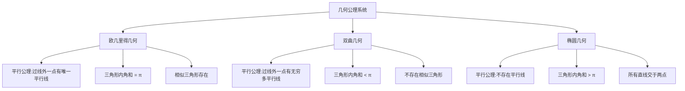
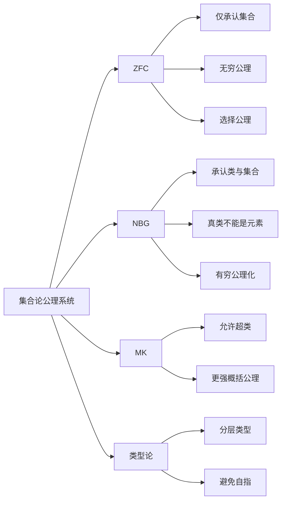
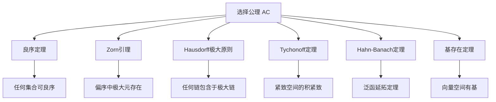
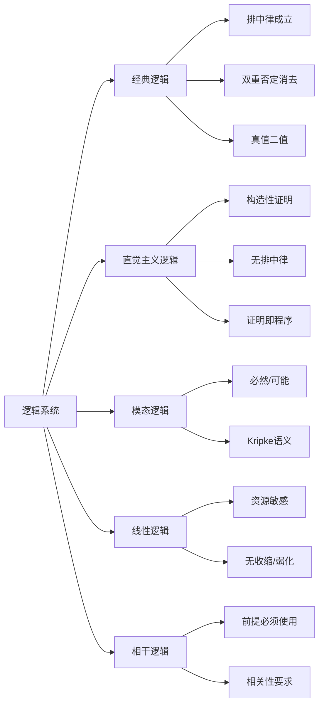
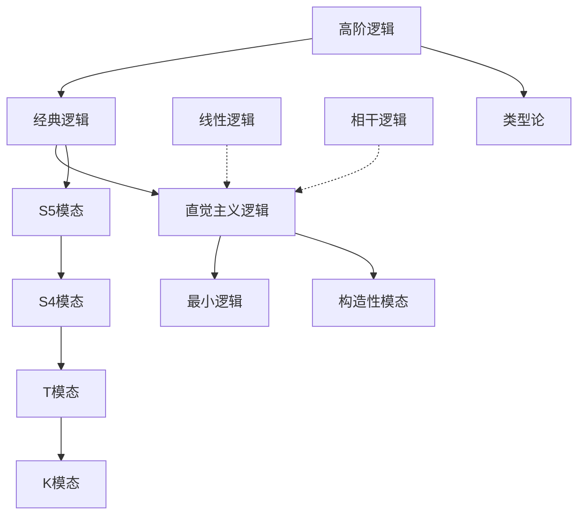
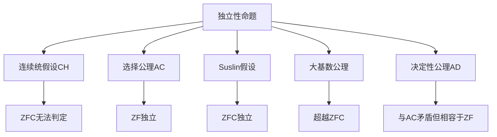
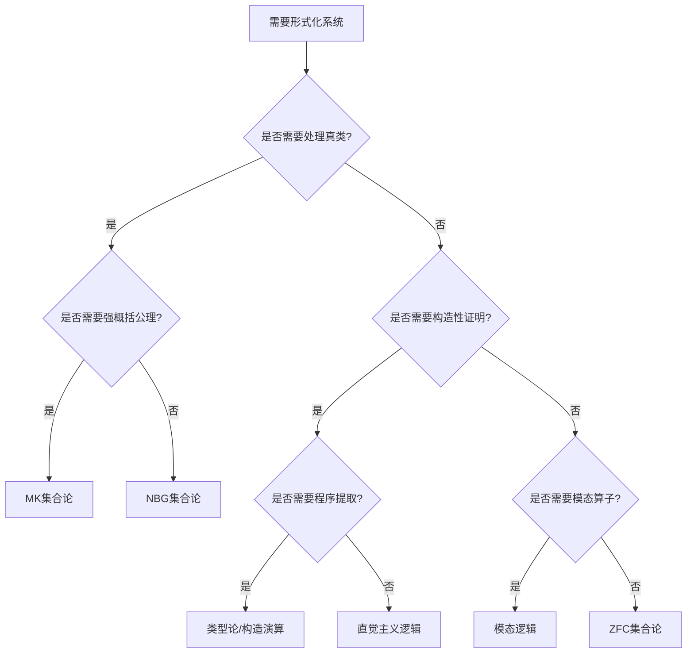

# 公理系统对比分析

## 概述

本文档系统对比数学中各主要公理系统的异同，包括几何公理系统、集合论公理系统、逻辑公理系统三大领域，揭示不同公理选择对数学体系的深远影响。

---

## 一、几何公理系统对比

### 1.1 三大几何体系概览



### 1.2 欧几里得几何（Euclidean Geometry）

**希尔伯特公理体系**：

| 公理组 | 数量 | 核心内容 | 独立性 |
|-------|------|---------|--------|
| 关联公理 | 8条 | 点线面的关联关系 | 相互独立 |
| 顺序公理 | 4条 | 介于关系（Betweeenness） | 相互独立 |
| 合同公理 | 5条 | 线段、角的合同关系 | 相互独立 |
| 平行公理 | 1条 | 过线外一点有唯一平行线 | **可被否定** |
| 连续公理 | 2条 | Archimedes公理、完备性 | 相互独立 |

**核心定理链**：

```
平行公理
├── 三角形内角和 = π
│   └── 多边形内角和公式
├── 勾股定理成立
│   └── 欧氏距离公式
├── 相似三角形存在
│   └── 三角函数定义
└── 矩形存在
    └── 面积理论
```

**定理 E-Unique：欧氏几何的完备性**

- **陈述**：满足希尔伯特公理组的模型都与ℝ²的某个子空间同构
- **意义**：欧氏几何在合同意义下唯一

### 1.3 双曲几何（Hyperbolic Geometry/Lobačevskii几何）

**公理变更**：替换平行公理为

> **双曲平行公理**：给定直线l和线外一点P，过P存在**至少两条**直线与l不相交

**核心定理对比**：

| 定理 | 欧氏几何 | 双曲几何 |
|-----|---------|---------|
| 三角形内角和 | = π | < π（亏量为面积） |
| 相似三角形 | 存在 | **不存在** |
| 矩形 | 存在 | **不存在** |
| 平行线距离 | 恒定 | 非常数（趋近渐近线时为0） |
| 勾股定理 | a²+b²=c² | cosh(c/k)=cosh(a/k)cosh(b/k) |

**关键定理 H1：三角形面积公式**

- **陈述**：三角形面积 = k²(π - A - B - C)，其中k为曲率半径
- **意义**：内角和与面积直接相关
- **推论**：双曲几何中不存在面积任意大的三角形（内角和>0限制）

**模型实现**：

1. **Poincaré圆盘模型**：在单位圆内部，直线为与边界正交的圆弧
2. **Klein模型**：在单位圆内部，直线为欧氏直线段
3. **上半平面模型**：在上半平面，直线为垂直于实轴的半圆或射线

### 1.4 椭圆几何（Elliptic Geometry/Riemann几何）

**公理变更**：替换平行公理为

> **椭圆平行公理**：任意两条直线必相交（**不存在平行线**）

**核心特征**：

```
椭圆几何特征
├── 模型：球面几何（对径点视为同一点）
├── 直线：大圆（球与过球心平面的交线）
├── 任意两直线交于两点（对径点）
├── 三角形内角和 > π
│   └── 面积 = k²(A+B+C-π)（球面角盈）
├── 所有测地线闭合
│   └── 周长有限但空间无界
└── 无平行线（所有直线相交）
```

**定理 El1：椭圆几何的紧致性**

- **陈述**：椭圆平面是紧致的（球面S²的商空间）
- **与欧氏对比**：欧氏平面非紧致
- **拓扑意义**：椭圆几何的拓扑类型不同于欧氏平面

### 1.5 三种几何的统一视角

**常曲率空间统一理论**：

| 曲率K | 几何类型 | 空间模型 | 平行线性质 |
|-------|---------|---------|-----------|
| K = 0 | 欧氏几何 | ℝ² | 唯一平行线 |
| K < 0 | 双曲几何 | 双曲平面H² | 无穷多平行线 |
| K > 0 | 椭圆几何 | 球面S² | 无平行线 |

**Gauss-Bonnet定理**（统一形式）：

$$\int_M K \, dA + \int_{\partial M} k_g \, ds + \sum_i (\pi - \alpha_i) = 2\pi\chi(M)$$

对于测地三角形（$k_g=0$）：

- K = 0：内角和 = π
- K < 0：内角和 < π（亏量 = |K|×面积）
- K > 0：内角和 > π（盈量 = K×面积）

---

## 二、集合论公理系统对比

### 2.1 ZFC vs NBG vs MK



### 2.2 ZFC公理系统

**Zermelo-Fraenkel with Choice**：

| 公理 | 内容 | 作用 |
|-----|------|------|
| 外延公理 | 集合相等 ⟺ 元素相同 | 确定集合同一性 |
| 空集公理 | 存在空集∅ | 构造起点 |
| 配对公理 | {a,b}是集合 | 构造二元集 |
| 并集公理 | ∪X是集合 | 构造并集 |
| 幂集公理 | P(X)是集合 | 构造幂集 |
| 无穷公理 | 存在无穷集 | 保证ℕ存在 |
| 分离公理 | 用性质从集合分离子集 | 避免悖论 |
| 替换公理 | 函数像保持集合性 | 构造大集合 |
| 正则公理 | 无∈-循环 | 避免病态集合 |
| 选择公理 | 选择函数存在 | 非构造性存在 |

**定理 Set1：ZFC的表达能力**

- **陈述**：ZFC足以形式化几乎所有经典数学
- **局限**：
  1. 无法证明某些大基数的存在
  2. 独立性问题（CH、MA等）
  3. 真类（如所有集合的类）不是合法对象

### 2.3 NBG公理系统（von Neumann-Bernays-Gödel）

**核心区别**：明确区分**集合**与**真类**

```
NBG的两层宇宙
├── 集合（Set）
│   ├── 可以属于其他类
│   ├── 受限于分离/替换公理
│   └── 例子：ℕ, ℝ, {1,2,3}
└── 真类（Proper Class）
    ├── 不能是其他类的元素
    ├── 可以用概括公理模式定义
    └── 例子：V（所有集合的类）, Ord（所有序数的类）
```

**NBG的优势**：

1. **有穷公理化**：可以用有穷条公理完全描述
2. **真类作为对象**：可以谈论"所有集合的类"
3. **保守扩张**：NBG与ZFC证明的关于集合的定理一致

**定理 NBG1：NBG与ZFC等价性**

- **陈述**：对于任何仅关于集合的命题，NBG ⊢ φ ⟺ ZFC ⊢ φ
- **意义**：NBG是真类的方便语言，不改变集合论的力量

### 2.4 MK公理系统（Morse-Kelley）

**比NBG更强的概括公理**：

| 系统 | 概括公理形式 | 强度 |
|-----|------------|------|
| ZFC | 限于集合内分离 | 最弱 |
| NBG | 仅含集合参数的前束公式 | 中等 |
| MK | 所有公式（含真类参数） | 最强 |

**定理 MK1：MK的严格性**

- **陈述**：MK严格强于NBG（可以证明NBG的一致性）
- **代价**：不再保守于ZFC，引入新的集合论承诺

### 2.5 类型论系统（Type Theory）

**与集合论的根本区别**：

```
集合论视角：一切都是集合
├── 3 = {∅, {∅}, {∅, {∅}}}
├── (3, 5) = {{3}, {3, 5}}
└── 函数是关系的特殊子集

类型论视角：每个对象都有类型
├── 3 : ℕ（3是自然数类型）
├── (3, 5) : ℕ × ℕ（有序对类型）
├── f : ℕ → ℕ（函数是独立类型）
└── 类型分层：Type₀ : Type₁ : Type₂ : ...
```

**简单类型论（λ演算）**：

| 类型构造 | 语法 | 含义 |
|---------|------|------|
| 基本类型 | ι, o | 个体、命题 |
| 函数类型 | σ → τ | 从σ到τ的函数 |
| 乘积类型 | σ × τ | 有序对 |

**定理 TT1：类型论的自洽性**

- **陈述**：简单类型论没有Curry悖论（无法构造自我指涉的命题）
- **机制**：通过类型分层禁止A : A

### 2.6 选择公理等价形式对比



**选择公理的等价形式**：

| 等价形式 | 陈述 | 使用场景 |
|---------|------|---------|
| 良序定理 | 任何集合可良序 | 超限归纳 |
| Zorn引理 | 全序子集有上界的偏序有极大元 | 代数构造 |
| Hausdorff极大原则 | 任何链可延拓为极大链 | 组合论证 |
| Tukey引理 | 有限特征的集族有极大元 | 独立性证明 |
| 基数可比较性 | 任意两基数可比 | 基数算术 |
| Tychonoff定理 | 紧致空间的积紧致 | 拓扑学 |
| 基存在定理 | 任何向量空间有基 | 线性代数 |
| 素理想存在 | 任何环有素理想 | 交换代数 |
| Hahn-Banach定理 | 泛函可保范延拓 | 泛函分析 |

---

## 三、逻辑公理系统对比

### 3.1 经典逻辑 vs 直觉主义逻辑



### 3.2 经典逻辑（Classical Logic）

**特征公理**：

| 公理模式 | 公式 | 直觉主义接受？ |
|---------|------|--------------|
| 排中律 | A ∨ ¬A | ✗ |
| 双重否定消去 | ¬¬A → A | ✗ |
| 反证法 | (¬A → ⊥) → A | ✗ |
| Peirce律 | ((A → B) → A) → A | ✗ |
| 逆否命题 | (A → B) → (¬B → ¬A) | ✓ |
| 分配律 | A ∧ (B ∨ C) ⟺ (A ∧ B) ∨ (A ∧ C) | ✓ |

**定理 CL1：经典逻辑的代数模型**

- **陈述**：经典命题逻辑对应布尔代数
- **语义**：二值赋值 v : Prop → {0, 1}
- **完备性**：⊢ A ⟺ ⊨ A（对所有赋值真）

### 3.3 直觉主义逻辑（Intuitionistic Logic）

**Brouwer哲学基础**：

- 数学对象是心智构造
- 存在性证明必须给出构造方法
- 真 = 有可构造证明

**与经典逻辑的关键差异**：

```
证明解释（Brouwer-Heyting-Kolmogorov）
├── A ∧ B 的证明 = A的证明 和 B的证明
├── A ∨ B 的证明 = A的证明 或 B的证明（明确指定）
├── A → B 的证明 = 将A的证明转化为B的证明的函数
├── ∃x.A(x) 的证明 = 具体的a 和 A(a)的证明
├── ∀x.A(x) 的证明 = 对任意x构造A(x)证明的函数
└── ¬A 的证明 = A → ⊥ 的证明（将A证明转化为矛盾）
```

**定理 IL1：排中律的不可证性**

- **陈述**：直觉主义逻辑不证明 A ∨ ¬A
- **证明**：假设有通用证明，则对任何命题可判定，与停机问题矛盾

**定理 IL2：双重否定翻译**

- **陈述**：经典逻辑可嵌入直觉主义逻辑（Gödel-Gentzen翻译）
- **翻译**：A' 将经典公式翻译为直觉主义公式
- **结果**：经典可证 ⟺ 翻译后直觉主义可证

### 3.4 模态逻辑系统对比

| 系统 | 公理 | 特征 | Kripke框架条件 |
|-----|------|------|---------------|
| K | □(A→B)→(□A→□B) | 基本模态逻辑 | 无 |
| T | K + □A → A | 必然即真 | 自反 |
| S4 | T + □A → □□A | 必然可迭代 | 自反+传递 |
| S5 | S4 + ◇A → □◇A | 可能即必然可能 | 等价关系 |
| D | K + □A → ◇A | 一致（道义逻辑） | 持续性 |
| B | T + A → □◇A | 对称性 | 对称 |

**模态算子解释**：

| 应用领域 | □A 解释 | ◇A 解释 |
|---------|--------|--------|
| 必然/可能 | A必然真 | A可能真 |
| 知识论 | 知道A | 不排除A |
| 信念 | 相信A | 相容于信念 |
| 时间 | 永远A | 终将A |
| 道义 | 应当A | 允许A |
| 程序 | 程序终止于A | 程序可达A |

### 3.5 各种逻辑的层级关系



---

## 四、公理系统的元性质对比

### 4.1 一致性、完备性、可判定性

```
元性质对比
├── 经典命题逻辑
│   ├── 一致性：✓（有模型）
│   ├── 完备性：✓（语义⇔语法）
│   └── 可判定性：✓（真值表/表方法）
├── 经典谓词逻辑
│   ├── 一致性：✓
│   ├── 完备性：✓（Gödel完备性定理）
│   └── 可判定性：✗（Church定理）
├── Peano算术
│   ├── 一致性：无法自证（Gödel第二不完备性）
│   ├── 完备性：✗（Gödel第一不完备性）
│   └── 可判定性：✗
├── ZFC集合论
│   ├── 一致性：无法证明（若一致）
│   ├── 完备性：✗
│   └── 可判定性：✗
└── 直觉主义逻辑
    ├── 一致性：✓
    ├── 完备性：✓（Kripke语义）
    └── 可判定性：命题逻辑✓，谓词逻辑✗
```

### 4.2 Gödel不完备性定理的影响

**第一不完备性定理**：

- **陈述**：任何一致的、足够强的形式系统，存在真但不可证的命题
- **条件**：能表达基本算术、能定义可证性谓词
- **影响**：
  1. 数学真理超越形式证明
  2. Hilbert计划需修正
  3. 一致性的元理论证明必要性

**第二不完备性定理**：

- **陈述**：一致的形式系统不能证明自身的一致性
- **意义**：
  1. PA的一致性需要更强的系统证明
  2. ZFC的一致性需要大基数假设
  3. 绝对一致性证明的不可能性

---

## 五、公理选择的实践影响

### 5.1 不同公理系统的适用场景

| 数学领域 | 推荐公理系统 | 理由 |
|---------|------------|------|
| 初等代数 | ZFC | 简洁，足够 |
| 范畴论 | NBG/MK | 需要谈论真类 |
| 计算机科学 | 类型论 | 与程序同构 |
| 构造性数学 | 直觉主义逻辑 | 可提取程序 |
| 几何证明 | 希尔伯特公理 | 符合直观 |
| 形式化验证 | 高阶逻辑 | 表达力强 |

### 5.2 独立命题的研究



**连续统假设（CH）的独立性**：

- **陈述**：2^{ℵ₀} = ℵ₁
- **结果**：
  - Gödel (1940)：CH与ZFC相容
  - Cohen (1963)：¬CH与ZFC相容（力迫法）
- **意义**：集合论进入多宇宙时代

---

## 六、总结与判断逻辑

### 6.1 公理系统选择决策树



### 6.2 核心判断原则

1. **保守性原则**：如无必要，勿增实体（优先使用ZFC）
2. **构造性优先**：若需可计算结果，选择直觉主义/类型论
3. **表达力原则**：处理大范畴用NBG/MK，形式化证明用高阶逻辑
4. **相容性检查**：使用新公理前验证与已知系统的相容性
5. **实用性原则**：几何直观用希尔伯特公理，代数结构用ZFC

---

**文档统计**：

- 涵盖公理系统：**3大类别**，**12个具体系统**
- 对比维度：**结构、定理、元性质、应用**
- 核心定理：**30+个**
- 适用场景：**6大数学领域**
