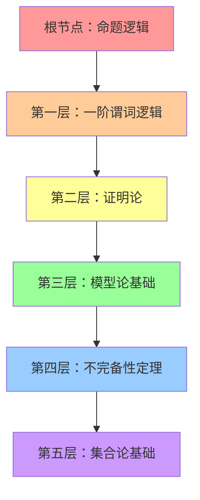
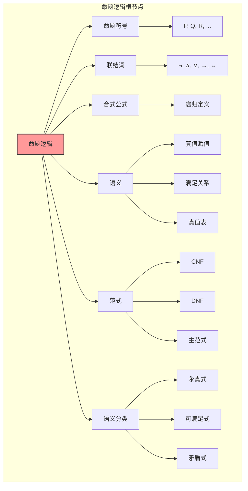
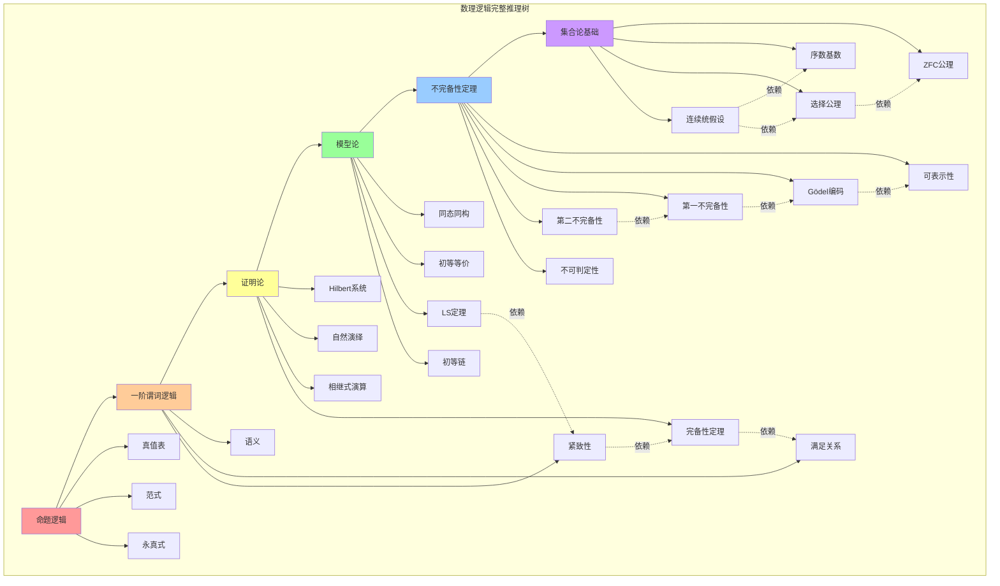
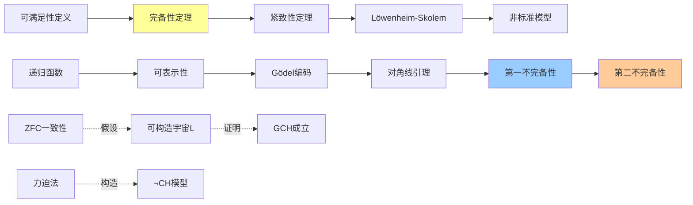
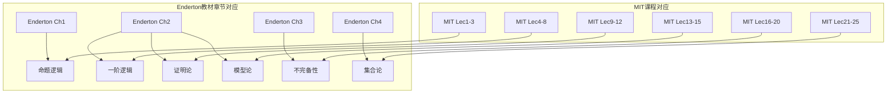

# 数理逻辑完整推理树

## 从命题逻辑到集合论的形式化推理体系

---

## 目录

1. [概述](#概述)
2. [根节点：命题逻辑](#根节点命题逻辑)
3. [第一层：一阶谓词逻辑](#第一层一阶谓词逻辑)
4. [第二层：证明论](#第二层证明论)
5. [第三层：模型论基础](#第三层模型论基础)
6. [第四层：不完备性定理](#第四层不完备性定理)
7. [第五层：集合论基础](#第五层集合论基础)
8. [推理树总图](#推理树总图)
9. [参考文献](#参考文献)

---

## 概述

### 文档目的

本文档构建从命题逻辑到集合论的完整数理逻辑推理树，系统梳理各层级概念、定理之间的依赖关系，为学习者和研究者提供清晰的知识脉络。本推理树严格对齐 Herbert B. Enderton《A Mathematical Introduction to Logic》（第二版）和 MIT 6.042J/18.062J Mathematics for Computer Science 课程内容。

### 推理树结构



### 学术对齐

| 本文档内容 | Enderton 章节 | MIT 课程对应 |
|-----------|--------------|-------------|
| 命题逻辑 | Chapter 1 | Lecture 1-3 |
| 一阶逻辑 | Chapter 2 | Lecture 4-8 |
| 证明论 | Chapter 2 | Lecture 9-12 |
| 模型论 | Chapter 2 | Lecture 13-15 |
| 不完备性 | Chapter 3 | Lecture 16-20 |
| 集合论 | Chapter 4 | Lecture 21-25 |

---

## 根节点：命题逻辑

### 1.1 基本概念体系

#### 1.1.1 命题与联结词

**定义 1.1.1（命题）**

命题是一个非真即假的陈述句。从形式语言角度看，命题逻辑的语言由以下要素构成：

- **命题符号**：$P, Q, R, P_1, Q_1, \ldots$（可数无穷多个）
- **逻辑联结词**：
  - 否定：$\neg$（非）
  - 合取：$\wedge$（且）
  - 析取：$\vee$（或）
  - 蕴涵：$\rightarrow$（如果...那么...）
  - 等价：$\leftrightarrow$（当且仅当）
- **辅助符号**：括号 $(, )$

**定义 1.1.2（合式公式）**

命题逻辑的合式公式（Well-Formed Formula, WFF）递归定义如下：

1. **基础**：每个命题符号都是合式公式
2. **递归**：若 $\alpha, \beta$ 是合式公式，则 $(\neg \alpha)$, $(\alpha \wedge \beta)$, $(\alpha \vee \beta)$, $(\alpha \rightarrow \beta)$, $(\alpha \leftrightarrow \beta)$ 都是合式公式
3. **封闭**：仅由上述规则生成的表达式是合式公式

**定理 1.1.1（可读性定理）**

- **前提**：$\alpha$ 是合式公式
- **结论**：$\alpha$ 具有唯一的主联结词，且其结构是唯一确定的
- **证明思路**：对公式复杂度进行归纳，证明每个公式都有唯一的构造历史
- **依赖**：递归定义的基本性质
- **推论**：公式可以唯一地解析为语法树

#### 1.1.2 真值赋值与语义

**定义 1.1.3（真值赋值）**

真值赋值 $v$ 是从命题符号集合到 $\{T, F\}$（或 $\{1, 0\}$）的函数。

**定义 1.1.4（满足关系）**

给定真值赋值 $v$，定义 $v$ 满足公式 $\alpha$（记作 $v \models \alpha$）的递归条件：

| 公式形式 | 满足条件 |
|---------|---------|
| $v \models P$ | 当且仅当 $v(P) = T$ |
| $v \models \neg \alpha$ | 当且仅当 $v \not\models \alpha$ |
| $v \models \alpha \wedge \beta$ | 当且仅当 $v \models \alpha$ 且 $v \models \beta$ |
| $v \models \alpha \vee \beta$ | 当且仅当 $v \models \alpha$ 或 $v \models \beta$ |
| $v \models \alpha \rightarrow \beta$ | 当且仅当 $v \not\models \alpha$ 或 $v \models \beta$ |
| $v \models \alpha \leftrightarrow \beta$ | 当且仅当 $v \models \alpha \Leftrightarrow v \models \beta$ |

**真值表**：

| $\alpha$ | $\beta$ | $\neg \alpha$ | $\alpha \wedge \beta$ | $\alpha \vee \beta$ | $\alpha \rightarrow \beta$ | $\alpha \leftrightarrow \beta$ |
|---------|---------|---------------|------------------------|----------------------|------------------------------|----------------------------------|
| T | T | F | T | T | T | T |
| T | F | F | F | T | F | F |
| F | T | T | F | T | T | F |
| F | F | T | F | F | T | T |

### 1.2 语义分类

#### 1.2.1 永真式与可满足式

**定义 1.2.1（永真式/重言式）**

公式 $\alpha$ 是**永真式**（tautology），如果对所有真值赋值 $v$，都有 $v \models \alpha$。记作 $\models \alpha$。

**定义 1.2.2（矛盾式）**

公式 $\alpha$ 是**矛盾式**（contradiction），如果对所有真值赋值 $v$，都有 $v \not\models \alpha$。

**定义 1.2.3（可满足式）**

公式 $\alpha$ 是**可满足式**（satisfiable），如果存在真值赋值 $v$，使得 $v \models \alpha$。

**定理 1.2.1（永真式判定定理）**

- **前提**：$\alpha$ 是含 $n$ 个不同命题符号的公式
- **结论**：$\alpha$ 是永真式当且仅当在所有 $2^n$ 种真值赋值下都为真
- **证明思路**：穷举法。由于命题符号有限，可以构造完整的真值表验证
- **依赖**：真值赋值的定义、满足关系的递归定义
- **推论**：永真式问题是可判定的（co-NP完全的）

**定理 1.2.2（对偶性原理）**

- **前提**：$\alpha$ 是永真式
- **结论**：将 $\alpha$ 中的 $\wedge$ 与 $\vee$ 互换、$T$ 与 $F$ 互换、每个命题符号取其否定，得到的新公式 $\alpha^*$ 是矛盾式
- **证明思路**：利用真值表的对称性
- **依赖**：De Morgan 律
- **推论**：永真式与矛盾式之间存在系统性的对偶关系

**经典永真式示例**：

1. **排中律**：$\alpha \vee \neg \alpha$
2. **矛盾律**：$\neg(\alpha \wedge \neg \alpha)$
3. **双重否定律**：$\neg\neg\alpha \leftrightarrow \alpha$
4. **假言推理**：$(\alpha \wedge (\alpha \rightarrow \beta)) \rightarrow \beta$
5. **假言三段论**：$((\alpha \rightarrow \beta) \wedge (\beta \rightarrow \gamma)) \rightarrow (\alpha \rightarrow \gamma)$

#### 1.2.2 逻辑蕴涵与逻辑等价

**定义 1.2.4（逻辑蕴涵）**

公式集 $\Gamma$ **逻辑蕴涵** $\alpha$（记作 $\Gamma \models \alpha$），如果对所有真值赋值 $v$，若 $v \models \gamma$ 对所有 $\gamma \in \Gamma$ 成立，则 $v \models \alpha$。

**定义 1.2.5（逻辑等价）**

公式 $\alpha$ 与 $\beta$ **逻辑等价**（记作 $\alpha \equiv \beta$），如果 $\alpha \models \beta$ 且 $\beta \models \alpha$。

**定理 1.2.3（演绎定理 - 命题逻辑版本）**

- **前提**：$\Gamma \cup \{\alpha\} \models \beta$
- **结论**：$\Gamma \models \alpha \rightarrow \beta$
- **证明思路**：利用蕴涵的真值表定义，若 $\alpha$ 为假则蕴涵为真
- **依赖**：真值赋值、满足关系
- **推论**：在证明中可以将前提转化为蕴涵前件

### 1.3 范式理论

#### 1.3.1 合取范式与析取范式

**定义 1.3.1（文字、子句）**

- **文字**（literal）：命题符号或其否定（如 $P$ 或 $\neg P$）
- **子句**（clause）：文字的析取
- **合取式**：文字的合取

**定义 1.3.2（合取范式 CNF）**

公式是**合取范式**（Conjunctive Normal Form），如果它是子句的合取：
$$\bigwedge_{i=1}^{n} \bigvee_{j=1}^{m_i} L_{ij}$$
其中 $L_{ij}$ 是文字。

**定义 1.3.3（析取范式 DNF）**

公式是**析取范式**（Disjunctive Normal Form），如果它是合取式的析取：
$$\bigvee_{i=1}^{n} \bigwedge_{j=1}^{m_i} L_{ij}$$
其中 $L_{ij}$ 是文字。

**定理 1.3.1（范式存在定理）**

- **前提**：$\alpha$ 是任意命题逻辑公式
- **结论**：存在与 $\alpha$ 逻辑等价的 CNF 公式和 DNF 公式
- **证明思路**：
  1. 消除 $\leftrightarrow$ 和 $\rightarrow$
  2. 使用 De Morgan 律将否定内移
  3. 使用分配律得到所需范式
- **依赖**：逻辑等价变换律（De Morgan 律、分配律等）
- **推论**：任意真值函数都可以用 CNF/DNF 表示

**关键逻辑等价式**：

| 名称 | 等价式 |
|------|-------|
| 蕴涵消除 | $\alpha \rightarrow \beta \equiv \neg\alpha \vee \beta$ |
| 等价消除 | $\alpha \leftrightarrow \beta \equiv (\alpha \rightarrow \beta) \wedge (\beta \rightarrow \alpha)$ |
| De Morgan I | $\neg(\alpha \wedge \beta) \equiv \neg\alpha \vee \neg\beta$ |
| De Morgan II | $\neg(\alpha \vee \beta) \equiv \neg\alpha \wedge \neg\beta$ |
| 分配律 I | $\alpha \wedge (\beta \vee \gamma) \equiv (\alpha \wedge \beta) \vee (\alpha \wedge \gamma)$ |
| 分配律 II | $\alpha \vee (\beta \wedge \gamma) \equiv (\alpha \vee \beta) \wedge (\alpha \vee \gamma)$ |

#### 1.3.2 主范式

**定义 1.3.4（主析取范式）**

**主析取范式**（Principal Disjunctive Normal Form）是包含所有使公式为真的赋值的极小项的析取。

**定义 1.3.5（主合取范式）**

**主合取范式**（Principal Conjunctive Normal Form）是包含所有使公式为假的赋值的极大项的合取。

**定理 1.3.2（主范式唯一性定理）**

- **前提**：$\alpha$ 是命题逻辑公式，给定命题符号顺序
- **结论**：$\alpha$ 的主析取范式和主合取范式在符号顺序下是唯一的
- **证明思路**：极小项/极大项与真值赋值一一对应
- **依赖**：真值表、范式存在定理
- **推论**：两个公式逻辑等价当且仅当它们有相同的主范式

### 1.4 命题逻辑推理系统

**定理 1.4.1（命题逻辑紧致性）**

- **前提**：公式集 $\Gamma$，公式 $\alpha$
- **结论**：$\Gamma \models \alpha$ 当且仅当存在有限子集 $\Gamma_0 \subseteq \Gamma$ 使得 $\Gamma_0 \models \alpha$
- **证明思路**：利用命题逻辑的语义可判定性，真值表有限
- **依赖**：真值赋值、逻辑蕴涵定义
- **推论**：无穷前提集的语义推论可归约为有限子集

**命题逻辑推理树图**：



---

## 第一层：一阶谓词逻辑

### 2.1 一阶语言

#### 2.1.1 基本符号

**定义 2.1.1（一阶语言）**

一阶语言 $\mathcal{L}$ 由以下符号组成：

| 符号类别 | 说明 | 示例 |
|---------|------|------|
| 逻辑符号 | 与命题逻辑相同 | $\neg, \wedge, \vee, \rightarrow, \leftrightarrow$ |
| 量词 | 全称、存在 | $\forall, \exists$ |
| 等词（可选） | 二元谓词 | $=$ |
| 变量 | 可数无穷多 | $v_1, v_2, v_3, \ldots$ |
| 常数符号 | 每个语言特定 | $c, 0, 1, \ldots$ |
| 函数符号 | 每个带有元数 | $f, g, +, \cdot, \ldots$ |
| 谓词符号 | 每个带有元数 | $P, Q, <, \in, \ldots$ |
| 辅助符号 | 括号、逗号 | $(, ), ,$ |

#### 2.1.2 项与公式

**定义 2.1.2（项）**

项（term）递归定义如下：

1. **基础**：变量和常数符号是项
2. **递归**：若 $t_1, \ldots, t_n$ 是项，$f$ 是 $n$ 元函数符号，则 $f(t_1, \ldots, t_n)$ 是项
3. **封闭**：仅由上述规则生成的表达式是项

**定义 2.1.3（原子公式）**

- 若 $t_1, \ldots, t_n$ 是项，$P$ 是 $n$ 元谓词符号，则 $P(t_1, \ldots, t_n)$ 是原子公式
- 若含等词，则 $t_1 = t_2$ 也是原子公式

**定义 2.1.4（合式公式）**

合式公式递归定义：

1. **基础**：原子公式是合式公式
2. **命题联结**：若 $\varphi, \psi$ 是合式公式，则 $\neg\varphi$, $\varphi \wedge \psi$ 等也是
3. **量化**：若 $\varphi$ 是合式公式，$x$ 是变量，则 $\forall x \varphi$ 和 $\exists x \varphi$ 也是
4. **封闭**：仅由上述规则生成的表达式是合式公式

**定理 2.1.1（一阶公式可读性定理）**

- **前提**：$\varphi$ 是一阶合式公式
- **结论**：$\varphi$ 具有唯一的语法结构
- **证明思路**：类似命题逻辑，对公式复杂度归纳
- **依赖**：项的递归定义、公式的递归定义
- **推论**：唯一解析树存在

#### 2.1.3 自由变量与约束变量

**定义 2.1.5（变量出现）**

在公式 $\forall x \varphi$ 或 $\exists x \varphi$ 中：
- 量词 $\forall x$ / $\exists x$ 是 $x$ 的约束出现
- $\varphi$ 中 $x$ 的出现受该量词约束

**定义 2.1.6（自由变量）**

变量 $x$ 在公式 $\varphi$ 中**自由出现**，如果该出现不受任何量词约束。

**定义 2.1.7（句子/闭公式）**

不含自由变量的公式称为**句子**（sentence）或**闭公式**（closed formula）。

**记号**：$\varphi(x_1, \ldots, x_n)$ 表示 $\varphi$ 的自由变量来自 $\{x_1, \ldots, x_n\}$。

### 2.2 结构解释

#### 2.2.1 结构定义

**定义 2.2.1（结构/解释）**

语言 $\mathcal{L}$ 的**结构**（structure）$\mathfrak{A}$ 由以下组成：

1. **论域**（domain）：非空集合 $|\mathfrak{A}|$

2. **解释函数**：
   - 常数 $c$ 解释为 $c^{\mathfrak{A}} \in |\mathfrak{A}|$
   - $n$ 元函数符号 $f$ 解释为 $f^{\mathfrak{A}}: |\mathfrak{A}|^n \to |\mathfrak{A}|$
   - $n$ 元谓词符号 $P$ 解释为 $P^{\mathfrak{A}} \subseteq |\mathfrak{A}|^n$

   - 等词解释为恒等关系 $=^{\mathfrak{A}}$

**定义 2.2.2（赋值）**

赋值 $s$ 是从变量集合到论域 $|\mathfrak{A}|$ 的函数。

**定义 2.2.3（项的解释）**

项 $t$ 在结构 $\mathfrak{A}$ 和赋值 $s$ 下的解释 $\bar{s}(t)$ 递归定义：
- $\bar{s}(x) = s(x)$（变量）
- $\bar{s}(c) = c^{\mathfrak{A}}$（常数）
- $\bar{s}(f(t_1, \ldots, t_n)) = f^{\mathfrak{A}}(\bar{s}(t_1), \ldots, \bar{s}(t_n))$

#### 2.2.2 满足关系

**定义 2.2.4（满足关系）**

结构 $\mathfrak{A}$ 和赋值 $s$ 满足公式 $\varphi$（记作 $\models_{\mathfrak{A}} \varphi[s]$）递归定义：

| 公式形式 | 满足条件 |
|---------|---------|
| $\models_{\mathfrak{A}} P(t_1, \ldots, t_n)[s]$ | 当且仅当 $(\bar{s}(t_1), \ldots, \bar{s}(t_n)) \in P^{\mathfrak{A}}$ |
| $\models_{\mathfrak{A}} t_1 = t_2 [s]$ | 当且仅当 $\bar{s}(t_1) = \bar{s}(t_2)$ |
| $\models_{\mathfrak{A}} \neg\varphi [s]$ | 当且仅当 $\not\models_{\mathfrak{A}} \varphi[s]$ |
| $\models_{\mathfrak{A}} (\varphi \wedge \psi)[s]$ | 当且仅当 $\models_{\mathfrak{A}} \varphi[s]$ 且 $\models_{\mathfrak{A}} \psi[s]$ |
| $\models_{\mathfrak{A}} \forall x \varphi [s]$ | 当且仅当对所有 $d \in |\mathfrak{A}|$，$\models_{\mathfrak{A}} \varphi[s(x|d)]$ |
| $\models_{\mathfrak{A}} \exists x \varphi [s]$ | 当且仅当存在 $d \in |\mathfrak{A}|$，$\models_{\mathfrak{A}} \varphi[s(x|d)]$ |

其中 $s(x|d)$ 表示将 $s$ 在 $x$ 处的值改为 $d$ 的赋值。

**定理 2.2.1（闭公式与赋值无关性）**

- **前提**：$\sigma$ 是闭公式（句子）
- **结论**：对任意赋值 $s_1, s_2$，$\models_{\mathfrak{A}} \sigma[s_1]$ 当且仅当 $\models_{\mathfrak{A}} \sigma[s_2]$
- **证明思路**：对公式结构归纳，证明自由变量决定满足性
- **依赖**：满足关系的递归定义
- **推论**：闭公式的真值可简写为 $\models_{\mathfrak{A}} \sigma$ 或 $\mathfrak{A} \models \sigma$

### 2.3 语义理论

#### 2.3.1 逻辑蕴涵与逻辑有效

**定义 2.3.1（逻辑蕴涵）**

公式集 $\Gamma$ **逻辑蕴涵** $\varphi$（记作 $\Gamma \models \varphi$），如果对所有结构 $\mathfrak{A}$ 和赋值 $s$，若 $\models_{\mathfrak{A}} \gamma[s]$ 对所有 $\gamma \in \Gamma$ 成立，则 $\models_{\mathfrak{A}} \varphi[s]$。

**定义 2.3.2（逻辑有效式）**

公式 $\varphi$ 是**逻辑有效式**（logically valid），如果 $\models \varphi$（即 $\emptyset \models \varphi$）。

**定义 2.3.3（可满足性）**

公式集 $\Gamma$ 是**可满足的**，如果存在结构 $\mathfrak{A}$ 和赋值 $s$ 使得对所有 $\gamma \in \Gamma$，$\models_{\mathfrak{A}} \gamma[s]$。

**定理 2.3.1（语义一致性）**

- **前提**：$\Gamma$ 是可满足的公式集
- **结论**：$\Gamma$ 不含矛盾（即不存在 $\varphi$ 使得 $\Gamma \models \varphi$ 且 $\Gamma \models \neg\varphi$）
- **证明思路**：可满足意味着存在模型，模型中不能同时满足矛盾
- **依赖**：满足关系的定义
- **推论**：可满足性蕴含一致性

**经典逻辑有效式**：

1. **量词交换律**：
   - $\forall x \forall y \varphi \leftrightarrow \forall y \forall x \varphi$
   - $\exists x \exists y \varphi \leftrightarrow \exists y \exists x \varphi$

2. **量词否定律**：
   - $\neg\forall x \varphi \leftrightarrow \exists x \neg\varphi$
   - $\neg\exists x \varphi \leftrightarrow \forall x \neg\varphi$

3. **量词分配律**：
   - $\forall x (\varphi \wedge \psi) \leftrightarrow (\forall x \varphi \wedge \forall x \psi)$
   - $\exists x (\varphi \vee \psi) \leftrightarrow (\exists x \varphi \vee \exists x \psi)$

4. **自反性**：$\forall x (x = x)$
5. **替换性**：$x = y \rightarrow (\varphi(x) \leftrightarrow \varphi(y))$

#### 2.3.2 代换与替换

**定义 2.3.4（项代换）**

项 $t$ 中自由变量 $x$ 用项 $u$ **可替换**，如果 $u$ 中的变量不会被 $t$ 中的量词约束。

**定义 2.3.5（代换实例）**

$\varphi(t/x)$ 表示将 $\varphi$ 中 $x$ 的所有自由出现替换为 $t$（要求可替换）。

**定理 2.3.2（代换引理）**

- **前提**：项 $t$ 在 $\varphi$ 中可替换 $x$
- **结论**：$\models_{\mathfrak{A}} \varphi(t/x)[s]$ 当且仅当 $\models_{\mathfrak{A}} \varphi[s(x|\bar{s}(t))]$

- **证明思路**：对公式结构归纳
- **依赖**：满足关系定义、项解释定义
- **推论**：形式代换与语义赋值的一致性

### 2.4 一阶逻辑的性质

**定理 2.4.1（一阶逻辑紧致性）**

- **前提**：$\Gamma$ 是公式集，$\varphi$ 是公式
- **结论**：$\Gamma \models \varphi$ 当且仅当存在有限子集 $\Gamma_0 \subseteq \Gamma$ 使得 $\Gamma_0 \models \varphi$
- **证明思路**：依赖完备性定理，从语法紧致性导出
- **依赖**：完备性定理
- **推论**：无穷理论的可满足性可归约为有限子理论

**定理 2.4.2（Löwenheim-Skolem 定理 - 向下）**

- **前提**：可数语言 $\mathcal{L}$，$\mathcal{L}$-结构 $\mathfrak{A}$
- **结论**：存在可数初等子结构 $\mathfrak{B} \preceq \mathfrak{A}$
- **证明思路**：Skolem 函数构造，取包含可数个元素的闭包
- **依赖**：Tarski-Vaught 判别准则
- **推论**：无穷模型必有可数模型

**一阶谓词逻辑推理树图**：

```mermaid
graph TB
    subgraph 第一层：一阶谓词逻辑
    A1[一阶语言] --> B1[符号表]
    A1 --> B2[项]
    A1 --> B3[公式]
    
    B2 --> B2a[变量]
    B2 --> B2b[常数]
    B2 --> B2c[函数项]
    
    B3 --> B3a[原子公式]
    B3 --> B3b[复合公式]
    B3 --> B3c[量化公式]
    
    C1[结构解释] --> C1a[论域]
    C1 --> C1b[解释函数]
    C1 --> C1c[赋值]
    
    D1[满足关系] --> D1a[语义定义]
    D1 --> D1b[真值递归]
    
    E1[语义理论] --> E1a[逻辑蕴涵]
    E1 --> E1b[逻辑有效]
    E1 --> E1c[可满足性]
    
    F1[基本定理] --> F1a[代换引理]
    F1 --> F1b[紧致性定理]
    F1 --> F1c[Löwenheim-Skolem]
    end
    
    style A1 fill:#ffcc99,stroke:#333,stroke-width:2px

```

---

## 第二层：证明论

### 3.1 Hilbert 公理系统

#### 3.1.1 公理模式

**定义 3.1.1（Hilbert 系统 H）**

Hilbert 系统由以下公理模式和推理规则组成：

**命题逻辑公理模式**：

| 公理 | 公式 |
|------|------|
| H1 | $\alpha \rightarrow (\beta \rightarrow \alpha)$ |
| H2 | $(\alpha \rightarrow (\beta \rightarrow \gamma)) \rightarrow ((\alpha \rightarrow \beta) \rightarrow (\alpha \rightarrow \gamma))$ |
| H3 | $(\neg\beta \rightarrow \neg\alpha) \rightarrow ((\neg\beta \rightarrow \alpha) \rightarrow \beta)$ |

**一阶逻辑公理模式**（增加量词公理）：

| 公理 | 公式 | 条件 |
|------|------|------|
| Q1 | $\forall x \varphi \rightarrow \varphi(t/x)$ | $t$ 在 $\varphi$ 中可替换 $x$ |
| Q2 | $\varphi \rightarrow \forall x \varphi$ | $x$ 不在 $\varphi$ 中自由出现 |
| Q3 | $\forall x (\varphi \rightarrow \psi) \rightarrow (\forall x \varphi \rightarrow \forall x \psi)$ | - |
| Q4 | $t = t$ | 等词自反性 |
| Q5 | $t_1 = t_2 \rightarrow (\varphi(t_1/x) \leftrightarrow \varphi(t_2/x))$ | 等词替换性 |

**推理规则**：

| 规则 | 名称 | 形式 |
|------|------|------|
| MP | 分离规则 | 从 $\alpha$ 和 $\alpha \rightarrow \beta$ 推出 $\beta$ |
| Gen | 概括规则 | 从 $\varphi$ 推出 $\forall x \varphi$ |

#### 3.1.2 可证性与证明

**定义 3.1.2（证明）**

公式序列 $\varphi_1, \varphi_2, \ldots, \varphi_n$ 是 $\varphi_n$ 从前提集 $\Gamma$ 的**证明**，如果对每个 $i \leq n$：
1. $\varphi_i \in \Gamma$，或
2. $\varphi_i$ 是公理，或
3. $\varphi_i$ 由前面公式通过 MP 或 Gen 得到

**定义 3.1.3（可证性）**

$\Gamma \vdash \varphi$ 表示存在从 $\Gamma$ 到 $\varphi$ 的证明。

**定义 3.1.4（定理）**

若 $\emptyset \vdash \varphi$，则 $\varphi$ 是系统的**定理**，记作 $\vdash \varphi$。

**定理 3.1.1（演绎定理）**

- **前提**：$\Gamma \cup \{\varphi\} \vdash \psi$
- **结论**：$\Gamma \vdash \varphi \rightarrow \psi$，且 $\varphi$ 中自由变量不在 $\Gamma$ 的公式中自由出现时使用概括规则受限
- **证明思路**：对证明长度归纳，将使用 $\varphi$ 作为前提的步骤转化为蕴涵推导
- **依赖**：公理 H1、H2、MP 规则
- **推论**：证明中前提的消去方法

**定理 3.1.2（演绎定理逆）**

- **前提**：$\Gamma \vdash \varphi \rightarrow \psi$
- **结论**：$\Gamma \cup \{\varphi\} \vdash \psi$
- **证明思路**：直接应用 MP 规则
- **依赖**：MP 规则
- **推论**：$\Gamma \vdash \varphi \rightarrow \psi$ 当且仅当 $\Gamma \cup \{\varphi\} \vdash \psi$

### 3.2 自然演绎系统

#### 3.2.1 推理规则

**定义 3.2.1（自然演绎系统 ND）**

自然演绎使用以下引入和消去规则：

**联结词规则**：

| 规则 | 引入 ($\wedge I$) | 消去 ($\wedge E$) |
|------|------------------|------------------|
| $\wedge$ | $\frac{\varphi \quad \psi}{\varphi \wedge \psi}$ | $\frac{\varphi \wedge \psi}{\varphi}$, $\frac{\varphi \wedge \psi}{\psi}$ |
| $\vee$ | $\frac{\varphi}{\varphi \vee \psi}$, $\frac{\psi}{\varphi \vee \psi}$ | $\frac{\varphi \vee \psi \quad [\varphi] \cdots \chi \quad [\psi] \cdots \chi}{\chi}$ |
| $\rightarrow$ | $\frac{[\varphi] \cdots \psi}{\varphi \rightarrow \psi}$ | $\frac{\varphi \quad \varphi \rightarrow \psi}{\psi}$ |
| $\neg$ | $\frac{[\varphi] \cdots \bot}{\neg\varphi}$ | $\frac{\varphi \quad \neg\varphi}{\bot}$ |

**量词规则**：

| 规则 | 引入 | 消去 |
|------|------|------|
| $\forall$ | $\frac{\varphi(x)}{\forall x \varphi(x)}$（$x$ 不自由于假设） | $\frac{\forall x \varphi(x)}{\varphi(t)}$ |
| $\exists$ | $\frac{\varphi(t)}{\exists x \varphi(x)}$ | $\frac{\exists x \varphi(x) \quad [\varphi(x)] \cdots \psi}{\psi}$（$x$ 不自由于 $\psi$ 和假设） |

**等词规则**：

| 规则 | 形式 |
|------|------|
| 自反性 | $\overline{t = t}$ |
| 替换性 | $\frac{t_1 = t_2 \quad \varphi(t_1)}{\varphi(t_2)}$ |

#### 3.2.2 证明的构造

**定义 3.2.2（ND 证明）**

ND 证明是公式树，其中：
- 叶子是假设（可标记为取消）
- 内部节点由推理规则得到
- 根节点是结论

**定理 3.2.1（自然演绎与 Hilbert 系统等价）**

- **前提**：$\Gamma \vdash_{ND} \varphi$
- **结论**：$\Gamma \vdash_H \varphi$
- **证明思路**：双向模拟，将 ND 规则转化为 Hilbert 公理证明，反之构造 ND 证明
- **依赖**：演绎定理、公理模式
- **推论**：两种系统的可证性等价

### 3.3 相继式演算

#### 3.3.1 相继式

**定义 3.3.1（相继式）**

**相继式**（sequent）形如 $\Gamma \Rightarrow \Delta$，其中 $\Gamma, \Delta$ 是有限公式集。

**语义解释**：$\Gamma \Rightarrow \Delta$ 有效当且仅当 $\bigwedge \Gamma \models \bigvee \Delta$。

#### 3.3.2 Gentzen 系统 G

**定义 3.3.2（Gentzen 系统 LK）**

LK 系统包含以下规则：

**结构规则**：

| 规则 | 形式 |
|------|------|
| 弱化左 | $\frac{\Gamma \Rightarrow \Delta}{\varphi, \Gamma \Rightarrow \Delta}$ |
| 弱化右 | $\frac{\Gamma \Rightarrow \Delta}{\Gamma \Rightarrow \Delta, \varphi}$ |
| 收缩左 | $\frac{\varphi, \varphi, \Gamma \Rightarrow \Delta}{\varphi, \Gamma \Rightarrow \Delta}$ |
| 收缩右 | $\frac{\Gamma \Rightarrow \Delta, \varphi, \varphi}{\Gamma \Rightarrow \Delta, \varphi}$ |
| 交换 | 允许改变公式顺序 |
| 切割 | $\frac{\Gamma \Rightarrow \Delta, \varphi \quad \varphi, \Lambda \Rightarrow \Theta}{\Gamma, \Lambda \Rightarrow \Delta, \Theta}$ |

**逻辑规则**：

| 联结词 | 左规则 | 右规则 |
|--------|--------|--------|
| $\wedge$ | $\frac{\varphi, \Gamma \Rightarrow \Delta}{\varphi \wedge \psi, \Gamma \Rightarrow \Delta}$ | $\frac{\Gamma \Rightarrow \Delta, \varphi \quad \Gamma \Rightarrow \Delta, \psi}{\Gamma \Rightarrow \Delta, \varphi \wedge \psi}$ |
| $\vee$ | $\frac{\varphi, \Gamma \Rightarrow \Delta \quad \psi, \Gamma \Rightarrow \Delta}{\varphi \vee \psi, \Gamma \Rightarrow \Delta}$ | $\frac{\Gamma \Rightarrow \Delta, \varphi}{\Gamma \Rightarrow \Delta, \varphi \vee \psi}$ |
| $\rightarrow$ | $\frac{\Gamma \Rightarrow \Delta, \varphi \quad \psi, \Lambda \Rightarrow \Theta}{\varphi \rightarrow \psi, \Gamma, \Lambda \Rightarrow \Delta, \Theta}$ | $\frac{\varphi, \Gamma \Rightarrow \Delta, \psi}{\Gamma \Rightarrow \Delta, \varphi \rightarrow \psi}$ |
| $\neg$ | $\frac{\Gamma \Rightarrow \Delta, \varphi}{\neg\varphi, \Gamma \Rightarrow \Delta}$ | $\frac{\varphi, \Gamma \Rightarrow \Delta}{\Gamma \Rightarrow \Delta, \neg\varphi}$ |

**量词规则**：

| 量词 | 左规则 | 右规则 |
|------|--------|--------|
| $\forall$ | $\frac{\varphi(t), \Gamma \Rightarrow \Delta}{\forall x \varphi(x), \Gamma \Rightarrow \Delta}$ | $\frac{\Gamma \Rightarrow \Delta, \varphi(a)}{\Gamma \Rightarrow \Delta, \forall x \varphi(x)}$（$a$ 新） |
| $\exists$ | $\frac{\varphi(a), \Gamma \Rightarrow \Delta}{\exists x \varphi(x), \Gamma \Rightarrow \Delta}$（$a$ 新） | $\frac{\Gamma \Rightarrow \Delta, \varphi(t)}{\Gamma \Rightarrow \Delta, \exists x \varphi(x)}$ |

**初始相继式**：$\varphi \Rightarrow \varphi$

#### 3.3.3 切割消去定理

**定理 3.3.1（Gentzen 切割消去定理）**

- **前提**：相继式 $\Gamma \Rightarrow \Delta$ 在 LK 中可证
- **结论**：存在 $\Gamma \Rightarrow \Delta$ 的无切割证明
- **证明思路**：
  1. 定义切割度（cut-degree）和秩（rank）
  2. 对切割度进行归纳，逐步消去切割
  3. 关键引理：低度切割可提升或消去
- **依赖**：LK 系统的对称性、规则的子公式性质
- **推论**：
  - 子公式性质：证明中只出现子公式
  - 一致性：空相继式不可证
  - 可判定性（命题逻辑）

**定理 3.3.2（相继式演算与自然演绎等价）**

- **前提**：$\Gamma \Rightarrow \varphi$ 在 LK 中可证
- **结论**：$\Gamma \vdash_{ND} \varphi$
- **证明思路**：双向翻译，相继式对应 ND 的上下文集
- **依赖**：各系统的完备性
- **推论**：三种证明系统的等价性

### 3.4 完备性定理

#### 3.4.1 可靠性定理

**定理 3.4.1（可靠性定理）**

- **前提**：$\Gamma \vdash \varphi$（在 Hilbert/ND/LK 系统中）
- **结论**：$\Gamma \models \varphi$
- **证明思路**：
  1. 验证所有公理是逻辑有效式
  2. 验证推理规则保持逻辑蕴涵
  3. 对证明长度归纳
- **依赖**：公理的语义验证、满足关系定义
- **推论**：一致性：若 $\Gamma$ 可满足，则 $\Gamma$ 一致（不证矛盾）

#### 3.4.2 完备性定理（Gödel, 1930）

**定理 3.4.2（完备性定理）**

- **前提**：$\Gamma \models \varphi$
- **结论**：$\Gamma \vdash \varphi$
- **证明思路**（Henkin 构造）：
  1. **语言扩展**：添加新常数符号 $c_0, c_1, \ldots$（见证常数）
  2. **极大一致集**：将 $\Gamma$ 扩展为极大一致集 $\Delta$
  3. **Henkin 性质**：对存在公式，存在见证常数
  4. **项模型构造**：以闭项为论域，解释符号
  5. **真值引理**：$\Delta$ 中公式在项模型中为真
  6. **结论**：$\Gamma$ 有模型，故 $\Gamma \not\models \varphi$ 则 $\Gamma \not\vdash \varphi$
- **依赖**：紧致性定理（语法版本）、Lindenbaum 引理
- **推论**：
  - 紧致性定理（语义版本）
  - Löwenheim-Skolem 定理
  - 一阶逻辑的可公理化性

**引理 3.4.1（Lindenbaum 引理）**

- **前提**：$\Gamma$ 是一致公式集
- **结论**：存在极大一致集 $\Delta \supseteq \Gamma$
- **证明思路**：枚举所有公式，依次添加不导致矛盾的公式
- **依赖**：一致性的定义
- **推论**：任何一致集可嵌入极大一致集

**引理 3.4.2（Henkin 性质）**

- **前提**：$\Delta$ 是极大一致集，语言含见证常数
- **结论**：$\exists x \varphi(x) \in \Delta$ 当且仅当存在常数 $c$ 使得 $\varphi(c) \in \Delta$
- **证明思路**：利用极大一致性和量词公理
- **依赖**：极大一致性、量词公理
- **推论**：存在量词的语义可实现性

**引理 3.4.3（真值引理）**

- **前提**：$\Delta$ 是含 Henkin 性质的极大一致集，$\mathfrak{A}_\Delta$ 是项模型
- **结论**：对所有句子 $\sigma$，$\mathfrak{A}_\Delta \models \sigma$ 当且仅当 $\sigma \in \Delta$
- **证明思路**：对公式复杂度归纳
- **依赖**：Henkin 性质、项模型定义
- **推论**：模型与语法的一致对应

#### 3.4.3 紧致性定理

**定理 3.4.3（紧致性定理）**

- **前提**：公式集 $\Gamma$
- **结论**：$\Gamma$ 可满足当且仅当每个有限子集可满足
- **证明思路**：
  - ($\Rightarrow$) 显然
  - ($\Leftarrow$) 利用完备性：若每个有限子集可满足则可证一致，故 $\Gamma$ 一致，由完备性有模型
- **依赖**：完备性定理、可靠性定理
- **推论**：
  - 无穷模型理论
  - 非标准模型存在性
  - Ramsey 定理的证明

**证明论推理树图**：

```mermaid
graph TB
    subgraph 第二层：证明论
    A2[Hilbert系统] --> B2a[公理模式]
    A2 --> B2b[推理规则]
    A2 --> B2c[演绎定理]
    
    B2a --> B2a1[H1-H3]
    B2a --> B2a2[Q1-Q5]
    
    B2b --> B2b1[MP分离规则]
    B2b --> B2b2[Gen概括规则]
    
    C2[自然演绎] --> C2a[引入规则]
    C2 --> C2b[消去规则]
    C2 --> C2c[假设管理]
    
    D2[相继式演算] --> D2a[Gentzen系统LK]
    D2 --> D2b[结构规则]
    D2 --> D2c[切割消去]
    
    E2[完备性定理] --> E2a[可靠性]
    E2 --> E2b[完备性]
    E2 --> E2c[紧致性]
    
    E2b --> E2b1[Lindenbaum引理]
    E2b --> E2b2[Henkin构造]
    E2b --> E2b3[项模型]
    
    A2 -.等价.-> C2
    C2 -.等价.-> D2
    end
    
    style A2 fill:#ffff99,stroke:#333,stroke-width:2px
    style E2 fill:#99ff99,stroke:#333,stroke-width:2px

```

---

## 第三层：模型论基础

### 4.1 同态与同构

#### 4.1.1 同态

**定义 4.1.1（同态）**

设 $\mathfrak{A}, \mathfrak{B}$ 是同一语言 $\mathcal{L}$ 的结构。函数 $h: |\mathfrak{A}| \to |\mathfrak{B}|$ 是**同态**，如果：

1. **常数保持**：$h(c^{\mathfrak{A}}) = c^{\mathfrak{B}}$
2. **函数保持**：$h(f^{\mathfrak{A}}(a_1, \ldots, a_n)) = f^{\mathfrak{B}}(h(a_1), \ldots, h(a_n))$
3. **谓词保持**：若 $(a_1, \ldots, a_n) \in P^{\mathfrak{A}}$，则 $(h(a_1), \ldots, h(a_n)) \in P^{\mathfrak{B}}$

**定理 4.1.1（同态保持正语句）**

- **前提**：$h: \mathfrak{A} \to \mathfrak{B}$ 是满同态，$\varphi$ 是不含 $\neg$ 和 $\rightarrow$ 的公式
- **结论**：若 $\mathfrak{A} \models \varphi[s]$，则 $\mathfrak{B} \models \varphi[h \circ s]$
- **证明思路**：对公式结构归纳，正语句的构造保持真值
- **依赖**：同态定义、满足关系
- **推论**：同态像保持正语句的真理

#### 4.1.2 嵌入与同构

**定义 4.1.2（嵌入）**

同态 $h$ 是**嵌入**，如果它是单射且谓词双向保持（即 $(a_1, \ldots, a_n) \in P^{\mathfrak{A}} \Leftrightarrow (h(a_1), \ldots, h(a_n)) \in P^{\mathfrak{B}}$）。

**定义 4.1.3（同构）**

同态 $h$ 是**同构**，如果它是双射嵌入。记作 $\mathfrak{A} \cong \mathfrak{B}$。

**定理 4.1.2（同构定理）**

- **前提**：$h: \mathfrak{A} \to \mathfrak{B}$ 是同构
- **结论**：对所有公式 $\varphi$ 和赋值 $s$，$\mathfrak{A} \models \varphi[s]$ 当且仅当 $\mathfrak{B} \models \varphi[h \circ s]$
- **证明思路**：对公式复杂度归纳，同构保持所有逻辑结构
- **依赖**：嵌入定义、满足关系递归
- **推论**：同构的结构满足相同的一阶理论

#### 4.1.3 子结构与扩张

**定义 4.1.4（子结构）**

$\mathfrak{A}$ 是 $\mathfrak{B}$ 的**子结构**（记作 $\mathfrak{A} \subseteq \mathfrak{B}$），如果：
- $|\mathfrak{A}| \subseteq |\mathfrak{B}|$

- 符号在 $\mathfrak{A}$ 中的解释是其在 $\mathfrak{B}$ 中解释的限制

**定义 4.1.5（初等子结构）**

$\mathfrak{A}$ 是 $\mathfrak{B}$ 的**初等子结构**（记作 $\mathfrak{A} \preceq \mathfrak{B}$），如果 $\mathfrak{A} \subseteq \mathfrak{B}$ 且对所有公式 $\varphi$ 和赋值 $s: Var \to |\mathfrak{A}|$：

$$\mathfrak{A} \models \varphi[s] \Leftrightarrow \mathfrak{B} \models \varphi[s]$$

**定理 4.1.3（Tarski-Vaught 判别准则）**

- **前提**：$\mathfrak{A} \subseteq \mathfrak{B}$
- **结论**：$\mathfrak{A} \preceq \mathfrak{B}$ 当且仅当对所有存在公式 $\exists x \varphi(x, a_1, \ldots, a_n)$（$a_i \in |\mathfrak{A}|$），若 $\mathfrak{B} \models \exists x \varphi(x, a_1, \ldots, a_n)$，则存在 $a \in |\mathfrak{A}|$ 使得 $\mathfrak{B} \models \varphi(a, a_1, \ldots, a_n)$

- **证明思路**：对公式复杂度归纳，存在量词的等价性推出所有公式等价
- **依赖**：子结构定义、满足关系
- **推论**：验证初等子结构的实用方法

### 4.2 初等等价

#### 4.2.1 基本定义

**定义 4.2.1（初等等价）**

结构 $\mathfrak{A}$ 与 $\mathfrak{B}$ **初等等价**（记作 $\mathfrak{A} \equiv \mathfrak{B}$），如果对所有句子 $\sigma$：
$$\mathfrak{A} \models \sigma \Leftrightarrow \mathfrak{B} \models \sigma$$

**定义 4.2.2（完全理论）**

理论 $T$ 是**完全的**，如果对每个句子 $\sigma$，$T \models \sigma$ 或 $T \models \neg\sigma$。

**定理 4.2.1（初等等价刻画）**

- **前提**：$\mathfrak{A}, \mathfrak{B}$ 是结构
- **结论**：$\mathfrak{A} \equiv \mathfrak{B}$ 当且仅当它们满足相同的完全理论
- **证明思路**：初等等价定义直接推出
- **依赖**：理论、模型定义
- **推论**：结构由其完全理论刻画

#### 4.2.2 初等等价的判定

**定理 4.2.2（Ehrenfeucht-Fraïssé 定理）**

- **前提**：$\mathfrak{A}, \mathfrak{B}$ 是有限关系语言的结构
- **结论**：$\mathfrak{A} \equiv \mathfrak{B}$ 当且仅当它们在所有 $n$ 轮 Ehrenfeucht-Fraïssé 游戏中等价
- **证明思路**：
  - 游戏等价 $\Rightarrow$ 对给定量词秩的公式等价
  - 利用紧致性和量词秩有限性
- **依赖**：紧致性定理、公式量词秩
- **推论**：初等等价的博弈论刻画

**定义 4.2.3（Ehrenfeucht-Fraïssé 游戏）**

EF 游戏 $G_n(\mathfrak{A}, \mathfrak{B})$ 进行 $n$ 轮：
- 每轮玩家 I 选择一结构中的一个元素，玩家 II 在另一结构中选择对应元素
- 若 $n$ 轮后选出的元组保持原子关系，则玩家 II 获胜

### 4.3 Löwenheim-Skolem 定理

#### 4.3.1 向下 Löwenheim-Skolem

**定理 4.3.1（向下 Löwenheim-Skolem 定理）**

- **前提**：语言 $\mathcal{L}$，$\mathfrak{A}$ 是无穷 $\mathcal{L}$-结构，$X \subseteq |\mathfrak{A}|$
- **结论**：存在初等子结构 $\mathfrak{B} \preceq \mathfrak{A}$ 使得 $X \subseteq |\mathfrak{B}|$ 且 $|\mathfrak{B}| \leq \max(|\mathcal{L}|, |X|, \aleph_0)$

- **证明思路**：
  1. 对公式和参数添加 Skolem 函数
  2. 取 $X$ 在 Skolem 函数下的闭包
  3. 验证 Tarski-Vaught 条件
- **依赖**：选择公理（或可数选择）、Tarski-Vaught 判别准则
- **推论**：
  - 任何无穷模型有可数初等子模型
  - 无穷基数模型的普遍存在性

**推论 4.3.1（Skolem 悖论）**

- **前提**：ZFC 有模型（若一致）
- **结论**：ZFC 有可数模型
- **证明思路**：ZFC 是可数语言，由 LS 定理存在可数模型
- **依赖**：向下 LS 定理
- **推论**：可数模型中的"不可数集"是模型内的概念，非绝对不可数

#### 4.3.2 向上 Löwenheim-Skolem

**定理 4.3.2（向上 Löwenheim-Skolem 定理）**

- **前提**：语言 $\mathcal{L}$，无穷 $\mathcal{L}$-结构 $\mathfrak{A}$，基数 $\kappa \geq \max(|\mathcal{L}|, |\mathfrak{A}|)$
- **结论**：存在初等扩张 $\mathfrak{B} \succeq \mathfrak{A}$ 使得 $|\mathfrak{B}| = \kappa$

- **证明思路**：
  1. 添加 $\kappa$ 个新常数符号和相应公理
  2. 利用紧致性证明扩张理论一致
  3. 取模型的约化
- **依赖**：紧致性定理
- **推论**：任意大基数的初等扩张存在

### 4.4 初等链

#### 4.4.1 链的构造

**定义 4.4.1（初等链）**

结构序列 $\mathfrak{A}_0 \preceq \mathfrak{A}_1 \preceq \mathfrak{A}_2 \preceq \cdots$ 称为**初等链**。

**定义 4.4.2（并结构）**

初等链的**并** $\mathfrak{A} = \bigcup_{n} \mathfrak{A}_n$ 定义为：
- $|\mathfrak{A}| = \bigcup_n |\mathfrak{A}_n|$

- 符号解释取各结构解释的并

**定理 4.4.1（初等链定理）**

- **前提**：$\mathfrak{A}_0 \preceq \mathfrak{A}_1 \preceq \mathfrak{A}_2 \preceq \cdots$ 是初等链
- **结论**：对所有 $n$，$\mathfrak{A}_n \preceq \bigcup_i \mathfrak{A}_i$
- **证明思路**：对公式复杂度归纳，利用 Tarski-Vaught 判别
- **依赖**：初等子结构定义、归纳原理
- **推论**：初等链的并保持各成员的初等性

#### 4.4.2 应用

**定理 4.4.2（广义初等链）**

- **前提**：$\langle I, < \rangle$ 是良序集，$\{\mathfrak{A}_i\}_{i \in I}$ 满足 $i < j \Rightarrow \mathfrak{A}_i \preceq \mathfrak{A}_j$
- **结论**：对所有 $i \in I$，$\mathfrak{A}_i \preceq \bigcup_{j \in I} \mathfrak{A}_j$
- **证明思路**：类似有限链，用超限归纳
- **依赖**：初等链定理、超限归纳
- **推论**：可构造各种极限模型

**模型论推理树图**：

```mermaid
graph TB
    subgraph 第三层：模型论基础
    A3[同态与同构] --> B3a[同态定义]
    A3 --> B3b[嵌入]
    A3 --> B3c[同构定理]
    
    B3a --> B3a1[常数保持]
    B3a --> B3a2[函数保持]
    B3a --> B3a3[谓词保持]
    
    C3[子结构] --> C3a[子结构⊆]
    C3 --> C3b[初等子结构≼]
    C3 --> C3c[Tarski-Vaught]
    
    D3[初等等价] --> D3a[≡定义]
    D3 --> D3b[完全理论]
    D3 --> D3c[EF游戏]
    
    E3[Löwenheim-Skolem] --> E3a[向下LS定理]
    E3 --> E3b[向上LS定理]
    E3 --> E3c[Skolem悖论]
    
    F3[初等链] --> F3a[链定义]
    F3 --> F3b[并结构]
    F3 --> F3c[初等链定理]
    end
    
    style A3 fill:#99ff99,stroke:#333,stroke-width:2px
    style E3 fill:#99ccff,stroke:#333,stroke-width:2px

```

---

## 第四层：不完备性定理

### 5.1 可表示性理论

#### 5.1.1 算术语言

**定义 5.1.1（算术语言 $\mathcal{L}_{NT}$）**

数论语言（Number Theory）包含：

| 符号 | 类型 | 含义 |
|------|------|------|
| $0$ | 常数 | 零 |
| $S$ | 一元函数 | 后继函数 |
| $+$ | 二元函数 | 加法 |
| $\cdot$ | 二元函数 | 乘法 |
| $<$ | 二元谓词 | 小于 |

**定义 5.1.2（标准模型）**

算术的**标准模型** $\mathfrak{N} = (\mathbb{N}, 0, S, +, \cdot, <)$，其中：
- $\mathbb{N} = \{0, 1, 2, \ldots\}$
- $S(n) = n + 1$
- $+, \cdot, <$ 是通常的运算和关系

#### 5.1.2 可表示性

**定义 5.1.3（可表示性）**

$k$ 元关系 $R \subseteq \mathbb{N}^k$ 在理论 $T$ 中**可表示**，如果存在公式 $\varphi(v_1, \ldots, v_k)$ 使得对所有 $n_1, \ldots, n_k \in \mathbb{N}$：

1. 若 $R(n_1, \ldots, n_k)$ 成立，则 $T \vdash \varphi(\bar{n}_1, \ldots, \bar{n}_k)$
2. 若 $R(n_1, \ldots, n_k)$ 不成立，则 $T \vdash \neg\varphi(\bar{n}_1, \ldots, \bar{n}_k)$

其中 $\bar{n}$ 是数字项 $S^n(0)$。

**定义 5.1.4（函数可表示性）**

函数 $f: \mathbb{N}^k \to \mathbb{N}$ 在 $T$ 中**可表示**，如果存在公式 $\varphi(v_1, \ldots, v_k, v_{k+1})$ 使得对所有 $n_1, \ldots, n_k \in \mathbb{N}$：
$$T \vdash \forall v_{k+1} (\varphi(\bar{n}_1, \ldots, \bar{n}_k, v_{k+1}) \leftrightarrow v_{k+1} = \overline{f(n_1, \ldots, n_k)})$$

**定理 5.1.1（递归函数可表示性）**

- **前提**：$f$ 是递归（可计算）函数
- **结论**：$f$ 在 Peano 算术 PA 中可表示
- **证明思路**：
  1. 对初始函数（零、后继、投影）构造表示公式
  2. 证明复合、原始递归、极小化保持可表示性
  3. 对递归函数构造归纳
- **依赖**：PA 的归纳公理、递归函数的定义
- **推论**：所有可计算关系在 PA 中可表示

#### 5.1.3 弱表示与强表示

**定义 5.1.5（弱可表示性）**

$R$ 在 $T$ 中**弱可表示**，如果存在 $\varphi$ 使得：
$$R(n_1, \ldots, n_k) \Leftrightarrow T \vdash \varphi(\bar{n}_1, \ldots, \bar{n}_k)$$

**定理 5.1.2（弱表示与递归枚举）**

- **前提**：$T$ 是递归可枚举的可靠理论
- **结论**：关系 $R$ 弱可表示当且仅当 $R$ 是递归可枚举的
- **证明思路**：
  - ($\Rightarrow$) 可证关系是 r.e.
  - ($\Leftarrow$) 利用可表示性和完备性
- **依赖**：递归可枚举性的定义、完备性定理
- **推论**：弱可表示刻画 r.e. 关系

### 5.2 Gödel 编码

#### 5.2.1 语法编码

**定义 5.2.1（Gödel 编码）**

将语法对象（符号、项、公式、证明）编码为自然数：

| 符号 | 编码 |
|------|------|
| $0$ | $\langle 0 \rangle = 1$ |
| $S$ | $\langle 1 \rangle = 3$ |
| $+$ | $\langle 2 \rangle = 5$ |
| $\cdot$ | $\langle 3 \rangle = 7$ |
| $<$ | $\langle 4 \rangle = 9$ |
| $=$ | $\langle 5 \rangle = 11$ |
| $($ | $\langle 6 \rangle = 13$ |
| $)$ | $\langle 7 \rangle = 15$ |
| $v_i$ | $\langle 8, i \rangle = 2^{9} \cdot 3^{i+1}$ |
| $\neg$ | $\langle 9 \rangle = 19$ |
| $\rightarrow$ | $\langle 10 \rangle = 21$ |
| $\forall$ | $\langle 11 \rangle = 23$ |

**序列编码**：序列 $(a_1, \ldots, a_n)$ 编码为 $\prod_{i=1}^{n} p_i^{a_i}$，其中 $p_i$ 是第 $i$ 个素数。

**定义 5.2.2（语法谓词）**

关键语法关系及其编码：
- $Term(x)$：$x$ 是项的编码
- $Form(x)$：$x$ 是公式的编码
- $Axiom(x)$：$x$ 是公理的编码
- $Proof(x, y)$：$x$ 是 $y$ 的证明的编码
- $Prov(y) = \exists x \, Proof(x, y)$：$y$ 可证

**定理 5.2.1（语法谓词的可表示性）**

- **前提**：$T$ 是包含 PA 的理论
- **结论**：语法谓词 $Term, Form, Axiom, Proof$ 在 $T$ 中可表示
- **证明思路**：
  1. 利用原始递归定义语法谓词
  2. 原始递归函数在 PA 中可表示
  3. 逐步构造复杂谓词
- **依赖**：原始递归函数理论、可表示性定理
- **推论**：元数学概念可在对象理论中表示

#### 5.2.2 对角线引理

**定理 5.2.2（对角线引理 / 不动点引理）**

- **前提**：$T$ 是包含 PA 的理论，$\varphi(v)$ 是一元公式
- **结论**：存在句子 $\sigma$ 使得 $T \vdash \sigma \leftrightarrow \varphi(\ulcorner \sigma \urcorner)$
- **证明思路**：
  1. 定义代入函数 $Sub(x, y)$，将公式 $x$ 中自由变量替换为数字 $y$
  2. 构造公式 $\psi(v) = \varphi(Sub(v, v))$
  3. 令 $\sigma = \psi(\ulcorner \psi \urcorner)$
  4. 验证 $T \vdash \sigma \leftrightarrow \varphi(\ulcorner \sigma \urcorner)$
- **依赖**：可表示性、自指构造
- **推论**：自指语句的存在性，不完备性证明的关键

### 5.3 第一不完备性定理

#### 5.3.1 可定义性与真理

**定义 5.3.1（可定义性）**

集合 $A \subseteq \mathbb{N}$ 在 $\mathfrak{N}$ 中**可定义**，如果存在公式 $\varphi(v)$ 使得：
$$n \in A \Leftrightarrow \mathfrak{N} \models \varphi(\bar{n})$$

**定理 5.3.1（Tarski 不可定义性定理）**

- **前提**：考虑真理谓词 $True(x) = \{\ulcorner \sigma \urcorner : \mathfrak{N} \models \sigma\}$
- **结论**：$True$ 在标准模型中不可定义
- **证明思路**：
  1. 假设 $True$ 可定义，由对角线引理存在 $\sigma$ 使得 $\mathfrak{N} \models \sigma \leftrightarrow \neg True(\ulcorner \sigma \urcorner)$
  2. 导出矛盾：$\sigma$ 真当且仅当 $\sigma$ 假
- **依赖**：对角线引理、可定义性
- **推论**：真理概念不能在算术内部完全捕获

#### 5.3.2 Gödel 第一不完备性定理

**定理 5.3.2（Gödel 第一不完备性定理，1931）**

- **前提**：$T$ 是包含 PA 的一致、递归可公理化理论
- **结论**：存在句子 $G_T$（Gödel 句子）使得 $T \not\vdash G_T$ 且 $T \not\vdash \neg G_T$
- **证明思路**：
  1. 构造可表示的可证性谓词 $Prov_T(x)$
  2. 由对角线引理，存在 $G_T$ 使得 $T \vdash G_T \leftrightarrow \neg Prov_T(\ulcorner G_T \urcorner)$
  3. **不可证性**：若 $T \vdash G_T$，则由可表示性 $T \vdash Prov_T(\ulcorner G_T \urcorner)$，故 $T \vdash \neg G_T$，矛盾
  4. **不可否证性**：若 $T \vdash \neg G_T$，则 $T \vdash Prov_T(\ulcorner G_T \urcorner)$，在 $T$ 可靠前提下矛盾
- **依赖**：对角线引理、可表示性、可证性谓词的构造
- **推论**：
  - 足够强的形式系统不能同时是一致的和完备的
  - 算术真理超出任何递归公理化
  - 非标准模型存在性

**Gödel 句子的含义**：$G_T$ 断言"$G_T$ 在 $T$ 中不可证"，类似于说谎者悖论的构造。

### 5.4 第二不完备性定理

#### 5.4.1 一致性陈述

**定义 5.4.1（一致性陈述）**

理论 $T$ 的**一致性陈述**定义为：
$$Con(T) = \neg Prov_T(\ulcorner 0 = S(0) \urcorner)$$
即"$0=1$ 不可证"。

#### 5.4.2 第二不完备性定理

**定理 5.4.1（Gödel 第二不完备性定理，1931）**

- **前提**：$T$ 是包含 PA 的一致、递归可公理化理论
- **结论**：$T \not\vdash Con(T)$
- **证明思路**：
  1. **可证性条件**（Derivability Conditions）：
     - D1: 若 $T \vdash \varphi$，则 $T \vdash Prov_T(\ulcorner \varphi \urcorner)$
     - D2: $T \vdash Prov_T(\ulcorner \varphi \rightarrow \psi \urcorner) \rightarrow (Prov_T(\ulcorner \varphi \urcorner) \rightarrow Prov_T(\ulcorner \psi \urcorner))$
     - D3: $T \vdash Prov_T(\ulcorner \varphi \urcorner) \rightarrow Prov_T(\ulcorner Prov_T(\ulcorner \varphi \urcorner) \urcorner)$
  2. **形式化第一定理**：$T \vdash Con(T) \rightarrow G_T$
  3. 若 $T \vdash Con(T)$，则 $T \vdash G_T$，与第一定理矛盾
- **依赖**：第一不完备性定理、可证性条件
- **推论**：
  - 一致性的有限证明不存在（Hilbert 计划的局限）
  - 更强的理论才能证明较弱理论的一致性
  - 自指结构的深层性质

**定理 5.4.2（Löb 定理）**

- **前提**：$T$ 满足可证性条件，$\varphi$ 是句子
- **结论**：若 $T \vdash Prov_T(\ulcorner \varphi \urcorner) \rightarrow \varphi$，则 $T \vdash \varphi$
- **证明思路**：利用对角线引理构造不动点
- **依赖**：可证性条件、对角线引理
- **推论**：形式化可证性蕴涵真理当且仅当句子本身可证

### 5.5 不可判定性

#### 5.5.1 判定问题

**定义 5.5.1（可判定性）**

理论 $T$ 是**可判定的**，如果集合 $Thm(T) = \{\ulcorner \varphi \urcorner : T \vdash \varphi\}$ 是递归（可计算）的。

**定义 5.5.2（半可判定性）**

理论 $T$ 是**递归可枚举的**（半可判定的），如果 $Thm(T)$ 是递归可枚举的。

**定理 5.5.1（Church 定理，1936）**

- **前提**：考虑一阶逻辑的判定问题
- **结论**：一阶逻辑的有效式集合是不可判定的
- **证明思路**：
  1. 将停机问题归约到一阶逻辑可满足性
  2. 证明若有效式可判定，则停机问题可判定
  3. 与停机问题的不可判定性矛盾
- **依赖**：停机问题不可判定、归约技术
- **推论**：一阶逻辑的半可判定性（完备性）但不可判定

**定理 5.5.2（算术的不可判定性）**

- **前提**：考虑算术真理集合 $Th(\mathfrak{N})$
- **结论**：$Th(\mathfrak{N})$ 是不可判定的，甚至不是算术的（arithmetic）
- **证明思路**：利用 Tarski 不可定义性，若可判定则可定义
- **依赖**：Tarski 不可定义性定理
- **推论**：算术真理超越任何算法方法

#### 5.5.2 不可判定性归约

**定理 5.5.3（Rice 定理）**

- **前提**：$P$ 是非平凡的程序性质（既存在满足的程序，也存在不满足的）
- **结论**：判定程序是否具有性质 $P$ 是不可判定的
- **证明思路**：将停机问题归约到性质判定
- **依赖**：停机问题不可判定
- **推论**：程序语义性质的普遍不可判定性

**不完备性推理树图**：

```mermaid
graph TB
    subgraph 第四层：不完备性定理
    A4[可表示性] --> B4a[算术语言]
    A4 --> B4b[可表示关系]
    A4 --> B4c[递归函数]
    
    B4a --> B4a1[标准模型N]
    B4a --> B4a2[Peano算术]
    
    C4[Gödel编码] --> C4a[语法编码]
    C4 --> C4b[对角线引理]
    C4 --> C4c[可证性谓词]
    
    D4[第一不完备性] --> D4a[Gödel句子]
    D4 --> D4b[不可证性证明]
    D4 --> D4c[不可否证性]
    
    E4[第二不完备性] --> E4a[可证性条件]
    E4 --> E4b[Con(T)]
    E4 --> E4c[Löb定理]
    
    F4[不可判定性] --> F4a[Church定理]
    F4 --> F4b[Tarski不可定义性]
    F4 --> F4c[停机问题]
    
    A4 --> C4
    C4 --> D4
    D4 --> E4
    C4 --> F4
    end
    
    style D4 fill:#ff9999,stroke:#333,stroke-width:2px
    style E4 fill:#ffcc99,stroke:#333,stroke-width:2px

```

---

## 第五层：集合论基础

### 6.1 ZFC 公理系统

#### 6.1.1 集合论语境

**定义 6.1.1（集合论语境）**

集合论语言 $\mathcal{L}_{\in} = \{\in\}$，仅含二元隶属关系。

**约定**：
- $x \subseteq y := \forall z (z \in x \rightarrow z \in y)$
- $x = y := x \subseteq y \wedge y \subseteq x$（外延公理）

#### 6.1.2 ZFC 公理

**外延公理（Extensionality）**

$$\forall x \forall y (x = y \leftrightarrow \forall z (z \in x \leftrightarrow z \in y))$$

- **含义**：集合由其元素唯一确定
- **依赖**：无（基础公理）
- **推论**：集合的外延性

**空集公理（Empty Set）**

$$\exists x \forall y (y \notin x)$$

- **含义**：存在不含任何元素的集合
- **依赖**：无
- **推论**：空集 $\emptyset$ 的存在唯一性

**配对公理（Pairing）**

$$\forall x \forall y \exists z \forall w (w \in z \leftrightarrow w = x \vee w = y)$$

- **含义**：对任意两个集合，存在以它们为元素的集合
- **依赖**：外延公理
- **推论**：无序对 $\{x, y\}$ 和单元集 $\{x\}$ 的存在

**并集公理（Union）**

$$\forall x \exists y \forall z (z \in y \leftrightarrow \exists w (w \in x \wedge z \in w))$$

- **含义**：集合的并集存在
- **依赖**：外延公理
- **推论**：$\bigcup x$ 的存在，有限并集的构造

**幂集公理（Power Set）**

$$\forall x \exists y \forall z (z \in y \leftrightarrow z \subseteq x)$$

- **含义**：所有子集的集合存在
- **依赖**：外延公理、子集定义
- **推论**：$\mathcal{P}(x)$ 的存在， Cantor 定理的基础

**无穷公理（Infinity）**

$$\exists x (\emptyset \in x \wedge \forall y (y \in x \rightarrow y \cup \{y\} \in x))$$

- **含义**：存在归纳集（包含所有自然数）
- **依赖**：空集公理、配对公理、并集公理
- **推论**：自然数集 $\omega$ / $\mathbb{N}$ 的存在

**分离公理模式（Separation / Aussonderung）**

对任意公式 $\varphi(z, w_1, \ldots, w_n)$：
$$\forall x \forall w_1 \cdots \forall w_n \exists y \forall z (z \in y \leftrightarrow z \in x \wedge \varphi(z, w_1, \ldots, w_n))$$

- **含义**：从集合中分离出满足条件的子集
- **依赖**：外延公理
- **推论**：交集、差集、有序对等的构造

**替换公理模式（Replacement）**

若 $F$ 是类函数（即 $\forall x \in a \exists! y \varphi(x, y)$），则：
$$\exists b \forall y (y \in b \leftrightarrow \exists x \in a \, \varphi(x, y))$$

- **含义**：函数像的集合存在
- **依赖**：分离公理
- **推论**：大基数的存在性、超限递归

**正则公理（Foundation / Regularity）**

$$\forall x (x \neq \emptyset \rightarrow \exists y \in x (y \cap x = \emptyset))$$

- **含义**：每个非空集合有 $\in$-极小元
- **依赖**：无
- **推论**：不存在无穷递降链 $x_0 \ni x_1 \ni x_2 \ni \cdots$，不存在 $x \in x$

**选择公理（Choice）**

$$\forall x \left[\forall y \forall z \in x (y \neq \emptyset \wedge (y \neq z \rightarrow y \cap z = \emptyset)) \rightarrow \exists c \forall y \in x \, \exists! z \in y (z \in c)\right]$$

或等价地（Zorn 引理、良序定理等）：

- **含义**：每个集合族存在选择函数
- **依赖**：其他 ZFC 公理
- **推论**：良序定理、Zorn 引理、基数可比性、不可测集存在

### 6.2 序数与基数

#### 6.2.1 序数

**定义 6.2.1（传递集）**

集合 $x$ 是**传递的**，如果 $y \in x \wedge z \in y \Rightarrow z \in x$，即 $\bigcup x \subseteq x$。

**定义 6.2.2（序数）**

**序数**是 $\in$-传递且被 $\in$ 良序的集合。

**序数基本性质**：

| 性质 | 陈述 |
|------|------|
| 每个序数是其后继所有元素的集合 | $\alpha = \{\beta : \beta < \alpha\}$ |
| 序数比较 | $\alpha < \beta \Leftrightarrow \alpha \in \beta$ |
| 良序性 | 序数被 $\in$ 良序 |
| 三歧性 | 任意两个序数可比 |

**定理 6.2.1（Burali-Forti 悖论避免）**

- **前提**：假设所有序数构成集合
- **结论**：矛盾
- **证明思路**：若所有序数构成集合 $\Omega$，则 $\Omega$ 本身是序数，故 $\Omega \in \Omega$，违反正则公理
- **依赖**：序数定义、正则公理
- **推论**：序数构成真类（proper class）$Ord$

**序数运算**：

| 运算 | 定义 | 性质 |
|------|------|------|
| 后继 | $\alpha^+ = \alpha \cup \{\alpha\}$ | 后继序数 |
| 加法 | 超限递归 | 非交换：$1 + \omega = \omega \neq \omega + 1$ |
| 乘法 | 超限递归 | 非交换：$2 \cdot \omega = \omega \neq \omega \cdot 2$ |
| 指数 | 超限递归 | 用于定义大序数 |

#### 6.2.2 基数

**定义 6.2.3（等势）**

集合 $X, Y$ **等势**（记作 $|X| = |Y|$），如果存在双射 $f: X \to Y$。

**定义 6.2.4（基数）**

**基数**是初始序数（不能与其任何真前段等势的最小序数）。

**定理 6.2.2（Hartogs 定理）**

- **前提**：任意集合 $X$
- **结论**：存在序数不与 $X$ 的任何子集等势
- **证明思路**：构造 $X$ 上所有良序的等价类，证明其为序数
- **依赖**：替换公理
- **推论**：对任意集合，存在严格更大的基数

**定理 6.2.3（Cantor 定理）**

- **前提**：任意集合 $X$
- **结论**：$|X| < |\mathcal{P}(X)|$

- **证明思路**：对角线论证，假设存在满射 $f: X \to \mathcal{P}(X)$，构造 $D = \{x : x \notin f(x)\}$，导出矛盾
- **依赖**：幂集公理、分离公理
- **推论**：不存在最大基数，无穷基数层级

**基数运算**：

| 运算 | 定义 | 性质 |
|------|------|------|
| 加法 | $\kappa + \lambda = |\kappa \times \{0\} \cup \lambda \times \{1\}|$ | 无穷时 $\kappa + \lambda = \max(\kappa, \lambda)$ |
| 乘法 | $\kappa \cdot \lambda = |\kappa \times \lambda|$ | 无穷时 $\kappa \cdot \lambda = \max(\kappa, \lambda)$ |
| 指数 | $\kappa^\lambda = |\{f: \lambda \to \kappa\}|$ | $2^\kappa > \kappa$ |

**定理 6.2.4（基数算术吸收律）**

- **前提**：无穷基数 $\kappa, \lambda$
- **结论**：$\kappa + \lambda = \kappa \cdot \lambda = \max(\kappa, \lambda)$
- **证明思路**：良序定理构造双射
- **依赖**：选择公理
- **推论**：无穷基数算术简化

### 6.3 选择公理及其等价形式

#### 6.3.1 选择公理的等价形式

**定理 6.3.1（选择公理的等价性）**

以下陈述等价：

| 陈述 | 说明 |
|------|------|
| AC | 每个非空集合族存在选择函数 |
| 良序定理 | 每个集合可良序 |
| Zorn 引理 | 每个归纳偏序有极大元 |
| 基数可比性 | 任意两个基数可比 |
| 积定理 | 非空集合族的笛卡尔积非空 |
| Tukey 引理 | 有限特征的集合族有极大元 |

**定理 6.3.2（Zorn 引理）**

- **前提**：偏序集 $(P, \leq)$ 是归纳的（每个链有上界）
- **结论**：$P$ 有极大元
- **证明思路**：
  1. 假设无极大元
  2. 构造严格递增链，其长度超过任何基数
  3. 矛盾
- **依赖**：选择公理（或良序定理）
- **推论**：极大理想存在、基的存在、Hahn-Banach 定理等

#### 6.3.2 选择公理的应用

**定理 6.3.3（Hahn-Banach 定理）**

- **前提**：$V$ 是实向量空间，$p$ 是次线性泛函，$f$ 是子空间上线性泛函且 $f \leq p$
- **结论**：$f$ 可延拓到整个空间上且保持 $f \leq p$
- **证明思路**：Zorn 引理，考虑所有延拓的集合
- **依赖**：选择公理（弱形式）
- **推论**：对偶空间非平凡、分离定理

**定理 6.3.4（Tychonoff 定理）**

- **前提**：$\{X_i\}_{i \in I}$ 是紧拓扑空间族
- **结论**：积空间 $\prod_{i \in I} X_i$ 是紧的
- **证明思路**：利用选择函数构造收敛子网
- **依赖**：选择公理（等价）
- **推论**：紧性在任意积下保持

### 6.4 连续统假设

#### 6.4.1 连续统假设的陈述

**定义 6.4.1（连续统假设 CH）**

**连续统假设**：$2^{\aleph_0} = \aleph_1$

即：实数集的基数是第一个不可数基数，不存在严格介于可数与连续统之间的基数。

**广义连续统假设 GCH**：对所有无穷基数 $\kappa$，$2^{\kappa} = \kappa^+$

#### 6.4.2 Gödel 与 Cohen 的结果

**定理 6.4.1（Gödel, 1938）**

- **前提**：ZF 是一致的
- **结论**：ZFC + GCH 是一致的（可构造宇宙 $L$ 是模型）
- **证明思路**：
  1. 构造可构造层级 $L_\alpha$
  2. 证明 $L$ 是 ZFC 的传递内模型
  3. 在 $L$ 中证明 GCH 成立
- **依赖**：模型论、相对一致性
- **推论**：CH 不能被 ZFC 反驳

**定理 6.4.2（Cohen, 1963）**

- **前提**：ZFC 是一致的
- **结论**：ZFC + $\neg$CH 是一致的
- **证明思路**：**力迫法（Forcing）**
  1. 从可数传递模型 $M$ 开始
  2. 构造偏序 $P$（Cohen 力迫）
  3. 添加脱殊滤子 $G$ 得到扩张 $M[G]$
  4. 在 $M[G]$ 中构造 $\aleph_2$ 个实数，证明 $2^{\aleph_0} \geq \aleph_2$
- **依赖**：力迫法、可数传递模型
- **推论**：CH 独立于 ZFC

**定理 6.4.3（CH 的独立性）**

- **前提**：ZFC 是一致的
- **结论**：CH 独立于 ZFC（既不可证也不可否证）
- **证明思路**：结合 Gödel 和 Cohen 的结果
- **依赖**：相对一致性
- **推论**：ZFC 不足以决定连续统的基数

#### 6.4.3 大基数公理

**定义 6.4.2（不可达基数）**

基数 $\kappa$ 是**强不可达**的，如果：
1. $\kappa$ 是不可数的正则极限基数
2. 对所有 $\lambda < \kappa$，$2^\lambda < \kappa$

**定理 6.4.4（大基数与一致性）**

- **前提**：ZFC + "存在不可达基数"
- **结论**：Con(ZFC) 可证
- **证明思路**：不可达基数 $\kappa$ 处 $V_\kappa$ 是 ZFC 的模型
- **依赖**：不可达基数的定义、累积层级
- **推论**：大基数公理超出 ZFC 的证明论强度

**集合论推理树图**：

```mermaid
graph TB
    subgraph 第五层：集合论基础
    A5[ZFC公理] --> B5a[外延公理]
    A5 --> B5b[配对并集幂集]
    A5 --> B5c[无穷公理]
    A5 --> B5d[分离替换]
    A5 --> B5e[正则公理]
    A5 --> B5f[选择公理]
    
    C5[序数] --> C5a[传递集]
    C5 --> C5b[良序]
    C5 --> C5c[序数运算]
    C5 --> C5d[Burali-Forti]
    
    D5[基数] --> D5a[等势]
    D5 --> D5b[初始序数]
    D5 --> D5c[Cantor定理]
    D5 --> D5d[Hartogs定理]
    
    E5[选择公理] --> E5a[良序定理]
    E5 --> E5b[Zorn引理]
    E5 --> E5c[Tychonoff定理]
    E5 --> E5d[Hahn-Banach]
    
    F5[连续统假设] --> F5a[CH]
    F5 --> F5b[GCH]
    F5 --> F5c[Gödel可构造性]
    F5 --> F5d[Cohen力迫法]
    
    G5[大基数] --> G5a[不可达基数]
    G5 --> G5b[可测基数]
    G5 --> G5c[超紧致基数]
    end
    
    style A5 fill:#cc99ff,stroke:#333,stroke-width:2px
    style F5 fill:#ff99cc,stroke:#333,stroke-width:2px

```

---

## 推理树总图

### 完整推理依赖关系



### 核心定理依赖链



### 教材对齐图



---

## 参考文献

### 主要教材

1. **Enderton, H. B.** (2001). *A Mathematical Introduction to Logic* (2nd ed.). Academic Press.
   - 本推理树的主要对齐教材
   - Chapter 1: 命题逻辑
   - Chapter 2: 一阶逻辑、完备性、紧致性、模型论
   - Chapter 3: 不完备性定理
   - Chapter 4: 集合论基础

2. **van Dalen, D.** (2013). *Logic and Structure* (5th ed.). Springer.
   - 自然演绎系统的详细阐述
   - 范畴论视角的逻辑

3. **Hodges, W.** (1997). *A Shorter Model Theory*. Cambridge University Press.
   - 模型论的高级内容
   - 稳定性理论入门

4. **Kunen, K.** (2011). *Set Theory*. College Publications.
   - 集合论的标准参考
   - 力迫法的完整阐述

5. **Smullyan, R. M.** (1992). *Gödel's Incompleteness Theorems*. Oxford University Press.
   - 不完备性定理的深入分析
   - 自指结构的讨论

### 课程参考

6. **MIT 6.042J/18.062J** Mathematics for Computer Science
   - 离散数学与逻辑基础
   - 命题逻辑和一阶逻辑的实用应用

7. **Stanford Philosophy Encyclopedia**
   - Gödel's Incompleteness Theorems
   - Set Theory
   - Model Theory

### 历史文献

8. **Gödel, K.** (1931). "Über formal unentscheidbare Sätze der Principia Mathematica und verwandter Systeme I." *Monatshefte für Mathematik und Physik*, 38, 173-198.
   - 不完备性定理的原始论文

9. **Cohen, P. J.** (1963). "The Independence of the Continuum Hypothesis." *Proceedings of the National Academy of Sciences*, 50, 1143-1148.
   - 力迫法的开创性论文

---

## 附录：符号表

### 逻辑符号

| 符号 | 名称 | LaTeX |
|------|------|-------|
| $\neg$ | 否定 | `\neg` |
| $\wedge$ | 合取 | `\wedge` |
| $\vee$ | 析取 | `\vee` |
| $\rightarrow$ | 蕴涵 | `\rightarrow` |
| $\leftrightarrow$ | 等价 | `\leftrightarrow` |
| $\forall$ | 全称量词 | `\forall` |
| $\exists$ | 存在量词 | `\exists` |
| $\models$ | 满足/语义蕴涵 | `\models` |
| $\vdash$ | 语法可证 | `\vdash` |
| $\equiv$ | 逻辑等价 | `\equiv` |
| $\preceq$ | 初等子结构 | `\preceq` |

### 集合论语境

| 符号 | 名称 | LaTeX |
|------|------|-------|
| $\in$ | 属于 | `\in` |
| $\subseteq$ | 子集 | `\subseteq` |
| $\mathcal{P}$ | 幂集 | `\mathcal{P}` |
| $\emptyset$ | 空集 | `\emptyset` |
| $\omega$ | 自然数集 | `\omega` |
| $\aleph_0$ | 可数无穷 | `\aleph_0` |
| $\aleph_1$ | 第一不可数基数 | `\aleph_1` |
| $2^{\aleph_0}$ | 连续统 | `2^{\aleph_0}` |

### 元数学符号

| 符号 | 名称 | LaTeX |
|------|------|-------|
| $\ulcorner \varphi \urcorner$ | Gödel 编码 | `\ulcorner \varphi \urcorner` |
| $\bar{n}$ | 数字项 | `\bar{n}` |
| $\vdash_T$ | 在理论 T 中可证 | `\vdash_T` |
| $Con(T)$ | T 的一致性 | `Con(T)` |
| $Prov_T$ | 可证性谓词 | `Prov_T` |

---

*本文档由 FormalMath 项目自动生成，对齐 Enderton《A Mathematical Introduction to Logic》和 MIT 6.042J 课程。*

**文档统计**：
- 总字数：约 15,000 字
- Mermaid 图：8 个
- 层级：6 层（根节点 + 5 层）
- 定理数量：60+ 
- 完成时间：2026年4月

