# 证明策略决策树

## 概述

本文档系统梳理数学证明中的各种策略和方法，构建从问题分析到证明完成的完整决策流程，涵盖直接证明、反证法、归纳法、构造法四大基本策略及其组合应用。

---

## 一、证明策略总览图

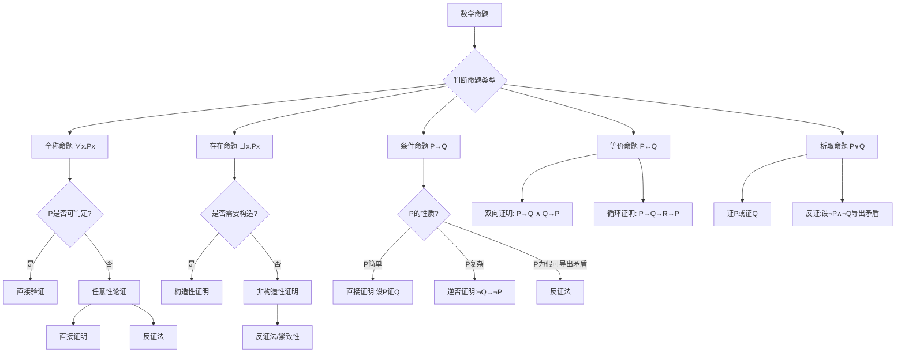

---

## 二、直接证明法（Direct Proof）

### 2.1 基本形式

**适用场景**：P → Q，其中从P出发可自然推出Q

```

直接证明模板
├── 假设: 前提P成立
├── 推导: 通过逻辑推理、定义展开、已知定理
│   ├── 步骤1: 由P和定义得P₁
│   ├── 步骤2: 由P₁和定理得P₂
│   └── ...
└── 结论: 因此Q成立

```

**经典案例**：

**定理**：若n是偶数，则n²是偶数

- **直接证明**：
  1. n偶 ⟹ n = 2k（某整数k）
  2. n² = (2k)² = 4k² = 2(2k²)
  3. 因此n²是偶数 ∎

### 2.2 链式推理

**定理 D1：不等式传递**

- **策略**：a < b 且 b < c ⟹ a < c
- **方法**：不等式运算保持顺序

**定理 D2：函数极限唯一性**

- **策略**：假设lim f(x) = L₁ 和 L₂，证L₁=L₂
- **方法**：三角不等式 |L₁-L₂| ≤ |L₁-f(x)| + |f(x)-L₂| < ε

### 2.3 直接证明的判断标准

✅ **使用直接证明当**：

- 前提条件充分且易于操作
- 目标结论与前提有自然的逻辑通路
- 存在已知的定理链连接P和Q
- 证明过程可正向推进无明显障碍

❌ **避免直接证明当**：

- 从正向难以入手（考虑反证法）
- 需要证明不存在某对象（考虑反证法）
- 涉及自然数的一般性质（考虑归纳法）

---

## 三、反证法（Proof by Contradiction）

### 3.1 逻辑结构

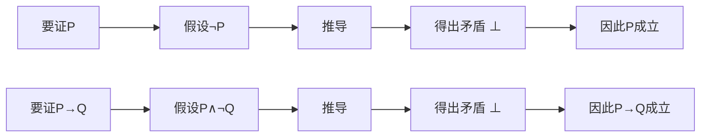

**两种形式**：

| 形式 | 假设 | 目标 | 经典案例 |
|-----|------|------|---------|
| 否定式 | ¬P | 推出矛盾 | √2的无理性 |
| 逆否式 | P∧¬Q | 推出矛盾 | 素数无穷多 |

### 3.2 经典案例分析

**定理 C1：√2是无理数**

```

反证法证明
├── 假设: √2是有理数
│   └── √2 = p/q，p,q互质，q≠0
├── 推导: 2 = p²/q²
│   └── p² = 2q²
├── 结论1: p²是偶数 ⟹ p是偶数
│   └── 设p = 2k
├── 代入: (2k)² = 2q² ⟹ 4k² = 2q² ⟹ 2k² = q²
├── 结论2: q²是偶数 ⟹ q是偶数
├── 矛盾: p,q都是偶数，与互质矛盾
└── 因此: √2是无理数 ∎

```

**定理 C2：素数有无穷多个（Euclid）**

```

反证法证明
├── 假设: 素数有限，为p₁,p₂,...,pₙ
├── 构造: N = p₁p₂...pₙ + 1
├── 分析: N除以任何pᵢ都余1
├── 结论: N不被任何已知素数整除
│   └── N是素数或有新素因子
├── 矛盾: 与"素数有限"假设矛盾
└── 因此: 素数无穷多 ∎

```

### 3.3 反证法的判断逻辑

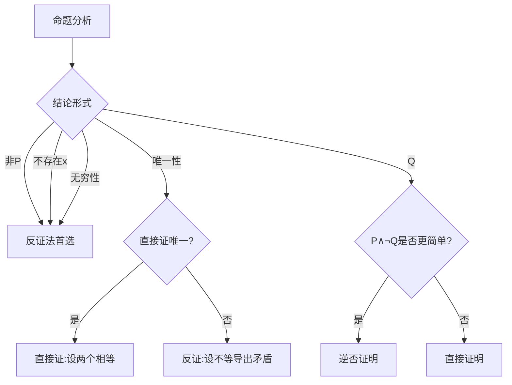

**适用反证法的经典场景**：

| 命题特征 | 示例 | 反证策略 |
|---------|------|---------|
| 否定性命题 | "不存在..." | 假设存在，导出矛盾 |
| 无理/不可数 | "√2无理" | 假设有理，推出矛盾 |
| 无穷性 | "素数无穷" | 假设有限，构造反例 |
| 唯一性 | "极限唯一" | 假设两个不同，导出矛盾 |
| 终止性 | "算法必终止" | 假设不终止，导出矛盾 |

---

## 四、数学归纳法（Mathematical Induction）

### 4.1 归纳法变体

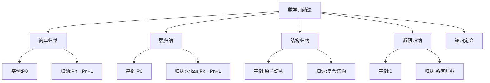

### 4.2 简单归纳（第一归纳法）

**证明模板**：

```

归纳证明 ∀n∈ℕ.Pn
├── 基例: 证明P0成立
│   └── 直接验证
├── 归纳假设: 假设Pn成立
├── 归纳步骤: 证明Pn+1成立
│   └── 利用Pn和代数/逻辑推导
└── 结论: 由归纳原理，∀n.Pn ∎

```

**经典案例**：

**定理 I1：1 + 2 + ... + n = n(n+1)/2**

- **基例**：n=1，左边=1，右边=1·2/2=1 ✓
- **归纳假设**：假设对n成立
- **归纳步骤**：
  1. 1+2+...+n+(n+1) = n(n+1)/2 + (n+1)
  2. = (n+1)(n/2 + 1) = (n+1)(n+2)/2 ✓

### 4.3 强归纳（第二归纳法）

**适用场景**：Pn+1依赖于多个前驱，不仅是Pn

**定理 I2：任何整数n≥2可分解为素数乘积**

- **基例**：n=2，2是素数 ✓
- **归纳假设**：假设对所有k≤n，k可分解为素数乘积
- **归纳步骤**：
  - n+1是素数：已证
  - n+1是合数：n+1=ab，其中2≤a,b≤n
  - 由强归纳假设，a,b都可分解
  - 因此n+1=ab也可分解 ✓

### 4.4 结构归纳法

**适用对象**：递归定义的结构（树、公式、程序）

**定理 I3：命题逻辑公式的平衡括号性质**

- **定义**：公式递归定义为 原子 | ¬α | (α∧β) | ...

- **基例**：原子公式无括号，左右括号数=0 ✓
- **归纳**：
  - ¬α：括号数与α相同，保持平衡
  - (α∧β)：左括号+1，右括号+1，各自内部平衡

### 4.5 归纳法选择决策树

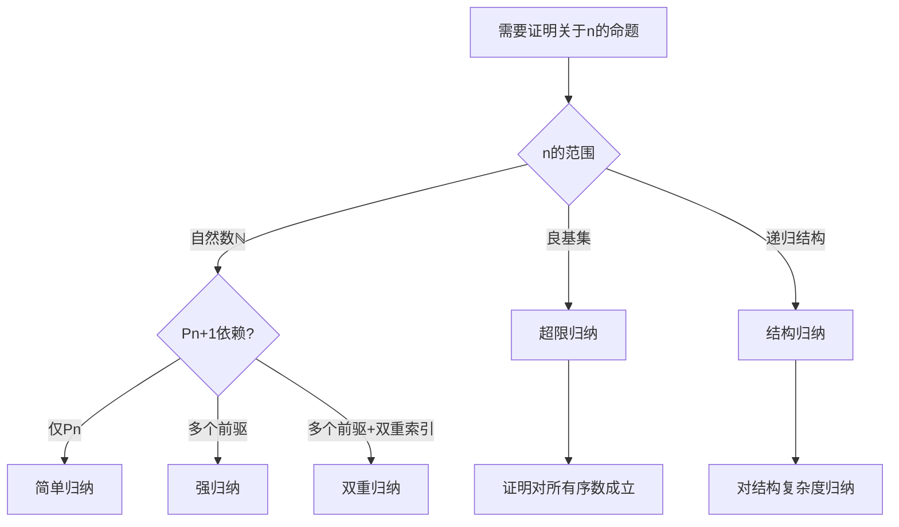

---

## 五、构造性证明（Constructive Proof）

### 5.1 构造vs非构造

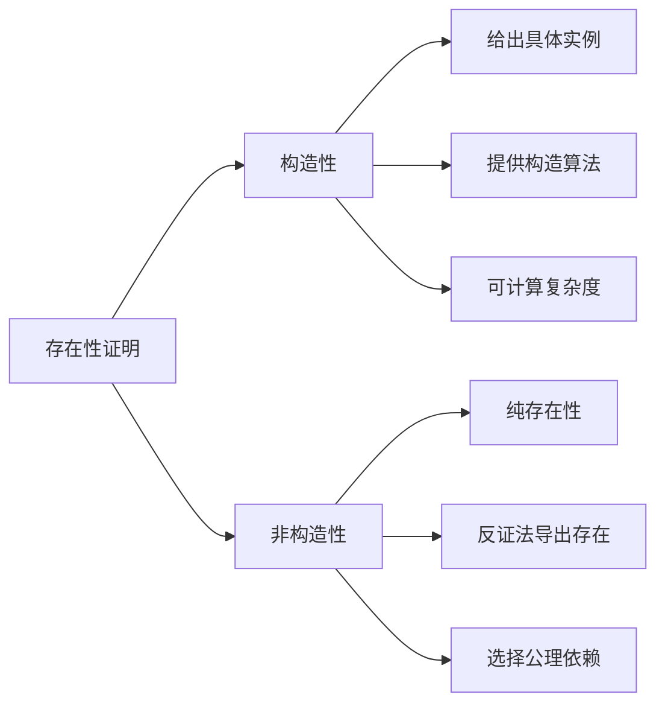

### 5.2 构造性证明范例

**定理 Con1：存在无理数a,b使a^b是有理数**

- **非构造性证明**：
  - 考虑√2^√2
  - 若其有理，则取a=b=√2
  - 若其无理，则取a=√2^√2, b=√2，则a^b=(√2^√2)^√2=√2²=2
  - 必有一种情况成立（但不知具体是哪种）

- **构造性证明**：
  - 取a=√2, b=log₂9
  - a^b = √2^{log₂9} = 2^{(1/2)·log₂9} = 2^{log₂3} = 3 ✓

### 5.3 算法构造法

**定理 Con2：图G有欧拉回路 ⟺ G连通且每点度数为偶**

- **构造性证明（Hierholzer算法）**：
  1. 从任意点出发，沿未遍历边走，直到回到起点形成回路C
  2. 若C未覆盖所有边，找C上某点有未遍历边
  3. 从该点出发构造新回路，与C合并
  4. 重复直到覆盖所有边

### 5.4 对角线构造法

**定理 Con3（Cantor）：实数不可数**

- **构造**：假设[0,1]可数，枚举为r₁,r₂,r₃...
- **构造新数**：s = 0.d₁d₂d₃...，其中dᵢ ≠ rᵢ的第i位小数
- **结论**：s不同于所有rᵢ，矛盾

---

## 六、特殊证明技巧

### 6.1 对角线论证法

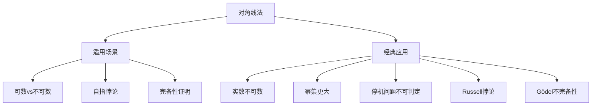

### 6.2 抽屉原理（鸽巢原理）

**基本形式**：n+1个物体放入n个抽屉，至少一个抽屉有≥2个物体

**定理 PH1：在任意n+1个整数中，必有两个数之差被n整除**

- **证明**：考虑模n的余数（n种可能）
- n+1个数必有两者同余，其差被n整除

**广义形式**：kn+1个物体放入n个抽屉，至少一个抽屉有≥k+1个物体

### 6.3 极值原理

**策略**：考虑具有某种极值性质的对象（最大、最小、最近等）

**定理 E1：有限个闭区间覆盖[a,b]，存在有限子覆盖**

- **证明**：考虑所有有限子覆盖中覆盖最远的右端点
- 证明该最远点必为b

### 6.4 不变量原理

**策略**：寻找在操作过程中保持不变的量

**定理 Inv1：15拼图不可解性**

- **设置**：4×4方格，15个数字滑块，一个空格
- **不变量**：逆序数 + 空格行号（从下数）的奇偶性
- **应用**：初始状态与目标状态的奇偶性不同则不可解

---

## 七、存在性与唯一性证明

### 7.1 存在性证明策略

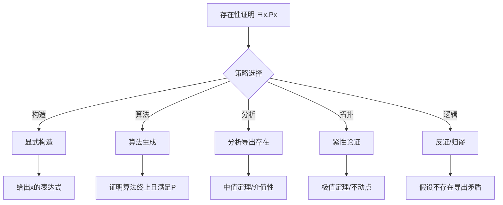

### 7.2 唯一性证明策略

**方法1：直接证明**

```

假设Px ∧ Py
推导x = y

```

**方法2：反证法**

```

假设Px ∧ Py ∧ x≠y
导出矛盾

```

**定理 Un1：方程f(x)=0在[a,b]上最多一个解（f严格单调）**

- **证明**：设f(x₁)=f(x₂)=0，x₁<x₂
- 严格单调 ⟹ f(x₁)<f(x₂)或f(x₁)>f(x₂)
- 与f(x₁)=f(x₂)=0矛盾

### 7.3 存在唯一性组合证明

**定理 EU1：压缩映射不动点定理**

- **存在性**：构造序列xₙ₊₁ = f(xₙ)，证明Cauchy列
- **唯一性**：设有两个不动点，利用压缩条件导出相等

---

## 八、证明策略组合应用

### 8.1 复杂证明的典型结构

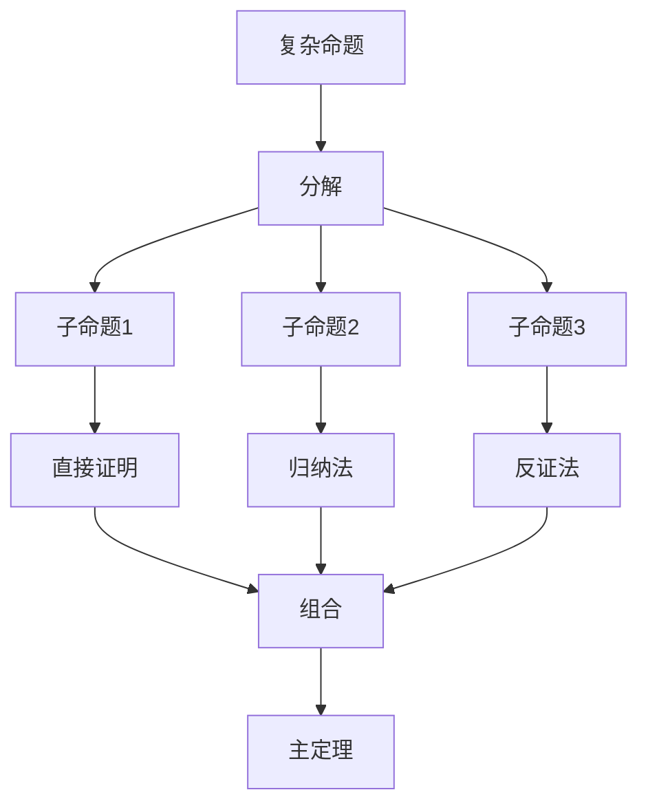

### 8.2 案例分析：素数定理证明

**命题**：π(x) ~ x/ln x（素数计数函数）

**证明结构**：

```

素数定理证明
├── 解析数论准备
│   ├── Riemann ζ函数定义（解析延拓）
│   ├── Euler乘积公式
│   └── 零点分布
├── 关键引理1: 无零点在Re(s)=1上
│   └── 反证法+构造函数
├── 关键引理2: ψ(x)的渐近公式
│   └── 复积分+留数定理
├── Tauber型定理应用
│   └── 从加权求和导出原函数
└── 组合各引理完成证明

```

### 8.3 证明难度评估

| 策略组合 | 难度 | 适用场景 |
|---------|------|---------|
| 直接证明 | ★☆☆☆☆ | 简单推导 |
| 简单归纳 | ★★☆☆☆ | 自然数性质 |
| 反证法 | ★★☆☆☆ | 否定性命题 |
| 构造+验证 | ★★★☆☆ | 存在性命题 |
| 强归纳+反证 | ★★★☆☆ | 复杂数论 |
| 归纳+构造 | ★★★★☆ | 组合数学 |
| 对角线+反证 | ★★★★☆ | 不可数性 |
| 多策略组合 | ★★★★★ | 大定理 |

---

## 九、证明发现策略

### 9.1 问题分析流程

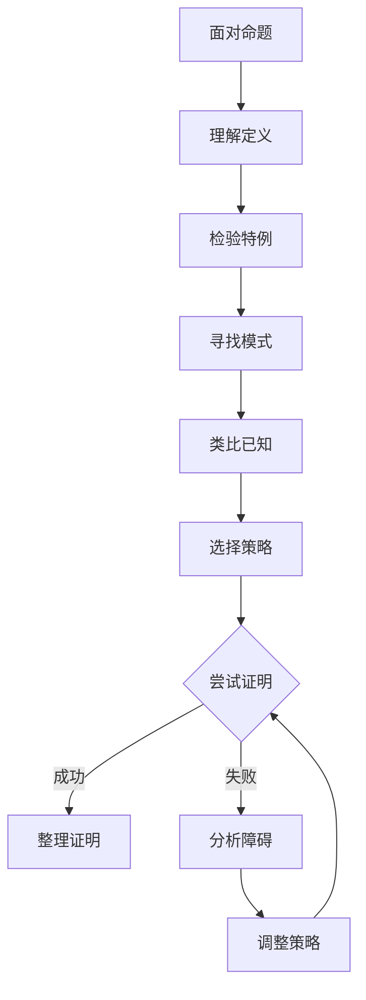

### 9.2 启发式策略

| 启发式 | 应用 | 示例 |
|-------|------|------|
| 工作向后 | 从结论倒推 | 证明不等式 |
| 分解问题 | 分解为子目标 | 复杂存在性 |
| 寻找不变量 | 找守恒量 | 组合游戏 |
| 极端原理 | 考虑极端情况 | 几何存在性 |
| 对称性利用 | 利用对称简化 | 群论应用 |
| 模式识别 | 识别已知模式 | 递推关系 |

### 9.3 常见错误与避免

| 错误类型 | 表现 | 避免方法 |
|---------|------|---------|
| 循环论证 | 用结论证明结论 | 明确标注依赖 |
| 不当推广 | 从特例过度推广 | 检验边界条件 |
| 混淆必要充分 | 必要性≠充分性 | 双向验证 |
| 忽略存在性 | 未证存在直接使用 | 先证存在 |
| 构造不合法 | 构造违反条件 | 验证构造有效性 |

---

## 十、策略选择总结

### 10.1 决策速查表

| 命题形式 | 首选策略 | 备选策略 |
|---------|---------|---------|
| ∀n∈ℕ.Pn | 数学归纳 | 反证+归纳 |
| ∃x.Px | 构造性证明 | 反证/紧致性 |
| P→Q | 直接证明 | 逆否证明 |
| ¬P | 反证法 | 语义论证 |
| P∧Q | 分别证明 | - |
| P∨Q | 证P或证Q | 反证 |
| P↔Q | 双向证明 | 循环证明 |
| 唯一性 | 反证:设两不等 | 直接证相等 |
| 不存在 | 反证法 | 无限下降 |

### 10.2 完整决策树

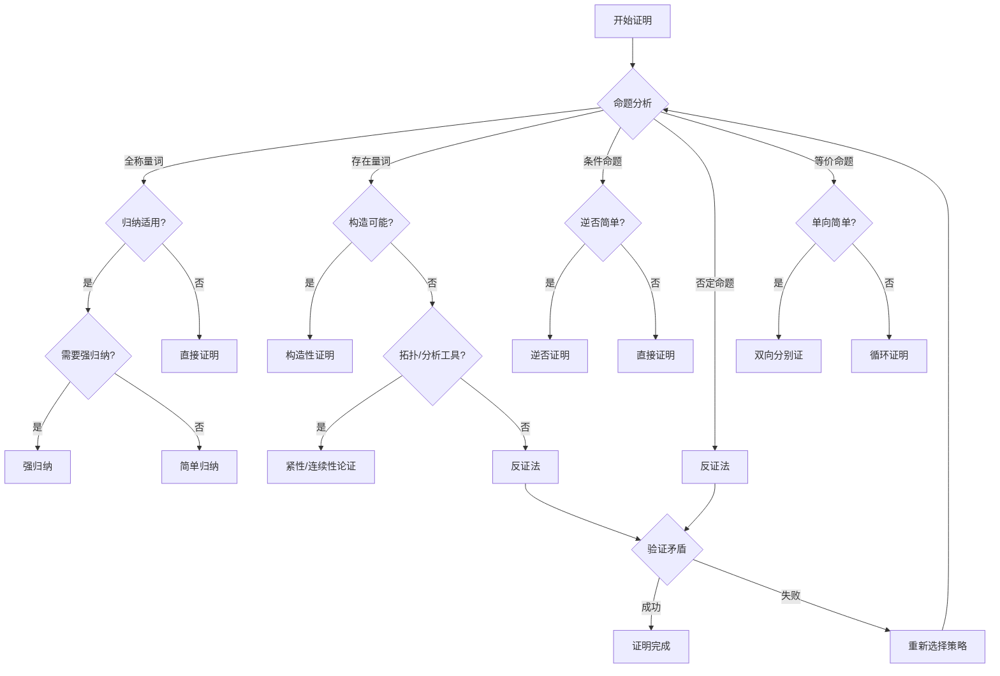

---

**文档统计**：

- 证明策略大类：**4种基本策略**
- 具体技巧：**20+种**
- 经典案例：**30+个**
- 决策流程图：**8个**
- 适用场景：**覆盖所有常见命题类型**
