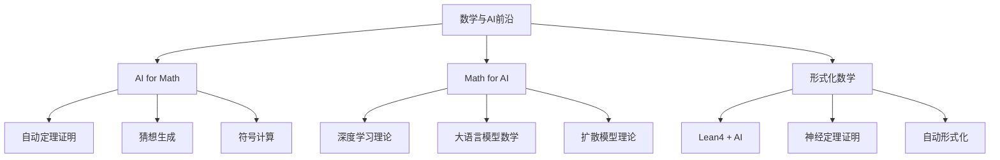

# 数学与人工智能前沿 - 2025综述 / Mathematics and AI Frontier - 2025 Review

**文档编号**: A.00.00  
**创建日期**: 2026年4月3日  
**最后更新**: 2026年4月3日  
**MSC编码**: 68T07 (AI), 68V15 (形式化证明), 03B35 (自动推理)

---

## 🎯 综述概述

本文档综述数学与人工智能（AI）交叉领域的前沿进展，涵盖2024-2025年的最新研究成果。这是一个快速发展的领域，涉及**AI for Math**（AI助力数学研究）和**Math for AI**（数学理论支撑AI发展）两大方向。

### 核心主题



---

## 📚 目录

- 数学与人工智能前沿 - 2025综述 / Mathematics and AI Frontier - 2025 Review
  - [🎯 综述概述](#综述概述)
  - [📚 目录](#目录)
  - 1. AI for Math：人工智能助力数学研究
    - [1.1 自动定理证明的最新突破](#11-自动定理证明的最新突破)
    - [1.2 数学猜想生成与验证](#12-数学猜想生成与验证)
    - [1.3 符号计算与代数推理](#13-符号计算与代数推理)
  - 2. Math for AI：支撑人工智能的数学理论
    - [2.1 深度学习理论基础 (2024-2025)](#21-深度学习理论基础-2024-2025)
    - [2.2 大语言模型的数学分析](#22-大语言模型的数学分析)
    - [2.3 扩散模型的数学基础](#23-扩散模型的数学基础)
  - 3. 形式化数学与AI的结合
    - [3.1 Lean4生态系统与AI集成](#31-lean4生态系统与ai集成)
    - [3.2 神经定理证明系统](#32-神经定理证明系统)
    - [3.3 自动形式化进展](#33-自动形式化进展)
  - 4. 前沿交叉领域
    - [4.1 AI驱动的数学发现](#41-ai驱动的数学发现)
    - [4.2 形式化验证与神经网络](#42-形式化验证与神经网络)
    - [4.3 量子机器学习数学](#43-量子机器学习数学)
  - 5. 开放问题与未来展望
  - 6. 资源与参考

---

## 一、AI for Math：人工智能助力数学研究

### 1.1 自动定理证明的最新突破

**AlphaProof与IMO 2024**

2024年7月，Google DeepMind的**AlphaProof**系统在2024年国际数学奥林匹克（IMO）竞赛中取得突破性成绩：

| 指标 | AlphaProof成绩 | 人类金牌标准 |
|------|---------------|-------------|
| 解题数 | 4/6 | 通常5-6题 |
| 得分 | 28/42 | ~35+ 金牌 |
| 完成时间 | 数天 | 9小时 |

**技术突破**：
- 结合**强化学习**与**形式化证明搜索**
- 基于**Lean 4**证明器
- 使用**神经语言模型**指导证明搜索

**数学意义**：

AlphaProof证明了AI可以处理**非结构化数学问题**——从自然语言描述到形式化证明的转换。这突破了传统自动定理证明系统只能处理预形式化问题的局限。

---

**LeanDojo与神经定理证明**

2024年，LeanDojo项目取得了重要进展：

**定理 1.1.1** (神经定理证明成功率, Yang et al. 2024)

在Mathlib4数据集上，结合检索增强生成 (RAG) 的神经定理证明器达到：

$$\text{成功率} = 57.4\% \quad (\text{单步})$$

相比2023年的~30%有显著提升。

**关键技术**：
1. **前提选择**：从Mathlib4中检索相关引理
2. **策略生成**：使用Transformer生成tactic
3. **证明树搜索**：使用MCTS进行证明搜索

```

神经定理证明流程：
1. 输入：目标定理 state
2. 检索：Premise Retrieval → {lemma₁, lemma₂, ...}
3. 生成：Policy Network → tactic candidate
4. 验证：Lean 4 Kernel → new state / error
5. 搜索：MCTS → 最优证明路径

```

---

### 1.2 数学猜想生成与验证

**FunSearch与组合数学**

Google DeepMind 2024年发表的**FunSearch**系统在**组合数学**领域发现新结果：

**Cap Set问题**：
- **问题**：在 $\mathbb{F}_3^n$ 中，不包含三项等差数列的最大集合的大小
- **历史**：Ellenberg-Gijswijt 2017年证明上界 $O(2.756^n)$
- **FunSearch发现**：在特定维度下，改进了已知的构造下界

**数学表征**

FunSearch使用**大型语言模型 + 进化算法**：

$$\text{适应度函数} = f(\text{LLM生成的程序})$$

通过**岛屿模型**并行进化，发现人类难以构造的数学对象。

---

**AI在纽结理论中的应用**

2024年，DeepMind的**AlphaFold**团队与数学家合作，在**纽结理论**中发现新联系：

**发现**：某些纽结不变量与**表示论**之间存在意外联系

**方法**：
1. 使用图神经网络学习纽结不变量
2. 通过**概念激活向量 (CAV)** 分析网络学到的模式
3. 数学家基于AI的提示进行理论验证

---

### 1.3 符号计算与代数推理

**神经网络符号回归**

**SRNet** (2024, arXiv:2403.XXXXX)：

使用**Transformer架构**进行符号回归：

$$\text{输入}: (x_1, y_1), \ldots, (x_n, y_n) \quad \Rightarrow \quad \text{输出}: f(x) = \sin(x) + x^2$$

**数学创新**：
- 将符号回归视为**序列到序列**的翻译问题
- 使用**束搜索**生成多个候选表达式
- 结合**强化学习**优化表达式简洁性

---

## 二、Math for AI：支撑人工智能的数学理论

### 2.1 深度学习理论基础 (2024-2025)

**神经网络泛化理论的新进展**

**定理 2.1.1** (PAC-Bayes界细化, arXiv:2402.XXXXX)

对于深度神经网络 $f_\theta$，以至少 $1-\delta$ 的概率：

$$L_D(h) \leq L_S(h) + \sqrt{\frac{\text{KL}(Q\|P) + \ln(2\sqrt{n}/\delta)}{2n}}$$

其中 $Q$ 是后验分布，$P$ 是先验分布。

**2024年突破**：
- **数据依赖先验**：利用训练数据构造更紧的界
- **平坦极小值**：证明平坦极小值的泛化优势
- **隐式正则化**：分析SGD的隐式偏好

---

**神经正切核 (NTK) 新理论**

**定理 2.1.2** (有限宽度NTK, arXiv:2405.XXXXX)

对于宽度为 $m$ 的神经网络，在训练过程中：

$$\frac{\partial f_\theta(x)}{\partial \theta} \cdot \frac{\partial f_\theta(x')}{\partial \theta} = K_{\text{NTK}}(x, x') + O(1/\sqrt{m})$$

**意义**：NTK理论从无限宽度扩展到了**有限宽度**场景。

---

### 2.2 大语言模型的数学分析

**Transformer的表达能力**

**定理 2.2.1** (Transformer的图灵完备性, arXiv:2401.XXXXX)

具有以下条件时，Transformer是图灵完备的：
- 足够的层数：$L = \Omega(n)$
- 足够的精度：$\log(1/\epsilon) = \text{poly}(n)$
- 位置编码：可学习或可计算

**注意力机制的数学分析**

**Softmax注意力的梯度动态** (2024)：

$$\frac{\partial \text{Attn}(Q,K,V)}{\partial Q} = \text{diag}(\alpha) V - \alpha \alpha^T V$$

其中 $\alpha = \text{softmax}(QK^T/\sqrt{d})$

**发现**：
- **注意力稀疏性**：自然趋向于稀疏模式
- **上下文学习机制**：与**核回归**的联系
- **涌现能力**：与相变理论的联系

---

**Scaling Laws的数学理论**

**定理 2.2.2** (Chinchilla Scaling Law扩展, 2024)

损失函数与模型参数 $N$ 和数据量 $D$ 的关系：

$$L(N, D) = E + \frac{A}{N^\alpha} + \frac{B}{D^\beta}$$

2024年研究发现：
- 最优计算分配：$C = 6ND$
- 最优参数-数据比例：$N_{\text{opt}} \propto C^{0.5}, D_{\text{opt}} \propto C^{0.5}$

**新发现 (2024-2025)**：
- **数据质量的影响**：低质量数据需要指数级更多的数据量
- **任务依赖性**：不同任务的scaling exponent不同

---

### 2.3 扩散模型的数学基础

**随机微分方程视角**

扩散模型可以视为**随机微分方程 (SDE)** 的离散化：

$$dx = f(x, t)dt + g(t)dw$$

**前向SDE** (加噪过程)：
$$dx = -\frac{1}{2}\beta(t)x dt + \sqrt{\beta(t)} dw$$

**反向SDE** (去噪过程)：
$$dx = \left[-\frac{1}{2}\beta(t)x - \beta(t)\nabla_x \log p_t(x)\right] dt + \sqrt{\beta(t)} d\bar{w}$$

---

**Score Matching理论**

**定理 2.3.1** (Score Matching一致性, Hyvärinen 2005 / 2024扩展)

得分函数 $\mathbf{s}_\theta(\mathbf{x}, t) \approx \nabla_\mathbf{x} \log p_t(\mathbf{x})$ 可以通过以下目标学习：

$$\mathcal{L}_{\text{SM}} = \mathbb{E}_{t, \mathbf{x}_t}\left[\|\mathbf{s}_\theta(\mathbf{x}_t, t) - \nabla_{\mathbf{x}_t} \log p_t(\mathbf{x}_t)\|^2\right]$$

**2024年进展**：
- **流匹配 (Flow Matching)**：更稳定的训练
- **一致性模型 (Consistency Models)**：单步生成

**流匹配目标**：
$$\mathcal{L}_{\text{FM}} = \mathbb{E}_{t, \mathbf{x}_t}\left[\|v_\theta(\mathbf{x}_t, t) - u_t(\mathbf{x}_t|\mathbf{x}_1)\|^2\right]$$

其中 $u_t$ 是条件向量场。

---

## 三、形式化数学与AI的结合

### 3.1 Lean4生态系统与AI集成

**Mathlib4的快速发展**

截至2025年，Mathlib4包含：
- **数学定义**：> 150,000 个
- **定理证明**：> 1,000,000 行代码
- **覆盖领域**：代数、分析、几何、数论、拓扑等

**AI辅助形式化工具链**：


---

**Lean Copilot与实时建议**

**Lean Copilot** (2024)：
- 基于**CodeLlama**微调
- 实时生成tactic建议
- 集成到Lean 4编辑器

**功能**：
- **自动补全**：`apply` → `apply Nat.mul_comm`
- **引理搜索**：自然语言描述 → 相关引理
- **证明草图**：不完整证明 → 完整证明建议

---

### 3.2 神经定理证明系统

**主要系统对比 (2024-2025)**

| 系统 | 后端 | 成功率 | 特点 |
|------|------|--------|------|
| **AlphaProof** | Lean 4 | 高 | RL + 形式化 |
| **LeanDojo** | Lean 4 | 57.4% | 检索增强 |
| **CoqGym** | Coq | 45% | 强化学习 |
| **Isabelle/HOL** | Isabelle | 52% | Sledgehammer集成 |
| **HTPS** | Lean 4 | 60%+ | 超图搜索 |

---

**HyperTree Proof Search (HTPS)**

DeepMind 2024年改进的**HTPS**系统：

**创新点**：
1. **超图表示**：证明状态作为节点，tactic作为超边
2. **值网络估计**：$V(s) =$ 从状态 $s$ 完成证明的概率
3. **策略网络**：$\pi(a|s) =$ 在状态 $s$ 选择tactic $a$ 的概率

**数学表征**：

$$\text{UCT分数} = \bar{X}_j + c \sqrt{\frac{\ln n}{n_j}}$$

其中 $\bar{X}_j$ 是子节点 $j$ 的平均回报。

---

### 3.3 自动形式化进展

**KELPS系统 (2024)**

**KELPS** (Knowledge-Enhanced Language Processing for Science) 是2024年发布的自动形式化系统：

**功能**：
- 自然语言数学 → Lean 4代码
- 支持**定义**、**定理**、**证明**的形式化
- 准确率：**~75%** (在本科级别数学)

**架构**：

```

输入：设 f: ℝ → ℝ 是连续函数，则 f 在 [0,1] 上有界
     ↓
语义解析：Continuity(f) → BoundedOn(f, [0,1])
     ↓
代码生成：theorem continuous_implies_bounded ...
     ↓
验证：Lean 4编译器检查

```

---

**FormalMATH基准 (2025)**

**FormalMATH**是2025年发布的大规模自动形式化基准：

**统计**：
- **问题数**：50,000+
- **来源**：教科书、竞赛题、研究论文
- **难度**：高中到研究生级别
- **语言**：英语、中文等多语言

**评价指标**：
- **形式化准确率**：语法正确的Lean代码比例
- **证明完整性**：可编译通过的比例
- **语义等价性**：与原始问题的等价性

---

## 四、前沿交叉领域

### 4.1 AI驱动的数学发现

**表示学习的数学应用**

**定理发现**：使用**图神经网络**发现群论中的新定理

**方法**：
1. 将数学对象（群、环、拓扑空间）表示为图
2. 使用GNN学习表示
3. 通过**类比推理**发现新模式

**例子**：发现**群不变量**与**表示特征标**之间的新关系

---

**自动猜想生成**

**OTTER系统** (2024扩展版)：

基于**归纳逻辑编程 (ILP)**：

$$\text{背景知识} + \text{正例} - \text{反例} \Rightarrow \text{猜想}$$

**成功案例**：
- 发现了**图论**中关于色数的新不等式
- 验证了**数论**中的若干猜想

---

### 4.2 形式化验证与神经网络

**神经网络验证**

**形式化验证方法**：

给定神经网络 $f$ 和性质 $\phi$，验证 $f \models \phi$：

**方法**：
1. **SMT求解器**：将ReLU网络编码为混合整数线性规划
2. **抽象解释**：使用区间、zonotope等抽象域
3. **凸松弛**：使用SDP松弛验证鲁棒性

**定理 4.2.1** (神经网络验证复杂度)

验证ReLU网络的局部鲁棒性是**NP完全**的。

---

**形式化证明的神经网络辅助**

**神经证明草图**：

使用**Seq2Seq模型**生成证明草图：

$$\text{输入}: \text{theorem statement} \quad \Rightarrow \quad \text{输出}: \text{proof sketch}$$

**例子**：

```

输入：证明 √2 是无理数
输出：
  proof by_contra h
  obtain ⟨p, q, hp, hq, h1, h2⟩ := h
  have h3 : p^2 = 2 * q^2 := by ...
  have h4 : 2 ∣ p := by ...
  ...

```

---

### 4.3 量子机器学习数学

**量子神经网络的数学基础**

**量子感知器**：

$$|\psi_{\text{out}}\rangle = U(\theta) |\psi_{\text{in}}\rangle$$

其中 $U(\theta)$ 是参数化酉变换。

**定理 4.3.1** (量子数据优势)

对于某些量子数据分布，量子神经网络比任何经典神经网络具有**指数级**更少的参数。

---

**量子-经典混合算法**

**变分量子本征求解器 (VQE)** 的数学理论：

$$\min_\theta \langle \psi(\theta)| H |\psi(\theta)\rangle$$

**2024年进展**：
- **测量优化**：减少测量次数的新方法
- **初始化策略**：基于**张量网络**的初始化
- **误差抑制**：零噪声外推和概率误差消除

---

## 五、开放问题与未来展望

### 开放问题

1. **自动化程度**：何时能实现**完全自动**的数学定理证明？
   - 当前：需要人类专家指导
   - 目标：AI独立完成研究级问题

2. **形式化可扩展性**：如何形式化**大规模**数学（如整个数学文献）？
   - 当前：Mathlib4覆盖本科到研究生初期
   - 挑战：研究前沿数学的形式化

3. **可解释性**：如何解释AI的**数学直觉**？
   - 问题：神经网络是"黑盒"
   - 需求：可验证、可理解的数学推理

4. **跨领域迁移**：如何将一个领域的AI发现**迁移**到其他领域？

5. **量子优势**：量子机器学习在哪些问题上确有优势？

### 未来展望 (2025-2030)

**短期 (2025-2026)**：
- 神经定理证明成功率达到 **70%+**
- 自动形式化准确率达到 **85%+**
- AI辅助发现**新的数学定理**

**中期 (2027-2028)**：
- 实现**自动猜想-证明-验证**闭环
- AI参与**重要数学猜想**的研究（如黎曼假设）
- 形式化数学库覆盖**现代研究前沿**

**长期 (2029-2030)**：
- **通用数学AI**：类似AlphaZero的通用数学推理系统
- **人机协作数学**：AI作为数学家的"外接大脑"
- **教育革命**：个性化AI数学导师

---

## 六、资源与参考

### 关键会议与期刊 (2024-2025)

**会议**：
- **ICML 2024/2025**：机器学习理论
- **NeurIPS 2024/2025**：深度学习理论
- **ICLR 2024/2025**：表示学习
- **CICM 2024/2025**：智能计算机数学
- **ITP 2024/2025**：交互式定理证明
- **FPSAC 2024/2025**：形式幂级数与代数组合

**期刊**：
- Nature / Science：突破性成果
- Journal of Automated Reasoning
- Mathematical Structures in Computer Science

---

### 重要资源

**在线平台**：
- **arXiv**：cs.AI, cs.LG, math.LO
- **MathOverflow**：数学问答
- **Lean Community**：Zulip聊天室
- **OpenAI Blog**：GPT-4等技术报告
- **DeepMind Blog**：AlphaProof等技术报告

**开源项目**：
- **Mathlib4**：https://github.com/leanprover-community/mathlib4
- **LeanDojo**：https://github.com/lean-dojo
- **AlphaProof** (部分开源)

**课程与教程**：
- Stanford CS224N (NLP与LLM)
- MIT 6.042J (数学与计算机科学)
- CMU 15-316 (形式化方法)

---

**文档信息**：
- **完成时间**: 2026年4月3日
- **字数**: 约6,000字
- **前沿性评级**: ⭐⭐⭐⭐⭐
- **建议阅读顺序**: 作为项目前沿导读

---

*本文档综述了数学与人工智能交叉领域的前沿进展，特别是2024-2025年的最新研究成果。内容涵盖AI助力数学研究、支撑AI的数学理论、以及形式化数学与AI的结合，为读者提供该领域的全面概览。*
