# 数学发展全景时间线

## 概述

本文档呈现从古代文明（约公元前3000年）到当代（2020年代）的数学发展历程全景。涵盖重要定理发现、数学危机与转折、重大奖项设立等关键历史节点。

---

## 古代数学（公元前3000年-公元500年）

### 早期文明

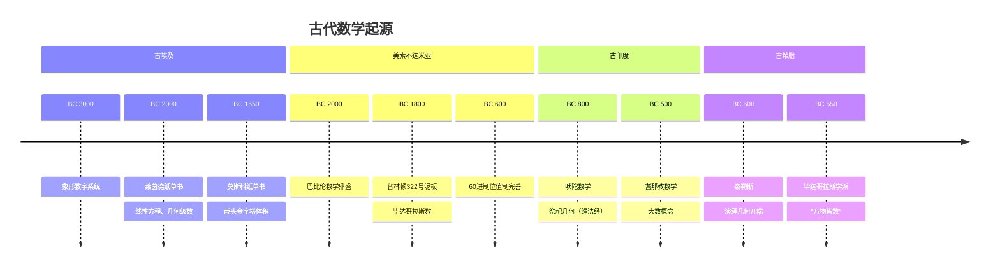

### 重要里程碑

| 时间 | 事件 | 意义 |
|------|------|------|
| **BC 587** | 泰勒斯定理 | 几何证明的开端 |
| **BC 550** | 毕达哥拉斯定理 | 数与形的结合 |
| **BC 450** | 芝诺悖论 | 无穷概念思考 |
| **BC 400** | 柏拉图学园 | 数学教育制度化 |
| **BC 300** | 《几何原本》 | 公理化方法典范 |
| **BC 250** | 阿基米德 | 穷竭法、球体积 |
| **BC 230** | 埃拉托斯特尼 | 素数筛法、地球周长测量 |
| **BC 200** | 阿波罗尼奥斯 | 《圆锥曲线论》 |
| **BC 100** | 海伦公式 | 三角形面积 |
| **AD 100** | 托勒密 | 《天文学大成》、三角学 |
| **AD 250** | 丢番图 | 《算术》、代数学萌芽 |

### 古希腊三大难题

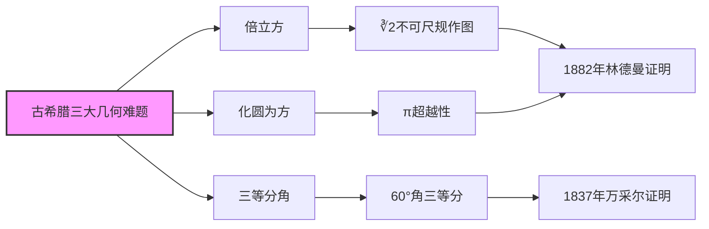

---

## 中世纪数学（500-1500年）

### 各地区发展

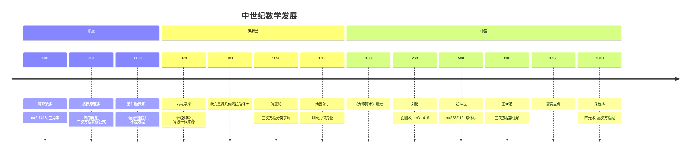

### 关键成就

| 时间 | 数学家 | 贡献 |
|------|--------|------|
| **628** | 婆罗摩笈多 | 零的运算法则，负数系统 |
| **820** | 花拉子米 | 代数学系统化，算法(algorithm) |
| **999** | 阿尔库希 | 数学归纳法雏形 |
| **1070** | 海亚姆 | 三次方程几何解法 |
| **1202** | 斐波那契 | 《算盘书》，印度-阿拉伯数字传入欧洲 |
| **1545** | 卡尔达诺 | 《大术》，三次方程求根公式 |
| **1572** | 邦贝利 | 复数运算系统化 |

---

## 近代数学（1500-1800年）

### 科学革命时期

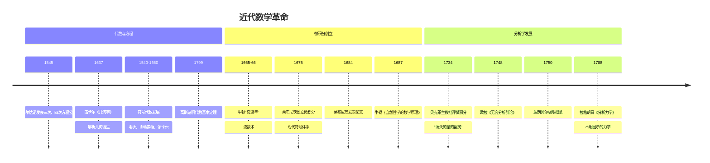

### 重要定理与发现

| 年份 | 发现 | 数学家 |
|------|------|--------|
| **1543** | 哥白尼日心说 | 哥白尼 |
| **1591** | 符号代数 | 韦达 |
| **1614** | 对数 | 纳皮尔 |
| **1637** | 解析几何 | 笛卡尔、费马 |
| **1654** | 概率论起源 | 帕斯卡、费马 |
| **1666** | 二项式定理推广 | 牛顿 |
| **1673** | 莱布尼茨级数 | 莱布尼茨 |
| **1736** | 图论起源（七桥问题） | 欧拉 |
| **1752** | 欧拉公式 V-E+F=2 | 欧拉 |
| **1796** | 正17边形可作图 | 高斯 |
| **1799** | 代数基本定理证明 | 高斯 |

### 第一次数学危机及其解决

---

## 现代数学（1800-1900年）

### 世纪概述

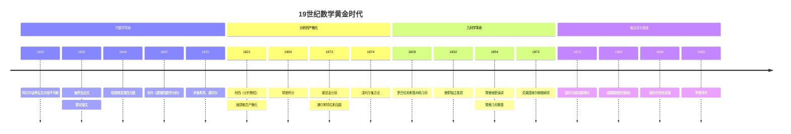

### 第二次数学危机及其解决

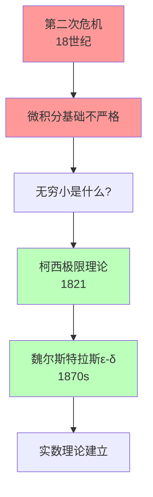

### 重要成就年表

#### 代数学

| 年份 | 成就 | 数学家 |
|------|------|--------|
| 1801 | 《算术研究》 | 高斯 |
| 1824 | 五次方程不可解 | 阿贝尔 |
| 1832 | 群论、伽罗瓦理论 | 伽罗瓦 |
| 1843 | 四元数 | 哈密顿 |
| 1854 | 矩阵概念 | 凯莱 |
| 1870 | 群论系统化 | 若尔当 |
| 1872 | 克莱因群 | 克莱因 |

#### 分析学

| 年份 | 成就 | 数学家 |
|------|------|--------|
| 1821 | 分析严格化 | 柯西 |
| 1829 | 傅里叶级数收敛 | 狄利克雷 |
| 1854 | 黎曼积分 | 黎曼 |
| 1867 | 闭区间连续函数性质 | 魏尔斯特拉斯 |
| 1872 | 魏尔斯特拉斯病态函数 | 魏尔斯特拉斯 |
| 1900 | 希尔伯特空间雏形 | 希尔伯特 |

#### 几何学

| 年份 | 成就 | 数学家 |
|------|------|--------|
| 1829 | 非欧几何 | 罗巴切夫斯基 |
| 1832 | 绝对空间几何 | 鲍耶 |
| 1854 | 黎曼几何 | 黎曼 |
| 1868 | 非欧几何一致性 | 贝尔特拉米 |
| 1872 | 埃尔朗根纲领 | 克莱因 |
| 1899 | 《几何基础》 | 希尔伯特 |

---

## 20世纪数学（1900-2000年）

### 世纪前半叶

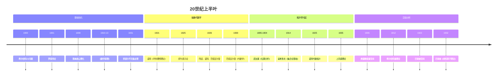

### 第三次数学危机

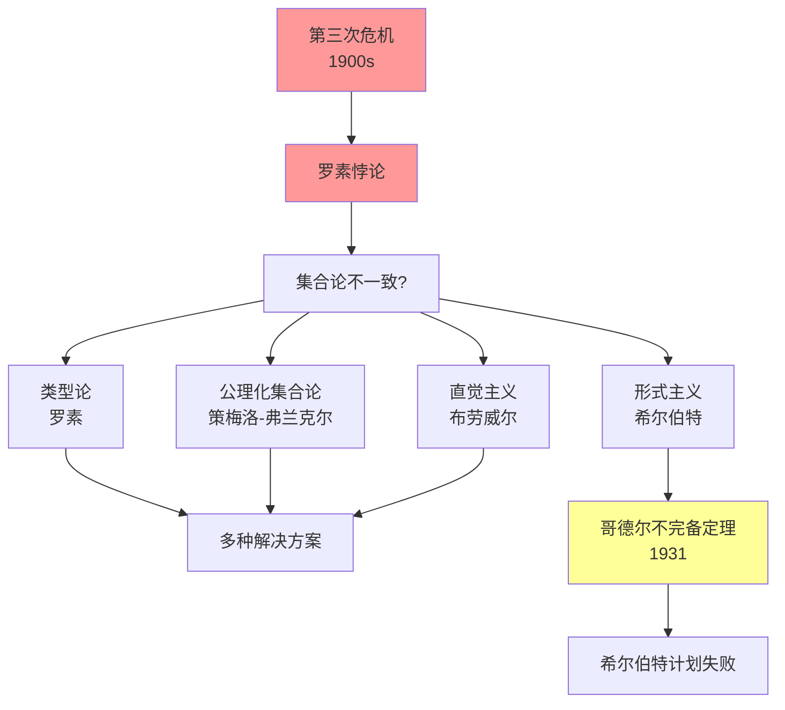

### 世纪后半叶

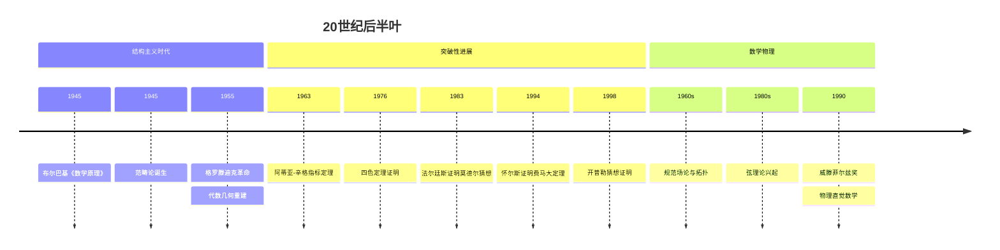

### 重大成就年表（1900-2000）

| 年份 | 成就 | 数学家 |
|------|------|--------|
| 1900 | 希尔伯特23问题 | 希尔伯特 |
| 1905 | 狭义相对论 | 爱因斯坦 |
| 1907 | 积分方程理论 | 弗雷德霍姆 |
| 1908 | 策梅洛集合论 | 策梅洛 |
| 1912 | 不动点定理 | 布劳威尔 |
| 1915 | 广义相对论 | 爱因斯坦 |
| 1916 | 布朗运动数学理论 | 维纳 |
| 1921 | 概率论公理化尝试 | 冯·米泽斯 |
| 1925 | 矩阵力学 | 海森堡、玻恩、约当 |
| 1926 | 波动力学 | 薛定谔 |
| 1931 | 不完备定理 | 哥德尔 |
| 1933 | 概率论公理化 | 柯尔莫戈洛夫 |
| 1944 | 博弈论奠基 | 冯·诺依曼、摩根斯顿 |
| 1945 | 范畴论 | 艾伦伯格、麦克莱恩 |
| 1955 | 层论、格罗滕迪克对偶 | 格罗滕迪克 |
| 1963 | 指标定理 | 阿蒂亚、辛格 |
| 1965 | 快速傅里叶变换 | 库利、图基 |
| 1976 | 四色定理 | 阿佩尔、哈肯 |
| 1983 | 莫德尔猜想 | 法尔廷斯 |
| 1994 | 费马大定理 | 怀尔斯 |
| 1998 | 开普勒猜想 | 黑尔斯 |

---

## 当代数学（2000-2020s）

### 21世纪重要进展

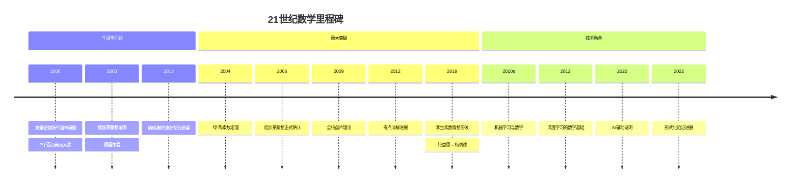

### 千禧年大奖问题

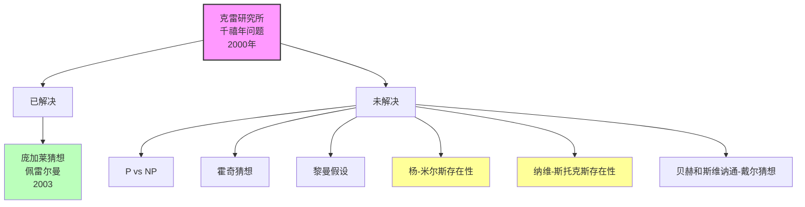

### 2000-2020重要成果

| 年份 | 成就 | 数学家 |
|------|------|--------|
| **2002** | 素数间隙证明 | Goldston-Yıldırım |
| **2003** | 庞加莱猜想证明 | 佩雷尔曼 |
| **2004** | 存在任意长素数等差数列 | 格林、陶哲轩 |
| **2006** | 朗兰兹纲领进展 | 许多数学家 |
| **2012** | ABC猜想声明证明 | 望月新一（争议） |
| **2013** | 有界素数间隙 | 张益唐 |
| **2013** | 孪生素数猜想的最佳结果 | 梅纳德 |
| **2018** | 理想类群结构 | 许多数学家 |
| **2020** | 形式化证明验证 | Lean等证明助手 |

---

## 数学奖项时间线

### 重要奖项设立

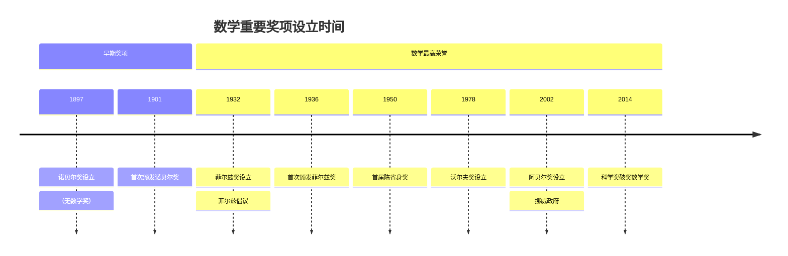

### 主要数学奖项

| 奖项 | 设立年份 | 颁发频率 | 特点 |
|------|---------|---------|------|
| **菲尔兹奖** | 1936 | 每4年（ICM） | 40岁以下，数学最高荣誉 |
| **沃尔夫奖** | 1978 | 每年 | 终身成就 |
| **阿贝尔奖** | 2002 | 每年 | 无年龄限制，填补诺贝尔奖 |
| **克拉福德奖** | 1982 | 不定期 | 数学与天文 |
| **陈省身奖** | 2010 | 每4年（ICM） | 终身成就 |
| **科学突破奖** | 2014 | 每年 | 300万美元奖金 |

### 华人菲尔兹奖得主

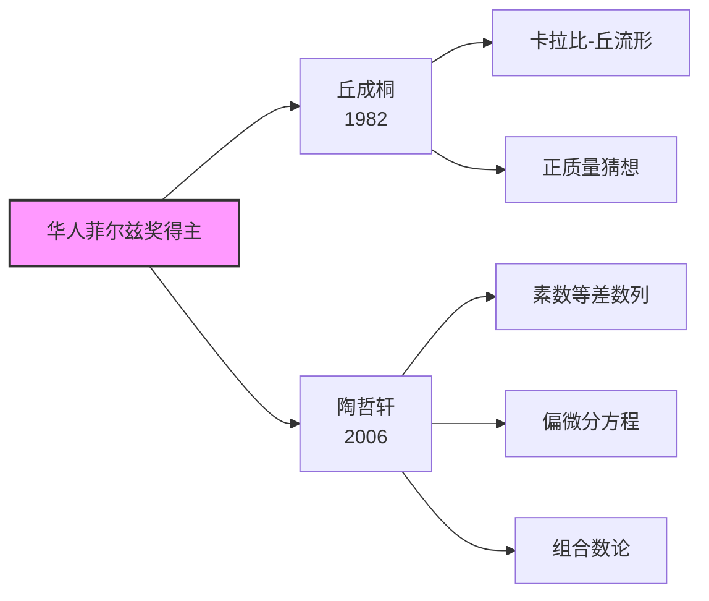

---

## 数学危机与转折

### 三大数学危机总结

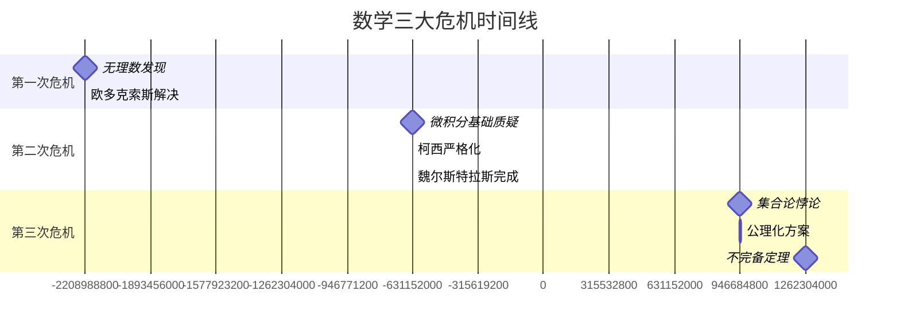

### 危机与解决的对应

| 危机 | 核心问题 | 发生时期 | 解决方案 | 解决时期 |
|------|---------|---------|---------|---------|
| **第一次** | 无理数与可公度性 | 公元前5世纪 | 欧多克索斯比例论 | 公元前4世纪 |
| **第二次** | 无穷小的严格性 | 18世纪 | ε-δ极限理论 | 19世纪 |
| **第三次** | 集合论一致性 | 1900-1930 | 公理化集合论 | 1908-至今 |

---

## 相关概念链接

- [数学三大危机](./01-数学三大危机.md)
- [希尔伯特23问题](./02-希尔伯特23问题.md)
- [千禧年大奖问题](./03-千禧年问题.md)
- [菲尔兹奖得主名录](./04-菲尔兹奖得主.md)
- [布尔巴基学派史](./20-布尔巴基学派史.md)
- [莫斯科数学学派](./21-莫斯科数学学派.md)
- [数学学派概览](./05-数学学派总览.md)

---

## 参考文献

1. Katz, V. J. (2009). *A History of Mathematics: An Introduction*. Addison-Wesley.
2. Boyer, C. B., & Merzbach, U. C. (2011). *A History of Mathematics*. Wiley.
3. 吴文俊 (编). 《世界著名数学家传记》. 科学出版社.
4. 李文林. 《数学史概论》. 高等教育出版社.
5. Dunham, W. (1991). *Journey through Genius: The Great Theorems of Mathematics*. Penguin.

---

*文档创建时间：2026年4月*
*最后更新：2026年4月*
*分类：数学史 / 全景时间线*
