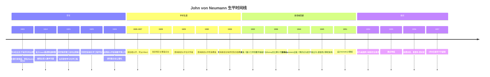
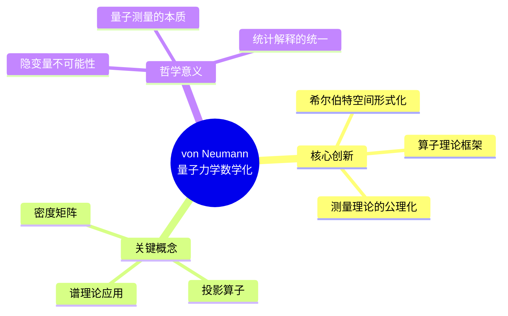
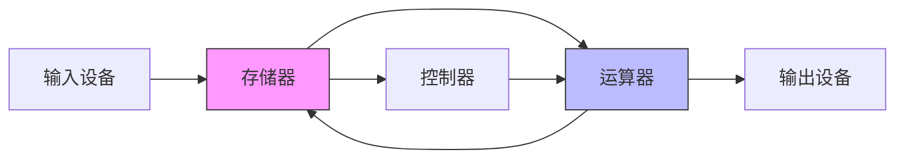
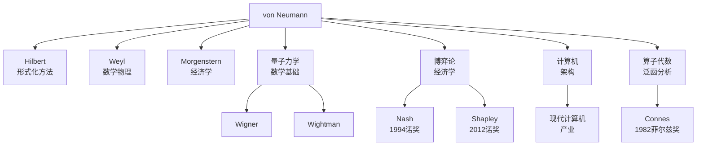
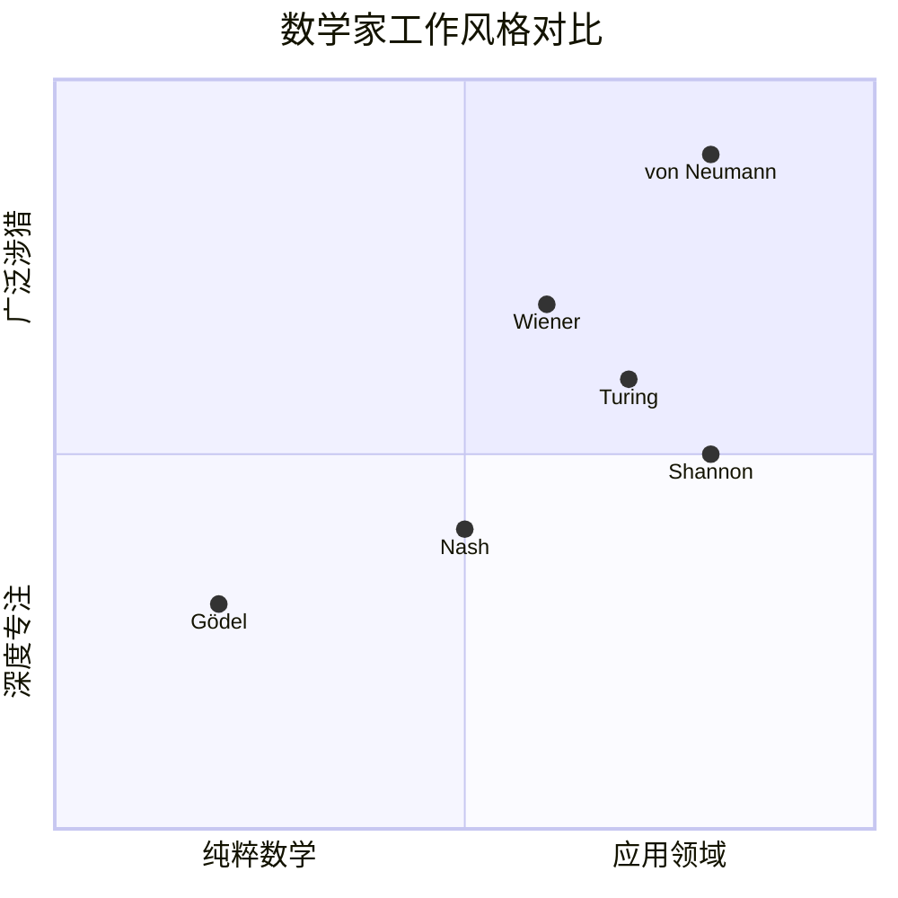

# John von Neumann 传记

> "在数学中，你并不理解事物，你只是习惯它们。"
> —— John von Neumann

---

## 一、生平时间线

### 早年天才 (1903-1926)



### 重要生平节点

| 年份 | 年龄 | 事件 | 意义 |
|------|------|------|------|
| 1903 | 0 | 布达佩斯出生 | 犹太裔匈牙利家庭 |
| 1921 | 18 | 双学位并行 | 苏黎世化学+布达佩斯数学 |
| 1926 | 23 | 双学位完成 | 仅用3年完成博士学位 |
| 1928 | 25 | 博弈论奠基 | 最小最大定理 |
| 1932 | 29 | 量子力学基础 | 希尔伯特空间形式化 |
| 1936 | 33 | 算子代数 | 冯·诺依曼代数 |
| 1944 | 41 | 博弈论巨著 | 现代经济学基石 |
| 1945 | 42 | 计算机架构 | 存储程序概念 |
| 1954 | 51 | 原子能委员 | 参与国防政策制定 |
| 1957 | 53 | 逝世 | 美国军政高层隆重葬礼 |

---

## 二、主要数学贡献

### 2.1 集合论与数理逻辑 (1923-1929)

**核心贡献：**

1. **序数定义**
   - 给出有限序数的严格定义
   - 证明超限归纳法
   - 为集合论公理化做出贡献

2. **集合论公理化**
   - 研究集合论的内在一致性
   - 探讨选择公理的作用
   - 与哥德尔工作相呼应

### 2.2 量子力学的数学基础 (1927-1932)

**《量子力学的数学基础》(1932)**



**主要贡献：**

| 概念 | 创新意义 | 影响 |
|------|----------|------|
| **希尔伯特空间** | 量子态的严格数学描述 | 成为量子力学标准语言 |
| **自伴算子** | 可观测量与算子对应 | 量子力学的数学公理化 |
| **密度矩阵** | 混合态的统一描述 | 量子统计力学基础 |
| **测量理论** | 波包坍缩的数学描述 | 量子诠释争论的核心 |
| **隐变量不可能** | 证明局部隐变量理论不可能 | 贝尔不等式的前奏 |

### 2.3 算子代数理论 (1936-1949)

**冯·诺依曼代数 (von Neumann Algebras)**

与Francis Murray合作发展：

1. **因子分类**
   - 类型I：矩阵代数
   - 类型II：无限但具有迹
   - 类型III：纯无限

2. **直接积分理论**
   - 将算子代数分解为因子的积分
   - 类似于群表示论中的Peter-Weyl定理

3. **遍历理论应用**
   - 量子统计力学中的应用
   - 遍历假设的严格表述

### 2.4 博弈论与经济行为 (1928-1944)

**最小最大定理 (1928)**

```
对于二人零和博弈，存在策略使得：
max_x min_y E(x,y) = min_y max_x E(x,y)
```

**《博弈论与经济行为》(1944)**

- 与经济学家Oskar Morgenstern合作
- 建立了博弈论的完整数学框架
- 创立了现代数理经济学

**核心贡献：**

| 概念 | 描述 | 应用 |
|------|------|------|
| **零和博弈** | 一方所得即另一方所失 | 竞争策略分析 |
| **纳什均衡** | von Neumann-Morgenstern奠定基础 | 经济学革命 |
| **期望效用** | 公理化效用理论 | 决策理论 |
| **合作博弈** | 联盟形成理论 | 政治经济学 |
| **扩展式博弈** | 动态博弈的形式化 | 产业组织理论 |

### 2.5 计算机科学与数值分析

**冯·诺依曼架构 (1945)**



**核心思想：**

- **存储程序概念**：程序和数据都存储在内存中
- **二进制表示**：简化硬件设计
- **五大部件**：输入、输出、存储、运算、控制

**其他计算机贡献：**

| 领域 | 贡献 | 意义 |
|------|------|------|
| **数值计算** | 数值稳定性分析 | 现代科学计算基础 |
| **蒙特卡洛方法** | 随机采样算法 | 统计物理、金融工程 |
| **元胞自动机** | 自复制自动机 | 复杂性科学先驱 |
| **线性规划** | 对偶理论早期形式 | 运筹学基础 |

### 2.6 其他重要贡献

1. **遍历理论**
   - 平均遍历定理
   - 统计力学的基础

2. **连续几何**
   - 射影几何的无限维推广
   - 与量子逻辑的关联

3. **核武器研究**
   - 参与曼哈顿计划
   - 内爆式原子弹设计
   - 氢弹设计的关键贡献

---

## 三、代表作品分析

### 3.1 《量子力学的数学基础》

**出版信息：**

- 德文原版：Mathematische Grundlagen der Quantenmechanik (1932)
- 英文译本：Mathematical Foundations of Quantum Mechanics (1955)

**核心内容：**

1. 希尔伯特空间理论
2. 量子测量公理
3. 统计算子与熵
4. 量子热力学

**历史地位：**
> "这是量子力学数学公理化的里程碑著作，其影响延续至今。"

### 3.2 《博弈论与经济行为》

**出版信息：**

- 1944年出版
- 与Oskar Morgenstern合著
- 开创性数理经济学著作

**主要内容：**

- 博弈的数学定义
- 零和博弈的解
- 效用理论公理化
- 一般均衡理论

**学术影响：**

- 启发了约翰·纳什的均衡理论
- 为现代博弈论奠定数学基础
- 1994年诺贝尔经济学奖授予博弈论研究者

### 3.3 冯·诺依曼架构论文

**"First Draft of a Report on the EDVAC" (1945)**

- 首次提出存储程序计算机概念
- 定义了现代计算机的基本结构
- 虽仅为技术报告，但影响深远

---

## 四、学术影响力和传承

### 4.1 学术传承图谱



### 4.2 对现代科学的深远影响

| 领域 | 影响 | 具体体现 |
|------|------|----------|
| **量子物理** | 标准数学语言 | 所有量子力学教材使用希尔伯特空间 |
| **经济学** | 数理经济学奠基 | 1994、2005、2007、2012、2014诺奖 |
| **计算机科学** | 现代计算机基础 | 几乎所有计算机都基于此架构 |
| **数学物理** | 算子代数 | 量子场论、统计力学标准工具 |
| **运筹学** | 博弈论与优化 | 现代管理科学基础 |

### 4.3 诺贝尔奖与传承

**因von Neumann工作获诺奖的经济学家：**

- 1994年：Nash, Harsanyi, Selten（博弈论）
- 2005年：Aumann, Schelling（博弈论应用）
- 2007年：Hurwicz, Maskin, Myerson（机制设计）
- 2012年：Roth, Shapley（市场设计）
- 2014年：Tirole（产业组织理论）

---

## 五、个人风格和工作方法

### 5.1 惊人的计算能力

**"心算闪电"**

> "von Neumann的心算速度超过任何人使用计算器。"
> —— Hans Bethe

轶事：

- 能瞬间计算复杂数值积分
- 记忆电话号码簿大小的数据
- 能快速复述多年前读过的书的内容

### 5.2 工作方法特点

| 特点 | 描述 | 例子 |
|------|------|------|
| **快速理解** | 瞬间掌握新领域核心 | 几天内掌握全新数学分支 |
| **跨学科思维** | 在不同领域建立联系 | 将博弈论引入经济学 |
| **实用性** | 关注可应用的结果 | 计算机设计、核武器 |
| **精确性** | 追求数学严格性 | 量子力学公理化 |
| **多任务处理** | 同时进行多个项目 | 同时研究博弈论和计算机 |

### 5.3 与其他数学家的对比



### 5.4 生活态度

**社交特点：**

- 热爱派对和社交活动
- 健谈，喜欢讲故事
- 工作与生活分明

**政治观点：**

- 年轻时同情共产主义
- 后来成为坚定的反共者
- 积极参与国防政策

**晚年：**

- 得知癌症后表现平静
- 皈依天主教（尽管一直是无神论者）
- 临终前在病床上继续思考数学

---

## 六、历史评价和轶事

### 6.1 同时代人的评价

> "von Neumann是我认识的唯一一个我自认为在智力上 inferior 的人。"
> —— **Hans Bethe** (诺贝尔物理学奖得主)

> "世界上有两种天才：一种是让我们感到自己也能做到的，另一种是让我们感到人类还有其他物种。von Neumann属于后者。"
> —— **Enrico Fermi**

> "他的大脑暗示了物种的进化方向。"
> —— **Life Magazine** 1957年讣告

### 6.2 重要轶事

#### 1. 心算闪电

在一次研讨会上，有人提出一个复杂的积分问题。在大家还在计算时，von Neumann已经给出了答案，并正确到小数点后几位。

#### 2. 火车问题

一个经典的数学问题：两列火车相向而行，一只苍蝇在两车间来回飞。问苍蝇飞行总距离。

von Neumann立即给出了答案。有人问："你是不是用了无穷级数求和？"他回答："不，我只是用了更简单的方法——但我确实也用无穷级数验证了一下。"

#### 3. 最后的数学思考

临终前，在病床上，他仍在思考数学问题。当被问及时，他说："我只是想确保我没有遗漏什么。"

### 6.3 历史地位

**数学界的评价：**

- 20世纪最伟大的应用数学家
- 或许是最后一位真正的数学全才
- 在纯数学和应用数学都有划时代贡献

**后世影响：**

- 冯·诺依曼奖（IEEE）
- 冯·诺依曼计算机架构
- 无数以他命名的定理和概念

---

## 七、相关数学概念链接

### 7.1 核心概念

- [希尔伯特空间](../concept/hilbert_space.md)
- [量子力学公理](../concept/quantum_mechanics_axioms.md)
- [博弈论](../concept/game_theory.md)
- [算子代数](../concept/operator_algebra.md)
- [冯·诺依曼架构](../concept/von_neumann_architecture.md)
- [蒙特卡洛方法](../concept/monte_carlo_method.md)

### 7.2 相关数学家

- [David Hilbert传记](./09-David_Hilbert传记.md)
- [Kurt Gödel传记](./08-Kurt_Gödel传记.md)
- [John Nash传记](./20-John_Nash传记.md)

### 7.3 相关主题

- [量子力学发展史](./18-量子力学数学史.md)
- [计算机科学史](./25-计算机科学史.md)
- [数理经济学史](./22-数理经济学史.md)

---

## 八、延伸阅读

### 原始文献

1. von Neumann, J. (1928). "Zur Theorie der Gesellschaftsspiele." *Math. Ann.*
2. von Neumann, J. (1932). *Mathematische Grundlagen der Quantenmechanik*
3. von Neumann, J. & Murray, F.J. (1936). "On Rings of Operators"
4. von Neumann, J. & Morgenstern, O. (1944). *Theory of Games and Economic Behavior*
5. von Neumann, J. (1945). "First Draft of a Report on the EDVAC"

### 传记与研究

1. Macrae, N. (1992). *John von Neumann*
2. Ulam, S. (1958). "John von Neumann 1903-1957" *Bull. AMS*
3. Aspray, W. (1990). *John von Neumann and the Origins of Modern Computing*
4. Bhattacharya, A. (2022). *The Man from the Future: The Visionary Life of John von Neumann*

---

**创建日期：** 2026年4月
**最后更新：** 2026年4月
**文档类别：** 数学史 - 20世纪数学大师
