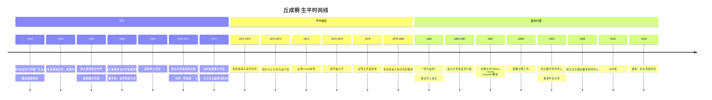
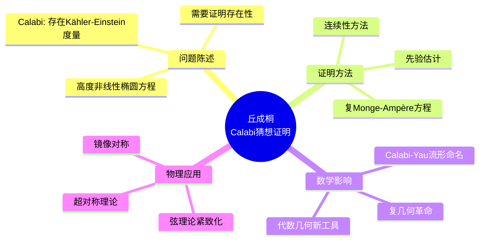
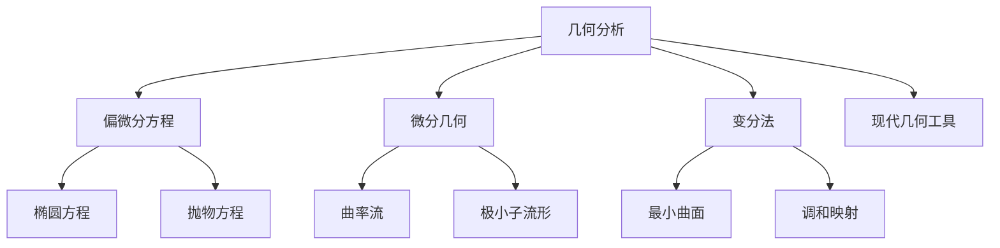
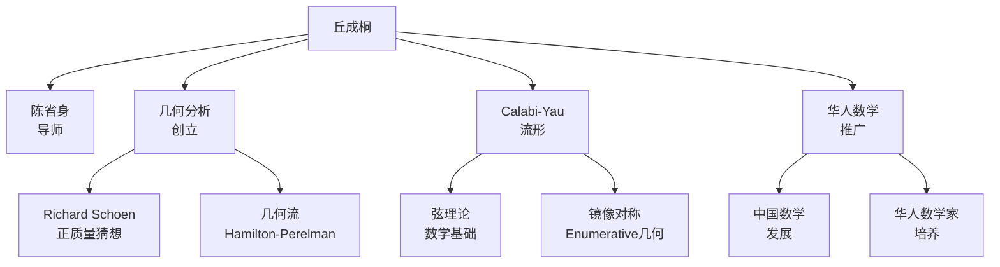

# 丘成桐 传记

> "数学的美在于它揭示了宇宙的基本真理。"
> —— 丘成桐

---

## 一、生平时间线

### 早年与教育 (1949-1971)



### 重要生平节点

| 年份 | 年龄 | 事件 | 意义 |
|------|------|------|------|
| 1949 | 0 | 汕头出生 | 后移居香港 |
| 1966 | 17 | 进入中文大学 | 自学黎曼几何 |
| 1971 | 22 | 博士毕业 | 陈省身弟子 |
| 1973 | 24 | Calabi猜想 | 微分几何重大突破 |
| 1976 | 27 | 正质量猜想 | 广义相对论的数学证明 |
| 1982 | 33 | **菲尔兹奖** | **首位华人得主** |
| 1987 | 38 | 哈佛教授 | 几何分析中心 |
| 2010 | 61 | Wolf奖 | 终身成就奖 |

---

## 二、主要数学贡献

### 2.1 Calabi猜想与Calabi-Yau流形 (1976-1978)

**Calabi猜想的证明**

这是20世纪微分几何最重要的成就之一：



**Calabi猜想详述：**

**Eugenio Calabi的猜想 (1954)：**

在紧Kähler流形 $M$ 上，给定第一陈类 $c_1(M)$，是否存在唯一的Kähler-Einstein度量？

**丘成桐的贡献 (1976)：**

- 证明 $c_1(M) = 0$ 情形：Ricci平坦Kähler度量存在
- 证明 $c_1(M) < 0$ 情形：负曲率Kähler-Einstein度量存在
- Aubin独立证明了部分结果

**Calabi-Yau流形：**

- 三维紧Ricci平坦Kähler流形
- 基本群有限
- 在弦理论中至关重要

### 2.2 正质量猜想 (1979)

**广义相对论的数学证明**

与Schoen合作证明了：

```
在渐近平坦的时空上，ADM质量非负，
且等于零当且仅当是平坦时空。
```

**历史意义：**

| 方面 | 影响 | 具体 |
|------|------|------|
| **物理学** | 广义相对论稳定性 | 时空的正能定理 |
| **数学** | 几何分析方法 | 极小曲面技术 |
| **微分几何** | 流形的刚性 | 渐近几何理论 |

### 2.3 几何分析的诞生 (1970s-1980s)

**几何分析的创立**

丘成桐将偏微分方程方法引入微分几何：



**关键贡献：**

1. **调和映射理论**
   - 能量极小映射的存在性
   - 应用到刚性定理

2. **极小子流形**
   - Plateau问题的新方法
   - 正质量猜想的证明工具

3. **Monge-Ampère方程**
   - Calabi猜想的证明核心
   - 复几何的基本工具

### 2.4 镜像对称 (1990s)

**数学物理的交汇**

Strominger-Yau-Zaslow猜想：

```
镜像对称可以通过SYZ纤维化来理解：
两个Calabi-Yau流形是镜像的当且仅当它们
可以通过T对偶联系起来。
```

**数学影响：**

- Gromov-Witten不变量
- 计数几何
- 同调镜像对称

### 2.5 其他重要贡献

**Kähler-Einstein度量：**

- K-稳定性的研究
- 与代数几何的联系
- 近期突破（Chen-Donaldson-Sun）

**图论与网络：**

- 谱图理论
- 网络的谱几何
- 社交网络分析

**计算数学：**

- 图像处理中的几何方法
- 机器学习与几何

---

## 三、代表作品分析

### 3.1 《微分几何讲义》(1980)

**出版信息：**

- 在伯克利和斯坦福的讲义
- 多次再版

**核心内容：**

- 黎曼几何的现代观点
- 几何分析的基础
- 曲率与拓扑的联系

**历史地位：**
> "这是学习现代微分几何的必读之作。"

### 3.2 《广义相对论中的数学》(1984)

**出版信息：**

- 与Schoen合著
- 正质量猜想的详细证明

**内容涵盖：**

- 几何分析方法
- 极小曲面技术
- 广义相对论的数学

### 3.3 《几何分析与Calabi-Yau流形》(2008)

**出版信息：**

- 研究论文合集
- 弦理论数学基础

**主要内容：**

- Calabi-Yau几何
- 镜像对称
- 弦理论数学

---

## 四、学术影响力和传承

### 4.1 学术传承图谱



### 4.2 对现代数学的深远影响

| 领域 | 影响 | 具体体现 |
|------|------|----------|
| **微分几何** | 几何分析创立 | PDE方法在几何中的应用 |
| **复几何** | Calabi-Yau流形 | 弦理论数学基础 |
| **广义相对论** | 正质量定理 | 时空的稳定性 |
| **数学物理** | 镜像对称 | 弦理论、枚举几何 |
| **华人数学** | 桥梁作用 | 中美数学交流 |

### 4.3 学术传承链条

```
陈省身 → 丘成桐 → 几何分析学派 → Perelman, 华人数学家群体
                 ↓
            Calabi-Yau几何 → 弦理论数学
```

---

## 五、个人风格和工作方法

### 5.1 独特的数学视野

**"数学与物理的统一"**

丘成桐相信：

> "数学和物理学是相互启发的。物理学家的问题常常导致数学的突破。"

### 5.2 工作方法特点

| 特点 | 描述 | 例子 |
|------|------|------|
| **分析技巧** | 深厚的偏微分方程功底 | Calabi猜想证明 |
| **几何直观** | 强烈的空间直觉 | Calabi-Yau流形的构造 |
| **物理联系** | 关注数学物理问题 | 正质量猜想、镜像对称 |
| **长期坚持** | 数十年专注于一个问题 | Kähler-Einstein度量 |
| **推广传承** | 培养年轻数学家 | 数学中心的建立 |

### 5.3 与中国数学

**数学中心的建立：**

1. **香港中文大学数学科学研究所** (2003)
   - 推动香港数学发展
   - 连接中西数学界

2. **北京国际数学研究中心** (2009)
   - 北京大学
   - 中国数学国际化的平台

3. **清华大学丘成桐数学科学中心** (2009)
   - 培养年轻数学人才
   - 推动几何分析研究

**丘成桐数学竞赛：**

- 面向中学生
- 培养数学兴趣
- 发现数学人才

### 5.4 个性与争议

**直言不讳：**

- 经常批评中国教育和科研体制
- 对数学界的不当现象提出批评
- 引发过一些争议

**对数学的执着：**

- 数十年如一日的工作
- 即使在高龄仍活跃研究
- 对数学美的追求

---

## 六、历史评价和轶事

### 6.1 同时代人的评价

> "丘成桐是微分几何的巨人。他的工作定义了这个领域的现代面貌。"
> —— **陈省身**

> "Calabi猜想的证明是20世纪几何学最伟大的成就之一。"
> —— **Nigel Hitchin**

> "丘成桐不仅在数学上做出了杰出贡献，还为华人数学家在国际舞台上建立了地位。"
> —— **Shing-Tung Yau的学生们**

### 6.2 重要轶事

#### 1. Calabi猜想的证明过程

1973年，丘成桐开始攻击Calabi猜想。经过三年的艰苦工作，他证明了猜想的正确性。当他在斯坦福展示结果时，整个数学界震惊了。

Calabi本人最初不相信证明，但经过仔细验证后，他承认这是正确的。两人从此成为好友。

#### 2. 菲尔兹奖演讲

1982年，丘成桐在Varshava国际数学家大会上获得菲尔兹奖。他是首位获此殊荣的华人数学家，这一成就激励了无数华人学子投身数学。

#### 3. 培养人才

丘成桐培养了超过70名博士，其中包括许多杰出的数学家。他常说："培养下一代比自己的研究更重要。"

### 6.3 历史地位

**主要荣誉：**

- 1982年：菲尔兹奖（首位华人得主）
- 1994年：Crafoord Prize
- 2010年：Wolf奖
- 2018年：Marcel Grossmann奖
- 多国科学院院士

**学术地位：**

- 微分几何的巨人
- 几何分析的创始人
- 华人数学的骄傲
- 数学教育的推动者

---

## 七、相关数学概念链接

### 7.1 核心概念

- [Calabi-Yau流形](../concept/calabi_yau_manifold.md)
- [Kähler-Einstein度量](../concept/kahler_einstein_metric.md)
- [正质量定理](../concept/positive_mass_theorem.md)
- [几何分析](../concept/geometric_analysis.md)
- [镜像对称](../concept/mirror_symmetry.md)
- [Ricci流](../concept/ricci_flow.md)

### 7.2 相关数学家

- [陈省身传记](./15-陈省身传记.md)
- [Edward Witten传记](./21-Edward_Witten传记.md)
- [Richard Schoen传记](./23-Richard_Schoen传记.md)

### 7.3 相关主题

- [微分几何史](./17-微分几何史.md)
- [几何分析发展](./31-几何分析发展.md)
- [弦理论数学基础](./32-弦理论数学基础.md)

---

## 八、延伸阅读

### 原始文献

1. Yau, S.-T. (1978). "On the Ricci curvature of a compact Kähler manifold"
2. Yau, S.-T. (1978). "On the Ricci curvature of a compact Kähler manifold and the complex Monge-Ampère equation"
3. Schoen, R. & Yau, S.-T. (1979). "On the proof of the positive mass conjecture"
4. Yau, S.-T. (2009). "The Founders of Index Theory" (关于Atiyah-Singer)

### 传记与研究

1. Yau, S.-T. (2010). *The Shape of Inner Space* (与Steve Nadis合著，自传体)
2. C.-C. Liu & S.-T. Yau (2006). "Transformations of Mathematical Structures"
3. Hitchin, N.J. (1987). "The work of Shing-Tung Yau" (Fields奖解说)
4. 《丘成桐诗文集》- 展示其文学素养

---

**创建日期：** 2026年4月
**最后更新：** 2026年4月
**文档类别：** 数学史 - 20世纪数学大师
