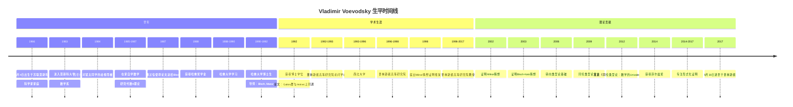
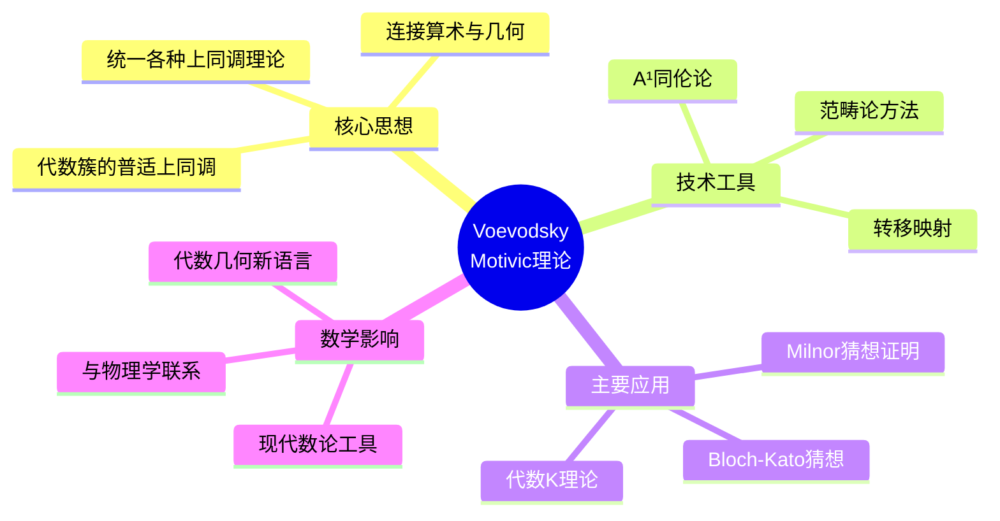
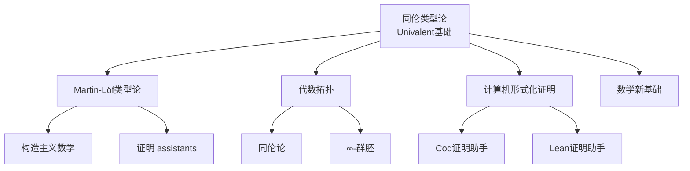
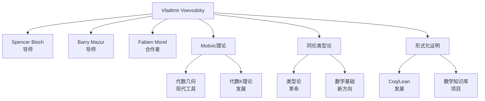

# Vladimir Voevodsky 传记

> "我们需要一个新的数学基础，能够理解现代数学中真正重要的内容。"
> —— Vladimir Voevodsky

---

## 一、生平时间线

### 早年与教育 (1966-1992)



### 重要生平节点

| 年份 | 年龄 | 事件 | 意义 |
|------|------|------|------|
| 1966 | 0 | 莫斯科出生 | 苏联科学精英家庭 |
| 1984 | 18 | 被大学开除 | 政治原因 |
| 1988 | 22 | 进入哈佛 | 国际数学界的认可 |
| 1992 | 26 | 博士毕业 | Galois理论与代数K理论 |
| 2002 | 36 | Milnor猜想 | 代数K理论重大突破 |
| 2003 | 37 | Bloch-Kato猜想 | Galois上同调里程碑 |
| 2012 | 46 | 同伦类型论 | 数学基础革命 |
| 2014 | 48 | **菲尔兹奖** | 数学最高荣誉 |
| 2017 | 51 | 逝世 | 留下革命性遗产 |

---

## 二、主要数学贡献

### 2.1 Motivic上同调与Milnor猜想 (1990s-2002)

**Motivic上同调理论**

Voevodsky开创了motivic上同调理论：



**Milnor猜想 (1970) 的证明 (2002)**

**猜想陈述：**

对于域 $F$，Milnor K-理论到Galois上同调的映射是同构：

$$K_n^M(F)/2 \cong H^n_{et}(F, \mu_2^{\otimes n})$$

**历史意义：**

| 方面 | 影响 | 具体 |
|------|------|------|
| **代数K理论** | 与Galois上同调的联系 | 两大学科的统一 |
| **二次型理论** | Witt群的计算 | 代数核心问题 |
| **数论** | 高维类域论 | 现代数论工具 |

### 2.2 Bloch-Kato猜想 (2003)

**更广泛的突破**

Milnor猜想的推广，对于所有素数 $\ell$：

$$K_n^M(F)/\ell \cong H^n_{et}(F, \mu_\ell^{\otimes n})$$

**技术突破：**

- motivic上同调的深入发展
- 稳定同伦范畴的构造
- 复杂的技术论证

**与Rost的合作：**

- Markus Rost提供了关键引理
- 两人共享这一荣誉
- 展示了数学合作的典范

### 2.3 同伦类型论 (2006-2017)

**数学基础的革命**



**Univalence公理：**

```
等价即相等 (Equivalence is Equality)

如果两个类型是等价的，那么它们在类型论中就是相等的。
```

**历史意义：**

| 方面 | 影响 | 具体 |
|------|------|------|
| **数学基础** | 新公理化系统 | 替代ZFC的替代方案 |
| **计算机证明** | 形式化验证 | Coq、Lean系统 |
| **数学实践** | 证明重构 | 更自然的证明方式 |

### 2.4 计算机形式化证明 (2010s)

**对证明严谨性的追求**

Voevodsky晚年致力于：

1. **数学的形式化**
   - 将所有数学证明形式化
   - 消除人为错误
   - 建立可验证的数学知识库

2. **证明助手的发展**
   - Coq系统的贡献
   - Unimath项目的创立
   - 现代Lean系统的基础

3. **对数学界的倡导**
   - 呼吁重视证明的正确性
   - 担心复杂证明中的错误
   - 形式化验证的必要性

---

## 三、代表作品分析

### 3.1 Motivic上同论论文 (1990s-2000s)

**系列论文：**

- "A¹-homotopy theory" (1999，与Morel)
- "Triangulated categories of motives" (2000)
- "Motivic cohomology groups are isomorphic to higher Chow groups"

**核心贡献：**

- 建立了motivic上同调的严格基础
- 发展了A¹同伦论
- 为Milnor猜想铺路

### 3.2 Milnor与Bloch-Kato猜想的证明 (2002-2003)

**论文：**

- "Motivic cohomology with Z/2-coefficients"
- "On motivic cohomology with Z/l-coefficients"

**技术特点：**

- 数百页的复杂证明
- 创新的技术工具
- 与Rost的紧密合作

### 3.3 《同伦类型论》(2013)

**出版信息：**

- 与Awodey, Coquand等合作
- 普林斯顿高等研究院出版
- 在线免费获取

**核心内容：**

- Univalence公理的引入
- 同伦类型论的公理化
- 数学新基础

**历史地位：**
> "这可能是自集合论以来最重要的数学基础研究。"

---

## 四、学术影响力和传承

### 4.1 学术传承图谱



### 4.2 对现代数学的深远影响

| 领域 | 影响 | 具体体现 |
|------|------|----------|
| **代数几何** | Motivic上同调 | 现代数论标准工具 |
| **代数K理论** | Milnor猜想 | Galois上同调的统一 |
| **数学基础** | 同伦类型论 | ZFC的替代方案 |
| **计算机科学** | 形式化证明 | Coq、Lean系统 |
| **数理逻辑** | Univalence公理 | 类型论的新发展 |

### 4.3 学术传承链条

```
Grothendieck → Motives理论 → Bloch → Voevodsky → Motivic上同调
                                                        ↓
                                                Milnor/Bloch-Kato
                                                        ↓
                                                现代数论工具
```

---

## 五、个人风格和工作方法

### 5.1 独特的数学视野

**"深刻的概念创新"**

Voevodsky相信：

> "真正重要的数学是创造新概念，而不仅仅是证明定理。"

### 5.2 工作方法特点

| 特点 | 描述 | 例子 |
|------|------|------|
| **概念驱动** | 先建立概念框架 | Motivic上同调 |
| **技术精湛** | 复杂的技术论证 | Milnor猜想证明 |
| **远见卓识** | 看到长远影响 | 同伦类型论 |
| **形式化追求** | 追求绝对严格 | 晚年形式化工作 |
| **独立工作** | 长时间独立思考 | 被开除后的自学 |

### 5.3 与其他数学家的关系

**与Spencer Bloch：**

- 导师与学生
- 共同兴趣在代数K理论
- Bloch引导Voevodsky进入高阶Chow群

**与Fabien Morel：**

- 密切合作者
- A¹同伦论的共同创立者
- 长期友谊

**与Markus Rost：**

- Bloch-Kato猜想的共同解决者
- 互补的技术
- 尊重的合作关系

### 5.4 性格特点

**独立精神：**

- 被大学开除后自学成才
- 不屈服于权威
- 坚持自己的数学愿景

**对严谨的追求：**

- 晚年转向形式化证明
- 担心复杂证明中的错误
- 对数学界现状的批评

**早逝的遗憾：**

- 51岁英年早逝
- 同伦类型论项目未完成
- 数学界的巨大损失

---

## 六、历史评价和轶事

### 6.1 同时代人的评价

> "Voevodsky的工作彻底改变了代数K理论和motivic上同调。他的视野是革命性的。"
> —— **Spencer Bloch**

> "Milnor猜想的证明是代数几何的里程碑。Voevodsky创造了全新的技术。"
> —— **Pierre Deligne**

> "他对同伦类型论的工作可能是自集合论以来最重要的基础数学研究。"
> —— **Steve Awodey**

### 6.2 重要轶事

#### 1. 自学成才的道路

1984年被莫斯科大学开除后，Voevodsky在家自学数学。他通过阅读Bloch的论文，发展了自己的想法，最终通过信件与Bloch建立联系，获得哈佛奖学金。

#### 2. Milnor猜想的证明过程

Voevodsky花了近10年时间发展motivic上同调理论。2002年，他终于完成了Milnor猜想的证明。据说他在证明完成后说："这比我预期的要困难得多。"

#### 3. 转向类型论

2006年，Voevodsky突然宣布转向数学基础研究。许多人不理解，但他坚持认为数学需要新的基础。这一转变最终导致了同伦类型论的诞生。

### 6.3 历史地位

**主要荣誉：**

- 2002年：欧洲数学会奖
- 2014年：**菲尔兹奖**
- 多国科学院院士

**学术地位：**

- motivic上同论的创始人
- 代数K理论的巨人
- 同伦类型论的奠基人
- 形式化证明的先驱

---

## 七、相关数学概念链接

### 7.1 核心概念

- [Motivic上同调](../concept/motivic_cohomology.md)
- [A¹同伦论](../concept/a1_homotopy_theory.md)
- [Milnor K-理论](../concept/milnor_k_theory.md)
- [同伦类型论](../concept/homotopy_type_theory.md)
- [Univalence公理](../concept/univalence_axiom.md)
- [形式化证明](../concept/formalized_proof.md)

### 7.2 相关数学家

- [Spencer Bloch传记](./24-Spencer_Bloch传记.md)
- [Markus Rost传记](./25-Markus_Rost传记.md)
- [Per Martin-Löf传记](./26-Per_Martin-Löf传记.md)

### 7.3 相关主题

- [代数K理论史](./33-代数K理论史.md)
- [数学基础研究](./34-数学基础研究.md)
- [计算机形式化证明发展](./35-形式化证明发展.md)

---

## 八、延伸阅读

### 原始文献

1. Voevodsky, V. (1999). "A¹-homotopy theory" (with F. Morel)
2. Voevodsky, V. (2000). "Triangulated categories of motives"
3. Voevodsky, V. (2003). "Motivic cohomology with Z/2-coefficients" (Milnor猜想)
4. Voevodsky, V. (2013). "Homotopy Type Theory: Univalent Foundations of Mathematics"
5. Voevodsky, V. (2014). "The Origins and Motivations of Univalent Foundations"

### 传记与研究

1. Mazur, B. (2007). "On Voevodsky's Proof of the Milnor Conjecture"
2. Deligne, P. (2014). "Voevodsky's Work on Motives"
3. Awodey, S. (2014). "Type Theory and Homotopy"
4. 菲尔兹奖委员会 (2014). "Voevodsky Citation"

---

**创建日期：** 2026年4月
**最后更新：** 2026年4月
**文档类别：** 数学史 - 20世纪数学大师
