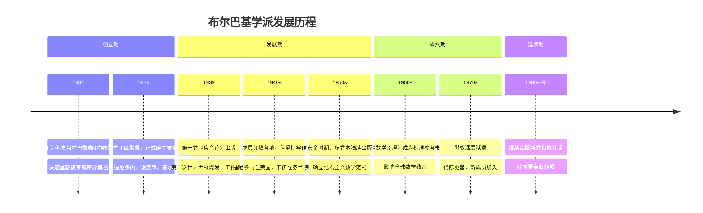
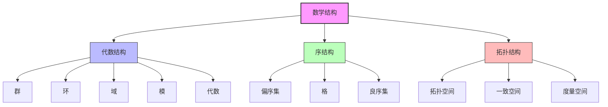
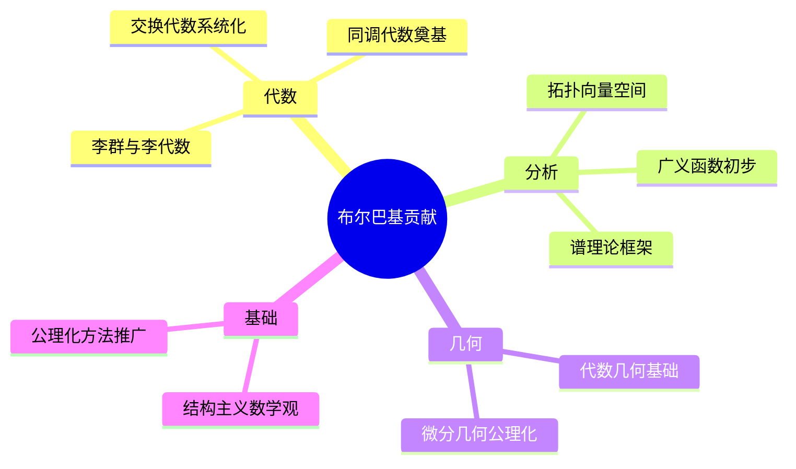
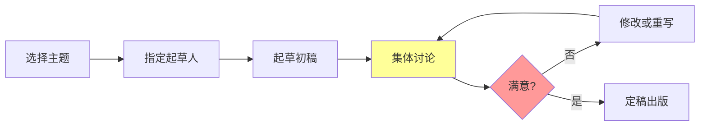

# 布尔巴基学派史

## 概述

布尔巴基学派（Bourbaki School）是20世纪最具影响力的数学学派之一，以尼古拉·布尔巴基（Nicolas Bourbaki）为集体笔名，致力于以结构主义的观点重构整个数学体系。其编写的《数学原理》（*Éléments de Mathématique*）系列是现代数学的奠基性著作。

---

## 历史背景

### 形成时期（1934-1935）

### 时代背景

- **危机中的法国数学**：第一次世界大战后，法国数学界出现代际断层
- **大学教育需求**：缺乏适合现代数学教学的标准教材
- **德国数学的影响**：希望赶超德国数学的严谨性和抽象性
- **结构主义思潮**：受当时哲学和科学发展影响

---

## 创始成员

### 核心人物

| 数学家 | 生卒年 | 主要贡献领域 | 在布尔巴基中的角色 |
|--------|--------|--------------|-------------------|
| **安德烈·韦伊** (André Weil) | 1906-1998 | 数论、代数几何 | 精神领袖，提出结构主义理念 |
| **亨利·嘉当** (Henri Cartan) | 1904-2008 | 多复变函数、同调代数 | 组织者，主持早期聚会 |
| **让·迪厄多内** (Jean Dieudonné) | 1906-1992 | 泛函分析、代数几何 | 主要撰写人，最多产 |
| **克劳德·谢瓦莱** (Claude Chevalley) | 1909-1984 | 代数群、类域论 | 代数卷的主要贡献者 |
| **让·德尔萨特** (Jean Delsarte) | 1903-1968 | 数论 | 创始成员之一 |
| **勒内·德·波塞尔** (René de Possel) | 1905-1974 | 测度论 | 早期成员 |

### 后期重要成员

- **洛朗·施瓦茨** (Laurent Schwartz, 1915-2002)：分布理论，1950年菲尔兹奖
- **让-皮埃尔·塞尔** (Jean-Pierre Serre, 1926-)：代数拓扑、代数几何，1954年菲尔兹奖
- **亚历山大·格罗滕迪克** (Alexander Grothendieck, 1928-2014)：代数几何革命
- **阿兰·孔涅** (Alain Connes, 1947-)：非交换几何，1982年菲尔兹奖

---

## 数学结构主义

### 三大基本结构

布尔巴基学派将数学结构分为三大类：

### 方法论原则

1. **公理化方法**：从公理出发构建理论
2. **结构统一**：不同数学领域共享相同结构
3. **一般化优先**：从最一般的概念开始
4. **严格性要求**：无漏洞的证明
5. **排斥几何直观**：强调形式化推理

---

## 《数学原理》系列

### 出版概况

| 卷号 | 书名（法语） | 首版年份 | 主要内容 |
|------|-------------|---------|---------|
| I | *Théorie des Ensembles* | 1939 | 集合论基础 |
| II | *Algèbre* | 1942 | 代数学 |
| III | *Topologie Générale* | 1940 | 一般拓扑学 |
| IV | *Fonctions d'une Variable Réelle* | 1951 | 实变函数 |
| V | *Espaces Vectoriels Topologiques* | 1953 | 拓扑向量空间 |
| VI | *Intégration* | 1952 | 积分论 |
| VII | *Algèbre Commutative* | 1961 | 交换代数 |
| VIII | *Groupes et Algèbres de Lie* | 1960 | 李群与李代数 |
| IX | *Théories Spectrales* | 1967 | 谱理论 |
| X | *Variétés Différentielles et Analytiques* | 1967-1971 | 微分流形 |

### 写作特色

- **集体创作**：每章经多次讨论和修改
- **严格筛选**：新成员需通过"布尔巴基考试"
- **匿名出版**：统一署名"尼古拉·布尔巴基"
- **彻底重写**：不满意时整章推倒重来

---

## 主要数学贡献

### 1. 概念统一与术语标准化

- **引入术语**：单射、满射、双射、滤子、一致空间
- **符号标准化**：空集符号 ∅、蕴含符号 ⇒、等价符号 ⇔
- **记号统一**：使用 ℕ, ℤ, ℚ, ℝ, ℂ 表示数集

### 2. 理论发展

### 3. 影响的数学分支

- **泛函分析**：拓扑向量空间的系统理论
- **代数几何**：提供现代语言基础
- **李群理论**：谢瓦莱的系统性工作
- **同调代数**：作为统一工具推广

---

## 学术特色

### 布尔巴基式工作方法

### 年会制度

- **地点**：法国各地（Écoulle, Celles-sur-Plage等）
- **频率**：每年三次，每次数周
- **形式**：逐字逐句讨论手稿
- **决策**：全体一致原则

### 成员守则

1. 55岁自动退休
2. 新成员由现有成员邀请
3. 保持匿名性（对外）
4. 不接受外界资助

---

## 影响与评价

### 积极影响

| 领域 | 影响 |
|------|------|
| **数学教育** | 现代数学教材的范本 |
| **术语标准化** | 全球统一的数学语言 |
| **研究范式** | 结构主义成为主流 |
| **年轻数学家** | 培养大批杰出学者 |

### 批评与争议

- **过于抽象**：忽视具体问题和计算
- **排斥几何**：缺乏几何直观和物理联系
- **忽视应用**：不关心数学与科学的联系
- **独断风格**：认为只有公理化才是严格数学

### 历史评价

> "布尔巴基的《数学原理》像一部现代数学的大教堂，宏伟壮丽，但有时让人感到冷漠。" —— 数学家评价

> "布尔巴基革命性地改变了我们思考数学的方式，无论你是否喜欢他们的风格。" —— 威廉·瑟斯顿

---

## 相关概念链接

- [集合论基础](../00-基础/01-集合论基础.md)
- [群论](../20-代数学/02-群论.md)
- [拓扑学](../30-几何拓扑/01-拓扑学基础.md)
- [泛函分析](../40-分析学/06-泛函分析.md)
- [代数几何](../20-代数学/10-代数几何.md)
- [安德烈·韦伊传记](../10-数学家/10-André_Weil.md)
- [亚历山大·格罗滕迪克传记](../10-数学家/10-Alexander_Grothendieck传记.md)

---

## 参考文献

1. Bourbaki, N. *Éléments de Mathématique*. Hermann / Springer.
2. Dieudonné, J. (1970). "The work of Nicholas Bourbaki". *American Mathematical Monthly*.
3. Mashaal, M. (2006). *Bourbaki: A Secret Society of Mathematicians*. AMS.
4. Aczel, A. D. (2006). *The Artist and the Mathematician*. Thunder's Mouth Press.
5. 胡作玄 (2002). 《布尔巴基学派的兴衰》. 知识出版社.

---

*文档创建时间：2026年4月*
*最后更新：2026年4月*
*分类：数学史 / 数学学派*
