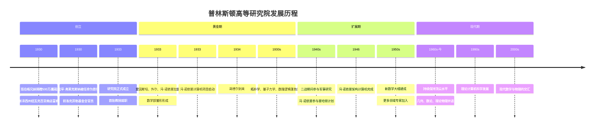
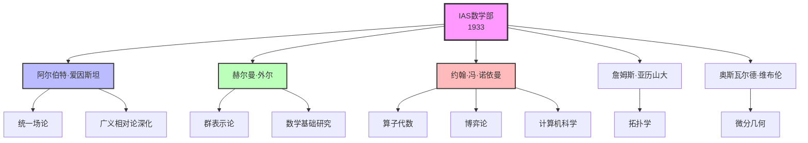
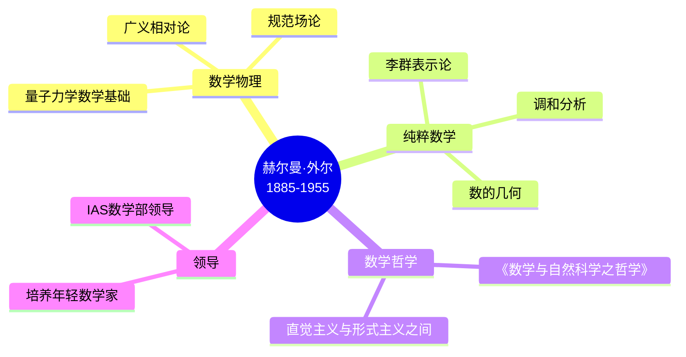
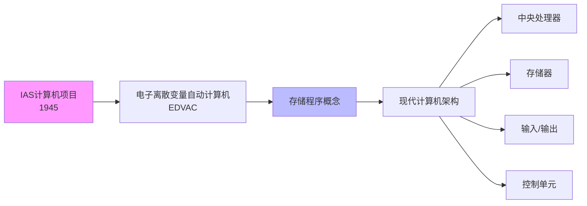
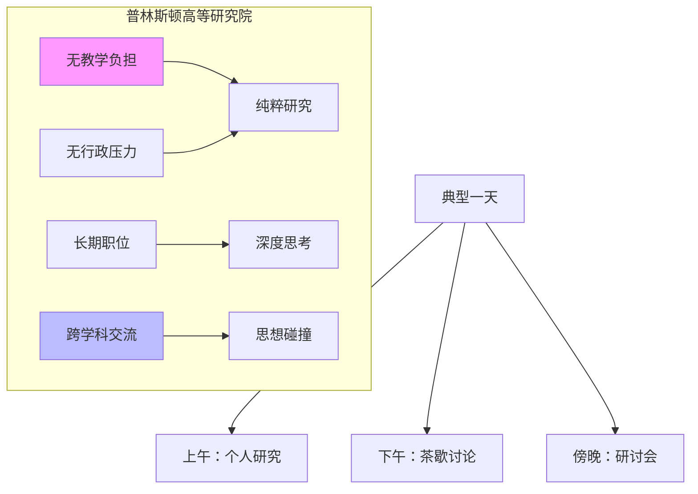
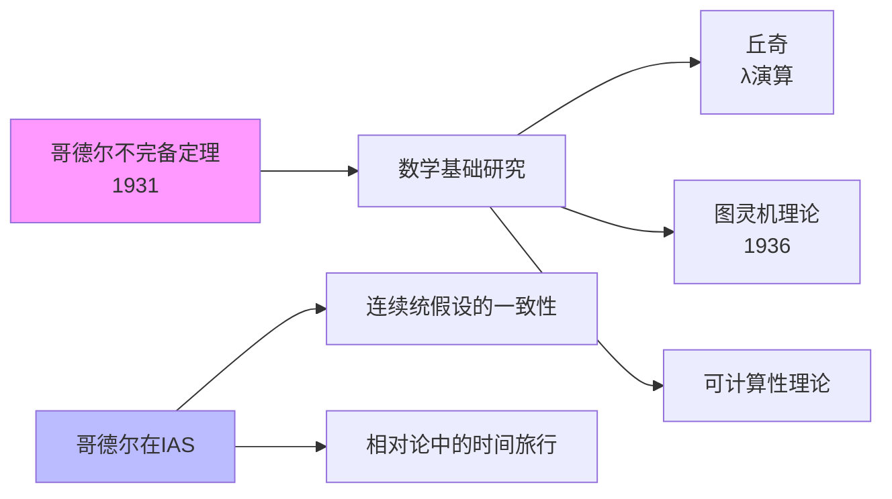
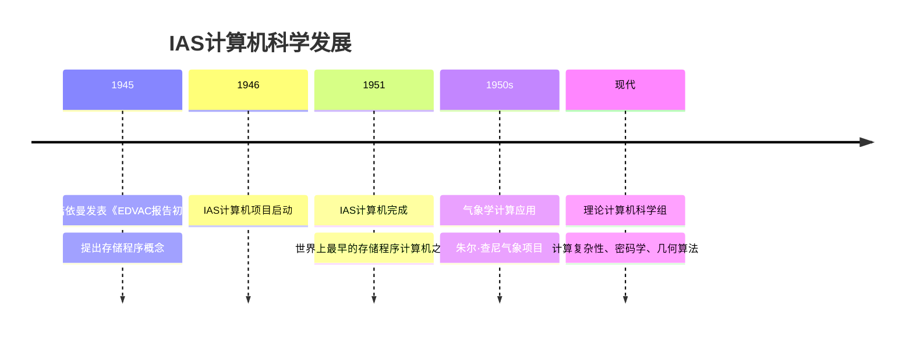
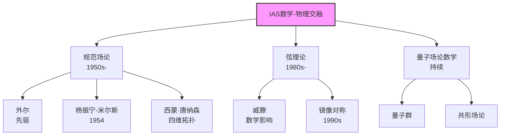
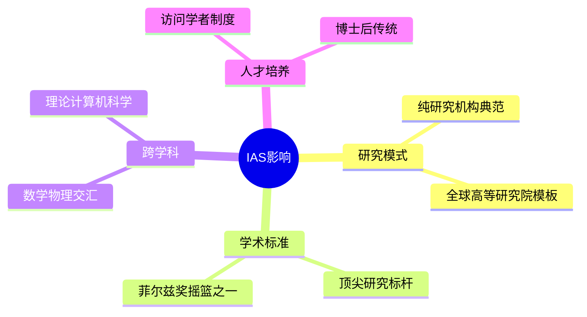

# 普林斯顿高等研究院数学史

## 概述

普林斯顿高等研究院（Institute for Advanced Study, IAS）是世界最顶尖的学术研究机构之一，其数学部自1930年成立以来一直是全球数学研究的中心。这里汇聚了爱因斯坦、冯·诺依曼、外尔、哥德尔等20世纪最伟大的思想家，创造了现代数学史上最为辉煌的篇章。

---

## 创立背景

### 班伯格兄妹的愿景

### 弗莱克斯纳的理念

**《美国、英国和德国的大学》**（1930）中提出的理念：

> "研究需要绝对的安全和自由。学者应该被保护免受教学负担，全心投入到研究中。"

**核心原则**：

1. **无教学义务**：纯粹的研究机构
2. **无行政负担**：学者专注于学术
3. **长期聘用**：提供学术安全感
4. **精英小班**：少而精的研究人员
5. **跨学科交流**：数学、物理、历史、社会科学并存

---

## 数学部的创建

### 首批教授

---

## 核心人物

### 阿尔伯特·爱因斯坦 (Albert Einstein, 1879-1955)

| 方面 | 详情 |
|------|------|
| **任期** | 1933-1955（直至去世） |
| **职位** | 终身教授 |
| **研究** | 统一场论、引力波、量子力学基础 |
| **影响** | 提升了IAS的世界声誉 |

**在IAS的工作**：

- 试图建立引力和电磁力的统一理论
- 与哥德尔建立深厚友谊（两人每天一起散步）
- 与伯格曼(Bargmann)和瓦伦特(Valentine)合作
- 晚年对量子力学的解释保持批判态度

### 赫尔曼·外尔 (Hermann Weyl, 1885-1955)

**主要贡献**：

- **表示论**：紧李群的表示理论
- **规范理论**：外尔规范理论（现代规范场论的先驱）
- **相对论**：与外尔张量相关的贡献
- **数学哲学**：《数学与自然科学之哲学》(1926)

### 约翰·冯·诺依曼 (John von Neumann, 1903-1957)

| 时期 | 贡献领域 |
|------|---------|
| **1933-1957** | 算子代数、遍历理论、博弈论、计算机科学 |
| **1930s** | 冯·诺依曼代数、量子力学基础 |
| **1940s** | 曼哈顿计划、流体力学、冲击波 |
| **1945** | 冯·诺依曼计算机架构 |
| **1944** | 《博弈论与经济行为》（与摩根斯顿合著） |

**冯·诺依曼在IAS的计算机项目**：

### 库尔特·哥德尔 (Kurt Gödel, 1906-1978)

- **到来**：1933年首次访问，1940年永久定居
- **职位**：教授（1953-1976）
- **研究**：
  - 相对论中的宇宙学模型（允许时间旅行的解）
  - 连续统假设的一致性证明
  - 哲学研究
- **晚年**：对健康极度担忧，最终因饥饿去世（拒绝进食）

### 其他重要成员

#### 詹姆斯·亚历山大 (James Alexander, 1888-1971)

- **领域**：拓扑学
- **贡献**：亚历山大多项式（纽结理论）、亚历山大大角球

#### 奥斯瓦尔德·维布伦 (Oswald Veblen, 1880-1960)

- **职位**：IAS首任数学部主席
- **贡献**：微分几何、拓扑学
- **影响**：招募了冯·诺依曼等人

---

## IAS的学术氛围

### 独特的研究环境

### 著名轶事

#### 爱因斯坦与哥德尔的友谊

> 爱因斯坦和哥德尔每天下午一起从办公室走回家。爱因斯坦曾说："我来研究院主要是为了能有资格和哥德尔一起散步回家。"

#### 茶歇文化

- **时间**：每天下午3-4点
- **地点**：富尔德楼公共休息室
- **活动**：自由讨论，不分等级
- **特色**：许多重要思想在此诞生

---

## 主要学术贡献

### 1. 数理逻辑与数学基础

### 2. 拓扑学

| 数学家 | 贡献 |
|--------|------|
| **亚历山大** | 纽结理论、亚历山大对偶 |
| **莱夫谢茨** | 代数拓扑（定期访问） |
| **斯廷罗德** | 上同调运算（访问学者） |
| **塞尔** | 同伦群计算（1950年代访问） |

### 3. 量子力学与数学物理

- **外尔**：量子力学的群论方法
- **冯·诺依曼**：量子力学的数学基础（希尔伯特空间形式化）
- **伯格曼**：量子场论
- **威格纳**（访问）：群论在物理中的应用

### 4. 计算机科学

### 5. 数论

- **赛尔伯格**（1949-）：黎曼假设、筛法、迹公式
- **韦伊**（访问）：代数几何、数论
- **朗兰兹**（1960s-）：朗兰兹纲领的诞生地

---

## 战后发展

### 新一代领袖

#### 阿特勒·赛尔伯格 (Atle Selberg, 1917-2007)

- **职位**：IAS教授（1951-1987）
- **贡献**：
  - 初等证明素数定理（1949）
  - 赛尔伯格迹公式
  - 筛法理论
- **荣誉**：1950年菲尔兹奖、1986年沃尔夫奖

#### 罗伯特·奥本海默 (J. Robert Oppenheimer)

- **职位**：IAS院长（1947-1966）
- **背景**：曼哈顿计划科学主任
- **贡献**：吸引物理学家，促进数物交流

### 数学与物理的交融

---

## 当代中国数学家与IAS

### 访问学者

| 数学家 | 时期 | 贡献 |
|--------|------|------|
| **陈省身** | 1943-1945 | 纤维丛理论、陈类 |
| **华罗庚** | 1946-1948 | 堆垒数论、自守函数 |
| **吴文俊** | 1947-1949 | 拓扑学（示性类） |
| **丘成桐** | 多次访问 | 卡拉比-丘流形、正质量猜想 |

### 陈省身在IAS

> 陈省身1943年来到IAS，与外尔密切合作。这一时期他完成了关于高斯-博内定理的内在证明，开创了示性类理论。陈省身后来称这段经历为"我科学生涯的转折点"。

---

## IAS的传承与影响

### 对世界数学的影响

### 当代IAS数学部

- **几何与拓扑**：四维流形、辛几何
- **数论**：朗兰兹纲领、算术几何
- **理论物理**：弦理论、量子引力
- **计算机科学**：计算复杂性、密码学

---

## 相关概念链接

- [集合论基础](../00-基础/01-集合论基础.md)
- [数理逻辑](../00-基础/03-数理逻辑.md)
- [哥德尔不完备定理](../00-基础/03-数理逻辑.md#哥德尔不完备定理)
- [拓扑学基础](../30-几何拓扑/01-拓扑学基础.md)
- [泛函分析](../40-分析学/06-泛函分析.md)
- [量子力学数学基础](../70-数学物理/01-量子力学数学基础.md)
- [陈类](../30-几何拓扑/10-纤维丛.md)
- [朗兰兹纲领](../20-代数学/16-朗兰兹纲领.md)

---

## 参考文献

1. Batterson, S. (2006). *Pursuit of Genius: Flexner, Einstein, and the Early Faculty at the Institute for Advanced Study*. AK Peters.
2. Regis, E. (1987). *Who Got Einstein's Office?* Addison-Wesley.
3. 赫尔曼·外尔. *Symmetry*. Princeton University Press, 1952.
4. 冯·诺依曼. *Mathematical Foundations of Quantum Mechanics*. Princeton University Press, 1932.
5. Edwards, P. N. (2010). *A Vast Machine: Computer Models, Climate Data, and the Politics of Global Warming*. MIT Press.

---

*文档创建时间：2026年4月*
*最后更新：2026年4月*
*分类：数学史 / 研究机构 / 普林斯顿*
