# 数学学科发展时间线

> 本文档展示数学各学科分支的起源、重要突破里程碑、交叉学科诞生，并对未来发展方向进行预测。

---

## 🌍 数学发展总览时间线

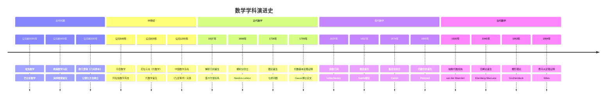

---

## 1️⃣ 各分支起源时间线

### 1.1 分析学演进

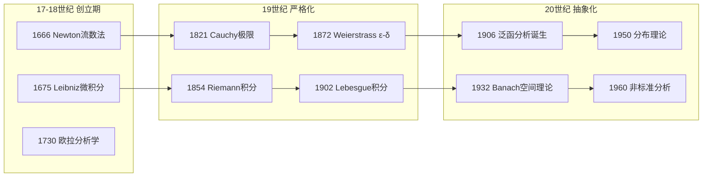

**关键里程碑表**

| 年份 | 事件 | 人物 | 意义 |
|------|------|------|------|
| 1666 | 流数法 | Newton | 微积分诞生 |
| 1675 | 微分符号 | Leibniz | 现代微积分符号 |
| 1730 | 分析学系统化 | Euler | 分析学成为独立学科 |
| 1821 | ε-语言 | Cauchy | 分析严格化开端 |
| 1872 | 实数理论 | Dedekind, Cantor | 极限概念基础化 |
| 1902 | Lebesgue积分 | Lebesgue | 测度论基础 |
| 1906 | 泛函分析 | Hadamard, Fréchet | 无限维空间分析 |
| 1932 | Banach空间 | Banach | 现代泛函分析框架 |

### 1.2 代数学演进

### 1.3 几何学演进

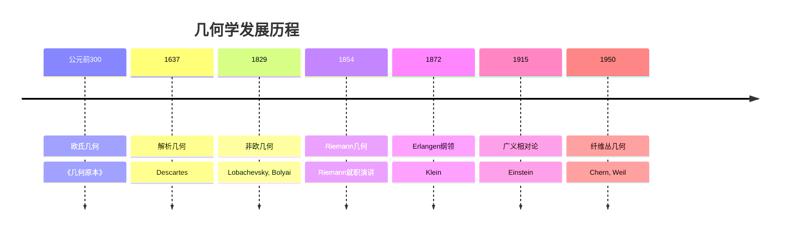

### 1.4 拓扑学演进

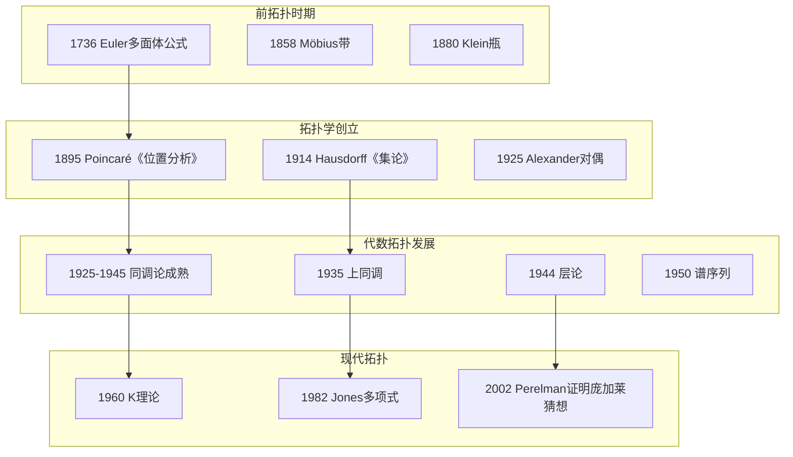

---

## 2️⃣ 重要突破里程碑

### 2.1 千年难题解决

**历史重大突破表**

| 年份 | 突破 | 数学家 | 影响 |
|------|------|--------|------|
| 1824 | 五次方程不可解 | Abel | 群论诞生契机 |
| 1873 | 超越数证明 | Hermite | 数论新方法 |
| 1896 | 素数定理证明 | Hadamard, de la Vallée Poussin | 解析数论成熟 |
| 1900 | Hilbert问题提出 | Hilbert | 20世纪数学纲领 |
| 1931 | 不完备定理 | Gödel | 数学基础革命 |
| 1963 | 连续统假设独立性 | Cohen | 集合论新阶段 |
| 1976 | 四色定理证明 | Appel-Haken | 计算机辅助证明 |
| 1983 | Faltings定理 | Faltings | Mordell猜想解决 |
| 1994 | 费马大定理 | Wiles | 椭圆曲线与模形式统一 |
| 2002 | 庞加莱猜想 | Perelman | 三维拓扑分类 |

### 2.2 理论框架建立

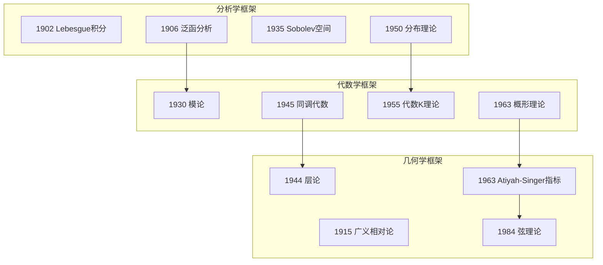

---

## 3️⃣ 交叉学科诞生

### 3.1 学科交叉网络

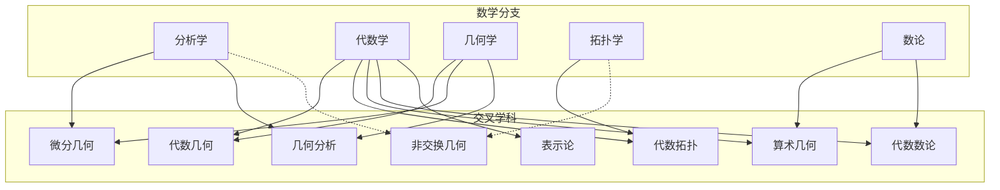

### 3.2 重要交叉学科时间线

| 交叉学科 | 诞生时间 | 关键人物 | 数学工具 | 现代应用 |
|----------|----------|----------|----------|----------|
| 代数几何 | 19世纪末 | Riemann, Noether | 交换代数、层论 | 弦理论、密码学 |
| 代数拓扑 | 1895-1945 | Poincaré, Eilenberg | 同调论、同伦论 | 数据科学、机器人 |
| 微分几何 | 1854-1915 | Riemann, Einstein | 张量分析、流形 | 广义相对论、CG |
| 算术几何 | 1960s | Grothendieck, Tate | 概形、étale上同调 | 密码学、BSD猜想 |
| 表示论 | 1890s-现在 | Frobenius, Weyl | 李群、特征标 | 量子物理、组合 |
| 非交换几何 | 1980s | Connes | 算子代数、K理论 | 标准模型、宇宙学 |
| 几何分析 | 1980s | Yau, Schoen | 椭圆PDE、曲率流 | 庞加莱猜想证明 |

### 3.3 21世纪新兴交叉领域

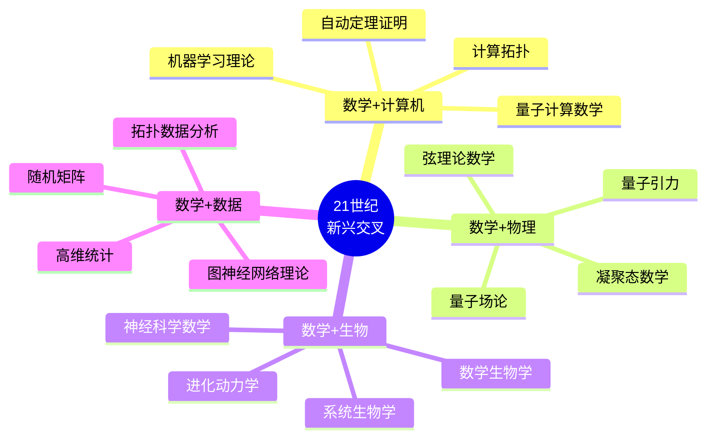

---

## 4️⃣ 未来发展方向预测

### 4.1 2025-2050 预测时间线

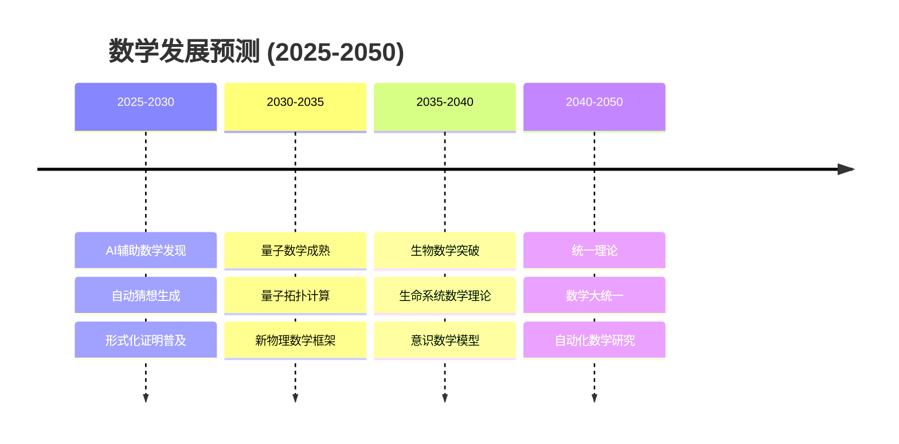

### 4.2 重点发展方向

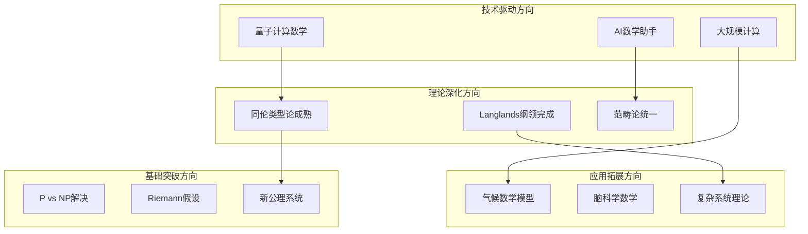

### 4.3 预测详情表

| 领域 | 当前状态 | 5年预测 | 20年预测 | 关键挑战 |
|------|----------|---------|----------|----------|
| **AI数学** | 辅助证明 | 自动猜想 | 自主发现 | 创造性形式化 |
| **量子数学** | 理论基础 | 算法应用 | 新数学结构 | 物理实现 |
| **形式化** | 大型项目 | 标准工具 | 普及使用 | 用户友好性 |
| **拓扑数据** | 新兴领域 | 工业应用 | 标准方法 | 计算效率 |
| **Langlands** | 部分进展 | 几何侧突破 | 数论侧突破 | 深层联系 |
| **生物学** | 模型构建 | 预测能力 | 理论框架 | 复杂性处理 |

---

## 5️⃣ 数学与其他学科的互动

### 5.1 数学→科学输出

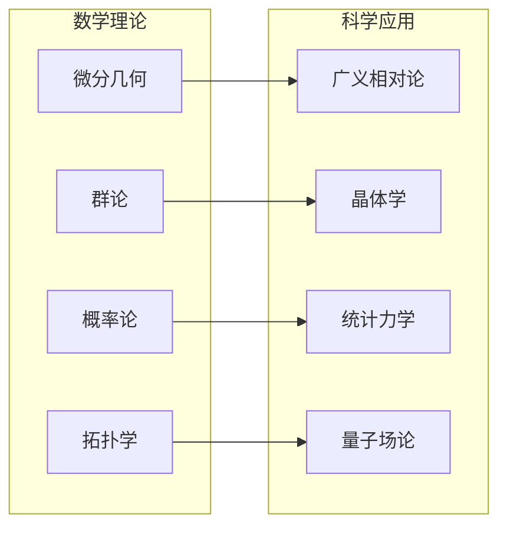

### 5.2 科学→数学反馈

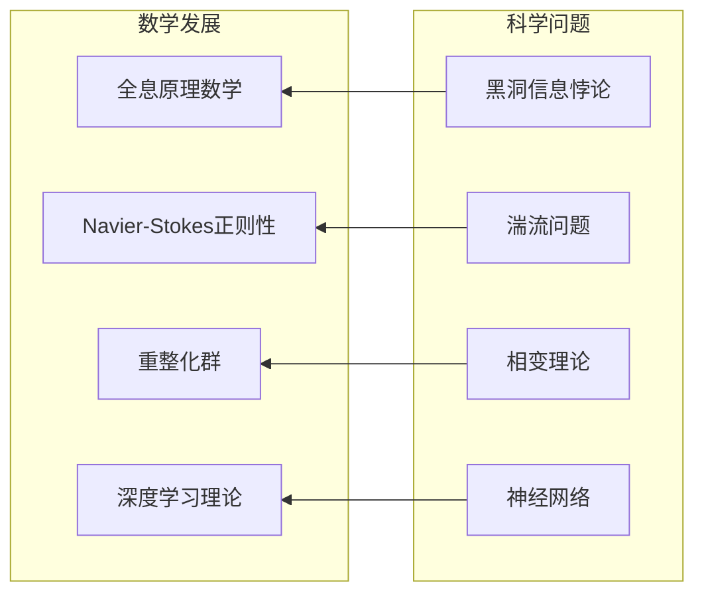

---

## 📚 历史文献推荐

| 时期 | 经典文献 | 现代解读 | 学习价值 |
|------|----------|----------|----------|
| 古希腊 | 《几何原本》 | Hartshorne《几何学》 | 公理化思维 |
| 17世纪 | 《自然哲学的数学原理》 | Chandrasekhar解读 | 物理数学化 |
| 19世纪 | 《算术研究》 | Cox《Galois理论》 | 现代数论起源 |
| 20世纪 | EGA/SGA | Vakil《代数几何》 | 现代代数几何 |
| 当代 | Perelman论文 | Morgan-Tian专著 | 几何分析巅峰 |

---

> **反思**：数学发展史是一部人类抽象思维不断深化的历史。从具体的几何图形到抽象的代数结构，从有限的计算到无限的探索，数学始终在扩展人类认知的边界。

---

*本文档梳理数学学科发展脉络 | FormalMath 项目组 | 2026-04*
