# 核心定理依赖关系图

> 本文档展示数学核心定理之间的逻辑依赖关系，绘制从基础公理到重大定理的证明路径网络。

---

## 🕸️ 全局定理依赖网络

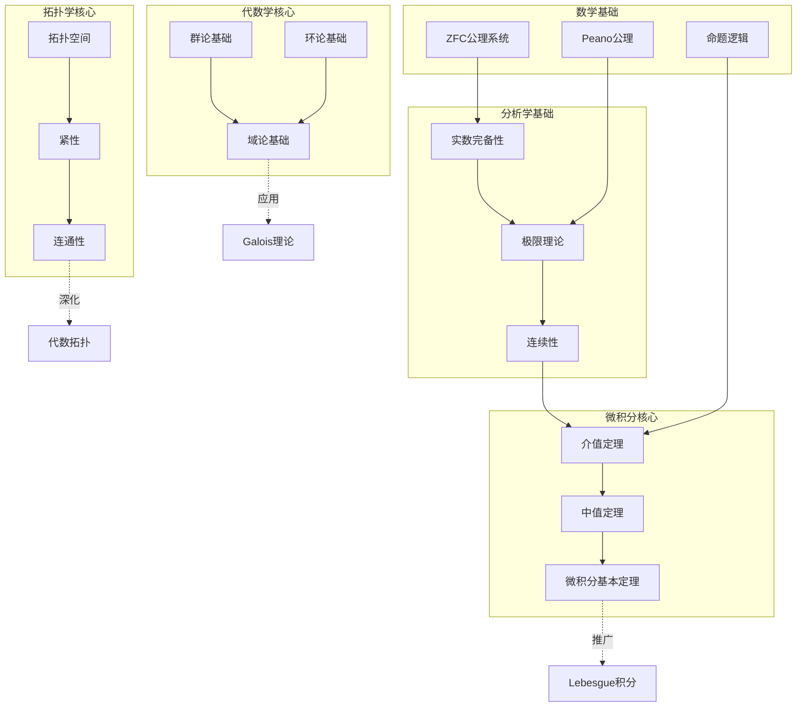

---

## 1️⃣ 微积分基本定理依赖链

### 1.1 完整依赖路径

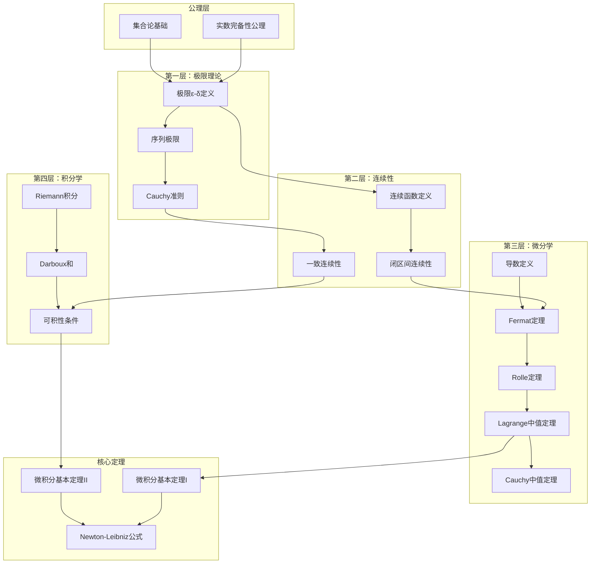

### 1.2 微积分基本定理的多视角表征

| 表征方式 | 陈述形式 | 直观理解 | 应用领域 |
|----------|----------|----------|----------|
| 经典形式 | ∫ₐᵇ f'(x)dx = f(b) - f(a) | 变化率的累积等于总变化 | 物理学 |
| 几何形式 | 曲线下的面积与切线斜率互逆 | 微分与积分的对偶性 | 工程计算 |
| 分析形式 | d/dx ∫ₐˣ f(t)dt = f(x) | 积分是微分的逆运算 | 实分析 |
| 范畴形式 | 微分和积分是伴随函子 | 对偶范畴间的映射 | 高等数学 |
| 物理形式 | 功-能定理 | 力做的功等于能量变化 | 力学 |

### 1.3 推广与深化

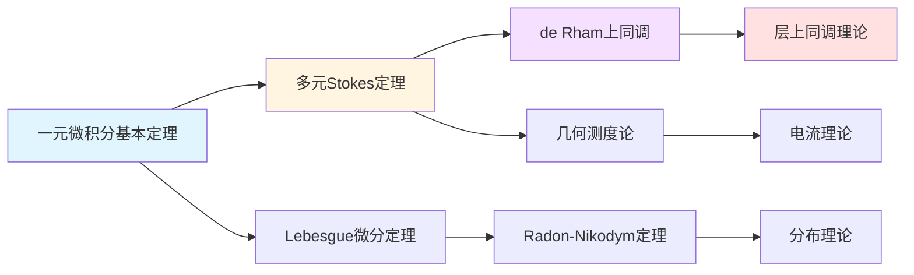

---

## 2️⃣ 代数基本定理证明路径

### 2.1 证明方法全景图

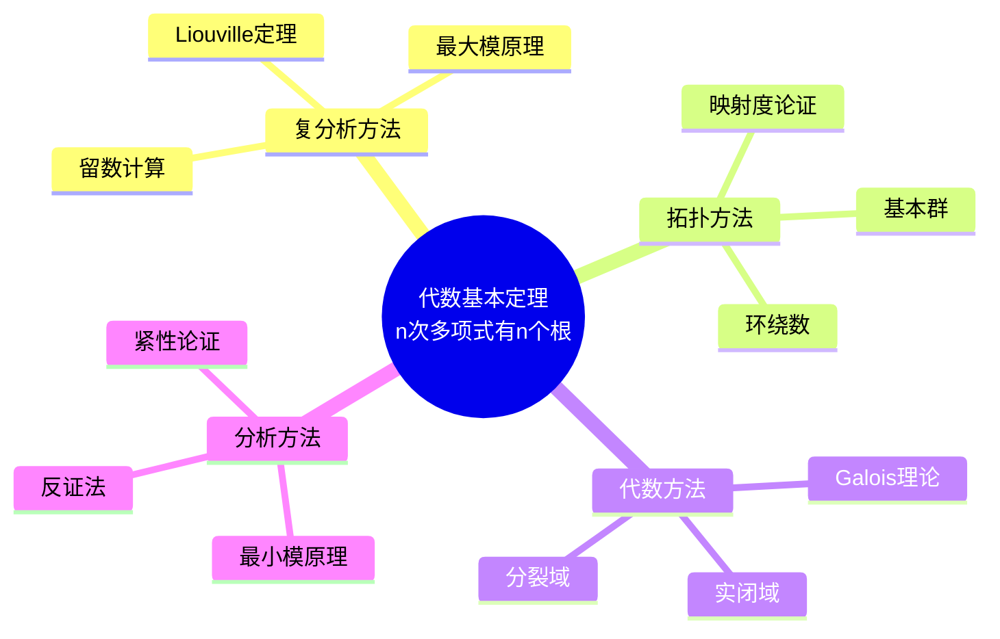

### 2.2 各证明路径详解

#### 路径一：复分析证明（最经典）

```mermaid
flowchart LR
    A[假设P(z)无零点] --> B[1/P(z)全纯]
    B --> C[当|z|→∞, 1/P(z)→0]
    C --> D[1/P(z)有界全纯]
    D --> E[Liouville定理]
    E --> F[1/P(z)常数]
    F --> G[矛盾！]
    
    style G fill:#ffcccc
```

**依赖链**：复数完备性 → 全纯函数定义 → Cauchy积分定理 → Cauchy估计 → Liouville定理 → 代数基本定理

#### 路径二：拓扑证明

```mermaid
flowchart LR
    A[考虑P(re^iθ)] --> B[诱导映射S¹→S¹]
    B --> C[计算环绕数]
    C --> D[n次多项式环绕n次]
    D --> E[若无非零零点则环绕0次]
    E --> F[矛盾！]
    
    style F fill:#ffcccc
```

**依赖链**：拓扑空间 → 连续映射 → 基本群 → 映射度 → 代数基本定理

#### 路径三：Galois理论证明

```mermaid
flowchart TB
    A[实数域R] --> B[复数域C = R(i)]
    B --> C[C是代数闭域？]
    C --> D[Gal(C/R) = Z/2Z]
    D --> E[任何真代数扩张都有偶数次]
    E --> F[Sylow 2-子群论证]
    F --> G[无真奇次扩张]
    G --> H[C代数闭]
    
    style H fill:#ccffcc
```

**依赖链**：域扩张理论 → Galois对应 → Sylow定理 → p-群可解性 → 代数基本定理

### 2.3 证明方法对比矩阵

| 证明方法 | 所需工具 | 难度 | 优雅程度 | 推广价值 |
|----------|----------|------|----------|----------|
| 复分析 | 全纯函数理论 | ⭐⭐⭐ | ⭐⭐⭐⭐⭐ | 可推广到全纯函数 |
| 拓扑 | 基本群理论 | ⭐⭐⭐ | ⭐⭐⭐⭐ | 可推广到高维 |
| 代数 | Galois理论 | ⭐⭐⭐⭐⭐ | ⭐⭐⭐⭐ | 揭示结构本质 |
| 分析 | 实分析技巧 | ⭐⭐ | ⭐⭐⭐ | 计算性强 |
| 几何 | 曲率论证 | ⭐⭐⭐⭐ | ⭐⭐⭐⭐ | 联系几何 |

---

## 3️⃣ 重大定理的历史演进

### 3.1 微积分发展历程

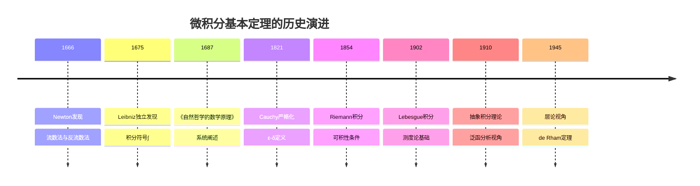

### 3.2 代数基本定理历史

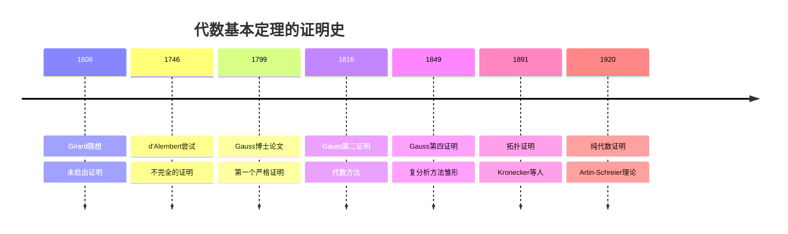

---

## 4️⃣ 定理间的逻辑网络

### 4.1 分析学定理网络

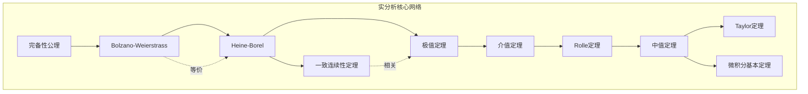

### 4.2 代数学定理网络

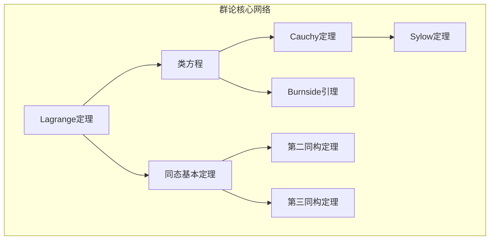

### 4.3 跨分支定理依赖

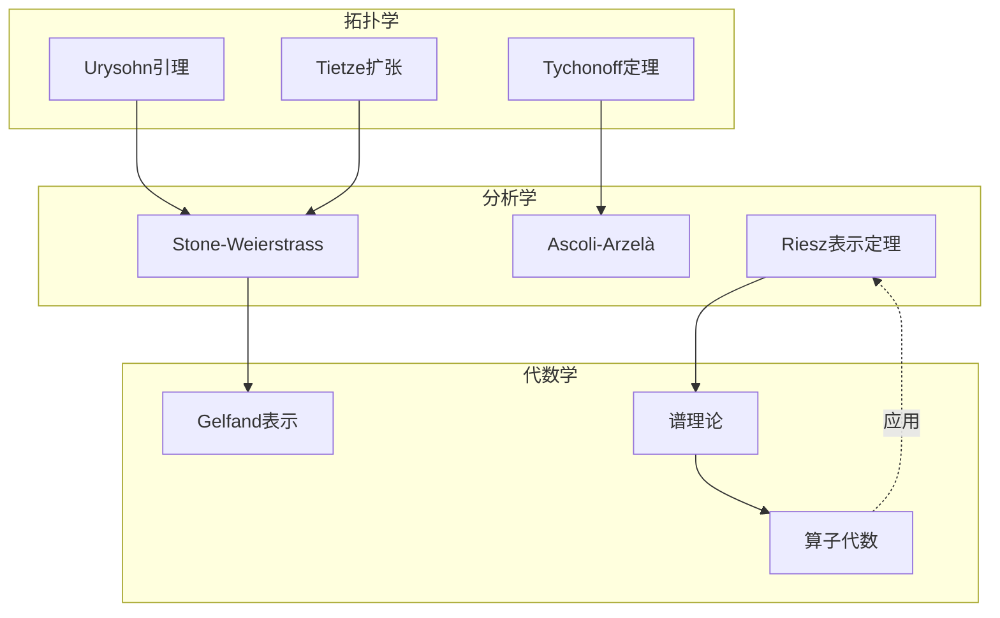

---

## 5️⃣ 定理影响力分析

### 5.1 引用频率排名（概念性）

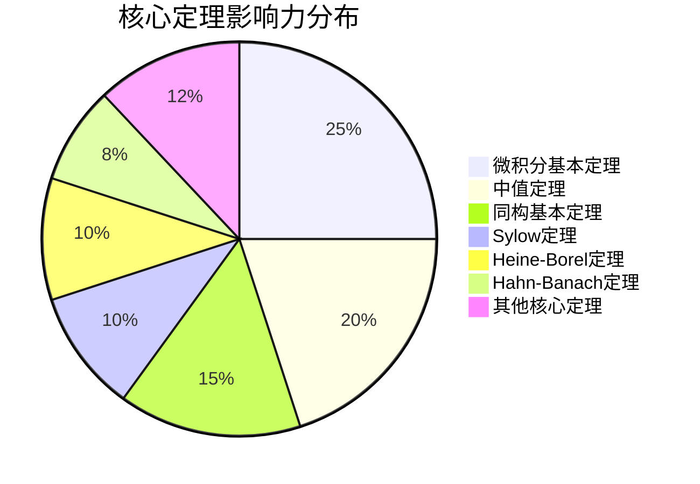

### 5.2 定理影响力矩阵

| 定理 | 直接影响领域 | 间接影响领域 | 现代应用 |
|------|--------------|--------------|----------|
| 微积分基本定理 | 微分方程、变分法 | 控制论、优化 | 机器学习梯度下降 |
| 同构基本定理 | 抽象代数全部 | 代数几何、数论 | 密码学基础 |
| Sylow定理 | 有限群分类 | 化学分子对称性 | 晶体学 |
| Hahn-Banach定理 | 泛函分析 | 偏微分方程 | 经济学均衡理论 |
| Gödel不完备定理 | 数理逻辑 | 计算机科学 | AI可证明性限制 |

---

## 6️⃣ 学习路径建议

### 6.1 定理学习优先级

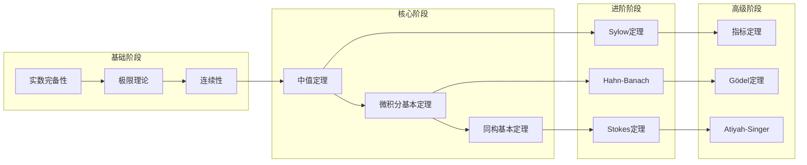

### 6.2 按领域的关键定理清单

| 领域 | 必掌握定理（5个） | 进阶定理（3个） |
|------|-------------------|-----------------|
| 实分析 | 完备性、B-W、中值、基本定理、Arzelà | 控制收敛、Fubini、Radon-Nikodym |
| 复分析 | Cauchy积分、留数、Liouville、Rouché、Montel | Riemann映射、Picard、Runge |
| 代数 | Lagrange、同构定理、Sylow、结构定理、Hilbert基 | Galois对应、Nakayama、Krull |
| 拓扑 | Urysohn、Tychonoff、度量化、嵌入、Brouwer | de Rham、Poincaré对偶、指标 |

---

## 📚 参考资源

| 资源类型 | 链接 | 描述 |
|----------|------|------|
| 定理依赖详细图 | [全局定理依赖网络](00-全局定理依赖网络/01-全局定理依赖网络.md) | 完整依赖关系 |
| 多表征定理 | [核心定理多表征](00-核心概念理解三问/11-核心定理多表征/) | 多角度理解 |
| 证明策略 | [证明策略决策树](00-决策推理图/05-证明方法选择决策树.md) | 如何证明定理 |

---

> **学习提示**：理解定理之间的依赖关系有助于构建完整的知识体系。建议在学习每个定理时，明确其前置知识、核心应用和可能的推广方向。

---

*本文档绘制数学核心定理的逻辑网络 | 最后更新：2026-04*
