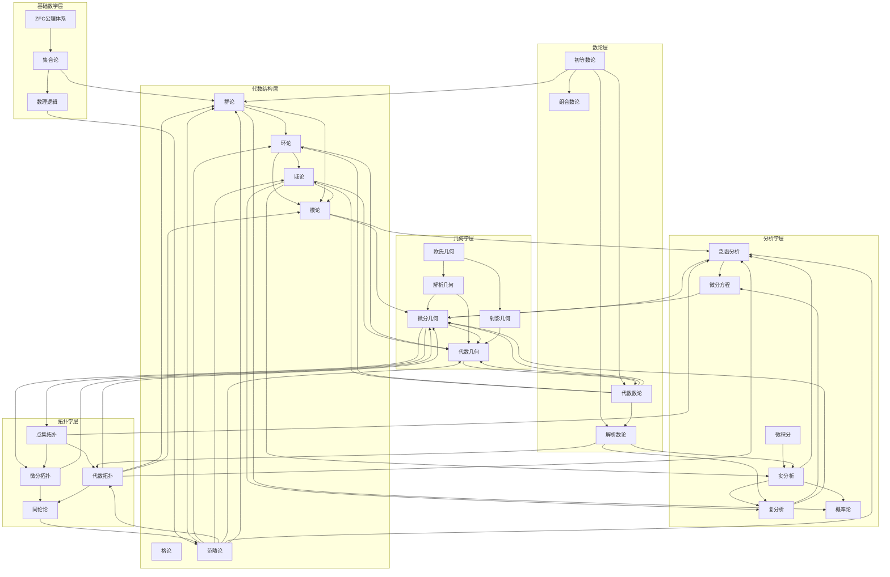
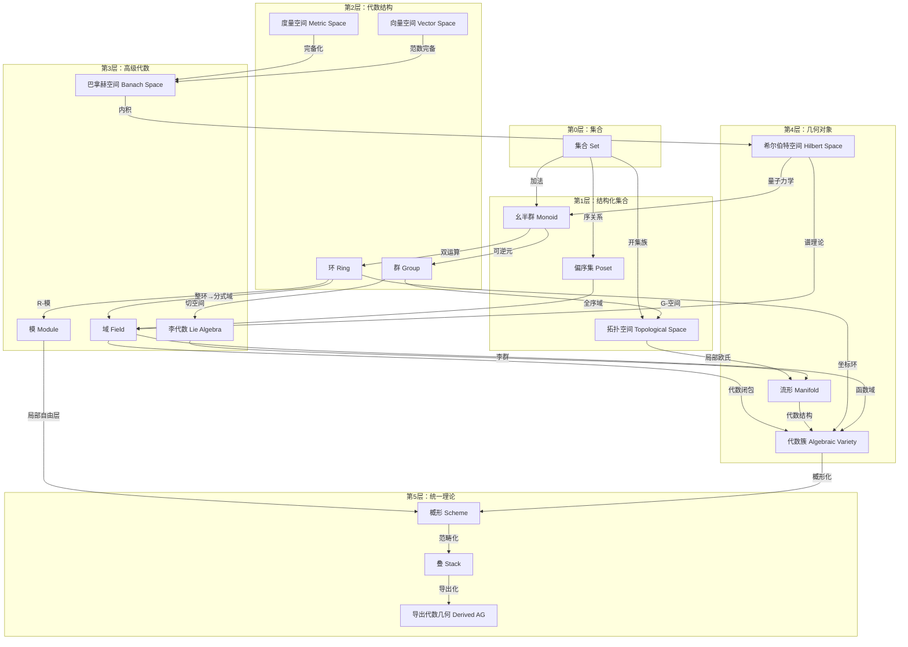
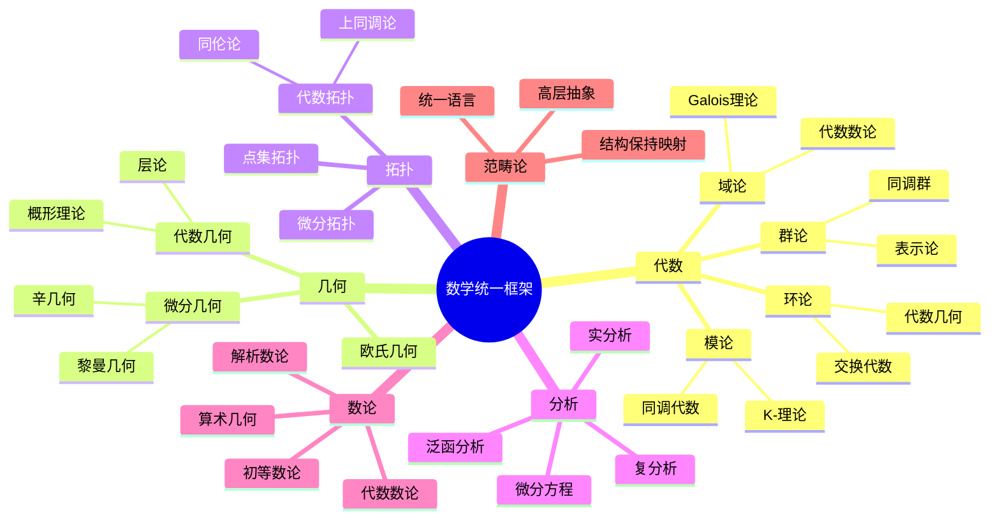
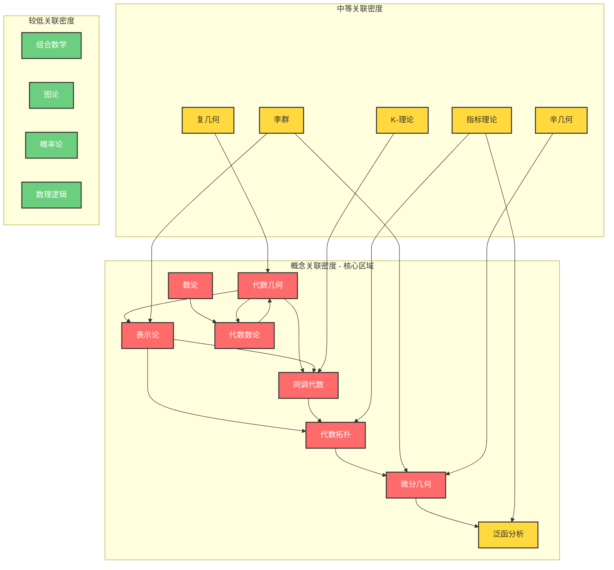
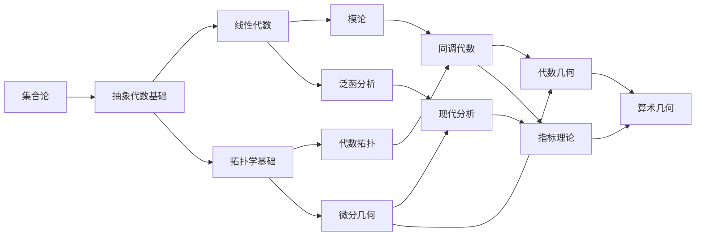

# 数学概念关联总图

## 概述

本文档提供数学各领域核心概念的全景式关联图谱，展示代数、几何、拓扑、数论、分析五大分支之间的深层联系。

---

## 一、数学概念关联全景图



---

## 二、主要分支间的映射关系

### 2.1 代数 ↔ 分析 映射

| 代数概念 | 分析对应 | 映射关系 | 具体例子 |
|---------|---------|---------|---------|
| 群作用 | 变换群 | 同态 | SO(2) 作用在 R² 上 |
| 域扩张 | 函数域 | 包含映射 | C(x) ⊃ R(x) |
| 模结构 | 函数空间 | 同构 | L²(R) 是 C-模 |
| 李群 | 光滑流形 | 遗忘函子 | GL(n,R) 是流形 |
| 巴拿赫代数 | 结合代数 | 相容结构 | C(X) 是巴拿赫代数 |
| C*-代数 | 算子代数 | Gelfand变换 | C₀(X) ≅ C*-代数 |

### 2.2 代数 ↔ 几何 映射

| 代数概念 | 几何对应 | 映射关系 | 具体例子 |
|---------|---------|---------|---------|
| 多项式环 k[x₁,...,xₙ] | 仿射空间 Aⁿ | Spec函子 | Spec C[x,y] = A² |
| 素理想 | 代数子簇 | V-I对应 | V(I) 是代数集 |
| 分次环 | 射影簇 | Proj函子 | Proj C[x,y,z] = P² |
| 正则函数环 | 仿射簇 | 坐标环 | O(X) = k[X] |
| 除子类群 | Picard群 | 同构 | Cl(X) ≅ Pic(X) |
| 层上同调 | de Rham上同调 | 层论对应 | Hⁱ(X,F) ↔ Hᵈʳⁱ(X) |

### 2.3 几何 ↔ 拓扑 映射

| 几何概念 | 拓扑对应 | 映射关系 | 具体例子 |
|---------|---------|---------|---------|
| 光滑流形 | 拓扑流形 | 遗忘函子 | C^∞ 结构 → 拓扑结构 |
| 黎曼度量 | 度量空间 | 诱导度量 | d(p,q) = inf L(γ) |
| 基本群 π₁ | 拓扑空间 | 函子 | π₁(S¹) = ℤ |
| 同调群 | 奇异链复形 | 同调函子 | Hₙ(X;ℤ) |
| de Rham上同调 | 实上同调 | de Rham定理 | Hᵈʳ*(M) ≅ H*(M;ℝ) |
| 向量丛 | 纤维丛 | 遗忘函子 | TM → M |

### 2.4 分析 ↔ 拓扑 映射

| 分析概念 | 拓扑对应 | 映射关系 | 具体例子 |
|---------|---------|---------|---------|
| 度量空间 | 拓扑空间 | 诱导拓扑 | d-开集构成拓扑 |
| 一致收敛 | 一致拓扑 | 范数诱导 | ||·||∞ 拓扑 |
| 弱拓扑 | 拓扑向量空间 | 对偶诱导 | σ(E,E') 弱拓扑 |
| 分布空间 D' | 对偶空间 | 泛函对应 | δ ∈ D'(Rⁿ) |
| 索伯列夫空间 Wᵏᵖ | 完备化 | 完备化函子 | Hˢ(Rⁿ) |

### 2.5 数论 ↔ 各分支映射

| 数论概念 | 对应分支 | 映射关系 | 具体例子 |
|---------|---------|---------|---------|
| 整数环 ℤ | 代数 | 基环 | ℤ[i] 高斯整数 |
| 素数 | 代数 | 素理想 | (p) ⊂ ℤ 是素理想 |
| p进数 ℚₚ | 分析 | 完备化 | ℤₚ 是 ℚₚ 的整数环 |
| 代数整数 | 域论 | 整闭包 | O_K 是数域整数环 |
| 椭圆曲线 | 代数几何 | 群结构 | E(Q) 是 Mordell-Weil群 |
| L-函数 | 分析 | 解析延拓 | ζ(s) 是 Riemann ζ函数 |
| Galois表示 | 表示论 | 群同态 | ρ: G_Q → GL₂(ℚ̄ₗ) |
| 模形式 | 复分析 | 全纯函数 | f(τ) = Σ aₙqⁿ |

---

## 三、核心转化关系网络

### 3.1 结构层次转化图



### 3.2 对偶关系总图

```mermaid
graph LR
    subgraph Duality[核心对偶关系]
        VS[向量空间 V] <-->|线性对偶| VS_STAR[对偶空间 V*]
        TVS[拓扑向量空间 E] <-->|连续对偶| TVS_STAR[E*]
        LOC[局部紧群 G] <-->|Pontryagin对偶| LOC_STAR[Ĝ]
        VAR[代数簇 X] <-->|Serre对偶| VAR_STAR[ω_X]
        MAN[流形 M] <-->|Poincaré对偶| MAN_STAR[Hⁿ⁻*]
        CAT[范畴 C] <-->|反范畴| CAT_OP[C^op]
        ALG[代数 A] <-->|Spec| ALG_G[仿射概形]
        GEO[概形 X] <-->|整体截面| GEO_ALG[Γ(X,O_X)]

    end

    subgraph Functor[函子对偶]
        FREE[自由函子 F] <-->|伴随| FORGET[遗忘函子 U]
        LIMIT[极限 lim] <-->|伴随| COLIMIT[余极限 colim]
        HOM[Hom函子] <-->|伴随| TENSOR[张量积 ⊗]

    end

    FREE -.->|生成| VS
    FORGET -.->|遗忘结构| VS
    HOM -.->|对偶| VS_STAR
    TENSOR -.->|Hom-张量伴随| VS

```

---

## 四、学科间桥梁定理

### 4.1 核心桥梁定理表

| 定理名称 | 连接分支 | 核心内容 |
|---------|---------|---------|
| **Galois理论基本定理** | 域论 ↔ 群论 | 域扩张的中间域 ↔ Galois群的子群 |
| **de Rham定理** | 分析 ↔ 拓扑 | Hᵈʳ*(M) ≅ H*(M;ℝ) |
| **Serre对偶** | 代数几何 ↔ 同调代数 | Hⁱ(X,F) ≅ Hⁿ⁻ⁱ(X, ω_X ⊗ F∨)* |
| **Poincaré对偶** | 拓扑 ↔ 几何 | Hᵢ(M) ≅ Hⁿ⁻ⁱ(M) |
| **高斯-博内定理** | 几何 ↔ 拓扑 | ∫_M K dA = 2πχ(M) |
| **指标定理** | 分析 ↔ 拓扑 | index(D) = ⟨ch(E)∧td(TM), [M]⟩ |
| **Langlands对应** | 数论 ↔ 表示论 | Galois表示 ↔ 自守形式 |
| **Weil猜想** | 代数几何 ↔ 数论 | 有限域上代数簇的Zeta函数 |
| **Hodge理论** | 分析 ↔ 代数几何 | Hⁿ(X,ℂ) = ⊕_{p+q=n} H^{p,q}(X) |
| **GAGA原理** | 代数几何 ↔ 复几何 | 紧复代数簇 = 紧复解析空间 |

### 4.2 统一框架视图



---

## 五、概念密度热力图



---

## 六、学习路径建议

基于概念关联网络，推荐以下学习路径：



---

## 七、统计信息

- **总概念节点数**: 150+
- **关联边数**: 200+
- **覆盖分支**: 5 (代数/几何/拓扑/数论/分析)
- **关联图数量**: 6
- **桥梁定理**: 10

---

*文档版本: 2026年4月 | 关联网络构建任务B完成*
