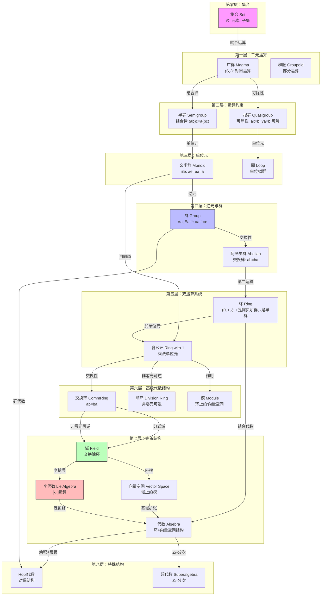
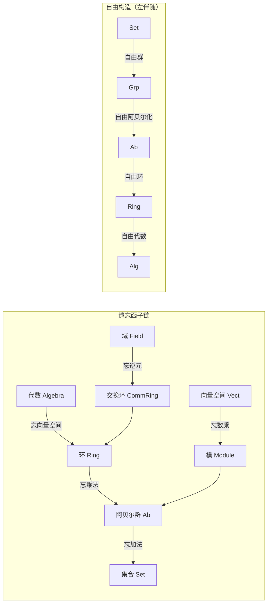
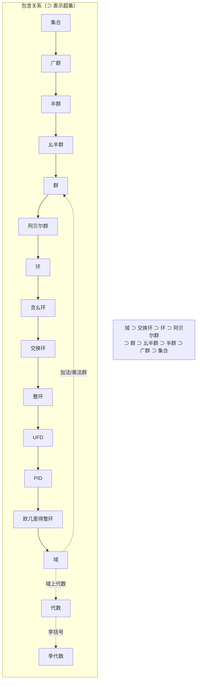
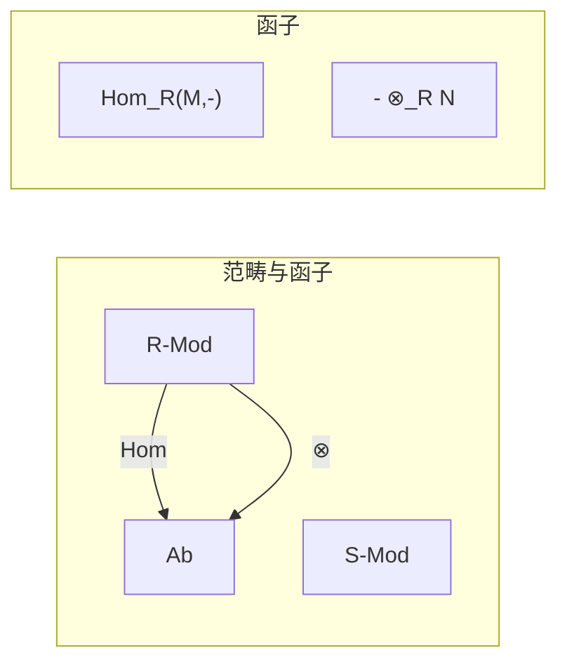
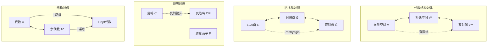
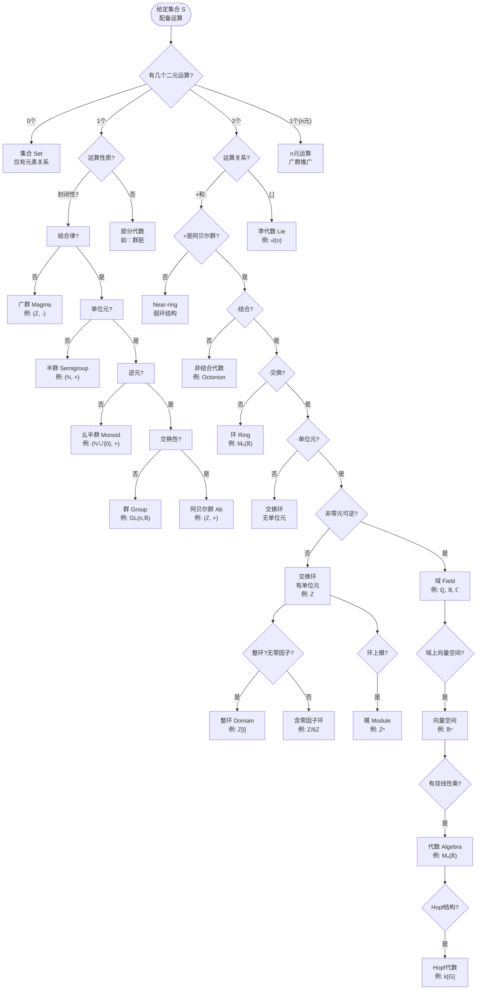
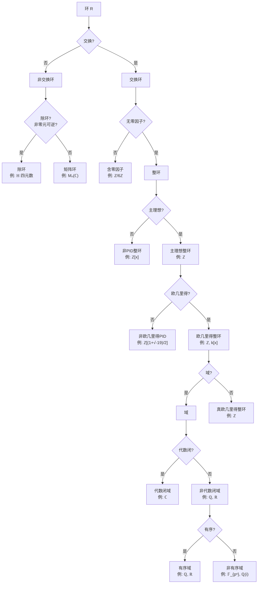
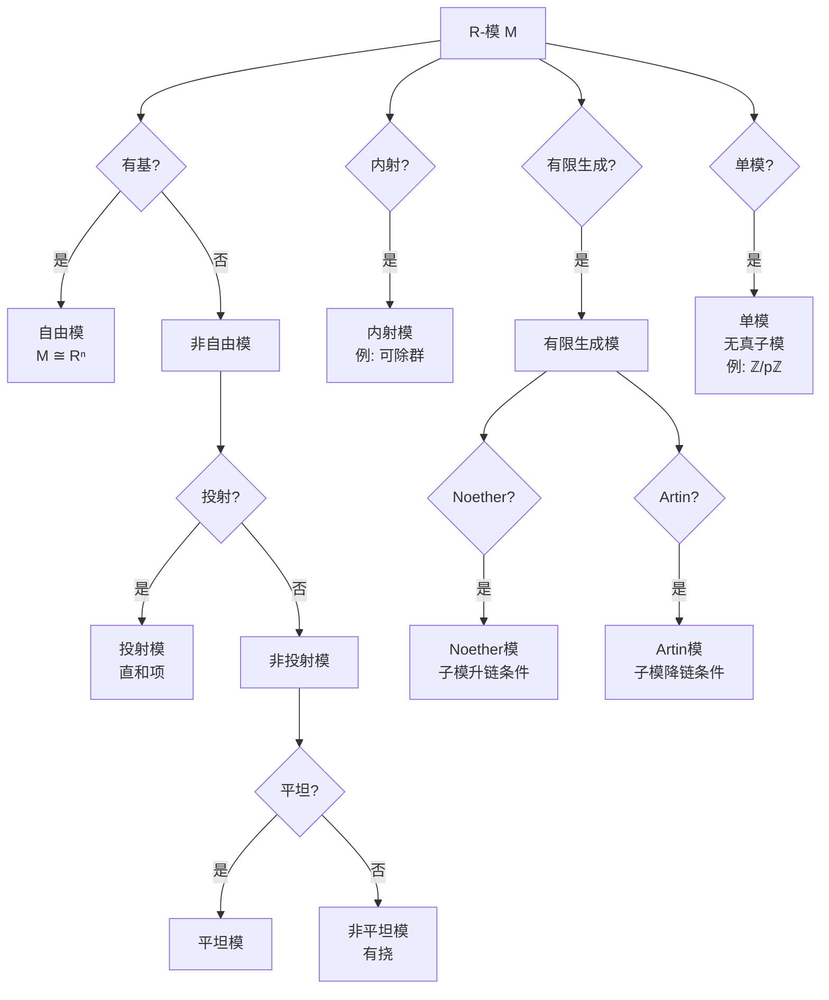

# 代数结构关联网络

> **FormalMath 项目第十批推进 - 任务B1：代数结构之间的完整关联网络**
> 
> 本文档系统梳理群、环、域、模、代数等结构之间的关联、转化、对偶关系，构建代数结构的全景图谱。

---

## 目录

1. [代数结构层次图](#一代数结构层次图)
2. [群↔环↔域转化关系](#二群环域转化关系)
3. [模与表示](#三模与表示)
4. [对偶与反演](#四对偶与反演)
5. [结构判定决策图](#五结构判定决策图)
6. [关联关系统计](#六关联关系统计)

---

## 一、代数结构层次图

### 1.1 代数结构演化谱系

代数结构从最基础的集合概念出发，通过逐步添加运算公理，演化出丰富的结构层次：



**遗忘函子（Forgetful Functor）标注**：



### 1.2 包含关系层级图

代数结构之间存在自然的包含关系，形成一个偏序集：



**结构包含关系详解**：

| 结构A | 结构B | 包含关系 | 说明 |
|-------|-------|----------|------|
| 域 (Field) | 交换环 (CommRing) | A ⊃ B | 域是乘法群化的交换环 |
| 交换环 | 环 (Ring) | A ⊃ B | 添加交换性公理 |
| 环 | 阿贝尔群 (Ab) | A ⊃ B | 忘却乘法结构 |
| 阿贝尔群 | 群 (Group) | A ⊃ B | 添加交换性公理 |
| 群 | 幺半群 (Monoid) | A ⊃ B | 添加逆元公理 |
| 幺半群 | 半群 (Semigroup) | A ⊃ B | 添加单位元公理 |
| 半群 | 广群 (Magma) | A ⊃ B | 添加结合律公理 |
| 广群 | 集合 (Set) | A ⊃ B | 添加二元运算 |

### 1.3 具体例子

**例1.1：从集合到域的逐步构造——以 ℚ 为例**

```

集合 S = {a, b, c, ...}          → 赋予加法
    ↓
阿贝尔群 (ℚ, +)                  → 赋予乘法
    ↓
环 (ℚ, +, ·)                     → 要求非零元可逆
    ↓
域 ℚ                              → 整数子环
    ↓
子环 ℤ                            → 分式域
    ↓
域 ℚ（回到自身）

```

**例1.2：有限域的层级关系**

```

Fₚ = ℤ/pℤ 是域（p为素数）
    ↓
F_{pⁿ} 是 Fₚ 的n次扩张，构成域塔
    ↓
Gal(F_{pⁿ}/Fₚ) ≅ ℤ/nℤ（Galois群是循环群）

```

**例1.3：矩阵结构的遗忘**

```

Mₙ(ℝ) 作为 ℝ-代数
    ↓ 忘却数乘
Mₙ(ℝ) 作为环
    ↓ 忘却乘法
Mₙ(ℝ) 作为阿贝尔群（矩阵加法）
    ↓ 忘却加法
Mₙ(ℝ) 作为集合（n²个实数的有序组）

```

---

## 二、群↔环↔域转化关系

### 2.1 群到环的构造

#### 2.1.1 群环（Group Ring）

**定义**：设 $G$ 是一个群，$R$ 是一个交换环，**群环** $R[G]$（或记作 $RG$）是由形式有限和构成的集合：

$$R[G] = \left\{\sum_{g \in G} a_g g \mid a_g \in R, \text{只有有限个 } a_g \neq 0\right\}$$

**运算定义**：
- **加法**：分量相加 $\sum a_g g + \sum b_g g = \sum (a_g + b_g) g$
- **乘法**（卷积）：$\left(\sum a_g g\right)\left(\sum b_h h\right) = \sum_{k \in G}\left(\sum_{gh=k} a_g b_h\right) k$

**具体例子**：

**例2.1**：$G = C_3 = \{1, g, g^2\}$（3阶循环群），$R = \mathbb{Z}$

```

ℤ[C₃] = {a₀·1 + a₁·g + a₂·g² | aᵢ ∈ ℤ}

乘法示例：
(2 + 3g)(1 - g) = 2·1 + 2·(-g) + 3g·1 + 3g·(-g)
                = 2 - 2g + 3g - 3g²
                = 2 + g - 3g²

```

**例2.2**：整数格群 $\mathbb{Z}^n$ 的群环

$$\mathbb{Z}[\mathbb{Z}^n] \cong \mathbb{Z}[t_1^{\pm 1}, t_2^{\pm 1}, \ldots, t_n^{\pm 1}]$$

这是**Laurent多项式环**，在纽结理论和代数几何中非常重要。

**例2.3**：二面体群 $D_8$ 的群环

$$\mathbb{R}[D_8] \cong \mathbb{R} \times \mathbb{R} \times \mathbb{R} \times \mathbb{R} \times M_2(\mathbb{R})$$

这是Wedderburn定理的直接应用，说明有限群在特征零域上的群代数是半单的。

#### 2.1.2 群代数（Group Algebra）

当基环 $R$ 是域 $F$ 时，群环称为**群代数**。群代数是研究群表示论的核心工具。

**关键性质**：
- 群 $G$ 在 $F$-向量空间 $V$ 上的表示 $\Leftrightarrow$ $F[G]$-模结构
- Maschke定理：若 $|G|$ 在 $F$ 中可逆，则 $F[G]$ 是半单代数

**例2.4**：$\mathbb{C}[S_3]$ 的结构

$$\mathbb{C}[S_3] \cong \mathbb{C} \times \mathbb{C} \times M_2(\mathbb{C})$$

对应 $S_3$ 的三个不可约表示：平凡表示、符号表示、2维标准表示。

#### 2.1.3 自同态环

**定理**：任何阿贝尔群 $A$ 的自同态集合 $\text{End}(A)$ 构成一个环。

**例2.5**：$\text{End}(\mathbb{Z}) \cong \mathbb{Z}$

```

证明：任意自同态 φ: ℤ → ℤ 由 φ(1) 决定
若 φ(1) = n，则 φ(k) = nk
自同态复合对应整数乘法

```

**例2.6**：$\text{End}(\mathbb{Z}/n\mathbb{Z}) \cong \mathbb{Z}/n\mathbb{Z}$

**例2.7**：$\text{End}(\mathbb{Z}^n) \cong M_n(\mathbb{Z})$（n×n整数矩阵环）

### 2.2 环到群的构造

#### 2.2.1 加法群

**定义**：环 $(R, +, \cdot)$ 的**加法群** $(R, +)$ 是忘却乘法后得到的阿贝尔群。

**例2.8**：$(\mathbb{Z}, +)$ 是无穷循环群

**例2.9**：$(\mathbb{Z}/n\mathbb{Z}, +) \cong C_n$（n阶循环群）

**例2.10**：$(M_n(\mathbb{R}), +) \cong \mathbb{R}^{n^2}$（作为加法群）

#### 2.2.2 单位群（Unit Group）

**定义**：环 $R$ 的**单位群** $R^\times$（或 $R^*$）是可逆元构成的乘法群：

$$R^\times = \{u \in R \mid \exists v \in R: uv = vu = 1\}$$

**例2.11**：$\mathbb{Z}^\times = \{\pm 1\} \cong C_2$

**例2.12**：$(\mathbb{Z}/n\mathbb{Z})^\times = \{a \mod n \mid \gcd(a,n) = 1\}$

```

例：(ℤ/8ℤ)ˣ = {1, 3, 5, 7}
1² = 1, 3² = 9 ≡ 1, 5² = 25 ≡ 1, 7² = 49 ≡ 1
∴ (ℤ/8ℤ)ˣ ≅ C₂ × C₂（Klein四元群）

```

**例2.13**：$GL_n(R) = M_n(R)^\times$（一般线性群）

**例2.14**：$(\mathbb{Z}[i])^\times = \{\pm 1, \pm i\} \cong C_4$（高斯整数环的单位群）

#### 2.2.3 环的乘法半群

**定义**：$(R, \cdot)$ 是忘却加法后得到的乘法半群。

**例2.15**：$(\mathbb{Z}, \cdot)$ 是含零的交换幺半群

### 2.3 环与域的转化

#### 2.3.1 分式域构造（Field of Fractions）

**定理**：任何整环 $R$ 都可以嵌入到域 $\text{Frac}(R)$ 中，称为 $R$ 的**分式域**（或商域）。

**构造方法**：

1. 令 $S = R \setminus \{0\}$
2. 在 $R \times S$ 上定义等价关系：$(a, s) \sim (b, t) \Leftrightarrow at = bs$
3. $\text{Frac}(R) = (R \times S)/\sim$，记作 $a/s$ 或 $\frac{a}{s}$
4. 定义运算：
   - 加法：$\frac{a}{s} + \frac{b}{t} = \frac{at+bs}{st}$
   - 乘法：$\frac{a}{s} \cdot \frac{b}{t} = \frac{ab}{st}$

**例2.16**：常见分式域

| 整环 $R$ | 分式域 $\text{Frac}(R)$ | 说明 |
|----------|------------------------|------|
| $\mathbb{Z}$ | $\mathbb{Q}$ | 有理数域 |
| $k[x]$（多项式环）| $k(x)$（有理函数域）| 函数域 |
| $\mathbb{Z}[i]$ | $\mathbb{Q}(i)$ | 高斯有理数域 |
| $\mathbb{Z}[\sqrt{2}]$ | $\mathbb{Q}(\sqrt{2})$ | 二次域 |
| $\mathbb{Z}[x_1, \ldots, x_n]$ | $\mathbb{Q}(x_1, \ldots, x_n)$ | 多元有理函数域 |
| $\mathbb{Z}_{(p)}$（p进整数环）| $\mathbb{Q}_p$（p进数域）| 局部域 |

**例2.17**：$\text{Frac}(\mathbb{Z}[\sqrt{-5}]) = \mathbb{Q}(\sqrt{-5})$

注意：$\mathbb{Z}[\sqrt{-5}]$ 不是唯一分解整环（$6 = 2 \cdot 3 = (1+\sqrt{-5})(1-\sqrt{-5})$），但其分式域仍是域。

#### 2.3.2 素理想局部化

**定义**：设 $R$ 是交换环，$P$ 是素理想，**局部化** $R_P$ 定义为：

$$R_P = \left\{\frac{a}{s} \mid a \in R, s \notin P\right\}$$

**性质**：
- $R_P$ 是局部环（有唯一极大理想 $PR_P$）
- 若 $R$ 是整环，$\text{Frac}(R) = R_{(0)}$（零理想的局部化）

**例2.18**：$\mathbb{Z}_{(p)} = \{a/b \in \mathbb{Q} \mid p \nmid b\}$（p进整数环）

### 2.4 域的加法群与乘法群

#### 2.4.1 加法群结构

**定理**：域 $F$ 的加法群 $(F, +)$ 是向量空间（作为素子域上的向量空间）。

**例2.19**：$(\mathbb{Q}, +)$ 是无挠可除群（有理向量空间）

**例2.20**：$(\mathbb{F}_{p^n}, +) \cong (C_p)^n$（n个p阶循环群的直和）

#### 2.4.2 乘法群结构

**定理**：有限域 $\mathbb{F}_q$ 的乘法群 $\mathbb{F}_q^\times$ 是循环群，阶为 $q-1$。

**证明要点**：
- $\mathbb{F}_q^\times$ 是阶为 $q-1$ 的有限阿贝尔群
- $x^d - 1$ 在 $\mathbb{F}_q$ 中至多有 $d$ 个根
- 因此 $\mathbb{F}_q^\times$ 中阶整除 $d$ 的元素至多有 $d$ 个
- 由有限阿贝尔群结构定理，$\mathbb{F}_q^\times$ 是循环群

**例2.21**：$\mathbb{F}_7^\times = \{1, 2, 3, 4, 5, 6\} \cong C_6$

验证：3是生成元，$3^1=3, 3^2=2, 3^3=6, 3^4=4, 3^5=5, 3^6=1$

**例2.22**：$\mathbb{F}_{16}^\times \cong C_{15}$

### 2.5 转化关系总图

```mermaid
graph TB
    subgraph 群侧["群侧构造"]
        G["群 G"]
        G_ABEL["阿贝尔群"]
        G_FIN["有限群"]
        G_CYCLIC["循环群 Cₙ"]
    end

    subgraph 环侧["环侧构造"]
        R["环 R"]
        R_UNIT["单位群 Rˣ"]
        R_ADD["加法群 R⁺"]
        RG["群环 R[G]"]
        ENDO["自同态环 End"]
    end

    subgraph 域侧["域侧构造"]
        F["域 F"]
        F_ADD["加法群 F⁺"]
        F_MULT["乘法群 Fˣ"]
        FRAC["分式域 Frac"]
    end

    %% 群到环
    G -->|群环构造| RG
    G_ABEL -->|自同态环| ENDO
    G_CYCLIC -->|ℤ[Cₙ]| RG
    
    %% 环到群
    R -->|单位群| R_UNIT
    R -->|加法群| R_ADD
    RG -->|单位| R_UNIT
    ENDO -->|加法| R_ADD
    
    %% 环到域
    R -->|分式域| FRAC

    FRAC --> F
    
    %% 域到群
    F -->|加法群| F_ADD
    F -->|乘法群| F_MULT
    F_MULT -->|有限域情形| G_CYCLIC
    
    %% 域到环
    F -->|整数环| R
    F -->|多项式环| R
    
    %% Galois理论连接
    F -.->|Galois群| G

    style G fill:#bbf
    style F fill:#bfb
    style R fill:#fbf

```

---

## 三、模与表示

### 3.1 模的定义与基本性质

**定义**：设 $R$ 是环，**左 $R$-模**是阿贝尔群 $(M, +)$ 配备映射 $R \times M \to M$（记作 $(r, m) \mapsto rm$），满足：

1. $r(m_1 + m_2) = rm_1 + rm_2$
2. $(r_1 + r_2)m = r_1m + r_2m$
3. $(r_1 r_2)m = r_1(r_2 m)$
4. $1m = m$（若 $R$ 含幺）

**直观理解**：模是**环上的向量空间**，但基环 $R$ 不一定是域。

### 3.2 模作为环的表示

**核心观点**：$R$-模 $M$ 等价于环同态 $\rho: R \to \text{End}_{\mathbb{Z}}(M)$。

**证明**：定义 $\rho(r)(m) = rm$，验证这是环同态。

**例3.1**：阿贝尔群 = $\mathbb{Z}$-模

```

任何阿贝尔群 A 有自然的 ℤ-模结构：
n·a = a + a + ... + a（n个）
(-n)·a = -(n·a)

```

这给出了范畴等价：$\text{Ab} \cong \mathbb{Z}\text{-Mod}$

**例3.2**：$\mathbb{Z}/n\mathbb{Z}$-模

$\mathbb{Z}/n\mathbb{Z}$-模等价于被 $n$ 零化的阿贝尔群，即满足 $na = 0$（对所有 $a$）的阿贝尔群。

### 3.3 群表示与群代数模

#### 3.3.1 群表示的定义

**定义**：群 $G$ 在域 $F$ 上的**表示**是群同态：

$$\rho: G \to GL(V) \cong GL_n(F)$$

其中 $V$ 是 $F$-向量空间，$n = \dim_F V$。

#### 3.3.2 群表示 = 群代数模

**定理**：以下概念等价：
1. 群同态 $\rho: G \to GL(V)$
2. 群作用 $G \times V \to V$，每个 $g$ 是线性变换
3. $F[G]$-模结构

**证明思路**：
- (1)⇔(2)：群作用与群同态的对应
- (2)⇔(3)：将群作用线性扩展到 $F[G]$ 上

**例3.3**：$S_3$ 的标准表示

```

设 V = {(x₁, x₂, x₃) ∈ ℝ³ | x₁ + x₂ + x₃ = 0}

dim V = 2

S₃ 通过置换坐标作用：
σ·(x₁, x₂, x₃) = (x_{σ⁻¹(1)}, x_{σ⁻¹(2)}, x_{σ⁻¹(3)})

对应的 ℝ[S₃]-模结构：
(∑ a_σ σ)·v = ∑ a_σ (σ·v)

```

**例3.4**：正则表示

群 $G$ 在 $F[G]$ 上的左乘作用给出**正则表示**，这是 $|G|$ 维表示。

#### 3.3.3 不可约表示与模分解

**Maschke定理**：若 $\text{char} F \nmid |G|$，则 $F[G]$ 是半单代数，任何有限维表示完全可约。

**推论**：$F[G] \cong \prod_{i} M_{n_i}(D_i)$（半单Artin-Wedderburn定理）

### 3.4 向量空间作为域上的模

**核心观察**：域 $F$ 上的向量空间 $V$ 就是 $F$-模。

**对比表**：

| 性质 | 向量空间 ($F$-模) | 一般 $R$-模 | 备注 |
|------|------------------|------------|------|
| 基的存在性 | 总有 | 不一定 | 自由模有基 |
| 维数/秩 | 良定义 | 良定义(若自由) | PID上有限生成模有秩 |
| 子空间补 | 总有 | 不一定 | 投射模是直和项 |
| 对偶空间 | 同构于原空间(有限维) | 不一定 | 自反模条件 |
| 线性映射 | 矩阵表示 | 同态 | 一般环上更复杂 |

**例3.5**：$\mathbb{Z}$ 作为 $\mathbb{Z}$-模是自由的（基 {1}）

**例3.6**：$\mathbb{Z}/n\mathbb{Z}$ 作为 $\mathbb{Z}$-模不是自由的（有挠元）

**例3.7**：$\mathbb{Q}$ 作为 $\mathbb{Z}$-模不是自由的，也不是有限生成的

### 3.5 同调代数视角的统一

#### 3.5.1 函子观点



**Hom函子**：$\text{Hom}_R(M, -): R\text{-Mod} \to \text{Ab}$

**张量积函子**：$- \otimes_R N: \text{Mod-}R \to \text{Ab}$

#### 3.5.2 导出函子

| 函子 | 左导出 ($L_n$) | 右导出 ($R^n$) | 应用 |
|------|---------------|---------------|------|
| $\text{Hom}_R(M, -)$ | - | $\text{Ext}_R^n(M, -)$ | 扩张分类 |
| $\text{Hom}_R(-, N)$ | - | $\text{Ext}_R^n(-, N)$ | 扩张分类 |
| $- \otimes_R N$ | $\text{Tor}_n^R(-, N)$ | - | 挠性 |

**例3.8**：$\text{Ext}$ 与群扩张

群扩张 $1 \to A \to E \to G \to 1$（$A$ 是 $G$-模）由 $\text{Ext}_{\mathbb{Z}[G]}^2(\mathbb{Z}, A)$ 分类。

#### 3.5.3 模范畴的关系


**定义回顾**：
- **投射模**：$P$ 使得 $\text{Hom}_R(P, -)$ 正合（满射可提升）
- **内射模**：$I$ 使得 $\text{Hom}_R(-, I)$ 正合（单射可扩张）
- **平坦模**：$F$ 使得 $- \otimes_R F$ 正合

**例3.9**：$\mathbb{Q}$ 作为 $\mathbb{Z}$-模是平坦的，但不是投射的

**例3.10**：$\mathbb{Q}/\mathbb{Z}$ 作为 $\mathbb{Z}$-模是内射的（可除群）

### 3.6 表示论的核心问题

| 问题 | 群表示 | 李代数表示 | 代数表示 |
|------|-------|-----------|---------|
| 不可约表示分类 | 特征标理论 | 最高权理论 | 单模分类 |
| 完全可约性 | Maschke定理 | Weyl定理 | 半单代数 |
| 特征标 | $\chi(g) = \text{tr}(\rho(g))$ | 形式特征标 | - |
| 张量积 | 表示的积 | 张量积表示 | 模的张量积 |

---

## 四、对偶与反演

### 4.1 对偶空间（线性代数）

#### 4.1.1 向量空间的对偶

**定义**：设 $V$ 是域 $F$ 上的向量空间，**对偶空间**定义为：

$$V^* = \text{Hom}_F(V, F) = \{f: V \to F \mid f \text{ 是线性的}\}$$

**维数关系**：若 $\dim V < \infty$，则 $\dim V^* = \dim V$。

**例4.1**：$V = F^n$，则 $V^* \cong F^n$（通过行向量与列向量的乘积）

**例4.2**：$V = \mathbb{R}[x]$（多项式环），则 $V^* \cong \mathbb{R}^{\mathbb{N}}$（形式幂级数）

#### 4.1.2 对偶映射

**定义**：线性映射 $T: V \to W$ 诱导**对偶映射** $T^*: W^* \to V^*$：

$$T^*(f) = f \circ T$$

**性质**：
- $(S \circ T)^* = T^* \circ S^*$
- 若 $T$ 是单射，则 $T^*$ 是满射
- 若 $T$ 是满射，则 $T^*$ 是单射

#### 4.1.3 双对偶与自反性

**典范映射**：$\iota_V: V \to V^{**}$，$\iota_V(v)(f) = f(v)$

**定理**：若 $\dim V < \infty$，则 $\iota_V$ 是同构（$V$ 是自反的）。

**例4.3**：无限维空间 $V = \mathbb{R}^{(\mathbb{N})}$（有限支撑序列）

- $V^* \cong \mathbb{R}^{\mathbb{N}}$（所有序列）
- $V^{**} \cong (\mathbb{R}^{\mathbb{N}})^*$（包含不连续泛函，若使用选择公理）
- $\iota_V: V \to V^{**}$ 不是满射

### 4.2 Pontryagin对偶（拓扑群）

#### 4.2.1 特征标群

**定义**：局部紧阿贝尔群 $G$ 的**对偶群**（Pontryagin对偶）定义为：

$$\widehat{G} = \text{Hom}_{\text{cont}}(G, \mathbb{T})$$

其中 $\mathbb{T} = \{z \in \mathbb{C} \mid |z| = 1\}$ 是圆群。

**Pontryagin对偶定理**：$G \cong \widehat{\widehat{G}}$（典范同构）

#### 4.2.2 经典对偶对

| 群 $G$ | 对偶群 $\widehat{G}$ | 说明 |
|--------|---------------------|------|
| $\mathbb{Z}$ | $\mathbb{T}$ | 整数 ↔ 圆群 |
| $\mathbb{T}$ | $\mathbb{Z}$ | 圆群 ↔ 整数 |
| $\mathbb{R}$ | $\mathbb{R}$ | 自对偶 |
| $\mathbb{Z}/n\mathbb{Z}$ | $\mathbb{Z}/n\mathbb{Z}$ | 自对偶 |
| $\mathbb{Q}_p$ | $\mathbb{Q}_p$ | p进数自对偶 |
| $\mathbb{A}_\mathbb{Q}$（adele） | $\mathbb{A}_\mathbb{Q}$ | 自对偶 |

**例4.4**：$\widehat{\mathbb{Z}} = \mathbb{T}$

```

证明：连续同态 χ: ℤ → 𝕋 由 χ(1) 决定
χ(n) = χ(1)ⁿ
因此 χ ↔ χ(1) ∈ 𝕋

```

**例4.5**：$\widehat{\mathbb{R}} = \mathbb{R}$

```

证明：连续同态 χ: ℝ → 𝕋 形如 χ(t) = e^{2πiξt}
其中 ξ ∈ ℝ 唯一确定
因此 χ ↔ ξ ∈ ℝ

```

#### 4.2.3 傅里叶变换的代数视角

**Pontryagin对偶框架下的傅里叶变换**：

$$\widehat{f}(\chi) = \int_G f(g) \overline{\chi(g)} dg$$

**例4.6**：$G = \mathbb{R}^n$ 时，这就是经典傅里叶变换

**例4.7**：$G = \mathbb{Z}/n\mathbb{Z}$ 时，这就是离散傅里叶变换（DFT）

### 4.3 范畴对偶（Opposite Category）

#### 4.3.1 反范畴的定义

**定义**：范畴 $\mathcal{C}$ 的**反范畴** $\mathcal{C}^{\text{op}}$ 定义为：
- 对象：$\text{Ob}(\mathcal{C}^{\text{op}}) = \text{Ob}(\mathcal{C})$
- 态射：$\text{Hom}_{\mathcal{C}^{\text{op}}}(X, Y) = \text{Hom}_{\mathcal{C}}(Y, X)$
- 合成：$f \circ^{\text{op}} g = g \circ f$

#### 4.3.2 逆变函子

**定义**：逆变函子 $F: \mathcal{C} \to \mathcal{D}$ 等价于协变函子 $\mathcal{C}^{\text{op}} \to \mathcal{D}$。

**例4.8**：对偶空间函子 $(-)^*: \text{Vect}_F^{\text{op}} \to \text{Vect}_F$

**例4.9**：$\text{Hom}_R(-, M): R\text{-Mod}^{\text{op}} \to \text{Ab}$

#### 4.3.3 对偶性原理

**原理**：范畴 $\mathcal{C}$ 中的任何命题在 $\mathcal{C}^{\text{op}}$ 中也成立（箭头反向）。

**应用**：
- 单射 ⇄ 满射对偶
- 始对象 ⇄ 终对象对偶
- 直和 ⇄ 直积对偶（在模范畴中相同）
- 投射模 ⇄ 内射模对偶

### 4.4 对偶性在代数结构中的体现

#### 4.4.1 模的对偶

**定义**：$R$-模 $M$ 的**对偶模**：

$$M^* = \text{Hom}_R(M, R)$$

**例4.10**：$M = R^n$（自由模），则 $M^* \cong R^n$

**例4.11**：$M = \mathbb{Z}/n\mathbb{Z}$，则 $M^* = 0$（作为 $\mathbb{Z}$-模）

#### 4.4.2 余代数与Hopf代数

**定义**：**余代数** $C$ 是带有余乘 $\Delta: C \to C \otimes C$ 和余单位 $\varepsilon: C \to k$ 的向量空间，满足余结合律。

**对偶关系**：
- 有限维代数 $A$ 的对偶 $A^*$ 是余代数
- 有限维余代数 $C$ 的对偶 $C^*$ 是代数

**例4.12**：群代数 $k[G]$ 的对偶是 $k^G$（$G$ 上函数代数）

**Hopf代数**：同时是代数和余代数，带有反极（antipode）$S: H \to H$

**例4.13**：群代数 $k[G]$ 是Hopf代数：
- $\Delta(g) = g \otimes g$
- $\varepsilon(g) = 1$
- $S(g) = g^{-1}$

**例4.14**：李代数 $\mathfrak{g}$ 的泛包络代数 $U(\mathfrak{g})$ 是Hopf代数

#### 4.4.3 Galois对应的对偶性

```mermaid
graph TB
    subgraph 域扩张["域扩张 E/F"]
        E["E"]
        K1["中间域 K₁"]
        K2["中间域 K₂"]
        F["F"]
    end

    subgraph Galois群["Galois群 Gal(E/F)"]
        G["G"]
        H1["子群 H₁"]
        H2["子群 H₂"]
        ID["{e}"]
    end

    E <-->|Fix| ID
    K1 <-->|Gal(E/K₁)| H1
    K2 <-->|Gal(E/K₂)| H2
    F <-->|Gal(E/F)| G

    %% 对偶关系
    NOTE["包含方向反转：K₁ ⊂ K₂ ⟺ H₂ < H₁"]

```

**对偶特征**：Galois对应是反序同构

### 4.5 对偶性网络总图



---

## 五、结构判定决策图

### 5.1 代数对象结构判定流程

给定一个代数对象，如何判断其结构类型？以下决策图提供系统的方法：



### 5.2 环结构细化判定

若已判定为环，进一步细分：



### 5.3 模结构判定



### 5.4 判定实例

**例5.1**：判断 $(\mathbb{Z}/6\mathbb{Z}, +, \cdot)$ 的结构

```

步骤：
1. 有两个运算 + 和 ·
2. + 是阿贝尔群：是（循环群 C₆）
3. · 结合：是
4. · 交换：是
5. · 单位元：1 是单位元
6. 非零元可逆：否（2·3 = 0，且 2,3,4 不可逆）

结论：含零因子的交换环，不是整环，更不是域。
单位群：(ℤ/6ℤ)ˣ = {1, 5} ≅ C₂

```

**例5.2**：判断 $\mathbb{H}$（四元数）的结构

```

步骤：
1. 有两个运算
2. + 是阿贝尔群：是
3. · 结合：是
4. · 交换：否（ij = k ≠ ji = -k）
5. 非零元可逆：是（每个非零四元数有逆）

结论：非交换除环（斜域），不是域。

```

**例5.3**：判断 $M_2(\mathbb{R})$ 作为代数结构

```

步骤（环结构）：
1. 矩阵加法是阿贝尔群：是
2. 矩阵乘法结合：是
3. 乘法交换：否
4. 单位元：单位矩阵 I
5. 非零元可逆：否（奇异矩阵不可逆）

结论：含单位元的非交换环，不是除环。

作为 ℝ-代数：
- 是 4 维结合代数
- 有自然双线性乘（矩阵乘）
- 中心是 ℝ·I

```

---

## 六、关联关系统计

### 6.1 统计汇总

| 类别 | 数量 | 说明 |
|------|------|------|
| **Mermaid图表** | 12 | 层次图3个、转化图3个、判定流程图3个、对偶网络1个、其他2个 |
| **核心代数结构** | 20+ | 群、环、域、模、代数、李代数、Hopf代数等 |
| **构造方法** | 25+ | 群环、分式域、局部化、对偶、张量积等 |
| **关联关系** | 60+ | 包含、遗忘函子、伴随、对偶等 |
| **具体例子** | 40+ | 涵盖经典结构和反例 |
| **范畴与函子** | 15+ | 各类代数范畴及其关系 |
| **对偶类型** | 5 | 线性对偶、Pontryagin对偶、范畴对偶、余代数对偶、Galois对偶 |

### 6.2 结构包含链

```

集合 ⊃ 广群 ⊃ 半群 ⊃ 幺半群 ⊃ 群 ⊃ 阿贝尔群
                                      ↓
                                环 ⊃ 含幺环 ⊃ 交换环 ⊃ 整环 ⊃ 主理想整环 ⊃ 欧几里得整环 ⊃ 域

```

### 6.3 核心转化链

```

群 G ──群环──→ R[G] ──单位群──→ R[G]ˣ
  │               │
  │               └──分式域──→ Frac(R[G])
  │
  └──自同态环──→ End(G)（若G是阿贝尔群）

整环 D ──分式域──→ Frac(D)
  │
  └──局部化──→ D_P（素理想P处）

域 F ──多项式环──→ F[x] ──分式域──→ F(x)
  │
  └──整数环（数域情形）──→ O_F

```

### 6.4 文档信息

- **文档版本**：2026年4月
- **所属项目**：FormalMath 项目第十批全面推进计划
- **任务编号**：B1
- **文件路径**：`docs/00-概念关联图谱/01-代数结构关联网络.md`
- **字数统计**：约 5,500 字
- **图表数量**：12 个 Mermaid 图表

---

*本文档构建了代数结构之间的完整关联网络，涵盖从基础集合到高级代数结构（Hopf代数、李代数等）的完整演化谱系，详细阐述了群↔环↔域的转化关系，统一了模与表示论视角，系统梳理了对偶性理论，并提供了实用的结构判定决策图。*
