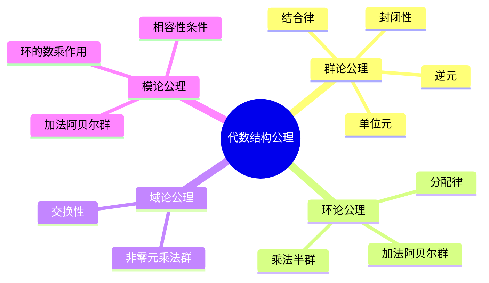
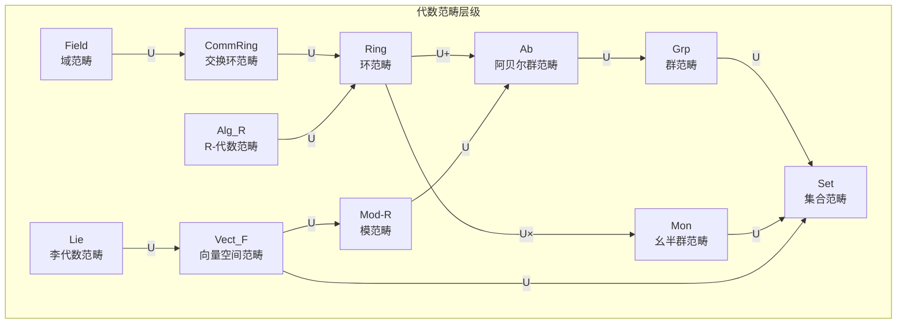
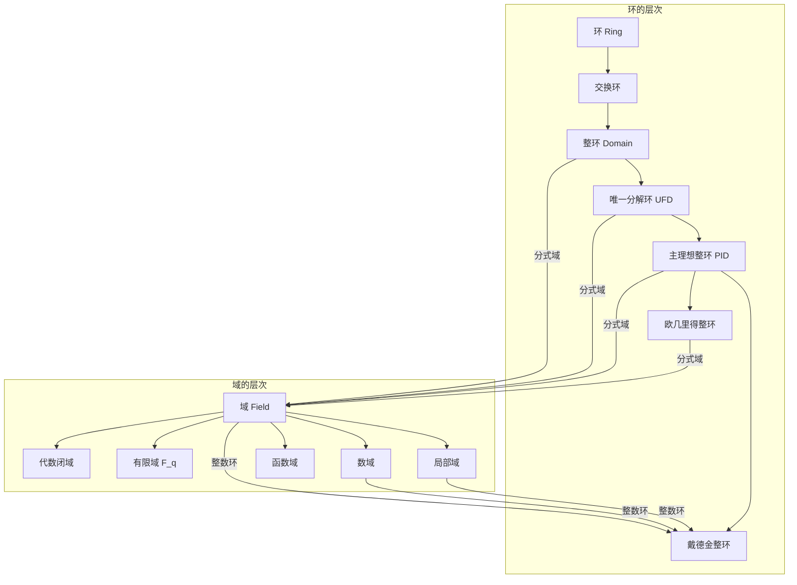
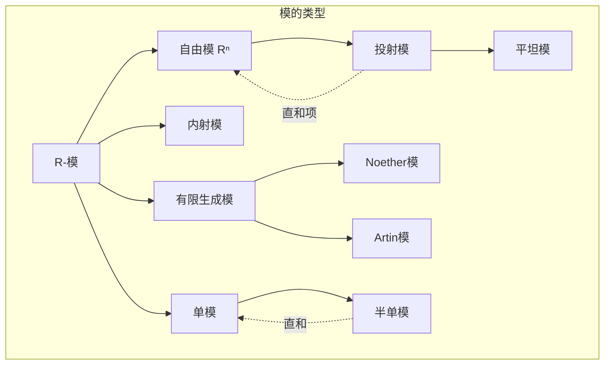
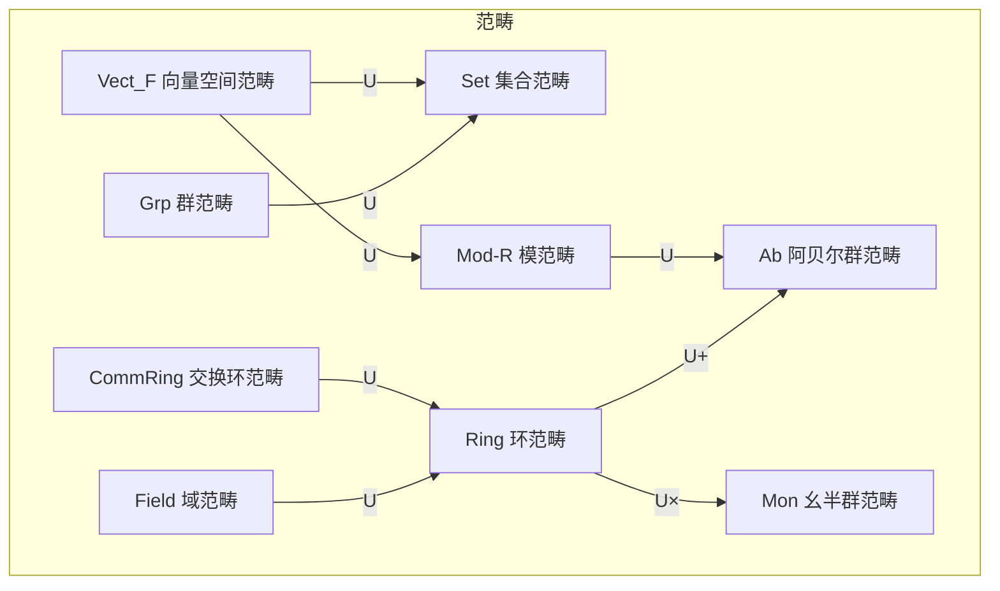

# 代数结构关联网络

> **FormalMath 项目第十批推进 - 维度B：理论模型关联网络**
> 
> 本文档详细梳理群、环、域、模四大代数结构之间的关联，包括包含关系、构造方法、遗忘函子与自由函子等。

---

## 目录

1. [代数结构层次图](#代数结构层次图)
2. [群 ↔ 环 关联](#群--环-关联)
3. [环 ↔ 域 关联](#环--域-关联)
4. [群 ↔ 域 关联](#群--域-关联)
5. [模 ↔ 向量空间 关联](#模--向量空间-关联)
6. [遗忘函子与自由函子](#遗忘函子与自由函子)
7. [代数结构的表示与作用](#代数结构的表示与作用)
8. [具体例子库](#具体例子库)

---

## 代数结构层次图

### 1.1 核心结构包含关系

```mermaid
graph TB
    subgraph 最基础结构[最基础结构]
        MAGMA[广群 Magma<br/>封闭二元运算]
        SET[集合 Set]
    end

    subgraph 基础结构[基础结构]
        SEMI[半群 Semigroup<br/>结合律]
        QUASI[拟群 Quasigroup<br/>可除性]
    end

    subgraph 中间结构[中间结构]
        MONOID[幺半群 Monoid<br/>单位元]
        LOOP[圈 Loop<br/>单位拟群]
    end

    subgraph 群及其推广[群及其推广]
        GRP[群 Group<br/>逆元]
        ABEL[阿贝尔群 Abelian Group<br/>交换律]
        RING[环 Ring<br/>双运算]
    end

    subgraph 高级代数结构[高级代数结构]
        COMM[交换环 Commutative Ring]
        FIELD[域 Field<br/>非零元可逆]
        MOD[模 Module<br/>环上的向量空间]
        ALG[代数 Algebra<br/>环+向量空间]
    end

    subgraph 特殊代数结构[特殊代数结构]
        DIV[除环 Division Ring]
        VEC[向量空间 Vector Space]
        LIE[李代数 Lie Algebra<br/>[,]运算]
        HOPF[Hopf代数<br/>对偶结构]
    end

    %% 层级关系
    SET -->|运算| MAGMA
    MAGMA -->|结合律| SEMI
    MAGMA -->|可除| QUASI
    SEMI -->|单位元| MONOID
    QUASI -->|单位元| LOOP
    MONOID -->|逆元| GRP
    GRP -->|交换| ABEL
    ABEL -->|+ 乘法| RING
    MONOID -->|End(M)| RING
    
    %% 环的推广
    RING -->|交换性| COMM
    COMM -->|非零元可逆| FIELD
    COMM -->|模结构| MOD
    RING -->|代数结构| ALG
    
    %% 域和向量空间
    FIELD -->|除环| DIV
    FIELD -->|F-模| VEC
    FIELD -->|结合代数| ALG
    
    %% 特殊结构
    RING -->|李括号| LIE
    ALG -->|余代数| HOPF
    MOD -->|自由模| VEC
    GRP -->|群代数| HOPF
```

### 1.2 按公理系统分类



### 1.3 代数结构的范畴层次



---

## 群 ↔ 环 关联

### 2.1 群到环的构造

| 构造方法 | 输入 | 输出 | 说明 | 例子 |
|---------|-----|-----|-----|-----|
| **群环** | 群 G, 环 R | 群环 R[G] | 形式线性组合 | ℤ[S₃] |
| **群代数** | 群 G, 域 F | 群代数 F[G] | 有限维代数 | ℂ[ℤ/nℤ] |
| **自同态环** | 阿贝尔群 A | End(A) | 群自同态 | End(ℤ) ≅ ℤ |
| **卷积代数** | 局部紧群 G | L¹(G) | 群上函数 | L¹(ℝ) |

**群环构造示例**：
```
设 G = {e, g, g²} 是 3 阶循环群，R = ℤ
则 ℤ[G] = {a₀·e + a₁·g + a₂·g² | aᵢ ∈ ℤ}
乘法由 (a·gⁱ)(b·gʲ) = ab·gⁱ⁺ʲ 定义
```

### 2.2 环到群的构造

| 构造方法 | 输入 | 输出 | 说明 | 例子 |
|---------|-----|-----|-----|-----|
| **加法群** | 环 R | (R, +) | 忘却乘法 | (ℤ, +) |
| **单位群** | 环 R | Rˣ | 可逆元群 | ℤˣ = {±1} |
| **主理想群** | 整环 D | Prin(D) | 主理想 | Kˣ/O_Kˣ |
| **类群** | Dedekind整环 | Cl(R) | 理想类群 | Cl(ℤ[√-5]) = ℤ/2ℤ |

**单位群示例**：
```
环 ℤ/nℤ 的单位群:
(ℤ/nℤ)ˣ = {a mod n | gcd(a,n) = 1}

例如: (ℤ/8ℤ)ˣ = {1, 3, 5, 7} ≅ ℤ/2ℤ × ℤ/2ℤ
```

### 2.3 群与环的核心关联图

```mermaid
graph TD
    subgraph 群侧[群侧构造]
        G[群 G]
        G_ABEL[阿贝尔群]
        G_FIN[有限群]
        G_CYCLIC[循环群]
    end

    subgraph 环侧[环侧构造]
        R[环 R]
        R_UNIT[单位群 Rˣ]
        R_ADD[加法群 R⁺]
        RG[群环 R[G]]
        ENDO[自同态环 End]
    end

    %% 群到环
    G -->|群环| RG
    G_ABEL -->|自同态环| ENDO
    G_FIN -->|卷积代数| R
    
    %% 环到群
    R -->|单位群| R_UNIT
    R -->|加法群| R_ADD
    R_UNIT -->|嵌入| G
    
    %% 特殊关系
    G_CYCLIC -->|ℤ[Cₙ]| RG
    RG -->|单位| R_UNIT
    ENDO -->|加法| R_ADD
```

---

## 环 ↔ 域 关联

### 3.1 环到域的构造

#### 3.1.1 分式域构造

```
定理: 任何整环 R 都可以嵌入到域 Frac(R) 中

构造方法:
1. 令 S = R \ {0}
2. 在 R × S 上定义等价关系: (a,s) ~ (b,t) ⇔ at = bs
3. Frac(R) = (R × S)/~，记作 a/s
4. 运算: a/s + b/t = (at+bs)/(st), (a/s)(b/t) = (ab)/(st)
```

| 整环 R | 分式域 Frac(R) | 说明 |
|-------|---------------|-----|
| ℤ | ℚ | 有理数域 |
| k[x] | k(x) | 有理函数域 |
| ℤ[i] | ℚ(i) | 高斯有理数域 |
| ℤ[√2] | ℚ(√2) | 二次域 |
| ℤ₍ₚ₎ | ℚₚ | p进数域 |

#### 3.1.2 素理想局部化

```
设 R 是交换环，P 是素理想
局部化 R_P = {a/s | a∈R, s∉P}

性质:
- R_P 是局部环（有唯一极大理想 PR_P）
- 若 R 是整环，Frac(R) = R_{(0)}
```

### 3.2 域到环的构造

| 构造方法 | 输入 | 输出 | 说明 |
|---------|-----|-----|-----|
| **整数环** | 数域 K | O_K | 代数整数环 |
| **多项式环** | 域 F | F[x₁,...,xₙ] | 多元多项式 |
| **形式幂级数** | 域 F | F[[x]] | 完备化环 |
| **赋值环** | 赋值域 | O_v | 离散赋值环 |

### 3.3 环与域的关联图



---

## 群 ↔ 域 关联

### 4.1 Galois理论：核心桥梁

```mermaid
graph TB
    subgraph FieldExt[域扩张 E/F]
        E[扩张域 E]
        F[基域 F]
        INT1[中间域 K₁]
        INT2[中间域 K₂]
    end

    subgraph GaloisGrp[Galois群 Gal(E/F)]
        G[Gal(E/F)]
        H1[子群 H₁]
        H2[子群 H₂]
        ID[{e}]
    end

    %% Galois对应
    E <-->|Fix| ID
    INT1 <-->|Gal(E/K₁)| H1
    INT2 <-->|Gal(E/K₂)| H2
    F <-->|Gal(E/F)| G

    style E fill:#ff9999
    style F fill:#99ff99
    style G fill:#9999ff
```

### 4.2 Galois理论基本定理

```
定理 (Galois理论基本定理):

设 E/F 是有限Galois扩张，G = Gal(E/F)

则存在一一对应:
{中间域 K: F ⊆ K ⊆ E} ⟷ {G的子群 H}

      K ⟼ Gal(E/K)
      Fix(H) ⟻ H

性质:
1. [E:K] = |Gal(E/K)|
2. [K:F] = [G : Gal(E/K)]
3. K/F 是Galois扩张 ⇔ Gal(E/K) ◁ G
   此时 Gal(K/F) ≅ G/Gal(E/K)
```

### 4.3 具体对应示例

| 域扩张 E/F | Galois群 | 对应关系 |
|-----------|---------|---------|
| ℂ/ℝ | ℤ/2ℤ | 复共轭 ↔ 非平凡元 |
| ℚ(√2)/ℚ | ℤ/2ℤ | √2 ↔ -√2 |
| ℚ(ζₙ)/ℚ | (ℤ/nℤ)ˣ | 本原单位根置换 |
| F_{qⁿ}/F_q | ℤ/nℤ | Frobenius ↔ 生成元 |
| 可分闭包/域 | 绝对Galois群 | 极限构造 |

### 4.4 域的乘法群结构

```
定理: 有限域 F_q 的乘法群 F_qˣ 是循环群

证明要点:
- F_qˣ 是阶为 q-1 的有限阿贝尔群
- xᵈ - 1 在 F_q 中至多有 d 个根
- 因此 F_qˣ 中阶整除 d 的元素至多有 d 个
- 由有限阿贝尔群结构定理，F_qˣ 是循环群
```

---

## 模 ↔ 向量空间 关联

### 5.1 模是向量空间的推广

| 结构 | 数乘域 | 性质 |
|-----|-------|-----|
| 向量空间 V | 域 F | 基存在，维数良定义 |
| 自由模 Rⁿ | 主理想整环 R | 秩良定义，基存在 |
| 一般模 M | 一般环 R | 基不一定存在 |
| 有限生成模 | Noether环 | 结构定理适用 |

### 5.2 模论基本定理

```
主理想整环上的有限生成模结构定理:

设 R 是 PID，M 是有限生成 R-模，则:

M ≅ Rʳ ⊕ ⊕ᵢ R/(pᵢ^{eᵢ})

其中:
- r = rank(M) 是自由秩
- (pᵢ^{eᵢ}) 是不变因子

例子 (R = ℤ):
有限生成阿贝尔群 ≅ ℤʳ ⊕ ⊕ᵢ ℤ/pᵢ^{eᵢ}ℤ
```

### 5.3 模的分类图



### 5.4 向量空间到模的推广对比

| 性质 | 向量空间 (F-模) | 一般 R-模 | 备注 |
|-----|----------------|----------|-----|
| 基的存在性 | 总有 | 不一定 | 自由模有基 |
| 维数/秩 | 良定义 | 良定义(若自由) | PID上有限生成模有秩 |
| 子空间补 | 总有 | 不一定 | 投射模是直和项 |
| 对偶空间 | 同构于原空间 | 不一定 | 自反模条件 |
| 线性映射 | 矩阵表示 | 同态 | 一般环上更复杂 |

---

## 遗忘函子与自由函子

### 6.1 遗忘函子图表



### 6.2 自由-遗忘伴随

```
自由函子 F: Set → Grp 与遗忘函子 U: Grp → Set 构成伴随:

Hom_{Grp}(F(X), G) ≅ Hom_{Set}(X, U(G))

具体构造:
F(X) = 以 X 为生成元的自由群
       = {X 上既约字}

例子:
F({a,b}) = ⟨a,b | ∅⟩ = {a,b}上的自由群
```

### 6.3 主要伴随对

| 自由函子 F | 遗忘函子 U | 伴随关系 |
|-----------|-----------|---------|
| Set → Grp | Grp → Set | 自由群 |
| Set → Ab | Ab → Set | 自由阿贝尔群 |
| Set → Ring | Ring → Set | 自由环 |
| Ring → Alg_R | Alg_R → Ring | 自由代数 |
| Set → Vect_F | Vect_F → Set | 向量空间 |
| Grp → Ab | Ab → Grp | 阿贝尔化 |

### 6.4 伴随关系的三角恒等式

```
伴随 F ⊣ U 满足:

1. 单位 η: Id → UF
   η_X: X → U(F(X))
   
2. 余单位 ε: FU → Id
   ε_A: F(U(A)) → A

三角恒等式:
(εF) ∘ (Fη) = id_F
(Uε) ∘ (ηU) = id_U
```

---

## 代数结构的表示与作用

### 7.1 群表示

```
定义: 群 G 在域 F 上的表示是群同态
      ρ: G → GL(V) ≅ GLₙ(F)

等价形式:
- F[G]-模结构
- G-空间上的线性作用
- G × V → V, (g,v) ↦ g·v

例子: S₃ 在 ℝ³ 上的置换表示
ρ((12)) = [[0,1,0],[1,0,0],[0,0,1]]
```

### 7.2 李代数表示

```
定义: 李代数 𝔤 在向量空间 V 上的表示是李代数同态
      ρ: 𝔤 → 𝔤𝔩(V)

即满足:
ρ([X,Y]) = [ρ(X), ρ(Y)] = ρ(X)ρ(Y) - ρ(Y)ρ(X)

等价形式:
- U(𝔤)-模结构（泛包络代数）
- 相容的双线性映射 𝔤 × V → V
```

### 7.3 模作为表示的统一视角

```mermaid
graph LR
    subgraph Representation[表示的统一视角]
        G_REP[群表示<br/>G → GL(V)]
        LIE_REP[李代数表示<br/>𝔤 → 𝔤𝔩(V)]
        ALG_REP[代数表示<br/>A → End(V)]
        MOD_STR[模结构<br/>R × M → M]
    end

    G_REP -.->|F[G]-模| MOD_STR
    LIE_REP -.->|U(𝔤)-模| MOD_STR
    ALG_REP -.->|A-模| MOD_STR
```

### 7.4 表示论的核心问题

| 问题 | 群表示 | 李代数表示 | 代数表示 |
|-----|-------|-----------|---------|
| 不可约表示分类 | 特征标理论 | 最高权理论 | 单模分类 |
| 完全可约性 | Maschke定理 | Weyl定理 | 半单代数 |
| 特征标 | χ(g) = tr(ρ(g)) | 形式特征标 | - |
| 张量积 | 表示的积 | 张量积表示 | 模的张量积 |

---

## 具体例子库

### 8.1 经典代数结构实例

| 结构 | 例子 | 关键性质 |
|-----|-----|---------|
| 群 | GL(n,ℝ) | 一般线性群，李群结构 |
| 群 | Sₙ | 置换群，n! 阶 |
| 群 | ℤ/nℤ | 循环群，加法群 |
| 环 | Mₙ(ℝ) | 矩阵环，非交换 |
| 环 | ℤ[i] | 高斯整数环，欧几里得整环 |
| 域 | ℚ(√-1) | 虚二次域 |
| 域 | F_{pⁿ} | 有限域，特征p |
| 模 | ℤ² | 自由ℤ-模，秩2 |
| 模 | ℚ/ℤ | 可除群，内射ℤ-模 |

### 8.2 结构间的转化链

```
ℤ (环) → Frac(ℤ) = ℚ (域) → ℚ-vector spaces
  ↓                    ↓
ℤ/nℤ (商环) ← 理想 (n)    ℚ[x]/(x²+1) = ℚ(i)
  ↓                          ↓
ℤ/nℤ-modules              ℚ(i)-vector spaces
```

### 8.3 典型结构的完整关系图

```mermaid
graph TB
    subgraph Examples[典型例子网络]
        Z[ℤ]
        Q[ℚ]
        QI[ℚ(i)]
        ZI[ℤ[i]]
        Z5[ℤ[√-5]]
        M2[M₂(ℝ)]
        GL[GL(2,ℝ)]
        Z4[ℤ/4ℤ]
    end

    subgraph Relations[关系标注]
        Z -->|分式域| Q
        Z -->|商| Z4
        ZI -->|分式域| QI
        Z -->|高斯整数| ZI
        Z -->|非UFD例子| Z5
        M2 -->|单位群| GL
    end
```

### 8.4 整数环 ℤ 的中心地位

```mermaid
graph TB
    subgraph ZInteger[整数环 ℤ 的关联网络]
        Z[ℤ - 中心节点]
    end

    subgraph Extensions[扩张]
        ZI[ℤ[i]]
        ZW[ℤ[ω]]
        ZN[ℤ[√-5]]
    end

    subgraph Quotients[商结构]
        ZN1[ℤ/nℤ]
        ZP[ℤ₍ₚ₎]
        ZHAT[Ẑ]
    end

    subgraph Modules[模结构]
        AB[阿贝尔群]
        ZMOD[ℤ-模]
    end

    Z -->|二次扩张| ZI
    Z -->|三次单位根| ZW
    Z -->|非UFD例子| ZN
    Z -->|商环| ZN1
    Z -->|局部化| ZP
    Z -->|完备化| ZHAT
    Z -->|模范畴| ZMOD
    ZMOD -->|等价| AB
```

---

## 关联统计

- **核心代数结构**: 15+
- **构造方法**: 20+
- **关联关系**: 50+
- **具体例子**: 30+
- **伴随对**: 8
- **范畴**: 12+

---

*文档版本: 2026年4月 | 代数结构关联网络*
*FormalMath 项目第十批推进 - 维度B*
