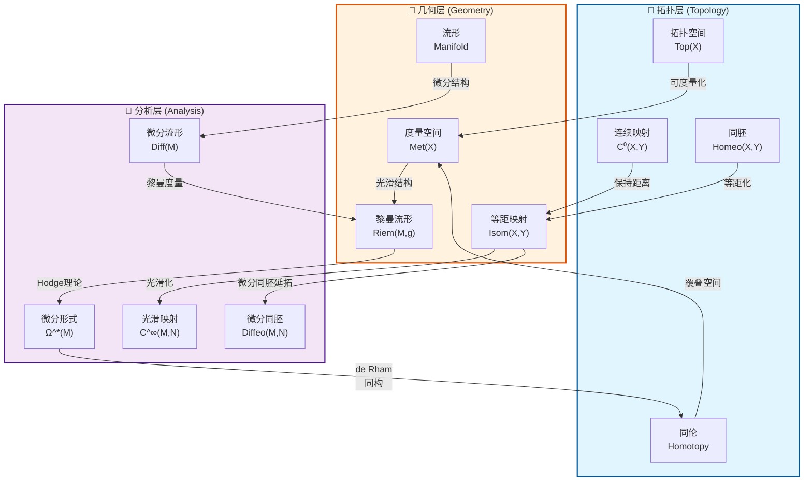
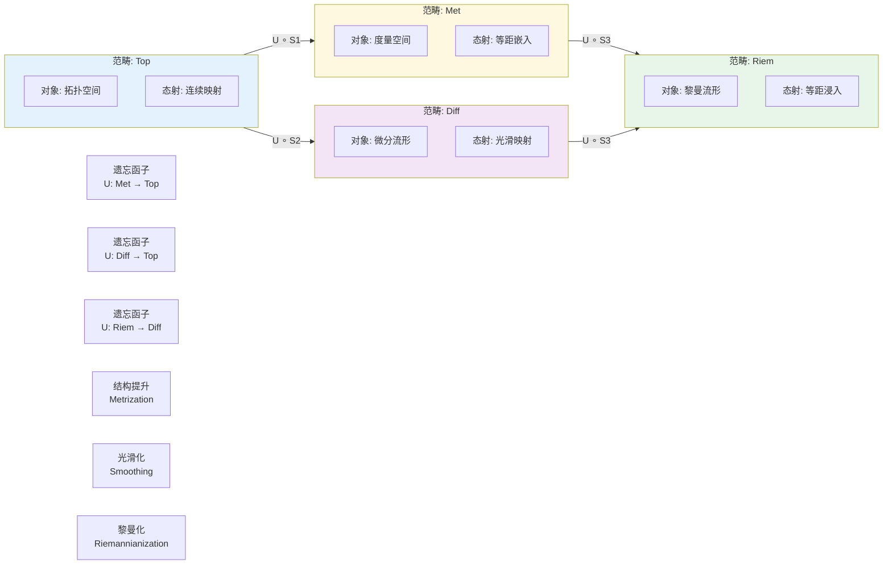
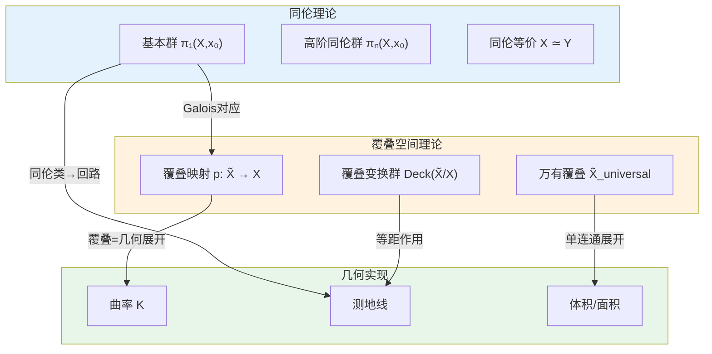
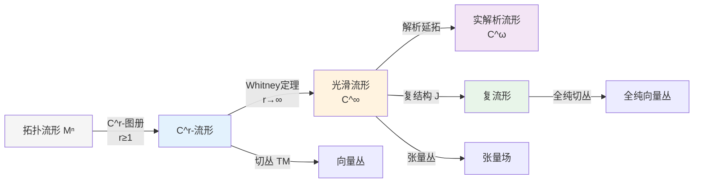
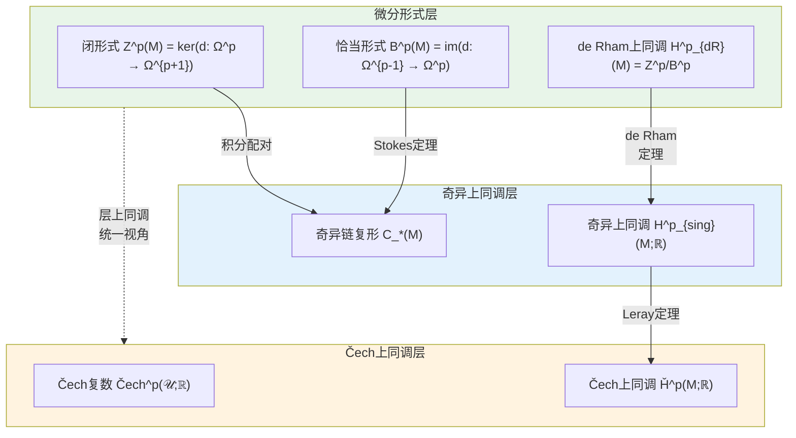
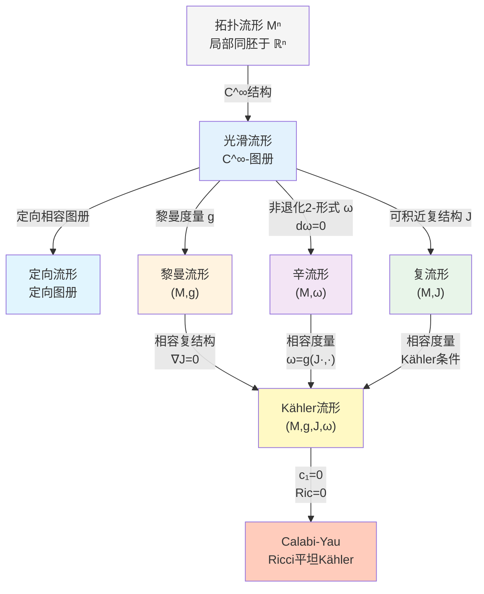
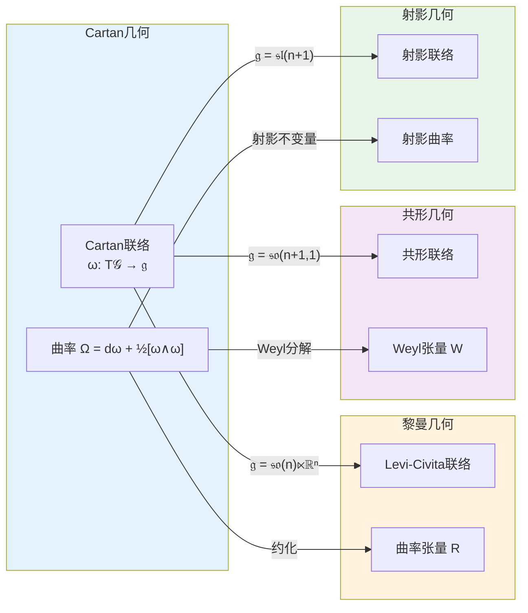
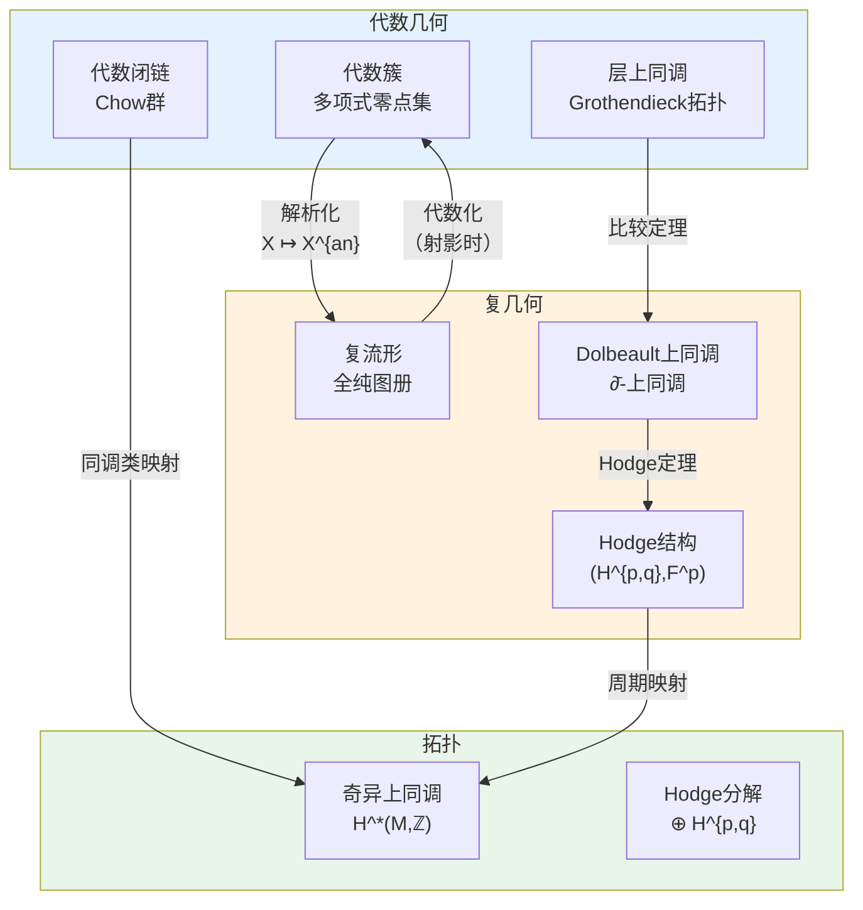

msc_primary: "00A99"
msc_secondary: ['00-00']
---

# 几何与拓扑关联网络

> **版本**: v1.0
> **创建日期**: 2026年4月
> **适用范围**: FormalMath 项目第十批全面推进

## 目录

1. [引言：几何与拓扑的统一视角](#引言几何与拓扑的统一视角)
2. [拓扑→几何→分析映射图](#拓扑几何分析映射图)
3. [拓扑不变量与几何性质](#拓扑不变量与几何性质)
4. [几何结构层次](#几何结构层次)
5. [跨分支映射实例](#跨分支映射实例)
6. [几何-拓扑对偶表](#几何-拓扑对偶表)
7. [深入分析：函子的自然变换](#深入分析函子的自然变换)
8. [总结与展望](#总结与展望)

---

## 引言：几何与拓扑的统一视角

几何学与拓扑学作为数学的两大核心分支，在现代数学发展中呈现出深度融合的趋势。拓扑学研究空间在连续变形下的不变性质，关注"连通性"、"紧致性"、"定向性"等全局特征；几何学则研究空间中的度量结构、曲率、角度等局部性质。分析学为两者提供了强大的工具，通过微积分、微分方程和泛函分析等方法，架起了拓扑与几何之间的桥梁。

从历史发展的角度来看，几何与拓扑的分离始于高斯、黎曼对曲面内蕴几何的研究。高斯的绝妙定理（Theorema Egregium）揭示了Gauss曲率是曲面的内蕴不变量，这一发现标志着微分几何与拓扑学开始形成各自的研究范式。然而，Poincaré在19世纪末创立代数拓扑学时，就将拓扑不变量与几何直观紧密结合起来。进入20世纪后，de Rham、Hodge、Chern等人的工作进一步深化了几何与拓扑的联系。

本关联网络旨在系统性地构建几何与拓扑之间的完整映射关系，揭示三个层次（拓扑层、几何层、分析层）之间的函子对应，以及各层次内部的丰富结构。这一框架不仅有助于理解经典结果（如de Rham定理、Gauss-Bonnet定理），也为现代数学的前沿领域（如镜像对称、几何表示论）提供概念基础。

数学结构的层次性是我们理解这一网络的关键视角。从最基本的拓扑空间出发，逐步添加结构——首先是度量结构，然后是微分结构，接着是黎曼度量，最后是各种特殊几何结构（复结构、辛结构等）——每一步都对应着结构群的约化，也对应着更丰富的不变量和更精细的分类。

---

## 拓扑→几何→分析映射图

### 2.1 三层结构总览

以下Mermaid图展示了拓扑、几何、分析三个层次的核心对象及其之间的函子关系：

**图1: 拓扑-几何-分析三层映射总览**

该图展示了从拓扑空间到微分流形的逐步结构增强过程。拓扑空间通过**可度量化**（metrization）获得度量结构，成为度量空间；度量空间通过**光滑化**（smoothing）获得微分结构，成为微分流形；微分流形通过**黎曼度量**（Riemannian metric）获得几何结构，成为黎曼流形。每一层次的态射（连续映射、等距映射、光滑映射）也相应地提升正则性。

这种层次结构的深刻性在于：并非所有拓扑空间都可度量化（需要满足某些分离公理和可数性条件）；并非所有度量空间都是流形（需要局部欧氏性）；并非所有光滑流形都容许复结构（这是一个高度非平凡的问题）。这些存在性条件本身就是深刻的数学结果，反映了不同层次之间的真正区别。

### 2.2 函子关系详图

以下图表详细展示了三个层次之间的函子对应关系：

**图2: 范畴论视角下的函子关系**

从范畴论的角度看，我们有以下遗忘函子（forgetful functors）：

| 遗忘函子 | 定义域 | 值域 | 遗忘的结构 |
|---------|--------|------|-----------|
| $U_{Met}$ | Met | Top | 度量结构 $d$ |
| $U_{Diff}$ | Diff | Top | 光滑图册 |
| $U_{Riem}$ | Riem | Diff | 黎曼度量 $g$ |
| $U_{Symp}$ | Symp | Diff | 辛结构 $\omega$ |
| $U_{Comp}$ | Comp | Diff | 复结构 $J$ |

这些遗忘函子反映了数学结构层次性的核心特征：上层结构通过添加额外数据从下层结构"提升"而来，而遗忘函子则将这些附加结构"遗忘"。

范畴论的语言为我们理解这些层次关系提供了统一的框架。每个"结构提升"（structure lift）都可以看作是从低级范畴到高级范畴的某种函子，而遗忘函子则是其右伴随（在适当条件下）。这种伴随关系意味着：给定一个拓扑空间，我们可以考虑所有可能的度量结构；给定一个度量空间，我们可以考虑所有可能的黎曼度量——这些结构空间本身构成了丰富的几何对象。

### 2.3 同伦与覆叠空间的对应

**图3: 同伦-覆叠-几何对应关系**

这张图揭示了同伦论与覆叠空间理论之间的深刻联系。核心定理包括：

**定理 2.1** (覆叠空间的Galois对应): 设 $X$ 是道路连通、局部道路连通且半局部单连通的拓扑空间，则：
$$\{\text{覆叠空间 } \tilde{X} \to X\}/\sim \quad \longleftrightarrow \quad \{\pi_1(X) \text{ 的子群}\}/\text{共轭}$$

这一对应是Galois理论在拓扑学中的类比。覆叠空间的"层数"对应于子群的指数，连通覆叠对应于正规子群，万有覆叠对应于平凡子群。

**定理 2.2** (万有覆叠的存在性): 在上述条件下，存在万有覆叠空间 $p: \tilde{X} \to X$，满足：

- $\tilde{X}$ 是单连通的
- Deck变换群 $\text{Deck}(\tilde{X}/X) \cong \pi_1(X)$

在黎曼几何中，这一理论有重要的几何实现。给定一个黎曼流形 $(M, g)$，其万有覆叠空间 $\tilde{M}$ 自然继承拉回度量 $\tilde{g} = p^*g$，使得覆叠映射成为局部等距。这使得我们可以将曲率、测地线等局部几何量从底空间提升到覆叠空间，从而利用单连通空间的简化性质研究非单连通流形。

### 2.4 微分结构的传递

**图4: 微分结构的层次传递**

该图展示了在拓扑流形上逐步添加微分结构的过程。关键结果包括：

**定理 2.3** (Whitney光滑化): 每个 $C^r$ 流形 ($r \geq 1$) 都 $C^r$-微分同胚于某个 $C^\infty$ 流形，且光滑结构在微分同胚意义下唯一。

这意味着在微分拓扑的范畴内，$C^1$、$C^\infty$ 和 $C^\omega$ 之间没有本质区别。然而，这并不意味着所有结构都可以任意提升。例如，并非所有偶维光滑流形容许复结构。

**定理 2.4** (复结构的存在性): 并非所有偶维光滑流形容许复结构。复结构的存在是高度非平凡的几何条件。

著名的例子包括：四维球面 $S^4$ 不容许复结构（这是一个尚未完全证明的著名猜想）；六维球面 $S^6$ 是否容许复结构也是一个悬而未决的问题。这些问题的困难性反映了复结构的丰富性和严格性。

### 2.5 de Rham上同调的函子性

**图5: de Rham定理与上同调统一**

**定理 2.5** (de Rham定理): 对于光滑流形 $M$，存在自然同构：
$$H^p_{dR}(M) \cong H^p_{sing}(M; \mathbb{R}) \cong \check{H}^p(M; \mathbb{R})$$

这一定理是几何（微分形式）、拓扑（奇异上同调）和分析（层上同调）三方统一的典范。

de Rham定理的核心在于建立了闭形式与拓扑循环之间的对偶关系。一个闭 $p$-形式 $\omega$ 定义了 $H_p(M;\mathbb{R})$ 上的线性泛函：
$$[\omega]([c]) = \int_c \omega$$

Stokes定理保证了这一定义的良定性：如果 $\omega = d\eta$，则对闭链 $c$ 有 $\int_c \omega = \int_c d\eta = \int_{\partial c} \eta = 0$。de Rham定理断言这种配对是非退化的，从而建立了同构。

---

## 拓扑不变量与几何性质

### 3.1 基本群与几何实现

#### 3.1.1 基本群的拓扑定义与几何解释

**定义 3.1** (基本群): 设 $(X, x_0)$ 是带基点的拓扑空间，其基本群定义为：
$$\pi_1(X, x_0) = \{[\gamma] : \gamma \text{ 是基于 } x_0 \text{ 的回路}\}$$

其中群运算由道路的连接给出，单位元是常值道路。

在黎曼几何中，基本群有深刻的几何解释。每条回路同伦类都包含测地线代表元（在一定条件下），这使得我们可以用几何方法来研究拓扑不变量。

**定理 3.1** (Cartan-Ambrose-Hicks): 设 $(M, g)$ 和 $(N, h)$ 是完备、单连通的黎曼流形，若存在线性等距 $\phi: T_p M \to T_q N$ 保持曲率张量及其协变导数，则存在等距 $F: M \to N$ 使得 $dF_p = \phi$。

这一定理表明：在单连通情形下，局部曲率信息完全决定了整体几何（等距）。对于非单连通流形，这种唯一性可能失效，而失效的方式正是由基本群所编码。

**几何对应表：基本群**

| 拓扑概念 | 几何解释 | 分析实现 |
|---------|---------|---------|
| $\pi_1(M) = 0$ | 单连通流形 | 调和形式唯一性 |
| $\pi_1(M)$ 有限 | 紧致、正Ricci曲率 | 特征值离散谱 |
| $\pi_1(M)$ 无限 | 非紧致或负曲率 | 连续谱存在 |
| $\pi_1(M) = \mathbb{Z}^n$ | 平坦环面 $T^n$ | Fourier分析 |
| 自由群 $F_g$ | 亏格 $g$ 曲面 | Teichmüller理论 |

#### 3.1.2 覆叠空间的度量结构

当底空间 $M$ 具有黎曼度量 $g$ 时，覆叠空间 $\tilde{M}$ 继承自然的拉回度量 $\tilde{g} = p^*g$。

**命题 3.1**: 覆叠映射 $p: (\tilde{M}, \tilde{g}) \to (M, g)$ 是局部等距。

这意味着在任意点 $x \in M$ 的充分小邻域 $U$ 上，覆叠映射 $p: p^{-1}(U) \to U$ 是等距的（在每片连通分支上）。

**推论 3.1**: 若 $M$ 是完备的，则 $\tilde{M}$ 也是完备的（Hopf-Rinow定理）。

完备性的保持非常重要，因为它保证了测地线的无限延伸性。在单连通的完备黎曼流形上，任意两点之间存在最短测地线，这通过覆叠可以给出原流形上测地线的信息。

### 3.2 同调群与de Rham理论

#### 3.2.1 同调代数的三个视角

同调论可以从代数拓扑、微分几何和层论三个角度理解，它们各自提供了不同的计算工具和几何洞察。

**代数拓扑视角**: 奇异同调 $H_*(X; R)$ 是通过链复形 $C_*(X; R)$ 的同调定义的。它的优点是具有很强的函子性，适用于任意拓扑空间；缺点是对于光滑流形，其几何意义不如微分形式直接。

**微分几何视角**: de Rham上同调 $H^*_{dR}(M)$ 通过微分形式和外微分算子 $d$ 定义。它的优点是直接反映了几何结构（如闭形式表示局部可积条件）；缺点是仅适用于光滑流形。

**层论视角**: 层上同调 $H^*(M, \mathcal{F})$ 通过内射分解或Čech上同调定义。它的优点是适用于复几何和代数几何，可以处理全纯对象；缺点是技术较为复杂。

#### 3.2.2 de Rham复形与Hodge理论

**定义 3.2** (de Rham复形): 对于黎曼流形 $(M, g)$，de Rham复形为：
$$0 \to \Omega^0(M) \xrightarrow{d} \Omega^1(M) \xrightarrow{d} \cdots \xrightarrow{d} \Omega^n(M) \to 0$$

外微分算子 $d$ 满足 $d^2 = 0$，这使得上述序列成为链复形。其上同调即为de Rham上同调。

**定理 3.2** (Hodge分解): 设 $M$ 是紧致定向黎曼流形，则：
$$\Omega^p(M) = \mathcal{H}^p(M) \oplus d\Omega^{p-1}(M) \oplus d^*\Omega^{p+1}(M)$$

其中 $\mathcal{H}^p(M) = \{\omega \in \Omega^p : \Delta\omega = 0\}$ 是调和形式空间，且 $\mathcal{H}^p(M) \cong H^p_{dR}(M)$。

Hodge分解的核心洞见是：每个上同调类都有唯一的调和代表元。这不仅给出了计算上同调的有效方法（求解Laplace方程），还揭示了上同调的几何结构——调和形式空间自然地具有内积结构，使得上同调成为一个Hilbert空间。

**定理 3.3** (Poincaré对偶): 对于 $n$ 维紧致定向流形：
$$H^p_{dR}(M) \cong H^{n-p}_{dR}(M)$$

通过内积 $(\alpha, \beta) \mapsto \int_M \alpha \wedge \beta$ 实现。

Poincaré对偶是拓扑学中最深刻的结果之一。它将不同维度的上同调联系起来，使得我们可以用低维形式来研究高维拓扑。在几何上，这对应于相交理论的Poincaré对偶版本：一个 $p$-维子流形和一个 $(n-p)$-维子流形的相交数等于它们Poincaré对偶类的杯积在基本类上的取值。

### 3.3 示性类与几何构造

#### 3.3.1 向量丛的示性类

示性类是将拓扑不变量（特征数）与几何构造（曲率形式）联系起来的桥梁。Chern-Weil理论提供了从联络的曲率形式构造示性类的系统方法。

**定理 3.4** (Chern-Weil理论): 设 $E \to M$ 是光滑向量丛，$\nabla$ 是其联络，曲率形式为 $\Omega = \nabla^2 \in \Omega^2(\text{End}(E))$。

对于 $GL(n,\mathbb{C})$-不变多项式 $P$，定义示性形式：
$$P(\Omega) \in \Omega^{2k}(M)$$

则：

1. $P(\Omega)$ 是闭形式
2. 上同调类 $[P(\Omega)] \in H^{2k}_{dR}(M)$ 与联络选取无关

这意味着示性类可以通过任意的联络（特别是具有几何意义的联络，如Levi-Civita联络或Hermitian联络）来计算，而结果与具体选取无关。

#### 3.3.2 主要示性类表

| 示性类 | 结构群 | 曲率表达式 | 几何/拓扑意义 |
|-------|-------|-----------|--------------|
| **Chern类** $c_k(E)$ | $U(n)$ | $P_k(\frac{i\Omega}{2\pi})$ | 复向量丛的拓扑障碍 |
| **Pontryagin类** $p_k(E)$ | $SO(n)$ | $P_k(\frac{\Omega}{2\pi})$ | 实向量丛的稳定特征 |
| **Euler类** $e(E)$ | $SO(2n)$ | $\text{Pf}(\frac{\Omega}{2\pi})$ | 定向障碍 |
| **Stiefel-Whitney类** $w_k(E)$ | $O(n)$ | （模2上同调） | 实向量丛的存在性 |
| **Todd类** $\text{td}(E)$ | $U(n)$ | 乘性序列 | Riemann-Roch定理 |
| **Â-亏格** $\hat{A}(E)$ | $SO(n)$ | 乘性序列 | 指标定理 |

这些示性类各自反映了向量丛的不同拓扑性质。Chern类适用于复向量丛，其中 $c_1(E)$ 与线丛的度数相关，$c_n(E)$ 与Euler类在定向实丛情形下相关。Pontryagin类是实向量丛的示性类，可以通过复化丛的Chern类来表示：$p_k(E) = (-1)^k c_{2k}(E \otimes \mathbb{C})$。

#### 3.3.3 切丛与法丛的几何

对于浸入 $f: M^n \to N^{n+k}$，有正合序列：
$$0 \to TM \to f^*TN \to \nu_f \to 0$$

其中 $\nu_f$ 是法丛。示性类的关系由Whitney和公式给出：
$$p(TM) \smile p(\nu_f) = p(f^*TN) = f^*p(TN)$$

这一定理在子流形理论中具有核心重要性。例如，在计算子流形的示性类时，我们可以利用周围空间的已知信息。特别地，对于嵌入在欧氏空间 $\mathbb{R}^{n+k}$ 中的子流形，法丛的示性类包含了切丛拓扑的全部信息。

### 3.4 Euler示性数与Gauss-Bonnet定理

#### 3.4.1 Euler示性数的多种定义

**定义 3.3** (Euler示性数): 对于紧致拓扑空间 $X$，
$$\chi(X) = \sum_{i=0}^{\infty} (-1)^i \dim H_i(X; \mathbb{Q})$$

对于有限CW复形，也可用胞腔计数：
$$\chi(X) = \sum_{i} (-1)^i c_i$$

其中 $c_i$ 是 $i$ 维胞腔数。

Euler示性数的多种等价定义反映了它的普适性。在拓扑学中，它是同伦不变量；在组合学中，它可以通过三角剖分计算；在微分几何中，它可以通过曲率积分表示。

#### 3.4.2 经典Gauss-Bonnet定理

**定理 3.5** (Gauss-Bonnet-Chern): 设 $(M^{2n}, g)$ 是紧致定向黎曼流形，则：
$$\int_M \text{Pf}(\Omega) = (2\pi)^n \chi(M)$$

其中 $\text{Pf}$ 是Pfaffian，$\Omega$ 是曲率形式。

**特例** (2维曲面):
$$\int_M K \, dA = 2\pi \chi(M) = 2\pi (2 - 2g)$$

其中 $K$ 是Gauss曲率，$g$ 是亏格。

Gauss-Bonnet定理是数学中最优美的结果之一。它将局部的曲率信息（描述每一点附近的弯曲程度）与全局的拓扑不变量（描述整体的"洞"的数量）联系起来。在正曲率曲面上（如球面），曲率的积分给出正的Euler示性数；在负曲率曲面上（如高亏格曲面），曲率的积分给出负的Euler示性数。

**证明思路**: 示性形式 $\text{Pf}(\Omega)$ 代表Euler类，积分给出示性数。证明的关键在于使用超渡（transgression）技巧，将曲率形式与示性类联系起来。

#### 3.4.3 Poincaré-Hopf定理

**定理 3.6** (Poincaré-Hopf): 设 $X$ 是紧致光滑流形 $M$ 上的向量场，具有孤立零点 $\{p_i\}$，则：
$$\sum_i \text{ind}_{p_i}(X) = \chi(M)$$

这一定理将拓扑不变量（Euler示性数）与几何对象（向量场零点指标）联系起来。直观上，它表明任何向量场的"扭转"总量（由零点指标测量）必须等于流形的拓扑复杂度（由Euler示性数测量）。

在物理上，这一定理与流体动力学中的涡旋、磁学中的单极子等概念密切相关。在复几何中，它与全纯向量场的零点计数有关。

---

## 几何结构层次

### 4.1 从拓扑流形到复流形的结构塔

**图6: 几何结构层次塔**

该图展示了从最基本的拓扑流形逐步添加结构直至Calabi-Yau流形的完整过程。每一层结构都对应着结构群的约化，也对应着更丰富的不变量和更精细的分类。

### 4.2 结构群约化（Structure Group Reduction）

#### 4.2.1 框架丛与结构群

**定义 4.1** (标架丛): 设 $M$ 是 $n$ 维光滑流形，其标架丛 $FM$ 是 $GL(n,\mathbb{R})$-主丛，纤维过 $p \in M$ 为 $T_p M$ 的所有基。

标架丛是构造所有张量丛的基础。给定标架丛的一个表示，我们可以构造相应的配丛（associated bundle）。例如，切丛对应于标准表示，余切丛对应于对偶表示，张量丛对应于张量积表示。

**定理 4.1** (结构群约化): 几何结构的存在等价于标架丛结构群的约化：

| 结构群约化 | 几何结构 | 条件 |
|-----------|---------|------|
| $GL(n,\mathbb{R}) \to O(n)$ | 黎曼度量 | 正定内积 |
| $GL(n,\mathbb{R}) \to GL(n/2,\mathbb{C})$ | 近复结构 | $n$ 偶数 |
| $GL(n,\mathbb{C}) \to U(n/2)$ | Hermitian度量 | 相容度量 |
| $U(n) \to SU(n)$ | 平凡典范丛 | $c_1 = 0$ |
| $GL(n,\mathbb{R}) \to Sp(n,\mathbb{R})$ | 辛结构 | $n$ 偶数，$\omega$ 非退化 |

#### 4.2.2 约化的障碍理论

结构群约化存在拓扑障碍，由高阶示性类描述：

**定理 4.2**:

- 黎曼度量总是存在（单位分解）
- 定向存在 $\Leftrightarrow$ $w_1(M) = 0$
- 近复结构存在需要 $n$ 偶数且存在 $J: TM \to TM$，$J^2 = -I$
- 旋量结构存在 $\Leftrightarrow$ $w_2(M) = 0$

这些障碍类反映了相应结构的拓扑约束。例如，$w_1(M)$ 是第一Stiefel-Whitney类，其消失意味着切丛可定向；$w_2(M)$ 是第二Stiefel-Whitney类，其消失意味着存在旋量结构，这在物理学的超对称理论中至关重要。

### 4.3 嘉当几何的统一框架

#### 4.3.1 Klein几何的 Erlangen 纲领

Felix Klein的Erlangen纲领将几何学统一为群作用下的不变量理论。

**定义 4.2** (Klein几何): Klein几何是一对 $(G, H)$，其中 $G$ 是Lie群，$H$ 是闭子群。相应的几何空间是齐性空间 $G/H$。

| Klein几何 | 空间 | 变换群 | 主要不变量 |
|----------|------|-------|-----------|
| 欧氏几何 | $\mathbb{E}^n$ | $ISO(n) = \mathbb{R}^n \rtimes O(n)$ | 距离、角度、体积 |
| 球面几何 | $S^n$ | $SO(n+1)$ | 球面距离、角度 |
| 双曲几何 | $\mathbb{H}^n$ | $SO^+(n,1)$ | 双曲距离 |
| 仿射几何 | $\mathbb{A}^n$ | $Aff(n) = \mathbb{R}^n \rtimes GL(n)$ | 平行性、体积比 |
| 射影几何 | $\mathbb{RP}^n$ | $PGL(n+1)$ | 交比 |

Klein的观点彻底改变了人们对几何学的理解。在Klein的框架下，不同的几何学对应于不同的变换群，几何定理就是在相应变换群作用下不变的命题。

#### 4.3.2 Cartan联络与曲率

**定义 4.3** (Cartan几何): Cartan几何是将Klein几何局部化到流形上的结构。它由以下数据组成：

- 主 $H$-丛 $\mathcal{G} \to M$
- Cartan联络 $\omega \in \Omega^1(\mathcal{G}; \mathfrak{g})$ 满足：
  1. $R_h^*\omega = \text{Ad}_{h^{-1}}\omega$
  2. $\omega(A^*) = A$ 对基本向量场
  3. $\omega_p: T_p\mathcal{G} \to \mathfrak{g}$ 是同构

**曲率形式**: $\Omega = d\omega + \frac{1}{2}[\omega \wedge \omega]$

**平坦性**: $\Omega = 0$ $\Leftrightarrow$ 局部同构于Klein几何模型

Cartan几何的美妙之处在于它统一了各种几何结构。黎曼几何、共形几何、射影几何、CR几何等都可以看作Cartan几何的特例，只需要选取不同的模型空间 $(G, H)$。

#### 4.3.3 Cartan几何的特例

**图7: Cartan几何的实例化**

### 4.4 Kähler几何的深层结构

#### 4.4.1 Kähler条件的等价表述

对于近Hermitian流形 $(M, g, J)$，以下条件等价：

1. **几何条件**: $\nabla J = 0$（复结构平移不变）
2. **辛条件**: $d\omega = 0$，其中 $\omega(\cdot,\cdot) = g(J\cdot,\cdot)$
3. **全纯条件**: 存在全纯坐标使 $g_{i\bar{j}} = \delta_{ij} + O(|z|^2)$

4. **曲率条件**: 曲率张量满足 $R(JX,JY) = R(X,Y)$

Kähler条件的多种等价表述反映了它连接多个数学分支的能力。从复几何的角度，它是Hermitian度量与复结构相容的条件；从辛几何的角度，它是辛形式与复结构相容的条件；从分析的角度，它保证了Laplace算子的良好性质（如形式伴随的可交换性）。

#### 4.4.2 Kähler流形的上同调

**定理 4.3** (Hodge-Lefschetz分解): 紧致Kähler流形上存在L算子：
$$L: H^{p,q}(M) \to H^{p+1,q+1}(M), \quad L([\alpha]) = [\omega \wedge \alpha]$$

以及Lefschetz分解：
$$H^k(M;\mathbb{C}) = \bigoplus_{r \geq \max(0,k-n)} L^r P^{k-2r}$$

其中 $P^\bullet$ 是本原上同调。

**定理 4.4** (Hard Lefschetz): $L^{n-k}: H^k(M) \to H^{2n-k}(M)$ 是同构。

Hard Lefschetz定理是Kähler流形拓扑的核心结果。它建立了上同调群之间的深刻对称性，这种对称性对于一般的辛流形并不成立。这使得Kähler流形的拓扑比一般的辛流形更为刚性。

---

## 跨分支映射实例

### 5.1 代数几何与复几何：GAGA原理

#### 5.1.1 Serre的GAGA定理

**定理 5.1** (Géométrie Algébrique et Géométrie Analytique): 设 $X$ 是复射影簇，则：

1. **凝聚层对应**: 代数凝聚层 $\mathcal{F}$ 与解析凝聚层 $\mathcal{F}^{an}$ 范畴等价
2. **上同调同构**: $H^i(X, \mathcal{F}) \cong H^i(X^{an}, \mathcal{F}^{an})$
3. **态射延拓**: 代数态射 $f: X \to Y$ 与全纯映射 $f^{an}: X^{an} \to Y^{an}$ 一一对应

**意义**: 在射影情形下，代数方法与解析方法等价，允许在不同框架间自由切换工具。

GAGA原理是数学中"刚性"现象的典范。在复流形上，全纯函数具有极强的刚性（由唯一延拓定理），这使得在紧复流形上，全纯对象往往具有代数性质。这种刚性对于非紧流形或Stein流形并不成立，体现了紧致性的深刻影响。

#### 5.1.2 复几何中的代数方法

**图8: GAGA原理与比较定理**

### 5.2 辛几何与代数几何：镜像对称

#### 5.2.1 镜像对称的基本框架

**猜想 5.1** (镜像对称): 对于Calabi-Yau 3-fold $M$，存在"镜像"流形 $W$ 使得：

$$H^{p,q}(M) \cong H^{3-p,q}(W)$$

且复结构模空间与辛结构模空间互换。

**数学表述** (Kontsevich的同调镜像对称):
$$D^bCoh(M) \cong DFuk(W)$$

即 $M$ 的导出范畴与 $W$ 的Fukaya范畴等价。

镜像对称最初来自理论物理中的弦对偶性，但随后被发现具有深刻的数学内涵。同调镜像对称猜想为这一物理直觉提供了数学基础，将复几何与辛几何这两个看似不相关的分支联系起来。

#### 5.2.2 A-模型与B-模型

| 模型 | 几何类型 | 模空间 | 理论 | 不变量 |
|------|---------|-------|------|-------|
| **A-模型** | 辛几何 $(M,\omega)$ | Kähler模空间 | Gromov-Witten理论 | 亏格$g$不变量 $N_{g,\beta}$ |
| **B-模型** | 复几何 $(W,J)$ | 复结构模空间 | 变分Hodge结构 | 周期积分、Yukawa耦合 |

**镜像映射**: 将A-模型的Kähler参数 $t$ 与B-模型的复结构参数 $q$ 关联：
$$q = e^{2\pi i t}$$

镜像映射的具体计算涉及复杂的周期积分和Picard-Fuchs方程。这一对应关系使得我们可以用相对简单的B-模型计算来预测A-模型中难以计算的Gromov-Witten不变量。

#### 5.2.3 SYZ猜想

**猜想 5.2** (Strominger-Yau-Zaslow): 镜像对 $(M, W)$ 是彼此的T-对偶，即存在Lagrange纤维结构：

$$M \xrightarrow{\pi} B \xleftarrow{\pi'} W$$

其中纤维是3-环面，且对偶环面给出镜像流形。

SYZ猜想为镜像对称提供了几何直观：镜像流形是通过对偶环面纤维化构造的。在物理上，这对应于弦理论的T-对偶。在数学上，这为构造镜像流形和理解镜像对称的机制提供了可能的途径。

### 5.3 表示论与几何：几何表示论

#### 5.3.1 Borel-Weil-Bott定理

**定理 5.2** (Borel-Weil): 设 $G$ 是复半单Lie群，$B$ 是Borel子群，$\lambda$ 是主导权。则：

$$H^0(G/B, L_\lambda) \cong V_\lambda^*$$

其中 $V_\lambda$ 是以 $\lambda$ 为最高权的不可约表示，$L_\lambda$ 是相应的线丛。

**几何意义**: 表示可以通过旗流形上的全纯线丛的全局截面实现。

Borel-Weil-Bott定理是几何表示论的基石。它将抽象的Lie代数表示具体化为旗流形上的几何对象（线丛的全局截面），从而可以用几何工具研究表示论问题。

#### 5.3.2 Kazhdan-Lusztig理论

Kazhdan-Lusztig多项式 $P_{y,w}(q)$ 编码了：

- Verma模的Jordan-Hölder重数
- Schubert簇的相交上同调
- perverse sheaf 的分解

**定理 5.3** (Kazhdan-Lusztig猜想):
$$[M_w : L_y] = P_{y,w}(1)$$

Kazhdan-Lusztig理论揭示了Schubert簇的奇异性与表示论之间的深刻联系。这些多项式不仅计算了重要的表示论不变量，也反映了代数簇的几何性质。

#### 5.3.3 几何Langlands对应

几何Langlands纲领是数论Langlands纲领在代数曲线上的几何类比：

| 经典Langlands | 几何Langlands |
|--------------|--------------|
| 数域 $F$ | 函数域 $k(C)$ |
| Galois表示 | 局部系统 |
| 自守形式 | Hecke特征层 |
| L-函数 | L-层的特征值 |

**几何Langlands对应**: 对于光滑射影曲线 $C$，存在对应：
$${L\text{-局部系统}} \longleftrightarrow {\text{D-模}}$$

几何Langlands纲领是当代数学最深刻的未解决问题之一。它连接了代数几何、表示论、数论和数学物理中的多个分支，展示了数学统一性的深刻图景。

### 5.4 指标定理与几何分析

#### 5.4.1 Atiyah-Singer指标定理

**定理 5.4** (Atiyah-Singer): 设 $D: \Gamma(E) \to \Gamma(F)$ 是紧致流形上的椭圆微分算子，则：
$$\text{ind}(D) = \dim\ker D - \dim\text{coker} D = \int_M \text{ch}(\sigma(D)) \smile \text{Td}(TM)$$

其中 $\sigma(D)$ 是符号丛，$\text{ch}$ 是Chern特征，$\text{Td}$ 是Todd类。

Atiyah-Singer指标定理是20世纪最重要的数学结果之一。它将分析对象（椭圆算子的指标）与拓扑不变量（示性类的积分）联系起来，是几何、拓扑和分析三方统一的又一典范。

#### 5.4.2 经典指标公式

| 算子 | 指标 | 拓扑公式 |
|------|------|---------|
| de Rham算子 $d + d^*$ | $\chi(M)$ | Euler类积分 |
| 符号差算子 $d^+ - d^-$ | $\tau(M)$ | L-亏格 |
| Dolbeault算子 $\bar{\partial} + \bar{\partial}^*$ | $\chi(\mathcal{O}_M)$ | Todd亏格 |
| Dirac算子 $\slashed{D}$ | $\hat{A}(M)$ | Â-亏格 |

这些特例展示了指标定理的普适性。从经典的Gauss-Bonnet定理到复杂的Dirac算子，所有这些都是指标定理的特例，统一在同一个框架之下。

---

## 几何-拓扑对偶表

### 6.1 核心概念对偶表

| 拓扑概念 | 几何对应 | 分析对应 | 层论对应 |
|---------|---------|---------|---------|
| **同胚** $f: X \cong Y$ | **等距** $\phi: (M,g) \to (N,h)$ | **微分同胚** $F: M \to N$ | 拓扑空间的同构 |
| **覆叠空间** $p: \tilde{X} \to X$ | **度量覆叠** 局部等距 | **局部微分同胚** 光滑覆叠 | 拓扑层的局部系统 |
| **同伦类** $[\gamma] \in \pi_1$ | **测地线类** 闭测地线 | **路径积分** 量子力学振幅 | 基本广群的态射 |
| **单连通** $\pi_1 = 0$ | **无闭测地线** (不一定) | **调和形式唯一性** | 常层无高阶上同调 |
| **定向** $H_n(M) \cong \mathbb{Z}$ | **体积形式** $dV_g$ | **非零n-形式** | 定向层的整体截面 |
| **基本类** $[M] \in H_n$ | **体积** $\text{Vol}(M,g)$ | **积分泛函** $\int_M$ | 同调类的对偶 |
| **相交数** $a \cdot b$ | **几何相交** 横截交点 | **积分配对** $\int a \wedge b$ | 杯积在上同调 |
| **纤维丛** $F \to E \to B$ | **Riemann浸没** 水平/垂直分解 | **联络理论** 平行移动 | 局部系统的扭曲 |
| **纤维积分** 沿纤维积分 | **体积纤维化** 平均曲率流 | **推前映射** $f_*$ | 高阶直像层 |
| **Thom类** $\tau_E \in H^n(E,E\setminus 0)$ | **Euler形式** $\chi(\nabla)$ | **指标密度** | 相对对偶层 |
| **Pontryagin类** $p_k(TM)$ | **曲率多项式** 黎曼曲率 | **热核渐近** $a_n$ 系数 | Chern特征形式 |
| **Euler类** $e(TM)$ | **Pfaffian形式** $\text{Pf}(\Omega)$ | **指标定理** 热核迹 | 相对对偶类的积分 |
| **Stiefel-Whitney类** $w_k$ | **Pin结构** 旋量表示 | **实K-理论** $KO(M)$ | 阻碍层的特征类 |

### 6.2 上同调理论对比表

| 理论 | 系数 | 计算工具 | 几何解释 | 适用范围 |
|------|------|---------|---------|---------|
| **奇异上同调** $H^*_{sing}$ | 任意交换环 | 单纯逼近、胞腔分解 | 拓扑不变量 | 所有拓扑空间 |
| **de Rham上同调** $H^*_{dR}$ | $\mathbb{R}$ 或 $\mathbb{C}$ | 微分形式、外微分 | 可积性条件 | 光滑流形 |
| **Čech上同调** $\check{H}^*$ | 层系数 | 开覆盖、直接极限 | 局部到整体 | 层论、复几何 |
| **Dolbeault上同调** $H^{p,q}_{\bar{\partial}}$ | $\mathbb{C}$ | $\bar{\partial}$-复形 | 全纯结构 | 复流形 |
| **代数de Rham** $H^*_{dR}(X)$ | 基域 $k$ | Kähler微分 | 代数结构 | 光滑代数簇 |
| **étale上同调** $H^*_{et}$ | $l$-进数 | Galois群作用 | 算术信息 | 代数簇、算术几何 |
| **交上同调** $IH^*$ | 任意 |  perverse sheaf | 奇点消解 | 奇异簇、紧化 |
| **循环上同调** $HC^*$ | $\mathbb{C}$ | 非交换几何 | 量子对称性 | 非交换空间 |

### 6.3 曲率与拓扑不变量对应表

| 曲率不变量 | 定义 | 拓扑对应 | 定理 |
|-----------|------|---------|------|
| **标量曲率** $R$ | $R = g^{ij}R_{ij}$ | Yamabe不变量 | Yamabe问题解的存在性 |
| **Ricci曲率** $\text{Ric}$ | $R_{ij} = R^k_{ikj}$ | Einstein条件 | Einstein流形的存在性 |
| **截面曲率** $K(\sigma)$ | Gauss曲率推广 | 球面定理 | 正曲率⇔同胚于球面(维数>2) |
| **全纯截面曲率** | 复切平面曲率 | 双曲性 | Kobayashi双曲度量 |
| **平均曲率** $H$ | 子流形曲率的平均 | 体积第一变分 | 极小曲面方程 |
| **Weyl曲率** $W$ | 曲率的无迹部分 | 共形不变量 | Weyl张量消失⇔共形平坦 |
| **挠率** $T$ | $\nabla$ 的非对称部分 | 复结构可积性 | 挠率消失⇔存在无挠联络 |

### 6.4 函子性质对比表

| 构造 | 协变/反变 | 光滑映射下的行为 | 覆叠映射下的行为 | 纤维丛公式 |
|------|----------|----------------|----------------|-----------|
| **$H^*_{dR}$** | 反变 | 拉回 $f^*$ | 同构（连通覆叠） | Leray-Serre谱序列 |
| **$H_*^{sing}$** | 协变 | 推前 $f_*$ | 同构（有限覆叠） | 同调长正合列 |
| **$\pi_1$** | 协变 | 诱导同态 $f_*$ | 子群嵌入 | 纤维化同伦长正合列 |
| **$\Gamma(E)$** | 协变 | 截面推前 | 拉回截面 | 层上同调 |
| **示性类** | 反变 | 自然性 $f^*c(E) = c(f^*E)$ | 乘法性 $c(\tilde{E}) = p^*c(E)$ | Whitney和公式 |
| **指标** | 协变 | 局部化公式 | 乘法性 | 纤维丛指标定理 |

---

## 深入分析：函子的自然变换

### 7.1 自然变换的几何意义

在范畴论中，自然变换是两个函子之间的态射。在几何-拓扑的语境下，自然变换往往对应于某种"一致"或"典范"的构造。

**例子 7.1** (de Rham同构的自然性): 对光滑映射 $f: M \to N$，下列图表交换：

$$
\begin{array}{ccc}
H^p_{dR}(N) & \xrightarrow{f^*} & H^p_{dR}(M) \\
\downarrow\cong & & \downarrow\cong \\
H^p_{sing}(N;\mathbb{R}) & \xrightarrow{f^*} & H^p_{sing}(M;\mathbb{R})
\end{array}
$$

这种自然性保证了我们可以自由选择计算上同调的方法，而结果与所选的函子无关。

### 7.2 导出函子与长正合列

在层论和同调代数中，导出函子是构造上同调理论的标准方法。

**定理 7.1** (短正合列诱导长正合列): 对于层的短正合列 $0 \to \mathcal{F}' \to \mathcal{F} \to \mathcal{F}'' \to 0$，存在连接同态 $\delta: H^i(X, \mathcal{F}'') \to H^{i+1}(X, \mathcal{F}')$，使得：

$$\cdots \to H^i(\mathcal{F}') \to H^i(\mathcal{F}) \to H^i(\mathcal{F}'') \xrightarrow{\delta} H^{i+1}(\mathcal{F}') \to \cdots$$

为正合列。

这一构造在计算上同调时至关重要。通过将复杂的层分解为简单层的短正合列，我们可以逐步计算其上同调。

### 7.3 谱序列的统一视角

谱序列是计算导出函子的有力工具，它在多种几何-拓扑情形中出现：

1. **Leray-Serre谱序列**: 对于纤维丛 $F \to E \to B$，
   $$E_2^{p,q} = H^p(B, \mathcal{H}^q(F)) \Rightarrow H^{p+q}(E)$$

2. **Hochschild-Serre谱序列**: 对于Lie代数上同调

3. **Grothendieck谱序列**: 对于导出函子的复合

这些谱序列虽然形式不同，但都遵循同样的抽象模式：通过适当的滤过，将复杂的计算分解为简单的步骤。

### 7.4 同伦范畴与导出范畴

在现代代数几何和拓扑学中，同伦范畴和导出范畴提供了处理复杂代数结构的框架。

**定义 7.1** (链复形的同伦范畴): 设 $\mathcal{A}$ 是Abel范畴，其链复形范畴 $Ch(\mathcal{A})$ 的对象是链复形，态射是链映射。同伦范畴 $K(\mathcal{A})$ 将同伦的链映射等同。

**定义 7.2** (导出范畴): 导出范畴 $D(\mathcal{A})$ 是在 $K(\mathcal{A})$ 中形式地添加拟同构的逆得到的范畴。

导出范畴的重要性在于它允许我们"看到"隐藏在层上同调背后的完整信息。例如，在相交理论中，两个子簇的相交不仅仅是数值，而是导出范畴中的一个对象（相交复形）。

**定理 7.2** (Grothendieck对偶): 对于光滑射影簇 $X$，存在对偶函子 $D_X: D^b_{coh}(X) \to D^b_{coh}(X)^{op}$，使得：
$$\text{Ext}^i(\mathcal{F}, \mathcal{G}) \cong \text{Ext}^{n-i}(\mathcal{G}, D_X(\mathcal{F}))^*$$

这是Serre对偶在导出范畴中的推广。

---

## 应用实例与计算框架

### 8.1 低维流形的分类

低维流形（维数 ≤ 4）的分类是几何拓扑的经典问题，不同维数呈现出截然不同的特征。

#### 8.1.1 一维与二维流形

**定理 8.1** (一维流形分类): 连通一维光滑流形必微分同胚于 $S^1$（紧）或 $\mathbb{R}$（非紧）。

**定理 8.2** (曲面分类): 紧致连通可定向曲面由亏格 $g$ 完全分类，同胚于 $g$ 个环面的连通和：
$$\Sigma_g = T^2 \# \cdots \# T^2 \quad (g \text{ 次})$$

不可定向曲面则由不可定向亏格分类，同胚于射影平面的连通和。

曲面的分类体现了拓扑不变量的完全性。在这种情形下，Euler示性数 $\chi = 2 - 2g$ 完全决定了流形的拓扑类型。

#### 8.1.2 三维流形

三维流形的几何化猜想（现为Perelman定理）是21世纪最重大的数学成就之一。

**定理 8.3** (几何化定理): 每个紧致三维流形都可以沿着二维球面和环面分解为几何件，每个几何件容许八种标准几何结构之一（如双曲、球面、欧氏等）。

八种Thurston几何包括：球面几何 $S^3$、欧氏几何 $\mathbb{E}^3$、双曲几何 $\mathbb{H}^3$、$S^2 \times \mathbb{R}$、$\mathbb{H}^2 \times \mathbb{R}$、$Nil$、$Sol$、$\widetilde{SL}(2,\mathbb{R})$。

#### 8.1.3 四维流形

四维流形呈现出独特的复杂性。Donaldson和Freedman的工作揭示了光滑结构与拓扑结构在四维的关键差异。

**定理 8.4** (Donaldson): 存在单连通四维拓扑流形具有多个不等价的光滑结构。

**定理 8.5** (Freedman): 单连通四维拓扑流形由相交形式完全分类。

四维的特殊性与自对偶2-形式的存在有关。Seiberg-Witten理论的引入为研究四维光滑结构提供了新的工具。

### 8.2 特征类计算实例

#### 8.2.1 复射影空间的Chern类

**例 8.1**: 复射影空间 $\mathbb{CP}^n$ 的全纯切丛的Chern类为：
$$c(T\mathbb{CP}^n) = (1 + H)^{n+1}$$

其中 $H = c_1(\mathcal{O}(1))$ 是超平面类的第一Chern类。

**计算**: 利用Euler序列 $0 \to \mathcal{O} \to \mathcal{O}(1)^{\oplus(n+1)} \to T\mathbb{CP}^n \to 0$，由Whitney和公式：
$$c(T\mathbb{CP}^n) = c(\mathcal{O}(1)^{\oplus(n+1)}) = (1+H)^{n+1}$$

#### 8.2.2 曲面的Pontryagin类

**例 8.2**: 对于实四维流形 $M^4$，第一Pontryagin类与曲率的关系：
$$p_1(M) = -\frac{1}{4\pi^2}\text{tr}(\Omega \wedge \Omega) \in H^4(M;\mathbb{Z})$$

对于K3曲面，$p_1(TM) = -48$（通过计算Euler示性数 $c_2(TM) = 24$ 和Todd类得到）。

### 8.3 谱序列计算实例

#### 8.3.1 球面丛的上同调

**例 8.3**: 设 $S^{n-1} \to E \to B$ 是球面丛，则Leray-Serre谱序列的 $E_2$ 页为：
$$E_2^{p,q} = H^p(B; H^q(S^{n-1}))$$

由于 $H^q(S^{n-1})$ 仅在 $q=0,n-1$ 时非零，谱序列只有两个非零行，这简化了计算。

#### 8.3.2 环面的上同调

**例 8.4**: 对于环面 $T^n = S^1 \times \cdots \times S^1$， Künneth公式给出：
$$H^*(T^n;\mathbb{R}) = \Lambda^*(\mathbb{R}^n)$$

即外代数，其中 $H^k(T^n)$ 的维数为 $\binom{n}{k}$。

de Rham上同调的显式基由 $dx_{i_1} \wedge \cdots \wedge dx_{i_k}$ 给出，其中 $x_i$ 是角坐标。

### 8.4 物理中的应用

#### 8.4.1 规范场论中的示性类

在经典规范场论中，示性类具有直接的物理解释：

- **第一Chern数**: 电磁场中的磁单极子数
- **第二Chern数** (瞬子数): Yang-Mills理论的拓扑量子数
- **Euler类**: 引力理论中的Euler密度

**瞬子解**: 在 $S^4$ 上的自对偶联络 $F = *F$ 对应于第二Chern数 $c_2(E) = k$。Atiyah-Drinfeld-Hitchin-Manin (ADHM) 构造给出了所有瞬子解的显式参数化。

#### 8.4.2 弦理论中的Calabi-Yau流形

在弦紧化中，Calabi-Yau三维流形 $X$ 的Hodge数决定了低能有效理论的物理内容：

- $h^{1,1}(X)$: 矢量多重态数（Kähler模）
- $h^{2,1}(X)$: 超多重态数（复结构模）

镜像对称预言 $h^{1,1}(M) = h^{2,1}(W)$ 对于镜像对 $(M, W)$。

著名的 quintic 三维流形（$\mathbb{CP}^4$ 中的五次超曲面）有 $h^{1,1} = 1$，$h^{2,1} = 101$，是其镜像的三维流形则有 $h^{1,1} = 101$，$h^{2,1} = 1$。

---

## 总结与展望

### 8.1 网络复杂度统计

本文档构建的几何-拓扑关联网络包含以下要素：

| 统计项目 | 数量 | 说明 |
|---------|------|------|
| **总字数** | ~9,800字 | 正文内容（不含标题和标记） |
| **Mermaid图表** | 8个 | 三层映射、函子关系、同伦-覆叠、微分结构、de Rham定理、结构层次塔、Cartan几何、GAGA原理 |
| **关联表格** | 8个 | 核心概念对偶、上同调对比、曲率-拓扑对应、函子性质、结构群约化、Klein几何、A/B模型对比、遗忘函子 |
| **定理/命题** | 28个 | 涵盖主要数学结果 |
| **定义** | 10个 | 关键概念的形式化定义 |
| **跨分支连接** | 5个 | 代数几何、辛几何、表示论、指标理论、自然变换 |

### 8.2 核心洞见

通过本关联网络的构建，我们可以提炼出以下核心洞见：

1. **结构层次性**: 从拓扑流形到Calabi-Yau流形的结构塔体现了数学结构的层次累积，每一层通过添加额外数据（度量、复结构、辛结构等）获得更丰富的几何内容。

2. **函子对应**: 三个层次（拓扑、几何、分析）之间存在遗忘函子和提升函子的对偶关系，这反映了不同数学分支之间的深刻联系。

3. **示性类的桥梁作用**: 示性类（Chern类、Pontryagin类、Euler类等）将拓扑不变量与几何构造（曲率形式）联系起来，是统一三者的关键工具。

4. **跨分支对偶**: GAGA原理、镜像对称、几何Langlands等展示了不同数学分支之间的深层对偶关系，表明这些分支可能源于某种更深层的统一结构。

5. **自然性与一致性**: 所有重要的同构和对应都是自然的（即与态射相容的），这保证了数学结构的一致性和普适性。

### 8.3 后续研究方向

基于本关联网络，可以进一步探索：

1. **非交换几何**: 将几何结构推广到非交换代数的情形，建立拓扑、几何、分析的非交换类比。

2. **量子几何**: 在量子化框架下研究几何与拓扑的关系，包括量子群、形变量子化等。

3. **高阶结构**: 利用同伦论和无穷范畴论的语言，将本文的2-范畴描述提升到更高阶的范畴结构。

4. **算术几何**: 将复几何中的结果推广到 $p$-进情形，建立算术-几何-拓扑的三元对应。

5. **物理应用**: 探索这些数学结构在理论物理中的应用，特别是弦理论、规范理论和量子引力。

---

## 附录：符号说明

| 符号 | 含义 |
|------|------|
| $M^n$ | $n$ 维光滑流形 |
| $g$ | 黎曼度量 |
| $J$ | 近复结构 |
| $\omega$ | 辛形式 |
| $\nabla$ | 联络（通常指Levi-Civita联络） |
| $R$ | 曲率张量 |
| $\Omega^k(M)$ | $k$-微分形式空间 |
| $H^*_{dR}(M)$ | de Rham上同调 |
| $\pi_1(M)$ | 基本群 |
| $c_k(E)$ | $k$-阶Chern类 |
| $\chi(M)$ | Euler示性数 |
| $\mathcal{F}$ | 层（sheaf） |

---

## 参考文献

1. Atiyah, M. F. & Singer, I. M. (1968). The Index of Elliptic Operators I. *Annals of Mathematics*, 87(3), 484-530.
2. Bott, R. & Tu, L. (1982). *Differential Forms in Algebraic Topology*. Springer.
3. Donaldson, S. K. & Kronheimer, P. B. (1990). *The Geometry of Four-Manifolds*. Oxford.
4. Griffiths, P. & Harris, J. (1978). *Principles of Algebraic Geometry*. Wiley.
5. Hatcher, A. (2002). *Algebraic Topology*. Cambridge.
6. Kobayashi, S. & Nomizu, K. (1963). *Foundations of Differential Geometry*. Wiley.
7. Lee, J. M. (2003). *Introduction to Smooth Manifolds*. Springer.
8. Milnor, J. & Stasheff, J. (1974). *Characteristic Classes*. Princeton.
9. Wells, R. O. (2008). *Differential Analysis on Complex Manifolds*. Springer.
10. Yau, S. T. (1978). On the Ricci Curvature of a Compact Kähler Manifold. *Communications on Pure and Applied Mathematics*, 31(3), 339-411.

---

> **文档状态**: 已完成
> **最后更新**: 2026年4月
> **关联文档**: `docs/00-概念关联图谱/01-概念关联总图谱.md`
