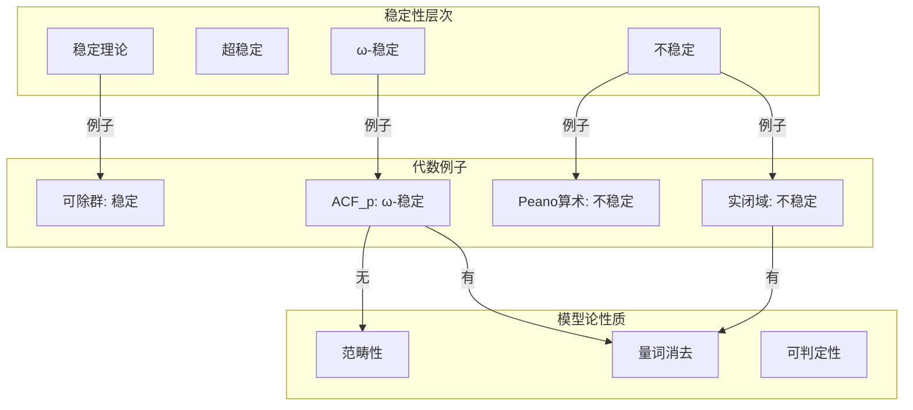

# 数论、代数与逻辑关联网络

## 概述

本文档梳理数论、代数结构和数理逻辑之间的深层关联，展示从算术到代数的推广路径，以及模型论视角下的代数结构研究。

---

## 一、算术 → 代数的推广路径

### 1.1 推广路径总图

```mermaid
graph TB
    subgraph Arithmetic[算术层]
        N[自然数 ℕ]
        Z[整数 ℤ]
        Q[有理数 ℚ]
        PRIME[素数]
        DIV[整除性]
        CONG[同余方程]
    end

    subgraph AlgStruct[代数结构层]
        RING[一般环 R]
        PID[主理想整环]
        UFD[唯一分解环]
        DED[Dedekind整环]
        FIELD[域 F]
        MOD[模 M]
    end

    subgraph AlgNum[代数数论层]
        OK[整数环 O_K]
        IDEAL[理想]
        PIDEAL[素理想]
        CLASS[类群 Cl(K)]
        UNIT[单位群 O_Kˣ]
        GAL[Galois群]
    end

    %% 推广路径
    N -->|半环| RING
    Z -->|欧几里得整环| PID
    Q -->|分式域| FIELD
    PRIME -->|素元| UFD
    DIV -->|理想包含| IDEAL
    CONG -->|商环| FIELD
    
    %% 代数结构到代数数论
    PID -->|数域整数环| OK
    DED -->|数域整数环| OK
    FIELD -->|有限扩张| AlgNum
    
    %% 数论内部
    OK -->|非零理想| IDEAL
    IDEAL -->|素性| PIDEAL
    IDEAL -->|等价类| CLASS
    OK -->|可逆元| UNIT
    FIELD -->|自同构| GAL

```

### 1.2 从具体到抽象的对应表

| 算术概念 | 代数推广 | 推广说明 | 例子 |
|---------|---------|---------|-----|
| 整数 ℤ | 环 R | 一般化数系 | ℤ[i], ℤ[√-5] |
| 素数 p | 素元/素理想 | 不可约性推广 | (p) ⊂ ℤ, 𝔭 ⊂ O_K |
| gcd(a,b) | 主理想 (a,b) | 理想生成元 | gcd(6,9)=3 ↔ (6,9)=(3) |
| 整除 a\|b | 理想包含 (a) ⊇ (b) | 序关系推广 | 2\|6 ↔ (2) ⊇ (6) |
| 同余 a ≡ b (mod n) | 商环 R/I | 等价类构造 | ℤ/nℤ ≅ ℤ/(n) |
| 唯一分解 | UFD | 分解唯一性 | ℤ[x] 是UFD |
| 算术基本定理 | Dedekind整环分解 | 理想分解唯一 | 在 O_K 中唯一分解为素理想 |

---

## 二、整数环的代数化

### 2.1 整数环的推广链

```

ℤ ──→ 欧几里得整环 ──→ 主理想整环 ──→ 唯一分解环 ──→ 整闭整环 ──→ 整环
  │
  └──→ 诺特环
  │
  └──→ 戴德金整环 (代数整数环 O_K)

```

### 2.2 代数整数环 O_K 的结构

```

定义: 数域 K/ℚ 的整数环
      O_K = {α ∈ K | α 在 ℤ 上整}

等价描述:
- α 满足首一整系数多项式
- α 的极小多项式 ∈ ℤ[x]

例子:
- K = ℚ: O_ℚ = ℤ
- K = ℚ(i): O_K = ℤ[i]
- K = ℚ(√-5): O_K = ℤ[√-5] （非UFD）
- K = ℚ(√5): O_K = ℤ[(1+√5)/2] （含非显然整数）

```

### 2.3 理想类群

```mermaid
graph TB
    subgraph Ideals[理想理论]
        P[主理想]
        PR[素理想]
        FR[分式理想]
        INV[可逆理想]
    end

    subgraph ClassGroup[类群结构]
        CL0[单位元 1 = [(1)]]
        CL[理想类 [I]]
        MUL[乘法 [I][J] = [IJ]]
        FIN[有限群 Cl(K)]
    end

    subgraph Picard[Picard群]
        LINE[线丛]
        PIC[Pic(O_K)]
    end

    P -->|主理想类| CL0
    FR -->|可逆| INV
    INV -->|等价类| CL
    CL -->|群结构| FIN
    
    INV -.->|几何解释| LINE
    FIN -.->|同构| PIC

```

---

## 三、素数 → 素理想的深化

### 3.1 素理想分解理论

```

定理 (Dedekind): 设 K 是数域，p 是有理素数

(p) 在 O_K 中的分解:
(p) = 𝔭₁^{e₁} · 𝔭₂^{e₂} ··· 𝔭_g^{e_g}

其中:
- 𝔭ᵢ 是 O_K 的不同素理想
- eᵢ 是分歧指数
- fᵢ = [O_K/𝔭ᵢ : 𝔽_p] 是剩余次数
- Σ eᵢfᵢ = [K:ℚ]

```

### 3.2 分解类型分类

| 分解类型 | 条件 | 例子 |
|---------|-----|-----|
| **完全分裂** | g = [K:ℚ], eᵢ=fᵢ=1 | p ≡ 1 (mod 4) 在 ℚ(i) 中 |
| **惰性** | g=1, e=1, f=[K:ℚ] | p ≡ 3 (mod 4) 在 ℚ(i) 中 |
| **分歧** | 某个 eᵢ > 1 | p=2 在 ℚ(i) 中: (2) = (1+i)² |

### 3.3 分圆域中的分解

```

K = ℚ(ζₙ), ζₙ = e^{2πi/n}

定理: 有理素数 p 在 K 中的分解行为:

- p ∤ n: 惯性次数 f = ordₙ(p) （p mod n 的阶）
- p | n: 分歧

特别地，当 n = l 是奇素数:
Gal(K/ℚ) ≅ (ℤ/lℤ)ˣ ≅ ℤ/(l-1)ℤ

```

---

## 四、同余方程 → 有限域上的方程

### 4.1 同余与有限域的联系

```

同余方程: f(x) ≡ 0 (mod p)

↕ 等价于

有限域上的方程: f(x̄) = 0 ∈ 𝔽_p[x]

其中 x̄ = x mod p ∈ 𝔽_p

```

### 4.2 从局部到整体

```mermaid
graph TB
    subgraph Global[整体域]
        Q[ℚ]
        K[数域 K]
        POLY[多项式 f ∈ K[x]]
    end

    subgraph Local[局部域]
        QP[ℚ_p]
        KP[K_𝔭]
        FP[有限域 𝔽_q]
    end

    subgraph Congruence[同余]
        MODP[mod p]
        MODPK[mod p^k]
    end

    Q -->|完备化| QP
    K -->|完备化| KP
    QP -->|剩余域| FP
    
    POLY -->|约化| MODP
    MODP -->|Hensel提升| MODPK
    MODPK -->|极限| KP

```

### 4.3 Hasse原理

```

Hasse-Minkowski定理:

二次型 Q 在 ℚ 上有非平凡零点
⇔ Q 在 ℝ 上有非平凡零点
⇔ Q 在所有 ℚ_p 上有非平凡零点

即: 局部可解 ⇒ 整体可解 （对二次型成立）

反例 (Selberg): 三次型可能局部处处可解但整体不可解

```

---

## 五、代数结构 → 一阶理论

### 5.1 代数结构的形式化

| 代数结构 | 语言 ℒ | 公理 | 理论 T |
|---------|-------|-----|-------|
| 群 | {·, e, ⁻¹} | 群公理 | T_Grp |
| 阿贝尔群 | {+, 0} | 交换群公理 | T_Ab |
| 环 | {+, ·, 0, 1} | 环公理 | T_Ring |
| 域 | {+, ·, 0, 1} | 域公理 | T_Field |
| 有序域 | {+, ·, 0, 1, <} | 有序域公理 | T_OF |
| 代数闭域 | {+, ·, 0, 1} | ACF | T_ACF |

### 5.2 代数结构的模型论分类



### 5.3 ACF的模型论性质

```

代数闭域的理论 ACF:

1. 量词消去 (QE): 每个公式等价于无量词公式
   
2. 完全性: ACF_p 是完全的 （对固定特征p）
   
3. ω-稳定性: Sₙ(∅) 可数
   
4. 模型完全性: 子结构是初等子结构
   
5. 可判定性: 存在算法判定句子是否成立

应用:
- Ax-Grothendieck定理: 单射多项式映射是满射
- 可定义集合的Zariski拓扑性质

```

---

## 六、模型论方法在代数中的应用

### 6.1 应用概览

| 代数问题 | 模型论工具 | 结果 |
|---------|-----------|-----|
| 代数闭域的初等等价 | 量词消去 | ACF_p ≡ ACF_q ⇔ p=q |
| Hilbert零点定理 | 模型论紧致性 | 代数闭域中的零点存在性 |
| 群的字问题 | 不可判定性 | 某些群的字问题不可解 |
| Diophantine方程 | 可判定性理论 | Matiyasevich定理 |
| 椭圆曲线秩 | 稳定性理论 | 与Bashmakov-Serre开问题联系 |

### 6.2 Ax-Kochen定理

```

定理 (Ax-Kochen, 1965):

对于每个 d ≥ 1，存在素数有限集 P_d，使得
对任何 p ∉ P_d:

ℚ_p 是 C₂(d) 域

即: 任何 d 次齐次多项式 f ∈ ℚ_p[x₁,...,xₙ] 
    当 n > d² 时在 ℚ_p 中有非平凡零点

推论: 对几乎所有素数 p，ℚ_p 和 𝔽_p((t)) 初等等价

```

### 6.3 代数几何中的模型论

```

1. 可定义集合与Zariski构造
   - 可定义集合 ↔ 构造子集
   - 量词消去 ↔ Chevalley定理

2.  motivic积分
   - 将p进积分统一处理
   - 不依赖于具体素数p

3. 差分代数几何
   - 带Frobenius作用的概形
   - 模型论方法证明Weil猜想相关结果

```

---

## 七、Galois理论与模型论

### 7.1 绝对Galois群

```

域 F 的绝对Galois群:
G_F = Gal(F^sep / F)

模型论问题:
- 哪些 profinite 群可实现为 G_F？
- G_F 在多大程度上决定 F？

结果:
- Neukirch-Uchida: 对数域，G_F 决定 F
- Pop: 对有限生成域，类似结果

```

### 7.2 域的初等理论与Galois群

```mermaid
graph TB
    subgraph FieldTheory[域论]
        F[域 F]
        GF[Galois群 G_F]
        EXT[扩张塔]
    end

    subgraph ModelTheory[模型论]
        THEORY[Th(F)]
        TYPE[型空间 S_n]
        DEF[可定义集]
    end

    subgraph Connection[联系]
        COH[上同调理论]
        DEC[可判定性问题]
    end

    F -->|绝对Galois群| GF
    F -->|理论| THEORY
    GF -.->|表示| TYPE
    THEORY -.->|可定义性| COH

```

---

## 八、算术几何的统一视角

### 8.1 算术几何三元组

```

           数论                    代数几何                模型论
            │                       │                     │
    ┌───────┴───────┐       ┌───────┴───────┐      ┌──────┴──────┐
    │               │       │               │      │             │
  整数环          素数    概形 X/ℤ      点x∈X   理论Th(ℤ)    型p
    │               │       │               │      │             │
    └───────┬───────┘       └───────┬───────┘      └──────┬──────┘
            │                       │                     │
            └───────────────────────┼─────────────────────┘
                                    │
                              算术几何

```

### 8.2 关键对应关系

| 算术概念 | 几何对应 | 模型论对应 |
|---------|---------|-----------|
| 素数 p | Spec(𝔽_p) → Spec(ℤ) | 型 |
| 赋值 v_p | 纤维 X_p | 完备化 |
| 整数解 | 有理点 X(ℚ) | 可定义性 |
| L-函数 | Euler积 | 一致性 |
| 类数 | Picard群 | 稳定化子 |

---

## 九、统计信息

- **数论→代数推广路径**: 10+
- **代数结构理论**: 8+
- **模型论应用**: 12+
- **桥梁定理**: 6
- **具体例子**: 25+

---

*文档版本: 2026年4月 | 数论代数逻辑关联网络*
