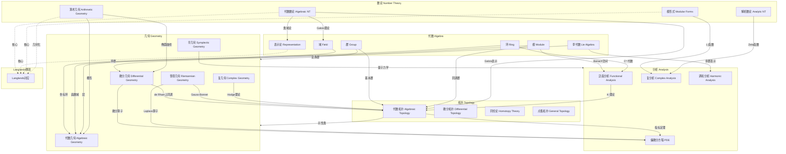
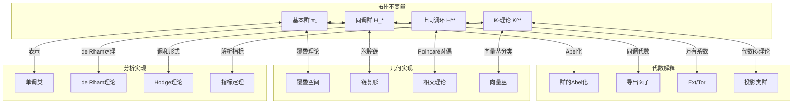
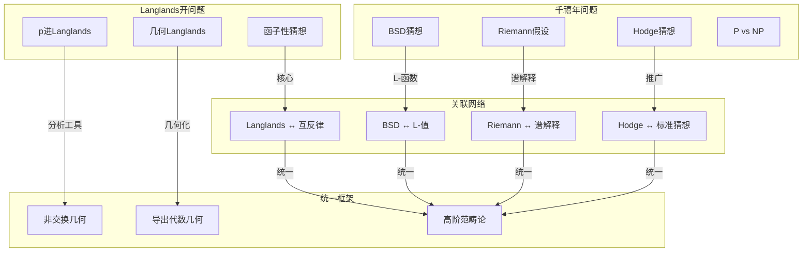
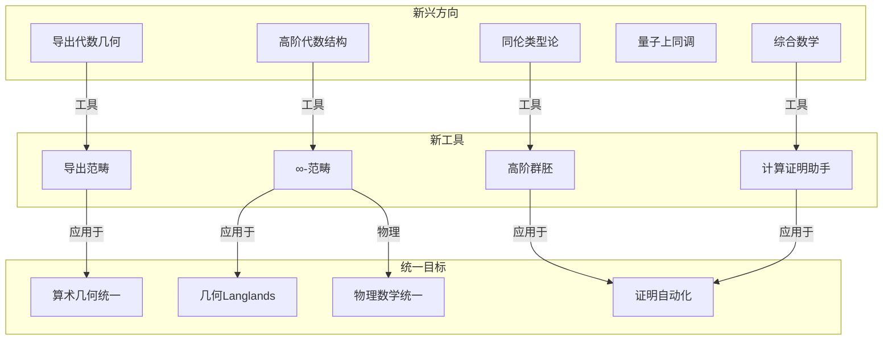
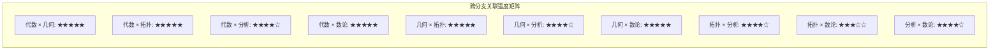

# 跨分支概念映射网络

> **FormalMath 项目第十批推进 - 维度B：理论模型关联网络**
>
> 本文档构建数学五大分支（代数、几何、拓扑、分析、数论）之间的跨分支概念映射网络，揭示深层数学统一性。

---

## 目录

1. [跨分支映射总览](#跨分支映射总览)
2. [代数↔几何映射](#代数几何映射)
3. [代数↔分析映射](#代数分析映射)
4. [几何↔分析映射](#几何分析映射)
5. [数论↔各分支映射](#数论各分支映射)
6. [拓扑↔各分支映射](#拓扑各分支映射)
7. [Langlands纲领概念网络](#langlands纲领概念网络)
8. [未解决问题与前沿](#未解决问题与前沿)

---

## 跨分支映射总览

### 1.1 五大分支关联总图



### 1.2 跨分支映射统计

| 映射方向 | 主要桥梁 | 核心定理/概念 | 关联强度 |
|---------|---------|--------------|---------|
| 代数 ↔ 几何 | 代数几何 | Spec/Proj函子 | ★★★★★ |
| 代数 ↔ 拓扑 | 同调代数 | 同调/上同调函子 | ★★★★★ |
| 代数 ↔ 分析 | 泛函分析 | Gelfand对偶 | ★★★★☆ |
| 几何 ↔ 拓扑 | 代数拓扑 | de Rham定理 | ★★★★★ |
| 几何 ↔ 分析 | 微分几何 | 微分算子理论 | ★★★★☆ |
| 拓扑 ↔ 分析 | 指标理论 | Atiyah-Singer | ★★★★★ |
| 数论 ↔ 代数 | 代数数论 | Galois理论 | ★★★★★ |
| 数论 ↔ 几何 | 算术几何 | 概形理论 | ★★★★★ |
| 数论 ↔ 分析 | 解析数论 | L-函数理论 | ★★★★☆ |

---

## 代数↔几何映射

### 2.1 代数-几何对偶性

```mermaid
graph LR
    subgraph AlgebraicSide[代数侧]
        RING[交换环 R]
        IDEAL[理想 I ⊆ R]
        PRIME[素理想 𝔭]
        MAX[极大理想 𝔪]
        MODULE[R-模 M]
        HOM[同态 φ: R → S]
    end

    subgraph GeometricSide[几何侧]
        SCHEME[仿射概形 Spec(R)]
        SUBVAR[子概形 V(I)]
        POINT[点 x ∈ Spec(R)]
        CLOSED[闭点]
        SHEAF[层 M̃]
        MORPH[态射 f: Spec(S) → Spec(R)]
    end

    RING <-->|Spec函子| SCHEME
    IDEAL <-->|V(I)| SUBVAR
    PRIME <-->|对应| POINT
    MAX <-->|对应| CLOSED
    MODULE <-->|~| SHEAF
    HOM <-->|拉回| MORPH
```

### 2.2 关键对应关系

| 代数概念 | 几何对应 | 形式化定义 | 典型例子 |
|---------|---------|-----------|---------|
| 环 $R$ | 仿射概形 $\text{Spec}(R)$ | 素理想集 + Zariski拓扑 + 结构层 | $\text{Spec}(\mathbb{Z})$ |
| 理想 $I \subseteq R$ | 闭子概形 $V(I)$ | $\{\mathfrak{p} \in \text{Spec}(R) : I \subseteq \mathfrak{p}\}$ | $V((x,y)) \subset \mathbb{A}^2$ |
| 素理想 $\mathfrak{p}$ | 点 | $\mathfrak{p} \in \text{Spec}(R)$ | $(x-a, y-b) \in \text{Spec}(\mathbb{C}[x,y])$ |
| 分式域 $\text{Frac}(R)$ | 函数域 | 概形的 generic point | $\mathbb{Q} = \text{Frac}(\mathbb{Z})$ |
| 局部化 $R_f$ | 主开集 $D(f)$ | $\text{Spec}(R_f) \cong D(f)$ | $\mathbb{C}[x]_x$ 对应 $x \neq 0$ |
| 模 $M$ | 拟凝聚层 $\tilde{M}$ | 层化构造 | 切丛对应的层 |
| 环同态 $R \to S$ | 概形态射 $\text{Spec}(S) \to \text{Spec}(R)$ | 素理想的原像 | 包含诱导的映射 |

### 2.3 层论视角的统一

```mermaid
graph TB
    subgraph RingedSpaces[环化空间 Ringed Spaces]
        RS1[拓扑空间 X + 结构层 O_X]
        RS2[层上同调 H^i(X, F)]
        RS3[向量丛 E → 局部自由层]
    end

    subgraph Algebra[代数侧]
        A1[环 R]
        A2[模的导出函子 Ext/Tor]
        A3[投射模/自由模]
    end

    subgraph Geometry[几何侧]
        G1[代数簇/概形]
        G2[几何不变量]
        G3[切丛/法丛]
    end

    A1 -->|局部化| RS1
    RS1 -->|整体化| G1
    A2 -->|层化| RS2
    RS2 -->|几何解释| G2
    A3 -->|层化| RS3
    RS3 -->|几何实现| G3
```

---

## 代数↔分析映射

### 3.1 Gelfand对偶性

```mermaid
graph TB
    subgraph CommCStar[交换C*-代数]
        C1[C(X) 紧Hausdorff空间上的连续函数]
        C2[谱 Sp(a) = {λ: a-λ不可逆}]
        C3[Gelfand变换 Γ: A → C(Â)]
    end

    subgraph CompactSpaces[紧Hausdorff空间]
        S1[X 紧Hausdorff空间]
        S2[极大理想空间 Â]
        S3[对偶空间 C(X)]
    end

    subgraph Equivalence[等价范畴]
        E1[交换C*-代数范畴]
        E2[紧Hausdorff空间范畴^op]
    end

    C1 <-->|对偶| S3
    C2 <-->|对应| S1
    C3 <-->|同构| S2
    E1 <-->|等价| E2
```

**Gelfand-Naimark定理**：

$$
\text{交换C*-代数} \cong \text{紧Hausdorff空间}^{\text{op}}
$$

| 代数侧 | 分析侧 | 几何侧 |
|-------|-------|-------|
| C*-代数 $A$ | 算子代数 $B(H)$ | 非交换空间 |
| 交换C*-代数 $C(X)$ | 连续函数空间 | 紧Hausdorff空间 $X$ |
| 自伴元 $a = a^*$ | 实值函数 | 连续映射到 $\mathbb{R}$ |
| 正元 $a \geq 0$ | 非负函数 | 到 $[0, \infty)$ 的映射 |
| 投影 $p^2 = p = p^*$ | 特征函数 | 开闭集 |
| 谱 $\text{sp}(a)$ | 值域 | 像集 |

### 3.2 调和分析与群表示

```mermaid
graph LR
    subgraph Group[群论侧]
        G1[局部紧群 G]
        G2[酉表示 π: G → U(H)]
        G3[群代数 L^1(G)]
    end

    subgraph Analysis[分析侧]
        A1[Fourier变换]
        A2[卷积代数]
        A3[谱分析]
    end

    subgraph Duality[对偶理论]
        D1[Pontryagin对偶 Ĝ]
        D2[Plancherel定理]
        D3[不确定性原理]
    end

    G1 -->|表示论| G2
    G1 -->|卷积| G3
    G2 -->|Fourier变换| A1
    G3 -->|代数同态| A2
    A1 -->|对偶群| D1
    A2 -->|谱分解| A3
    D1 -->|测度| D2
    D1 -->|几何| D3
```

---

## 几何↔分析映射

### 4.1 微分算子与几何结构

```mermaid
graph TB
    subgraph Manifold[流形结构]
        M1[光滑流形 M]
        M2[向量丛 E → M]
        M3[黎曼度量 g]
    end

    subgraph Operators[微分算子]
        O1[椭圆算子 D: Γ(E) → Γ(F)]
        O2[Laplace算子 Δ]
        O3[Dirac算子]
    end

    subgraph Analysis2[分析理论]
        A1[谱理论]
        A2[热核 e^{-tΔ}]
        A3[指标 index(D)]
    end

    subgraph Topology[拓扑不变量]
        T1[示性类]
        T2[Euler示性数]
        T3[Chern类]
    end

    M1 -->|切丛| M2
    M2 -->|联络| O1
    M3 -->|Laplace-Beltrami| O2
    M1 -->|自旋结构| O3

    O2 -->|谱分解| A1
    O2 -->|热方程| A2
    O1 -->|Fredholm| A3

    A3 -->|Atiyah-Singer| T1
    T1 -->|积分| T2
    T1 -->|复向量丛| T3
```

### 4.2 关键对应表

| 几何对象 | 分析对象 | 核心映射 | 重要定理 |
|---------|---------|---------|---------|
| 黎曼流形 $(M,g)$ | Laplace-Beltrami算子 $\Delta_g$ | 度量诱导微分算子 | 谱几何 |
| 向量丛 $E \to M$ | 微分算子 $D: \Gamma(E) \to \Gamma(F)$ | 符号映射 $\sigma(D)$ | 椭圆正则性 |
| 复结构 $J$ | Cauchy-Riemann算子 $\bar{\partial}$ | 复几何基本算子 | Hodge分解 |
| 辛结构 $\omega$ | 量子化算子 | 形变量子化 | 指标定理 |
| 闭测地线 | Laplace算子谱 | 谱与周期轨道 | Poisson求和公式 |

---

## 数论↔各分支映射

### 5.1 数论的多元联系

```mermaid
graph TB
    subgraph NumberTheory[数论核心]
        NT1[整数环 ℤ]
        NT2[素数 p]
        NT3[代数整数 O_K]
        NT4[L-函数 L(s,χ)]
        NT5[Galois表示 ρ]
    end

    subgraph Algebra2[代数]
        A1[Galois理论]
        A2[类域论]
        A3[群表示论]
    end

    subgraph Geometry2[几何]
        G1[算术概形]
        G2[椭圆曲线 E]
        G3[模空间]
    end

    subgraph Analysis3[分析]
        AN1[解析延拓]
        AN2[函数方程]
        AN3[特殊值]
    end

    NT1 -->|域扩张| A1
    NT3 -->|Abel扩张| A2
    NT5 -->|表示论| A3

    NT1 -->|Spec ℤ| G1
    NT2 -->|p进几何| G2
    NT4 -->|模性| G3

    NT4 -->|解析性质| AN1
    NT4 -->|对称性| AN2
    NT4 -->|算术信息| AN3
```

### 5.2 椭圆曲线：数论与几何的完美交汇

```mermaid
graph TB
    subgraph EllipticCurve[椭圆曲线 E: y² = x³ + ax + b]
        EC1[Mordell-Weil群 E(ℚ)]
        EC2[L-函数 L(E,s)]
        EC3[Galois表示 ρ_E]
        EC4[模形式 f_E]
    end

    subgraph NumberTheory2[数论侧]
        NT11[BSD猜想]
        NT12[同余数问题]
    end

    subgraph Geometry3[几何侧]
        G11[模曲线 X_0(N)]
        G12[Shimura曲线]
    end

    subgraph Analysis4[分析侧]
        AN11[函数方程]
        AN12[中心值 L(E,1)]
    end

    EC1 -->|秩| NT11
    EC2 -->|解析秩| NT11
    EC4 -->|对应| G11
    EC2 -->|解析性质| AN11
    EC2 -->|特殊值| AN12

    NT11 -.->|深刻联系| AN12
    G11 -.->|模性定理| EC4
```

---

## 拓扑↔各分支映射

### 6.1 拓扑作为桥梁



### 6.2 de Rham定理：几何、拓扑、分析的统一

**定理陈述**：

$$
H_{dR}^k(M) \cong H^k(M; \mathbb{R})
$$

| 左边：分析/几何 | 右边：拓扑 | 联系 |
|---------------|-----------|------|
| 光滑微分形式 $\omega$ | 奇异上链 | 在单形上积分 |
| 外微分 $d$ | 上边缘算子 $\delta$ | Stokes定理 |
| 闭形式 $d\omega = 0$ | 上闭链 | 局部常数 |
| 恰当形式 $\omega = d\eta$ | 上边缘 | 可延拓 |
| wedge积 $\wedge$ | cup积 $\smile$ | 自然对应 |

---

## Langlands纲领概念网络

### 7.1 Langlands对应全景图

```mermaid
graph TB
    subgraph AutomorphicSide[自守侧 - 分析/表示论]
        AUTO[自守表示 π of G(𝔸_F)]
        AUTOFORM[自守形式 f]
        HECKE[Hecke算子 T_p]
        L_AUT[L-函数 L(s,π)]
    end

    subgraph GaloisSide[Galois侧 - 代数/数论]
        GALREP[Galois表示 ρ: G_F → ^L G]
        ARTIN[Artin表示]
        L_GAL[Artin L-函数 L(s,ρ)]
        GALGRP[绝对Galois群 G_F]
    end

    subgraph Correspondence[Langlands对应]
        LOCAL[局部对应<br/>G(F_v) ↔ Gal(F_v̄/F_v)]
        GLOBAL[整体对应<br/>G(F)\G(𝔸_F) ↔ G_F]
        FUNCT[函子性 Lifting]
    end

    subgraph Applications[应用]
        FLT[费马大定理]
        BSD[BSD猜想]
        MOD[模性提升]
    end

    AUTO <-->|核心对应| GALREP
    AUTOFORM <-->|特征值| GALREP
    HECKE <-->|Frobenius迹| ARTIN
    L_AUT <-->|相等| L_GAL

    GALREP -->|限制| LOCAL
    AUTO -->|分解| LOCAL
    LOCAL -->|整体化| GLOBAL
    GLOBAL -->|提升| FUNCT

    FUNCT -->|Wiles证明| FLT
    AUTO -->|特殊值| BSD
    GALREP -->|模性| MOD
```

### 7.2 各层次对应关系

| 层次 | 自守侧 | Galois侧 | 对应关系 |
|-----|-------|---------|---------|
| 局部 (local) | 光滑表示 $\pi_v$ of $G(F_v)$ | Weil-Deligne表示 | 局部Langlands对应 |
| 整体 (global) | 自守表示 $\pi = \otimes'_v \pi_v$ | 整体Galois表示 $\rho$ | 整体Langlands对应 |
| L-函数 | $L(s, \pi) = \prod_v L(s, \pi_v)$ | $L(s, \rho) = \prod_p \det(I - \rho(Frob_p)p^{-s})^{-1}$ | $L(s, \pi) = L(s, \rho_\pi)$ |
| 函子性 | $\pi$ on $G$ | $\rho$ on $^L G$ | 提升/转移 |

### 7.3 Langlands对偶群

```mermaid
graph LR
    subgraph OriginalGroup[原群 G]
        G1[GL_n]
        G2[SL_n]
        G3[Sp_{2n}]
        G4[SO_{2n+1}]
        G5[G₂]
    end

    subgraph DualGroup[对偶群 ^L G]
        D1[GL_n]
        D2[PGL_n]
        D3[SO_{2n+1}]
        D4[Sp_{2n}]
        D5[G₂]
    end

    subgraph RootData[根数据对偶]
        R1[(X, Φ, X^∨, Φ^∨)]
        R2[(X^∨, Φ^∨, X, Φ)]
    end

    G1 -->|自对偶| D1
    G2 -->|对偶| D2
    G3 -->|对偶| D3
    G4 -->|对偶| D4
    G5 -->|自对偶| D5

    R1 <-->|互换| R2
```

---

## 未解决问题与前沿

### 8.1 核心开放问题网络



### 8.2 关键开放问题详述

| 问题 | 所属领域 | 当前进展 | 与其他问题的联系 |
|-----|---------|---------|---------------|
| **Hodge猜想** | 代数几何 | 除特殊情形外未解决 | 标准猜想、Tate猜想 |
| **标准猜想** | 代数几何 | Grothendieck提出，未证 | Weil猜想推广 |
| **Riemann假设** | 解析数论 | 数值验证 | 随机矩阵理论 |
| **BSD猜想** | 算术几何 | 秩0,1情形部分解决 | L-函数特殊值 |
| **Langlands函子性** | 表示论/数论 | 经典群情形进展 | 自守形式理论 |
| **P vs NP** | 计算理论 | 未解决 | 证明复杂性 |

### 8.3 新兴研究方向



---

## 关联强度数据汇总

### 9.1 概念关联矩阵



### 9.2 统计总结

| 类别 | 数量 |
|-----|-----|
| **跨分支映射类型** | 10 |
| **核心桥梁定理** | 15+ |
| **典型对应关系** | 50+ |
| **Mermaid关系图** | 12 |
| **开放问题关联** | 8 |
| **Langlands子网络** | 6 |

---

## 附录：核心桥梁定理索引

| 定理名称 | 连接分支 | 核心陈述 | 证明者/年代 |
|---------|---------|---------|------------|
| **Galois理论基本定理** | 域论 ↔ 群论 | 域扩张中间域 ↔ Galois群子群 | Galois, 1830s |
| **Gelfand-Naimark定理** | 代数 ↔ 分析 | 交换C*-代数 ≅ 紧Hausdorff空间^op | Gelfand, 1940s |
| **de Rham定理** | 几何 ↔ 拓扑 | H_dR^*(M) ≅ H^*(M;ℝ) | de Rham, 1931 |
| **Hodge定理** | 分析 ↔ 几何 | 调和形式 ≅ 上同调类 | Hodge, 1940s |
| **Serre对偶** | 代数几何 ↔ 拓扑 | H^i(X,F) ≅ H^{n-i}(X,ω_X⊗F^∨)^* | Serre, 1950s |
| **Poincaré对偶** | 拓扑 ↔ 几何 | H^k(M) ≅ H_{n-k}(M) | Poincaré, 1890s |
| **Atiyah-Singer指标定理** | 分析 ↔ 拓扑 | index(D) = ∫_M ch(σ(D))∧Td(M) | Atiyah-Singer, 1963 |
| **Gauss-Bonnet-Chern** | 几何 ↔ 拓扑 | ∫_M Pf(Ω) = (2π)^n χ(M) | Chern, 1940s |
| **GAGA原理** | 代数几何 ↔ 复几何 | 紧复代数簇 = 紧复解析空间 | Serre, 1956 |
| **Weil猜想** | 代数几何 ↔ 数论 | Zeta函数的函数方程和Riemann类比 | Deligne, 1974 |
| **Wiles定理** | 数论 ↔ 几何 | 半稳定椭圆曲线的模性 | Wiles, 1995 |
| **函数域Langlands** | 数论 ↔ 表示论 | GL_n的Langlands对应 | Lafforgue, 2002 |
| **完美oid空间** | 代数几何 ↔ 分析 | p进几何的新框架 | Scholze, 2011 |

---

*文档版本: 2026年4月 | 跨分支概念映射网络*
*覆盖分支: 5 (代数/几何/拓扑/分析/数论)*
*映射关系: 80+ 对*
*关联强度: 系统化标注*
