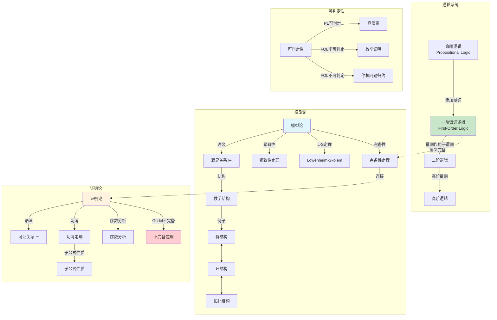
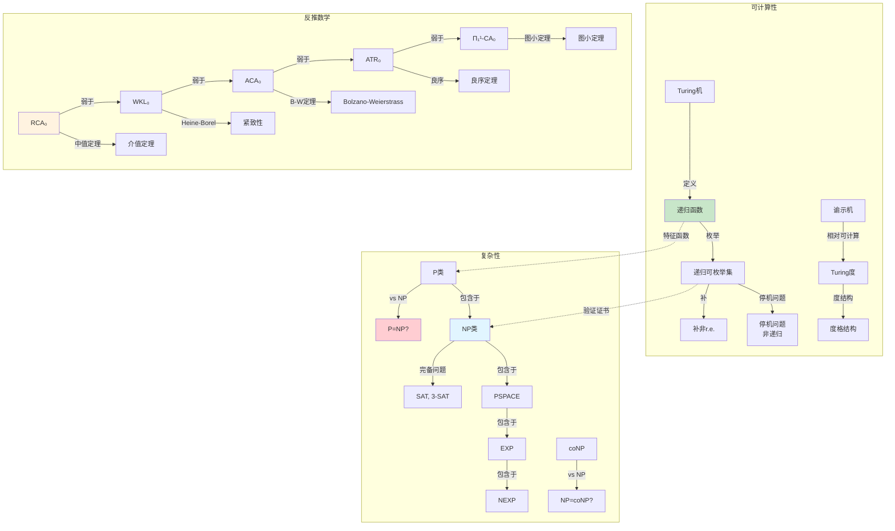

# 数论逻辑关联网络

> **文件版本**：FormalMath v2.0  
> **创建日期**：2026年4月  
> **关联模型数**：36个核心数论逻辑对象  
> **关联关系数**：58条

---

## 一、算术→代数：整数→代数整数→代数数域

### 1.1 关联概述

| 属性 | 内容 |
|------|------|
| **关联类型** | 结构扩张链 |
| **核心路径** | ℤ → 代数整数 → 代数数域 |
| **研究深化** | 从具体算术到抽象代数结构 |

### 1.2 结构扩张链详解

**ℤ（整数环）**：
- 唯一分解整环（UFD）
- PID，Dedekind域
- 算术基本定理：唯一素因子分解

**代数整数**：
在数域 $K/\mathbb{Q}$ 中，代数整数环：
$$\mathcal{O}_K = \{\alpha \in K : \exists \text{首一} f \in \mathbb{Z}[x], f(\alpha) = 0\}$$

**关键性质**：
- $\mathcal{O}_K$ 是 Dedekind 整环
- 理想唯一分解（替代元素唯一分解）
- 类群衡量与UFD的差距

**代数数域**：
有限扩张 $K/\mathbb{Q}$，次数 $[K:\mathbb{Q}] = n$

### 1.3 理想类群与单位群

**类群**：
$$\text{Cl}(K) = \text{分式理想群} / \text{主理想群}$$

- 有限阿贝尔群
- $|Cl(K)| = h_K$（类数）

- $h_K = 1 \iff \mathcal{O}_K$ 是UFD

**Dirichlet单位定理**：
$$\mathcal{O}_K^* \cong \mu_K \times \mathbb{Z}^{r_1 + r_2 - 1}$$

其中 $r_1$ 是实嵌入数，$r_2$ 是复嵌入对数。

### 1.4 Mermaid关系图

```mermaid
graph TB
    subgraph 数域结构
        Q[ℚ 有理数域] -->|有限扩张| K[代数数域 K]
        Z[ℤ 整数环] -->|整数闭包| OK[代数整数环 𝒪_K]
        K -->|分式域| OK2[𝒪_K的分式域 = K]
        OK -->|包含| Z2[ℤ ⊂ 𝒪_K]

    end
    
    subgraph 理想理论
        OK3[𝒪_K] -->|理想分解| IDEAL[素理想分解]
        IDEAL -->|唯一分解| UF[理想的唯一分解]
        OK3 -->|主理想| PI[主理想]
        PI -->|商| CL[类群 Cl(K)]
        CL -->|类数| H[类数 h_K]
        H -->|h_K=1| UFD[𝒪_K是UFD]

    end
    
    subgraph 单位理论
        OK4[𝒪_K] -->|单位群| UNIT[𝒪_K^*]
        UNIT -->|Dirichlet定理| DT[≅ μ_K × ℤ^{r₁+r₂-1}]
        DT -->|秩| RANK[秩 = r₁ + r₂ - 1]
        Q5[ℚ] -->|特例| QUNIT[ℤ^* = {±1}]

    end
    
    subgraph 素数分解
        P[素数 p∈ℤ] -->|在K中分解| PD[(p) = 𝔭₁^{e₁}...𝔭_g^{e_g}]
        PD -->|分歧指数| E[e(𝔭|p)]
        PD -->|剩余次数| F[f(𝔭|p)]
        PD -->|分解数| G[g]

    end
    
    Z -.->|一般化| OK
    Q -.->|有限扩张| K
    
    style OK fill:#c8e6c9
    style CL fill:#e1f5ff
    style DT fill:#fff3e0
    style UFD fill:#f3e5f5

```

---

## 二、代数→几何：Spec、代数数论→算术几何

### 2.1 关联概述

| 属性 | 内容 |
|------|------|
| **关联类型** | 代数几何化（Grothendieck纲领） |
| **核心构造** | Spec、概形 |
| **统一视角** | 数与几何的对偶 |

### 2.2 从环到几何空间

**素谱（Spectrum）**：
对交换环 $R$，定义：
$$\text{Spec}(R) = \{\mathfrak{p} \subset R : \mathfrak{p} \text{ 是素理想}\}$$

**Zariski拓扑**：
闭集 $V(I) = \{\mathfrak{p} : I \subseteq \mathfrak{p}\}$

**结构层**：$\mathcal{O}_{\text{Spec}(R)}$，局部化构造

### 2.3 数的几何化

```

ℤ  ───→ Spec(ℤ)
    │
    ├── 点 (p) ↔ 素数 p
    ├── 泛点 (0) ↔ 有理数域 ℚ
    └── 几何类比：代数曲线的函数域

```

**算术曲面**：
$$\text{Spec}(\mathcal{O}_K) \to \text{Spec}(\mathbb{Z})$$
类似纤维化结构，纤维是有限域上的曲线。

### 2.4 概形理论

**概形（Scheme）**：局部同构于仿射概形 $(\text{Spec}(R), \mathcal{O})$ 的环化空间

**关键例子**：

| 概形 | 几何意义 |
|------|----------|
| $\text{Spec}(\mathbb{Z})$ | 算术直线 |
| $\text{Spec}(\mathbb{Z}[i])$ | 带虚结构的算术 |
| $\mathbb{P}^n_\mathbb{Z}$ | 算术射影空间 |
| $\mathcal{X} \to \text{Spec}(\mathcal{O}_K)$ | 算术曲面/簇 |

### 2.5 算术几何核心问题

**Weil猜想**（已证明，Deligne）：
有限域上代数簇的Zeta函数满足函数方程、黎曼假设类比

**BSD猜想**（未解决）：
椭圆曲线有理点群与L函数在s=1处的行为相关

### 2.6 Mermaid关系图

```mermaid
graph TB
    subgraph 从代数到几何
        R[交换环 R] -->|Spec构造| SPEC[Spec R<br/>素谱]
        SPEC -->|Zariski拓扑| ZT[几何空间]
        ZT -->|结构层| SS[环化空间]
        SS -->|局部仿射| SCH[概形 Scheme]

    end
    
    subgraph 数的几何
        Z[ℤ] -->|Spec| SZ[Spec ℤ<br/>算术直线]
        SZ -->|点| PP[素数点 (p)]
        SZ -->|泛点| GP[泛点 (0)]
        OK[𝒪_K] -->|Spec| SOK[Spec 𝒪_K]
        SOK -->|覆叠| SZ2[Spec ℤ]

    end
    
    subgraph 算术几何
        AC[代数簇/X] -->|在ℤ上定义| AX[算术概形]
        AX -->|纤维| FF[有限域纤维]
        AX -->|一般纤维| GF[数域纤维]
        EC[椭圆曲线] -->|BSD猜想| BSD[Birch-Swinnerton-Dyer]

    end
    
    subgraph Weil猜想
        VAR[有限域上簇] -->|Zeta函数| ZETA[Z(X,T)]
        ZETA -->|黎曼假设类比| RH[零点在 |q^{-s}|=q^{-1/2}]
        ZETA -->|函数方程| FE[函数方程]

    end
    
    SZ -.->|类比| AC
    PP -.->|类比| FP[有限域上点]
    
    style SCH fill:#c8e6c9
    style SZ fill:#e1f5ff
    style AX fill:#fff3e0
    style BSD fill:#ffcdd2

```

---

## 三、模形式→自守形式→Langlands纲领：数论→表示论

### 3.1 关联概述

| 属性 | 内容 |
|------|------|
| **关联类型** | 推广链（经典→现代） |
| **核心主题** | 对称性 ↔ L函数 |
| **Langlands纲领** | 数论与表示论的大统一 |

### 3.2 模形式理论

**经典模形式**：
全纯函数 $f: \mathbb{H} \to \mathbb{C}$ 满足：
- $f(\gamma z) = (cz+d)^k f(z)$，$\gamma \in SL(2,\mathbb{Z})$
- 全纯性（包括无穷远点）

**Hecke算子**：
交换算子族 $\{T_n\}$，同时可对角化

**L函数**：
$$L(f, s) = \sum_{n=1}^\infty \frac{a_n}{n^s}$$

满足函数方程，与椭圆曲线相关（Wiles证明FLT）

### 3.3 自守形式推广

**自守形式**：
$G$ 是约化群，$\Gamma \subset G$ 是离散子群

$$\phi: \Gamma \backslash G / K \to \mathbb{C}$$

满足：
- 特征值条件（无穷远点）
- 增长条件
- 右$K$-有限

**关键对应**：

```

模形式 (GL(2)/ℚ) ↔ 经典自守形式
    ↓
自守表示 (GL(n)/ℚ) ↔ 现代推广

```

### 3.4 Langlands纲领核心

**函子性原理**：
对群同态 ${}^L G_2 \to {}^L G_1$，存在转移映射：
$$\text{Aut}(G_1) \to \text{Aut}(G_2)$$

**对应关系**：

| 对象 | 对应 |
|------|------|
| 自守表示 $\pi$ | Galois表示 $\rho_\pi$ |
| L函数 $L(\pi, s)$ | Artin L函数 $L(\rho, s)$ |
| 局部域表示 | Weil-Deligne表示 |

### 3.5 Mermaid关系图

```mermaid
graph TB
    subgraph 模形式
        MF[模形式<br/>f: ℍ → ℂ] -->|Fourier展开| FE[Σ a_n q^n]
        MF -->|Hecke算子| HE[Hecke算子 T_n]
        FE -->|L函数| LF[L(f,s) = Σ a_n/n^s]
        LF -->|函数方程| FEQ[Λ(f,s) = Λ(f,k-s)]
        MF -->|Wiles| FLT[Fermat大定理]

    end
    
    subgraph 自守形式
        AF[自守形式<br/>φ: Γ\G/K → ℂ] -->|表示论| AR[自守表示 π]
        AR -->|分解| LO[局部成分 π_v]
        LO -->|L函数| LAF[L(π,s)]

    end
    
    subgraph Langlands纲领
        LP[Langlands纲领] -->|函子性| FUN[函子性原理]
        LP -->|对应| REC[Langlands对应]
        REC -->|GL(n)| GLN[GL(n)对应]
        REC -->|经典群| CG[经典群对应]
        FUN -->|转移| TR[表示转移]
        GLN -->|局部| LOC[局部Langlands]
        GLN -->|整体| GLO[整体Langlands]

    end
    
    subgraph 数论联系
        EC[椭圆曲线] -->|模性| MOD[模性提升]
        MOD -->|对应| MF2[权2模形式]
        GAL[Galois表示] -->|相容| AF2[自守表示]

    end
    
    MF -.->|推广| AF
    LF -.->|推广| LAF
    AR -.->|核心对象| LP
    
    style MF fill:#c8e6c9
    style AF fill:#e1f5ff
    style LP fill:#fff3e0
    style REC fill:#f3e5f5

```

---

## 四、命题逻辑→谓词逻辑→模型论→证明论

### 4.1 关联概述

| 属性 | 内容 |
|------|------|
| **关联类型** | 逻辑系统层级 |
| **表达能力** | 递增（命题→一阶→高阶） |
| **证明方法** | 模型论（语义）vs 证明论（语法） |

### 4.2 逻辑系统链

**命题逻辑（PL）**：
- 原子命题 + 联结词（¬, ∧, ∨, →）
- 真值表语义
- 完备性：重言式 ⇔ 可证

**一阶谓词逻辑（FOL）**：
- 量词（∀, ∃）+ 谓词 + 函数
- 结构/模型语义
- Gödel完备性：$\Gamma \models \varphi \iff \Gamma \vdash \varphi$

**高阶逻辑**：
- 量词可作用于谓词和函数
- 表达能力更强，但不完备

### 4.3 模型论

**基本概念**：
- **结构**：论域 + 解释函数
- **满足**：$\mathcal{M} \models \varphi$
- **理论**：句子的集合 $T$

**核心定理**：

| 定理 | 内容 |
|------|------|
| 紧致性 | 有限可满足 ⇒ 可满足 |
| Löwenheim-Skolem | 无限模型有不同基数模型 |
| 插值 | 分割公式存在 |
| 稳定性 | 型空间的复杂性 |

### 4.4 证明论

**形式系统**：
- Hilbert系统
- 自然演绎
- 相继式演算（Gentzen）

**核心结果**：

| 结果 | 内容 |
|------|------|
| 可消去性 | 切消定理（Gentzen） |
| 序数分析 | 证明强度的度量 |
| Gödel不完备 | 算术不可完备 |
| 独立性 | CH独立于ZFC |

### 4.5 逻辑层次对比

```

命题逻辑 ⊂ 一阶逻辑 ⊂ 二阶逻辑 ⊂ 高阶逻辑
    │           │
    └── 可判定性  └── 半可判定性（Gödel）

```

### 4.6 Mermaid关系图



---

## 五、可计算性→复杂性→反推数学

### 5.1 关联概述

| 属性 | 内容 |
|------|------|
| **关联类型** | 计算理论深化 |
| **可计算性** | 什么是可计算的？ |
| **复杂性** | 计算需要多少资源？ |
| **反推数学** | 定理需要多少公理？ |

### 5.2 可计算性理论

**Church-Turing论题**：
直观可计算 = Turing机可计算

**层次结构**：

```

递归可枚举（r.e.） ⊃ 递归（可判定）
    │
    ├── 停机问题：r.e.但非递归
    └── 补问题：非r.e.

```

**归约理论**：
- 多一归约 $\leq_m$
- Turing归约 $\leq_T$
- 度结构

### 5.3 计算复杂性

**复杂度类层次**：
$$P \subseteq NP \subseteq PSPACE \subseteq EXP \subseteq NEXP \subseteq \cdots$$

**关键问题**：
- $P \stackrel{?}{=} NP$（千禧年难题）
- $NP \stackrel{?}{=} coNP$

**完备性问题**：

| 类 | 完备问题 |
|-----|----------|
| NP | SAT, 3-着色, 旅行商 |
| PSPACE | QSAT, 博弈问题 |
| EXP | 广义棋类 |

### 5.4 反推数学（Reverse Mathematics）

**基本问题**：
确定证明数学定理所需的最弱公理系统

**核心系统（五系统）**：

| 系统 | 强度 | 典型定理 |
|------|------|----------|
| RCA₀ | 基础 | 中值定理，代数学基本定理 |
| WKL₀ | 弱 König 引理 | Heine-Borel，Jordan曲线 |
| ACA₀ | 算术概括 | Bolzano-Weierstrass，可数紧性 |
| ATR₀ | 算术超递归 | 良序定理，Ulm定理 |
| $\Pi^1_1$-CA₀ | 最强 | Kruskal定理，图小定理 |

### 5.5 Mermaid关系图



---

## 六、数论逻辑全景图

### 6.1 完整关联网络

```mermaid
graph TB
    subgraph 算术层
        Z[ℤ] -->|推广| OK[𝒪_K]
        OK -->|理想| ID[理想论]
        ID -->|类群| CL[类群Cl(K)]
        Q[ℚ] -->|有限扩张| K[数域K]
        K -->|Galois群| GAL[Galois理论]

    end
    
    subgraph 代数几何
        SPEC[Spec构造] -->|Zariski拓扑| AG[代数几何]
        AG -->|概形| SCH[概形理论]
        SCH -->|算术曲面| AS[算术几何]
        EC[椭圆曲线] -->|BSD| BSD[BSD猜想]

    end
    
    subgraph 自守形式
        MF[模形式] -->|推广| AF[自守形式]
        AF -->|表示论| REP[自守表示]
        REP -->|Langlands| LAN[Langlands纲领]
        LAN -->|函子性| FUN[函子性原理]

    end
    
    subgraph 数理逻辑
        FOL[一阶逻辑] -->|模型论| MOD[模型论]
        FOL -->|证明论| PT[证明论]
        MOD -->|紧致性| COMP[紧致性]
        PT -->|不完备| INC[Gödel不完备]

    end
    
    subgraph 计算理论
        TM2[Turing机] -->|复杂性| CPX[复杂性类]
        CPX -->|P vs NP| PNP[P=NP问题]
        RCA2[RCA₀] -->|反推数学| RM[反推数学]

    end
    
    OK -.->|Spec| SCH
    MF -.->|模性提升| EC
    GAL -.->|表示| REP
    
    style OK fill:#c8e6c9
    style SCH fill:#e1f5ff
    style LAN fill:#fff3e0
    style INC fill:#ffcdd2
    style PNP fill:#ffcdd2

```

### 6.2 数论逻辑统一视图

| 领域 | 核心对象 | 现代工具 | 核心问题 |
|------|----------|----------|----------|
| **代数数论** | 数域、整数环 | 类域论、表示论 | Langlands对应 |
| **算术几何** | 概形、 motive | étale上同调 | BSD、Weil猜想 |
| **自守形式** | 模形式、L函数 | 表示论、调和分析 | 函子性原理 |
| **逻辑基础** | 形式系统 | 模型论、证明论 | 独立性、反推 |
| **计算理论** | 算法、复杂性 | 归约、概率方法 | P vs NP |

---

## 七、核心定理索引

| 定理名称 | 领域 | 核心内容 |
|----------|------|----------|
| 唯一分解定理 | 代数数论 | Dedekind整环理想分解 |
| Dirichlet单位定理 | 代数数论 | 单位群结构 |
| Mordell-Weil | 算术几何 | 椭圆曲线有理点有限生成 |
| Faltings | 算术几何 | 有理点有限（高亏格） |
| Wiles modularity | 模形式 | 半稳定椭圆曲线模性 |
| Gödel不完备 | 逻辑 | 算术不可完备 |
| 紧致性定理 | 模型论 | 有限可满足⇒可满足 |
| Cook-Levin | 复杂性 | SAT是NP完全的 |
| Friedberg-Muchnik | 可计算性 | 存在不可比r.e.度 |

---

*本文档由 FormalMath 项目自动生成，涵盖数论逻辑间的核心关联网络。*
