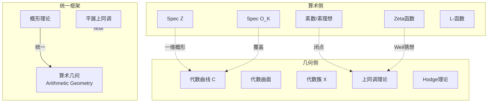
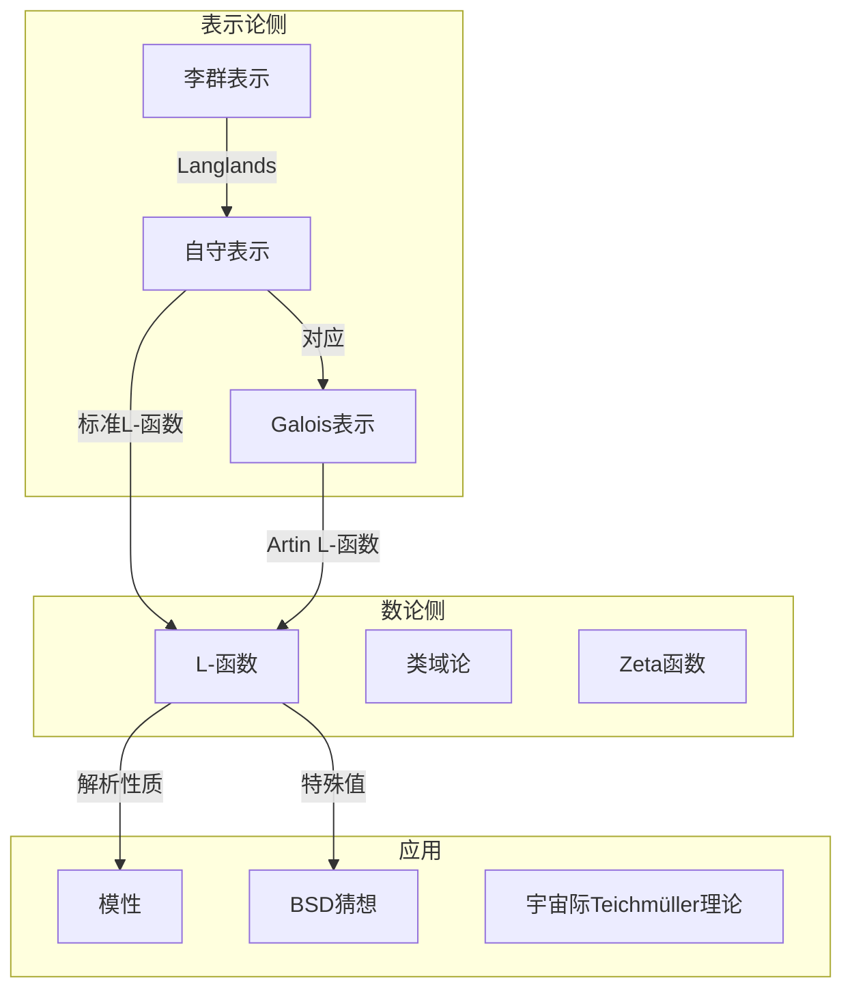
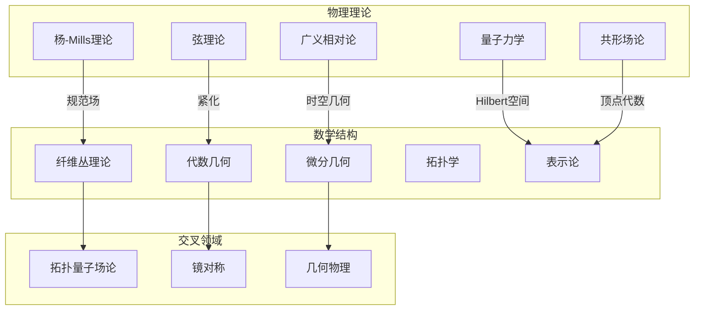

# 跨分支深层联系网络

## 概述

本文档梳理数学不同分支间的深层联系，重点介绍Langlands纲领、代数几何与数论的统一框架，以及物理与数学的交叉领域。

---

## 一、Langlands纲领概述

### 1.1 Langlands纲领总览

```mermaid
graph TB
    subgraph NumberTheory[数论侧]
        GAL_REP[Galois表示<br/>ρ: G_ℚ → GL_n]
        ZETA[Artin L-函数<br/>L(s,ρ)]
        RECIP[互反律]
    end

    subgraph Automorphic[自守侧]
        AUTO[自守表示 π]
        AUTO_FORM[自守形式]
        STD_L[标准L-函数<br/>L(s,π)]
    end

    subgraph Connection[Langlands对应]
        FUNCTORIAL[函子性提升]
        LOCAL[局部对应<br/>GL_n(ℚ_p) ↔ G_ℚ_p]
        GLOBAL[整体对应<br/>GL_n(𝔸) ↔ G_ℚ]
    end

    %% 对应关系
    GAL_REP <-->|Langlands对应| AUTO
    ZETA <-->|相等| STD_L
    RECIP <-->|体现| FUNCTORIAL
    
    %% 层次结构
    LOCAL --> GLOBAL
    AUTO --> AUTO_FORM
    
    %% 应用
    Connection -->|应用| FLT[费马大定理]
    Connection -->|应用| BSD[BSD猜想]

```

### 1.2 Langlands对应的核心陈述

```

Langlands对应 (粗糙版):

设 G 是约化群，F 是数域

{G(F)\G(𝔸_F)上的自守表示}
    ↔
{G^∨的Galois表示}

其中 G^∨ 是 G 的Langlands对偶群

关键性质:
1. L-函数对应: L(s,π) = L(s,ρ_π)
2. 局部-整体相容: 局部分量与局部Galois表示匹配
3. 函子性: 群同态 G → H 诱导表示的提升

```

### 1.3 经典对应实例

| 群 G | 对偶群 G^∨ | 对应类型 | 已知结果 |
|-----|-----------|---------|---------|
| GL₁ | GL₁ | 类域论 | 完全证明 (Artin互反律) |
| GL₂ | GL₂ | 模形式 | 部分证明 (Wiles等) |
| GL_n | GL_n | 一般情形 | 函数域已证 (Lafforgue) |
| SO_{2n+1} | Sp_{2n} | 函子性 | 部分结果 |
| G₂ | G₂ | 例外群 | 研究活跃中 |

---

## 二、类域论：Langlands纲领的原型

### 2.1 类域论核心定理

```

Artin互反律 (局部):

设 F 是局部域，F^ab 是极大Abel扩张

Artin映射给出拓扑同构:
F^× ≅ Gal(F^ab/F)

整体版本:
设 F 是数域，C_F = 𝔸_F^×/F^× 是idele类群

Artin映射:
C_F → Gal(F^ab/F) 是满射，核为连通分支

```

### 2.2 类域论与Langlands的联系

```mermaid
graph TB
    subgraph CFT[类域论 GL₁]
        IDELE[Idele类群 C_F]
        ABEL[Abel扩张]
        ARTIN[Artin映射]
    end

    subgraph Langlands[Langlands GL_n]
        AUT[G(𝔸)/G(F)]
        GAL[Galois表示]
        CORR[Langlands对应]
    end

    subgraph Generalization[推广关系]
        N1[n=1: 交换情形]
        NN[n>1: 非交换情形]
    end

    IDELE -->|n=1情形| AUT
    ABEL -->|推广| GAL
    ARTIN -->|推广| CORR
    
    N1 -->|类域论已证| CFT
    NN -->|Langlands猜想| Langlands

```

---

## 三、代数几何与数论的统一

### 3.1 Weil猜想与证明历程

```

Weil猜想 (1949):

设 X 是 𝔽_q 上的光滑射影簇，定义 Zeta函数:

Z(X,T) = exp(Σ_{n≥1} #X(𝔽_{qⁿ}) Tⁿ/n)

猜想:
1. 有理性: Z(X,T) ∈ ℚ(T)
2. 函数方程: Z(X, 1/qᵈT) = ±q^{dχ/2}T^χ Z(X,T)
3. Riemann类比: 零点在 |T| = q^{-i/2} 圆上

4. Betti数: 度数与特征0情形Betti数一致

证明:
- Dwork (1960): 有理性 (p-adic方法)
- Grothendieck (1965): 函数方程 (l-adic上同调)
- Deligne (1974): Riemann类比 (完全证明)

```

### 3.2 代数几何-数论对应图



### 3.3 椭圆曲线上的算术

```

椭圆曲线 E: y² = x³ + ax + b

算术不变量:
1. Mordell-Weil群: E(ℚ) 是有限生成Abel群
   E(ℚ) ≅ ℤʳ ⊕ E(ℚ)_tor
   
2. 导子 N_E: 刻画坏约化的素数

3. L-函数:
   L(E,s) = ∏_p (1 - a_p p^{-s} + p^{1-2s})^{-1}

BSD猜想:
   rank E(ℚ) = ord_{s=1} L(E,s)
   精细公式涉及Sha群、周期、Tate-Shafarevich群

Wiles定理 (费马大定理):
   半稳定椭圆曲线的模性
   ⇒ 对 aⁿ + bⁿ = cⁿ (n>2) 无整数解

```

---

## 四、表示论 ↔ 数论

### 4.1 Galois表示

```

Galois表示: ρ: G_ℚ → GL_n(ℚ̄_l)

类型:
1. Artin表示: 像有限 → 复表示
2. l-adic表示: 来自代数簇的上同调
   - H^i_{et}(X_{ℚ̄}, ℚ_l)
   - 特征多项式给出Frobenius迹
   
3. p进表示: 来自p进Hodge理论
   - 刻画局部Galois表示

```

### 4.2 模形式与Galois表示的联系

```

经典对应:

权k的尖点形式 f ∈ S_k(Γ₀(N))
  ↓ (Eichler-Shimura, Deligne)
2维l-adic Galois表示 ρ_f: G_ℚ → GL₂(ℚ_l)

满足:
- ρ_f 在 N 外非分歧
- Frobenius迹: Tr(ρ_f(Frob_p)) = a_p(f) （Hecke特征值）
- det(ρ_f) = χ^{k-1} （分圆特征）

Wiles的突破:
将椭圆曲线的Tate模表示证明为模形式关联的表示

```

### 4.3 表示论-数论网络



---

## 五、物理与数学的交叉

### 5.1 纤维丛与规范场论

```

数学: 主G-丛 P → M
物理: 规范场 (gauge field)

对应关系:
- 联络 ω ∈ Ω¹(P,𝔤) ↔ 规范势 A_μ
- 曲率 Ω = dω + ½[ω,ω] ↔ 场强 F_{μν}
- Bianchi恒等式 ↔ Maxwell方程
- 陈类 c(E) ↔ 拓扑荷
- 瞬子 ↔ 自对偶联络

例子: 
- U(1)-丛: 电磁学
- SU(2)-丛: 弱相互作用
- SU(3)-丛: 量子色动力学

```

### 5.2 示性类与拓扑量子场论

| 示性类 | 物理量 | 理论 |
|-------|-------|-----|
| 第一陈类 c₁ | 磁单极荷 | U(1)理论 |
| 第二陈类 c₂ | 瞬子数 | 杨-Mills理论 |
| Pontryagin类 p₁ | 引力反常 | 引力量子化 |
| Euler类 e | 费米子数 | 费米子理论 |
| Â-类 | 指标密度 | 异常抵消 |

### 5.3 弦理论与数学

```

弦理论中的数学结构:

1. 卡拉比-丘流形 (Calabi-Yau)
   - 弦紧致化: 10维 → 4维
   - 需要: Ricci平坦 Kähler流形
   - 数学: Yau定理，镜对称

2. 镜对称 (Mirror Symmetry)
   - M 的复几何 ↔ M* 的辛几何
   - 枚举几何 ↔ 周期积分
   - 物理: 两个不同的超共形场论

3. 顶点算子代数
   - 共形场论的数学形式化
   - 与模形式、有限群表示的联系

```

### 5.4 物理-数学对应网络



---

## 六、指标定理：分析与几何的统一

### 6.1 Atiyah-Singer指标定理

```

定理: 设 D: Γ(E) → Γ(F) 是椭圆微分算子

index(D) = dim ker D - dim coker D
         = ∫_M ch(σ(D)) ∧ Td(TM)

左边: 分析量（解空间维数差）
右边: 拓扑量（示性类积分）

特例:
1. Gauss-Bonnet: D = d + d*
2. Hirzebruch-Riemann-Roch: D = ∂̄
3. 符号差定理: D = d on middle degree
4. Dirac指标: D = Dirac算子

```

### 6.2 指标定理与物理

```

物理应用:

1. 反常 (Anomaly)
   - 经典对称性的量子破坏
   - 由指标密度描述
   - 通过示性类计算

2. 瞬子计算
   - Atiyah-Ward对应
   - 瞬子模空间维度 = index(D)

3. 弦理论中的指标
   - 超弦谱计算
   - 手征费米子数

```

---

## 七、现代前沿联系

### 7.1 导出代数几何与数学物理

```

导出代数几何:

- 将概形推广到导出范畴
- 交理论自然包含高阶信息
- 在Gromov-Witten理论、矩阵因子中的应用

与物理联系:
- B-twisted拓扑弦: 导出范畴 D^b(X)
- A-twisted: Fukaya范畴
- 同调镜像对称: D^b(X) ≅ Fuk(X*)

```

### 7.2 宇宙际Teichmüller理论

```

IUTT (Mochizuki, 2012):

- 全新的Grothendieck数学风格
- 重构类域论的方案
- 声称证明abc猜想

核心创新:
- 宇宙际变换 (inter-universal transformation)
- 不同"宇宙"间的联络理论
- 对传统数论方法的革新

争议与影响:
- 证明的验证持续进行中
- 推动数学界对形式化的重视

```

---

## 八、统计信息

- **Langlands纲领子领域**: 8+
- **代数几何-数论联系**: 15+
- **表示论-数论桥梁**: 10+
- **物理-数学交叉点**: 12+
- **现代前沿主题**: 6

---

*文档版本: 2026年4月 | 跨分支深层联系网络*
