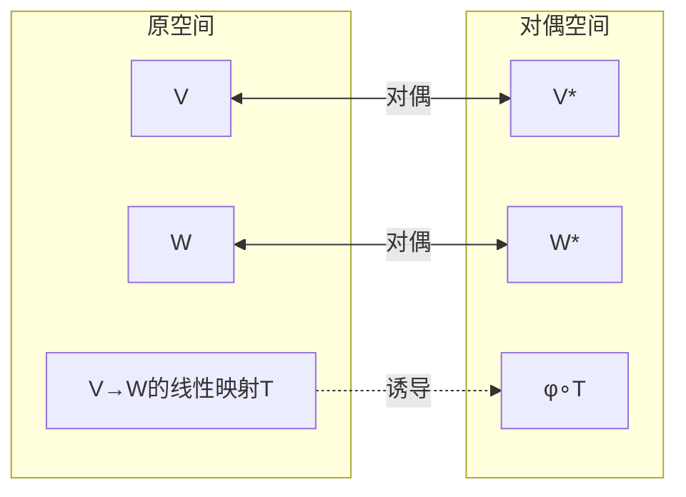
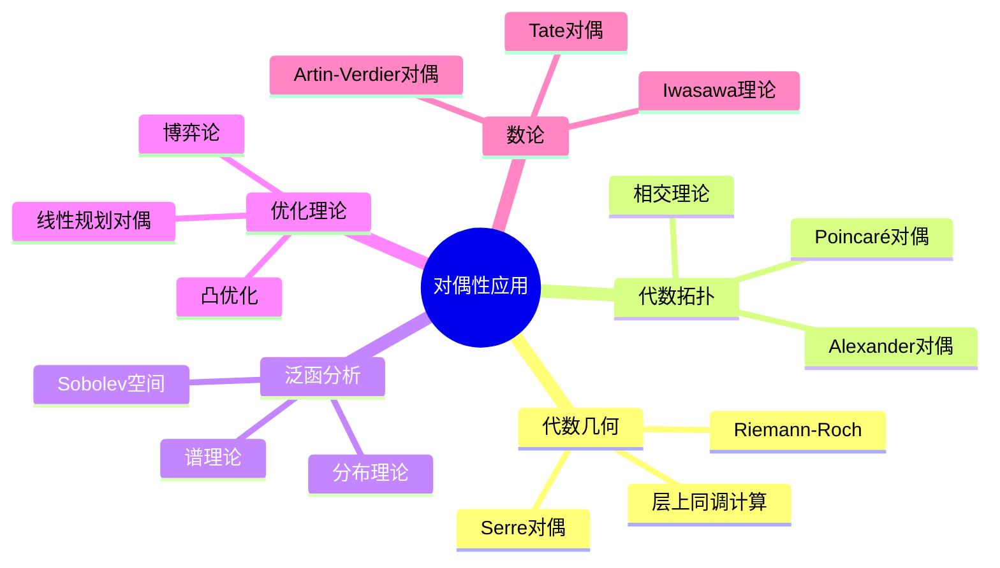

# 数学中的对偶性网络

## 概述

本文档系统梳理数学中各类对偶关系，包括线性对偶、拓扑对偶、代数几何对偶等，展示对偶性作为统一数学结构的核心思想。

---

## 一、对偶性总览

### 1.1 对偶关系全景图

```mermaid
graph TB
    subgraph Linear[线性对偶]
        VS[V 向量空间]
        VS_STAR[V* 对偶空间]
        FD[有限维对偶 V ≅ V**]
    end

    subgraph Topological[拓扑对偶]
        TVS[拓扑向量空间 E]
        TVS_STAR[E' 连续对偶]
        DIST[分布空间 D']
    end

    subgraph Algebraic[代数对偶]
        ALG[代数 A]
        COALG[余代数 A°]
        HOPF[Hopf代数<br/>自对偶结构]
    end

    subgraph Geometric[几何对偶]
        VAR[代数簇 X]
        RING[坐标环 k[X]]
        SCHEME[概形 ↔ 层]
    end

    subgraph Categorical[范畴对偶]
        CAT[范畴 C]
        OP[反范畴 C^op]
        ADJ[伴随函子 F⊣G]
    end

    %% 对偶关系
    VS <-->|自然配对| VS_STAR
    TVS <-->|连续线性泛函| TVS_STAR
    ALG <-->|有限对偶| COALG
    VAR <-->|Spec/Γ| RING
    CAT <-->|反向箭头| OP
    
    %% 特殊结构
    FD -.->|自反性| VS
    DIST -.->|分布对偶| TVS_STAR
    HOPF -.->|自对偶| Algebraic

```

### 1.2 对偶性分类表

| 对偶类型 | 对象A | 对偶对象A* | 对偶配对 | 关键性质 |
|---------|------|-----------|---------|---------|
| **线性对偶** | 向量空间V | 对偶空间V* = Hom(V,k) | ⟨v,φ⟩ = φ(v) | V ≅ V** (有限维) |
| **拓扑对偶** | 拓扑向量空间E | 连续对偶E' | ⟨x,f⟩ = f(x) | 弱拓扑 |
| **Pontryagin对偶** | 局部紧Abel群G | 特征标群Ĝ | ⟨g,χ⟩ = χ(g) | G ≅ Ĝ̂ |
| **Cartier对偶** | 有限群概形G | G^D = Hom(G,𝔾_m) | 完美配对 | (G^D)^D ≅ G |
| **Serre对偶** | 代数簇X上的层F | ω_X ⊗ F∨ | Yoneda配对 | H^i ≅ H^{n-i}* |
| **Poincaré对偶** | 流形M | 同调/上同调 | 杯积 | H_i ≅ H^{n-i} |
| **Galois对偶** | 域扩张L/K | Galois群Gal(L/K) | 不动域 | 基本定理 |
| **Stone对偶** | Boolean代数B | Stone空间Spec(B) | 超滤子 | B ≅ Clopens |
| **Gelfand对偶** | C*-代数A | 谱空间Ω(A) | 特征标 | A ≅ C₀(Ω(A)) |

---

## 二、向量空间 ↔ 对偶空间

### 2.1 有限维对偶理论

```

定义: 设V是域k上的向量空间
      V* = Hom_k(V, k) 是V的对偶空间

自然配对:
⟨ , ⟩: V × V* → k
(v, f) ↦ f(v)

典范嵌入:
ev: V → V**
eval_v(f) = f(v)

定理: dim V < ∞ ⇒ ev: V ≅ V** 是同构

```

### 2.2 对偶映射



### 2.3 对偶基与坐标

```

设 {e₁,...,eₙ} 是V的基
则对偶基 {e¹,...,eⁿ} ⊂ V* 满足:
e^i(e_j) = δ^i_j

坐标表示:
v = v^i e_i ∈ V
f = f_i e^i ∈ V*

配对: ⟨v, f⟩ = v^i f_i

```

---

## 三、拓扑空间 ↔ 函数代数

### 3.1 Gelfand对偶

```

Gelfand-Naimark定理:

交换C*-代数 A 与局部紧Hausdorff空间 X 的对偶:

A ≅ C₀(X)  (作为C*-代数)
X ≅ Ω(A) = {A的非零*-同态}

函子:
C₀: LCH^{op} → CommC*Alg
Ω: CommC*Alg → LCH^{op}

形成范畴等价!

```

### 3.2 Stone对偶

```

Stone表示定理:

Boolean代数 B 与紧Hausdorff零维空间 X:

B ≅ Clopen(X)  (开闭集代数)
X ≅ Spec(B) = {B的极大理想}

例子:
- B = P(S) (S的幂集) → X = βS (Stone-Čech紧化)
- B = 可计算集 → 可计算Stone空间

```

### 3.3 拓扑-代数对偶网络

```mermaid
graph TB
    subgraph Spaces[拓扑空间]
        CH[紧Hausdorff]
        LCH[局部紧Hausdorff]
        STONE[Stone空间]
        PRO finite[射影有限]
    end

    subgraph Algebras[代数结构]
        UNITAL[含幺交换C*代数]
        C_STAR[交换C*代数]
        BOOL[Boolean代数]
        BOOL_ALG[Boolean代数]
    end

    CH <-->|C(X)| UNITAL
    LCH <-->|C₀(X)| C_STAR
    STONE <-->|Clopen(X)| BOOL
    PRO finite <-->|连续函数| BOOL_ALG

```

---

## 四、代数几何 ↔ 交换代数

### 4.1 仿射概形的对偶

```

反等价范畴:
{仿射概形} ≅^{op} {交换环}

函子:
Spec: CommRing → AffSch
Γ: AffSch → CommRing

具体对应:
- 素理想 𝔭 ∈ Spec(A) ↔ 点
- 商环 A/I ↔ 闭子概形
- 局部化 A_f ↔ 主开集
- 模 M ↔ 拟凝聚层 M̃

```

### 4.2 Serre对偶

```

Serre对偶定理:

设 X 是n维光滑射影簇，ω_X 是典则丛
对于任意局部自由层 E:

H^i(X, E) ≅ H^{n-i}(X, ω_X ⊗ E∨)*

更一般形式:
Ext^i_X(E, ω_X) ≅ H^{n-i}(X, E)*

应用:
- 计算上同调群
- 推导Riemann-Roch定理
- 研究代数曲面的性质

```

### 4.3 几何-代数对偶详解

```mermaid
graph TB
    subgraph Geometry[几何侧]
        PT[点 x ∈ X]
        SUB[子簇 Z ⊂ X]
        BUN[向量丛 E]
        SHEAF[凝聚层 F]
    end

    subgraph Algebra[代数侧]
        MAX[极大理想 m_x]
        IDEAL[理想 I(Z)]
        MOD[投射模 P]
        MOD_F[有限生成模 M]
    end

    subgraph Cohomology[上同调]
        COH[H^i(X,F)]
        DUAL_COH[H^{n-i}(X,ω⊗F∨)*]
    end

    PT <-->|对应| MAX
    SUB <-->|零化子| IDEAL
    BUN <-->|截面模| MOD
    SHEAF <-->|整体截面| MOD_F
    
    COH <-->|Serre对偶| DUAL_COH

```

---

## 五、Pontryagin对偶

### 5.1 局部紧群的特征标理论

```

定义: 设G是局部紧Abel群
      Ĝ = Hom_{cont}(G, S¹) 是特征标群
      其中 S¹ = {z ∈ ℂ | |z| = 1}

Pontryagin对偶定理:
G ≅ Ĝ̂  (典范同构)
      g ↦ (χ ↦ χ(g))

例子:
- Ẑ = S¹ (p进整数对偶于圆群)
- ℝ̂ = ℝ  (实数自对偶)
- ℚ̂_p = ℚ_p (p进数自对偶)
- 有限Abel群: Ĝ ≅ G (非典范)

```

### 5.2 Pontryagin对偶的应用

```

傅里叶变换的对偶视角:

G = ℝ: 经典傅里叶变换
       f̂(ξ) = ∫_ℝ f(x) e^{-2πixξ} dx

G = S¹: 傅里叶级数
       f̂(n) = ∫_0^1 f(x) e^{-2πinx} dx

G = ℤ/Nℤ: 离散傅里叶变换
       f̂(k) = Σ_{n=0}^{N-1} f(n) e^{-2πink/N}

统一框架: L²(G) → L²(Ĝ)

```

---

## 六、伴随函子：范畴论对偶

### 6.1 伴随对的基本概念

```

定义: 函子 F: C → D 和 G: D → C 构成伴随对 F ⊣ G 如果:

Hom_D(F(X), Y) ≅ Hom_C(X, G(Y))  (自然同构)

F 称为左伴随，G 称为右伴随

单位与余单位:
η: Id_C → G∘F  (单位)
ε: F∘G → Id_D  (余单位)

```

### 6.2 典型伴随对

```mermaid
graph TB
    subgraph FreeForgot[自由-遗忘伴随]
        SET[Set]
        GRP[Grp]
        AB[Ab]
        RING2[Ring]
        VEC[Vec_k]
    end

    subgraph Limits[极限伴随]
        DIAG[对角函子 Δ]
        LIM[极限 lim]
        COLIM[余极限 colim]
    end

    subgraph TensorHom[张量-Hom伴随]
        TENSOR[A ⊗_R -]
        HOM[Hom_R(A,-)]
    end

    %% 自由-遗忘
    SET -->|F_Grp| GRP
    GRP -->|U| SET
    SET -->|F_Ab| AB
    AB -->|U| SET
    SET -->|F_Ring| RING2
    RING2 -->|U| SET
    
    %% 极限
    COLIM -.->|左伴随| DIAG
    DIAG -.->|右伴随| LIM
    
    %% 张量-Hom
    TENSOR -.->|左伴随| HOM

```

### 6.3 伴随对与对偶性

| 伴随对 | 左伴随 F | 右伴随 G | 类别 |
|-------|---------|---------|-----|
| 自由-遗忘 | 自由群/模 | 遗忘函子 | 结构构造 |
| 张量-Hom | A ⊗_R - | Hom_R(A,-) | 模范畴 |
| 像-原像 | f_! | f^* | 层论 |
| 直接像-逆像 | f_* | f^! | 导出范畴 |
| 扩张-限制 | Ind_H^G | Res_H^G | 表示论 |

---

## 七、自对偶与自反性

### 7.1 自对偶结构

```

定义: 对象X称为自对偶的，如果 X ≅ X*

例子:
1. 有限维欧氏空间 V ≅ V* （通过内积）
   但注意: 这不是自然的，依赖于内积选择
   
2. 辛向量空间 (V, ω)
   通过辛形式: V → V*, v ↦ ω(v,-)
   
3. Pontryagin自对偶群
   ℝ, ℚ_p, S¹, 有限Abel群
   
4. Hopf代数
   同时具有代数和余代数结构
   自对偶结构

```

### 7.2 自反空间

```

定义: 拓扑向量空间E称为自反的，如果
      E → E'' 是拓扑同构

例子:
- 有限维赋范空间
- Hilbert空间
- L^p空间 (1 < p < ∞)
- 核空间 (Schwartz空间)

非自反例子:
- L¹, L∞ (一般情形)
- 多项式空间带上确界范数

```

---

## 八、对偶性在数学中的应用

### 8.1 优化问题中的对偶

```

线性规划对偶:

原问题 (P):    max c^T x
              s.t. Ax ≤ b
                    x ≥ 0

对偶问题 (D):  min b^T y
              s.t. A^T y ≥ c
                    y ≥ 0

强对偶性: 若(P)有最优解，则(D)也有，且目标值相等

凸优化中的Fenchel对偶类似

```

### 8.2 代数拓扑中的对偶

```

Alexander对偶:

设 A ⊂ S^n 是紧子集
H̃^i(A) ≅ H̃_{n-i-1}(S^n \ A)

例子: A = S^k ⊂ S^n
则 S^n \ S^k ≃ S^{n-k-1}
上同调群对应关系验证对偶

Poincaré-Lefschetz对偶:
对带边流形 (M,∂M):
H^i(M) ≅ H_{n-i}(M,∂M)

```

### 8.3 对偶性网络的应用图



---

## 九、对偶性统计汇总

| 对偶类型 | 起源领域 | 关键定理 | 应用数量 |
|---------|---------|---------|---------|
| 线性对偶 | 线性代数 | V ≅ V** | 基础，无处不在 |
| Pontryagin对偶 | 拓扑群 | G ≅ Ĝ̂ | 调和分析，数论 |
| Gelfand对偶 | 泛函分析 | A ≅ C₀(Ω(A)) | 算子代数，量子物理 |
| Stone对偶 | 序理论 | B ≅ Clopen(X) | 逻辑学，计算机科学 |
| Serre对偶 | 代数几何 | H^i ≅ H^{n-i}* | 代数几何，弦理论 |
| Poincaré对偶 | 代数拓扑 | H_i ≅ H^{n-i} | 拓扑学，几何学 |
| Verdier对偶 | 导出范畴 | D^b(X)自对偶 | 代数几何，表示论 |
| Koszul对偶 | 同调代数 | A ↔ A^! | 表示论，数学物理 |

---

## 十、总结

对偶性是数学中最深刻、最普遍的主题之一。从线性代数中的向量空间对偶，到代数几何中的Serre对偶，再到范畴论中的伴随函子，对偶性揭示了一个统一的原理：**数学对象的"几何"与其"函数"或"表示"之间存在深刻的对称性**。

---

*文档版本: 2026年4月 | 对偶性网络*  

*核心对偶关系: 15+*  
*应用领域: 10+*  
*涵盖分支: 代数/几何/拓扑/分析/数论*
