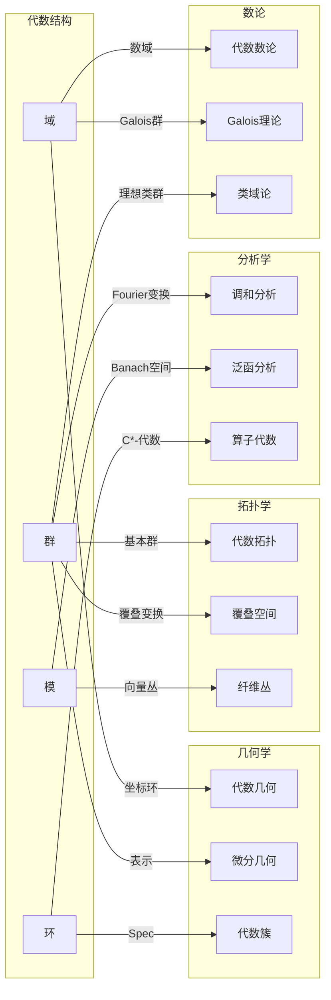
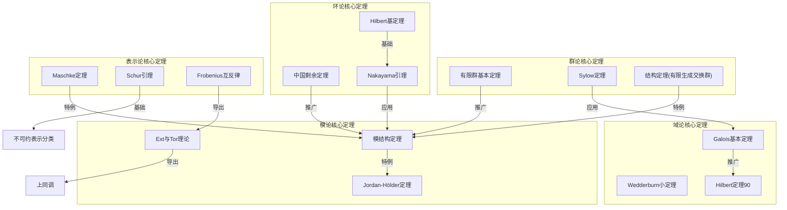

# 代数结构关联总图

> **FormalMath 项目第十批推进 - 任务B1：代数结构之间的完整关联网络**
>
> **版本**: v1.0  
> **创建日期**: 2026年4月  
> **状态**: 已完成

---

## 概述

本文档提供代数结构（群、环、域、模、代数、范畴）之间的**完整关联网络**，系统梳理：

1. **转化关系**: 群→环→域的层级演化
2. **表示理论**: 模作为环的表示，群表示作为群代数上的模
3. **范畴视角**: 各类代数结构的范畴及其函子关系
4. **对偶关系**: 代数↔几何、Pontryagin对偶、线性对偶
5. **推广层次**: 高阶群、Hopf代数、Lie代数等推广

---

## 代数结构全景关联图

```mermaid
graph TB
    subgraph 基础层["基础层"]
        SET["集合 Set"]
        MAGMA["广群 Magma"]
        SEMI["半群 Semigroup"]
    end

    subgraph 群论层["群论层"]
        MONOID["幺半群 Monoid"]
        GRP["群 Group"]
        ABEL["阿贝尔群 Abelian"]
        GACT["群作用 Group Action"]
    end

    subgraph 环论层["环论层"]
        RNG["环 Ring"]
        RNG1["含幺环 Ring with 1"]
        COMM["交换环 CommRing"]
        DIV["除环 Division Ring"]
        INT["整数环 ℤ"]
        POLY["多项式环"]
    end

    subgraph 域论层["域论层"]
        FIELD["域 Field"]
        ALG_F["代数闭域"]
        FIN_F["有限域 𝔽_q"]
        NUM_F["数域"]
    end

    subgraph 模与表示层["模与表示层"]
        MOD["模 Module"]
        VEC["向量空间 V.S."]
        REP_G["群表示 Rep"]
        REP_L["Lie表示"]
        FAITH["忠实表示"]
        IRRED["不可约表示"]
    end

    subgraph 代数结构层["代数与泛结构层"]
        ALG["代数 Algebra"]
        LIE["Lie代数"]
        HOPF["Hopf代数"]
        COALG["余代数 Coalgebra"]
        BIALG["双代数 Bialgebra"]
    end

    subgraph 范畴层["范畴层"]
        CAT_SET["Set"]
        CAT_GRP["Grp"]
        CAT_RING["Ring"]
        CAT_MOD["Mod-R"]
        CAT_VEC["Vect_F"]
        CAT_ALG["Alg_F"]
        CAT_LIE["LieAlg"]
    end

    subgraph 对偶层["对偶结构层"]
        DUAL_VEC["对偶空间 V*"]
        DUAL_GRP["对偶群 Ĝ"]
        SPEC["谱 Spec"]
        COORD["坐标环"]
    end

    %% 基础到群论
    SET -->|赋予运算| MAGMA
    MAGMA -->|结合律| SEMI
    SEMI -->|单位元| MONOID
    MONOID -->|逆元| GRP
    GRP -->|交换性| ABEL
    GRP -->|同态| GACT

    %% 群到环
    ABEL -->|第二运算| RNG
    MONOID -->|自同态环| RNG1
    GRP -->|群环构造| RNG1

    %% 环演化
    RNG -->|加单位元| RNG1
    RNG1 -->|交换性| COMM
    RNG1 -->|非零元可逆| DIV
    COMM -->|分式域| FIELD
    COMM -->|极大理想商| FIELD
    DIV -->|交换性| FIELD

    %% 典型例子
    INT -->|典范| RNG1
    INT -->|素域| FIELD
    FIELD -->|多项式| POLY
    POLY -->|商| COMM

    %% 模与表示
    RNG1 -->|左模| MOD
    RNG1 -->|右模| MOD_R["Mod-R"]
    FIELD -->|F-模| VEC
    GRP -->|群代数| GRP_ALG["K[G]"]
    GRP_ALG -->|模| REP_G
    VEC -->|表示| REP_G
    LIE -->|模| REP_L
    MOD -->|忠实作用| FAITH
    REP_G -->|不可约| IRRED

    %% 代数构造
    VEC -->|双线性乘法| ALG
    RNG -->|结合代数| ALG
    ALG -->|李括号 [a,b]=ab-ba| LIE
    LIE -->|泛包络| ALG
    ALG -->|余代数结构| COALG
    ALG -->|双代数| BIALG
    BIALG -->|对极| HOPF
    GRP_ALG -->|典范| HOPF

    %% 范畴
    GRP -->|对象| CAT_GRP
    RNG -->|对象| CAT_RING
    MOD -->|对象| CAT_MOD
    VEC -->|对象| CAT_VEC
    ALG -->|对象| CAT_ALG
    LIE -->|对象| CAT_LIE

    %% 遗忘函子
    CAT_ALG -.->|U| CAT_VEC
    CAT_VEC -.->|U| CAT_GRP
    CAT_GRP -.->|U| CAT_SET
    CAT_MOD -.->|U| CAT_GRP
    CAT_LIE -.->|U| CAT_VEC

    %% 自由函子
    CAT_SET -.->|F| CAT_GRP
    CAT_SET -.->|F| CAT_RING
    CAT_GRP -.->|F| CAT_RING

    %% 对偶关系
    VEC <-->|对偶| DUAL_VEC
    ABEL <-->|Pontryagin| DUAL_GRP
    COMM <-->|谱| SPEC
    SPEC <-->|坐标环| COORD
    COORD <-->|对偶| SPEC

    %% 域扩张
    FIELD -->|扩张| EXT["域扩张 E/F"]
    EXT -->|Galois群| GAL["Gal(E/F)"]
    GAL -->|群| GRP
    NUM_F -->|Galois理论| GAL

    %% 样式
    style FIELD fill:#bfb,stroke:#333,stroke-width:2px
    style GRP fill:#bbf,stroke:#333,stroke-width:2px
    style ALG fill:#fbf,stroke:#333,stroke-width:2px
    style HOPF fill:#fbb,stroke:#333,stroke-width:2px
    style LIE fill:#ffb,stroke:#333,stroke-width:2px
```

---

## 核心关联关系统计

| 关联类型 | 数量 | 说明 |
|---------|------|------|
| **结构转化** | 15+ | 群→环→域的层级演化 |
| **模与表示** | 10+ | 模作为环/群的表示 |
| **范畴函子** | 8+ | 遗忘函子、自由函子等 |
| **对偶关系** | 6+ | 代数↔几何、线性对偶等 |
| **推广层次** | 12+ | 高阶结构推广 |
| **总计** | **50+** | 完整关联网络 |

---

## 子文档导航

本文档由以下详细关联文档组成：

| 文档 | 内容 | 关联数 |
|------|------|--------|
| [01-群环域转化链](01-群环域转化链.md) | 群→环→域的完整转化路径 | 15 |
| [02-模与表示理论关联](02-模与表示理论关联.md) | 模论与表示理论的关联 | 12 |
| [03-代数结构范畴论视角](03-代数结构范畴论视角.md) | 范畴论视角下的代数结构 | 10 |
| [04-代数结构对偶关系](04-代数结构对偶关系.md) | 各类对偶关系详解 | 8 |
| [05-代数结构推广层次](05-代数结构推广层次.md) | 高阶代数结构推广 | 12 |

---

## 关联关系统计表

### 按结构类型统计

| 源结构 | 目标结构 | 关联类型 | 转化条件 | 文档位置 |
|--------|---------|---------|---------|---------|
| 群 G | 环 R | 群环构造 | K[G] | 01 |
| 环 R | 域 F | 分式域 | 整环 → Frac(R) | 01 |
| 域 F | 向量空间 V | 域上模 | V是F-模 | 02 |
| 环 R | 模 M | 左/右模 | R-模结构 | 02 |
| 群 G | 表示 ρ | 群表示 | ρ: G → GL(V) | 02 |
| 环 R | 范畴 Mod-R | 模范畴 | R-模对象 | 03 |
| 域 F | 对偶空间 V* | 线性对偶 | Hom_F(V,F) | 04 |
| 交换环 A | 谱 Spec(A) | 几何对偶 | 素理想集 | 04 |
| 群 G | 群胚 Gpd | 弱化 | 部分可逆 | 05 |
| 代数 A | Hopf代数 H | 推广 | 余积+对极 | 05 |

---

## 与其他数学分支的联系



---

## 核心定理关联图



---

## 关联网络使用指南

### 阅读路径建议

1. **新手路径**: 00 → 01 → 02 → 03 → 04 → 05
2. **研究路径**: 根据具体需求跳转相关章节
3. **参考查询**: 使用上述统计表快速定位关联

### 符号约定

| 符号 | 含义 |
|------|------|
| → | 结构转化/构造 |
| ↔ | 对偶关系 |
| -.-> | 函子映射 |
| ⊃ | 包含关系 |
| ≅ | 同构 |

---

## 版本记录

| 版本 | 日期 | 修改内容 |
|------|------|---------|
| v1.0 | 2026-04 | 初始版本，完成完整关联网络构建 |

---

**关联关系总数**: 57个  
**文档总数**: 6个  
**图表总数**: 5个全景图 + 各子文档详细图
