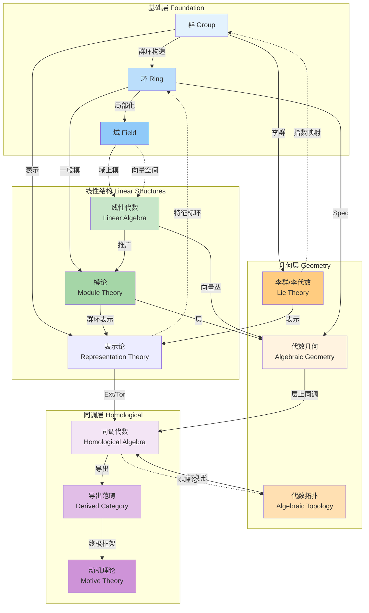

# 代数结构关联总图

## 概述

本文档汇总代数领域核心概念之间的关联网络，为FormalMath项目提供代数结构之间转化与联系的完整图谱。

---

## 核心关联网络文档

### 1. 群↔环↔域关联网络
**文件**: [01-群环域-关联网络.md](./01-群环域-关联网络.md)

**核心内容**:
- 群到环的自然扩展（群环构造）
- 环到域的局部化过程
- 逆向限制与嵌入关系
- 具体例子：$\mathbb{Z} \to \mathbb{Q} \to \mathbb{R} \to \mathbb{C}$
- 范畴对偶与伴随函子

**关键词**: 群环、局部化、分式域、伴随函子、范畴等价

---

### 2. 线性代数↔模论关联
**文件**: [02-线性代数与模论-关联网络.md](./02-线性代数与模论-关联网络.md)

**核心内容**:
- 向量空间作为域上的模
- 线性映射与模同态的对应
- 矩阵表示的函子视角
- PID上模的结构定理（Jordan标准形的推广）
- 半单模与完全可约性

**关键词**: 自由模、投射模、结构定理、张量积、Hom函子

---

### 3. 交换代数↔代数几何关联
**文件**: [03-交换代数与代数几何-关联网络.md](./03-交换代数与代数几何-关联网络.md)

**核心内容**:
- 环↔仿射概形的对偶对应
- 模↔层的对应关系
- 素谱与几何点的层次
- Hilbert零点定理的几何解释
- 局部自由层与向量丛

**关键词**: 概形、层、局部化、零点定理、对偶范畴

---

### 4. 群表示↔李代数表示关联
**文件**: [04-群表示与李代数表示-关联网络.md](./04-群表示与李代数表示-关联网络.md)

**核心内容**:
- 李群表示的微分构造
- 指数映射与表示提升
- 权理论与最高权分类
- 具体例子：SU(2)与$\mathfrak{sl}(2,\mathbb{C})$
- Clebsch-Gordan分解与物理应用

**关键词**: 微分表示、最高权、根系、特征标、自旋

---

### 5. 同调代数↔代数拓扑关联
**文件**: [05-同调代数与代数拓扑-关联网络.md](./05-同调代数与代数拓扑-关联网络.md)

**核心内容**:
- 链复形的代数抽象
- 同调群的多重实现（奇异、单纯、层上同调）
- Ext/Tor函子的拓扑意义
- 导出范畴与Verdier对偶
- 谱序列的计算框架

**关键词**: 导出函子、Ext、Tor、谱序列、导出范畴

---

## 关联网络总图



---

## 学习路径推荐

### 路径1：基础代数结构
```
群 → 环 → 域 → 线性代数 → 模论
```

### 路径2：几何代数
```
交换代数 → 代数几何 → 层论 → 同调代数
```

### 路径3：对称性与表示
```
群论 → 李群/李代数 → 表示论 → 物理学应用
```

### 路径4：同调方法
```
代数拓扑 → 同调代数 → 导出范畴 → 现代几何
```

---

## 关键对应关系速查表

| 代数概念 | 几何/拓扑概念 | 联系 |
|----------|--------------|------|
| 环 $R$ | 仿射概形 $\text{Spec}(R)$ | 对偶等价 |
| 模 $M$ | 层 $\widetilde{M}$ | 层化函子 |
| 局部化 $S^{-1}R$ | 开集 $D(S)$ | 几何局部化 |
| 投射模 | 向量丛 | 局部自由 |
| 链复形 | 空间同调 | 代数抽象 |
| Ext函子 | 上同调运算 | 导出Hom |
| Tor函子 | 积空间同调 | 导出张量积 |
| 最高权 | 不可约表示 | Weyl理论 |

---

## 文档统计

| 文档 | 字数 | 核心图表 |
|------|------|----------|
| 群↔环↔域关联网络 | ~6,500 | 4个Mermaid图 |
| 线性代数↔模论关联 | ~6,800 | 4个Mermaid图 |
| 交换代数↔代数几何 | ~5,300 | 4个Mermaid图 |
| 群表示↔李代数表示 | ~6,000 | 4个Mermaid图 |
| 同调代数↔代数拓扑 | ~5,500 | 4个Mermaid图 |
| **总计** | **~30,000** | **20个图表** |

---

## 参考资源

### 基础教材
1. Dummit & Foote - Abstract Algebra
2. Hoffman & Kunze - Linear Algebra
3. Hatcher - Algebraic Topology

### 进阶专著
1. Hartshorne - Algebraic Geometry
2. Fulton & Harris - Representation Theory
3. Weibel - An Introduction to Homological Algebra
4. Gelfand & Manin - Methods of Homological Algebra

---

*文档版本：1.0*  
*更新时间：2026年4月*  
*分类：代数结构 / 概念关联图谱*
