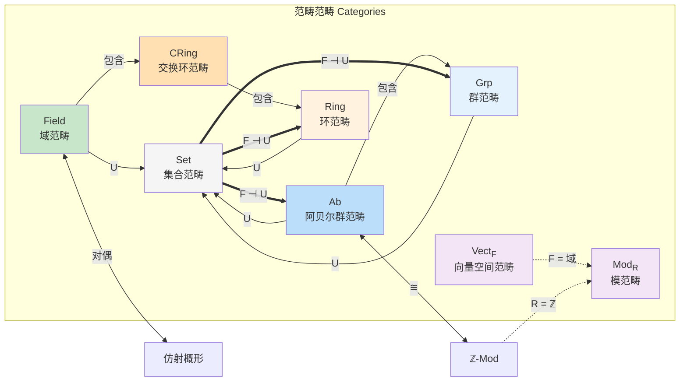
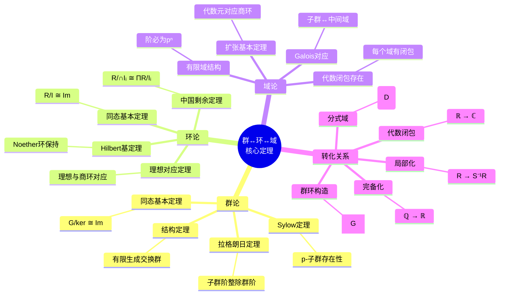

# 群↔环↔域关联网络 - 理论模型关联网络

## 概述

群、环、域是代数学中最基本的三类代数结构，它们之间存在着深刻的层次关系：域是特殊的环，环是特殊的群（加法群）。这种包含关系构成了代数结构的基础层级，而它们之间的转化与联系则是理解现代代数学的关键。本文档系统地阐述这三个代数结构之间的完整关联网络。

---

## 一、群的独立结构

### 1.1 定义与公理

**定义 1.1**（群）
群 $(G, \cdot)$ 是一个集合 $G$ 配备一个二元运算 $\cdot: G \times G \to G$，满足以下公理：

| 公理 | 表述 | 符号 |
|------|------|------|
| 封闭性 | $\forall a,b \in G, a \cdot b \in G$ | 运算在 $G$ 上封闭 |
| 结合律 | $(a \cdot b) \cdot c = a \cdot (b \cdot c)$ | 结合性 |
| 单位元 | $\exists e \in G, \forall a \in G, e \cdot a = a \cdot e = a$ | 存在单位元 |
| 逆元 | $\forall a \in G, \exists a^{-1} \in G, a \cdot a^{-1} = e$ | 每个元素可逆 |

**分类体系**：
- **阿贝尔群**：满足交换律 $a \cdot b = b \cdot a$
- **循环群**：由一个元素生成的群 $G = \langle g \rangle$
- **有限群与无限群**：按元素个数分类
- **单群**：没有非平凡正规子群的群

### 1.2 核心定理

**定理 1.1**（拉格朗日定理）
若 $H$ 是有限群 $G$ 的子群，则 $|H|$ 整除 $|G|$，且 $[G:H] = |G|/|H|$。

**定理 1.2**（同态基本定理）
设 $\varphi: G \to H$ 是群同态，则：
$$G/\ker(\varphi) \cong \text{Im}(\varphi)$$

**定理 1.3**（Sylow定理）
设 $|G| = p^n m$，其中 $p \nmid m$，则：

1. $G$ 存在阶为 $p^n$ 的子群（Sylow $p$-子群）
2. 所有Sylow $p$-子群共轭
3. Sylow $p$-子群个数 $n_p \equiv 1 \pmod{p}$

### 1.3 典型例子

| 群 | 运算 | 类型 | 性质 |
|----|------|------|------|
| $(\mathbb{Z}, +)$ | 加法 | 无限阿贝尔群 | 自由阿贝尔群，秩为1 |
| $(\mathbb{Z}/n\mathbb{Z}, +)$ | 模 $n$ 加法 | 有限循环群 | 阶为 $n$ |
| $S_n$ | 置换复合 | 有限群 | 阶为 $n!$，非交换（$n \geq 3$） |
| $GL_n(\mathbb{R})$ | 矩阵乘法 | 无限群 | 一般线性群 |
| $SL_n(\mathbb{R})$ | 矩阵乘法 | 无限群 | 特殊线性群，行列式为1 |
| $D_n$ | 对称变换 | 有限群 | 二面体群，阶为 $2n$ |
| $Q_8$ | 四元数乘法 | 有限群 | 四元数群，阶为8 |

---

## 二、环的独立结构

### 2.1 定义与公理

**定义 2.1**（环）
环 $(R, +, \cdot)$ 是一个集合 $R$ 配备两种运算：加法 $+$ 和乘法 $\cdot$，满足：

1. $(R, +)$ 是阿贝尔群
2. $(R, \cdot)$ 是半群（封闭且结合）
3. 乘法对加法满足分配律：
   - $a \cdot (b + c) = a \cdot b + a \cdot c$
   - $(a + b) \cdot c = a \cdot c + b \cdot c$

**特殊环类**：

| 类型 | 定义条件 | 例子 |
|------|----------|------|
| 含幺环 | 乘法单位元 $1$ 存在 | $\mathbb{Z}, \mathbb{R}[x]$ |
| 交换环 | 乘法交换 $ab = ba$ | 数域上的多项式环 |
| 整环 | 无零因子的交换含幺环 | $\mathbb{Z}, \mathbb{Z}[i]$ |
| 除环 | 非零元都可逆 | 四元数体 $\mathbb{H}$ |
| 域 | 交换的除环 | $\mathbb{Q}, \mathbb{R}, \mathbb{C}, \mathbb{F}_p$ |

### 2.2 核心定理

**定理 2.1**（理想对应定理）
设 $R$ 是环，$I \subseteq R$ 是理想，则 $R/I$ 的理想与 $R$ 中包含 $I$ 的理想一一对应。

**定理 2.2**（中国剩余定理）
设 $R$ 是环，$I_1, \ldots, I_n$ 是两两互素的理想，则：
$$R/(I_1 \cap \cdots \cap I_n) \cong R/I_1 \times \cdots \times R/I_n$$

**定理 2.3**（Hilbert基定理）
若 $R$ 是Noether环，则多项式环 $R[x]$ 也是Noether环。

### 2.3 典型例子

| 环 | 加法 | 乘法 | 类型 |
|----|------|------|------|
| $\mathbb{Z}$ | 整数加法 | 整数乘法 | 主理想整环 |
| $\mathbb{Z}/n\mathbb{Z}$ | 模 $n$ 加法 | 模 $n$ 乘法 | 有限环，域（$n$ 为素数） |
| $\mathbb{R}[x]$ | 多项式加法 | 多项式乘法 | 欧几里得整环 |
| $M_n(\mathbb{R})$ | 矩阵加法 | 矩阵乘法 | 非交换含幺环 |
| $\mathbb{H}$ | 四元数加法 | 四元数乘法 | 除环（非域） |
| $\mathbb{Z}[i]$ | Gauss整数加法 | Gauss整数乘法 | 欧几里得整环 |
| $\mathbb{Z}[\sqrt{-5}]$ | 加法 | 乘法 | 整环（非唯一分解） |

---

## 三、域的独立结构

### 3.1 定义与公理

**定义 3.1**（域）
域 $(F, +, \cdot)$ 是满足以下条件的环：
1. $F$ 是交换环
2. $1 \neq 0$（非零环）
3. 每个非零元 $a \in F^* = F \setminus \{0\}$ 都有乘法逆元 $a^{-1}$

**等价表述**：域是乘法群为阿贝尔群的除环，即 $(F^*, \cdot)$ 是阿贝尔群。

### 3.2 核心定理

**定理 3.1**（域扩张基本定理）
设 $K/F$ 是域扩张，$\alpha \in K$：
- 若 $\alpha$ 在 $F$ 上代数，则 $F(\alpha) \cong F[x]/(m_\alpha(x))$，其中 $m_\alpha$ 是极小多项式
- 若 $\alpha$ 在 $F$ 上超越，则 $F(\alpha) \cong F(x)$（有理函数域）

**定理 3.2**（有限域结构定理）
1. 有限域的阶必为 $p^n$，其中 $p$ 为素数
2. 对任意素数幂 $q = p^n$，存在唯一的（同构意义下）$q$ 元域 $\mathbb{F}_q$
3. $\mathbb{F}_q^*$ 是循环群

**定理 3.3**（Galois理论基本定理）
设 $K/F$ 是有限Galois扩张，则：
$$\{\text{中间域 } E: F \subseteq E \subseteq K\} \longleftrightarrow \{\text{Gal}(K/F)\text{ 的子群 } H\}$$
对应关系为 $E \mapsto \text{Gal}(K/E)$，$H \mapsto K^H$。

### 3.3 典型例子

| 域 | 特征 | 性质 |
|----|------|------|
| $\mathbb{Q}$ | 0 | 有理数域，最小数域 |
| $\mathbb{R}$ | 0 | 实数域，完备有序域 |
| $\mathbb{C}$ | 0 | 复数域，代数闭域 |
| $\mathbb{F}_p = \mathbb{Z}/p\mathbb{Z}$ | $p$ | $p$ 元有限域（$p$ 素数） |
| $\mathbb{F}_{p^n}$ | $p$ | $p^n$ 元有限域 |
| $\mathbb{Q}(\sqrt{2})$ | 0 | 二次扩张 |
| $\overline{\mathbb{Q}}$ | 0 | 代数闭包（代数数域） |

---

## 四、群→环的自然转化

### 4.1 从群构造环的通用方法

**构造 4.1**（群环/群代数）
设 $G$ 是群，$R$ 是环，群环 $R[G]$ 定义为：
$$R[G] = \left\{ \sum_{g \in G} r_g g \mid r_g \in R, \text{有限非零} \right\}$$

- 加法：分量相加
- 乘法：$(\sum r_g g) \cdot (\sum s_h h) = \sum_{g,h} r_g s_h (gh)$

**性质**：
- 若 $G$ 是有限群，则 $\mathbb{C}[G]$ 是半单代数（Maschke定理）
- 群表示理论与群环的模理论等价

**构造 4.2**（自同态环）
设 $(G, +)$ 是阿贝尔群，其自同态环为：
$$\text{End}(G) = \{ f: G \to G \mid f \text{ 是群同态} \}$$
运算为加法 $(f+g)(x) = f(x) + g(x)$ 和复合 $(f \circ g)(x) = f(g(x))$。

**构造 4.3**（群上同调环）
设 $G$ 是群，$R$ 是交换环，群上同调 $H^*(G; R)$ 具有环结构（杯积），这是拓扑不变量。

### 4.2 群论问题到环论的转化

| 群论概念 | 环论语境 | 应用 |
|----------|----------|------|
| 群表示 | 群环上的模 | 表示论分类 |
| 群特征标 | 特征标环 | Burnside定理 |
| 群作用 | 不变量环 | Galois理论 |
| 自由群 | 自由代数 | 泛性质构造 |

### 4.3 典型例子：整数群到整数环

**例 4.1** $(\mathbb{Z}, +)$ 到 $(\mathbb{Z}, +, \cdot)$

整数加法群 $(\mathbb{Z}, +)$ 是无限循环群，生成元为 $1$ 或 $-1$。

**自然扩展**：
- 加法结构已给出
- 乘法定义为重复加法的推广：$m \cdot n = \underbrace{n + \cdots + n}_{m \text{ 次}}$
- 这个定义使得 $\mathbb{Z}$ 成为主理想整环

**普遍性质**：
从群 $(\mathbb{Z}, +)$ 到任意含幺环 $(R, +, \cdot)$ 的群同态 $f: \mathbb{Z} \to R^+$（加法群），若要求 $f(1) = 1_R$，则 $f$ 必须是环同态：
$$f(n) = \underbrace{1_R + \cdots + 1_R}_{n \text{ 次}}, \quad f(m \cdot n) = f(m) \cdot f(n)$$

---

## 五、环→域的自然转化（局部化）

### 5.1 局部化构造

**构造 5.1**（乘法集的局部化）
设 $R$ 是交换环，$S \subseteq R$ 是乘法闭集（$1 \in S$，对乘法封闭，不含零因子）。局部化 $S^{-1}R$ 定义为：
$$S^{-1}R = \left\{ \frac{a}{s} \mid a \in R, s \in S \right\} / \sim$$
其中 $\frac{a}{s} \sim \frac{b}{t} \iff \exists u \in S: u(at - bs) = 0$。

**关键性质**：
- 自然映射 $\varphi: R \to S^{-1}R$，$a \mapsto \frac{a}{1}$ 是环同态
- 若 $R$ 是整环且 $0 \notin S$，则 $\varphi$ 是单射
- $S^{-1}R$ 中 $S$ 的元素变为可逆元

### 5.2 特殊局部化类型

| 类型 | 乘法集 $S$ | 结果 |
|------|-----------|------|
| 全分式域 | $S = R \setminus \{0\}$（$R$ 整环） | 分式域 $\text{Frac}(R)$ |
| 素理想局部化 | $S = R \setminus P$（$P$ 素理想） | 局部环 $R_P$ |
| 元素局部化 | $S = \{f^n \mid n \geq 0\}$ | $R_f$ |
| 分式化 | 任意乘法集 | 一般局部化 |

### 5.3 从环到域的条件

**定理 5.1**（环成为域的等价条件）
对交换环 $R \neq 0$，以下等价：
1. $R$ 是域
2. $R$ 只有平凡理想 $\{0\}$ 和 $R$
3. 任意非零环同态 $R \to S$ 是单射
4. $R[x]$ 是主理想整环
5. 任意 $R$-模都是自由模

### 5.4 典型例子

**例 5.1** $\mathbb{Z}$ 到 $\mathbb{Q}$
整数环 $\mathbb{Z}$ 的分式域是有理数域 $\mathbb{Q}$：
$$\mathbb{Q} = \mathbb{Z}_{(0)} = \left\{ \frac{a}{b} \mid a, b \in \mathbb{Z}, b \neq 0 \right\}$$

**例 5.2** $k[x]$ 到 $k(x)$
多项式环 $k[x]$ 的分式域是有理函数域 $k(x)$。

**例 5.3** $\mathbb{Z}[i]$ 到 $\mathbb{Q}(i)$
Gauss整数环的分式域是Gauss有理数域：
$$\mathbb{Q}(i) = \left\{ \frac{a+bi}{c+di} \mid a,b,c,d \in \mathbb{Z}, c+di \neq 0 \right\}$$

---

## 六、域→环的限制与嵌入

### 6.1 域作为特殊环

**命题 6.1**
域是满足以下额外条件的交换环：
1. $1 \neq 0$
2. 每个非零元都是单位（可逆）

**推论**：域的理想格非常简单——只有 $\{0\}$ 和 $F$ 本身。这使得域上的模论（线性代数）特别简单。

### 6.2 从域构造环的方法

**构造 6.1**（多项式环）
从域 $F$ 可以构造多项式环 $F[x]$，这是欧几里得整环。

**构造 6.2**（矩阵环）
$M_n(F)$ 是域 $F$ 上的 $n \times n$ 矩阵环，这是非交换环（$n \geq 2$）。

**构造 6.3**（形式幂级数）
$F[[x]]$ 是形式幂级数环，这是局部环。

**构造 6.4**（限制标量）
若 $K/F$ 是域扩张，则 $K$ 作为 $F$-代数是环，同时 $K$ 也是 $F$-向量空间。

### 6.3 域扩张中的子环

设 $K/F$ 是域扩张：
- $F$ 是 $K$ 的子域
- $K$ 中 $F$ 上的整元形成子环（整闭包）
- 若 $K/F$ 是代数扩张，整闭包等于 $K$

---

## 七、群↔环↔域的完整转化链

### 7.1 经典转化链：$\mathbb{Z} \to \mathbb{Q} \to \mathbb{R} \to \mathbb{C}$

**第一步：$\mathbb{Z} \to \mathbb{Q}$（局部化）**
- 从整数加法群构造整数环
- 局部化得到有理数域
- $\mathbb{Q} = \text{Frac}(\mathbb{Z})$

**第二步：$\mathbb{Q} \to \mathbb{R}$（完备化）**
- 度量完备化：$\mathbb{R}$ 是 $\mathbb{Q}$ 关于绝对值的完备化
- 或：Dedekind分割构造
- 保持域结构

**第三步：$\mathbb{R} \to \mathbb{C}$（代数闭包）**
- $\mathbb{C} = \mathbb{R}[x]/(x^2+1)$
- 或：代数闭包构造
- $\mathbb{C}$ 是代数闭域

### 7.2 转化过程的代数性质

| 转化 | 从 | 到 | 方法 | 性质保持 | 性质增益 |
|------|-----|-----|------|----------|----------|
| 群→环 | $(\mathbb{Z}, +)$ | $(\mathbb{Z}, +, \cdot)$ | 引入乘法 | 加法结构 | 乘法结构 |
| 环→域 | $\mathbb{Z}$ | $\mathbb{Q}$ | 局部化 | 环结构 | 除法封闭 |
| 域完备化 | $\mathbb{Q}$ | $\mathbb{R}$ | 完备化 | 域结构 | 完备性 |
| 域扩张 | $\mathbb{R}$ | $\mathbb{C}$ | 商环 | 域结构 | 代数闭性 |

---

## 八、等价与对偶关系

### 8.1 范畴等价

**定理 8.1**（阿贝尔群与$\mathbb{Z}$-模范畴等价）
$$\mathbf{Ab} \cong \mathbb{Z}\text{-}\mathbf{Mod}$$

这意味着阿贝尔群的研究完全等价于 $\mathbb{Z}$-模的研究。

**推论**：阿贝尔群 $A$ 的自同态环 $\text{End}(A)$ 是 $\mathbb{Z}$-代数。

### 8.2 伴随函子

**定理 8.2**（遗忘函子与自由构造的伴随）

遗忘函子 $U: \mathbf{Ring} \to \mathbf{Set}$ 有左伴随 $F: \mathbf{Set} \to \mathbf{Ring}$，将集合 $X$ 映为自由环 $\mathbb{Z}\langle X \rangle$：
$$\text{Hom}_{\mathbf{Ring}}(\mathbb{Z}\langle X \rangle, R) \cong \text{Hom}_{\mathbf{Set}}(X, U(R))$$

**类似地**：
- 遗忘函子 $\mathbf{Field} \to \mathbf{Ring}$ 没有左伴随（域范畴不完备）
- 但素域构造提供了某种"自由"构造

### 8.3 对偶构造

**命题 8.1**（环的对偶性）
交换环范畴 $\mathbf{CRing}$ 与仿射概形范畴 $\mathbf{AffSch}$ 对偶等价：
$$\mathbf{CRing}^{\text{op}} \cong \mathbf{AffSch}$$

这在交换代数与代数几何之间建立深刻联系。

---

## 九、应用实例

### 应用 1：代数数论中的整性

**背景**：研究 $\mathbb{Q}$ 的有限扩张中的"整数"。

**构造**：
- 数域 $K/\mathbb{Q}$（有限扩张）
- $\mathcal{O}_K = \{ \alpha \in K \mid \alpha \text{ 在 } \mathbb{Z} \text{ 上整} \}$
- $\mathcal{O}_K$ 是Dedekind整环

**群-环-域联系**：
- 类群 $\text{Cl}(\mathcal{O}_K)$ 衡量 $\mathcal{O}_K$ 与主理想整环的差距（群结构）
- 理想分解：$(p) = \mathfrak{p}_1^{e_1} \cdots \mathfrak{p}_g^{e_g}$（环结构）
- 剩余域 $\mathcal{O}_K/\mathfrak{p}$ 是有限域（域结构）

**Fermat大定理的证明**：
在 $\mathbb{Z}[\zeta_p]$（$p$ 次单位根环）中研究 $x^p + y^p = z^p$ 的解。

### 应用 2：编码理论

**线性码**：$k$-维子空间 $C \subseteq \mathbb{F}_q^n$

**代数构造**：
- **循环码**：$\mathbb{F}_q[x]/(x^n-1)$ 的理想
- **BCH码**：利用有限域 $\mathbb{F}_{q^m}$ 的根设计纠错能力
- **Reed-Solomon码**：$\mathbb{F}_q[x]$ 的特定商环构造

**群-环-域层次**：
- 域 $\mathbb{F}_q$ 提供系数
- 环 $\mathbb{F}_q[x]/(x^n-1)$ 提供码的结构
- 循环群 $\mathbb{Z}/n\mathbb{Z}$ 作用提供循环结构

### 应用 3：密码学基础

**RSA加密**：
- 基于环 $\mathbb{Z}/n\mathbb{Z}$（$n = pq$）
- 乘法群 $(\mathbb{Z}/n\mathbb{Z})^*$ 的阶 $\varphi(n) = (p-1)(q-1)$ 保密
- 指数运算在环中进行

**椭圆曲线密码**：
- 椭圆曲线 $E: y^2 = x^3 + ax + b$ 在域 $F$ 上
- 点群 $E(F)$ 是有限阿贝尔群
- 离散对数问题提供安全性

**有限域密码**：
- AES使用 $\mathbb{F}_{2^8} = \mathbb{F}_2[x]/(x^8+x^4+x^3+x+1)$
- 字节运算对应域运算

---

## 十、关联网络图

### 10.1 群-环-域层次结构图

```mermaid
graph TD
    %% 基础层
    G[群 Group<br/>单一运算] --> AG[阿贝尔群 Abelian Group]

    %% 环层
    AG --> R[环 Ring<br/>双运算]
    R --> CR[交换环 Commutative Ring]
    R --> UR[含幺环 Ring with 1]
    CR --> ID[整环 Integral Domain]
    UR --> ID

    %% 域层
    ID --> F[域 Field<br/>可逆乘法]

    %% 特殊类型
    F --> FF[有限域 Finite Field<br/>𝔽<sub>p<sup>n</sup></sub>]
    F --> NF[数域 Number Field]
    F --> RF[实域/有序域]

    %% 构造方法
    G -.->|群环构造| GR[群环 Group Ring<br/>R[G]]
    R -.->|局部化| S1R[局部化 S<sup>-1</sup>R]
    R -.->|分式域| Frac[分式域 Frac(R)]
    ID -.->|分式域| F

    %% 例子
    subgraph 典型例子 Examples
        Z[(ℤ,+)]
        Zn[ℤ/nℤ]
        Q[ℚ - 有理数域]
        R[ℝ - 实数域]
        C[ℂ - 复数域]
        Fp[𝔽<sub>p</sub> - p元域]
        Zi[ℤ[i] - Gauss整数]
    end

    %% 连接例子
    AG --> Z
    ID --> Zi
    F --> Q
    F --> R
    F --> C
    F --> Fp

    %% 风格
    style G fill:#e1f5fe
    style AG fill:#b3e5fc
    style R fill:#fff3e0
    style CR fill:#ffe0b2
    style ID fill:#ffcc80
    style F fill:#c8e6c9
    style FF fill:#a5d6a7
    style NF fill:#a5d6a7

```

### 10.2 构造与转化流程图

```mermaid
flowchart TB
    subgraph 起始构造 Construction
        Set[集合 Set] --> FS[自由群<br/>Free Group]
        Set --> FA[自由阿贝尔群]
        Set --> FR[自由环]
    end

    subgraph 群到环 Group to Ring
        G1[群 G] --> |群环| GR[R[G]]
        G1 --> |自同态环| End[End(G)]
        AG1[阿贝尔群 A] --> |作为ℤ-模| ZMod[ℤ-Mod]

    end

    subgraph 环到域 Ring to Field
        R1[交换环 R] --> |局部化| Loc[局部化环]
        ID1[整环 D] --> |分式域| Frac1[Frac(D)]
        PID[主理想整环] --> |分式域| F1[域]

    end

    subgraph 域扩张 Field Extension
        F2[域 F] --> |多项式商| FE[域扩张 K/F]
        F2 --> |代数闭包| AC[代数闭包 F̄]
        F2 --> |完备化| Comp[完备化]

    end

    subgraph 逆向限制 Inverse Operations
        F3[域 F] --> |遗忘乘法| R2[环 F]
        R3[环 R] --> |取加法群| AG2[阿贝尔群 R⁺]
        R3 --> |单位群| U[单位群 Rˣ]

    end

    %% 连接
    FS --> G1
    FA --> AG1
    FR --> R1
    GR --> R1
    ZMod --> R1
    Loc --> F1
    Frac1 --> F1
    FE --> F3
    AC --> F3
    Comp --> F3

    %% 例子标注
    Z[ℤ] -.-> FA
    Z -.-> |+乘法| ZRing[ℤ - 环]
    ZRing -.-> |分式域| Q[ℚ]
    Q -.-> |完备化| R[ℝ]
    R -.-> |代数扩张| C[ℂ]

    style G1 fill:#e3f2fd
    style R1 fill:#fff8e1
    style F1 fill:#e8f5e9
    style F3 fill:#e8f5e9

```

### 10.3 范畴关系图



### 10.4 核心定理关系图



---

## 十一、总结

群、环、域三者的关联网络体现了代数学的核心思想：**通过逐步添加结构和条件，从简单对象构造复杂对象，同时保持普遍性质**。

### 关键洞见

1. **层次关系**：域 $\subset$ 整环 $\subset$ 交换环 $\subset$ 环 $\supset$ 阿贝尔群 $\subset$ 群

2. **构造方法**：
   - 群→环：群环、自同态环
   - 环→域：局部化、分式域
   - 域→更大域：代数扩张、完备化

3. **典范链**：$\mathbb{Z} \to \mathbb{Q} \to \mathbb{R} \to \mathbb{C}$
   - 每个转化都解决前一步的"缺陷"
   - $\mathbb{Z}$ 不完备→$\mathbb{Q}$ 完备化→$\mathbb{R}$ 度量完备→$\mathbb{C}$ 代数闭包

4. **范畴视角**：伴随函子、普遍性质指导所有构造

5. **应用领域**：数论、代数几何、编码理论、密码学都依赖这一关联网络

### 进一步学习路径

- **同调代数**：Ext、Tor函子统一处理群、环、模的上同调
- **代数几何**：概形理论将环与几何空间统一
- **表示论**：群环理论连接群论与线性代数
- **代数数论**：数域与整数环的算术性质

---

**参考文献**：
1. Dummit, D. S., & Foote, R. M. (2004). *Abstract Algebra* (3rd ed.). Wiley.
2. Lang, S. (2002). *Algebra* (Revised 3rd ed.). Springer.
3. Atiyah, M. F., & Macdonald, I. G. (1969). *Introduction to Commutative Algebra*. Addison-Wesley.
4. Jacobson, N. (1985). *Basic Algebra I & II* (2nd ed.). W. H. Freeman.

---

*文档版本：1.0*
*创建时间：2026年4月*
*分类：代数结构 / 概念关联图谱*
