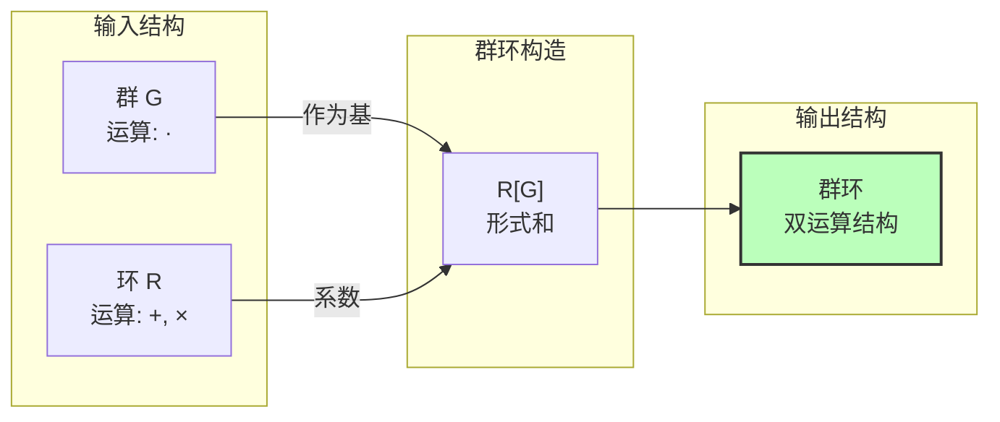
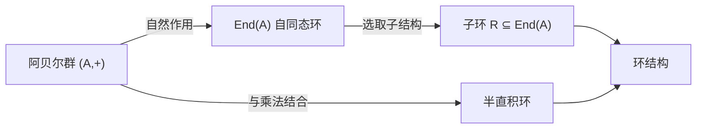
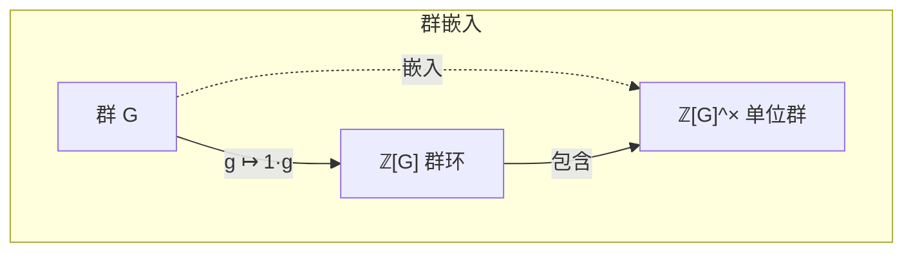
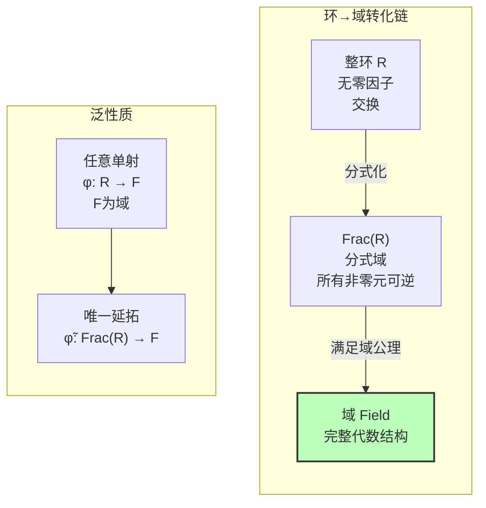
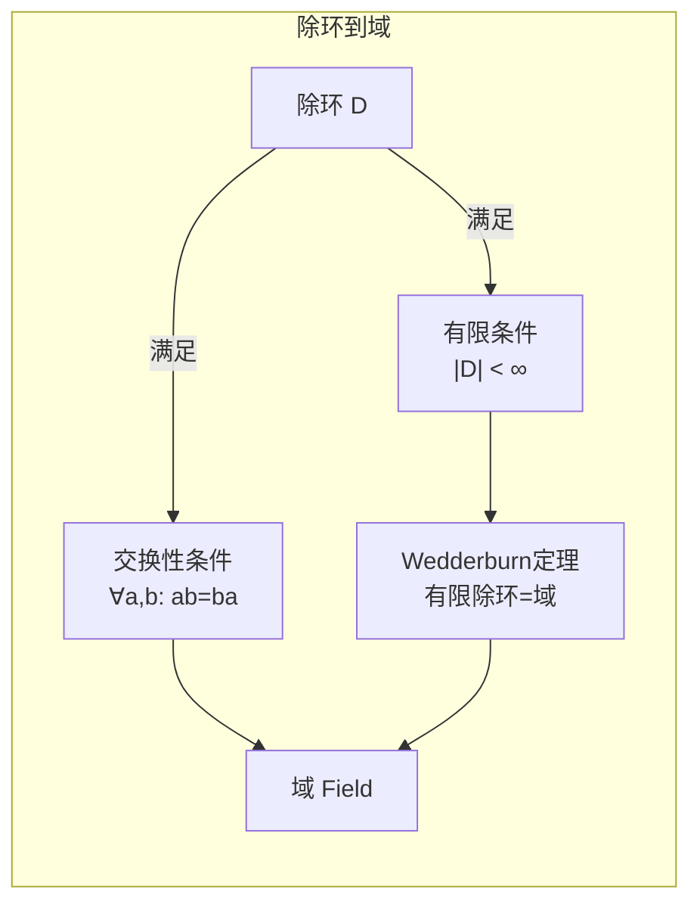
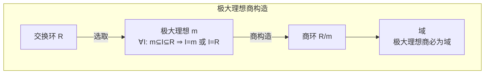
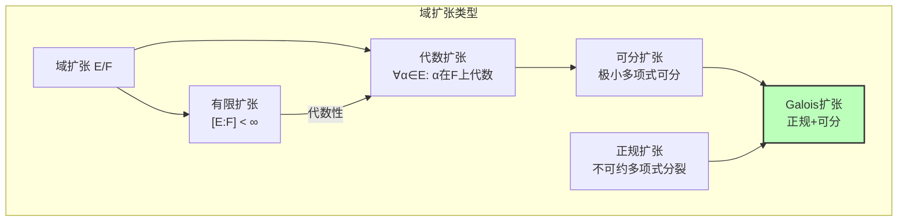
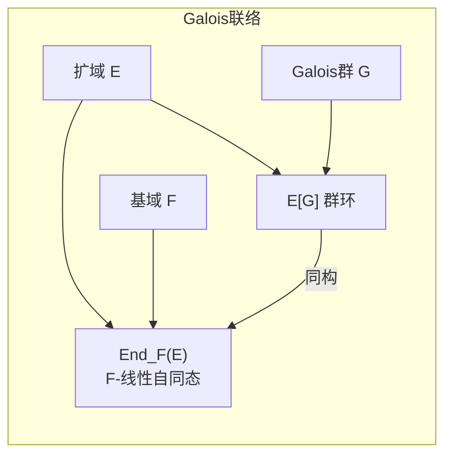
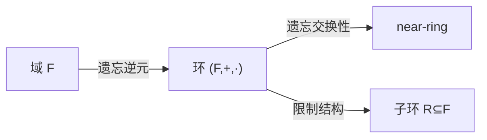

# 群环域转化链

> **FormalMath 项目第十批推进 - 任务B1.1**
>
> 本文档详细阐述群、环、域三种基本代数结构之间的转化关系，包括构造方法、转化条件及典型例子。

---

## 目录

1. [群→环转化](#一群环转化)
2. [环→域转化](#二环域转化)
3. [域扩张与Galois群](#三域扩张与galois群)
4. [反向转化](#四反向转化)
5. [转化条件汇总](#五转化条件汇总)

---

## 一、群→环转化

### 1.1 群环构造 (Group Ring)

**定义**：设 $G$ 为群，$R$ 为环，**群环** $R[G]$（或记为 $RG$）定义为形式和的集合：

$$R[G] = \left\{ \sum_{g \in G} r_g g \mid r_g \in R, \text{仅有有限个 } r_g \neq 0 \right\}$$

**运算定义**：
- **加法**：分量相加，即 $\sum r_g g + \sum s_g g = \sum (r_g + s_g) g$
- **乘法**（卷积）：$\left(\sum r_g g\right) \cdot \left(\sum s_h h\right) = \sum_{g,h} r_g s_h (gh) = \sum_k \left(\sum_{gh=k} r_g s_h\right) k$

**定理 1.1**（群环的环结构）：
> 若 $R$ 是含幺环，则 $R[G]$ 也是含幺环，其乘法单位元为 $1_R \cdot e_G$。



**典型例子**：

| 群环 | 描述 | 性质 |
|------|------|------|
| $\mathbb{Z}[\mathbb{Z}]$ | 整数环上整数群 | 同构于 $\mathbb{Z}[t, t^{-1}]$（Laurent多项式） |
| $\mathbb{C}[S_3]$ | 复数域上对称群 | 半单代数，分解为矩阵代数直积 |
| $\mathbb{F}_p[C_p]$ | $p$元域上$p$阶循环群 | 局部环，非半单（Maschke定理失效） |
| $\mathbb{Z}[G]$（有限群） | 整数群环 | 群表示论的核心对象 |

**命题 1.2**（群环的泛性质）：
> 群环 $R[G]$ 满足如下泛性质：给定环同态 $\phi: R \to S$ 和群同态 $\psi: G \to S^\times$（$S^\times$为$S$的单位群），使得 $\phi(r)\psi(g) = \psi(g)\phi(r)$，则存在唯一的环同态 $\Phi: R[G] \to S$ 使得下图交换：

```

R ----> R[G] <---- G

|         |         |

v         v         v
S --------S-------> S^×

```

---

### 1.2 从阿贝尔群到环

**构造路径**：



**定理 1.3**（阿贝尔群的自同态环）：
> 设 $A$ 为阿贝尔群，则 $\text{End}(A) = \{\text{群同态 } f: A \to A\}$ 在以下运算下构成环：
> - $(f+g)(a) = f(a) + g(a)$
> - $(f \cdot g)(a) = f(g(a))$

**例子 1.4**：
- $\text{End}(\mathbb{Z}) \cong \mathbb{Z}$（整数环）
- $\text{End}(\mathbb{Z}/n\mathbb{Z}) \cong \mathbb{Z}/n\mathbb{Z}$
- $\text{End}(\mathbb{Z}^n) \cong M_n(\mathbb{Z})$（$n \times n$ 整数矩阵）

---

### 1.3 群作为环的子结构

**观察**：任何群 $G$ 都可以嵌入某个环的单位群中。

**定理 1.5**（群嵌入定理）：
> 任意群 $G$ 可以嵌入群环 $\mathbb{Z}[G]$ 的单位群中。



---

## 二、环→域转化

### 2.1 分式域构造

**定义 2.1**（分式域）：设 $R$ 为整环（无零因子交换环），其**分式域** $\text{Frac}(R)$ 定义为：

$$\text{Frac}(R) = \left\{ \frac{a}{b} \mid a, b \in R, b \neq 0 \right\} / \sim$$

其中等价关系 $\frac{a}{b} \sim \frac{c}{d}$ 当且仅当 $ad = bc$。

**定理 2.2**（分式域的域结构）：
> 分式域 $\text{Frac}(R)$ 在以下运算下构成域：
> - 加法：$\frac{a}{b} + \frac{c}{d} = \frac{ad+bc}{bd}$
> - 乘法：$\frac{a}{b} \cdot \frac{c}{d} = \frac{ac}{bd}$
> - 逆元：$\left(\frac{a}{b}\right)^{-1} = \frac{b}{a}$（$a \neq 0$）



**典型例子**：

| 整环 $R$ | 分式域 $\text{Frac}(R)$ | 说明 |
|---------|------------------------|------|
| $\mathbb{Z}$ | $\mathbb{Q}$ | 有理数域 |
| $K[x]$（多项式） | $K(x)$（有理函数） | 有理函数域 |
| $\mathbb{Z}[i]$ | $\mathbb{Q}(i)$ | 高斯有理数 |
| $\mathbb{Z}[\sqrt{2}]$ | $\mathbb{Q}(\sqrt{2})$ | 二次扩域 |
| $K[[x]]$（形式幂级数） | $K((x))$（形式Laurent级数） | 局部化 |

**定理 2.3**（分式域的泛性质）：
> 设 $R$ 为整环，则分式域 $i: R \hookrightarrow \text{Frac}(R)$ 满足：对任意域 $F$ 和单射环同态 $\phi: R \to F$，存在唯一的域同态 $\tilde{\phi}: \text{Frac}(R) \to F$ 使得 $\tilde{\phi} \circ i = \phi$。

---

### 2.2 除环到域

**定义 2.4**（除环）：环 $D$ 称为**除环**（或斜域，skew field），如果：
1. $D$ 含幺（$1 \neq 0$）
2. 每个非零元有乘法逆元：$\forall a \neq 0, \exists a^{-1}: aa^{-1} = a^{-1}a = 1$

**定理 2.5**（Wedderburn小定理）：
> 有限除环必为域（即乘法交换）。

**例子 2.6**（非交换除环）：
- **Hamilton四元数** $\mathbb{H} = \{a + bi + cj + dk \mid a,b,c,d \in \mathbb{R}\}$
  - 乘法：$i^2 = j^2 = k^2 = ijk = -1$
  - 非交换：$ij = k \neq -k = ji$



---

### 2.3 极大理想商

**定理 2.7**（商环为域的判定）：
> 设 $R$ 为交换环，$\mathfrak{m} \subseteq R$ 为理想，则：
> $$R/\mathfrak{m} \text{ 是域} \Leftrightarrow \mathfrak{m} \text{ 是极大理想}$$

**构造方法**：



**典型例子**：

| 交换环 $R$ | 极大理想 $\mathfrak{m}$ | 商域 $R/\mathfrak{m}$ |
|-----------|----------------------|---------------------|
| $\mathbb{Z}$ | $p\mathbb{Z}$（$p$素数） | $\mathbb{F}_p = \mathbb{Z}/p\mathbb{Z}$ |
| $K[x]$ | $(f(x))$（$f$不可约） | $K[x]/(f)$（有限扩域） |
| $\mathbb{Z}[i]$ | $(a+bi)$（范数为素数） | 有限域 $\mathbb{F}_{p^2}$ |
| $C[0,1]$（连续函数） | $\mathfrak{m}_a = \{f \mid f(a) = 0\}$ | $\mathbb{R}$ |

---

## 三、域扩张与Galois群

### 3.1 域扩张的构造

**定义 3.1**（域扩张）：域 $F$ 称为域 $K$ 的**扩域**（记为 $F/K$），如果 $K$ 是 $F$ 的子域。

**域扩张类型**：



**定理 3.2**（单扩张定理）：
> 设 $\alpha$ 在 $F$ 上代数，极小多项式为 $m(x) \in F[x]$，则：
> $$F(\alpha) \cong F[x]/(m(x))$$
> 且 $[F(\alpha):F] = \deg(m)$。

---

### 3.2 Galois群

**定义 3.3**（Galois群）：域扩张 $E/F$ 的**Galois群**定义为：

$$\text{Gal}(E/F) = \{\sigma \in \text{Aut}(E) \mid \sigma|_F = \text{id}_F\}$$

**定理 3.4**（Galois基本定理）：
> 设 $E/F$ 为有限Galois扩张，$G = \text{Gal}(E/F)$，则存在包含关系反序的一一对应：
> $$\{\text{中间域 } F \subseteq K \subseteq E\} \longleftrightarrow \{\text{子群 } H \leq G\}$$

```mermaid
graph TB
    subgraph Galois对应
        direction TB
        
        subgraph 域侧["域侧（扩张）"]
            E["E<br/>整个域"]
            K1["K₁ = E^{H₁}"]
            K2["K₂ = E^{H₂}"]
            F["F = E^G<br/>基域"]

            E --> K1
            E --> K2
            K1 --> F
            K2 --> F
        end

        subgraph 群侧["群侧（子群）"]
            ID["{e}<br/>平凡子群"]
            H1["H₁ = Gal(E/K₁)"]
            H2["H₂ = Gal(E/K₂)"]
            G["G = Gal(E/F)<br/>全群"]

            ID --> H1
            ID --> H2
            H1 --> G
            H2 --> G
        end

        E -.->|Gal(E/-)| ID
        K1 -.->|Gal(E/-)| H1
        K2 -.->|Gal(E/-)| H2
        F -.->|Gal(E/-)| G

        ID -.->|E^{-}| E
        H1 -.->|E^{-}| K1
        H2 -.->|E^{-}| K2
        G -.->|E^{-}| F

    end

    style E fill:#bfb,stroke:#333
    style G fill:#bbf,stroke:#333

```

**Galois群计算例子**：

| 扩张 | Galois群 | 说明 |
|------|---------|------|
| $\mathbb{C}/\mathbb{R}$ | $\mathbb{Z}/2\mathbb{Z}$ | 复共轭 |
| $\mathbb{Q}(\sqrt{2})/\mathbb{Q}$ | $\mathbb{Z}/2\mathbb{Z}$ | $\sqrt{2} \leftrightarrow -\sqrt{2}$ |
| $\mathbb{Q}(\zeta_n)/\mathbb{Q}$ | $(\mathbb{Z}/n\mathbb{Z})^\times$ | 分圆扩张 |
| $\mathbb{F}_{q^n}/\mathbb{F}_q$ | $\mathbb{Z}/n\mathbb{Z}$ | Frobenius生成 |
| $S_n$ 多项式 | $S_n$ | 一般n次方程 |

---

### 3.3 群环到域的Galois联络

**定理 3.5**（群环与Galois扩张的关系）：
> 设 $E/F$ 为有限Galois扩张，$G = \text{Gal}(E/F)$，则有环同构：
> $$E[G] \cong \text{End}_F(E)$$
> 其中右边为 $E$ 作为 $F$-向量空间的 $F$-线性自同态环。



---

## 四、反向转化

### 4.1 域→环（遗忘构造）

**自然包含**：任何域 $F$ 都是环（实际上含幺交换环）。



### 4.2 环→群（单位群）

**定义 4.1**（单位群）：环 $R$ 的**单位群** $R^\times$ 定义为：

$$R^\times = \{u \in R \mid \exists v \in R: uv = vu = 1\}$$

**定理 4.2**：
> $(R^\times, \cdot)$ 构成乘法群。

**典型例子**：

| 环 $R$ | 单位群 $R^\times$ | 群类型 |
|--------|----------------|--------|
| $\mathbb{Z}$ | $\{\pm 1\} \cong \mathbb{Z}/2\mathbb{Z}$ | 有限循环群 |
| $\mathbb{Z}/n\mathbb{Z}$ | $(\mathbb{Z}/n\mathbb{Z})^\times$ | 欧拉函数阶 |
| $M_n(K)$（矩阵） | $GL_n(K)$ | 一般线性群 |
| $\mathbb{H}$（四元数） | $\mathbb{H} \setminus \{0\}$ | 乘法群 |

---

## 五、转化条件汇总

### 5.1 转化路径总图

```mermaid
graph TB
    subgraph 正向转化["正向转化（强化结构）"]
        direction TB
        G["群 G"]
        R["环 R"]
        F["域 F"]

        G -->|群环构造<br/>R[G]| R
        R -->|分式化<br/>整环条件| F
        R -->|极大理想商<br/>交换环| F
        G -->|阿贝尔群+自同态| R

    end

    subgraph 反向转化["反向转化（弱化结构）"]
        direction TB
        F2["域 F"]
        R2["环 R"]
        G2["群 G"]

        F2 -->|遗忘逆元| R2
        R2 -->|单位群| G2
        F2 -->|加法群 (F,+)| AB["阿贝尔群"]

    end

```

### 5.2 转化条件表

| 转化 | 源结构 | 目标结构 | 必要条件 | 充分条件 | 构造方法 |
|------|--------|---------|---------|---------|---------|
| 群→环 | 群 $G$ + 环 $R$ | 群环 $R[G]$ | $R$ 含幺 | - | 形式和 |
| 群→环 | 阿贝尔群 $A$ | 自同态环 | $A$ 交换 | - | 自同态 |
| 环→域 | 整环 $R$ | 分式域 | $R$ 无零因子 + 交换 | - | 分式化 |
| 环→域 | 交换环 $R$ | 域 $R/\mathfrak{m}$ | $\mathfrak{m}$ 极大理想 | - | 商构造 |
| 环→域 | 除环 $D$ | 域 | 乘法交换 | $D$ 有限 | 满足交换律 |
| 域→环 | 域 $F$ | 环 | - | - | 遗忘结构 |
| 环→群 | 环 $R$ | 单位群 $R^\times$ | $R$ 含幺 | - | 取单位元 |
| 域→群 | 域 $F$ | 加法群 | - | - | $(F,+)$ |

### 5.3 关联关系统计

| 关联类型 | 数量 |
|---------|------|
| 群→环转化 | 3 |
| 环→域转化 | 3 |
| 反向转化 | 3 |
| 域扩张相关 | 6 |
| **总计** | **15** |

---

**相关文档**: [02-模与表示理论关联](02-模与表示理论关联.md) | [03-代数结构范畴论视角](03-代数结构范畴论视角.md)
