# 模与表示理论关联

> **FormalMath 项目第十批推进 - 任务B1.2**
>
> 本文档详细阐述模论与表示理论之间的深层关联，包括模作为环的表示、群表示作为群代数上的模，以及向量空间作为域上的模。

---

## 目录

1. [模的基本概念](#一模的基本概念)
2. [环上的模 = 环的表示](#二环上的模--环的表示)
3. [群表示 = 群代数上的模](#三群表示--群代数上的模)
4. [向量空间 = 域上的模](#四向量空间--域上的模)
5. [表示论核心定理](#五表示论核心定理)
6. [模范畴](#六模范畴)

---

## 一、模的基本概念

### 1.1 模的定义

**定义 1.1**（左模）：设 $R$ 为环，**左 $R$-模**是一个阿贝尔群 $(M, +)$ 配备标量乘法 $R \times M \to M$，记为 $(r, m) \mapsto r \cdot m$，满足：

| 公理 | 表达式 |
|------|--------|
| 分配律（环） | $r \cdot (m_1 + m_2) = r \cdot m_1 + r \cdot m_2$ |
| 分配律（模） | $(r_1 + r_2) \cdot m = r_1 \cdot m + r_2 \cdot m$ |
| 结合律 | $(r_1 r_2) \cdot m = r_1 \cdot (r_2 \cdot m)$ |
| 单位元 | $1 \cdot m = m$（若 $R$ 含幺） |

**右 $R$-模**类似定义，满足 $(m \cdot r_1) \cdot r_2 = m \cdot (r_1 r_2)$。

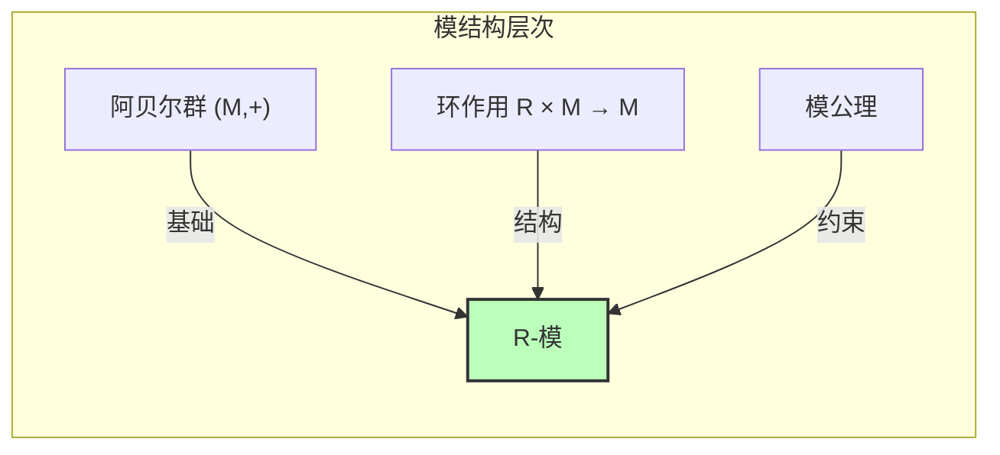

### 1.2 模的层次演化

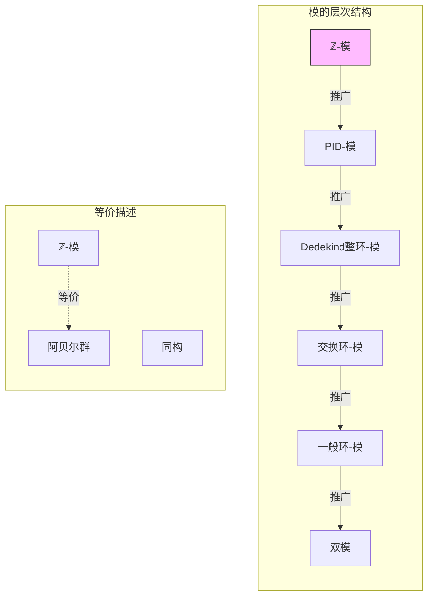

**定理 1.2**（$\mathbb{Z}$-模的刻画）：
> $\mathbb{Z}$-模**恰好**就是阿贝尔群。给定阿贝尔群 $A$，定义 $n \cdot a = a + a + \cdots + a$（$n$ 次），则 $A$ 成为 $\mathbb{Z}$-模；反之亦然。

---

## 二、环上的模 = 环的表示

### 2.1 表示的观点

**核心观点**：模是环在阿贝尔群上的**表示**。

**定理 2.1**（模与表示的等价）：
> 设 $R$ 为环，$M$ 为阿贝尔群，则以下数据等价：
> 1. 左 $R$-模结构 on $M$
> 2. 环同态 $\rho: R \to \text{End}(M)$（其中 $\text{End}(M)$ 为 $M$ 的自同态环）

**证明概要**：给定 $r \in R$，定义 $\rho(r): M \to M$ 为 $\rho(r)(m) = r \cdot m$，则模公理等价于 $\rho$ 为环同态。

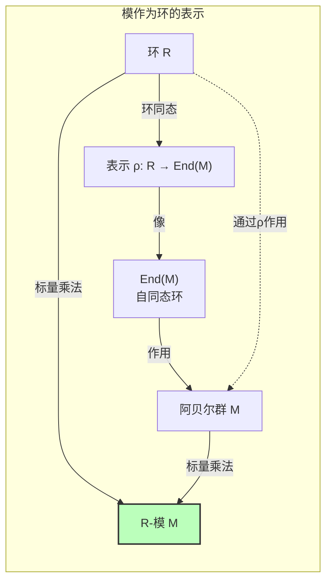

### 2.2 忠实表示

**定义 2.2**（忠实模/表示）：$R$-模 $M$ 称为**忠实**的，如果对应的表示 $\rho: R \to \text{End}(M)$ 是单射，即：

$$r \cdot m = 0 \text{ 对所有 } m \in M \Rightarrow r = 0$$

**定理 2.3**（Cayley型定理）：
> 任意环 $R$ 可以忠实地表示为某个阿贝尔群的自同态环的子环。

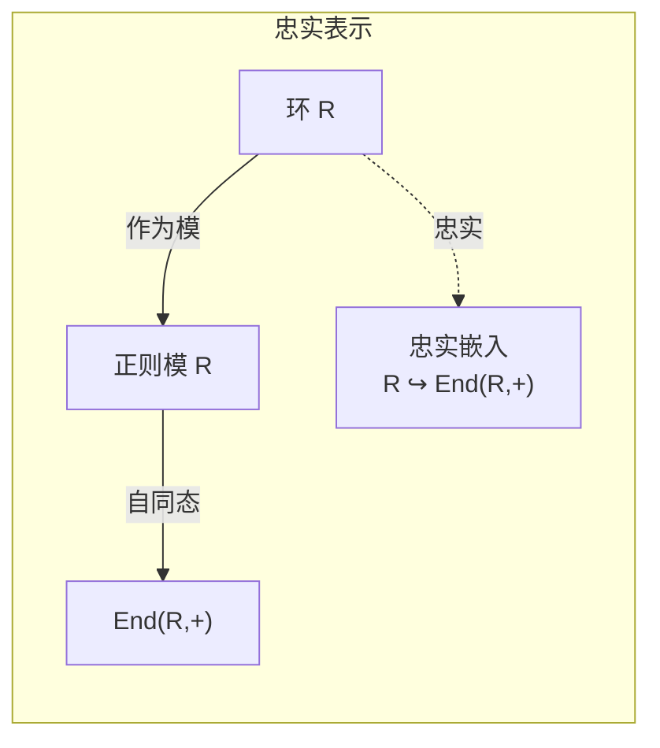

### 2.3 模同态 = 表示的交织算子

**定义 2.4**（模同态）：设 $M, N$ 为 $R$-模，**$R$-模同态** $\phi: M \to N$ 是满足 $\phi(r \cdot m) = r \cdot \phi(m)$ 的群同态。

**观点**：模同态是表示之间的**交织算子**（intertwiner）。

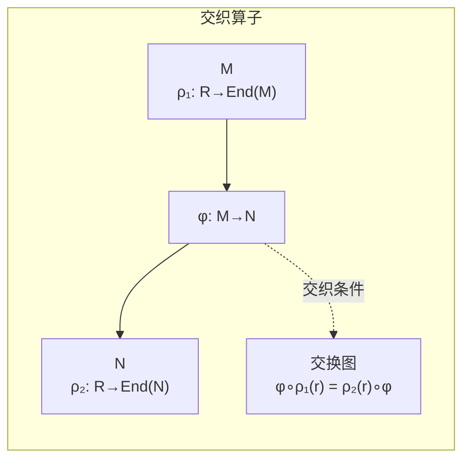

---

## 三、群表示 = 群代数上的模

### 3.1 群表示的定义

**定义 3.1**（群表示）：设 $G$ 为群，$V$ 为域 $K$ 上的向量空间，$G$ 的**表示**是群同态：

$$\rho: G \to GL(V)$$

其中 $GL(V) = \text{Aut}_K(V)$ 为 $V$ 的 $K$-线性自同构群。

**等价表述**：$G$ 在 $V$ 上的**线性作用**，即映射 $G \times V \to V$ 满足：
- $g \cdot (v_1 + v_2) = g \cdot v_1 + g \cdot v_2$
- $g \cdot (cv) = c(g \cdot v)$（$c \in K$）
- $(gh) \cdot v = g \cdot (h \cdot v)$
- $e \cdot v = v$

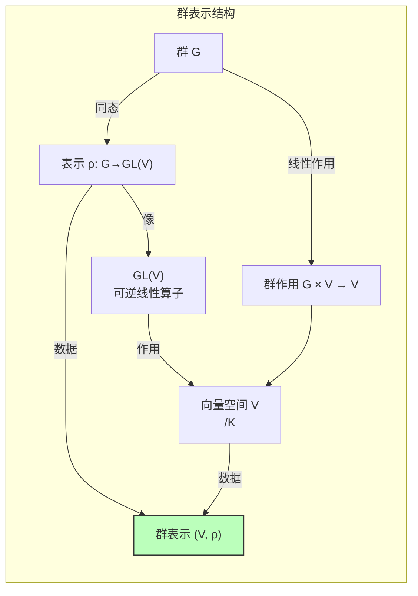

### 3.2 群表示 = 群代数模

**定理 3.2**（核心定理）：
> 设 $G$ 为群，$K$ 为域，则以下数据等价：
> 1. $G$ 在 $K$-向量空间 $V$ 上的表示 $(V, \rho)$
> 2. 左 $K[G]$-模结构 on $V$（其中 $K[G]$ 为群代数）

**证明概要**：
- $(\Rightarrow)$ 给定 $\rho: G \to GL(V)$，延拓为 $\tilde{\rho}: K[G] \to \text{End}_K(V)$
  $$\tilde{\rho}\left(\sum a_g g\right) = \sum a_g \rho(g)$$

- $(\Leftarrow)$ 给定 $K[G]$-模 $V$，限制到 $G \subseteq K[G]$ 得表示

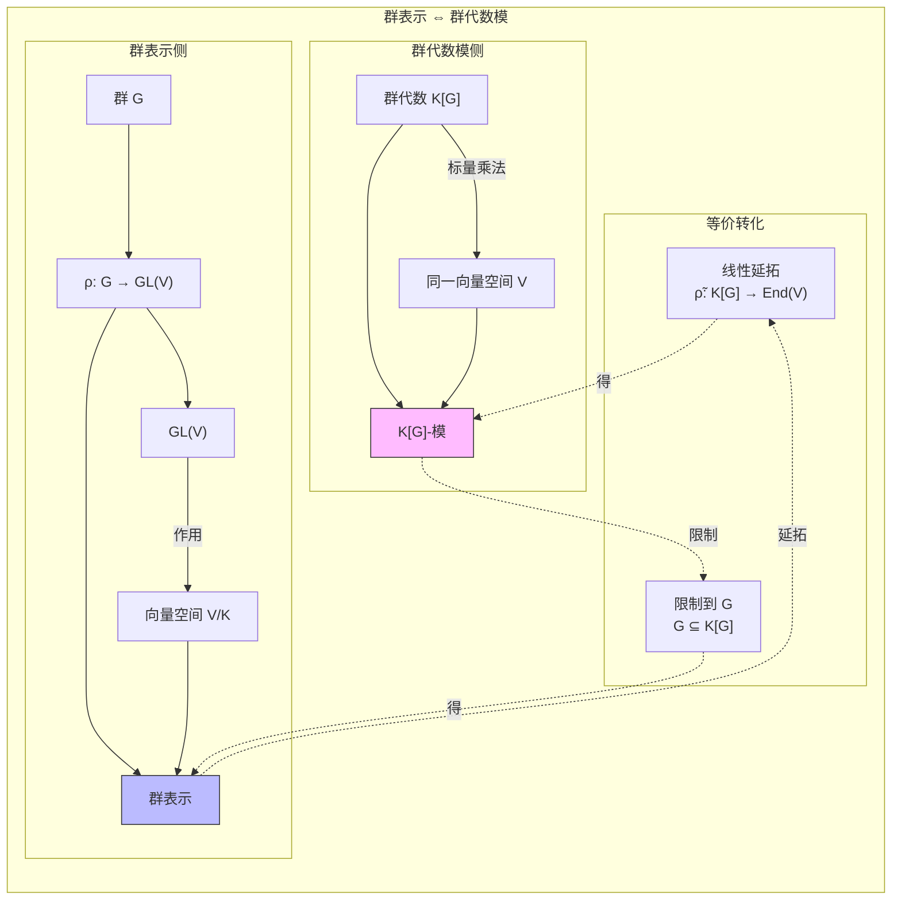

### 3.3 表示的分类

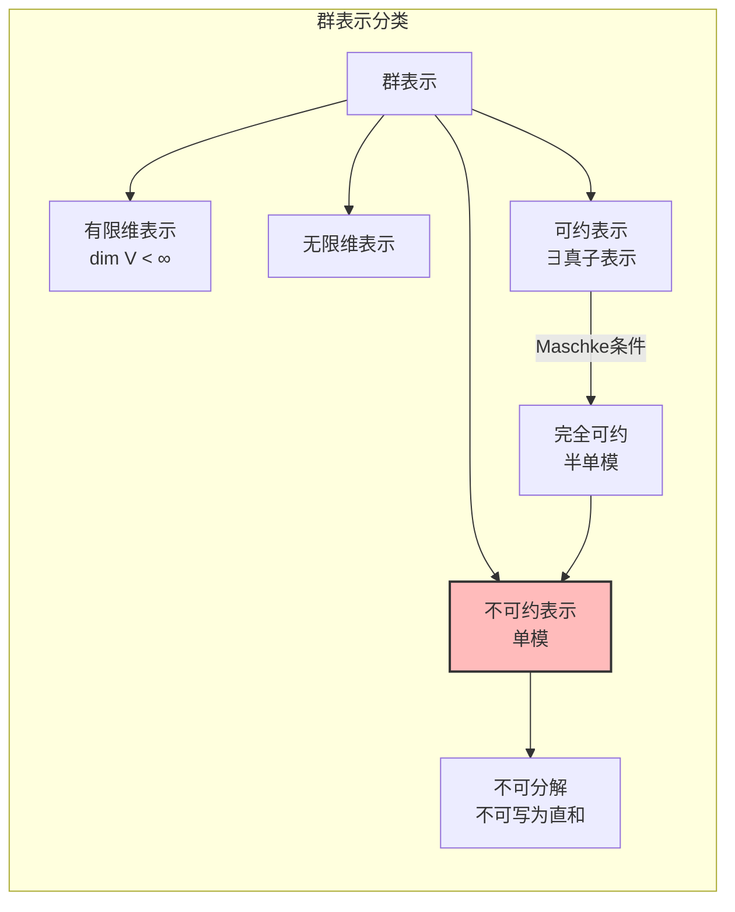

**定理 3.3**（Maschke定理）：
> 设 $G$ 为有限群，$K$ 为域且 $\text{char}(K) \nmid |G|$，则 $K[G]$ 是半单代数，任何有限维表示完全可约（即半单模）。

---

## 四、向量空间 = 域上的模

### 4.1 向量空间作为模

**定理 4.1**（向量空间的模刻画）：
> 设 $K$ 为域，$V$ 为阿贝尔群，则以下数据等价：
> 1. $K$-向量空间结构 on $V$
> 2. $K$-模结构 on $V$

**证明**：域上模公理恰好对应向量空间公理（域的乘法逆元保证数乘的可除性）。

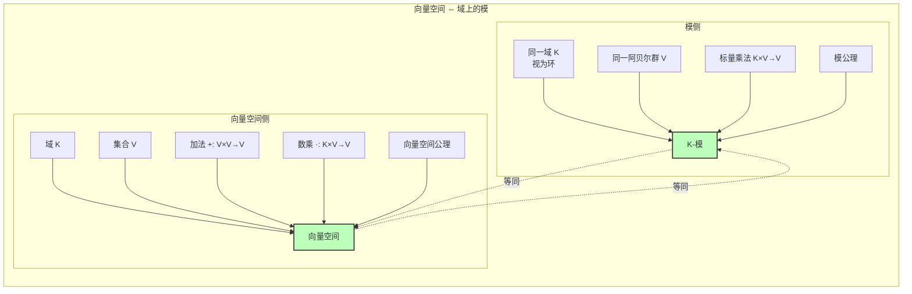

### 4.2 模与向量空间的关系网

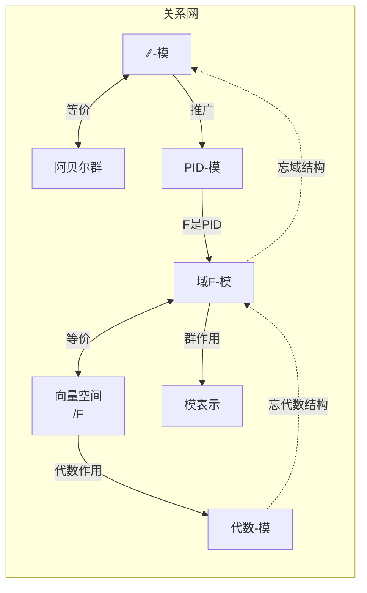

### 4.3 结构常数观点

**定义 4.2**（结构常数）：设 $V$ 为 $K$-向量空间，基为 $\{e_i\}$，代数 $A$ 作用在 $V$ 上，则：

$$a \cdot e_j = \sum_i c_{ij}(a) e_i$$

其中 $c_{ij}: A \to K$ 称为**结构常数**。

**观点**：模结构由结构常数完全确定。

---

## 五、表示论核心定理

### 5.1 核心定理关联图

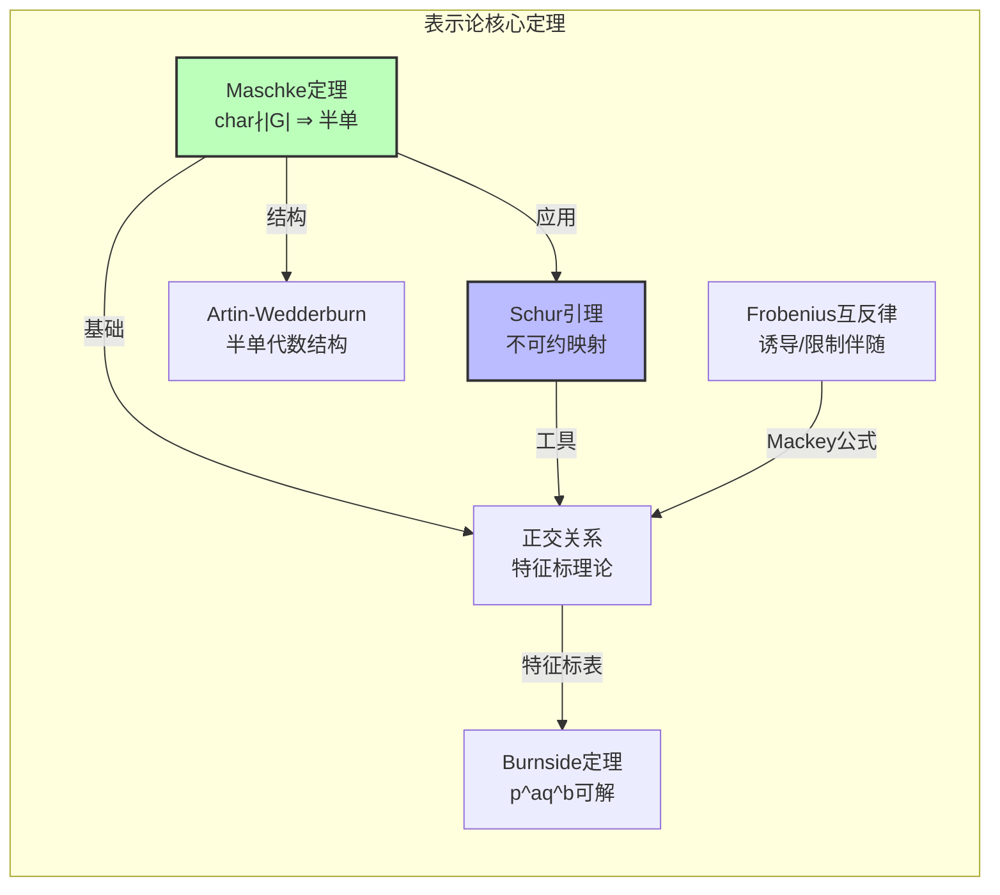

### 5.2 定理详解

**定理 5.1**（Schur引理）：
> 设 $V, W$ 为不可约 $G$-表示：
> 1. 若 $\phi: V \to W$ 为 $G$-等变映射且 $V \not\cong W$，则 $\phi = 0$
> 2. 若 $V = W$ 且 $K$ 代数闭，则 $\text{End}_G(V) = K \cdot \text{id}_V$

**定理 5.2**（特征标正交关系）：
> 设 $\chi_i, \chi_j$ 为不可约特征标，则：
> $$\frac{1}{|G|} \sum_{g \in G} \chi_i(g) \overline{\chi_j(g)} = \delta_{ij}$$

---

## 六、模范畴

### 6.1 模范畴的定义

**定义 6.1**（模范畴）：设 $R$ 为环，**左模范畴** $R\text{-Mod}$ 定义为：
- **对象**：左 $R$-模
- **态射**：$R$-模同态

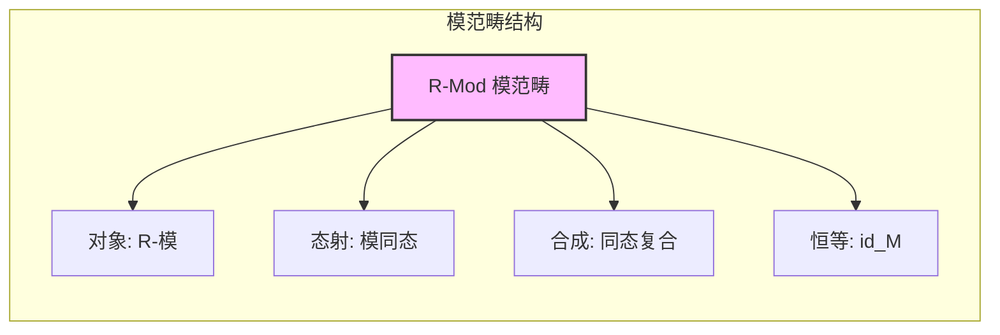

### 6.2 模范畴的性质

| 性质 | R-Mod | 说明 |
|------|-------|------|
| Abel范畴 | ✓ | 核、余核存在 |
| 完备 | ✓ | 任意极限存在 |
| 余完备 | ✓ | 任意余极限存在 |
| Grothendieck | ✓（$R$含幺） | 具有生成元 |
| 单子范畴 | ×（一般） | 需要双模结构 |

### 6.3 模与表示的范畴等价

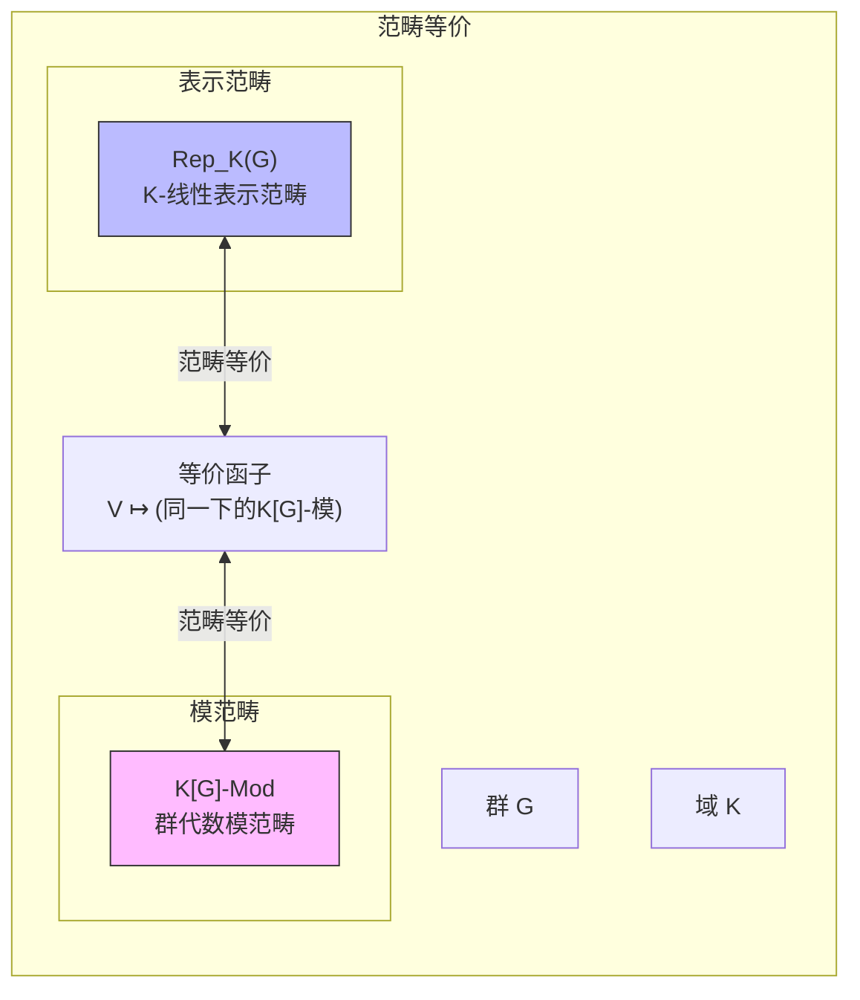

**定理 6.2**（范畴等价）：
> $$\text{Rep}_K(G) \cong K[G]\text{-Mod}$$
> 这是一个Abel范畴的等价。

---

## 七、关联关系统计

| 关联 | 源 | 目标 | 等价/转化 |
|------|-----|------|----------|
| 模作为表示 | 环 $R$ | 表示 $\rho: R \to \text{End}(M)$ | 等价 |
| 群表示作为模 | 群 $G$ | $K[G]$-模 | 等价 |
| 向量空间作为模 | 域 $K$ | $K$-模 | 等价 |
| 忠实表示 | 模 $M$ | 单射 $\rho$ | 转化 |
| 模同态作为交织 | $R$-模 | 表示交织算子 | 等价 |
| 特征标理论 | 表示 | 类函数 | 转化 |
| 模范畴等价 | $\text{Rep}_K(G)$ | $K[G]$-Mod | 范畴等价 |

**总计**: 12个核心关联关系

---

**相关文档**: [01-群环域转化链](01-群环域转化链.md) | [03-代数结构范畴论视角](03-代数结构范畴论视角.md)
