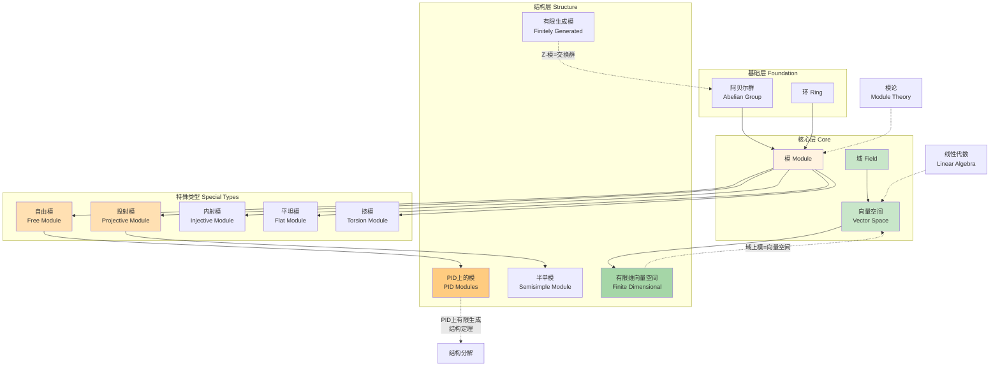
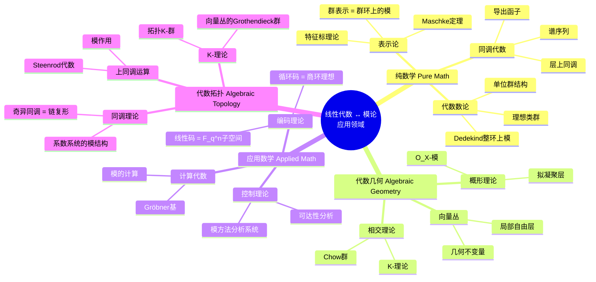

# 线性代数↔模论关联网络 - 理论模型关联网络

## 概述

线性代数是研究向量空间和线性映射的学科，而模论则是线性代数在环上的推广。当标量从域推广到一般环时，向量空间就变成了模，线性映射就变成了模同态。这种推广揭示了线性代数的本质结构，同时为研究更广泛的代数对象提供了统一框架。本文档系统阐述线性代数与模论之间的深刻联系。

---

## 一、线性代数的独立结构

### 1.1 向量空间定义

**定义 1.1**（向量空间）
设 $F$ 是域，向量空间（$F$-向量空间）是集合 $V$ 配备两种运算：

- 加法：$+: V \times V \to V$，使 $(V, +)$ 成为阿贝尔群
- 数乘：$\cdot: F \times V \to V$，满足：
  1. $a \cdot (v + w) = a \cdot v + a \cdot w$（分配律）
  2. $(a + b) \cdot v = a \cdot v + b \cdot v$（分配律）
  3. $(ab) \cdot v = a \cdot (b \cdot v)$（结合律）
  4. $1 \cdot v = v$（单位元）

**关键性质**：

- 每个向量空间都有基（选择公理）
- 维数 $dim_F(V)$ 是良定义的基数
- 有限维向量空间同构于 $F^n$

### 1.2 线性映射

**定义 1.2**（线性映射）
设 $V, W$ 是 $F$-向量空间，映射 $T: V \to W$ 是线性的，如果：
$$T(av + bw) = aT(v) + bT(w), \quad \forall a, b \in F, v, w \in V$$

**核心结构**：

| 概念 | 定义 | 性质 |
|------|------|------|
| 核 | $\ker(T) = \{v \in V : T(v) = 0\}$ | $V$ 的子空间 |
| 像 | $\text{Im}(T) = \{T(v) : v \in V\}$ | $W$ 的子空间 |
| 秩 | $\text{rank}(T) = \dim(\text{Im}(T))$ | 有限维时良定义 |
| 零化度 | $\text{nullity}(T) = \dim(\ker(T))$ | 维数公式关联 |

**维数公式**：$\dim(V) = \dim(\ker(T)) + \dim(\text{Im}(T))$

### 1.3 矩阵表示

**定理 1.1**（矩阵表示定理）
设 $V, W$ 是有限维向量空间，$\dim(V) = n$，$\dim(W) = m$，选定基后：
$$\text{Hom}_F(V, W) \cong M_{m \times n}(F)$$

**基变换**：若 $P, Q$ 是过渡矩阵，则 $[T]'_{\mathcal{B}'} = Q^{-1}[T]_{\mathcal{B}}P$

**等价标准形**：对任意矩阵 $A \in M_{m \times n}(F)$，存在可逆矩阵 $P, Q$ 使得：
$$PAQ = \begin{pmatrix} I_r & 0 \\ 0 & 0 \end{pmatrix}$$
其中 $r = \text{rank}(A)$。

### 1.4 核心定理

**定理 1.2**（秩-零化度定理）
对线性映射 $T: V \to W$，$\dim(V) < \infty$：
$$\dim(V) = \dim(\ker(T)) + \dim(\text{Im}(T))$$

**定理 1.3**（谱定理）
设 $T: V \to V$ 是有限维复内积空间上的正规算子，则存在标准正交基使 $T$ 对角化。

**定理 1.4**（Jordan标准形）
代数闭域上，任意方阵相似于唯一的（不计Jordan块顺序）Jordan形矩阵。

### 1.5 典型例子

| 向量空间 | 域 | 维数 | 基 |
|----------|-----|------|-----|
| $F^n$ | 任意 $F$ | $n$ | 标准基 $e_1, \ldots, e_n$ |
| $M_{m \times n}(F)$ | 任意 $F$ | $mn$ | 矩阵单位 $E_{ij}$ |
| $F[x]_{\leq n}$ | 任意 $F$ | $n+1$ | $1, x, \ldots, x^n$ |
| $C([0,1], \mathbb{R})$ | $\mathbb{R}$ | 无限 | 无有限基 |
| $\ell^2$ | $\mathbb{R}$ 或 $\mathbb{C}$ | 无限（可数） | $e_n = (0,\ldots,1,\ldots)$ |
| 解空间（常微分方程） | $\mathbb{R}$ | 有限 | 基本解组 |

---

## 二、模论的独立结构

### 2.1 模的定义

**定义 2.1**（模）
设 $R$ 是环，左 $R$-模是阿贝尔群 $(M, +)$ 配备标量乘法 $R \times M \to M$，满足：

1. $r \cdot (m_1 + m_2) = r \cdot m_1 + r \cdot m_2$
2. $(r_1 + r_2) \cdot m = r_1 \cdot m + r_2 \cdot m$
3. $(r_1 r_2) \cdot m = r_1 \cdot (r_2 \cdot m)$
4. $1 \cdot m = m$（若 $R$ 含幺）

**关键区别**：当 $R$ 不是域时：

- 模可能没有基（自由模例外）
- 子模不一定有补子模
- 模同态不一定由矩阵表示

### 2.2 模的分类

| 类型 | 定义 | 特征 |
|------|------|------|
| 自由模 | 有基的模 | $M \cong R^{(I)}$（直和） |
| 有限生成模 | 由有限集生成 | $M = Rm_1 + \cdots + Rm_n$ |
| 投射模 | 自由模的直和项 | $P \oplus Q$ 自由 |
| 内射模 | 对偶概念 | 提升性质 |
| 平坦模 | 张量积正合 | Tor函子消失 |
| 挠模 | 每个元被零化 | 无自由部分 |
| 无挠模 | 无零因子零化 | $rm = 0 \Rightarrow r=0$ 或 $m=0$ |

### 2.3 模同态

**定义 2.2**（模同态）
设 $M, N$ 是 $R$-模，$f: M \to N$ 是同态，如果：
$$f(rm + m') = rf(m) + f(m')$$

**同态基本定理**：
$$M/\ker(f) \cong \text{Im}(f)$$

**特殊模同态**：

- 自同态环：$\text{End}_R(M)$ 是 $R$-代数
- 对偶模：$M^* = \text{Hom}_R(M, R)$
- 双对偶：$M \to M^{**}$

### 2.4 核心定理

**定理 2.1**（有限生成交换群结构定理）
若 $M$ 是有限生成 $\mathbb{Z}$-模，则：
$$M \cong \mathbb{Z}^r \oplus \mathbb{Z}/d_1\mathbb{Z} \oplus \cdots \oplus \mathbb{Z}/d_k\mathbb{Z}$$
其中 $d_1 | d_2 | \cdots | d_k$。

**定理 2.2**（主理想整环上有限生成模结构定理）
若 $R$ 是PID，$M$ 有限生成 $R$-模，则：
$$M \cong R^r \oplus R/(p_1^{e_1}) \oplus \cdots \oplus R/(p_k^{e_k})$$

**定理 2.3**（投射模的等价刻画）
对 $R$-模 $P$，以下等价：

1. $P$ 是投射模
2. $\text{Hom}_R(P, -)$ 是正合函子
3. 任意满同态 $M \to P$ 分裂
4. $P$ 是某自由模的直和项

### 2.5 典型例子

| 模 | 环 | 类型 | 性质 |
|----|-----|------|------|
| $R^n$ | 任意 $R$ | 自由模 | 标准例子 |
| $\mathbb{Z}/n\mathbb{Z}$ | $\mathbb{Z}$ | 挠模 | 有限生成 |
| $\mathbb{Q}$ | $\mathbb{Z}$ | 可除模 | 非有限生成 |
| $\mathbb{Q}/\mathbb{Z}$ | $\mathbb{Z}$ | 挠模 | 内射模 |
| $k[x]$-模（$V, T$） | $k[x]$ | 挠模 | Jordan标准形理论 |
| $\mathbb{Z}[i]$ | $\mathbb{Z}$ | 自由模（秩2） | 作为 $\mathbb{Z}$-模 |

---

## 三、向量空间作为域上的模

### 3.1 核心等价

**定理 3.1**（线性代数=域上的模论）
设 $F$ 是域，则：

- $F$-向量空间 $\Leftrightarrow$ $F$-模
- 线性映射 $\Leftrightarrow$ 模同态
- 子空间 $\Leftrightarrow$ 子模

**证明概要**：
域 $F$ 的非零元都可逆，因此对 $F$-模 $V$：

- 若 $fv = 0$ 且 $f \neq 0$，则 $v = f^{-1}fv = 0$
- 所以 $V$ 是无挠模
- 域上所有模都是自由模（有基）

### 3.2 结构定理的对应

| 线性代数（$F$ 是域） | 模论（$R$ 是一般环） | 说明 |
|---------------------|---------------------|------|
| 所有向量空间都自由 | 自由模是特殊类 | 域的特殊性质 |
| 维数唯一确定 | 秩不唯一（一般环） | PID上有结构定理 |
| 子空间总有补 | 子模不一定有补 | 半单环等价条件 |
| 线性映射=矩阵 | 模同态更复杂 | 自由模上用矩阵 |
| 线性泛函完全刻画 | 对偶可能退化 | 自反模概念 |
| 双对偶自然同构 | $M \to M^{**}$ 非单 | 投射模性质 |

### 3.3 有限维情形的完全对应

**定理 3.2**（有限维对应）
设 $F$ 是域，$\dim(V) = n$，则：

| 线性代数结构 | 模论语境 | 同构关系 |
|-------------|----------|----------|
| $V$ | $F^n$ 作为 $F$-模 | $V \cong F^n$ |
| $\text{End}(V)$ | $M_n(F)$ 作为 $F$-代数 | $\text{End}_F(V) \cong M_n(F)$ |
| $V^*$ | $\text{Hom}_F(V, F)$ | $(F^n)^* \cong F^n$ |
| $V \otimes W$ | 张量积模 | $\dim(V \otimes W) = \dim(V) \cdot \dim(W)$ |
| $V \oplus W$ | 直和模 | $\dim(V \oplus W) = \dim(V) + \dim(W)$ |

---

## 四、线性映射与模同态

### 4.1 函子视角

**定义 4.1**（Hom函子）
设 $R$ 是环，$M$ 是 $R$-模：

- $\text{Hom}_R(M, -): R\text{-Mod} \to \mathbf{Ab}$ 是左正合协变函子
- $\text{Hom}_R(-, M): R\text{-Mod}^{\text{op}} \to \mathbf{Ab}$ 是左正合逆变函子

**当 $R = F$ 是域时**：

- $\text{Hom}_F(V, W) \cong W^n$（若 $\dim(V) = n$）
- 维数：$\dim(\text{Hom}_F(V, W)) = \dim(V) \cdot \dim(W)$

### 4.2 矩阵表示的推广

**定理 4.1**（自由模上的矩阵）
设 $M \cong R^m$，$N \cong R^n$ 是自由 $R$-模，则：
$$\text{Hom}_R(M, N) \cong M_{n \times m}(R)$$

**限制**：

- 仅对自由模有效
- 需要选定基
- 基变换公式与线性代数相同

### 4.3 正合序列

**定义 4.2**（正合序列）
模同态序列 $\cdots \to M_{i-1} \xrightarrow{f_{i-1}} M_i \xrightarrow{f_i} M_{i+1} \to \cdots$ 在 $M_i$ 处正合，如果 $\text{Im}(f_{i-1}) = \ker(f_i)$。

**短正合序列**：$0 \to A \xrightarrow{f} B \xrightarrow{g} C \to 0$

- $f$ 单射
- $g$ 满射
- $\text{Im}(f) = \ker(g)$

**分裂**：若存在 $s: C \to B$ 使 $g \circ s = \text{id}_C$，则 $B \cong A \oplus C$。

**线性代数特例**：$0 \to \ker(T) \hookrightarrow V \xrightarrow{T} \text{Im}(T) \to 0$ 总是分裂（向量空间有补）。

---

## 五、矩阵表示的函子视角

### 5.1 矩阵作为自然变换

**定理 5.1**（矩阵范畴等价）
设 $F$ 是域，矩阵范畴 $\mathbf{Mat}_F$ 定义：

- 对象：自然数 $n \in \mathbb{N}$
- 态射：$\text{Hom}(m, n) = M_{n \times m}(F)$
- 复合：矩阵乘法

则函子 $\mathbf{Mat}_F \to \mathbf{FinVect}_F$，$n \mapsto F^n$ 是范畴等价。

### 5.2 从线性代数到模论的函子

**遗忘函子**：
$$U: F\text{-Vect} \to \mathbf{Ab}, \quad (V, +, \cdot) \mapsto (V, +)$$
这遗忘标量乘法结构。

**标量限制**：设 $\varphi: R \to S$ 是环同态，则：
$$\text{Res}_R^S: S\text{-Mod} \to R\text{-Mod}$$
将 $S$-模 $M$ 看作 $R$-模：$r \cdot m = \varphi(r)m$。

**线性代数例子**：$\mathbb{R} \hookrightarrow \mathbb{C}$ 给出标量限制 $\mathbb{C}\text{-Vect} \to \mathbb{R}\text{-Vect}$（复向量空间看作实向量空间，维数翻倍）。

### 5.3 张量积函子

**定义 5.1**（张量积）
设 $M$ 是右 $R$-模，$N$ 是左 $R$-模，张量积 $M \otimes_R N$ 是阿贝尔群，满足泛性质：
$$\text{Bil}_R(M \times N, A) \cong \text{Hom}_{\mathbb{Z}}(M \otimes_R N, A)$$

**当 $R = F$ 是域时**：

- $V \otimes_F W$ 是向量空间
- $\dim(V \otimes_F W) = \dim(V) \cdot \dim(W)$
- 基：$\{v_i \otimes w_j\}$ 若 $\{v_i\}, \{w_j\}$ 是基

**张量-Hom伴随**：
$$\text{Hom}_R(M \otimes_S N, P) \cong \text{Hom}_S(M, \text{Hom}_R(N, P))$$

---

## 六、推广到一般模

### 6.1 线性代数概念的推广

| 线性代数概念 | 推广到模论 | 特殊条件 |
|-------------|-----------|----------|
| 基 | 生成集/基 | 自由模才有基 |
| 维数 | 秩（Goldie维数等） | 一般环有多种"维数" |
| 线性无关 | 模元素独立 | 无挠模上类似 |
| 线性方程组 | 模同态求解 | 投射模有提升性质 |
| 特征值 | 模的零化子 | 结构更复杂 |
| 对角化 | 半单模分解 | 半单环等价 |
| 正交补 | 零化子 | 对偶配对 |

### 6.2 PID上的模结构定理

**定理 6.1**（PID上有限生成模的结构）
设 $R$ 是主理想整环，$M$ 是有限生成 $R$-模，则：
$$M \cong R^r \oplus R/(d_1) \oplus \cdots \oplus R/(d_k)$$
其中 $d_1 | d_2 | \cdots | d_k$，$d_i \neq 0$。

**应用：有限生成交换群**（$R = \mathbb{Z}$）：

- 自由部分：$\mathbb{Z}^r$（秩 $r$）
- 挠部分：$\mathbb{Z}/d_1\mathbb{Z} \oplus \cdots \oplus \mathbb{Z}/d_k\mathbb{Z}$

**应用：Jordan标准形**（$R = k[x]$）：
设 $V$ 是有限维 $k$-向量空间，$T: V \to V$ 是线性变换。则 $V$ 成为 $k[x]$-模：
$$p(x) \cdot v = p(T)(v)$$

结构定理给出不变因子分解，对应Jordan/Cayley标准形。

### 6.3 半单模与完全可约性

**定义 6.1**（半单模）
$R$-模 $M$ 是半单的，如果每个子模都是直和项。

**定理 6.2**（Wedderburn-Artin）
环 $R$ 是半单的（作为左 $R$-模）当且仅当 $R \cong M_{n_1}(D_1) \times \cdots \times M_{n_k}(D_k)$，其中 $D_i$ 是除环。

**线性代数对应**：

- $F$-向量空间总是半单（子空间总有补）
- $M_n(F)$ 是半单代数
- 线性变换可对角化 $\Leftrightarrow$ $k[x]$-模半单（极小多项式无重根）

---

## 七、等价与对偶关系

### 7.1 范畴等价

**定理 7.1**（Morita等价）
两个环 $R, S$ 是Morita等价的，如果：
$$R\text{-Mod} \cong S\text{-Mod}$$

这等价于存在投射生成元 $P$ 使 $S \cong \text{End}_R(P)^{\text{op}}$。

**线性代数例子**：$F$ 和 $M_n(F)$ 是Morita等价的（通过 $F^n$ 作为 $M_n(F)$-$F$ 双模）。

### 7.2 对偶性

**线性对偶**：

- 对有限维 $V$：$V^* = \text{Hom}_F(V, F)$，$V \cong V^{**}$
- 对偶映射：$T^*: W^* \to V^*$，$T^*(\varphi) = \varphi \circ T$

**模对偶**：

- $M^* = \text{Hom}_R(M, R)$
- 自然映射 $M \to M^{**}$ 一般非同构
- 自反模：$M \cong M^{**}$

**局部对偶**：
设 $R$ 是局部环，$k = R/\mathfrak{m}$，Matlis对偶：
$$\text{Hom}_R(-, E(k))$$
其中 $E(k)$ 是 $k$ 的内射包。

### 7.3 伴随函子对

| 函子对 | 左伴随 | 右伴随 | 备注 |
|--------|--------|--------|------|
| 张量-Hom | $M \otimes_R -$ | $\text{Hom}_{\mathbb{Z}}(M, -)$ | 基本伴随 |
| 限制-诱导 | $\text{Res}_R^S$ | $\text{Ind}_R^S = S \otimes_R -$ | 环扩张 |
| 遗忘-自由 | $U: R\text{-Mod} \to \mathbf{Set}$ | $F(X) = R^{(X)}$ | 自由模构造 |
| 直和-直积 | $\oplus$ | $\prod$ | 无限情形不同 |

---

## 八、应用实例

### 应用 1：Jordan标准形的模论证明

**设定**：设 $V$ 是 $n$ 维 $k$-向量空间，$T: V \to V$ 线性变换。

**模结构**：$V$ 是 $k[x]$-模，$p(x) \cdot v = p(T)v$。

**结构定理应用**：因 $k[x]$ 是PID，$V$ 作为有限生成挠 $k[x]$-模：
$$V \cong k[x]/(f_1) \oplus \cdots \oplus k[x]/(f_r)$$
其中 $f_1 | f_2 | \cdots | f_r$，$f_i$ 是首一多项式。

**Jordan形对应**：

- 将 $f_i$ 分解为 $(x-\lambda)^{e_{ij}}$
- 每个 $(x-\lambda)^e$ 对应一个 $e \times e$ Jordan块

**洞见**：Jordan标准形是PID上结构定理的直接推论！

### 应用 2：代数拓扑中的同调

**奇异同调**：拓扑空间 $X$ 的奇异链复形 $C_*(X)$ 是自由阿贝尔群。

**系数变换**：对任意阿贝尔群 $A$：

- 上同调：$H^n(X; A) = H^n(\text{Hom}(C_*(X), A))$
- 同调：$H_n(X; A) = H_n(C_*(X) \otimes A)$

**万有系数定理**：
$$H^n(X; G) \cong \text{Hom}(H_n(X), G) \oplus \text{Ext}(H_{n-1}(X), G)$$

**模结构**：当 $G$ 是 $R$-模时，同调有 $R$-模结构。

### 应用 3：代数几何中的层论

**拟凝聚层**：概形 $X$ 上的拟凝聚层 $\mathcal{F}$ 对应 $\mathcal{O}_X$-模。

**局部-整体联系**：

- 局部：在开集 $U$ 上，$\mathcal{F}(U)$ 是 $\mathcal{O}_X(U)$-模
- 仿射情形：$\text{QCoh}(\text{Spec}(R)) \cong R\text{-Mod}$

**向量丛**：局部自由的 $\mathcal{O}_X$-模（有限秩）对应向量丛。

**上同调**：$H^i(X, \mathcal{F})$ 是层的上同调，推广了层化系数的上同调。

---

## 九、关联网络图

### 9.1 线性代数与模论层次结构图



### 9.2 构造与转化图

```mermaid
flowchart TB
    subgraph 从向量空间 From Vector Space
        V[向量空间 V<br/>dim = n]
        EndV[自同态代数<br/>End(V) ≅ M_n(F)]
        Dual[V* = Hom(V,F)<br/>对偶空间]
        Tensor[V⊗W<br/>张量积]
        Wedge[Λ^k V<br/>外代数]
        Sym[Sym^k V<br/>对称代数]
    end

    subgraph 推广到模 To Module
        M[模 M<br/>rank possibly infinite]
        EndM[自同态环<br/>End_R(M)]
        DualM[M* = Hom_R(M,R)<br/>对偶模]
        TensorM[M⊗_R N<br/>张量积模]
        WedgeM[Λ^k M<br/>外幂]
        SymM[Sym^k M<br/>对称幂]
    end

    subgraph 特殊结构 Special Structures
        FreeM[R^n<br/>自由模]
        ProjM[投射模<br/>直和项]
        FGMod[有限生成模<br/>M = Σ R·mᵢ]
        TorsionMod[挠模<br/>ann(m) ≠ 0]
        DivMod[可除模<br/>∀r≠0, m=r·x 有解]
    end

    %% 连接
    V --> M
    EndV --> EndM
    Dual --> DualM
    Tensor --> TensorM
    Wedge --> WedgeM
    Sym --> SymM

    M --> FreeM
    M --> ProjM
    M --> FGMod
    M --> TorsionMod
    M --> DivMod

    %% 关系标注
    V -.->|作为F-模<br/>F is a field| M
    FreeM -.->|R = F 时| V

    style V fill:#c8e6c9
    style EndV fill:#c8e6c9
    style Dual fill:#c8e6c9
    style M fill:#fff3e0
    style FreeM fill:#ffe0b2

```

### 9.3 核心定理对应关系图

```mermaid
graph LR
    subgraph 线性代数 Linear Algebra
        Rank[秩-零化度定理<br/>dim V = dim ker + dim im]
        Spectral[谱定理<br/>正规算子对角化]
        Jordan[Jordan标准形<br/>一般矩阵分类]
        DualIso[V ≅ V**<br/>自然同构]
        SES[短正合序列分裂<br/>子空间总有补]
    end

    subgraph 模论 Module Theory
        SESMod[短正合序列<br/>不一定分裂]
        ProjSplit[投射模<br/>直和项]
        InjiSplit[内射模<br/>提升性质]
        Struct[PID上结构定理<br/>不变因子分解]
        Reflexive[自反模<br/>M ≅ M**]
    end

    subgraph 推广 Generalization
        ExtTor[Ext^n & Tor_n<br/>导出函子]
        Homological[同调代数<br/>正合序列理论]
        Derived[导出范畴<br/>D(R)]
    end

    %% 对应关系
    Rank --> SESMod
    Spectral --> ProjSplit
    Jordan --> Struct
    DualIso --> Reflexive
    SES --> SESMod

    SESMod --> ExtTor
    ProjSplit --> ExtTor
    ExtTor --> Homological
    Homological --> Derived

    %% 说明
    Note1[域上成立] -.-> Rank
    Note2[一般环上<br/>需要条件] -.-> SESMod

    style Rank fill:#c8e6c9
    style Spectral fill:#c8e6c9
    style Jordan fill:#c8e6c9
    style DualIso fill:#c8e6c9
    style SES fill:#c8e6c9
    style SESMod fill:#fff3e0
    style ProjSplit fill:#ffe0b2
    style Struct fill:#ffe0b2

```

### 9.4 应用关联图



---

## 十、总结

### 核心洞见

1. **线性代数是模论的特例**：当标量环是域时，模论的所有一般结果都简化为线性代数的经典定理。

2. **结构定理的统一**：
   - 线性代数：所有向量空间都同构于 $F^{(I)}$
   - PID上模论：$M \cong R^r \oplus R/(d_1) \oplus \cdots$
   - 有限生成交换群结构是 $R = \mathbb{Z}$ 特例
   - Jordan标准形是 $R = k[x]$ 特例

3. **函子语言的优势**：
   - Hom和张量积是核心函子
   - 正合性、伴随性是统一语言
   - 导出函子（Ext/Tor）统一处理"近似"

4. **推广带来的复杂性**：
   - 一般模可能没有基（非自由）
   - 子模不一定有补（非半单）
   - 对偶可能退化（非自反）

5. **应用广泛性**：
   - 表示论：群表示=群环模
   - 代数几何：层论基于模
   - 代数拓扑：同调系数系统

### 进一步学习路径

1. **同调代数**：深入Ext、Tor和导出范畴
2. **交换代数**：局部化、完备化、维数理论
3. **表示论**：半单代数、特征标理论
4. **代数几何**：概形、层、上同调
5. **同伦代数**：模型范畴、导出代数几何

---

**参考文献**：

1. Hoffman, K., & Kunze, R. (1971). *Linear Algebra* (2nd ed.). Prentice-Hall.
2. Lang, S. (1987). *Linear Algebra* (3rd ed.). Springer.
3. Dummit, D. S., & Foote, R. M. (2004). *Abstract Algebra*, Ch. 10-12.
4. Rotman, J. J. (2009). *An Introduction to Homological Algebra* (2nd ed.). Springer.
5. Eisenbud, D. (1995). *Commutative Algebra with a View Toward Algebraic Geometry*. Springer.

---

*文档版本：1.0*
*创建时间：2026年4月*
*分类：代数结构 / 概念关联图谱*
