# 代数结构范畴论视角

> **FormalMath 项目第十批推进 - 任务B1.3**
>
> 本文档从范畴论视角审视代数结构，讨论各类代数结构的范畴（Grp, Ring, Field, Mod-R等）及其函子关系。

---

## 目录

1. [代数结构的范畴](#一代数结构的范畴)
2. [遗忘函子链](#二遗忘函子链)
3. [自由构造与左伴随](#三自由构造与左伴随)
4. [函子关系网络](#四函子关系网络)
5. [极限与余极限](#五极限与余极限)

---

## 一、代数结构的范畴

### 1.1 基本范畴定义

**定义 1.1**（代数范畴）：以下为主要代数结构的范畴：

| 范畴 | 对象 | 态射 | 注记 |
|------|------|------|------|
| **Set** | 集合 | 函数 | 基础范畴 |
| **Grp** | 群 | 群同态 | 非交换 |
| **Ab** | 阿贝尔群 | 群同态 | 交换 |
| **Ring** | 环（含幺） | 环同态（保1） | 非交换 |
| **CRing** | 交换环 | 环同态 | 交换 |
| **Field** | 域 | 域同态（嵌入） | 只有单射 |
| **Mod-R** | 右R-模 | R-模同态 | Abel范畴 |
| **R-Mod** | 左R-模 | R-模同态 | Abel范畴 |
| **Vect_K** | K-向量空间 | K-线性映射 | = K-Mod |
| **Alg_K** | K-代数 | K-代数同态 | 结合代数 |
| **LieAlg_K** | K-Lie代数 | Lie代数同态 | [·,·]运算 |

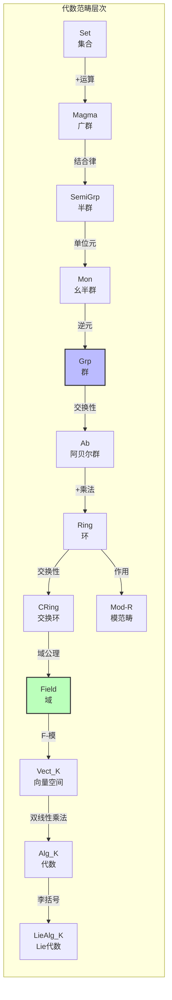

### 1.2 范畴包含关系

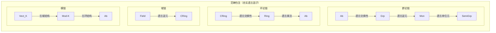

---

## 二、遗忘函子链

### 2.1 遗忘函子的定义

**定义 2.1**（遗忘函子）：设 $\mathcal{C}$ 为代数范畴，**遗忘函子** $U: \mathcal{C} \to \text{Set}$ 将对象映射到底层集合，态射映射到底层函数。

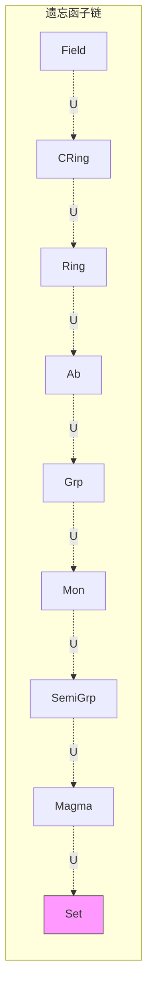

### 2.2 具体遗忘函子表

| 遗忘函子 | 定义 | 左伴随（自由构造） |
|---------|------|------------------|
| $U_{\text{Grp}}: \text{Grp} \to \text{Set}$ | 忘群结构 | $F_{\text{Grp}}: \text{Set} \to \text{Grp}$（自由群） |
| $U_{\text{Ab}}: \text{Ab} \to \text{Set}$ | 忘群结构 | $F_{\text{Ab}}: \text{Set} \to \text{Ab}$（自由阿贝尔群） |
| $U_{\text{Ring}}: \text{Ring} \to \text{Set}$ | 忘环结构 | $F_{\text{Ring}}: \text{Set} \to \text{Ring}$（自由环） |
| $U_{\text{CRing}}: \text{CRing} \to \text{Set}$ | 忘环结构 | $F_{\text{CRing}}: \text{Set} \to \text{CRing}$（多项式环） |
| $U_{R\text{-Mod}}: R\text{-Mod} \to \text{Set}$ | 忘模结构 | $F_{R\text{-Mod}}: \text{Set} \to R\text{-Mod}$（自由模） |
| $U_{\text{Vect}_K}: \text{Vect}_K \to \text{Set}$ | 忘向量空间结构 | $F_{\text{Vect}_K}: \text{Set} \to \text{Vect}_K$（自由向量空间） |

### 2.3 分层遗忘

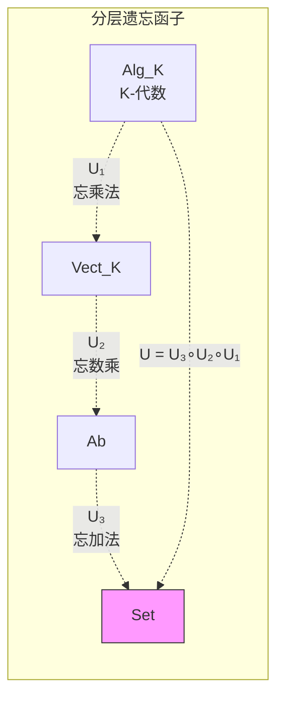

---

## 三、自由构造与左伴随

### 3.1 自由函子的定义

**定义 3.1**（自由函子）：遗忘函子 $U: \mathcal{C} \to \text{Set}$ 的**左伴随** $F: \text{Set} \to \mathcal{C}$ 称为**自由函子**，$F(X)$ 称为集合 $X$ 上的**自由对象**。

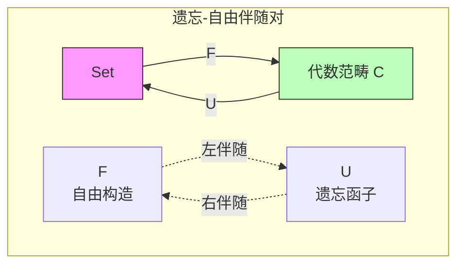

### 3.2 典型自由构造

**自由群** $F(X)$：
$$F(X) = \{\text{约化字 } x_1^{\epsilon_1} \cdots x_n^{\epsilon_n} \mid x_i \in X, \epsilon_i \in \{\pm 1\}\}$$

**自由阿贝尔群** $\mathbb{Z}^{(X)}$：
$$\mathbb{Z}^{(X)} = \bigoplus_{x \in X} \mathbb{Z} = \{f: X \to \mathbb{Z} \mid f(x) = 0 \text{ 对几乎所有 } x\}$$

**多项式环** $K[X]$（自由交换 $K$-代数）：
$$K[X] = K[x_1, \ldots, x_{|X|}]$$

**自由模** $R^{(X)}$：
$$R^{(X)} = \bigoplus_{x \in X} R$$

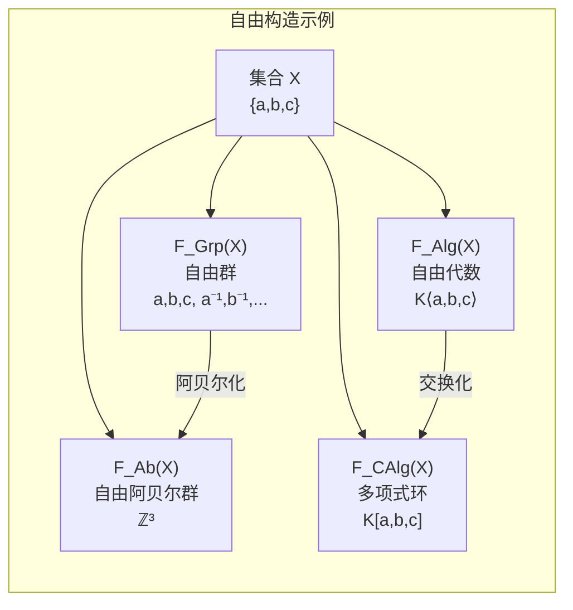

### 3.3 泛性质

**定理 3.2**（自由对象的泛性质）：
> 自由对象 $F(X)$ 满足：对任意 $A \in \mathcal{C}$ 和函数 $f: X \to U(A)$，存在唯一的态射 $\tilde{f}: F(X) \to A$ 使得 $U(\tilde{f}) \circ \eta_X = f$。

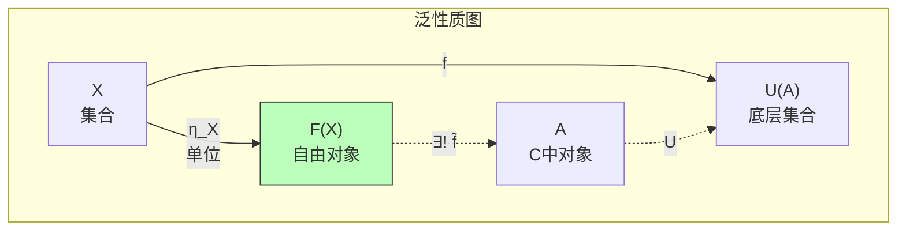

---

## 四、函子关系网络

### 4.1 代数范畴间的函子

```mermaid
graph TB
    subgraph 函子网络["代数范畴间的函子"]
        direction TB

        SET["Set"]
        GRP["Grp"]
        AB["Ab"]
        RNG["Ring"]
        COMM["CRing"]
        MOD["Mod-R"]
        VECT["Vect_K"]
        ALG["Alg_K"]
        LIE["LieAlg_K"]
        TOPGRP["TopGrp"]

        %% 遗忘函子
        GRP -.->|U| SET
        AB -.->|U| SET
        RNG -.->|U| SET
        MOD -.->|U| SET

        %% 群相关
        AB -.->|包含| GRP
        GRP -->|交换化<br/>Ab(-)| AB
        GRP -->|群环<br/>ℤ[-]| RNG
        SET -->|自由群<br/>F| GRP

        %% 环相关
        RNG -.->|U| AB
        COMM -.->|包含| RNG
        RNG -->|交换化| COMM
        AB -->|自同态环<br/>End(-)| RNG
        SET -->|自由环| RNG
        SET -->|多项式环| COMM

        %% 模相关
        RNG -->|模范畴| MOD
        VECT -.->|包含| MOD
        FIELD["Field"] -->|F-向量空间| VECT
        SET -->|自由模| MOD

        %% 代数相关
        VECT -->|张量代数<br/>T(-)| ALG
        VECT -->|对称代数<br/>Sym(-)| COMM
        VECT -->|外代数<br/>Λ(-)| ALG
        ALG -->|李括号<br/>[-,-]| LIE
        LIE -->|泛包络代数<br/>U(-)| ALG

        %% 拓扑
        GRP -->|拓扑化| TOPGRP

    end

    style SET fill:#f9f,stroke:#333

```

### 4.2 伴随关系汇总

| 伴随对 | 左伴随 F | 右伴随 U | 说明 |
|--------|---------|---------|------|
| $(F_{\text{Grp}}, U_{\text{Grp}})$ | 自由群 | 遗忘 | Set ↔ Grp |
| $(F_{\text{Ab}}, U_{\text{Ab}})$ | 自由阿贝尔群 | 遗忘 | Set ↔ Ab |
| $(\text{Ab}, U_{\text{Ab}}^{\text{Grp}})$ | 交换化 | 包含 | Grp ↔ Ab |
| $(F_{\text{Ring}}, U_{\text{Ring}})$ | 自由环 | 遗忘 | Set ↔ Ring |
| $(F_{R\text{-Mod}}, U_{R\text{-Mod}})$ | 自由模 | 遗忘 | Set ↔ R-Mod |
| $(T, U_{\text{Alg}}^{\text{Vect}})$ | 张量代数 | 遗忘乘法 | Vect ↔ Alg |
| $(U, [-,-])$ | 泛包络代数 | 李括号 | LieAlg ↔ Alg |
| $(\text{Ind}_H^G, \text{Res}_H^G)$ | 诱导表示 | 限制表示 | Rep(H) ↔ Rep(G) |

### 4.3 张量代数链

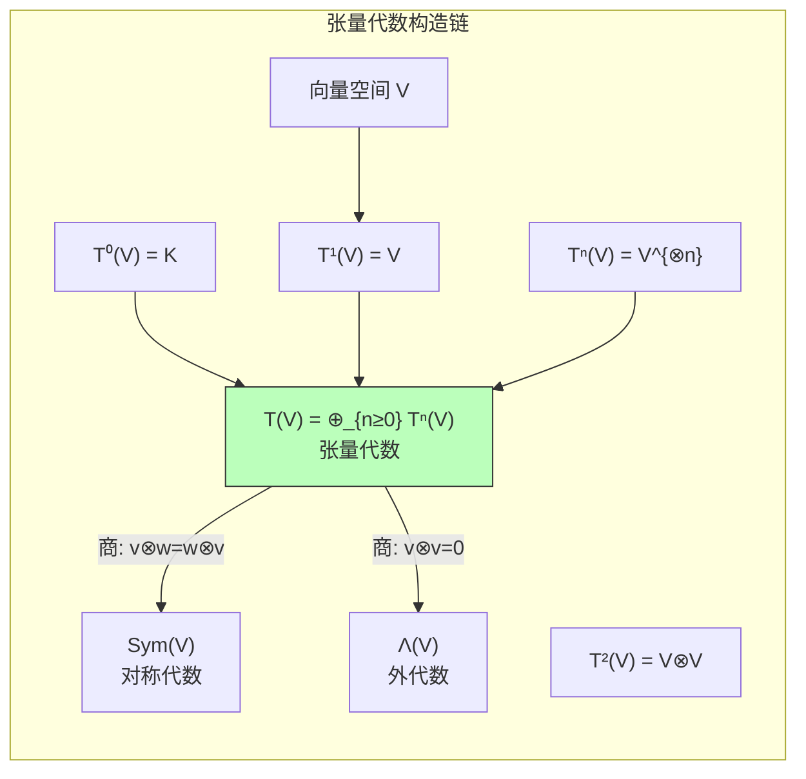

---

## 五、极限与余极限

### 5.1 代数范畴中的极限

**定理 5.1**：以下代数范畴在Set中是**具体**的，且遗忘函子创造极限：

| 范畴 | 极限存在性 | 构造方法 |
|------|----------|---------|
| Grp | 是 | 底层集合极限 + 逐点运算 |
| Ab | 是 | 同上 |
| Ring | 是 | 同上 |
| CRing | 是 | 同上 |
| Mod-R | 是 | Abel范畴，所有极限存在 |
| Vect_K | 是 | 同上 |
| Field | **否** | 域的极限不一定是域 |

### 5.2 典型极限构造

**积**（直积）：

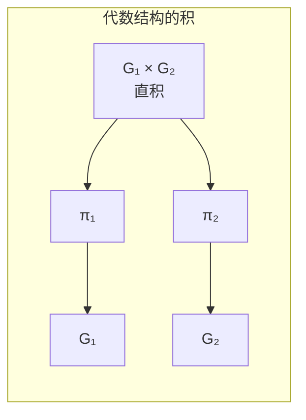

**等化子**（Equalizer）：

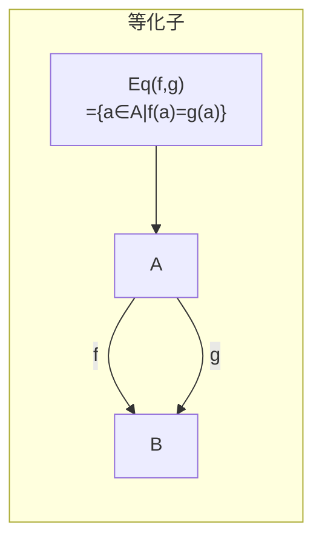

### 5.3 余极限

**余积**（自由积/直和）：

| 范畴 | 余积 | 记号 |
|------|------|------|
| Set | 不交并 | $A \sqcup B$ |
| Grp | 自由积 | $G * H$ |
| Ab | 直和 | $A \oplus B$ |
| Ring | 自由积 | $R * S$ |
| Mod-R | 直和 | $M \oplus N$ |

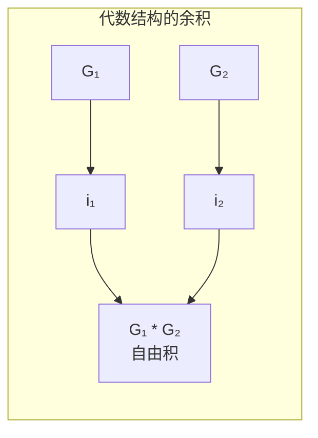

---

## 六、范畴等价与同构

### 6.1 重要等价

**定理 6.1**（模范畴等价）：
> 设 $R, S$ 为环，则以下等价：
> 1. $R\text{-Mod} \cong S\text{-Mod}$（范畴等价）
> 2. 存在生成元 $P \in R\text{-Mod}$ 使得 $\text{End}_R(P) \cong S^{\text{op}}$

### 6.2 Morita等价

**定义 6.2**（Morita等价）：环 $R, S$ 称为**Morita等价**，如果 $R\text{-Mod} \cong S\text{-Mod}$。

```mermaid
graph TB
    subgraph Morita等价["Morita等价"]
        direction TB

        R["环 R"]
        S["环 S"]
        RMOD["R-Mod"]
        SMOD["S-Mod"]
        EQ["≃ 范畴等价"]
        P["投射生成元 P"]

        R -.->|模范畴| RMOD
        S -.->|模范畴| SMOD
        RMOD <-->|Morita等价| EQ
        EQ <-->|Morita等价| SMOD
        R -.->|End_R(P) ≅ S| P

    end

```

---

## 七、关联关系统计

| 关联类型 | 数量 | 说明 |
|---------|------|------|
| 代数范畴定义 | 11 | Set, Grp, Ab, Ring, CRing, Field, Mod-R, Vect, Alg, LieAlg等 |
| 遗忘函子 | 8 | 各类遗忘函子 |
| 自由构造（左伴随） | 8 | 自由群、自由环、自由模等 |
| 其他伴随 | 4 | 交换化、张量代数、泛包络等 |
| 极限/余极限 | 6 | 积、余积、等化子等 |
| 范畴等价 | 2 | Morita等价等 |
| **总计** | **39** | 完整函子关系网络 |

---

**相关文档**: [02-模与表示理论关联](02-模与表示理论关联.md) | [04-代数结构对偶关系](04-代数结构对偶关系.md)
