# 代数结构对偶关系

> **FormalMath 项目第十批推进 - 任务B1.4**
>
> 本文档详细阐述代数结构中的各类对偶关系，包括代数↔几何对偶（坐标环↔代数簇）、Pontryagin对偶（群↔对偶群）、线性对偶（空间↔对偶空间）等。

---

## 目录

1. [线性对偶](#一线性对偶)
2. [Pontryagin对偶](#二pontryagin对偶)
3. [代数↔几何对偶](#三代数几何对偶)
4. [范畴论对偶](#四范畴论对偶)
5. [Hopf代数对偶](#五hopf代数对偶)
6. [对偶关系汇总](#六对偶关系汇总)

---

## 一、线性对偶

### 1.1 对偶空间的定义

**定义 1.1**（对偶空间）：设 $V$ 为域 $K$ 上的向量空间，**对偶空间** $V^*$ 定义为：

$$V^* = \text{Hom}_K(V, K) = \{f: V \to K \mid f \text{ 是 } K\text{-线性的}\}$$

**结构**：$V^*$ 自然地成为 $K$-向量空间，运算为：
- $(f + g)(v) = f(v) + g(v)$
- $(cf)(v) = c \cdot f(v)$（$c \in K$）

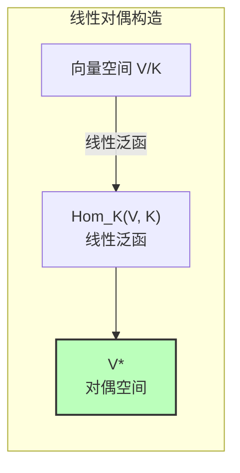

### 1.2 双重对偶

**定义 1.2**（双重对偶）：$V^{**} = (V^*)^*$

**定理 1.3**（自然映射）：
> 存在自然的线性映射 $\eta_V: V \to V^{**}$，定义为：
> $$\eta_V(v)(f) = f(v)$$
> 对所有 $v \in V$ 和 $f \in V^*$。

**定理 1.4**（自反性）：
> 若 $\dim(V) < \infty$，则 $\eta_V: V \to V^{**}$ 是同构（**自反**）。

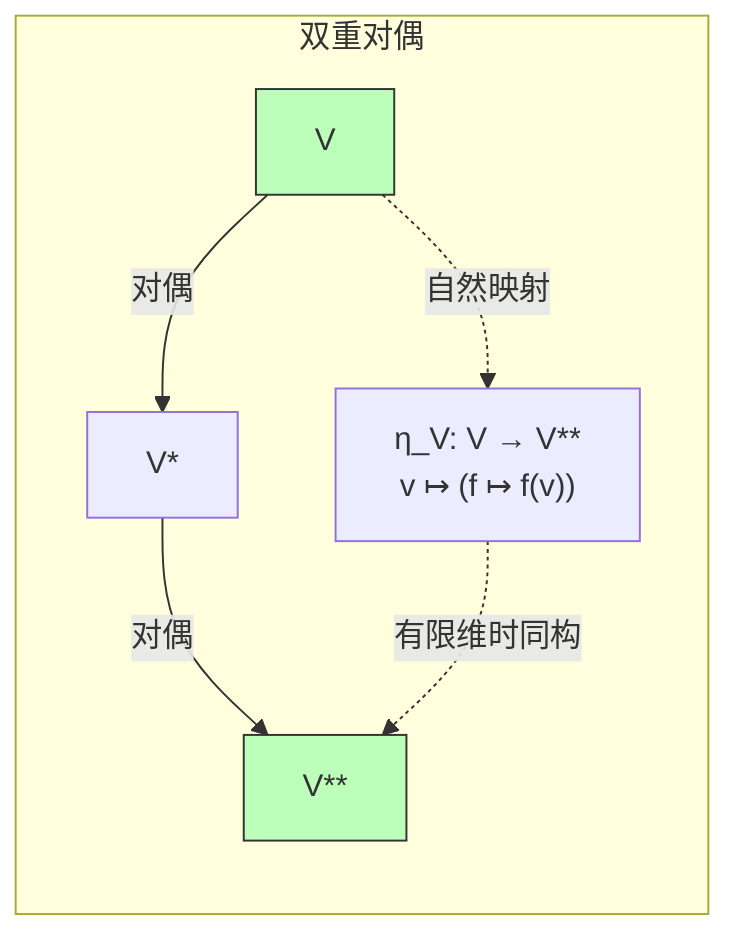

### 1.3 有限维 vs 无限维

| 性质 | 有限维 | 无限维 |
|------|--------|--------|
| $\dim(V^*)$ | = $\dim(V)$ | > $\dim(V)$（严格大） |
| $V \cong V^*$ | 是 | 否 |
| $V \cong V^{**}$ | 是（典范） | 否（真包含） |
| 基对应 | 对偶基存在 | 无连续对偶基 |

### 1.4 对偶映射

**定义 1.5**（转置/对偶映射）：设 $\phi: V \to W$ 为线性映射，**对偶映射** $\phi^*: W^* \to V^*$ 定义为：

$$\phi^*(f) = f \circ \phi$$

**性质**：
- $(\phi \circ \psi)^* = \psi^* \circ \phi^*$
- 若 $\phi$ 单，则 $\phi^*$ 满；若 $\phi$ 满，则 $\phi^*$ 单

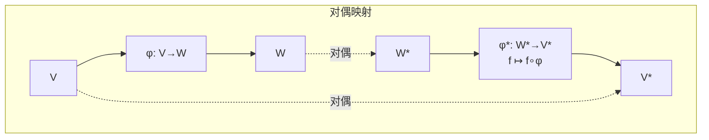

---

## 二、Pontryagin对偶

### 2.1 拓扑群的特征标

**定义 2.1**（特征标）：设 $G$ 为局部紧阿贝尔群（LCA群），**特征标**是连续群同态：

$$\chi: G \to \mathbb{T} = \{z \in \mathbb{C} \mid |z| = 1\}$$

**定义 2.2**（对偶群）：$G$ 的**Pontryagin对偶**定义为：

$$\widehat{G} = \text{Hom}_{\text{cont}}(G, \mathbb{T})$$

**群结构**：$(\chi_1 \cdot \chi_2)(g) = \chi_1(g) \cdot \chi_2(g)$

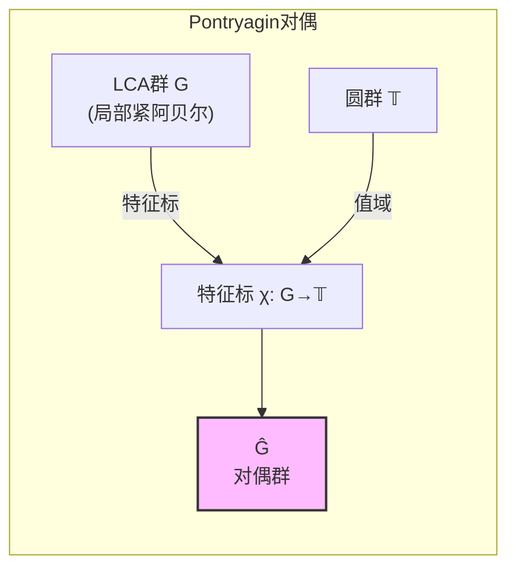

### 2.2 经典例子

| 群 $G$ | 对偶群 $\widehat{G}$ | 对应关系 |
|--------|-------------------|---------|
| $\mathbb{Z}$ | $\mathbb{T}$ | $n \mapsto z^n$ |
| $\mathbb{Z}/n\mathbb{Z}$ | $\mu_n$（$n$次单位根） | $k \mapsto e^{2\pi i k/n}$ |
| $\mathbb{T}$ | $\mathbb{Z}$ | $z \mapsto z^n$ |
| $\mathbb{R}$ | $\mathbb{R}$ | $x \mapsto e^{2\pi i \xi x}$ |
| $\mathbb{R}/\mathbb{Z}$ | $\mathbb{Z}$ | 同上 |
| $(\mathbb{Z}/n\mathbb{Z})^k$ | $(\mathbb{Z}/n\mathbb{Z})^k$ | 有限阿贝尔自对偶 |
| 有限阿贝尔群 $A$ | $A$ | 自对偶（非典范） |

### 2.3 Pontryagin对偶定理

**定理 2.3**（Pontryagin对偶定理）：
> 设 $G$ 为LCA群，则自然映射：
> $$\alpha_G: G \to \widehat{\widehat{G}}, \quad \alpha_G(g)(\chi) = \chi(g)$$
> 是拓扑群的同构。

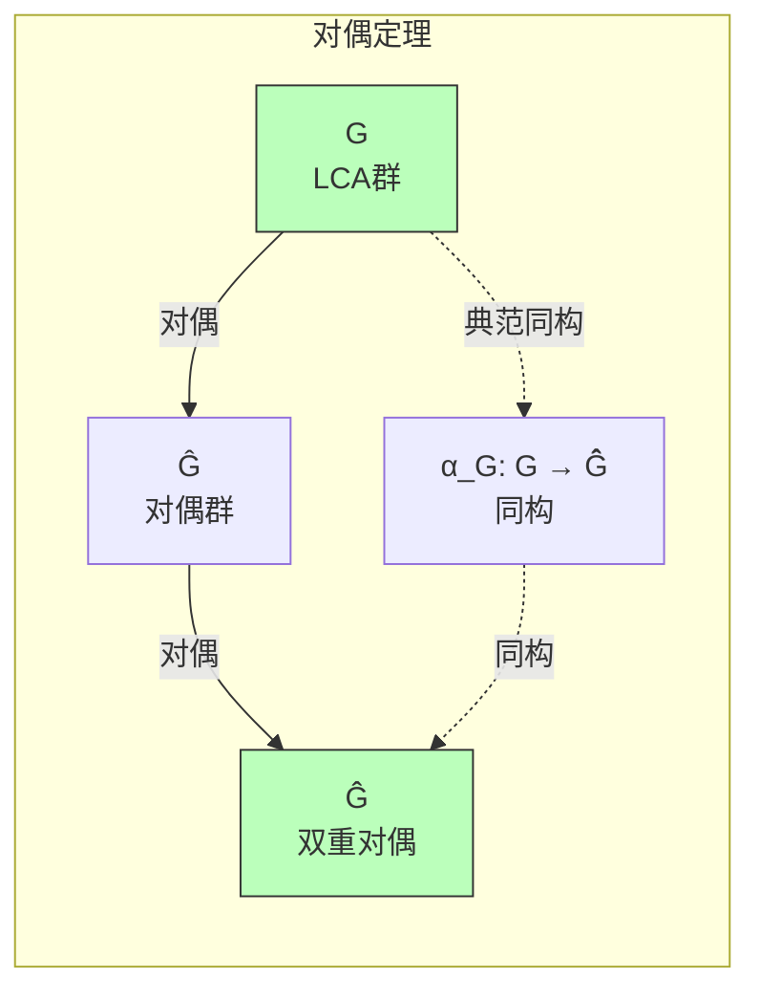

### 2.4 Fourier变换

**定义 2.4**（Fourier变换）：设 $G$ 为LCA群，$f \in L^1(G)$，**Fourier变换**定义为：

$$\widehat{f}(\chi) = \int_G f(g) \overline{\chi(g)} \, dg$$

**定理 2.5**（Fourier反演）：
> 在适当条件下：
> $$f(g) = \int_{\widehat{G}} \widehat{f}(\chi) \chi(g) \, d\chi$$

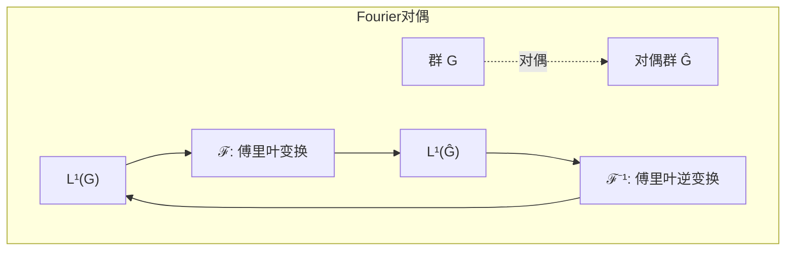

---

## 三、代数↔几何对偶

### 3.1 坐标环与代数簇

**定义 3.1**（代数簇）：设 $K$ 为代数闭域，$\mathbb{A}^n_K$ 为 $n$ 维仿射空间。

- **代数集**：$V \subseteq \mathbb{A}^n$ 是多项式零点集
- **坐标环**：$K[V] = K[x_1, \ldots, x_n]/I(V)$，其中 $I(V)$ 为 $V$ 的理想

**定义 3.2**（谱）：交换环 $A$ 的**谱**定义为：

$$\text{Spec}(A) = \{\mathfrak{p} \subseteq A \mid \mathfrak{p} \text{ 是素理想}\}$$

带有Zariski拓扑。

```mermaid
graph TB
    subgraph 代数几何对偶["代数↔几何对偶"]
        direction TB

        subgraph 几何侧
            V["代数簇 V<br/>仿射/射影"]
            KV["K[V]<br/>坐标环"]
            POINT["点 p∈V"]
            MAX["极大理想 m_p<br/>⊂ K[V]"]
        end

        subgraph 代数侧
            A["交换环 A"]
            SPEC["Spec(A)<br/>素谱"]
            P["素理想 p⊂A"]
            POINT2["点 [p]∈Spec(A)"]
        end

        V <-->|I(-)| KV
        A <-->|V(-)| SPEC
        POINT -.->|对应| MAX
        P -.->|对应| POINT2

        KV <-->|Spec| V2["仿射簇"]
        A <-->|Γ| SPEC2["环"]

    end

    style KV fill:#fbf,stroke:#333
    style SPEC fill:#bfb,stroke:#333

```

### 3.2 Hilbert零点定理

**定理 3.3**（Hilbert零点定理）：
> 设 $K$ 为代数闭域，则：
> 1. **弱形式**：$I(V(J)) = \sqrt{J}$（根理想对应代数集）
> 2. **强形式**：$\text{Max}(K[x_1,\ldots,x_n]) \cong \mathbb{A}^n_K$（极大理想对应点）

**推论**：
- 仿射代数集 $\leftrightarrow$ 有限生成约化 $K$-代数
- 点 $\leftrightarrow$ 极大理想

### 3.3 反等价范畴

**定理 3.4**（代数-几何反等价）：
> 函子 $V \mapsto K[V]$ 和 $A \mapsto \text{Max}(A)$（或 $\text{Spec}(A)$）给出范畴反等价：
> $$\{\text{仿射代数集}\}^{\text{op}} \cong \{\text{有限生成约化 } K\text{-代数}\}$$

```mermaid
graph LR
    subgraph 范畴反等价
        ALG["代数范畴<br/>(有限生成约化K-代数)"]
        GEO["几何范畴<br/>(仿射代数集)"]
        SPEC["Spec(-)<br/>或 Max(-)"]
        COORD["K[-]<br/>坐标环"]

        ALG -->|Spec| GEO
        GEO -->|K[-]| ALG
        SPEC -.->|右伴随| COORD
        COORD -.->|左伴随| SPEC

    end

```

### 3.4 概形推广

**定义 3.5**（概形）：**概形**是局部环空间 $(X, \mathcal{O}_X)$，局部同构于 $(\text{Spec}(A), \mathcal{O}_{\text{Spec}(A)})$。

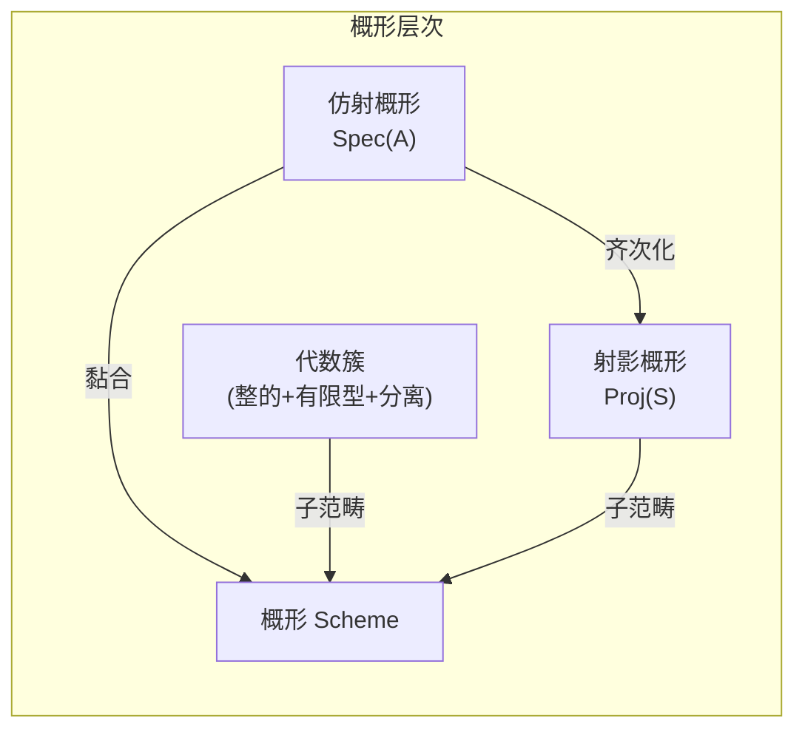

---

## 四、范畴论对偶

### 4.1 对偶范畴

**定义 4.1**（对偶范畴）：范畴 $\mathcal{C}$ 的**对偶范畴** $\mathcal{C}^{\text{op}}$ 有：
- 相同对象：$\text{Ob}(\mathcal{C}^{\text{op}}) = \text{Ob}(\mathcal{C})$
- 反向箭头：$\text{Hom}_{\mathcal{C}^{\text{op}}}(X, Y) = \text{Hom}_{\mathcal{C}}(Y, X)$

**原则**：
> $\mathcal{C}$ 中的命题在 $\mathcal{C}^{\text{op}}$ 中对应**对偶命题**（箭头反向）。

### 4.2 对偶概念对应表

| 概念 | 对偶概念 |
|------|---------|
| 单态射 (monomorphism) | 满态射 (epimorphism) |
| 初始对象 | 终对象 |
| 极限 (limit) | 余极限 (colimit) |
| 积 | 余积 |
| 等化子 | 余等化子 |
| 核 | 余核 |
| 拉回 | 推出 |
| 纤维积 | 纤维余积 |
| 内射对象 | 投射对象 |

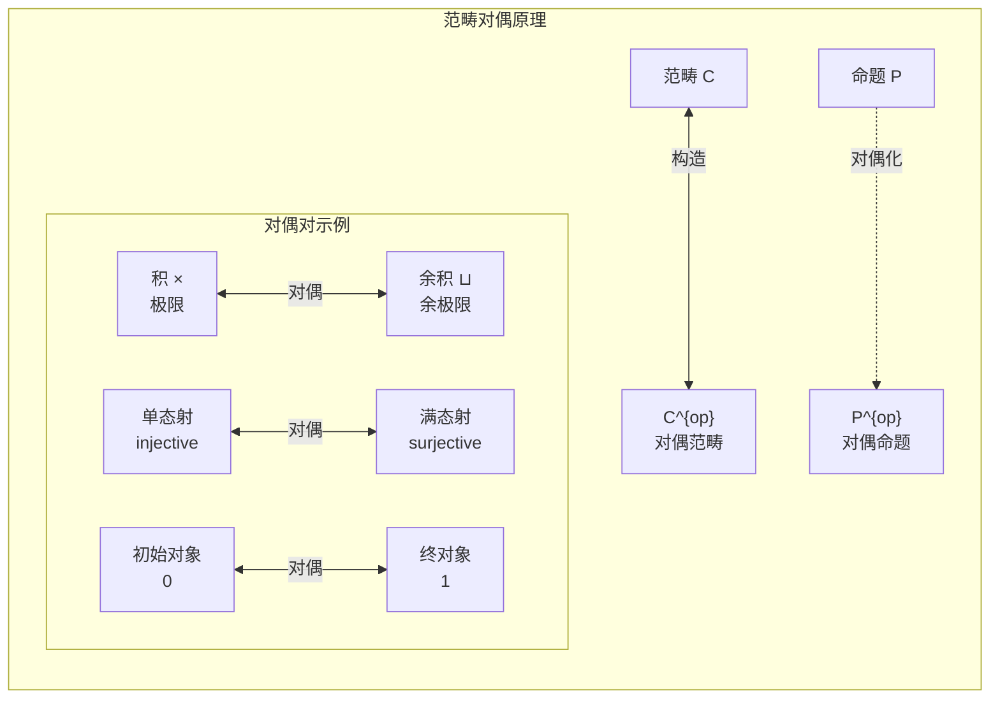

### 4.3 逆变函子

**定义 4.2**（逆变函子）：**逆变函子** $F: \mathcal{C} \to \mathcal{D}$ 是函子 $F: \mathcal{C}^{\text{op}} \to \mathcal{D}$（或等价地，$F: \mathcal{C} \to \mathcal{D}^{\text{op}}$）。

**性质**：$F(f \circ g) = F(g) \circ F(f)$（顺序反转）

**例子**：
- $V \mapsto V^*$（向量空间对偶）
- $G \mapsto \widehat{G}$（Pontryagin对偶）
- $A \mapsto \text{Spec}(A)$（代数-几何对偶）

---

## 五、Hopf代数对偶

### 5.1 余代数与对偶

**定义 5.1**（余代数）：$K$-**余代数**是 $K$-向量空间 $C$ 配备：
- **余乘法** $\Delta: C \to C \otimes C$
- **余单位** $\varepsilon: C \to K$

满足余结合律和余单位律（乘法公理的箭头反向）。

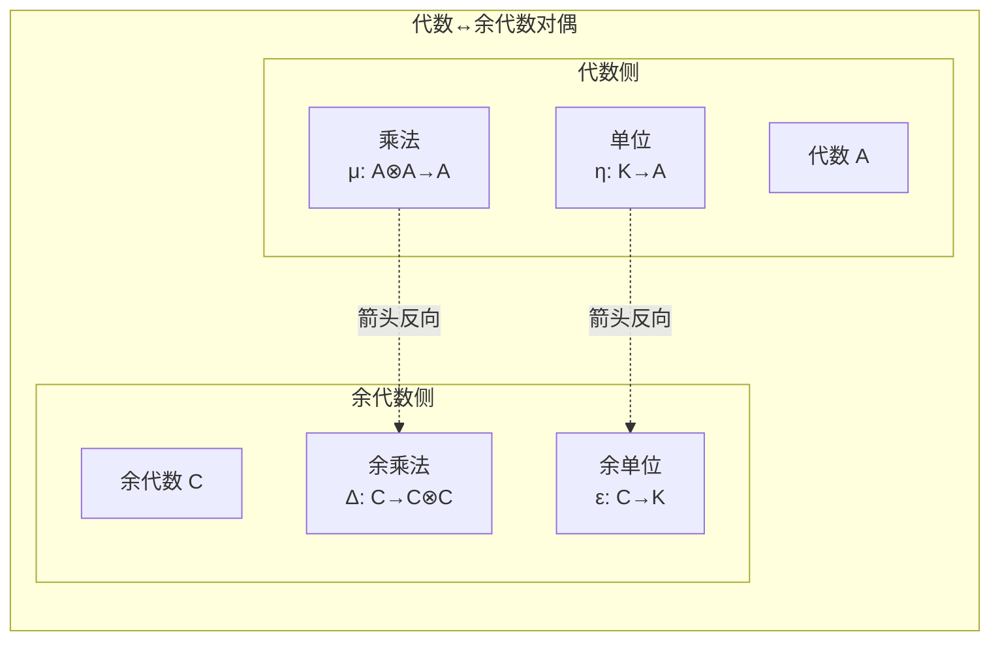

### 5.2 有限对偶

**定义 5.2**（有限对偶）：设 $A$ 为代数，**有限对偶** $A^\circ$ 定义为：

$$A^\circ = \{f \in A^* \mid \ker(f) \text{ 包含有限余维理想}\}$$

**定理 5.3**：
> 若 $A$ 为代数，则 $A^\circ$ 自然成为余代数；若 $A$ 为Hopf代数，则 $A^\circ$ 也是Hopf代数。

### 5.3 Hopf代数自对偶

**定义 5.4**（Hopf代数）：**Hopf代数** $H$ 是同时具有代数结构和余代数结构，且满足相容条件，配备**对极映射** $S: H \to H$。

**定理 5.5**（有限维Hopf对偶）：
> 设 $H$ 为有限维Hopf代数，则 $H^*$ 也是Hopf代数，且 $(H^*)^* \cong H$。

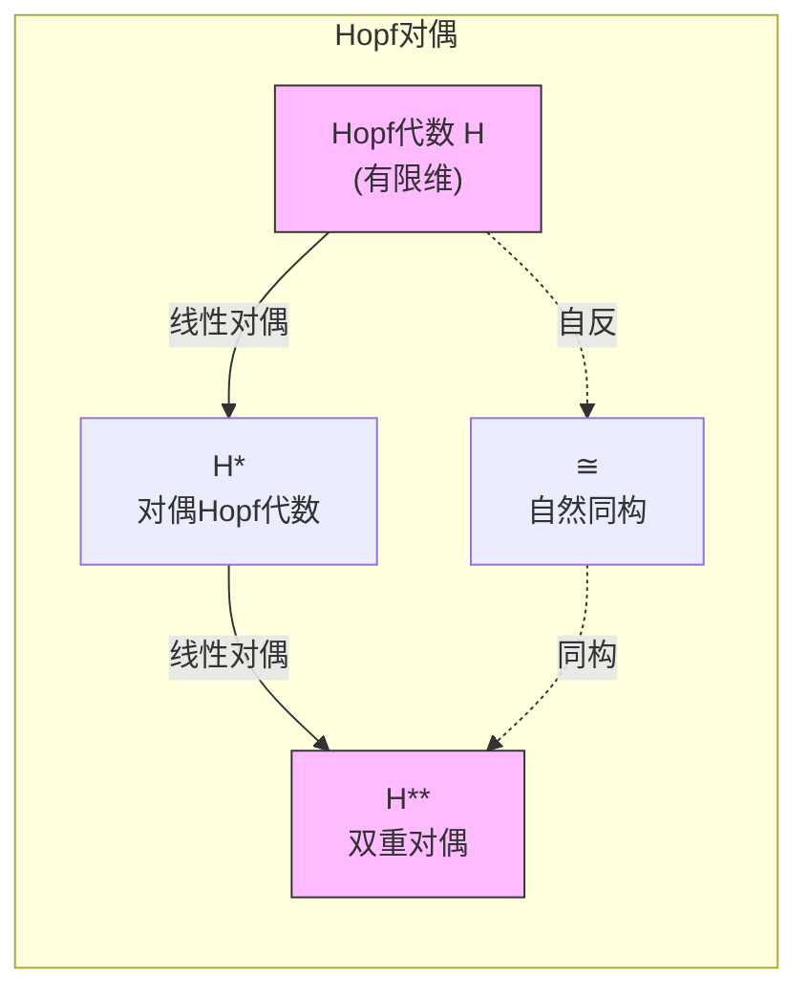

---

## 六、对偶关系汇总

### 6.1 对偶类型总图

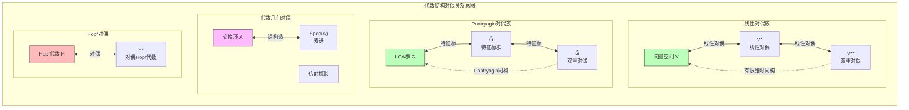

### 6.2 对偶关系统计

| 对偶类型 | 对象对 | 对偶构造 | 自反性 |
|---------|--------|---------|--------|
| **线性对偶** | $V \leftrightarrow V^*$ | 线性泛函 | 有限维时自反 |
| **Pontryagin对偶** | $G \leftrightarrow \widehat{G}$ | 连续特征标 | 总是自反（LCA） |
| **代数-几何对偶** | $A \leftrightarrow \text{Spec}(A)$ | 素理想 | 反等价 |
| **坐标环对偶** | $V \leftrightarrow K[V]$ | 正则函数 | 反等价 |
| **Hopf对偶** | $H \leftrightarrow H^*$ | 有限对偶 | 有限维时自反 |
| **范畴对偶** | $\mathcal{C} \leftrightarrow \mathcal{C}^{\text{op}}$ | 箭头反向 | $(\mathcal{C}^{\text{op}})^{\text{op}} = \mathcal{C}$ |

**对偶关系总数**: 8类主要对偶关系

### 6.3 对偶的普遍性

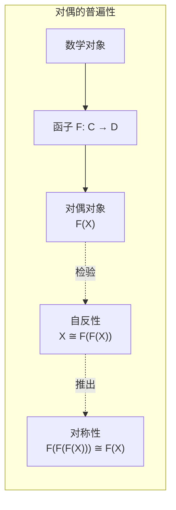

---

**相关文档**: [03-代数结构范畴论视角](03-代数结构范畴论视角.md) | [05-代数结构推广层次](05-代数结构推广层次.md)
