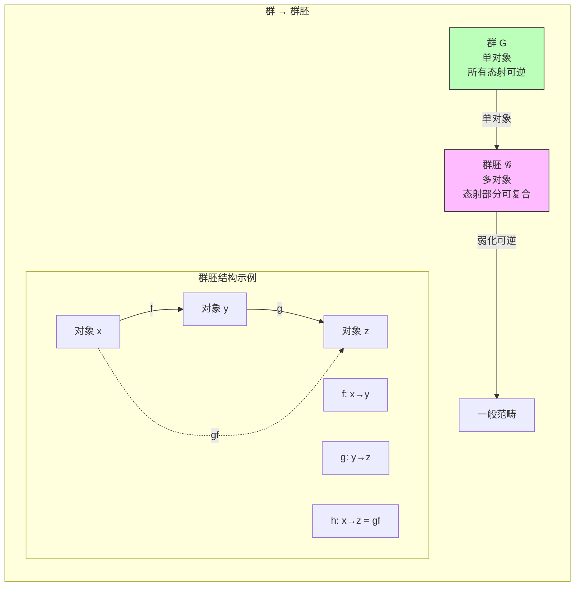
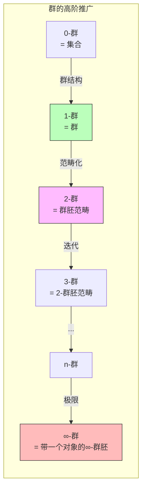
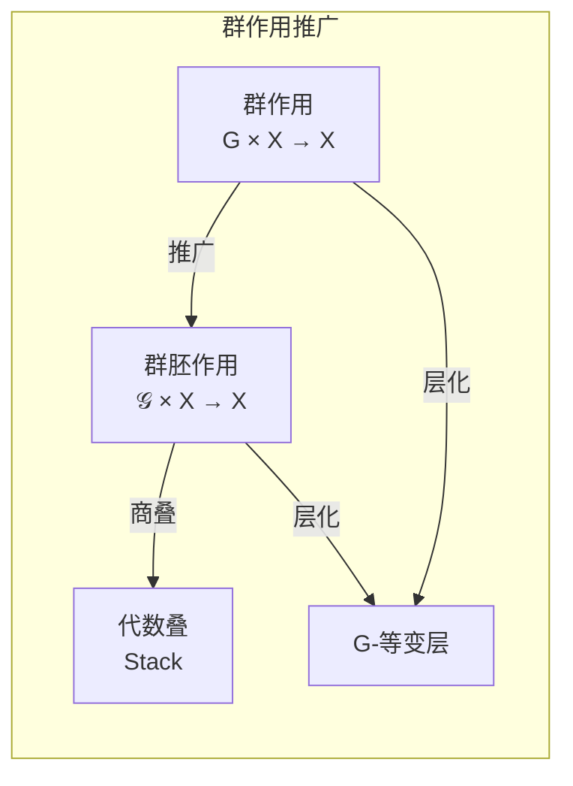
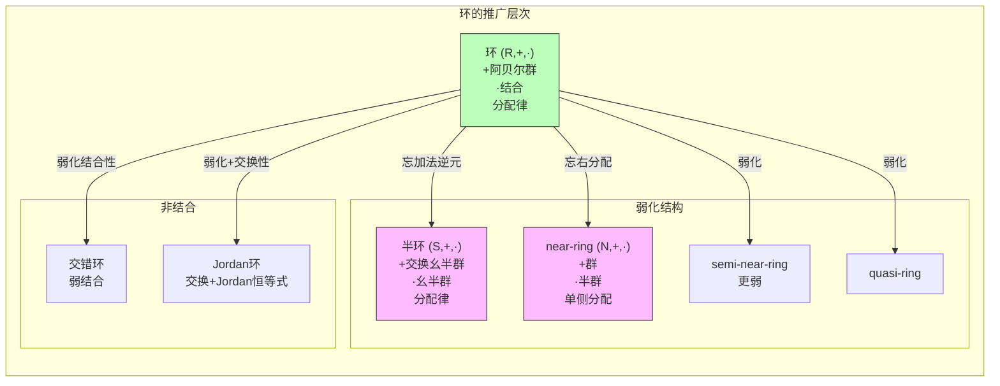
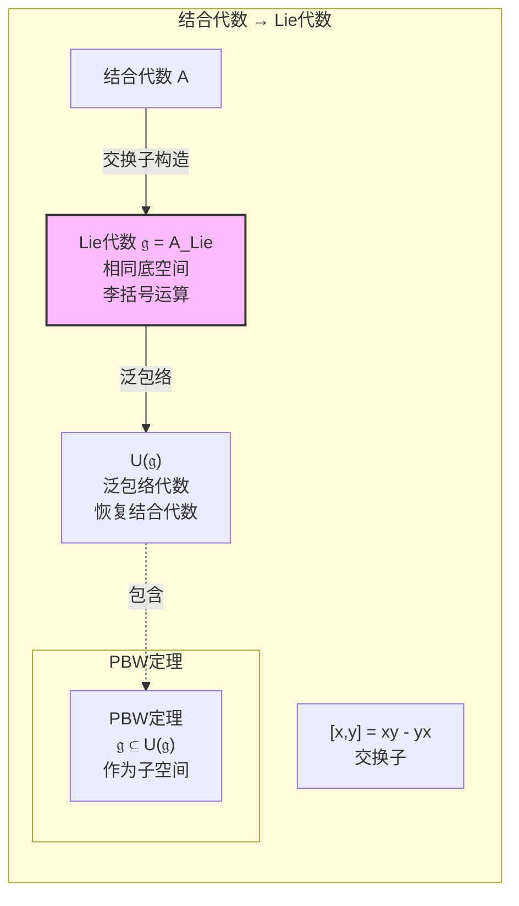
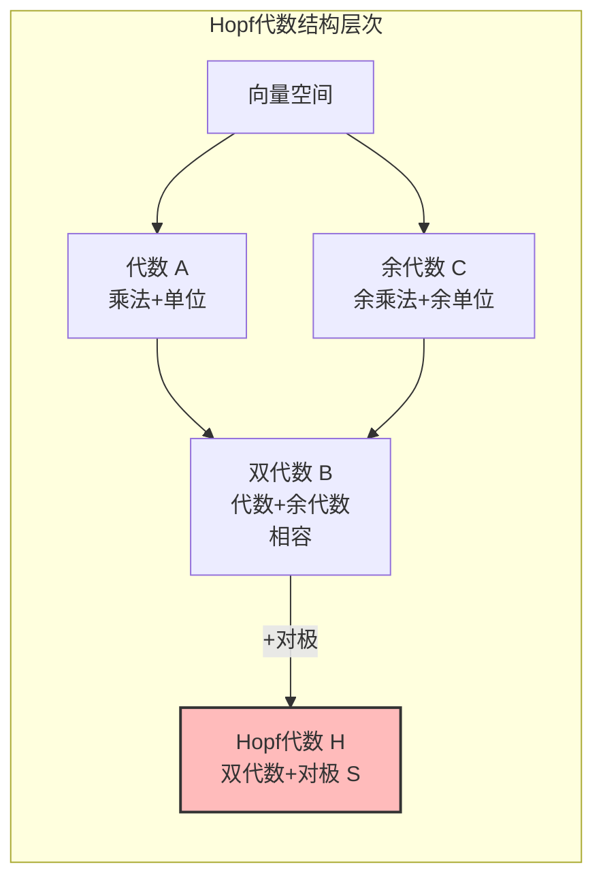
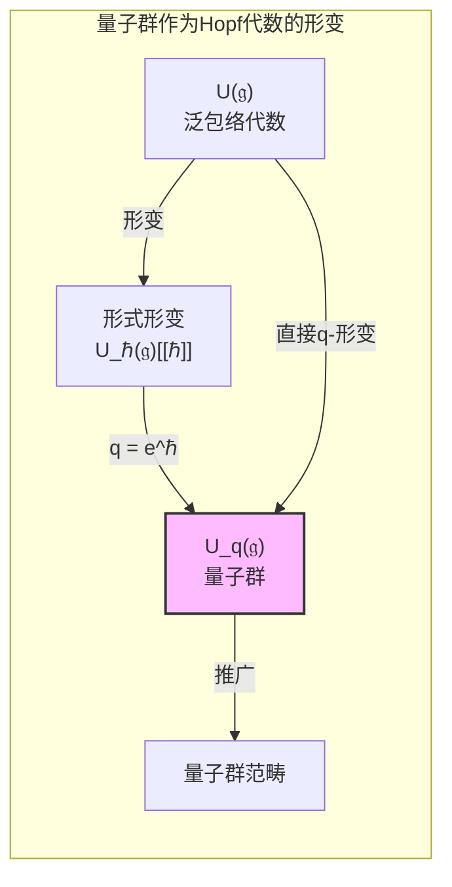
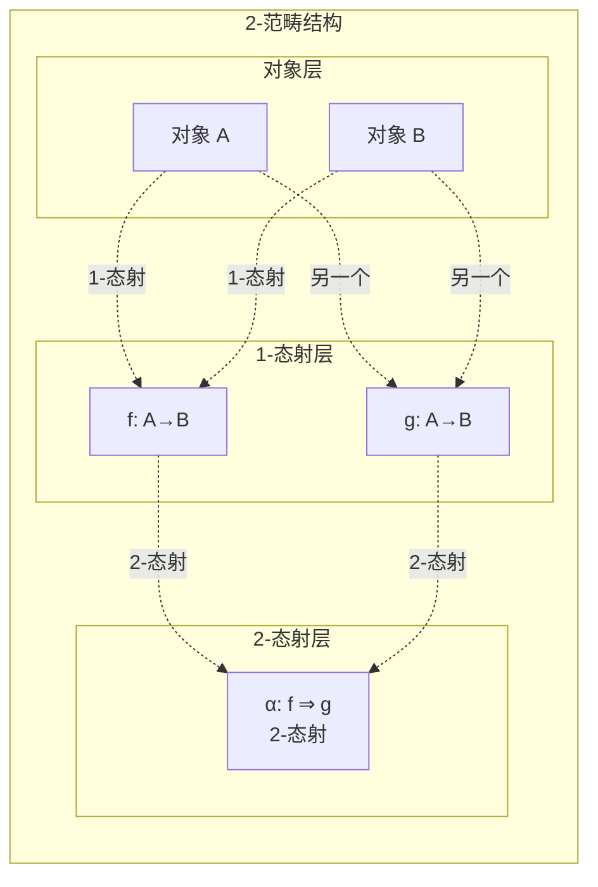
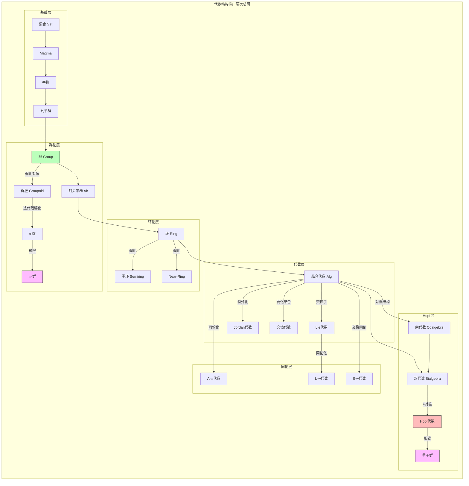
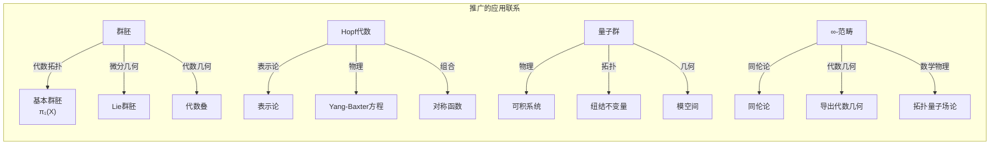

# 代数结构推广层次

> **FormalMath 项目第十批推进 - 任务B1.5**
>
> 本文档详细阐述代数结构的高阶推广，包括群→群胚→高阶群、环→半环→near-ring、代数→Hopf代数、Lie代数等推广路径。

---

## 目录

1. [群的高阶推广](#一群的高阶推广)
2. [环的推广层次](#二环的推广层次)
3. [代数的高阶推广](#三代数的高阶推广)
4. [范畴论推广](#四范畴论推广)
5. [同伦代数结构](#五同伦代数结构)
6. [推广路径汇总](#六推广路径汇总)

---

## 一、群的高阶推广

### 1.1 群→群胚

**定义 1.1**（群胚/广群 Groupoid）：**群胚**是一个范畴，其中所有态射都是同构。

**等价定义**：集合 $G$ 配备：
- **对象集** $G_0$
- **态射集** $G_1$（箭头集）
- **源/目标映射** $s, t: G_1 \to G_0$
- **部分复合**（当 $t(g_1) = s(g_2)$ 时定义 $g_1 \circ g_2$）
- **单位元** $e_x$ 对每个 $x \in G_0$
- **逆元** $g^{-1}$ 对每个 $g \in G_1$



**例子 1.2**：
- **基本群胚** $\pi_1(X)$：拓扑空间 $X$ 的路径同伦类
- **Galois群胚**：域扩张的Galois理论推广
- **等价关系群胚**：集合上的等价关系

### 1.2 群胚→高阶群

**定义 1.3**（2-群/群胚范畴）：**2-群**是一个群胚范畴，即范畴的对象和态射都构成群胚，且满足群公理至同构。



**定理 1.4**（Eilenberg-MacLane）：
> 连通带基点的空间 $X$ 的**高阶同伦群** $\pi_n(X)$ 是阿贝尔群（$n \geq 2$）。

### 1.3 群作用与层



---

## 二环的推广层次

### 2.1 环的弱化结构



### 2.2 半环（Semiring）

**定义 2.1**（半环）：**半环**是集合 $S$ 配备两个运算 $+$ 和 $\cdot$，满足：
- $(S, +)$ 是交换幺半群（单位元记为0）
- $(S, \cdot)$ 是幺半群（单位元记为1）
- 分配律：$a(b+c) = ab + ac$, $(b+c)a = ba + ca$
- 零元：$a \cdot 0 = 0 \cdot a = 0$

**典型例子**：

| 半环 | 说明 |
|------|------|
| $\mathbb{N}$ | 自然数（含0） |
| $\mathbb{R}_{\geq 0} \cup \{\infty\}$ | 热带半环（Tropical） |
| $\{0, 1\}$ | Boolean半环（逻辑运算） |
| $\text{Mat}_n(\mathbb{N})$ | 自然数矩阵 |
| 形式语言 | 并+连接运算 |

**定理 2.2**（热带几何）：
> 在热带半环 $\mathbb{R} \cup \{\infty\}$ 中（运算：$a \oplus b = \min(a,b)$, $a \odot b = a + b$），代数曲线对应经典代数曲线的退化。

### 2.3 Near-Ring

**定义 2.3**（Near-Ring）：**Near-Ring** 是集合 $N$ 配备：
- $(N, +)$ 是群（不必交换）
- $(N, \cdot)$ 是半群
- **左分配律**：$a(b+c) = ab + ac$（保留）
- **右分配律一般不成立**

**例子 2.4**：
- 群 $G$ 的**自映射** $M(G) = \{f: G \to G\}$ 关于 $(f+g)(x) = f(x) + g(x)$ 和 $(f \cdot g)(x) = f(g(x))$ 构成near-ring

---

## 三代数的高阶推广

### 3.1 结合代数→Lie代数

**定义 3.1**（Lie代数）：域 $K$ 上的**Lie代数**是向量空间 $\mathfrak{g}$ 配备**李括号** $[\cdot, \cdot]: \mathfrak{g} \times \mathfrak{g} \to \mathfrak{g}$，满足：
- **反对称性**：$[x, y] = -[y, x]$
- **Jacobi恒等式**：$[x, [y, z]] + [y, [z, x]] + [z, [x, y]] = 0$



**定理 3.2**（PBW定理）：
> 设 $\mathfrak{g}$ 为Lie代数，$U(\mathfrak{g})$ 为其泛包络代数，则：
> 1. 自然映射 $i: \mathfrak{g} \to U(\mathfrak{g})$ 是单射
> 2. 若 $\{x_1, \ldots, x_n\}$ 为 $\mathfrak{g}$ 的基，则 $\{x_{i_1} \cdots x_{i_k} \mid i_1 \leq \cdots \leq i_k\}$ 为 $U(\mathfrak{g})$ 的基

### 3.2 Hopf代数

**定义 3.3**（双代数）：**双代数** $B$ 是同时具有代数结构和余代数结构，且乘法/单位是余代数同态（或等价地，余乘法/余单位是代数同态）。

**定义 3.4**（Hopf代数）：**Hopf代数**是双代数 $H$ 配备**对极映射** $S: H \to H$，满足：
$$\mu \circ (S \otimes \text{id}) \circ \Delta = \mu \circ (\text{id} \otimes S) \circ \Delta = \eta \circ \varepsilon$$



**典型例子**：

| Hopf代数 | 乘法 | 余乘法 | 对极 |
|---------|------|--------|------|
| 群代数 $K[G]$ | 群乘法 | $\Delta(g) = g \otimes g$ | $S(g) = g^{-1}$ |
| 泛包络代数 $U(\mathfrak{g})$ | 代数乘法 | $\Delta(x) = x \otimes 1 + 1 \otimes x$ | $S(x) = -x$ |
| 函数代数 $\mathcal{O}(G)$ | 点乘 | 群结构导出 | $S(f)(g) = f(g^{-1})$ |
| 量子群 $U_q(\mathfrak{g})$ | 形变乘法 | 形变余乘法 | 形变对极 |

### 3.3 量子群

**定义 3.5**（量子群）：**量子群**是Hopf代数的形变或推广，典型例子：

- **Drinfeld-Jimbo量子群** $U_q(\mathfrak{sl}_2)$：
  - 生成元：$E, F, K, K^{-1}$
  - 关系：$KK^{-1} = K^{-1}K = 1$, $KE = q^2 EK$, $KF = q^{-2} FK$, $[E,F] = \frac{K - K^{-1}}{q - q^{-1}}$



---

## 四、范畴论推广

### 4.1 2-范畴

**定义 4.1**（2-范畴）：**2-范畴** $\mathcal{C}$ 由以下数据组成：
- **对象**：$A, B, C, \ldots$
- **1-态射**：$f: A \to B$
- **2-态射**：$\alpha: f \Rightarrow g$（1-态射之间的"箭头之间的箭头"）
- **水平复合**和**垂直复合**



**例子 4.2**：
- **Cat**：小范畴的范畴，函子是1-态射，自然变换是2-态射
- **2-向量空间**：2-表示论

### 4.2 ∞-范畴与同伦论

```mermaid
graph TB
    subgraph ∞-范畴层次["∞-范畴层次"]
        direction TB

        CAT0["0-范畴<br/>= 集合"]
        CAT1["1-范畴<br/>= 普通范畴"]
        CAT2["2-范畴<br/>带2-态射"]
        CATN["n-范畴<br/>最高n-态射"]
        INFCAT["∞-范畴<br/>无穷高阶"]

        CAT0 -->|推广| CAT1
        CAT1 -->|推广| CAT2
        CAT2 -->|迭代| CATN
        CATN -->|极限| INFCAT
    end

    style INFCAT fill:#fbb,stroke:#333,stroke-width:2px
```

**定义 4.3**（∞-群胚）：**∞-群胚**是所有高阶态射都可逆的∞-范畴。

**定理 4.4**（Grothendieck假设）：
> ∞-群胚等价于拓扑空间（在同伦意义下）。

---

## 五、同伦代数结构

### 5.1 A-∞代数

**定义 5.1**（A-∞代数）：**A-∞代数**是向量空间 $A$ 配备高阶乘法运算 $m_n: A^{\otimes n} \to A$（$n \geq 1$），满足**Stasheff恒等式**。

**特例**：
- $m_1$：微分 $d$
- $m_2$：乘法（结合至同伦）
- $m_3$：结合同伦

```mermaid
graph TB
    subgraph A-∞结构["A-∞代数结构"]
        direction TB

        A["向量空间 A"]
        M1["m₁ = d<br/>微分"]
        M2["m₂<br/>乘法"]
        M3["m₃<br/>结合同伦"]
        MN["mₙ<br/>高阶运算"]

        A --> M1
        A --> M2
        A --> M3
        A --> MN

        REL["Stasheff恒等式<br/>Σ(-1)^{...} m(...) = 0"]

        M1 & M2 & M3 & MN -.->|满足| REL
    end

    style A fill:#fbf,stroke:#333
```

**定理 5.2**（传递性）：
> A-∞代数的同调 $H(A)$ 自然具有结合代数结构。

### 5.2 L-∞代数

**定义 5.3**（L-∞代数）：**L-∞代数**是Lie代数的同伦推广，配备高阶李括号 $l_n: \mathfrak{g}^{\wedge n} \to \mathfrak{g}$。

**例子 5.4**：
- 形变理论的**Maurer-Cartan方程**
- **弦场论**中的BRST代数

### 5.3 E-∞代数

**定义 5.5**（E-∞代数）：**E-∞代数**是交换代数的同伦推广，配备所有高阶交换性同伦。

**应用**：
- 代数拓扑中的**上同调运算**
- **拓扑Hochschild同调**

---

## 六、推广路径汇总

### 6.1 推广网络总图



### 6.2 推广关系统计

| 推广类型 | 源结构 | 目标结构 | 推广机制 | 关联数 |
|---------|--------|---------|---------|--------|
| 范畴化 | 群 | 群胚 | 多对象 | 1 |
| 高阶化 | 群胚 | n-群 | 迭代范畴化 | 1 |
| 无穷化 | n-群 | ∞-群 | 极限 | 1 |
| 弱化 | 环 | 半环 | 忘逆元 | 1 |
| 弱化 | 环 | near-ring | 忘分配律 | 1 |
| Lie化 | 结合代数 | Lie代数 | 交换子 | 1 |
| Hopf化 | 代数 | Hopf代数 | +余结构+对极 | 1 |
| 量子化 | Hopf代数 | 量子群 | 形变 | 1 |
| 同伦化 | 代数 | A-∞代数 | 高阶运算 | 1 |
| 同伦化 | Lie代数 | L-∞代数 | 高阶括号 | 1 |
| 无穷范畴 | 范畴 | ∞-范畴 | 无穷高阶 | 1 |
| **总计** | - | - | - | **12** |

### 6.3 与其他数学分支的联系



---

**相关文档**: [04-代数结构对偶关系](04-代数结构对偶关系.md) | [00-代数结构关联总图](00-代数结构关联总图.md)
