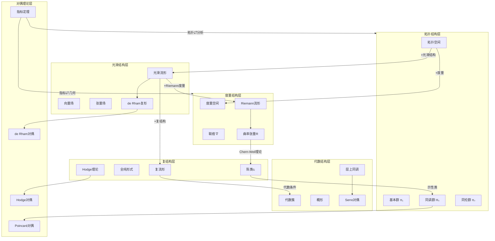
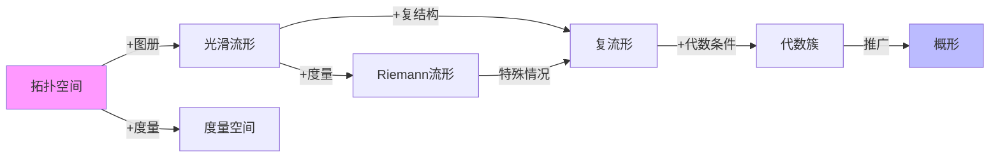
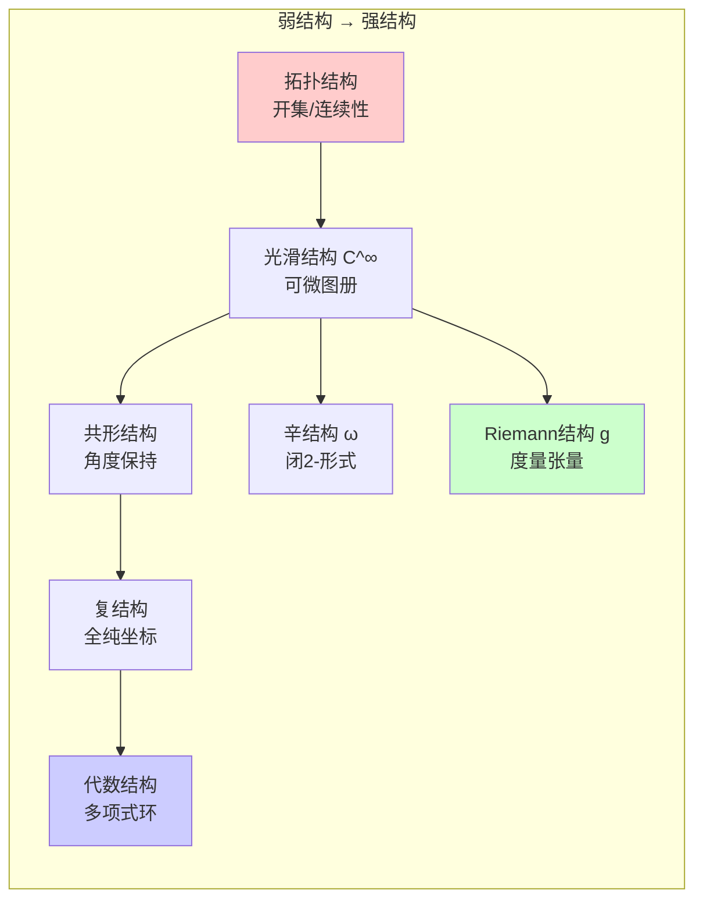
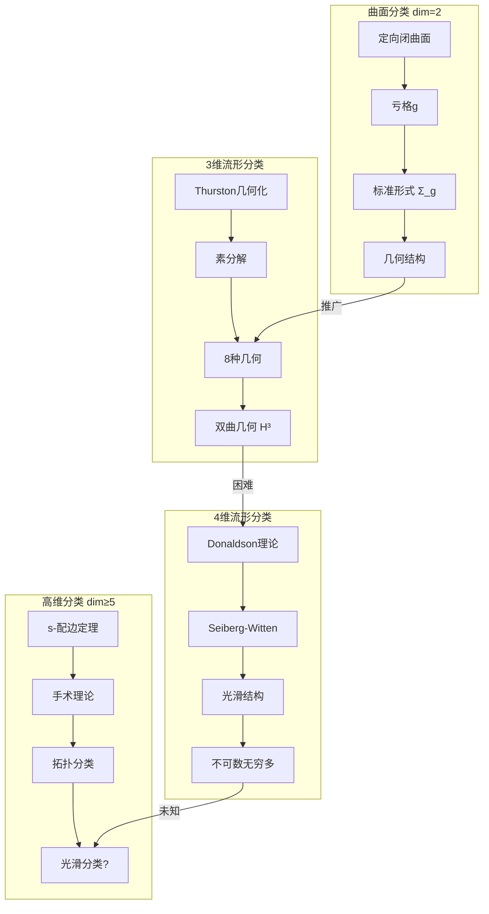

# 几何与拓扑关联总图

## 概述

本文档构建**几何与拓扑之间的完整关联网络**，梳理拓扑→几何→分析之间的递进、转化、对偶关系。

---

## 核心关联网络全景图



---

## 五大核心关联模块

### 模块1：拓扑→几何的递进结构

| 递进层级 | 基础结构 | 附加结构 | 结果结构 | 核心定理 |
|---------|---------|---------|---------|---------|
| 第1层 | 拓扑空间 | 光滑图册 | 光滑流形 | 流形结构存在性 |
| 第2层 | 光滑流形 | Riemann度量 | Riemann流形 | 度量存在性定理 |
| 第3层 | 光滑流形 | 复结构J | 复流形 | Newlander-Nirenberg |
| 第4层 | 复流形 | 代数嵌入 | 代数簇 | Chow定理 |
| 第5层 | 拓扑空间 | 度量d | 度量空间 | 诱导拓扑等价 |

**递进关系图：**



---

### 模块2：几何结构层次体系



**结构强度比较：**

$$
\text{拓扑} \subset \text{光滑} \subset \begin{cases} \text{复结构} \subset \text{代数} \\ \text{Riemann} \\ \text{辛} \end{cases}
$$

---

### 模块3：不变量关联网络

```mermaid
flowchart TB
    subgraph TOPINV["拓扑不变量"]
        P1[基本群 π₁]
        H[同调群 Hₙ]
        P2[同伦群 πₙ]
        E[Euler示性数 χ]
    end

    subgraph GEOMINV["几何不变量"]
        K[曲率K/数量曲率R]
        VOL[体积Vol]
        GEO[测地线]
        DG[测地完备性]
    end

    subgraph ALGINV["代数几何不变量"]
        C[陈类cᵢ]
        HD[Hodge数h^{p,q}]
        C2[Chern示性数]
    end

    subgraph ANAINV["分析不变量"]
        IN[指标Index(D)]
        SP[谱Spec(Δ)]
        ET[eta不变量]
    end

    P1 -->|Hurewicz| H
    H -->|示性类| C
    C -->|积分| C2
    C2 -->|Chern-Gauss-Bonnet| E

    K -->|积分| C2
    IN -->|Atiyah-Singer指标定理| TOPINV
    IN -->|分析证明| ANAINV

    HD -->|拓扑不变性| H

```

**关键公式：**

$$\text{Gauss-Bonnet: } \int_M K \, dA = 2\pi \chi(M)$$

$$\text{Atiyah-Singer: } \text{Index}(D) = \int_M \hat{A}(TM) \wedge \text{ch}(E)$$

---

### 模块4：对偶理论网络

```mermaid
flowchart TB
    subgraph DR["de Rham对偶"]
        DR1[k-形式ω^k] <-->|积分配对| DR2[奇异k-链C_k]

    end

    subgraph PD["Poincaré对偶"]
        PD1[H^k(M)] <-->|∩[M]| PD2[H_{n-k}(M)]

    end

    subgraph HDG["Hodge对偶"]
        HD1[Δ-调和形式] <-->*|星算子| HD2[互补形式]

    end

    subgraph SER["Serre对偶"]
        SER1[H^q(X,\mathcal{F})] <-->|典范丛K_X| SER2[H^{n-q}(X,\mathcal{F}^* \otimes K_X)]

    end

    subgraph GPD["广义Poincaré对偶"]
        GP1[H_c^k(M)] <-->|非紧| GP2[H_{n-k}(M)]

    end

    DR --> PD
    PD --> GPD
    HDG --> PD
    SER -->|层上同调| PD

```

**对偶关系表：**

| 对偶类型 | 对象A | 对象B | 配对方式 | 维数关系 |
|---------|------|------|---------|---------|
| de Rham | k-形式 | k-链 | 积分 | 相同 |
| Poincaré | H^k | H_{n-k} | 卡积 | 互补 |
| Hodge | p-形式 | (n-p)-形式 | 星算子 | 互补 |
| Serre | H^q(𝒪) | H^{n-q}(Ω^n) | 张量积 | 互补 |

---

### 模块5：流形分类理论关联



---

## 核心定理汇总

### 1. 指标定理（拓扑↔分析桥梁）

**Atiyah-Singer指标定理：**

设 $D$ 是紧流形 $M$ 上的椭圆微分算子，则：

$$\text{Index}(D) = \dim \ker D - \dim \text{coker} D = \int_M \text{ch}(\sigma(D)) \wedge \text{Td}(TM)$$

### 2. de Rham定理（拓扑↔几何）

$$H^k_{\text{dR}}(M) \cong H^k(M; \mathbb{R})$$

### 3. Hodge定理（分析→拓扑）

$$H^k_{\text{dR}}(M) \cong \mathcal{H}^k(M) = \{\omega \in \Omega^k : \Delta \omega = 0\}$$

### 4. Chern-Gauss-Bonnet（几何→拓扑）

$$\chi(M) = \frac{1}{(2\pi)^n} \int_M \text{Pf}(\Omega)$$

### 5. Thurston几何化定理（3维分类）

每个闭的、可定向的3维流形都可以沿球面和环面分解成**几何流形**的连通和。

---

## 文档导航

本系列包含以下详细文档：

1. **[01-拓扑到几何的递进结构.md](./01-拓扑到几何的递进结构.md)** - 从拓扑空间到代数簇的完整递进路径
2. **[02-几何结构层次体系.md](./02-几何结构层次体系.md)** - 几何结构的强度层次与相互关系
3. **[03-拓扑不变量与几何不变量.md](./03-拓扑不变量与几何不变量.md)** - 各类不变量及其转化关系
4. **[04-对偶理论网络.md](./04-对偶理论网络.md)** - 各类对偶理论的统一框架
5. **[05-流形分类理论关联.md](./05-流形分类理论关联.md)** - 各维度流形分类理论的关联

---

## 引用与参考

- [Atiyah-Singer, 1963] - The Index of Elliptic Operators
- [Thurston, 1982] - Three Dimensional Manifolds
- [Donaldson, 1983] - An Application of Gauge Theory
- [Hodge, 1941] - The Theory and Applications of Harmonic Integrals

---

*创建日期：2026年4月3日*
*版本：v1.0*
*所属项目：FormalMath 第十批推进计划 - 任务B2*
