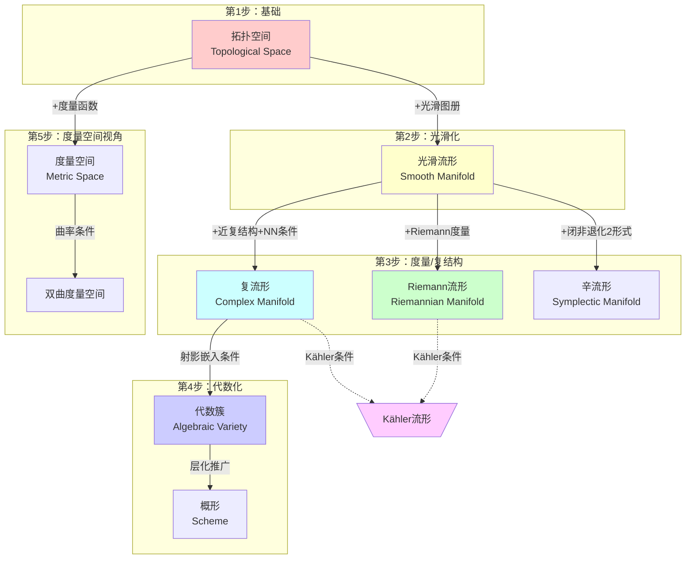
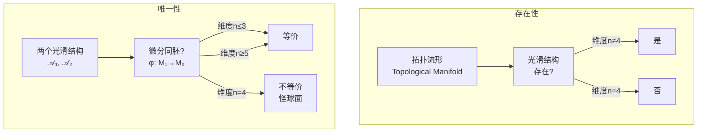
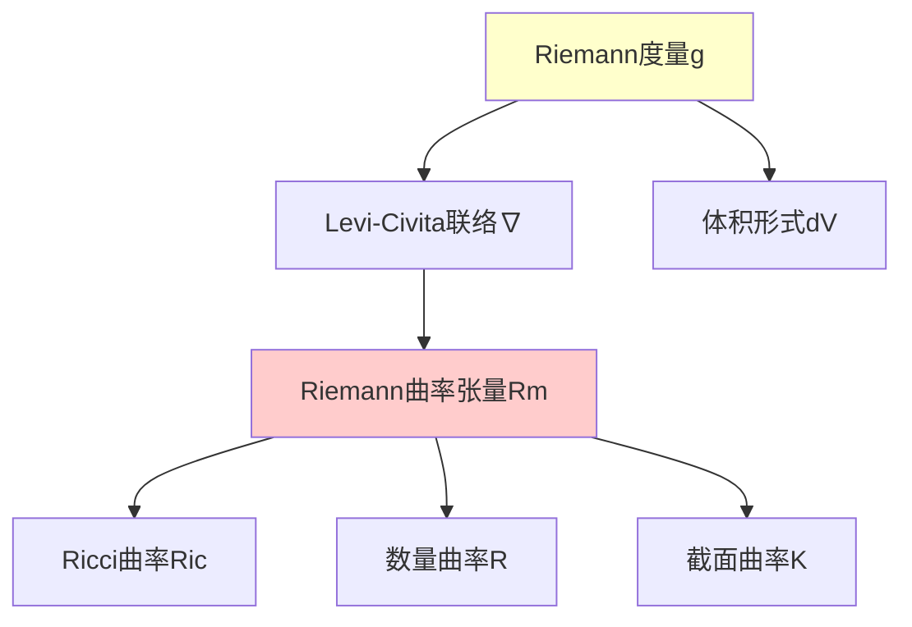
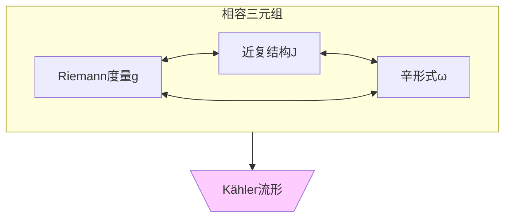

# 拓扑到几何的递进结构

## 概述

本文档系统梳理从**拓扑空间**到**代数簇**的完整递进路径，展示每一步需要添加的结构及其数学严格定义。

---

## 递进结构总览



---

## 第1层：拓扑空间 (Topological Space)

### 定义

**拓扑空间**是一个对 $(X, \mathcal{T})$，其中 $X$ 是集合，$\mathcal{T} \subseteq \mathcal{P}(X)$ 满足：

1. $\emptyset, X \in \mathcal{T}$
2. 任意并封闭：$\{U_i\}_{i \in I} \subseteq \mathcal{T} \Rightarrow \bigcup_{i \in I} U_i \in \mathcal{T}$
3. 有限交封闭：$U_1, U_2 \in \mathcal{T} \Rightarrow U_1 \cap U_2 \in \mathcal{T}$

### 基本不变量

| 不变量 | 定义 | 几何意义 |
|-------|------|---------|
| 连通性 | 不能分解为两个非空开集的不交并 | 空间的"一体性" |
| 紧致性 | 任意开覆盖有有限子覆盖 | "有限性"的拓扑类比 |
| Hausdorff性 | 任意两点有不相交邻域 | 分离性质 |
| 第二可数性 | 有可数的拓扑基 | 可度量化的必要条件 |

---

## 第2层：光滑流形 (Smooth Manifold)

### 递进：拓扑空间 → 光滑流形

**添加结构：** 光滑图册 (Smooth Atlas)

### 严格定义

**光滑流形** $M$ 是满足以下条件的拓扑空间：

1. **局部欧氏性**：$\forall p \in M$, $\exists$ 邻域 $U$ 和同胚 $\phi: U \to \mathbb{R}^n$（称为坐标卡）
2. **光滑相容性**：对任意两个坐标卡 $(U_\alpha, \phi_\alpha)$ 和 $(U_\beta, \phi_\beta)$，转移映射
   $$\phi_\beta \circ \phi_\alpha^{-1}: \phi_\alpha(U_\alpha \cap U_\beta) \to \phi_\beta(U_\alpha \cap U_\beta)$$
   是 $C^\infty$ 光滑的
3. **Hausdorff性和第二可数性**

### 例子

| 流形 | 维度 | 紧致性 | 说明 |
|-----|------|-------|------|
| $S^n$ (n维球面) | n | 紧致 | 最基本的有向闭流形 |
| $\mathbb{R}^n$ | n | 非紧 | 欧氏空间 |
| $T^n = (S^1)^n$ | n | 紧致 | n维环面 |
| $\mathbb{RP}^n$ | n | 紧致 | 实射影空间 |
| $Gr(k, n)$ | $k(n-k)$ | 紧致 | Grassmann流形 |

### 光滑结构的存在性与唯一性



**定理（Moise, 1952）：** 每个3维拓扑流形都有唯一的光滑结构。

**定理（Donaldson, 1983）：** $\mathbb{R}^4$ 有不可数多个互不等价的光滑结构（**怪 $R^4$**）。

---

## 第3层A：Riemann流形 (Riemannian Manifold)

### 递进：光滑流形 → Riemann流形

**添加结构：** Riemann度量 $g$

### 严格定义

**Riemann度量**是光滑地对每点 $p \in M$ 指定一个内积：

$$g_p: T_pM \times T_pM \to \mathbb{R}$$

满足：
- 双线性、对称、正定
- 光滑依赖于 $p$（在局部坐标中 $g_{ij}(x)$ 是光滑函数）

### 局部坐标表达式

在坐标 $(x^1, \ldots, x^n)$ 下：

$$g = \sum_{i,j=1}^n g_{ij}(x) \, dx^i \otimes dx^j$$

其中 $g_{ij} = g\left(\frac{\partial}{\partial x^i}, \frac{\partial}{\partial x^j}\right)$

### Riemann度量的存在性

**定理：** 每个光滑流形都可以装备Riemann度量。

**证明概要：** 
1. 利用单位分解将局部欧氏度量粘合
2. 凸组合保持正定性

### 导出结构



### 例子

| 流形 | 度量 | 曲率特性 |
|-----|------|---------|
| $\mathbb{R}^n$ | 欧氏度量 $g = \sum dx_i^2$ | 平坦（K=0） |
| $S^n$ | 诱导度量 | 正常数曲率（K=1） |
| $\mathbb{H}^n$ | Poincaré度量 | 负常数曲率（K=-1） |
| $T^n$ | 平坦度量 | 平坦 |

---

## 第3层B：复流形 (Complex Manifold)

### 递进：光滑流形 → 复流形

**添加结构：** 近复结构 $J$ + **可积性条件**

### 严格定义

**复流形** $M$ 是满足以下条件的拓扑空间：

1. 维数 $n = 2m$（实维数是偶数）
2. 有全纯图册：坐标卡之间的转移映射是**全纯函数**

等价地（光滑流形视角）：

**近复结构** $J: TM \to TM$ 满足 $J^2 = -I$

**可积性条件（Newlander-Nirenberg）：** Nijenhuis张量 $N_J = 0$

### Nijenhuis张量定义

$$N_J(X, Y) = [JX, JY] - J[JX, Y] - J[X, JY] - [X, Y]$$

### 例子

| 复流形 | 复维数 | 紧致性 | 代数性 |
|-------|-------|-------|-------|
| $\mathbb{C}^n$ | n | 否 | 否 |
| $\mathbb{CP}^n$ | n | 是 | 是（有理簇） |
| $T_\mathbb{C}^n = \mathbb{C}^n/\Lambda$ | n | 是 | 一般否 |
| 复Grassmannian $Gr_\mathbb{C}(k, n)$ | $k(n-k)$ | 是 | 是 |
| Calabi-Yau流形 | m | 是 | 部分 |

---

## 第3层C：辛流形 (Symplectic Manifold)

### 递进：光滑流形 → 辛流形

**添加结构：** 闭非退化2形式 $\omega$

### 严格定义

**辛结构** $\omega \in \Omega^2(M)$ 满足：

1. **闭性**：$d\omega = 0$
2. **非退化性**：$\forall v \neq 0$, $\exists w$ 使得 $\omega(v, w) \neq 0$

等价于：$\omega^n \neq 0$（体积形式）

### 与复结构的关系



**相容条件：** $\omega(X, Y) = g(JX, Y)$

---

## 第4层：代数簇 (Algebraic Variety)

### 递进：复流形 → 代数簇

**添加结构：** 射影嵌入条件

### 严格定义

**射影代数簇**是 $\mathbb{CP}^n$ 的某个子集 $X$，由齐次多项式的零点集定义：

$$X = \{(z_0 : \cdots : z_n) \in \mathbb{CP}^n : P_1(z) = \cdots = P_k(z) = 0\}$$

其中 $P_i$ 是齐次多项式。

### Chow定理

**定理：** 任何 $\mathbb{CP}^n$ 的紧复子流形都是代数簇。

### 概形的推广

```mermaid
flowchart TB
    VAR[代数簇<br/>Variety] --> SCH[概形<br/>Scheme]
    
    subgraph STRUCT["结构层"]
        OV[𝒪_V = 正则函数层]
        OS[𝒪_X = 环的层]
    end
    
    VAR --> OV
    SCH --> OS
    
    subgraph FIBER["纤维"]
        F1[经典点]
        F2[任意素理想<br/>作为"点"]
    end
    
    VAR --> F1
    SCH --> F2
    
    style SCH fill:#ccccff
```

---

## 第5层：度量空间视角

### 递进：拓扑空间 → 度量空间

**添加结构：** 度量函数 $d: X \times X \to \mathbb{R}_{\geq 0}$

### 严格定义

**度量空间**满足：

1. $d(x, y) = 0 \Leftrightarrow x = y$
2. $d(x, y) = d(y, x)$ （对称性）
3. $d(x, z) \leq d(x, y) + d(y, z)$ （三角不等式）

### 诱导拓扑

度量 $d$ 诱导拓扑 $T_d$，其中开球 $B(x, r) = \{y : d(x, y) < r\}$ 构成拓扑基。

**定理（Urysohn度量化）：** 拓扑空间可度量化当且仅当它是正则的且具有可数基。

### 从Riemann度量诱导的度量空间

```mermaid
flowchart TB
    subgraph RIEM["Riemann流形"]
        RM[(M,g)]
        GC[测地曲线γ]
        LG[长度L(γ)=∫√g(γ̇,γ̇)]
    end
    
    subgraph DIST["距离函数"]
        D[d(p,q)=inf{L(γ)}]
        MS[(M,d)]
    end
    
    RM --> GC
    GC --> LG
    LG --> D
    D --> MS
    
    style RM fill:#ccffcc
    style MS fill:#ffcccc
```

**Hopf-Rinow定理：** $(M, g)$ 完备（作为度量空间）$\Leftrightarrow$ 测地线可以无限延伸。

---

## 递进路径对比表

| 路径 | 起点 | 添加结构 | 终点 | 关键条件 |
|-----|------|---------|------|---------|
| 光滑化 | 拓扑空间 | 光滑图册 | 光滑流形 | 相容性 |
| Riemann化 | 光滑流形 | 内积场 $g$ | Riemann流形 | 正定性 |
| 复化 | 光滑流形 | 近复结构 $J$ | 复流形 | $N_J = 0$ |
| 辛化 | 光滑流形 | 闭2形式 $\omega$ | 辛流形 | $d\omega = 0$, 非退化 |
| 代数化 | 复流形 | 射影嵌入 | 代数簇 | Chow定理 |
| 度量化 | 拓扑空间 | 距离函数 $d$ | 度量空间 | 三角不等式 |

---

## 综合例子：Kähler流形

### 定义

**Kähler流形**是同时具有以下结构的光滑流形：

1. **Riemann结构** $g$
2. **近复结构** $J$
3. **辛结构** $\omega$

满足**相容条件**：

$$\omega(X, Y) = g(JX, Y)$$

且 $\omega$ 是**闭**的（$d\omega = 0$）。

### 重要性质

```mermaid
flowchart TB
    K[\Kähler流形/] --> HODGE[Hodge分解]
    K --> DD[d=d'+d'']
    K --> LAP[Δ=2Δ']=2Δ'']
    K --> DDG[强Lefschetz定理]
    
    HODGE --> H[Hp,q<br/>双次数分解]
    
    style K fill:#ffccff
    style HODGE fill:#ccffcc
```

### 例子

| Kähler流形 | 维数 | Hodge数特性 |
|-----------|------|------------|
| $\mathbb{CP}^n$ | n | $h^{p,p}=1$, 其余为0 |
| 复环面 | n | $h^{p,q} = \binom{n}{p}\binom{n}{q}$ |
| K3曲面 | 2 | $h^{0,0}=h^{2,0}=h^{0,2}=h^{2,2}=1$, $h^{1,1}=20$ |
| Calabi-Yau 3维 | 3 | $h^{1,1}, h^{2,1}$ 是可变模数 |

---

## 参考文献

1. Lee, J.M. - *Introduction to Smooth Manifolds* (2nd Ed.)
2. Lee, J.M. - *Riemannian Manifolds: An Introduction to Curvature*
3. Huybrechts, D. - *Complex Geometry: An Introduction*
4. Griffiths, P. & Harris, J. - *Principles of Algebraic Geometry*
5. Cannas da Silva, A. - *Lectures on Symplectic Geometry*

---

*文档编号：01*  
*创建日期：2026年4月3日*  
*所属项目：FormalMath 第十批推进计划 - 任务B2*
