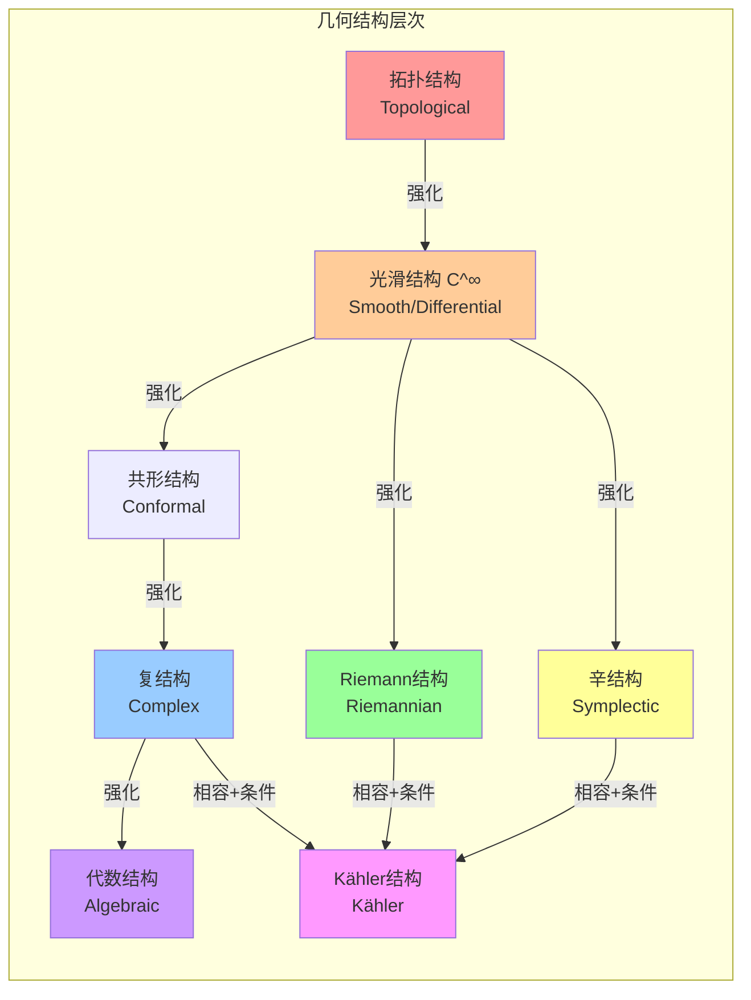
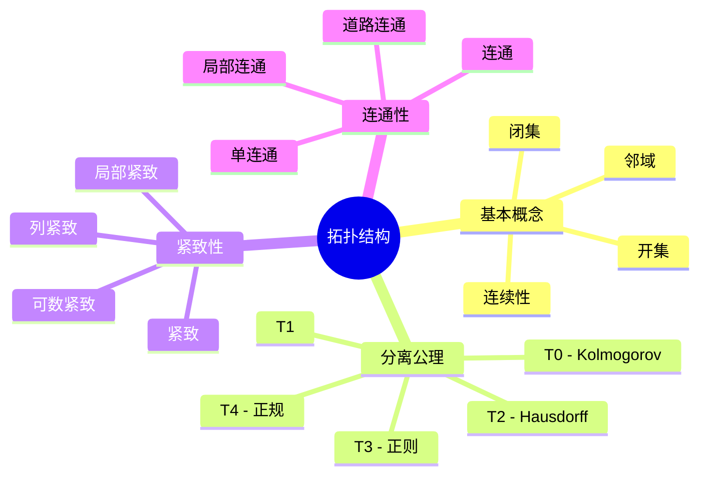
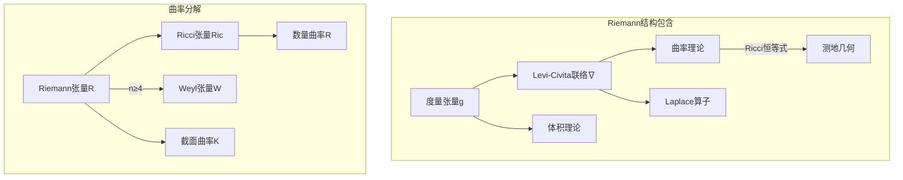
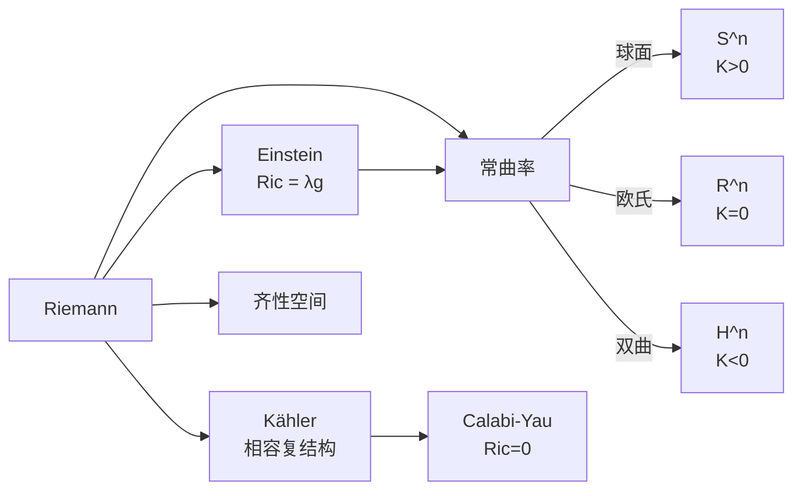
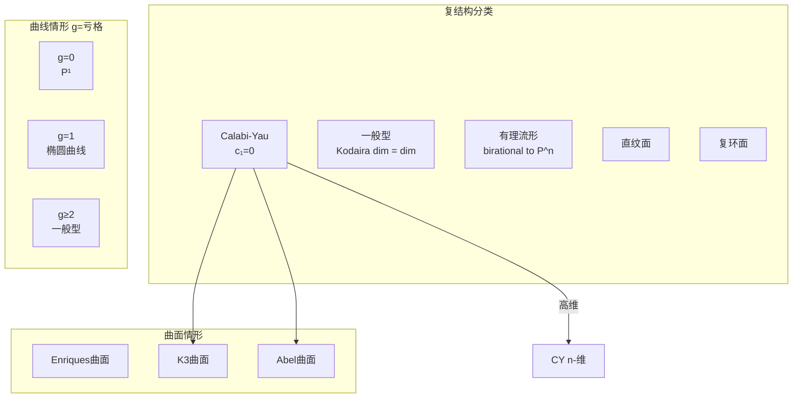
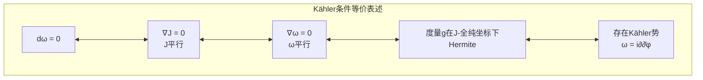
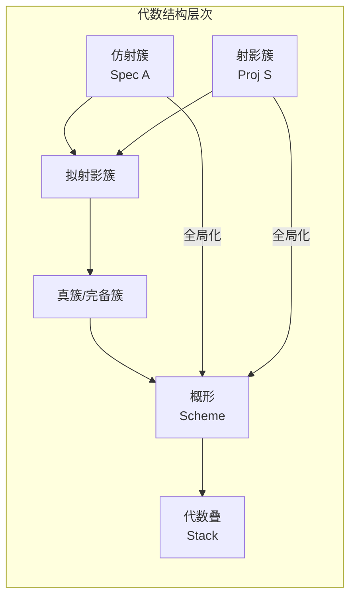
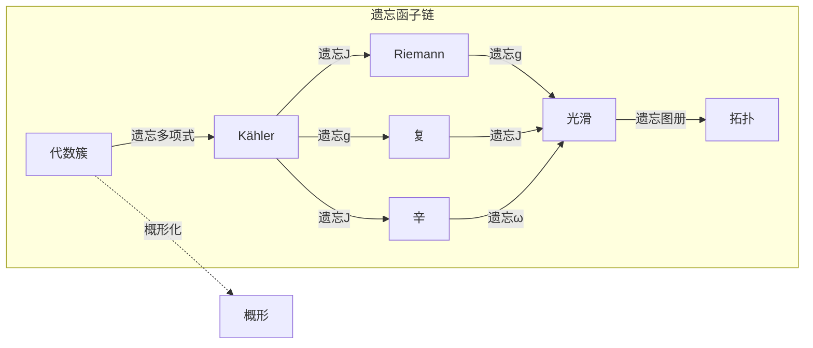
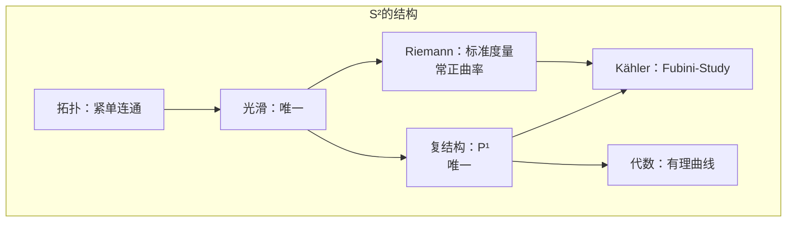

# 几何结构层次体系

## 概述

本文档系统阐述几何结构从弱到强的层次关系，展示不同结构之间的包含、相容与强化关系。

---

## 结构层次总览



---

## 第1层：拓扑结构 (Topological Structure)

### 定义回顾

拓扑结构是最弱的几何结构，只包含：

- **开集族** $\mathcal{T}$：描述"邻近性"
- **连续性**：映射 $f: X \to Y$ 连续当且仅当开集的原像是开集

### 核心概念



### 拓扑不变量（第1层）

| 不变量 | 类型 | 计算难度 |
|-------|------|---------|
| 连通分支数 | 数值 | 易 |
| 紧致性 | 性质 | 中 |
| Euler示性数 | 整数 | 中 |
| 基本群 | 群 | 难 |

---

## 第2层：光滑结构 (Smooth Structure)

### 递进：拓扑 → 光滑

**添加：** 光滑图册，使转移函数是 $C^\infty$ 的。

### 结构内容

```mermaid
flowchart TB
    subgraph SMOOTH["光滑结构包含"]
        ATLAS[光滑图册<br/>Smooth Atlas]
        TM[切丛 TM]
        TF[张量场]
        FORMS[微分形式 Ω^*(M)]
        DERIV[导子/向量场]
    end
    
    ATLAS --> TM
    TM --> DERIV
    TM --> TF
    TF --> FORMS

```

### 光滑结构的分类问题

| 维度 | 存在性 | 唯一性 | 备注 |
|-----|-------|-------|------|
| dim ≤ 3 | 是 | 是 | Moise定理 |
| dim = 4 | 是 | **否** | 怪 $R^4$ |
| dim ≥ 5 | 是 | 拓扑障碍 | 手术理论 |

### 核心工具

- **de Rham复形：** $(\Omega^*(M), d)$
- **Cartan魔法公式：** $\mathcal{L}_X = d \circ i_X + i_X \circ d$

---

## 第3层A：Riemann结构 (Riemannian Structure)

### 递进：光滑 → Riemann

**添加：** 正定对称2-张量场 $g$（Riemann度量）

### 结构内容



### 曲率分解公式

**Riemann曲率张量分解（n ≥ 4）：**

$$R_{ijkl} = W_{ijkl} + \frac{1}{n-2}(g_{ik}R_{jl} - g_{il}R_{jk} + g_{jl}R_{ik} - g_{jk}R_{il}) + \frac{R}{(n-1)(n-2)}(g_{ik}g_{jl} - g_{il}g_{jk})$$

### Riemann结构的强化分支



---

## 第3层B：复结构 (Complex Structure)

### 递进：光滑 → 复

**添加：** 近复结构 $J$ + 可积性条件 ($N_J = 0$)

### 结构内容

```mermaid
flowchart TB
    subgraph COMPLEX["复结构包含"]
        J[近复结构J<br/>J²=-I]
        HOL[全纯坐标<br/>(z¹,...,zⁿ)]
        DOL[Dolbeault算子<br/>∂, ∂̄]
        BUN[全纯向量丛]
        SHEAF[结构层𝒪_M]
    end
    
    J -->|可积性| HOL

    HOL --> DOL
    HOL --> BUN
    HOL --> SHEAF
    
    DOL --> DOLC[Dolbeault复形<br/>(A^{p,•}, ∂̄)]
    DOLC --> SHEAF

```

### Dolbeault同构

$$H^{p,q}_{\bar{\partial}}(M) \cong H^q(M, \Omega^p)$$

其中 $\Omega^p$ 是全纯 $p$-形式的层。

### 复结构的分类



---

## 第3层C：辛结构 (Symplectic Structure)

### 递进：光滑 → 辛

**添加：** 闭非退化2-形式 $\omega$

### 结构内容

```mermaid
flowchart TB
    subgraph SYMP["辛结构包含"]
        OMEGA[辛形式ω<br/>dω=0, ωⁿ≠0]
        HAM[Hamilton向量场]
        POIS[Poisson括号<br/>{f,g}]
        MOM[动量映射]
        LAG[Lagrange子流形]
    end
    
    OMEGA -->|收缩| HAM

    OMEGA --> POIS
    HAM -->|群作用| MOM

    OMEGA --> LAG
    
    subgraph HAMILTON["Hamilton力学"]
        HVF[X_H = ω^{-1}(dH)]
        FLOW[Hamilton流<br/>φ_H^t]
        CONS[守恒量<br/>{H,f}=0]
    end
    
    HAM --> HVF
    HVF --> FLOW
    POIS --> CONS

```

### Darboux定理

**定理：** 任意辛流形 $(M, \omega)$ 局部辛同构于 $(\mathbb{R}^{2n}, \omega_0)$，其中

$$\omega_0 = \sum_{i=1}^n dx_i \wedge dy_i$$

**意义：** 辛结构没有局部不变量（不同于Riemann几何）！

### 辛结构的障碍

辛结构存在的拓扑障碍：

1. **维数：** 必须为偶数
2. **近可辛：** 存在非退化2-形式（不一定闭）
3. **上同调：** $[\omega] \in H^2(M; \mathbb{R})$ 必须非零

---

## 第4层：Kähler结构 (Kähler Structure)

### 定义

Kähler结构是**三重相容**的结构：

$$(M, g, J, \omega)$$

满足：
- $(M, g)$ 是Riemann流形
- $(M, J)$ 是复流形
- $(M, \omega)$ 是辛流形
- **相容条件：** $\omega(X, Y) = g(JX, Y)$
- **Kähler条件：** $d\omega = 0$

### 等价刻画



### Kähler结构的重要性

```mermaid
flowchart TB
    K[\Kähler结构/] --> HODGE[Hodge理论]
    K --> CHERN[Chern类表示]
    K --> KOD[Kodaira嵌入]
    K --> LEFF[Lefschetz定理]
    
    HODGE -->|H^{p,q}| DECOMP[Hodge分解<br/>H^k = ⊕_{p+q=k} H^{p,q}]
    CHERN -->|曲率| CCW[Chern-Weil理论]
    KOD -->|正线丛| ALGEBRAIC[射影代数簇]
    LEFF -->|强Lefschetz| HDG[Hard Lefschetz]
    
    DECOMP --> SYM[Hodge对称<br/>h^{p,q} = h^{q,p}]
    DECOMP --> SER[Serre对偶<br/>h^{p,q} = h^{n-p,n-q}]
    
    style K fill:#ff99ff

```

### Kähler流形的例子

| 流形 | 维数 | Kähler形式 | 说明 |
|-----|------|-----------|------|
| $\mathbb{C}^n$ | n | $\frac{i}{2}\sum dz_j \wedge d\bar{z}_j$ | 平坦 |
| $\mathbb{CP}^n$ | n | Fubini-Study形式 | 正曲率 |
| 复环面 | n | 平坦度量诱导 | Ricci平坦 |
| K3曲面 | 2 | Calabi-Yau度量 | Ricci平坦 |
| 复Grassmannian | $k(n-k)$ | Plücker嵌入诱导 | 对称空间 |

---

## 第5层：代数结构 (Algebraic Structure)

### 递进：复/Kähler → 代数

**添加：** 由多项式方程定义的结构

### 层次关系



### 概形的推广

| 概念 | 空间 | 结构层 | 点集 |
|-----|------|-------|------|
| 簇 | 经典代数几何对象 | 正则函数层 | 闭点 |
| 概形 | 局部仿射的环化空间 | 任意交换环的层 | 素理想 |
| Deligne-Mumford叠 | 带自同构的概形 | 概形的2-范畴推广 | 带稳定化的点 |

---

## 结构层次对比表

| 结构 | 核心对象 | 关键条件 | 局部模型 | 主要不变量 |
|-----|---------|---------|---------|-----------|
| 拓扑 | 开集 | 分离公理 | 欧氏空间 | 同伦群、同调 |
| 光滑 | 图册 | 相容性 | $\mathbb{R}^n$ | de Rham上同调 |
| Riemann | 度量 $g$ | 正定性 | $(\mathbb{R}^n, \delta_{ij})$ | 曲率、特征值 |
| 复 | 近复结构 $J$ | $N_J = 0$ | $\mathbb{C}^n$ | Hodge数 |
| 辛 | 2-形式 $\omega$ | $d\omega = 0$, 非退化 | $(\mathbb{R}^{2n}, \omega_0)$ | 上同调类 $[\omega]$ |
| Kähler | $(g, J, \omega)$ | 相容 + $d\omega = 0$ | $(\mathbb{C}^n, g_{eucl})$ | Hodge结构 |
| 代数 | 多项式零点 | 不可约性 | $V(I) \subset \mathbb{A}^n$ | 代数不变量 |

---

## 结构间的遗忘函子



**定理：** 遗忘函子保持某些拓扑性质（如基本群），但可能改变其他性质。

---

## 具体例子分析

### 例子1：$S^2$（2维球面）



### 例子2：$T^2 = S^1 \times S^1$（2维环面）

| 结构 | 情况 | 模空间 |
|-----|------|-------|
| 拓扑 | 同伦等价类唯一 | 单点 |
| 光滑 | 唯一 | 单点 |
| Riemann | 平坦度量（moduli维数2） | 上半平面/PSL(2,Z) |
| 复 | 椭圆曲线 | $\mathbb{H}/SL(2,\mathbb{Z})$ |
| Kähler | 所有复结构都是Kähler | 同上 |

### 例子3：K3曲面

- **拓扑：** 单连通，$b_2 = 22$
- **光滑：** 唯一
- **复结构：** 20维族（由周期映射描述）
- **Kähler：** 每个复结构都是Kähler（Siu定理）
- **Ricci平坦：** Yau定理保证存在唯一的Ricci平坦Kähler度量

---

## 参考文献

1. Ballmann, W. - *Lectures on Kähler Manifolds*
2. Voisin, C. - *Hodge Theory and Complex Algebraic Geometry*
3. Cannas da Silva, A. - *Lectures on Symplectic Geometry*
4. Besse, A.L. - *Einstein Manifolds*
5. Hartshorne, R. - *Algebraic Geometry*

---

*文档编号：02*  
*创建日期：2026年4月3日*  
*所属项目：FormalMath 第十批推进计划 - 任务B2*
