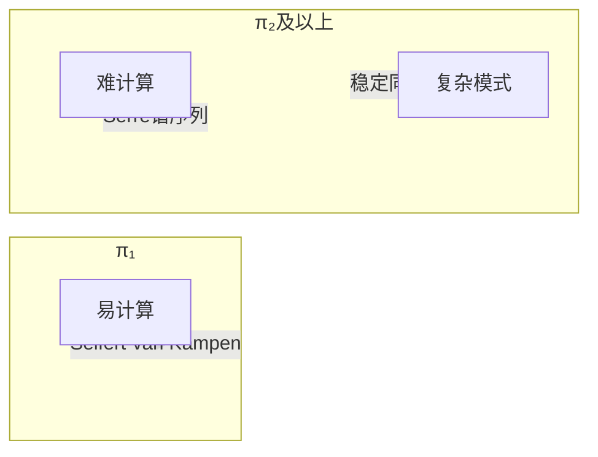
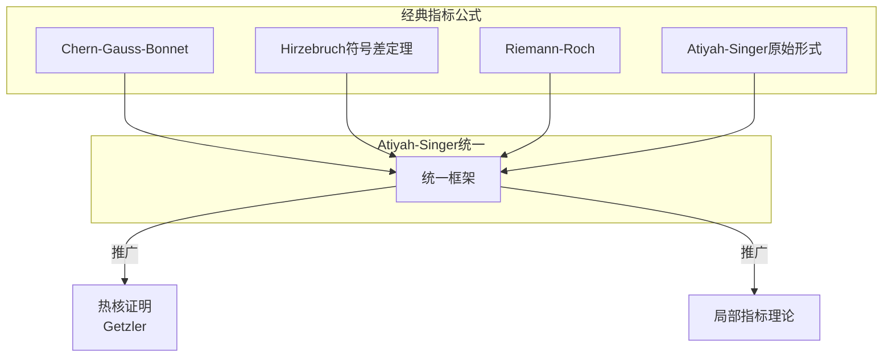
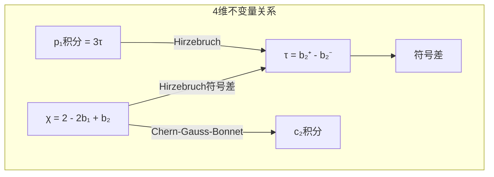

# 拓扑不变量与几何不变量

## 概述

本文档系统阐述拓扑不变量与几何不变量之间的关系，展示它们如何通过指标定理、示性类等工具相互转化。

---

## 不变量关联网络总览

```mermaid
flowchart TB
    subgraph TOP["拓扑不变量"]
        P1[基本群 π₁]
        H[同调/上同调 H_* / H^*]
        P2[高阶同伦群 πₙ]
        E[Euler示性数 χ]
        B[Betti数 b_i]
        SG[配边类 Ω_*]
    end
    
    subgraph GEOM["几何不变量"]
        K[曲率<br/>Riemann/Ricci/数量]
        VOL[体积]
        GEO[测地线/闭测地线]
        DG[测地完备性]
        SYM[对称群]
    end
    
    subgraph ALGGEO["代数几何不变量"]
        CH[陈类 c_i]
        TD[Todd类]
        ACH[A类]
        L[L类]
        HD[Hodge数 h^{p,q}]
        CHN[Chern示性数]
    end
    
    subgraph ANAL["分析不变量"]
        IDX[椭圆算子指标]
        SP[Laplace谱]
        ETA[eta不变量]
        DET[行列式行列式]
        Z[热核zeta函数]
    end
    
    subgraph LINK["连接桥梁"]
        DR[de Rham同构]
        CW[Chern-Weil理论]
        AS[Atiyah-Singer<br/>指标定理]
        CGB[Chern-Gauss-Bonnet]
        HOD[Hodge理论]
    end
    
    P1 -->|Hurewicz| H
    H -->|示性类| CH
    CH -->|积分| CHN
    CHN --> CGB
    CGB -->|几何→拓扑| E
    
    K --> CW
    CW -->|曲率→拓扑| CH
    
    AS -->|分析→拓扑| IDX
    AS -->|拓扑→几何| H
    
    HOD -->|调和形式| H
    HOD -->|Laplace| SP
    
    E -->|Euler-Poincaré| B
    HD -->|Hodge对称| B
```

---

## 第一部分：拓扑不变量

### 1.1 基本群与同伦论

#### 基本群 $\pi_1(X, x_0)$

**定义：** 基于点 $x_0$ 的回路同伦等价类，以回路拼接为乘法：

$$\pi_1(X, x_0) = \{[\gamma] : \gamma: [0,1] \to X, \gamma(0)=\gamma(1)=x_0\}$$

**例子：**

| 空间 | 基本群 | 单连通性 |
|-----|-------|---------|
| $S^n$ ($n \geq 2$) | $\{1\}$ | 是 |
| $S^1$ | $\mathbb{Z}$ | 否 |
| $T^n = (S^1)^n$ | $\mathbb{Z}^n$ | 否 |
| $\mathbb{RP}^n$ ($n \geq 2$) | $\mathbb{Z}/2\mathbb{Z}$ | 否 |
| 亏格 $g$ 曲面 $\Sigma_g$ | $\langle a_1, b_1, \ldots, a_g, b_g | \prod [a_i, b_i] = 1 \rangle$ | 否 |

#### 高阶同伦群 $\pi_n(X, x_0)$ ($n \geq 2$)

**定义：** 

$$\pi_n(X, x_0) = \{[f] : f: (S^n, s_0) \to (X, x_0)\}$$

**性质：** $n \geq 2$ 时，$\pi_n$ 是**Abel群**。

**球面同伦群计算难度：**



### 1.2 同调与上同调

#### 奇异同调 $H_*(X; G)$

**链复形：**

$$\cdots \to C_{n+1}(X) \xrightarrow{\partial_{n+1}} C_n(X) \xrightarrow{\partial_n} C_{n-1}(X) \to \cdots$$

**同调群：** $H_n(X) = \ker \partial_n / \text{im} \partial_{n+1}$

#### 上同调 $H^*(X; G)$

**上链复形：**

$$\cdots \leftarrow C^{n+1}(X) \xleftarrow{\delta^n} C^n(X) \xleftarrow{\delta^{n-1}} C^{n-1}(X) \leftarrow \cdots$$

**上同调环：** $H^*(X)$ 具有杯积结构 $\smile: H^p \times H^q \to H^{p+q}$

#### Betti数与Euler示性数

$$b_i = \dim H_i(X; \mathbb{Q})$$

$$\chi(X) = \sum_{i=0}^n (-1)^i b_i$$

---

## 第二部分：几何不变量

### 2.1 曲率不变量

```mermaid
flowchart TB
    subgraph CURV["曲率层次"]
        R[Riemann曲率张量<br/>R(X,Y)Z]
        SEC[截面曲率<br/>K(Π)]
        RIC[Ricci曲率<br/>Ric(X,Y)]
        SCAL[数量曲率<br/>R = tr(Ric)]
    end
    
    R --> SEC
    R --> RIC
    RIC --> SCAL
```

#### 各曲率的定义

**截面曲率：** 对2维子空间 $\Pi \subset T_pM$，设 $\{e_1, e_2\}$ 为标准正交基：

$$K(\Pi) = \langle R(e_1, e_2)e_2, e_1 \rangle$$

**Ricci曲率：**

$$\text{Ric}(X, Y) = \text{tr}(Z \mapsto R(Z, X)Y) = \sum_i \langle R(e_i, X)Y, e_i \rangle$$

**数量曲率：**

$$R = \sum_i \text{Ric}(e_i, e_i)$$

#### 曲率与拓扑的关系

| 曲率条件 | 拓扑推论 | 定理 |
|---------|---------|------|
| $K > 0$ (正常曲率) | 有限基本群 | Bonnet-Myers |
| $K \leq 0$ (非正曲率) | $K(\pi, 1)$ 空间 | Cartan-Hadamard |
| $Ric > 0$ | 有限基本群 | Myers定理 |
| $Ric = 0$ | 特殊结构 | Cheeger-Gromoll分裂 |
| $R > 0$ (数量曲率正) | 拓扑障碍 | 指标定理、Schoen-Yau |

### 2.2 体积与测地线

#### 体积比较

**Bishop-Gromov体积比较：**

若 $Ric \geq (n-1)k$，则体积增长受限于常曲率空间：

$$\frac{\text{Vol}(B(p, r))}{\text{Vol}(B_k(r))} \text{ 不增 }$$

其中 $B_k(r)$ 是常曲率 $k$ 空间中的测地球。

#### 闭测地线

**例子：**

| 流形 | 闭测地线数量 | 说明 |
|-----|------------|------|
| $S^n$ | 无穷多 | 所有大圆 |
| $T^n$ | 无穷多 | 有理斜率直线 |
| 负曲率闭流形 | 无穷多 | 每条共轭类对应一条 |

---

## 第三部分：代数几何不变量

### 3.1 示性类理论

```mermaid
flowchart TB
    subgraph CHAR["示性类理论"]
        C[Chern类 c_i(E)]
        P[Pontryagin类 p_i(E)]
        E[Euler类 e(E)]
        ST[Stiefel-Whitney类 w_i(E)]
    end
    
    subgraph THEORY["构造理论"]
        CW[Chern-Weil理论<br/>曲率形式]
        AX[公理化方法]
        SS[分裂原理]
    end
    
    C --> CW
    P -->|实丛的c_{2i}| C
    E -->|定向实丛| C
    ST -->|mod 2约化| C
```

#### Chern类的定义与性质

**定义（公理化）：** 复向量丛 $E \to M$ 的全Chern类 $c(E) = 1 + c_1(E) + c_2(E) + \cdots$ 满足：

1. **自然性：** $c(f^*E) = f^*c(E)$
2. **Whitney和：** $c(E \oplus F) = c(E) \smile c(F)$
3. **归一化：** 对于 $\mathbb{CP}^1$ 上的典则线丛，$\int_{\mathbb{CP}^1} c_1 = -1$

**Chern-Weil表达式：**

设 $\nabla$ 是 $E$ 上的联络，曲率形式 $\Omega \in \Omega^2(M, \text{End}(E))$，则：

$$c(E) = \det\left(I + \frac{i}{2\pi}\Omega\right)$$

展开得：

$$c_1(E) = \frac{i}{2\pi} \text{tr}(\Omega)$$

$$c_2(E) = \frac{1}{2}\left(\frac{i}{2\pi}\right)^2 [\text{tr}(\Omega)^2 - \text{tr}(\Omega^2)]$$

### 3.2 示性数

#### 定义

对 $2n$ 维闭定向流形 $M$ 和示性类 $P(c_1, \ldots, c_n)$：

$$P[M] = \int_M P(c_1(TM), \ldots, c_n(TM))$$

#### 重要示性数

| 示性数 | 表达式 | 几何意义 |
|-------|-------|---------|
| Chern数 | $c_{i_1} \cdots c_{i_k}[M]$ | 复流形不变量 |
| Todd亏格 | $\text{Td}(M)[M]$ | 算术亏格 |
| $\hat{A}$亏格 | $\hat{A}(M)[M]$ | 自旋流形、指标 |
| L亏格 | $L(M)[M]$ | 符号差 |

---

## 第四部分：分析不变量

### 4.1 椭圆算子指标

#### 定义

设 $D: \Gamma(E) \to \Gamma(F)$ 是椭圆微分算子，其**解析指标**：

$$\text{ind}(D) = \dim \ker D - \dim \text{coker} D = \dim \ker D - \dim \ker D^*$$

#### 经典椭圆算子

```mermaid
flowchart TB
    subgraph ELLIPTIC["经典椭圆算子"]
        DD[de Rham算子<br/>d + d^*]
        SD[符号差算子<br/>d + d^*: Ω^+ → Ω^-]
        DDOL[Dolbeault算子<br/>∂̄ + ∂̄^*]
        DIRAC[Dirac算子<br/>D = γ^i ∇_i]
    end
    
    subgraph INDICES["对应指标"]
        I1[Euler示性数 χ(M)]
        I2[Hirzebruch符号差 sign(M)]
        I3[算术亏格 χ(M,𝒪)]
        I4[Â亏格 Â(M)]
    end
    
    DD --> I1
    SD --> I2
    DDOL --> I3
    DIRAC --> I4
```

### 4.2 谱不变量

#### Laplace谱

对Riemann流形 $(M, g)$，Laplace-Beltrami算子：

$$\Delta f = -\text{div}(\text{grad} f) = -\frac{1}{\sqrt{|g|}} \partial_i(\sqrt{|g|} g^{ij} \partial_j f)$$

谱：$0 = \lambda_0 < \lambda_1 \leq \lambda_2 \leq \cdots \to \infty$

**Weyl渐近定律：**

$$N(\lambda) \sim \frac{\omega_n \text{Vol}(M)}{(2\pi)^n} \lambda^{n/2}, \quad \lambda \to \infty$$

其中 $N(\lambda)$ 是小于 $\lambda$ 的特征值个数。

---

## 第五部分：不变量之间的转化关系

### 5.1 de Rham同构（几何→拓扑）

**定理：** 

$$H^k_{\text{dR}}(M) \cong H^k(M; \mathbb{R})$$

**意义：** 微分形式的上同调（几何）= 奇异上同调（拓扑）

### 5.2 Hodge定理（分析→拓扑）

**定理：** 

$$H^k_{\text{dR}}(M) \cong \mathcal{H}^k(M) = \{\omega \in \Omega^k : \Delta \omega = 0\}$$

**意义：** 调和形式代表上同调类

### 5.3 Chern-Gauss-Bonnet（曲率→拓扑）

**定理：**

$$\chi(M) = \left(\frac{i}{2\pi}\right)^n \int_M \text{Pf}(\Omega)$$

**2维情形：**

$$\chi(M) = \frac{1}{4\pi} \int_M R \, dA = \frac{1}{2\pi} \int_M K \, dA$$

### 5.4 Atiyah-Singer指标定理（拓扑↔分析）

**定理：**

设 $D$ 是紧定向流形 $M$ 上的椭圆算子，则：

$$\text{ind}(D) = \int_M \text{ch}(\sigma(D)) \wedge \text{Td}(TM) \wedge \text{ch}(E)$$

#### 经典应用



**具体公式：**

| 算子 | 解析指标 | 拓扑指标 |
|-----|---------|---------|
| $d + d^*: \Omega^{\text{even}} \to \Omega^{\text{odd}}$ | $\chi(M)$ | $\int_M e(TM)$ |
| 符号差算子 | $\text{sign}(M)$ | $\int_M L(TM)$ |
| Dolbeault算子 $\bar{\partial} + \bar{\partial}^*$ | $\chi(M, \mathcal{O})$ | $\int_M \text{Td}(TM)$ |
| Dirac算子 | $\hat{A}(M)$ | $\int_M \hat{A}(TM)$ |

### 5.5 指标定理的完整网络

```mermaid
flowchart TB
    subgraph GEOMDATA["几何数据"]
        VEC[向量丛E,F]
        SYM[象征σ(D)]
        DIFF[微分算子D]
    end
    
    subgraph ANA["分析侧"]
        KER[ker D]
        COK[coker D]
        ANAIND[分析指标<br/>dim ker - dim coker]
    end
    
    subgraph TOP["拓扑侧"]
        CH[陈类ch(E)]
        TD[Todd类Td(TM)]
        AHA[A类Â(TM)]
        TOPIND[拓扑指标<br/>∫ ch(σ)·Td]
    end
    
    VEC --> DIFF
    SYM --> DIFF
    DIFF --> ANAIND
    
    VEC --> CH
    CH --> TOPIND
    TD --> TOPIND
    
    ANAIND <-->|Atiyah-Singer| TOPIND
    
    style ANAIND fill:#ffcccc
    style TOPIND fill:#ccffcc
```

---

## 第六部分：综合例子

### 例子1：$S^2$的不变量

```mermaid
flowchart TB
    subgraph S2TOP["拓扑不变量"]
        T1[π₁ = 0]
        T2[H⁰ = H² = ℤ, H¹ = 0]
        T3[b₀ = b₂ = 1, b₁ = 0]
        T4[χ = 2]
    end
    
    subgraph S2GEOM["几何不变量"]
        G1[K = 1]
        G2[Vol = 4π]
        G3[∫ K dA = 4π]
    end
    
    subgraph S2ALG["代数几何不变量"]
        A1[c₁(TS²) = 2]
        A2[∫ c₁ = 2 = χ]
    end
    
    T4 <-->|Gauss-Bonnet| G3
    T4 <-->|Chern-Gauss-Bonnet| A2
    G3 -->|曲率积分| G1
    G1 -->|Chern-Weil| A1
```

### 例子2：K3曲面的不变量

| 不变量 | 值 | 说明 |
|-------|-----|------|
| $\pi_1$ | 0 | 单连通 |
| $b_2$ | 22 | 第二Betti数 |
| $h^{2,0}$ | 1 | 全纯2形式 |
| $h^{1,1}$ | 20 | (1,1)-形式 |
| $\chi$ | 24 | Euler示性数 |
| $\tau$ (符号差) | -16 | L类积分 |
| $\hat{A}$ | 2 | Dirac指标 |
| $c_2$ | 24 | 第二Chern类积分 |

### 例子3：4维流形的不变量比较



---

## 参考文献

1. Bott, R. & Tu, L.W. - *Differential Forms in Algebraic Topology*
2. Freed, D.S. & Uhlenbeck, K.K. - *Instantons and Four-Manifolds*
3. Berline, N., Getzler, E. & Vergne, M. - *Heat Kernels and Dirac Operators*
4. Roe, J. - *Elliptic Operators, Topology and Asymptotic Methods*
5. Gilkey, P.B. - *Invariance Theory, the Heat Equation, and the Atiyah-Singer Index Theorem*

---

*文档编号：03*  
*创建日期：2026年4月3日*  
*所属项目：FormalMath 第十批推进计划 - 任务B2*
