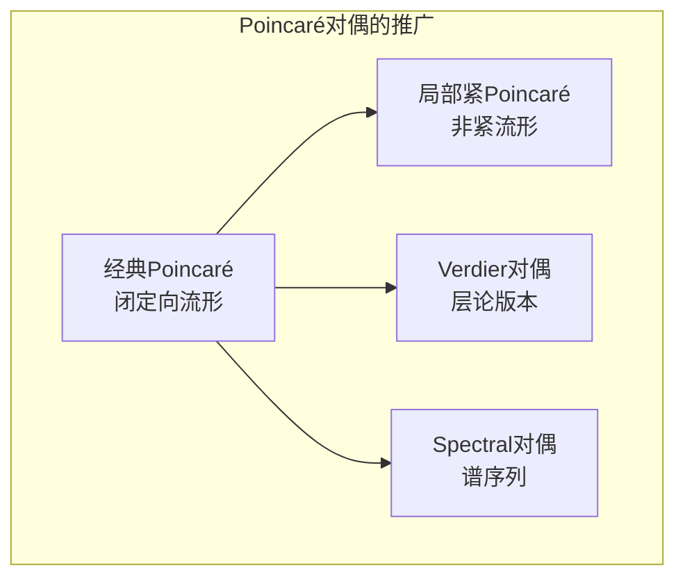
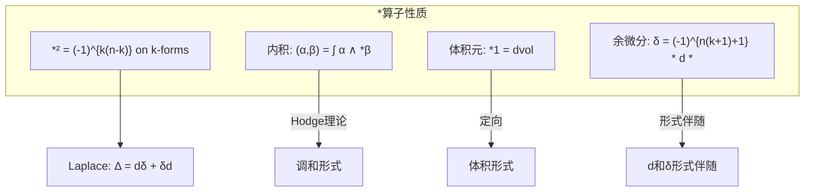
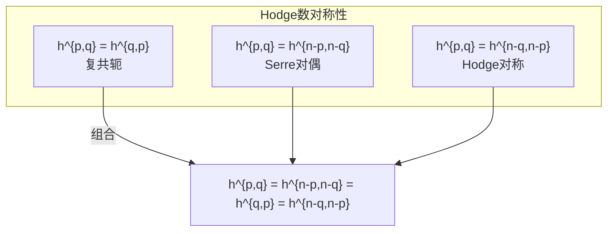
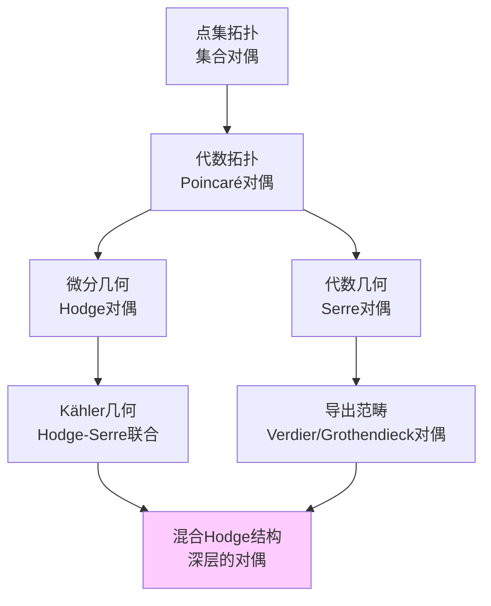

# 对偶理论网络

## 概述

本文档系统阐述几何与拓扑中的各类对偶理论，展示它们之间的关联与统一框架。

---

## 对偶理论总览

```mermaid
flowchart TB
    subgraph DUALITY["对偶理论全景"]
        DR[de Rham对偶<br/>形式↔链]
        PD[Poincaré对偶<br/>H^k↔H_{n-k}]
        HD[Hodge对偶<br/>*算子]
        SER[Serre对偶<br/>层上同调]
        GD[Grothendieck对偶<br/>导出范畴]
        PDG[Poincaré-Verdier对偶<br/>Verdier对偶]
    end
    
    subgraph CONTEXT["应用背景"]
        TOP[代数拓扑]
        DIFF[微分几何]
        COMP[复几何]
        ALG[代数几何]
        DER[导出代数几何]
    end
    
    DR --> DIFF
    DR --> TOP
    PD --> TOP
    PD --> DIFF
    HD --> DIFF
    HD --> COMP
    SER --> COMP
    SER --> ALG
    GD --> ALG
    PDG --> DER
    
    DR -->|推广| PD
    PD -->|复化| HD
    PD -->|层化| SER
    SER -->|导出化| GD
    PD -->|导出化| PDG

```

---

## 一、de Rham对偶

### 1.1 基本概念

**de Rham对偶**建立了**微分形式**与**奇异链**之间的配对：

$$\langle \cdot, \cdot \rangle: \Omega^k(M) \times C_k(M) \to \mathbb{R}$$

$$\langle \omega, c \rangle = \int_c \omega$$

### 1.2 Stokes定理

**定理：**

$$\langle d\omega, c \rangle = \langle \omega, \partial c \rangle$$

即：

$$\int_c d\omega = \int_{\partial c} \omega$$

### 1.3 de Rham同构

```mermaid
flowchart TB
    subgraph FORM["微分形式侧"]
        OMEGA[Ω^k(M)]
        D[d: Ω^k → Ω^{k+1}]
        HDR[H^k_{dR}(M) = ker d / im d]
    end
    
    subgraph COHOM["上同调侧"]
        C[C^k(M; ℝ)]
        DELTA[δ: C^k → C^{k+1}]
        HS[H^k(M; ℝ) = ker δ / im δ]
    end
    
    OMEGA <-->|积分配对| C
    D <-->|Stokes| DELTA
    HDR <-->|de Rham定理| HS

```

**定理（de Rham）：** 

$$H^k_{\text{dR}}(M) \cong H^k(M; \mathbb{R})$$

### 1.4 周期映射

对 $\omega \in \mathcal{H}^k(M)$（调和形式）和 $[c] \in H_k(M; \mathbb{Z})$：

$$\text{per}_{[c]}(\omega) = \int_c \omega$$

**例子：** $T^2 = \mathbb{R}^2 / \mathbb{Z}^2$ 上的调和1形式

$$\omega_1 = dx, \quad \omega_2 = dy$$

周期：$\int_{a} \omega_1 = 1$, $\int_{b} \omega_1 = 0$（$a, b$ 为标准环路）

---

## 二、Poincaré对偶

### 2.1 经典Poincaré对偶

**定理：** 对闭、定向的 $n$ 维流形 $M$：

$$PD: H^k(M) \xrightarrow{\cong} H_{n-k}(M)$$

**对偶配对：**

$$H^k(M) \times H^{n-k}(M) \to \mathbb{R}, \quad (\alpha, \beta) \mapsto \int_M \alpha \wedge \beta$$

### 2.2 几何解释

```mermaid
flowchart LR
    subgraph PDINT["Poincaré对偶的几何解释"]
        ALPHA[k-形式α<br/>或上同调类]
        SUB[对偶的(n-k)维<br/>子流形/链]
        INT[交截理论]
    end
    
    ALPHA -->|对偶化| SUB
    SUB -->|与k维子流形| INT
    
    subgraph FORMULA["交截公式"]
        F1["∫_M α ∧ β = Σ_p (N₁ ∩ N₂)_p"]
        F2["其中 N₁ = PD(α), N₂ = PD(β)"]
    end

```

**核心思想：** 每个上同调类对应一个子流形（在同调意义下）。

### 2.3 Poincaré对偶的矩阵表示

对Betti数 $b_k = \dim H^k(M)$，交截形式：

$$Q: H^k(M) \times H^{n-k}(M) \to \mathbb{R}$$

当 $n = 2m$（偶维），有中维配对：

$$Q: H^m(M) \times H^m(M) \to \mathbb{R}, \quad Q(\alpha, \beta) = \int_M \alpha \wedge \beta$$

### 2.4 推广形式



**非紧Poincaré对偶：**

$$H^k_c(M) \cong H_{n-k}(M)$$

其中 $H^k_c$ 是紧支集上同调。

---

## 三、Hodge对偶

### 3.1 星算子定义

对定向Riemann流形 $(M, g)$，**Hodge星算子**：

$$*: \Omega^k(M) \to \Omega^{n-k}(M)$$

由以下条件定义：

$$\alpha \wedge *\beta = \langle \alpha, \beta \rangle_g \, d\text{vol}_g$$

### 3.2 星算子的性质



**显式公式（正交标架）：**

$$*(e^{i_1} \wedge \cdots \wedge e^{i_k}) = \varepsilon_{i_1 \cdots i_k j_1 \cdots j_{n-k}} e^{j_1} \wedge \cdots \wedge e^{j_{n-k}}$$

### 3.3 Hodge分解定理

**定理：**

$$\Omega^k(M) = \mathcal{H}^k(M) \oplus d\Omega^{k-1}(M) \oplus \delta\Omega^{k+1}(M)$$

即：任意形式唯一分解为调和、恰当、余恰当三部分。

### 3.4 Hodge对偶与Poincaré对偶的关系

```mermaid
flowchart TB
    subgraph REL["两种对偶的关系"]
        HARMFORM[调和k-形式H^k]
        STAR["*: H^k → H^{n-k}"]
        POIN[调和(n-k)-形式]
        PDCLASS[Poincaré对偶类]
    end
    
    HARMFORM -->|*算子| STAR
    STAR -->|同构| POIN
    POIN -->|de Rham同构| PDCLASS
    
    subgraph COMPARE["比较"]
        C1[Hodge对偶: 分析构造<br/>依赖于度量]
        C2[Poincaré对偶: 拓扑构造<br/>不依赖度量]
        C3[在Kähler流形上: 相容]
    end

```

**兼容性定理：** 对紧Kähler流形，*算子与复结构相容。

---

## 四、Serre对偶

### 4.1 复几何背景

对 $n$ 维紧复流形 $X$，**典范丛**：

$$K_X = \Lambda^n T^*X^{1,0} = \Omega_X^n$$

### 4.2 Serre对偶定理

**定理：** 对 $X$ 上的全纯向量丛 $E$：

$$H^q(X, \mathcal{O}(E))^* \cong H^{n-q}(X, \mathcal{O}(E^* \otimes K_X))$$

即：

$$H^q(X, E) \times H^{n-q}(X, E^* \otimes K_X) \to \mathbb{C}$$

### 4.3 Dolbeault版本

**Dolbeault-Serre对偶：**

$$H^{p,q}_{\bar{\partial}}(X) \cong H^{n-p, n-q}_{\bar{\partial}}(X)^*$$

或等价地：

$$H^{p,q}(X) \cong H^{n-p, n-q}(X)$$

（在 $h^{p,q} = h^{n-p, n-q}$ 意义下）

### 4.4 Serre对偶网络

```mermaid
flowchart TB
    subgraph SERRE["Serre对偶的推论"]
        S1["h^{p,q} = h^{n-p,n-q}<br/>Serre对称"]
        S2["χ(X, E^* ⊗ K_X) = (-1)^n χ(X, E)<br/>Euler示性数"]
        S3[Kodaira消没定理<br/>正曲率消没]
        S4[对偶层Ext<br/>导出范畴]
    end
    
    subgraph SPECIAL["特殊情况"]
        CURVE[曲线: g = h^{1,0} = h^{0,1}]
        SURF[曲面: χ = h^{0,0} - h^{0,1} + h^{0,2}]
        CY[Calabi-Yau: K_X = 𝒪_X]
    end
    
    S1 --> SPECIAL

```

### 4.5 Hodge数对称性总结



---

## 五、Verdier对偶（导出范畴对偶）

### 5.1 动机

将Poincaré对偶推广到：
- 奇异空间
- 层系数
- 导出范畴

### 5.2 基本概念

**导出范畴** $D^b(X)$：复形的链同伦范畴，局部化于拟同构。

** exceptional 逆像：** $f^!: D^b(Y) \to D^b(X)$

### 5.3 Verdier对偶函子

**定义：** 对局部紧空间 $X$：

$$\mathbb{D}_X: D^b(X) \to D^b(X)^{op}$$

$$\mathbb{D}_X(\mathcal{F}^\bullet) = R\mathcal{H}om(\mathcal{F}^\bullet, \omega_X^\bullet)$$

其中 $\omega_X^\bullet$ 是对偶复形。

### 5.4 流形上的特殊情况

**定理：** 对 $n$ 维光滑定向流形 $M$：

$$\omega_M^\bullet \cong \mathbb{R}_M[n]$$

此时：

$$\mathbb{D}_M(\mathbb{R}_M) = \mathbb{R}_M[n]$$

**Poincaré对偶的重述：**

$$H^k(M) = \text{Hom}_{D^b(M)}(\mathbb{R}_M, \mathbb{R}_M[k])$$
$$\cong \text{Hom}_{D^b(M)}(\mathbb{R}_M[n-k], \mathbb{R}_M[n])$$
$$= H_{n-k}(M)$$

### 5.5 Grothendieck对偶

**Serre对偶的推广：**

对固有态射 $f: X \to Y$：

$$Rf_* R\mathcal{H}om(\mathcal{F}^\bullet, f^!\mathcal{G}^\bullet) \cong R\mathcal{H}om(Rf_*\mathcal{F}^\bullet, \mathcal{G}^\bullet)$$

**特殊情况（Serre对偶）：**

$X$ 光滑射影，$f: X \to \text{pt}$，$\mathcal{G}^\bullet = \mathbb{C}$：

$$f^!\mathbb{C} = \omega_X[n]$$

---

## 六、对偶理论的统一框架

### 6.1 结构比较表

| 对偶类型 | 对象A | 对象B | 维数关系 | 依赖结构 |
|---------|------|------|---------|---------|
| de Rham | k-形式 | k-链 | 相同 | 光滑结构 |
| Poincaré | $H^k$ | $H_{n-k}$ | 互补 | 定向 |
| Hodge | k-形式 | (n-k)-形式 | 互补 | Riemann度量 |
| Serre | $H^{p,q}$ | $H^{n-p,n-q}$ | 双互补 | 复结构 |
| Verdier | $\mathcal{F}^\bullet$ | $R\mathcal{H}om(\mathcal{F}, \omega^\bullet)$ | 移[n] | 层结构 |

### 6.2 关系图

```mermaid
flowchart TB
    subgraph UNIFIED["统一对偶理论"]
        direction TB
        
        COHOM[上同调 H^k]
        HOMO[同调 H_{n-k}]
        HARM[调和形式 ℋ^k]
        DOL[H^{p,q}]
        SHEAF[H^q(X, ℱ)]
    end
    
    subgraph MAPS["对偶映射"]
        PD[PD: 卡积[M]]
        STAR["*: Hodge星"]
        SERRE[Serre配对]
        VERD[Verdier对偶\mathbb{D}]
    end
    
    COHOM -->|Poincaré| HOMO
    COHOM -->|Hodge| HARM
    HARM -->|复化| DOL
    DOL -->|Serre| DOL
    COHOM -->|de Rham层化| SHEAF
    SHEAF -->|Verdier| SHEAF
    
    PD -->|推广到奇异空间| VERD
    STAR -->|复化+相容| SERRE

```

### 6.3 对偶理论的层次



---

## 七、应用：指标定理中的对偶

### 7.1 形式伴随与对偶

对椭圆算子 $D: \Gamma(E) \to \Gamma(F)$：

**形式伴随** $D^*: \Gamma(F) \to \Gamma(E)$ 满足：

$$(D\sigma, \tau) = (\sigma, D^*\tau)$$

**指标关系：**

$$\text{ind}(D) = \dim \ker D - \dim \ker D^*$$

### 7.2 Poincaré对偶与符号差

**定理：** 对 $4k$ 维流形，交截形式 $Q: H^{2k} \times H^{2k} \to \mathbb{R}$ 的符号差：

$$\text{sign}(M) = b_{2k}^+ - b_{2k}^-$$

**Hirzebruch符号差定理：**

$$\text{sign}(M) = \int_M L(TM)$$

其中 $L$ 是 $L$ 类（Pontryagin类的多项式）。

---

## 参考文献

1. Bott, R. & Tu, L.W. - *Differential Forms in Algebraic Topology*
2. Voisin, C. - *Hodge Theory and Complex Algebraic Geometry*
3. Kashiwara, M. & Schapira, P. - *Sheaves on Manifolds*
4. Iversen, B. - *Cohomology of Sheaves*
5. Huybrechts, D. - *Fourier-Mukai Transforms in Algebraic Geometry*

---

*文档编号：04*  
*创建日期：2026年4月3日*  
*所属项目：FormalMath 第十批推进计划 - 任务B2*
