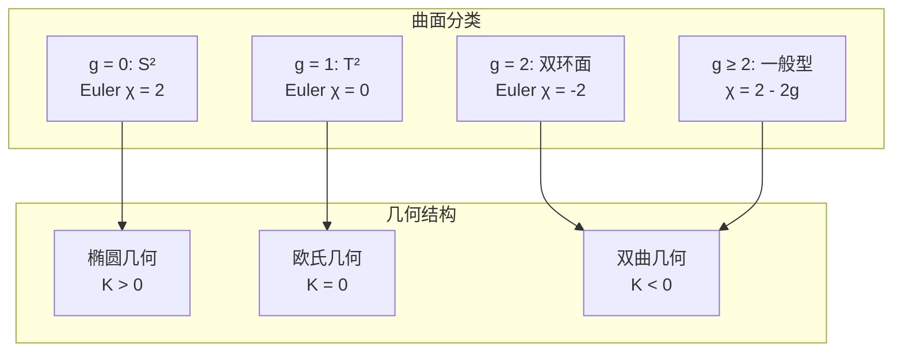
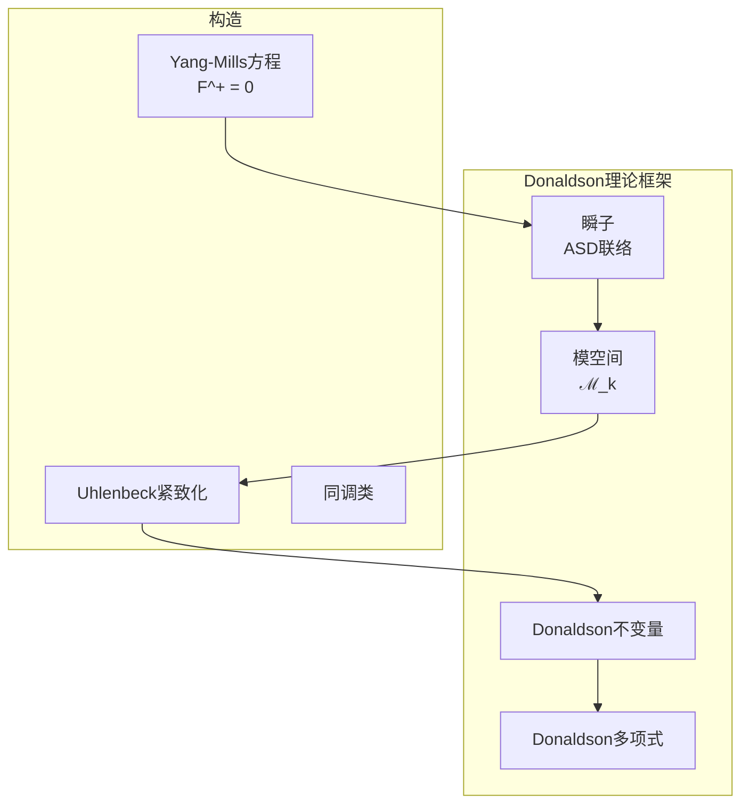
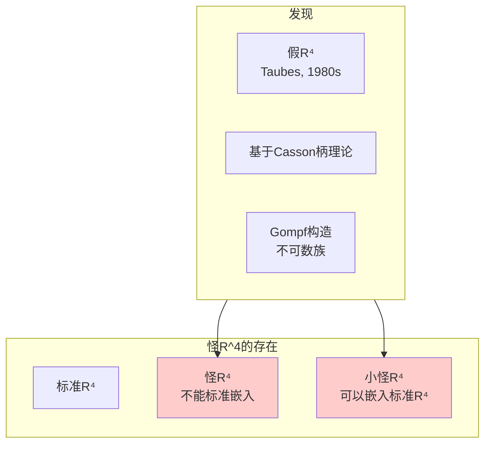
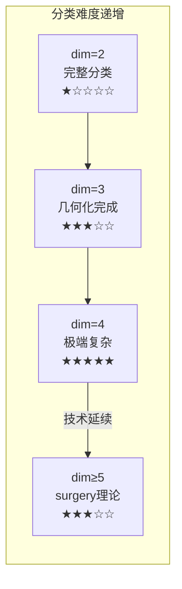
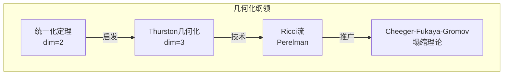
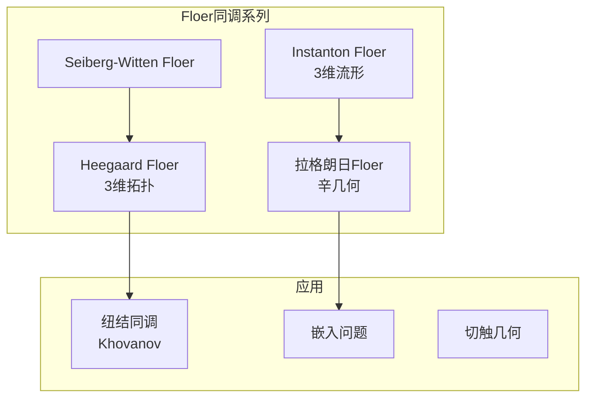

# 流形分类理论关联

## 概述

本文档系统阐述不同维度流形分类理论之间的关联，从2维曲面分类到高维流形的手术理论。

---

## 流形分类理论总览

```mermaid
flowchart TB
    subgraph DIM2["2维：完整分类"]
        SURF[曲面分类定理]
        GEO2[三种几何<br/>球面/欧氏/双曲]
        MOD2[模空间\mathcal{M}_g]
    end
    
    subgraph DIM3["3维：几何化猜想"]
        PRIME[素分解]
        THURSTON[Thurston几何化]
        HYP3[双曲几何主导]
    end
    
    subgraph DIM4["4维：复杂现象"]
        TOP4[拓扑分类]
        DIFF4[光滑分类<br/>怪R^4]
        DONALDSON[Donaldson理论]
        SW[Seiberg-Witten]
    end
    
    subgraph HIGH["dim≥5：s-配边"]
        SCOBORD[s-配边定理]
        SURGERY[手术理论]
        WALL[Wall群阻碍]
    end
    
    SURF -->|启发| THURSTON
    THURSTON -->|困难| DIM4
    GEO2 -->|类比| THURSTON
    TOP4 -->| surgery理论 | SCOBORD
    DIFF4 -->|高维光滑结构| SCOBORD

```

---

## 1. 2维曲面分类

### 1.1 分类定理

**定理（曲面分类）：** 紧、连通、可定向曲面由**亏格** $g$ 完全分类。

**标准形式：**

$$\Sigma_g = \text{球面} + g \text{个环柄}$$



### 1.2 统一化定理

**定理：** 每个单连通Riemann曲面双全纯等价于：

$$\mathbb{CP}^1, \quad \mathbb{C}, \quad \text{或} \quad \mathbb{H}$$

### 1.3 模空间

**亏格 $g$ 曲面的Teichmüller空间：**

$$\mathcal{T}_g = \{\text{复结构}\} / \text{保向微分同胚} \sim \text{id}$$

$$\dim_\mathbb{R} \mathcal{T}_g = 6g - 6 \quad (g \geq 2)$$

**模空间：** $\mathcal{M}_g = \mathcal{T}_g / \Gamma_g$，其中 $\Gamma_g$ 是映射类群。

---

## 2. 3维流形的几何化

### 2.1 素分解

**定理（Kneser-Milnor）：** 每个紧3维流形唯一分解为素流形的连通和。

**素流形：** 不能表示为两个非球面流形的连通和。

### 2.2 Thurston几何化猜想

**猜想（Thurston, 1982；Perelman, 2003证明）：** 每个素3维流形允许八种几何结构之一：

```mermaid
flowchart TB
    subgraph 8GEOMETRIES["8种3维几何"]
        S3[S³: 球面几何]
        E3[E³: 欧氏几何]
        H3[H³: 双曲几何]
        S2R[S² × ℝ]
        H2R[H² × ℝ]
        NIL[NIL几何<br/>Heisenberg群]
        SOL[SOL几何<br/>可解群]
        SL2R[SL̃(2,ℝ)几何]
    end
    
    subgraph PROPERTIES["几何性质"]
        COMPACT["紧致商: S³, NIL, S²×R的某些商"]
        FINITE["有限体积非紧: E³, H³, H²×R, SL̃(2,R)"]
    end
    
    8GEOMETRIES --> PROPERTIES

```

### 2.3 几何化定理的陈述

**定理（Perelman）：** 每个闭的、可定向的3维流形 $M$ 可以沿球面和环面分解成几何片：

$$M = M_1 \# M_2 \# \cdots \# M_k$$

其中每个 $M_i$ 允许八种几何之一，且 $H^3$ 是"generic"。

### 2.4 2维与3维分类对比

| 特征 | 2维 | 3维 |
|-----|-----|-----|
| 主导几何 | 3种 | 8种 |
| 模空间 | 良好理解 | 极其复杂 |
| 算法可判定 | 是 | 部分（几何化后） |
| 同胚问题 | 可解 | 可解（利用几何化） |
| 基本群 | 决定拓扑 | 不决定（Lens空间反例） |

---

## 3. 4维流形：拓扑与光滑的区别

### 3.1 拓扑分类（Freedman理论）

**定理（Freedman, 1981）：** 单连通闭拓扑4维流形由**交截形式**分类。

**交截形式：**

$$Q_M: H^2(M; \mathbb{Z}) \times H^2(M; \mathbb{Z}) \to \mathbb{Z}$$

$$Q_M(\alpha, \beta) = \langle \alpha \smile \beta, [M] \rangle$$

### 3.2 交截形式的分类

**定理（代数）：** 偶、幺模、正定对称双线性形式（over $\mathbb{Z}$）由秩完全分类当且仅当秩 $\leq 16$ 或等于某些特殊值。

**关键例子：**

| 流形 | 交截形式 | 符号 |
|-----|---------|------|
| $S^4$ | 平凡 | 0 |
| $\mathbb{CP}^2$ | $\langle 1 \rangle$ | +1 |
| $\overline{\mathbb{CP}}^2$ | $\langle -1 \rangle$ | -1 |
| $S^2 \times S^2$ | $H = \begin{pmatrix} 0 & 1 \\ 1 & 0 \end{pmatrix}$ | 0 |
| $K3$ | $2E_8 \oplus 3H$ | -16 |
| $E_8$流形 | $E_8$ | 不可光滑化 |

### 3.3 Donaldson理论

**定理（Donaldson, 1983）：** 若光滑单连通4维流形 $M$ 的交截形式是定号的，则它必须是**对角**的（over $\mathbb{Z}$）。

**推论：** $E_8$ 流形不可光滑化！



### 3.4 Seiberg-Witten理论

**简化：** Seiberg-Witten方程（单极子方程）给出等价的 but 更易计算的不变量。

**方程：**

$$D_A \psi = 0, \quad F_A^+ = \sigma(\psi)$$

其中 $(A, \psi)$ 是spin^c联络与旋量场。

**优势：**
- 模空间是紧的（不需要Uhlenbeck紧致化）
- 线性化方程更容易分析
- 计算更可行

### 3.5 怪 R⁴

**定理：** $\mathbb{R}^4$ 有**不可数多个**互不等价的光滑结构。



**唯一性：** 这是唯一一个存在怪结构的欧氏空间。

---

## 四、高维流形（dim ≥ 5）

### 4.1 h-配边定理

**定理（Smale, 1960）：** 设 $W^{n+1}$ 是 $M^n$ 和 $N^n$ 之间的h-配边（$n \geq 5$），则 $W \cong M \times [0,1]$。

**推论（Poincaré猜想 dim ≥ 5）：** 同伦等价于 $S^n$ 的光滑流形微分同胚于 $S^n$。

### 4.2 s-配边定理

**定理：** h-配边 $W$ 是平凡s-配边（即 $W \cong M \times [0,1]$）当且仅当Whitehead挠率 $\tau(W, M) = 0$。

### 4.3 手术理论

**核心问题：** 何时一个拓扑空间 $X$ 有光滑流形结构？何时两个光滑流形微分同胚？

```mermaid
flowchart TB
    subgraph SURGERY["手术理论框架"]
        NORMAL[法映射<br/>X → BO]
        SURG[手术阻碍<br/>σ ∈ L_n(π₁)]
        REAL[实现问题]
    end
    
    subgraph OBSTRUCTION["阻碍群"]
        WALL[Wall群L_n(π)]
        LS[LS群<br/>分裂问题]
        LP[LP群<br/>积公式]
    end
    
    NORMAL --> SURG
    SURG -->|σ = 0| REAL
    SURG -->|σ ≠ 0| OBSTRUCTION

```

### 4.4 结构集与手术精确列

**结构集：** $\mathcal{S}(X) = \{(M, f) : f: M \to X \text{ 同伦等价}\} / \text{Cat-同胚}$

**手术精确列：**

$$\cdots \to L_{n+1}(\pi_1X) \to \mathcal{S}(X) \to [X, G/O] \to L_n(\pi_1X) \to \cdots$$

---

## 五、维度间的联系与对比

### 5.1 分类难度对比



### 5.2 关键定理的维度依赖

| 定理 | dim=2 | dim=3 | dim=4 | dim≥5 |
|-----|-------|-------|-------|-------|
| Poincaré猜想 | ✓ | ✓ (Perelman) | ✓ (Freedman) | ✓ (Smale) |
| 光滑Poincaré | ✓ | ✓ | ✗ (怪R⁴) | ✓ |
| 同胚可判定 | 是 | 是 | 否 | 否 |
| 分类完整性 | 完整 | 几何化后 | 不完备 | surgery后 |

### 5.3 几何化纲领的推广



---

## 六、重要例子详解

### 6.1 复射影平面 $\mathbb{CP}^2$

**拓扑性质：**
- 单连通
- $H^2 = \mathbb{Z}$，生成元 $[H]$（超平面类）
- 交截形式：$Q = \langle 1 \rangle$

**光滑结构：**
- 标准光滑结构
- 与反定向 $\overline{\mathbb{CP}}^2$ 有 $Q = \langle -1 \rangle$

**重要操作：**

$$\mathbb{CP}^2 \# \overline{\mathbb{CP}}^2$$

有交截形式 $\langle 1 \rangle \oplus \langle -1 \rangle \cong H$（双曲平面）。

### 6.2 K3曲面

**定义：** 单连通紧复曲面，平凡典则丛。

**拓扑不变量：**
- $b_2 = 22$
- 交截形式：$2E_8 \oplus 3H$
- 符号差：$-16$
- $\hat{A}$亏格：$2$

**光滑结构：**
- 作为拓扑4维流形，K3曲面唯一
- 作为光滑4维流形，可能有多于一种光滑结构（开放问题）

### 6.3 双曲3维流形

**例子：** 补结（knot complement）

**关键定理：**

**Mostow刚性定理：** 有限体积双曲3维流形由基本群决定，且几何结构唯一。

**推论：**
- 双曲体积是拓扑不变量
- 同胚等价于等距等价

---

## 七、现代研究方向

### 7.1 Floer同调



### 7.2 4维流形未解问题

1. **光滑Poincaré猜想 dim=4：** $S^4$ 是否有唯一光滑结构？
2. **11/8猜想：** 对偶闭光滑4维流形，$b_2 \geq \frac{11}{8}|\text{sign}|$

3. **Thom猜想：** 在 $\mathbb{CP}^2$ 中，度 $d$ 代数曲线的亏格最小化

---

## 参考文献

1. Freedman, M. & Quinn, F. - *Topology of 4-Manifolds*
2. Donaldson, S.K. & Kronheimer, P.B. - *The Geometry of Four-Manifolds*
3. Scorpan, A. - *The Wild World of 4-Manifolds*
4. Morgan, J. & Tian, G. - *Ricci Flow and the Poincaré Conjecture*
5. Thurston, W.P. - *Three-Dimensional Geometry and Topology*
6. Wall, C.T.C. - *Surgery on Compact Manifolds*

---

*文档编号：05*  
*创建日期：2026年4月3日*  
*所属项目：FormalMath 第十批推进计划 - 任务B2*
