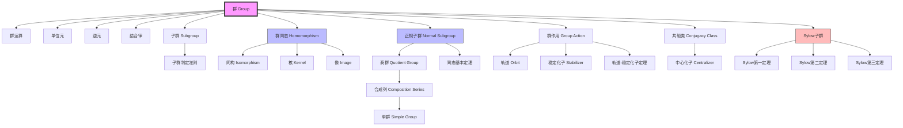
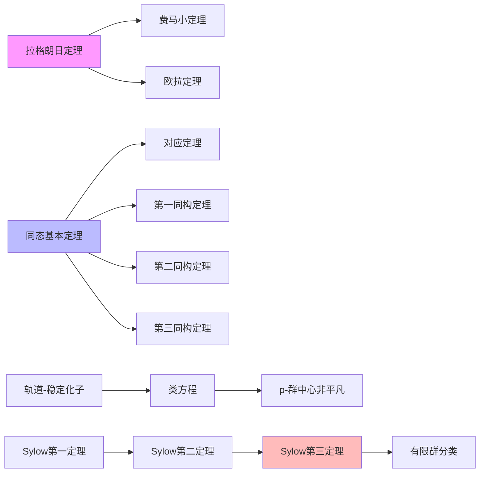

# 群论核心概念关联图谱

**适用范围**: MIT 18.701 Algebra I, Week 1-8  
**表征类型**: 概念关联图谱（Knowledge Graph）

---

## 核心概念图谱



---

## 概念层级结构

```
群论基础
│
├─ 第一层：群的基本结构
│   ├─ 群运算
│   ├─ 单位元
│   ├─ 逆元
│   └─ 结合律
│
├─ 第二层：子结构
│   ├─ 子群
│   ├─ 正规子群
│   ├─ 陪集
│   └─ 商群
│
├─ 第三层：映射与关系
│   ├─ 群同态
│   ├─ 同构
│   ├─ 同态基本定理
│   └─ 对应定理
│
├─ 第四层：群作用
│   ├─ 群作用定义
│   ├─ 轨道
│   ├─ 稳定化子
│   └─ 类方程
│
└─ 第五层：高级主题
    ├─ Sylow理论
    ├─ 单群
    ├─ 合成列
    └─ 可解群
```

---

## 定理依赖网络



---

## 学习路径推荐

```
入门路径
│
├─ 群的定义与例子
├─ 子群与判定准则
├─ 循环群
├─ 置换群
└─ 拉格朗日定理

进阶路径
│
├─ 群同态与同构
├─ 正规子群
├─ 商群
├─ 同态基本定理
└─ 群作用

高级路径
│
├─ Sylow理论
├─ 单群
├─ 合成列
└─ 可解群
```

---

## 概念-习题映射

| 概念 | 推荐习题 | 难度 |
|------|----------|------|
| 群定义 | ALG-001 | ⭐⭐ |
| 子群 | ALG-002 | ⭐⭐ |
| 拉格朗日 | ALG-003 | ⭐⭐⭐ |
| 同态 | ALG-004 | ⭐⭐⭐ |
| 正规子群 | ALG-005 | ⭐⭐⭐ |
| 商群 | ALG-006 | ⭐⭐⭐ |
| 群作用 | ALG-007 | ⭐⭐⭐⭐ |
| Sylow | ALG-008 | ⭐⭐⭐⭐ |

---

**图谱设计**: AI Assistant  
**最后更新**: 2026年4月9日
