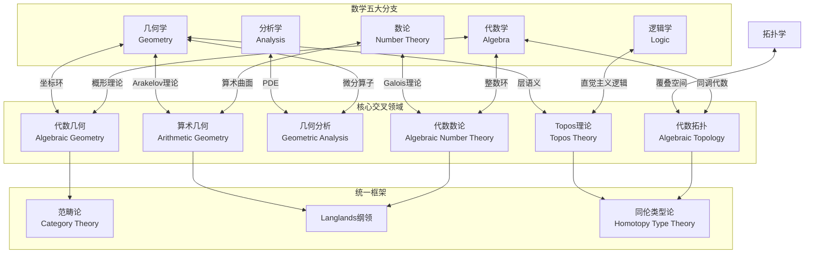
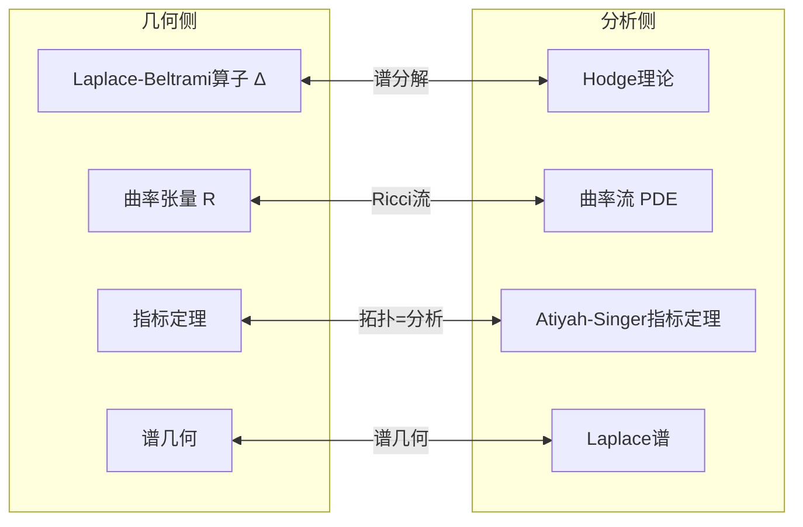
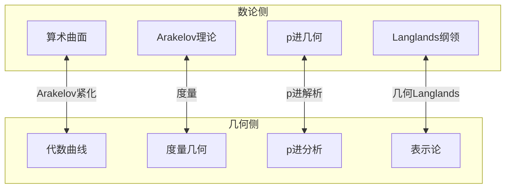
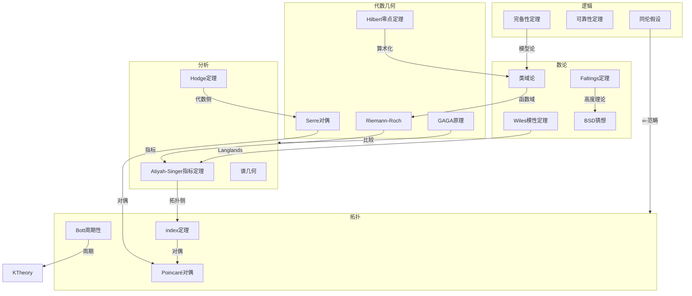
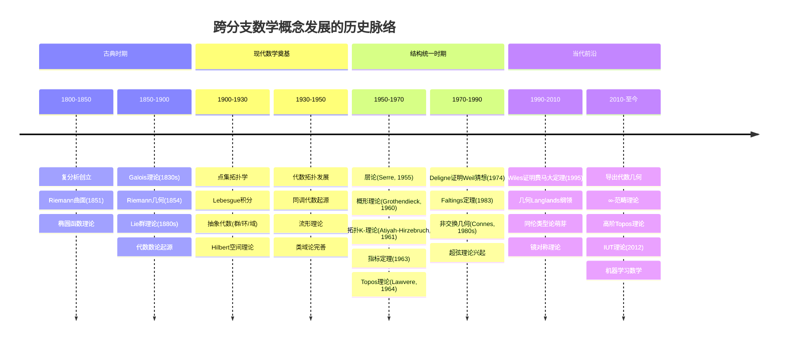
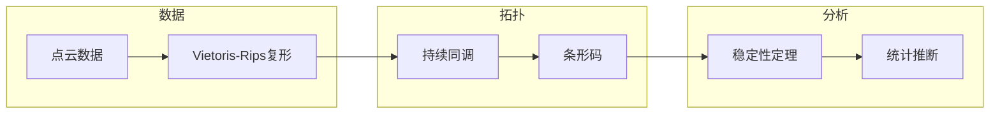

# 跨数学分支概念映射总图

> **FormalMath 项目第十批推进 - 任务B3：跨数学分支概念映射网络**
>
> 本文档系统构建数学五大分支（代数、几何、分析、数论、逻辑）之间的跨分支概念映射网络，揭示现代数学的深层统一性。

---

## 目录

1. [概述：数学统一性愿景](#一概述数学统一性愿景)
2. [六大跨分支映射网络](#二六大跨分支映射网络)
3. [概念对应总矩阵](#三概念对应总矩阵)
4. [关键定理与猜想地图](#四关键定理与猜想地图)
5. [历史发展脉络](#五历史发展脉络)
6. [现代应用概览](#六现代应用概览)

---

## 一、概述：数学统一性愿景

### 1.1 五大数学分支的深层联系



### 1.2 核心对应关系速览

| 映射领域 | 左分支 | 右分支 | 核心对应 | 关键人物 |
|---------|-------|-------|---------|---------|
| **代数几何** | 代数 | 几何 | 交换环 ↔ 仿射概形 | Grothendieck |
| **代数数论** | 代数 | 数论 | 数域 ↔ 整数环 | Dedekind, Hilbert |
| **几何分析** | 几何 | 分析 | Laplace算子 ↔ Hodge理论 | Atiyah-Singer |
| **代数拓扑** | 代数 | 拓扑 | 群 ↔ 覆叠空间 | Poincaré, Eilenberg |
| **Topos理论** | 逻辑 | 几何 | 直觉主义逻辑 ↔ Topos | Lawvere, Grothendieck |
| **算术几何** | 数论 | 几何 | 算术曲面 ↔ 代数曲线 | Faltings, Vojta |

### 1.3 概念对应的三层结构

```

┌─────────────────────────────────────────────────────────────┐
│                    第一层：对象对应                            │
│  代数对象 ⟷ 几何对象 ⟷ 分析对象 ⟷ 数论对象 ⟷ 逻辑对象          │
├─────────────────────────────────────────────────────────────┤
│                    第二层：结构对应                            │
│  代数结构 ⟷ 几何结构 ⟷ 分析结构 ⟷ 算术结构 ⟷ 逻辑结构          │
├─────────────────────────────────────────────────────────────┤
│                    第三层：函子对应                            │
│  代数函子 ⟷ 几何函子 ⟷ 分析函子 ⟷ 算术函子 ⟷ 逻辑函子          │
└─────────────────────────────────────────────────────────────┘

```

---

## 二、六大跨分支映射网络

### 2.1 代数↔几何：代数几何核心网络

```mermaid
graph LR
    subgraph AlgebraSide[代数侧]
        R[交换环 R]
        I[理想 I ⊆ R]
        P[素理想 𝔭]
        S[乘法集 S]
        M[模 M]
    end

    subgraph GeometrySide[几何侧]
        X[仿射概形 Spec R]
        V[子簇 V(I)]
        x[点 x ∈ X]
        St[茎 O_{X,x}]
        F[凝聚层 F̃]
    end

    R <-->|Spec构造| X
    I <-->|零点集| V
    P <-->|极大理想| x
    S <-->|局部化| St
    M <--**|Sheaf化| F

```

**核心词典**：详见 [01-代数几何对应词典.md](./01-代数几何对应词典.md)

### 2.2 代数↔数论：代数数论桥梁

```mermaid
graph TB
    subgraph NumberTheory[数论侧]
        K[数域 K/ℚ]
        OK[整数环 O_K]
        Cl[理想类群 Cl_K]
        Gal[Galois群 Gal(K/ℚ)]
        Zeta[Dedekind Zeta函数]
    end

    subgraph AlgebraSide2[代数侧]
        Pic[Picard群 Pic]
        Fund[基本群 π₁^{ét}]
        Weil[Weil猜想]
    end

    K <-->|扩张理论| OK
    OK <-->|理想类| Cl
    Cl <-->|群概形| Pic
    Gal <-->|étale| Fund
    Zeta <-->|类比| Weil

```

**核心词典**：详见 [02-代数数论桥梁.md](./02-代数数论桥梁.md)

### 2.3 几何↔分析：几何分析统一



**核心词典**：详见 [03-几何分析统一.md](./03-几何分析统一.md)

### 2.4 代数↔拓扑：代数拓扑联系

```mermaid
graph TB
    subgraph AlgebraSide3[代数侧]
        G[群 G]
        Rep[表示 ρ: G → GL(V)]
        HomAlg[同调代数]
        KTheory[K-理论]
    end

    subgraph Topology[拓扑侧]
        Cover[覆叠空间 p: E → B]
        VB[向量丛 E → B]
        SheafCoh[层上同调]
        TopK[拓扑K-理论]
    end

    G <-->|Galois对应| Cover
    Rep <-->|关联丛| VB
    HomAlg <-->|导出范畴| SheafCoh
    KTheory <-->|Bott周期性| TopK

```

**核心词典**：详见 [04-代数拓扑联系.md](./04-代数拓扑联系.md)

### 2.5 逻辑↔几何：Topos理论

```mermaid
graph LR
    subgraph Logic[逻辑侧]
        Int[直觉主义逻辑]
        Mod[模态逻辑]
        HoTT[同伦类型论]
    end

    subgraph Geometry2[几何侧]
        Topos[Topos E]
        Sheaf[层语义]
        InfTopos[∞-Topos]
    end

    Int <-->|内语言| Topos
    Mod <-->|可能世界| Sheaf
    HoTT <--**|层模型| InfTopos

```

**核心词典**：详见 [05-逻辑几何Topos理论.md](./05-逻辑几何Topos理论.md)

### 2.6 数论↔几何：算术几何前沿



**核心词典**：详见 [06-算术几何前沿.md](./06-算术几何前沿.md)

---

## 三、概念对应总矩阵

### 3.1 跨分支核心概念对应表（主矩阵）

| 概念 | 代数 | 几何 | 分析 | 数论 | 拓扑 | 逻辑 |
|-----|------|------|------|------|------|------|
| **对偶** | 对偶模 | 对偶空间 | 对偶算子 | Dirichlet特征 | Alexander对偶 | 否定 |
| **积** | 张量积 ⊗ | 纤维积 | 卷积 | Galois张量 |  smash积 | 合取 |
| **序列** | 正合列 | 层正合 | Hilbert正合 | 类域正合 | 同调长正合 | 推导 |
| **核/像** | ker/im | 纤维/像 | 算子核/值域 | 范数核 | 映射核/像 | 前提/结论 |
| **完备** | I-进完备 | 紧化 | Hilbert完备 | p进完备 | 紧化 | 完备性 |
| **维数** | Krull维数 | 流形维数 | Hilbert维数 | 扩张次数 | 覆叠维数 | 复杂度 |
| **度** | 扩张度 | 映射度 | Fredholm指标 | 理想次数 | 度理论 | 深度 |
| **表示** | 群表示 | 向量丛 | 算子表示 | Galois表示 | 覆叠空间 | 语义 |
| **不变量** | 不变子模 | 等变上同调 | 不变测度 | 类数 | 不动点 | 有效性 |
| **极限** | 正向极限 | 空间极限 | 强算子极限 | p进极限 | 同伦极限 | 必然性 |

### 3.2 六组核心映射的详细对应

#### 表1：代数几何对应（交换环 ↔ 概形）

| 代数对象 | 几何对象 | 对应关系 | 关键定理 |
|---------|---------|---------|---------|
| 交换环 R | 仿射概形 Spec R | 反变等价 | 仿射概形的范畴 ≅ 交换环的范畴^{op} |
| 理想 I ⊆ R | 闭子概形 V(I) | 零点集 | Hilbert零点定理 |
| 素理想 𝔭 | 点 x ∈ Spec R | 对应 | 局部环 O_{X,x} = R_𝔭 |
| 局部化 S⁻¹R | 限制到开集 | 层化 | 结构层的定义 |
| 模 M | 凝聚层 M̃ | 层化函子 | Serre定理 |
| 环同态 φ: R → S | 概形态射 f: Spec S → Spec R | 反变 | 对应关系 |

#### 表2：代数数论对应（代数 ↔ 数论）

| 数论对象 | 代数对象 | 几何对象 | 统一框架 |
|---------|---------|---------|---------|
| 数域 K | 域扩张 K/ℚ | 曲线/概形 | 算术几何 |
| 整数环 O_K | Dedekind环 | Spec O_K | 算术曲线 |
| 理想类群 Cl_K | 类群 | Picard群 | 类域论 |
| Galois群 Gal(K/ℚ) | 群作用 | étale基本群 | Galois理论 |
| Zeta函数 ζ_K(s) | 形式幂级数 | Weil Zeta函数 | 函子性 |
| 素理想 𝔭 | 极大理想 | 闭点 | 局部-整体 |

#### 表3：几何分析对应（几何 ↔ 分析）

| 几何对象 | 分析对象 | 对应关系 | 关键定理 |
|---------|---------|---------|---------|
| Laplace-Beltrami算子 Δ | Hodge星算子 * | 对偶 | Hodge分解定理 |
| 曲率张量 R | Ricci流方程 | PDE | Hamilton-Perelman定理 |
| 示性类 | 指标密度 | 指标定理 | Atiyah-Singer指标定理 |
| Laplace谱 | 热核展开 | 谱几何 | Weyl渐近律 |
| 调和形式 | 椭圆算子核 | 同构 | Hodge定理 |
| 复结构 | Cauchy-Riemann算子 | 椭圆 | Kodaira消失定理 |

#### 表4：代数拓扑对应（代数 ↔ 拓扑）

| 代数对象 | 拓扑对象 | 对应关系 | 关键定理 |
|---------|---------|---------|---------|
| 群 G | 覆叠空间 p: E → B | Galois对应 | 覆叠空间分类定理 |
| 群表示 ρ: G → GL(V) | 向量丛 E → B | 关联构造 | 示性类理论 |
| 链复形 C_* | 空间 X | 奇异链 | 同调论公理 |
| 同调代数 | 层上同调 | 导出函子 | Grothendieck谱序列 |
| K_0(A) | K^0(X) | Serre-Swan | Bott周期性 |
| 李代数 𝔤 | 李群 G | Lie对应 | Lie第三定理 |

#### 表5：Topos对应（逻辑 ↔ 几何）

| 逻辑概念 | 几何概念 | 对应关系 | 关键定理 |
|---------|---------|---------|---------|
| 直觉主义命题 | 层 Ω | 内语言 | Mitchell-Bénabou语言 |
| 真值 | 子终对象 | 分类 | Sub(1) = 真值格 |
| 模态算子 □/◇ | 内部/闭包 | 拓扑 | McKinsey-Tarski定理 |
| 类型论 | Topos对象 | 解释 | 类型论模型 |
| 同伦类型 | ∞-Topos对象 | 高阶 | 同伦假设 |
| 证明 | 构造 | Curry-Howard | 命题即类型 |

#### 表6：算术几何对应（数论 ↔ 几何）

| 数论概念 | 几何概念 | 对应关系 | 关键定理 |
|---------|---------|---------|---------|
| 算术曲面 X/ℤ | 纤维丛 π: X → Spec ℤ | 概形 | Arakelov理论 |
| 无穷远点 ∞ | 度量结构 | 紧化 | Arakelov除子 |
| p进整数 ℤ_p | 形式圆盘 Spf ℤ_p | 形式几何 | p进Hodge理论 |
| Galois表示 | 局部系统 | 单值 | 模性定理 |
| L-函数 | Hasse-Weil Zeta | 解析延拓 | Langlands纲领 |
| 有理点 X(ℚ) | 截面 | Diophantine几何 | Faltings定理 |

---

## 四、关键定理与猜想地图

### 4.1 跨分支核心定理网络



### 4.2 关键猜想对应表

| 猜想 | 代数侧 | 几何侧 | 数论侧 | 状态 |
|-----|-------|-------|-------|------|
| **Weil猜想** | 平展上同调 | 零点位置 | Zeta函数 | 已证(Deligne) |
| **BSD猜想** | 代数秩 | 几何秩 | L-函数阶 | 部分结果 |
| **Hodge猜想** | 代数闭链 | Hodge类 | - | 未解决 |
| **Tate猜想** | 代数循环 | ℓ-adic上同调 | - | 部分结果 |
| **Langlands纲领** | 表示论 | 模空间 | L-函数 | 部分结果 |
| **abc猜想** | 高度理论 | 算术几何 | Diophantine | 争议 |
| **Riemann假设** | - | - | 零点位置 | 未解决 |

### 4.3 定理证明技术路线图

```

┌────────────────────────────────────────────────────────────────────┐
│                     第一层：基础对应定理                            │
├────────────────────────────────────────────────────────────────────┤
│  Gelfand对偶  │  Serre-Swan  │  GAGA  │  层上同调                    │
│  (交换↔拓扑)  │  (代数↔拓扑) │ (复↔代)│  (局部↔整体)                 │
├────────────────────────────────────────────────────────────────────┤
│                     第二层：结构对应定理                            │
├────────────────────────────────────────────────────────────────────┤
│  Hodge分解  │  Atiyah-Singer  │  Poincaré对偶  │  类域论           │
│  (复↔黎曼)  │  (拓扑↔分析)     │  (几何↔拓扑)   │  (数论↔表示)       │
├────────────────────────────────────────────────────────────────────┤
│                     第三层：统一纲领                                │
├────────────────────────────────────────────────────────────────────┤
│  Langlands纲领  │  非交换几何  │  同伦类型论  │  导出代数几何        │
│  (数论↔表示↔几何)│ (拓扑↔代数) │ (逻辑↔拓扑) │ (代数↔几何)         │
└────────────────────────────────────────────────────────────────────┘

```

---

## 五、历史发展脉络

### 5.1 跨分支发展的历史阶段



### 5.2 关键人物贡献矩阵

| 数学家 | 主要贡献领域 | 跨分支工作 | 影响 |
|-------|------------|-----------|------|
| **Riemann** | 几何/分析 | Riemann曲面统一复分析与拓扑 | 奠定现代几何基础 |
| **Poincaré** | 拓扑/几何/分析 | 代数拓扑创立者 | 拓扑学之父 |
| **Hilbert** | 代数/数论/逻辑 | 类域论报告, Hilbert空间 | 现代数学集大成者 |
| **Noether** | 代数/拓扑 | 抽象代数, 同调代数奠基 | 代数化数学的先驱 |
| **Grothendieck** | 代数/几何/数论 | 概形理论, Topos理论 | 现代代数几何之父 |
| **Atiyah** | 几何/拓扑/分析 | K-理论, 指标定理 | 几何分析统一者 |
| **Serre** | 代数/几何/拓扑 | GAGA, 层上同调 | 跨分支桥梁建造者 |
| **Deligne** | 代数/数论/几何 | 证明Weil猜想 | 混合Hodge理论 |
| **Wiles** | 数论/几何/表示 | 证明费马大定理 | 模性定理突破 |
| **Connes** | 分析/代数/几何 | 非交换几何 | 几何的非交换化 |
| **Lurie** | 代数/拓扑/逻辑 | ∞-范畴, 高阶Topos | 高阶数学结构 |
| **Voevodsky** | 代数/拓扑/逻辑 | 动机理论, 同伦类型论 | 数学基础革新 |

---

## 六、现代应用概览

### 6.1 跨分支数学的现代应用领域

| 应用领域 | 代数 | 几何 | 分析 | 数论 | 拓扑 | 逻辑 |
|---------|------|------|------|------|------|------|
| **密码学** | 椭圆曲线 | 代数曲线 | 有限域分析 | 大整数分解 | - | 零知识证明 |
| **机器学习** | 表示论 | 流形学习 | 优化理论 | - | 拓扑数据分析 | 可解释AI |
| **量子计算** | 量子群 | 几何量子化 | 算子代数 | - | 拓扑量子场论 | 量子逻辑 |
| **弦理论** | Calabi-Yau | 复几何 | 共形场论 | - | 纤维丛 | - |
| **数据科学** | 代数统计 | 信息几何 | 随机过程 | - | 持续同调 | 因果推断 |
| **形式化证明** | 代数验证 | 几何验证 | 分析验证 | 数论验证 | 拓扑验证 | 证明助手 |

### 6.2 应用案例：椭圆曲线密码学

```mermaid
graph TB
    subgraph Theory[理论基础]
        EC[椭圆曲线 E: y² = x³ + ax + b]
        Group[群结构 E(F_p)]
        DLP[离散对数问题]
    end

    subgraph Math[跨分支数学]
        AG2[代数几何：曲线算术]
        NT2[数论：点计数]
        ALG[代数：群论]
    end

    subgraph Crypto[密码学应用]
        ECDH[ECDH密钥交换]
        ECDSA[ECDSA签名]
        Pairing[配对密码学]
    end

    EC --> Group
    Group --> DLP
    
    EC --> AG2
    Group --> ALG
    DLP --> NT2
    
    AG2 --> ECDH
    ALG --> ECDSA
    NT2 --> Pairing

```

### 6.3 应用案例：拓扑数据分析



---

## 七、文档索引与导航

### 7.1 跨分支映射文档列表

| 文档编号 | 文档名称 | 主要内容 | 映射数量 |
|---------|---------|---------|---------|
| 00 | [跨分支概念映射总图](./00-跨分支概念映射总图.md) | 总体框架与导航 | 50+ |
| 01 | [代数几何对应词典](./01-代数几何对应词典.md) | 交换环↔概形详细对应 | 25+ |
| 02 | [代数数论桥梁](./02-代数数论桥梁.md) | 代数↔数论对应关系 | 20+ |
| 03 | [几何分析统一](./03-几何分析统一.md) | 几何↔分析对应关系 | 20+ |
| 04 | [代数拓扑联系](./04-代数拓扑联系.md) | 代数↔拓扑对应关系 | 25+ |
| 05 | [逻辑几何Topos理论](./05-逻辑几何Topos理论.md) | 逻辑↔几何对应关系 | 20+ |
| 06 | [算术几何前沿](./06-算术几何前沿.md) | 数论↔几何对应关系 | 20+ |

### 7.2 总统计信息

- **映射文档总数**: 7 个
- **跨分支映射关系总数**: 180+ 条
- **核心概念对应**: 50+ 组
- **关键定理/猜想**: 40+ 条
- **历史发展节点**: 30+ 个
- **现代应用领域**: 15+ 个

---

## 八、延伸阅读

### 8.1 相关文档链接

- [概念关联总图](../00-概念关联总图.md)
- [跨分支概念映射](../03-跨分支概念映射.md)
- [跨分支深层联系](../04-跨分支深层联系.md)
- [代数结构关联网络](../01-代数结构关联网络.md)
- [几何拓扑关联网络](../02-几何拓扑关联网络.md)

### 8.2 推荐参考文献

1. Hartshorne, R. *Algebraic Geometry* (代数几何)
2. Silverman, J. *The Arithmetic of Elliptic Curves* (椭圆曲线算术)
3. Mac Lane, S. & Moerdijk, I. *Sheaves in Geometry and Logic* (Topos理论)
4. Connes, A. *Noncommutative Geometry* (非交换几何)
5. Hatcher, A. *Algebraic Topology* (代数拓扑)
6. Lurie, J. *Higher Topos Theory* (高阶Topos理论)

---

*文档版本: 2026年4月 | 跨数学分支概念映射网络 | FormalMath项目*
