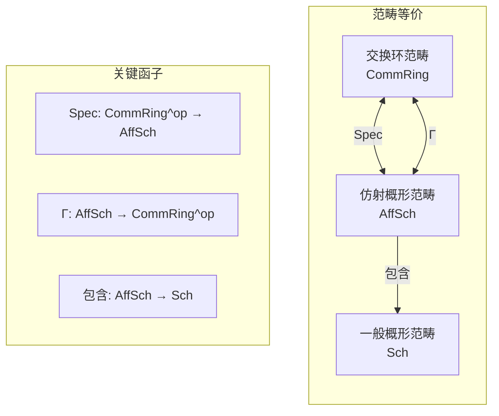
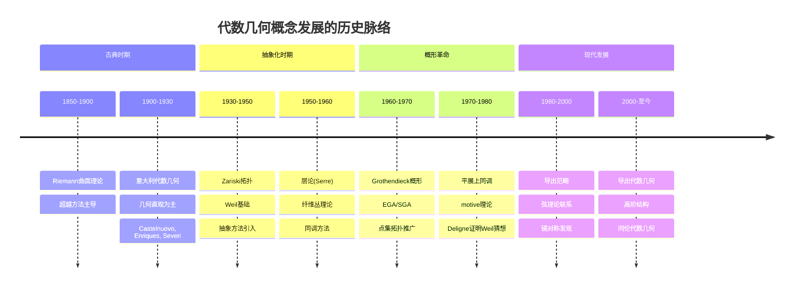

# 代数几何对应词典

> **代数 ↔ 几何：Grothendieck概形理论的精确对应**

---

## 目录

1. [核心理论框架](#一核心理论框架)
2. [基础概念对应](#二基础概念对应)
3. [进阶结构对应](#三进阶结构对应)
4. [上同调理论对应](#四上同调理论对应)
5. [关键定理详解](#五关键定理详解)
6. [历史发展](#六历史发展)
7. [现代应用](#七现代应用)

---

## 一、核心理论框架

### 1.1 基本哲学：代数与几何的等价

代数几何的基本思想是：**交换环的代数性质与其对应几何空间的拓扑/几何性质之间存在深刻的对应关系**。



**核心定理**：

```

Spec: CommRing^op → AffSch 是范畴等价
即：交换环的范畴（箭头反向）≅ 仿射概形的范畴

```

### 1.2 对应关系的层次结构

```

┌─────────────────────────────────────────────────────────────┐
│ Level 0: 基本元素对应                                        │
│   环的元素  ⟷  概形上的函数                                   │
├─────────────────────────────────────────────────────────────┤
│ Level 1: 子结构对应                                          │
│   理想  ⟷  闭子概形                                           │
│   乘法集  ⟷  开子集                                           │
├─────────────────────────────────────────────────────────────┤
│ Level 2: 全局结构对应                                        │
│   环  ⟷  仿射概形                                             │
│   分次环  ⟷  射影概形                                         │
├─────────────────────────────────────────────────────────────┤
│ Level 3: 态射对应                                            │
│   环同态  ⟷  概形态射                                         │
│   局部化  ⟷  限制映射                                         │
├─────────────────────────────────────────────────────────────┤
│ Level 4: 层与模对应                                          │
│   模  ⟷  拟凝聚层                                             │
│   有限生成模  ⟷  凝聚层                                       │
└─────────────────────────────────────────────────────────────┘

```

---

## 二、基础概念对应

### 2.1 基本元素对应表

| 代数概念 | 几何概念 | 符号对应 | 直观解释 |
|---------|---------|---------|---------|
| 交换环 | 仿射概形 | R ⟷ Spec R | 坐标函数环 ⟷ 几何空间 |
| 环元素 a ∈ R | 正则函数 | a ⟷ ã ∈ O_{Spec R} | 代数表达式 ⟷ 函数值 |
| 素理想 𝔭 ∈ Spec R | 点 x ∈ X | 𝔭 ⟷ x | 极大理想 ⟷ 闭点 |
| 商环 R/I | 闭子概形 V(I) | R/I ⟷ Spec(R/I) | 限制函数 ⟷ 子空间 |
| 局部化 R_f | 主开集 D(f) | R_f ⟷ O_X(D(f)) | 可逆函数 ⟷ 开邻域 |
| 分式域 Frac(R) | 函数域 K(X) | Frac(R) ⟷ K(X) | 有理函数 ⟷ 有理函数 |

### 2.2 理想 ↔ 子簇的详细对应

```mermaid
graph TB
    subgraph Algebra[代数侧 - 理想理论]
        I[理想 I ⊆ R]
        Rad[根理想 √I]
        Prime[素理想 𝔭]
        Max[极大理想 𝔪]
        Primary[准素理想 𝔮]
    end

    subgraph Geometry[几何侧 - 子空间]
        V[子概形 V(I)]
        Red[既约子概形 V(√I)]
        SubVar[子簇 V(𝔭)]
        Point[闭点 x = V(𝔪)]
        Irred[不可约分支]
    end

    subgraph Correspondence[对应关系]
        IdealVar[理想 ⟷ 子簇]
        Nullstellensatz[Hilbert零点定理]
    end

    I -->|根化| Rad
    Rad -->|素分解| Prime
    Prime -->|极大化| Max
    
    V -->|既约化| Red
    Red -->|不可约分解| SubVar
    SubVar -->|闭点| Point
    
    I <-->|V(-)| V
    Rad <-->|V(-)| Red
    Prime <-->|V(-)| SubVar
    Max <-->|V(-)| Point
    
    IdealVar -->|Hilbert零点定理| Nullstellensatz

```

**详细对应矩阵**：

| 代数概念 | 定义 | 几何对应 | 几何定义 |
|---------|-----|---------|---------|
| **理想 I** | R的子加群，R·I ⊆ I | **子概形 Y** | 结构层商的结构 |
| **根理想 √I** | {f : fⁿ ∈ I 对某个n} | **既约子概形** | 无幂零结构的子空间 |
| **素理想 𝔭** | ab ∈ 𝔭 ⇒ a ∈ 𝔭 或 b ∈ 𝔭 | **不可约子簇** | 不能分解为真子簇的并 |
| **极大理想 𝔪** | 无真包含素理想 | **闭点** | 单点闭子集 |
| **准素理想 𝔮** | 根为素理想 | **不可约子概形** | 支撑不可约 |
| **素谱 Spec R** | 所有素理想集合 | **概形 X** | 局部环空间 |

### 2.3 素理想 ↔ 点的几何解释

```

代数观点:
-----------
素理想 𝔭 ⊂ R 是满足以下条件的真理想：
- 若 ab ∈ 𝔭，则 a ∈ 𝔭 或 b ∈ 𝔭
- 等价于：R/𝔭 是整环

几何观点:
-----------
点 x ∈ Spec R 对应于素理想 𝔭_x，其中：
- O_{X,x} = R_{𝔭_x} （局部环）
- κ(x) = Frac(R/𝔭_x) （剩余域）

闭点（极大理想）:
- 对于代数闭域k上的有限型k-代数
- 极大理想 ↔ k-点（坐标在k中的点）
- 一般点（非闭点）↔ 子簇的泛点

```

**例子：A¹_k = Spec k[t]**

| 素理想 | 类型 | 对应几何对象 |
|-------|------|------------|
| (t - a), a ∈ k | 极大理想 | 闭点 a ∈ A¹ |
| (0) | 素理想（非极大） | 一般点（A¹的泛点）|
| (f(t))，f不可约 | 极大理想 | f的零点集（当deg f = 1时为点）|

---

## 三、进阶结构对应

### 3.1 局部化 ↔ 茎的对应

**核心概念**：局部化是将环在某个乘法集上"可逆化"的操作，几何上对应于在点附近的局部研究。

```mermaid
graph LR
    subgraph Global[全局层]
        R[环 R]
        X[概形 X = Spec R]
        OX[结构层 O_X]
    end

    subgraph Localization[局部化操作]
        S[乘法集 S ⊆ R]
        P[素理想 𝔭 ∈ Spec R]
        M[极大理想 𝔪]
    end

    subgraph Local[局部对象]
        RS[S⁻¹R]
        RP[R_𝔭]
        RM[R_𝔪]
        Stalk[茎 O_{X,x}]
    end

    R -->|S⁻¹| RS
    R -->|𝔭| RP
    R -->|𝔪| RM
    
    X -->|限制到| Stalk
    
    RS -.->|几何意义| OX
    RP -.->|对应| Stalk
    RM -.->|局部环| Stalk

```

**详细对应表**：

| 局部化类型 | 代数定义 | 几何对象 | 几何意义 |
|-----------|---------|---------|---------|
| **局部化 S⁻¹R** | 在乘法集S上可逆 | 开集 D(S) = ∪_{f∈S} D(f) | 函数环 |
| **主局部化 R_f** | 在f幂上可逆 | 主开集 D(f) = {𝔭 : f ∉ 𝔭} | 基本开集 |
| **素理想局部化 R_𝔭** | 在R\𝔭上可逆 |  stalk O_{X,𝔭} | 点处的局部环 |
| **极大理想局部化 R_𝔪** | 在极大理想外可逆 | 闭点的局部环 | 闭点邻域 |
| **完备化 R̂** | I-进拓扑完备 | 形式邻域 | 无限小邻域 |

### 3.2 模 ↔ 凝聚层的对应

**Serre定理**：对于仿射概形 Spec R，拟凝聚层的范畴等价于 R-模范畴。

```mermaid
graph TB
    subgraph Module[模范畴 R-Mod]
        M[R-模 M]
        FG[有限生成模]
        Proj[投射模]
        Flat[平坦模]
    end

    subgraph Sheaf[层范畴 QCoh(X)]
        F[拟凝聚层 F̃]
        Coh[凝聚层]
        VB[向量丛]
        LocFree[局部自由层]
    end

    subgraph Operations[构造与操作]
        Tilde[Sheaf化 M ↦ M̃]
        Global[全局截面 Γ(X, -)]
        Tensor[张量积 ⊗]
        Hom[Hom层]
    end

    M <-->|Sheaf化| F
    FG <-->|有限型| Coh
    Proj <-->|局部投射| VB
    Flat <-->|平坦性| LocFree
    
    M -->|~| F
    F -->|Γ| M
    
    M -->|⊗_R N| Tensor
    F -->|⊗_{O_X} G| Tensor

```

**模与层的对应矩阵**：

| 模的性质 | 代数条件 | 层的性质 | 几何条件 |
|---------|---------|---------|---------|
| 自由模 Rⁿ | 有基 | 自由层 O_Xⁿ | 平凡向量丛 |
| 投射模 | 直和项 | 局部自由层 | 向量丛 |
| 平坦模 | 张量积正合 | 平坦层 | 平坦态射 |
| 有限生成模 | 有限生成 | 凝聚层 | 有限型 + 有限展示 |
| 诺特模 | ACC链条件 | 凝聚层 | 局部诺特概形 |
| 内射模 | 可除性 | 内射层 | 上同调消失 |
| Artin模 | DCC链条件 | 挠层 | 支撑在有限点集 |

### 3.3 态射的对应

**环同态 ⟷ 概形态射**

给定环同态 φ: R → S，诱导概形态射 f: Spec S → Spec R：

```

代数构造:
-----------
φ: R → S
  - 对素理想 𝔮 ⊂ S，定义 f(𝔮) = φ⁻¹(𝔮) ⊂ R
  - 层映射: O_{Spec R} → f_*O_{Spec S}

几何构造:
-----------
f: Spec S → Spec R
  - 底层映射: 𝔮 ↦ φ⁻¹(𝔮)
  - 结构层: 局部环同态 O_{R, f(𝔮)} → O_{S, 𝔮}

```

**态射性质的对应**：

| 环同态性质 | 代数定义 | 概形态射性质 | 几何意义 |
|-----------|---------|-------------|---------|
| 单射 | ker φ = 0 | 支配态射 | 像稠密 |
| 满射 | im φ = S | 闭浸入 | 闭子概形 |
| 整性 | S是有限R-模 | 有限态射 | 纤维有限 |
| 平坦性 | 平坦R-模 | 平坦态射 | 纤维维数恒定 |
| 光滑性 | 形式光滑 | 光滑态射 | 微分几何子浸入 |
| 忠实平坦 | 平坦+忠实 | 忠实平坦 | 下降有效 |

---

## 四、上同调理论对应

### 4.1 层上同调与导出函子

```mermaid
graph TB
    subgraph Derived[导出范畴]
        DMod[D(R-Mod)]
        DCoh[D(QCoh X)]
        RF[RΓ(X, -)]
    end

    subgraph Cohomology[上同调理论]
        SheafCoh[H^i(X, F)]
        Cech[Čech上同调]
        DeRham[代数de Rham上同调]
        Etale[平展上同调]
    end

    subgraph Invariants[几何不变量]
        Euler[Euler示性数]
        Genus[亏格]
        Chern[陈类]
    end

    DMod <-->|RΓ| DCoh
    DCoh -->|H^i| SheafCoh
    SheafCoh -->|计算| Cech
    SheafCoh -->|光滑簇| DeRham
    SheafCoh -->|算术应用| Etale
    
    SheafCoh -->|求和| Euler
    Euler -->|定义| Genus
    SheafCoh -->|曲率| Chern

```

### 4.2 上同调群的代数对应

对于仿射概形 X = Spec R，Serre消失定理告诉我们：

```

H^i(X, M̃) = 0 对所有 i > 0

这对应于代数事实：R-模的导出函子在仿射情形平凡

```

**射影空间的上同调**：

| 层 | H^0 | H^i (0<i<n) | H^n | 代数对应 |
|----|-----|-------------|-----|---------|
| O(m), m ≥ 0 | 齐次多项式 | 0 | 0 | 正次数无高阶上同调 |
| O(m), -n-1 < m < 0 | 0 | 0 | 0 | 中间范围消失 |
| O(-n-1) | 0 | 0 | 对偶 | Serre对偶 |

### 4.3 Serre对偶的代数解释

**Serre对偶定理**：对于光滑射影簇X上的局部自由层E：

```

H^i(X, E) ≅ H^{n-i}(X, E^∨ ⊗ ω_X)^∨

其中：
- n = dim X
- ω_X = Ω^n_X 是典则层
- E^∨ 是对偶层

```

**代数对应**：
- Serre对偶 ⟷ Ext对偶
- 典则层 ω_X ⟷ 模的判别式
- 对偶性配对 ⟷ Yoneda配对

---

## 五、关键定理详解

### 5.1 Hilbert零点定理

**代数形式**：设k为代数闭域，I ⊆ k[x₁,...,xₙ]为理想，则：

```

I(V(I)) = √I

其中：
- V(I) = {x ∈ Aⁿ_k : f(x) = 0 对所有 f ∈ I}
- I(Z) = {f ∈ k[x₁,...,xₙ] : f(z) = 0 对所有 z ∈ Z}
- √I = {f : fᵐ ∈ I 对某个m}

```

**几何形式**：
- Aⁿ_k中的仿射代数集与k[x₁,...,xₙ]的根理想一一对应

**概形论推广**：对于Jacobson概形X，闭点集|X|^{cl}与既约子概形对应

### 5.2 GAGA原理

**定理（Serre, 1956）**：设X是复射影概形，则：

```

相干代数层 ⟷ 相干解析层
    函子 F ↦ F^an 是范畴等价

```

**对应表**：

| 代数几何 | 解析几何 | 对应关系 |
|---------|---------|---------|
| 代数相干层 | 解析相干层 | 一一对应 |
| 代数上同调 | 解析上同调 | 自然同构 |
| 代数态射 | 全纯映射 | 一致 |
| 射影概形 | 紧复空间 | 对应 |

### 5.3 概形化 vs 经典代数几何

| 经典代数几何 | 概形论 | 优势 |
|------------|-------|------|
| 簇（不可约） | 概形（可约） | 允许幂零函数 |
| 闭点 | 所有点（一般点） | 包含子簇信息 |
| 既约结构 | 非既约结构 | 形变理论 |
| 代数闭域 | 任意环 | 算术应用 |
| 固定基域 | 相对概形 | 族与模空间 |

---

## 六、历史发展

### 6.1 代数几何的历史阶段



### 6.2 关键人物贡献

| 数学家 | 贡献 | 对应理论 |
|-------|------|---------|
| **Riemann** | Riemann曲面 | 复代数几何基础 |
| **Noether** | 抽象代数 | 理想理论严格化 |
| **Zariski** | Zariski拓扑 | 代数拓扑引入 |
| **Weil** | Weil猜想 | 算术几何起源 |
| **Serre** | 层论, GAGA | 解析-代数对应 |
| **Grothendieck** | 概形理论 | 现代代数几何 |
| **Deligne** | 证明Weil猜想 | ℓ-adic上同调 |
| **Mumford** | 几何不变量论 | 模空间理论 |

---

## 七、现代应用

### 7.1 密码学应用

| 代数结构 | 几何对象 | 密码学应用 |
|---------|---------|-----------|
| 椭圆曲线 | 一维Abel簇 | ECDH, ECDSA |
| 超椭圆曲线 | 高维Jacobi簇 | 超椭圆密码 |
| 配对 | Weil/Tate配对 | 基于身份的加密 |
| 同源图 | 模空间 | 后量子密码 |

### 7.2 弦理论与代数几何

| 物理概念 | 代数几何对象 | 对应关系 |
|---------|------------|---------|
| 弦紧致化 | Calabi-Yau流形 | Ricci平坦Kähler |
| 镜像对称 | 镜面对(C, C*) | Hodge数交换 |
| B-模型 | 导出范畴 D^b(X) | D-brane范畴 |
| A-模型 | Fukaya范畴 | Lagrange子流形 |

### 7.3 枚举几何

Gromov-Witten理论与代数几何的联系：

```

代数几何侧:
-----------
- 稳定映射空间 M̄_{g,n}(X, β)
- 虚基本类 [M̄_{g,n}(X, β)]^{vir}
- Gromov-Witten不变量

物理对应:
-----------
- 拓扑弦振幅
- 镜像对称计算
- Yukawa耦合

```

---

## 八、概念映射汇总

### 8.1 完整对应表

| 层级 | 代数概念 | 几何概念 | 定理/原理 |
|-----|---------|---------|----------|
| 0 | 元素 a ∈ R | 函数值 | 赋值映射 |
| 1 | 理想 I | 子概形 V(I) | Hilbert零点定理 |
| 2 | 素理想 𝔭 | 点 x | 局部环对应 |
| 3 | 局部化 R_𝔭 | 茎 O_{X,x} | 层论公理 |
| 4 | 模 M | 层 M̃ | Serre对应 |
| 5 | 分次环 | 射影概形 | Proj构造 |
| 6 | 环同态 | 概形态射 | 反变等价 |
| 7 | 平坦性 | 平坦态射 | 下降理论 |
| 8 | 光滑性 | 光滑态射 | 形式光滑 |
| 9 | 完备化 | 形式概形 | 形变理论 |

### 8.2 统计信息

- **基础对应**: 10+ 组
- **结构对应**: 15+ 组
- **态射对应**: 10+ 组
- **上同调对应**: 8+ 组
- **应用案例**: 5+ 个
- **历史节点**: 12+ 个

---

*文档版本: 2026年4月 | 代数几何对应词典 | FormalMath项目*
