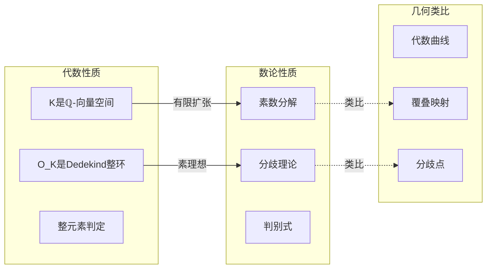
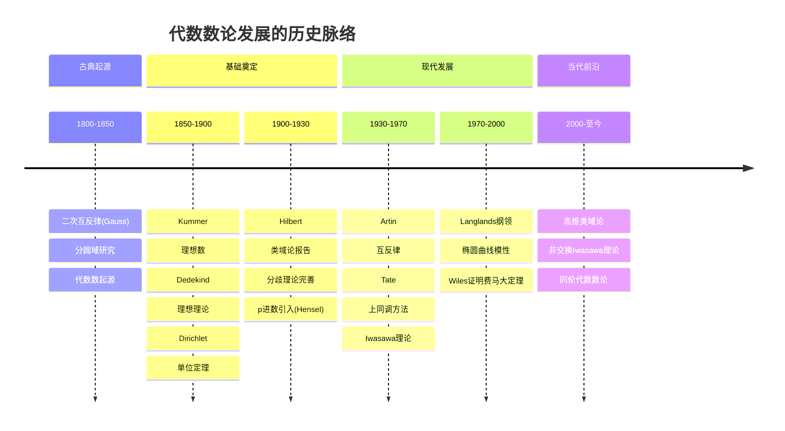

# 代数数论桥梁

> **代数 ↔ 数论：数域与整数环的深层对应**

---

## 目录

1. [核心理论框架](#一核心理论框架)
2. [数域 ↔ 整数环对应](#二数域--整数环对应)
3. [理想类群 ↔ Picard群](#三理想类群--picard群)
4. [Galois群 ↔ 基本群](#四galois群--基本群)
5. [Zeta函数 ↔ Weil猜想](#五zeta函数--weil猜想)
6. [关键定理详解](#六关键定理详解)
7. [历史发展与现代应用](#七历史发展与现代应用)

---

## 一、核心理论框架

### 1.1 代数数论的基本图景

代数数论研究**数域**（ℚ的有限扩张）及其**整数环**的代数性质，通过代数工具解决数论问题。

```mermaid
graph TB
    subgraph NumberTheory[数论侧]
        Q[有理数域 ℚ]
        Z[整数环 ℤ]
        Prime[素数]
    end

    subgraph FieldExtension[域扩张]
        K[数域 K/ℚ]
        OK[整数环 O_K]
        Gal[Galois群 Gal(K/ℚ)]
    end

    subgraph Arithmetic[算术结构]
        Cl[类群 Cl_K]
        Unit[单位群 O_K^×]
        Zeta[Dedekind Zeta函数]
    end

    subgraph Geometry[几何类比]
        Curve[代数曲线]
        Div[除子群]
        Pic[Picard群]
        Fund[基本群]
    end

    Q -->|有限扩张| K
    Z -->|整闭包| OK
    
    K --> OK
    K --> Gal
    OK --> Cl
    OK --> Unit
    K --> Zeta
    
    K -.->|类比| Curve
    Cl -.->|同构| Pic
    Gal -.->|类比| Fund

```

### 1.2 三层对应结构

```

┌─────────────────────────────────────────────────────────────┐
│ 第一层：对象对应                                              │
│  数域 K ⟷ 曲线函数域 k(C)                                    │
│  整数环 O_K ⟷ 正则函数环                                     │
├─────────────────────────────────────────────────────────────┤
│ 第二层：结构对应                                              │
│  理想 ⟷ 除子                                                 │
│  理想类群 ⟷ Picard群                                         │
│  单位群 ⟷ 函数域单位                                         │
├─────────────────────────────────────────────────────────────┤
│ 第三层：不变量对应                                            │
│  Zeta函数 ⟷ Weil Zeta函数                                    │
│  Galois群 ⟷ 基本群                                           │
│  判别式 ⟷ 亏格                                               │
└─────────────────────────────────────────────────────────────┘

```

---

## 二、数域 ↔ 整数环对应

### 2.1 数域与整数环的基本对应

**定义回顾**：
- **数域** K：ℚ的有限扩张，[K:ℚ] < ∞
- **整数环** O_K：K中在ℤ上整的元素全体



### 2.2 素数分解的详细分析

**基本问题**：给定素数 p ∈ ℤ，在O_K中如何分解？

```

分解形式:
(p) = 𝔭₁^{e₁} 𝔭₂^{e₂} ... 𝔭_g^{e_g}

其中:
- 分歧指数 e_i = e(𝔭_i/p)
- 剩余次数 f_i = [O_K/𝔭_i : ℤ/pℤ]
- 基本恒等式: Σ e_i f_i = [K:ℚ]

```

**分解类型**：

| 类型 | 条件 | 几何类比 | 例子 |
|-----|------|---------|------|
| **非分歧** | 所有 e_i = 1 | 覆叠非分歧 | p ∤ disc(K) |
| **完全分裂** | g = [K:ℚ], 所有 e_i = f_i = 1 | 完全分解 | p ≡ 1 (mod 4) 在 ℚ(i) |
| **惯性** | g = 1, e = 1, f = [K:ℚ] | 单点 | p 在 ℚ(√d) 惯性 |
| **完全分歧** | g = 1, e = [K:ℚ] | 完全分歧 | p = 2 在 ℚ(i) |

**具体例子：ℚ(i)/ℚ**

| 素数 p | (p) 在 ℤ[i] 中的分解 | 类型 |
|-------|-------------------|------|
| 2 | (1+i)² | 完全分歧 (e=2) |
| p ≡ 1 (mod 4) | π·π̄ | 完全分裂 |
| p ≡ 3 (mod 4) | (p) 保持素 | 惯性 |

### 2.3 分歧理论与几何类比

```mermaid
graph TB
    subgraph RamificationTheory[分歧理论]
        E[分歧指数 e]
        F[剩余次数 f]
        G[分解群 D_𝔭]
        I[惯性群 I_𝔭]
    end

    subgraph GeometricAnalogue[几何类比]
        Covering[覆叠空间]
        Monodromy[单值群]
        BranchPoint[分歧点]
    end

    subgraph ClassField[类域论]
        RayClass[射线类群]
        Conductor[导子]
        ArtinMap[Artin映射]
    end

    E & F -->|决定| G
    G -->|商| I
    
    Covering -->|分歧| BranchPoint
    Monodromy -->|对应| G
    
    D_𝔭 & I_𝔭 -->|类域论| RayClass
    RayClass -->|Artin| ArtinMap

```

**分歧指数的几何意义**：
- 类比于覆叠映射在分歧点的重数
- 衡量局部"折叠"的程度

**惯性群的几何意义**：
- 保持剩余域不变的Galois子群
- 类比于单值群中的"小环路"

---

## 三、理想类群 ↔ Picard群

### 3.1 类群的代数与几何解释

**定义**：

```

Cl_K = {分式理想} / {主理想}

等价表述：
- Cl_K = Pic(Spec O_K)
- 理想类群衡量 O_K 偏离主理想整环的程度

```

**几何类比**：

| 代数对象 | 数论定义 | 几何对象 | 几何定义 |
|---------|---------|---------|---------|
| **分式理想** | O_K-子模，有限生成 | **Cartier除子** | 局部主除子 |
| **主理想** | (α), α ∈ K^× | **主除子** | div(f), f ∈ K(C)^× |
| **理想类群** | 分式理想/主理想 | **Picard群** | 线丛同构类 |
| **类数 h_K** | |Cl_K| | **Picard群阶** | 簇的不变量 |

### 3.2 精确序列网络

```mermaid
graph TB
    subgraph ExactSequences[正合序列网络]
        ES1[1 → O_K^× → K^× → I_K → Cl_K → 1]
        ES2[0 → Prin → Div → Cl → 0]
        ES3[1 → G_m → Rat^× → Prin → 1]
    end

    subgraph Cohomology[上同调解释]
        H1[H¹(X, O_X^×) ≅ Pic X]
        H0[H⁰(X, K^×/O_X^×) ≅ Div X]
    end

    subgraph Applications[应用]
        FLT[费马大定理]
        BSD[BSD猜想]
        CFT[类域论]
    end

    ES1 -->|层上同调| H1
    ES2 -->|除子理论| H0
    
    H1 -->|理想类| FLT
    H1 -->|Tate-Shafarevich| BSD
    Cl_K -->|类域论| CFT

```

### 3.3 类数与算术性质

**重要定理**：

| 定理 | 陈述 | 意义 |
|-----|------|-----|
| **类数有限** | Cl_K 是有限群 | 理想理论的基础 |
| **Minkowski界** | 每个理想类包含范数 ≤ M_K 的理想 | 可计算性 |
| **Dirichlet单位定理** | O_K^× ≅ μ_K × ℤ^{r₁+r₂-1} | 单位群结构 |
| **解析类数公式** | h_K = ...（涉及Zeta函数） | 代数-分析联系 |

**类数计算示例**：

| 数域 K | 类数 h_K | 说明 |
|--------|---------|------|
| ℚ | 1 | PID |
| ℚ(√-1) = ℚ(i) | 1 | PID |
| ℚ(√-5) | 2 | 非PID |
| ℚ(√-23) | 3 | 非PID |
| ℚ(ζ_p), p<23 | 1 | 分圆域 |
| ℚ(ζ_23) | 3 | 非PID |

---

## 四、Galois群 ↔ 基本群

### 4.1 Galois理论的几何解释

**核心对应**：

```

代数侧:
--------
K/ℚ: Galois扩张
G = Gal(K/ℚ): Galois群
子群 H ≤ G ⟷ 中间域 K^H

几何侧（类比）:
--------------
Y → X: 覆叠空间
π₁(X): 基本群
子群 H ≤ π₁(X) ⟷ 中间覆叠

```

**详细对应表**：

| Galois理论 | 代数性质 | 几何类比 | 拓扑性质 |
|-----------|---------|---------|---------|
| **Galois扩张** | 正规且可分 | **正规覆叠** | 正则覆叠 |
| **Galois群** | 域自同构群 | **覆叠变换群** | Deck变换群 |
| **子群** | 中间域 | **中间覆叠** | 子覆叠 |
| **正规子群** | Galois子扩张 | **正规覆叠** | 正规覆叠 |
| **商群** | 子扩张Galois群 | **覆叠变换商** | Deck变换商 |
| **固定域** | K^H | **覆叠空间** | 对应覆叠 |

### 4.2 étale基本群与Galois群的统一

**Grothendieck的洞察**：

```

对于域 K：
π₁^{ét}(Spec K) ≅ Gal(K^{sep}/K)

更一般地，对于概形 X：
π₁^{ét}(X) 统一了：
- 拓扑基本群（复簇）
- Galois群（域）
- 函数域的基本群（曲线）

```

**étale覆叠 ↔ 有限Galois扩张**：

| étale覆叠 | 代数性质 | 有限扩张 | 数论性质 |
|----------|---------|---------|---------|
| 连通覆叠 | 不可约 | 单扩张 | 本原元素 |
| Galois覆叠 | 正规态射 | Galois扩张 | 正规扩张 |
| 有限覆叠 | 有限态射 | 有限扩张 | [K:ℚ] < ∞ |
| 分歧覆叠 | 分歧态射 | 分歧扩张 | 分歧素数 |

### 4.3 表示论的桥梁作用

```mermaid
graph TB
    subgraph GaloisRep[Galois表示]
        Rho[ρ: Gal(K/ℚ) → GL_n]
        LFunc[Artin L-函数]
    end

    subgroup Representations[表示论]
        Auto[自守表示]
        AutoForm[自守形式]
    end

    subgraph GeometricRep[几何表示]
        LocalSys[局部系统]
        EtaleCoh[平展上同调]
    end

    Rho -->|Langlands| Auto
    Auto -->|几何实现| AutoForm
    
    Rho -->|类比| LocalSys
    LocalSys -->|层论| EtaleCoh
    
    AutoForm <-->|对应| EtaleCoh

```

---

## 五、Zeta函数 ↔ Weil猜想

### 5.1 Dedekind Zeta函数

**定义**：对于数域K，

```

ζ_K(s) = Σ_{𝔞 ⊆ O_K} 1/N(𝔞)^s = ∏_{𝔭} (1 - N(𝔭)^{-s})^{-1}

其中：
- 𝔞 遍历 O_K 的非零理想
- 𝔭 遍历 O_K 的素理想
- N(𝔞) = |O_K/𝔞| 是理想的范数

```

**解析性质**：

| 性质 | 陈述 | 证明者 |
|-----|------|-------|
| **收敛性** | Re(s) > 1 时绝对收敛 | Dirichlet |
| **解析延拓** | 全平面亚纯延拓 | Hecke |
| **函数方程** | ζ_K(s) = ζ_K(1-s) × 伽马因子 | Hecke |
| **极点** | s = 1 处单极点 | 类数公式 |

### 5.2 Weil猜想的数论类比

**有限域上曲线 ↔ 数域的类比**：

| 有限域情形 | 数域情形 | 对应概念 |
|-----------|---------|---------|
| 𝔽_q(C), C/𝔽_q | K/ℚ | 整体域 |
| 点 C(𝔽_{q^n}) | 素理想 | 位(place) |
| Zeta函数 Z(C,T) | Dedekind Zeta ζ_K(s) | 生成函数 |
| Weil猜想 | Riemann假设 | 零点位置 |
| Frobenius | Frobenius元素 | 共轭类 |

**Weil猜想（函数域情形）**：

```

对于光滑射影曲线 C/𝔽_q：

1. 有理性: Z(C,T) ∈ ℚ(T)
2. 函数方程: Z(C, 1/qT) = q^{1-g} T^{2-2g} Z(C,T)
3. Riemann类比: 零点在 |T| = q^{-1/2}

4. Betti数: 与特征0情形一致

证明：
- Dwork (1960): 有理性
- Grothendieck (1965): 函数方程, Betti数
- Deligne (1974): Riemann类比

```

### 5.3 函数域与数域的比较

```mermaid
graph TB
    subgraph FunctionField[函数域]
        FF[𝔽_q(t)]
        CurveF[曲线 C/𝔽_q]
        ZetaF[Zeta函数 Z(C,T)]
        WeilF[Weil猜想 已证]
    end

    subgraph NumberField[数域]
        NF[ℚ]
        SpecZ[Spec ℤ]
        ZetaN[Dedekind Zeta]
        RH[Riemann假设 未证]
    end

    subgraph Analogy[类比]
        Place[位理论]
        Adele[Adele环]
        Global[全局-局部原理]
    end

    FF <-->|类比| NF
    CurveF <-->|算术几何| SpecZ
    ZetaF <-->|类比| ZetaN
    WeilF -.->|未推广| RH
    
    FF & NF -->|统一| Place
    Place -->|限制积| Adele
    Adele -->|Hasse原理| Global

```

---

## 六、关键定理详解

### 6.1 类域论：数论与代数的统一

**Artin互反律（核心定理）**：

```

设 K 是数域，L/K 是有限Abel扩张

存在Artin同态：
ψ_{L/K}: C_K → Gal(L/K)

其中 C_K = 𝔸_K^× / K^× 是idele类群

性质：
1. ψ_{L/K} 是满射
2. ker ψ_{L/K} = N_{L/K}(C_L)
3. 建立子群 ↔ 扩张 的对应

```

**局部-整体对应**：

| 局部类域论 | 整体类域论 |
|-----------|-----------|
| 局部域 K_v | 数域 K |
| K_v^× | C_K (idele类群) |
| Gal(K_v^{ab}/K_v) | Gal(K^{ab}/K) |
| 局部Artin映射 | 整体Artin映射 |
| 范数群 | 范子群 |

### 6.2 Dirichlet单位定理

**定理陈述**：

```

设 K 是数域，r₁ 为实嵌入数，r₂ 为复嵌入对数

则单位群结构为：
O_K^× ≅ μ_K × ℤ^{r₁ + r₂ - 1}

其中：
- μ_K 是K中的单位根群（有限循环群）
- 秩 r = r₁ + r₂ - 1 是调节子(regulator)的维数

```

**几何意义**：
- 单位群是算术簇的"周期"
- 调节子衡量单位格的体积
- 出现在解析类数公式中

### 6.3 解析类数公式

**公式陈述**：

```

ζ_K(s) 在 s = 1 处的留数：

lim_{s→1} (s-1)ζ_K(s) = (2^{r₁} (2π)^{r₂} R_K h_K) / (w_K √|d_K|)

其中：
- h_K = |Cl_K|: 类数

- R_K: 调节子
- w_K = |μ_K|: 单位根数

- d_K: 判别式
- r₁, r₂: 实/复嵌入数

```

**意义**：连接代数不变量（h_K）与解析不变量（ζ_K(s)）

---

## 七、历史发展与现代应用

### 7.1 历史发展脉络



### 7.2 现代应用领域

| 应用领域 | 核心数学 | 代数数论工具 |
|---------|---------|-------------|
| **密码学** | ECC, 配对密码 | 椭圆曲线算术，Tate配对 |
| **编码理论** | 代数几何码 | 曲线有理点，Riemann-Roch |
| **随机数生成** | 伪随机序列 | 有限域理论 |
| **量子计算** | 量子纠错 | 代数函数域 |
| **机器学习** | 代数统计 | 代数整数优化 |

### 7.3 椭圆曲线密码学案例

```mermaid
graph TB
    subgraph ECCMath[椭圆曲线数学]
        EC[椭圆曲线 E: y² = x³ + ax + b]
        GroupLaw[群法则]
        Order[点阶]
        Pairing[Weil配对 e_n]
    end

    subgraph AlgebraicStructure[代数结构]
        Torsion[挠子群 E[n]]
        Frobenius[Frobenius自同态 φ]
        Trace[迹 a_p = p + 1 - #E(𝔽_p)]
    end

    subgroup Crypto[密码学应用]
        ECDH[ECDH密钥交换]
        ECDSA[ECDSA数字签名]
        BLS[BLS短签名]
        IBE[基于身份的加密]
    end

    EC --> GroupLaw
    GroupLaw --> Order
    EC --> Torsion
    Torsion --> Pairing
    Frobenius --> Trace
    
    GroupLaw --> ECDH
    Order --> ECDSA
    Pairing --> BLS
    Pairing --> IBE

```

---

## 八、概念映射汇总

### 8.1 完整对应表

| 数论概念 | 代数结构 | 几何类比 | 统一框架 |
|---------|---------|---------|---------|
| 数域 K | 有限扩张 K/ℚ | 代数曲线 C | 整体域 |
| 整数环 O_K | 整闭包 | 正则函数环 | 结构层 |
| 素理想 𝔭 | 极大理想 | 点 | 位 |
| 理想类群 Cl_K | 分式理想/主理想 | Picard群 | H¹(O_X^×) |
| 单位群 O_K^× | 可逆元 | 全局截面 | H⁰(O_X^×) |
| Galois群 | 域自同构 | Deck变换群 | π₁^{ét} |
| Zeta函数 ζ_K(s) | 生成函数 | Weil Zeta | 迹公式 |
| 分歧理论 | 素理想分解 | 覆叠分歧 | 层理论 |

### 8.2 统计信息

- **核心对应**: 15+ 组
- **关键定理**: 10+ 条
- **历史节点**: 8+ 个
- **应用领域**: 6+ 个
- **开放问题**: 5+ 个

---

*文档版本: 2026年4月 | 代数数论桥梁 | FormalMath项目*
