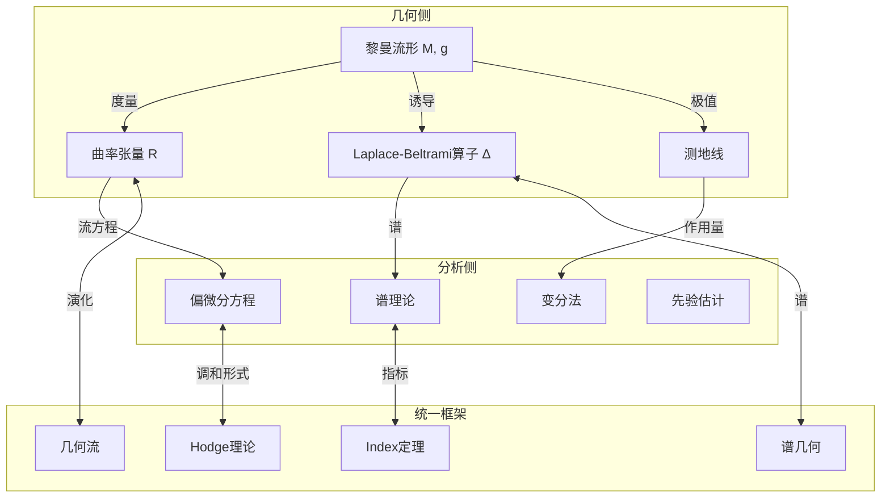
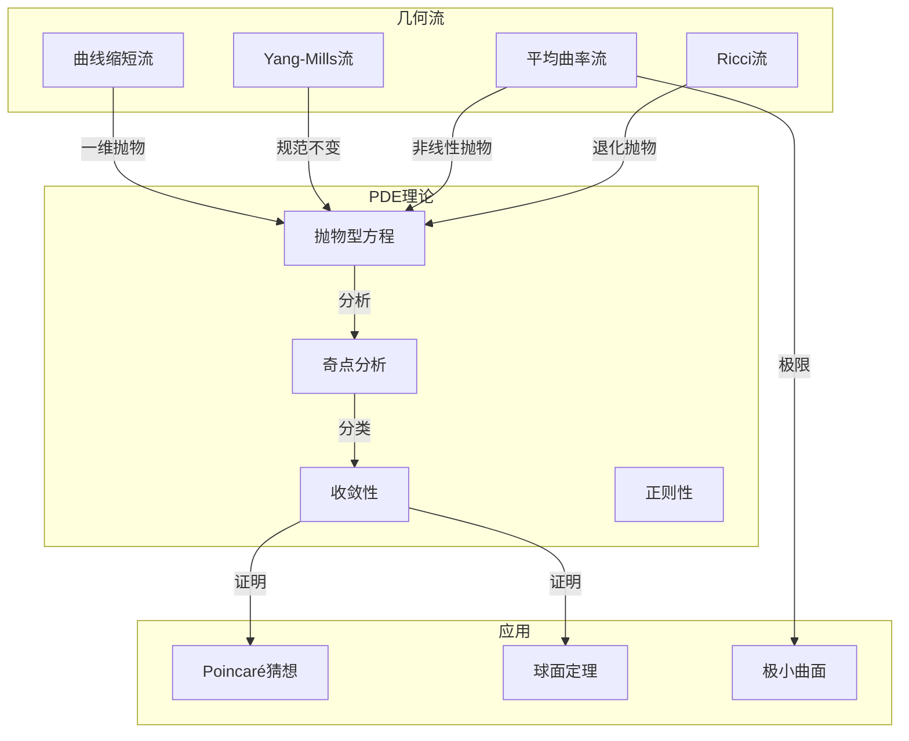
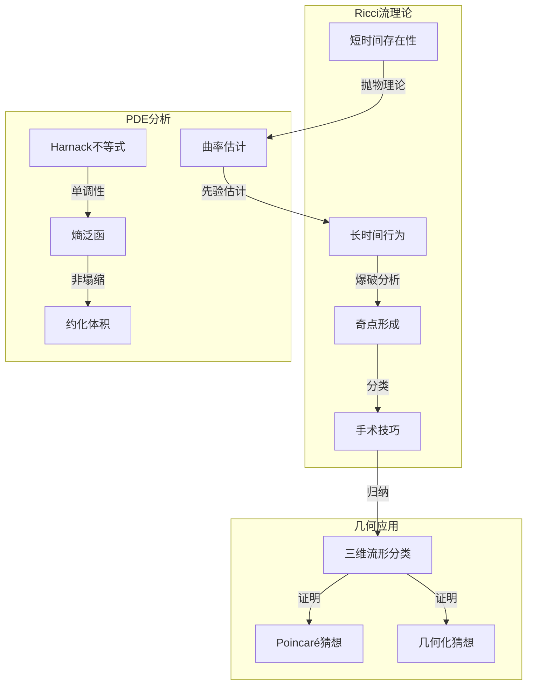
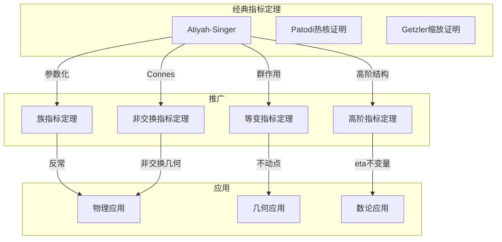
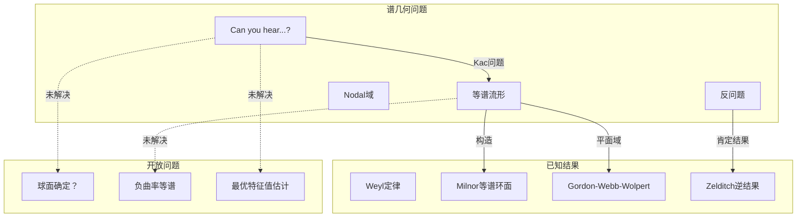
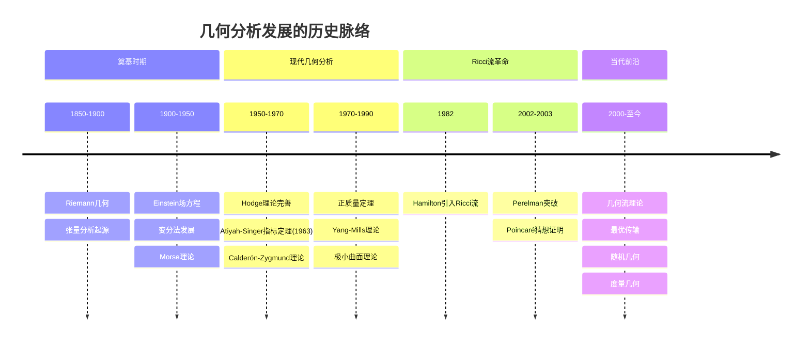
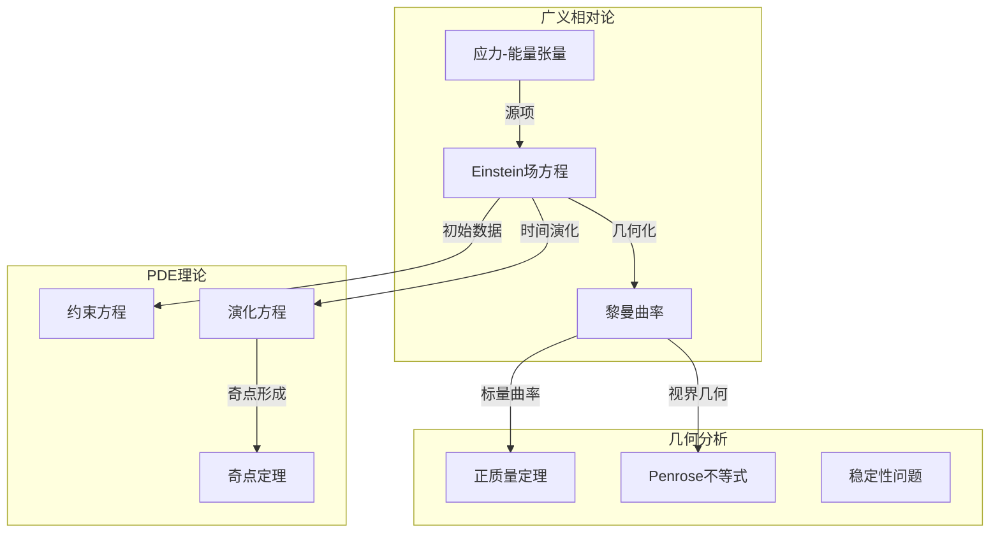

# 几何分析统一

> **几何 ↔ 分析：微分几何与偏微分方程的深层联系**

---

## 目录

1. [核心理论框架](#一核心理论框架)
2. Laplace算子 ↔ Hodge理论
3. 曲率流 ↔ PDE
4. [指标定理：拓扑↔分析统一](#四指标定理拓扑分析统一)
5. [谱几何](#五谱几何)
6. [历史发展与现代应用](#六历史发展与现代应用)

---

## 一、核心理论框架

### 1.1 几何分析的基本哲学

几何分析研究**微分方程**与**微分几何**之间的相互作用：几何结构提供PDE的背景，而PDE的解揭示几何性质。



### 1.2 对应的三层结构

```

┌─────────────────────────────────────────────────────────────┐
│ 第一层：算子对应                                              │
│  几何微分算子 ⟷ 分析微分算子                                  │
│  d（外微分）⟷ 梯度、旋度、散度                                │
│  Δ（Laplace）⟷ 椭圆微分算子                                   │
├─────────────────────────────────────────────────────────────┤
│ 第二层：方程对应                                              │
│  几何方程 ⟷ PDE                                               │
│  测地方程 ⟷ 测地流方程                                        │
│  曲率条件 ⟷ 曲率流方程                                        │
├─────────────────────────────────────────────────────────────┤
│ 第三层：不变量对应                                            │
│  拓扑不变量 ⟷ 解析不变量                                      │
│  示性数 ⟷ 指标                                                │
│  体积 ⟷ 谱渐近                                                │
└─────────────────────────────────────────────────────────────┘

```

---

## 二、Laplace算子 ↔ Hodge理论

### 2.1 Laplace-Beltrami算子的几何与分析

**定义**：在黎曼流形 (M, g) 上，Laplace-Beltrami算子定义为：

```

Δ = dδ + δd

其中：
- d: 外微分（提升次数）
- δ = (-1)^{n(p+1)+1} * d *: 余微分（降低次数）
- *: Hodge星算子

```

**局部坐标表达式**：

```

Δf = -1/√|g| ∂_i(√|g| g^{ij} ∂_j f)

特征：
- 二阶椭圆微分算子
- 自伴（关于L²内积）
- 非负定

```

### 2.2 Hodge分解定理

**定理陈述**：设M为紧致定向黎曼流形，则：

```

Ω^p(M) = H^p(M) ⊕ d(Ω^{p-1}(M)) ⊕ δ(Ω^{p+1}(M))

正交直和分解，其中：
- H^p(M) = ker Δ|_{Ω^p} 是调和p-形式空间

- d(Ω^{p-1}): 恰当形式
- δ(Ω^{p+1}): 余恰当形式

```

**几何意义**：每个de Rham上同调类有唯一的调和代表元

```mermaid
graph TB
    subgraph Forms[微分形式]
        Omega[Ω^p(M)]
        Exact[d(Ω^{p-1})]
        Coexact[δ(Ω^{p+1})]
        Harmonic[H^p(M)]
    end

    subgraph Cohomology[上同调]
        DeRham[H^p_{dR}(M)]
        Rep[调和代表元]
    end

    subgraph Isomorphism[同构]
        HodgeIso[H^p(M) ≅ H^p_{dR}(M)]
    end

    Omega -->|分解| Exact
    Omega -->|分解| Coexact
    Omega -->|分解| Harmonic
    
    Harmonic <-->|代表| Rep
    Rep -->|同构| DeRham
    
    HodgeIso -->|联系| Harmonic
    HodgeIso -->|联系| DeRham

```

### 2.3 详细对应表

| 几何概念 | 代数/拓扑定义 | 分析对应 | 分析定义 |
|---------|-------------|---------|---------|
| **de Rham上同调** | H^k_{dR}(M) = ker d / im d | **调和形式** | H^k(M) = ker Δ_k |
| **Poincaré对偶** | H^k ≅ H^{n-k} | **Hodge对偶** | *: H^k → H^{n-k} |
| **相交配对** | ∫_M α ∧ β | **L²内积** | ⟨α, β⟩ = ∫_M α ∧ *β |
| **Betti数** | b_k = dim H^k_{dR} | **调和维数** | dim ker Δ_k |
| **Euler示性数** | χ(M) = Σ (-1)^k b_k | **指标** | index(d + δ) |

### 2.4 Hodge星算子的统一作用

**Hodge星算子**：* : Ω^p(M) → Ω^{n-p}(M)

```mermaid
graph LR
    subgraph Forms2[形式空间]
        Omega0[Ω^0]
        Omega1[Ω^1]
        Omega2[Ω^2]
        OmegaN[Ω^n]
    end

    subgraph HodgeStar[Hodge星算子]
        Star1[*: Ω^p → Ω^{n-p}]
    end

    subgraph Duality[对偶关系]
        Poincare[Poincaré对偶]
        HodgeDual[Hodge对偶]
    end

    Omega0 <-->|*| OmegaN
    Omega1 <-->|*| OmegaN-1
    Omega2 <-->|*| OmegaN-2
    
    Star1 --> Poincare
    Star1 --> HodgeDual

```

**关键性质**：
- **在函数上（0-形式）**: *1 = dV（体积形式）
- **在n-形式上**: *(f dV) = f
- **对合性**: ** = (-1)^{p(n-p)} id

---

## 三、曲率流 ↔ PDE

### 3.1 Ricci流的PDE解释

**Ricci流方程**：

```

∂_t g_{ij} = -2 R_{ij}

其中 R_{ij} 是Ricci曲率张量

类比热方程：
∂_t u = Δu （热扩散）
∂_t g = -2 Ric （曲率扩散）

```

**PDE特征**：
- 几何退化的抛物型方程组
- 非线性（曲率依赖于度量）
- 可能在有限时间产生奇点

### 3.2 几何流的PDE分类



### 3.3 主要几何流对应表

| 几何流 | 演化方程 | PDE类型 | 奇点类型 | 应用 |
|-------|---------|--------|---------|------|
| **Ricci流** | ∂_t g = -2Ric | 退化抛物 | 球面/颈缩/坍缩 | Poincaré猜想 |
| **平均曲率流** | ∂_t X = H·n | 抛物 | 颈缩/II型 | 极小曲面 |
| **Yang-Mills流** | ∂_t A = -d_A^*F_A | 抛物 | 爆破 | 规范理论 |
| **曲率缩短流** | ∂_t κ = κ² | 抛物 | 爆破 | 曲线演化 |
| **Willmore流** | ∂_t X = -δW | 四阶抛物 | 复杂 | 弹性曲面 |

### 3.4 Ricci流的Hamilton-Perelman理论



**核心工具**：
- **Hamilton的熵**: 单调性公式
- **Perelman的W-泛函**: L-距离与约化体积
- **比较几何**: 体积比较与塌缩理论

---

## 四、指标定理：拓扑↔分析统一

### 4.1 Atiyah-Singer指标定理

**定理陈述**：设 D: Γ(E) → Γ(F) 是椭圆微分算子，则：

```

index(D) = dim ker D - dim coker D
         = ∫_M ch(σ(D)) ∧ Td(TM)

左边：分析量（解空间维数差）
右边：拓扑量（示性类积分）

```

**意义**：拓扑不变量可以通过分析计算，反之亦然

```mermaid
graph TB
    subgraph AnalysisSide[分析侧]
        Elliptic[椭圆算子 D]
        Kernel[核 ker D]
        Cokernel[余核 coker D]
        AnalyticIndex[分析指标]
    end

    subgraph TopologicalSide[拓扑侧]
        Symbol[主象征 σ(D)]
        Chern[陈特征 ch]
        Todd[Todd类 Td]
        TopologicalIndex[拓扑指标]
    end

    subgraph Unification[统一]
        AS[Atiyah-Singer定理]
        Equality[指标相等]
    end

    Elliptic -->|求解| Kernel
    Elliptic -->|求解| Cokernel
    Kernel & Cokernel -->|维数差| AnalyticIndex
    
    Symbol -->|示性类| Chern
    Chern & Todd -->|积分| TopologicalIndex
    
    AnalyticIndex <-->|AS定理| TopologicalIndex
    AS -->|证明| Equality

```

### 4.2 经典指标公式的统一

**Atiyah-Singer定理包含以下经典结果**：

| 特例 | 算子 D | 拓扑公式 | 经典定理 |
|-----|-------|---------|---------|
| **Gauss-Bonnet** | d + d* 在偶形式上 | Euler类积分 | χ(M) = ∫ e(M) |
| **Hirzebruch-Riemann-Roch** | ∂̄ + ∂̄* | Todd类积分 | χ(E) = ∫ ch(E)Td(M) |
| **符号差定理** | d + d* 在中维形式上 | L-类积分 | sign(M) = ∫ L(M) |
| **Dirac指标** | Dirac算子 | Â-类积分 | index(D̸) = ∫ Â(M) |

### 4.3 指标定理的现代推广



---

## 五、谱几何

### 5.1 Laplace谱的几何意义

**谱问题**：给定紧致黎曼流形M，研究Laplace算子的特征值：

```

Δφ_k = λ_k φ_k,  0 = λ_0 ≤ λ_1 ≤ λ_2 ≤ ... → ∞

问题：谱 {λ_k} 在多大程度上决定几何？

```

**Weyl渐近律**：

```

N(λ) := #{k : λ_k ≤ λ} ~ (Vol(M)/(4π)^{n/2}Γ(n/2+1)) λ^{n/2}

渐近公式显示：
- 谱渐近决定体积
- 高阶项包含曲率信息

```

### 5.2 谱不变量与几何量

| 谱不变量 | 几何/分析解释 | 决定的几何量 |
|---------|-------------|------------|
| **λ_0 = 0** | 常数函数 | 连通分支数 |
| **λ_1 > 0** | 第一非零特征值 | 等周常数、连通性 |
| **Weyl项** | 主渐近项 | 体积 |
| **热迹展开** | Tr(e^{-tΔ}) ~ ... | 曲率不变量 |
| **行列式 det'Δ** | 泛化行列式 | 解析挠率 |

### 5.3 谱几何的核心问题



**关键结果**：
- **Weyl定律**: 谱渐近确定维数和体积
- **热核展开**: 谱确定曲率积分（局部不变量）
- **等谱非等距**: Milnor环面（16维）
- **平面等谱域**: Gordon-Webb-Wolpert鼓

---

## 六、历史发展与现代应用

### 6.1 几何分析的历史脉络



### 6.2 关键人物贡献

| 数学家 | 贡献 | 跨分支工作 |
|-------|------|-----------|
| **Riemann** | Riemann几何 | 几何与分析结合的开端 |
| **Poincaré** | Poincaré对偶 | 拓扑-分析联系 |
| **Hodge** | Hodge理论 | 调和形式与上同调 |
| **Atiyah-Singer** | 指标定理 | 拓扑-分析统一 |
| **Calabi-Yau** | Calabi猜想 | 复几何-PDE |
| **Hamilton** | Ricci流 | 几何-PDE |
| **Perelman** | Ricci流奇点分析 | 证明Poincaré猜想 |
| **Schoen-Yau** | 正质量定理 | 几何分析应用 |
| **Donaldson** | 规范理论 | 几何-拓扑联系 |

### 6.3 现代应用领域

| 应用领域 | 核心数学 | 几何分析工具 |
|---------|---------|-------------|
| **广义相对论** | Einstein方程 | Ricci曲率、质量估计 |
| **规范场论** | Yang-Mills方程 | 瞬子、模空间 |
| **材料科学** | 弹性理论 | Willmore泛函 |
| **图像处理** | 曲率驱动扩散 | 几何流 |
| **机器学习** | 流形学习 | Laplace谱、测地距离 |
| **医学成像** | 形状分析 | 谱几何、Ricci流 |

### 6.4 广义相对论中的应用



---

## 七、概念映射汇总

### 7.1 完整对应表

| 几何概念 | 几何定义 | 分析对应 | 分析定义 |
|---------|---------|---------|---------|
| **调和形式** | ker Δ | **椭圆方程解** | Δu = 0 |
| **de Rham上同调** | ker d / im d | **调和形式空间** | ker Δ |
| **曲率** | R(X,Y)Z | **非线性项** | 方程中的非线性 |
| **测地线** | 极值曲线 | **测地流** | Hamilton流 |
| **体积** | ∫ dV | **谱渐近** | Weyl定律主项 |
| **示性数** | 拓扑不变量 | **指标** | dim ker - dim coker |
| **极小子流形** | 平均曲率 H = 0 | **极小曲面方程** | 非线性椭圆PDE |

### 7.2 统计信息

- **核心对应**: 12+ 组
- **关键定理**: 8+ 条
- **几何流**: 6+ 种
- **应用领域**: 7+ 个
- **历史节点**: 10+ 个

---

*文档版本: 2026年4月 | 几何分析统一 | FormalMath项目*
